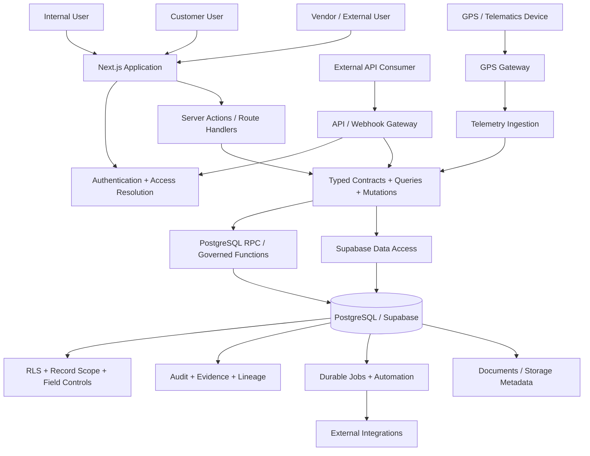

# CargoGrid

**CargoGrid** is a multi-tenant, modular enterprise logistics ERP and operating platform built for freight forwarding, cargo, trucking, warehousing, distribution, project logistics, procurement, finance, HR, customer self-service, automation, and enterprise intelligence.

> **One Platform. Every Shipment. Complete Visibility.**

CargoGrid is designed as a shared SaaS product with strict tenant isolation, governed business workflows, auditable financial and operational state transitions, configurable enterprise controls, and reusable platform engines instead of disconnected module-specific implementations.

---

## Current Build Status

CargoGrid has completed its main capability-build phases through **Phase 9**.

The product is no longer in prototype or MVP-only stage. The core ERP, logistics execution, finance, procurement, HRIS, customer portal, loyalty, reporting, automation, integration, and enterprise-intelligence capabilities are implemented in the repository.

The next major stage is **Full-System Hardening**.

| Phase | Scope | Current status |
|---|---|---|
| Phase 0 | Discovery and Foundation | **Verified** |
| Phase 1 | Platform Core | **Verified** |
| Phase 2 | Commercial | **Verified** |
| Phase 3 | Operations | **Verified** |
| Phase 4 | Finance | **Verified** |
| Phase 5 | Advanced TMS and WMS | **Verified** |
| Phase 6 | Procurement and Vendor Management | **Verified** |
| Phase 7 | HRIS and Ticketing | **Verified** |
| Phase 8 | Customer Portal and Loyalty | **Verified** |
| Phase 9 | Intelligence, Automation and Enterprise Expansion | **Verified** |
| Full-System Hardening | Cross-module production hardening | **Next stage** |
| Release Candidate / Go-Live | Production-readiness closure | **Not yet claimed** |

### What `Verified` means

A verified phase means its scoped capabilities have been implemented and subjected to the repository's required combination of code review, typed service validation, database migration testing, authorization/RLS testing, regression testing, integration checks, and closure verification.

It does **not** mean CargoGrid is already GA, pilot-certified, penetration-tested at production scope, or approved for unrestricted production use.

---

## Live Platform Validation

The complete migration chain has been applied to a hosted Supabase environment using PostgreSQL 17.

Current validated database state:

| Metric | Verified state |
|---|---:|
| Database migrations | **306 / 306 applied** |
| Tables | **603** |
| PostgreSQL routines | **~2,900** |
| Views | **38** |
| Custom types | **17** |
| Tables with RLS enabled | **568** |
| RLS policies | **448** |
| Migration ledger | **306 rows, in sync** |
| Database test files via real psql harness | **229 / 229 passed** |
| Hosted-environment application-code security advisor findings | **0** |

The hosted validation also exposed environment differences that local CI alone could not detect, including extension schema resolution, PostgreSQL `search_path`, real Supabase `auth.users` column types, and RLS planner behavior. Those defects were repaired at their source and the local database harness was updated to better mirror hosted Supabase behavior.

---

# Product Architecture

CargoGrid follows a shared application and shared database architecture with tenant-scoped data and multiple authorization layers.



## Core architectural principles

CargoGrid is built around the following rules:

- one shared product codebase
- tenant-scoped records in a shared PostgreSQL architecture
- Row-Level Security as a primary authorization boundary
- explicit role, permission, record-scope, and field-level controls
- no security assumption based only on hidden UI elements
- additive, versioned database migrations
- deterministic business-rule evaluation where practical
- exact decimal handling for financial values
- idempotent mutation patterns for retry-sensitive operations
- explicit state machines for controlled business transitions
- maker-checker / approval controls for sensitive workflows
- durable audit evidence for material changes
- source and transaction lineage across connected workflows
- reusable workflow, approval, status, numbering, notification, document, and background-job engines
- no silent mutation of financial, legal, workflow, or operational state
- AI-assisted output must remain governed and must not autonomously post consequential domain changes

---

# Application Surfaces

CargoGrid has several application surfaces rather than one monolithic UI.

## Tenant application

Tenant users operate inside:

```text
app/(tenant)/[tenantSlug]/
```

Major tenant workspaces include:

- Commercial
- Operations
- Finance
- Procurement
- HRIS
- Helpdesk and Ticketing
- Customer Portal administration
- Customer Portal user experiences
- Loyalty
- Analytics
- Dashboards
- Reports
- Scheduled Reports
- Saved Views
- Automation Rules
- Integrations
- Knowledge Base
- Tenant Administration

## Public application

Public and pre-authentication experiences live under:

```text
app/(public)/
```

These include login and selected public/external journeys such as shipment tracking and controlled external workflows.

## Supreme Administration

Platform-level administration is separated from normal tenant operations:

```text
app/(supreme)/
```

This surface is intended for controlled SaaS/platform administration rather than tenant business operations.

## API and webhook surfaces

CargoGrid also exposes governed server-side integration surfaces under:

```text
app/api/
```

The API architecture includes authenticated `/api/v1` resources, scoped API keys, idempotent write conventions, request correlation, audit evidence, permission evaluation, webhook handling, and provider-specific adapters.

---

# Implemented Capability Domains

## 1. Platform Core

Platform Core provides the shared control plane used by every downstream module.

Implemented capabilities include:

- multi-tenant architecture
- tenant provisioning and lifecycle
- entitlement management
- Supabase authentication integration
- tenant identity linkage
- organization and branch hierarchy
- users and memberships
- roles and permissions
- RBAC evaluation
- Row-Level Security
- record-level access
- field-level masking and disclosure controls
- support and impersonation access governance
- audit trail
- white-label configuration
- custom-domain foundation
- localization
- master-data management
- configuration engine
- workflow engine
- approval engine
- status engine
- numbering engine
- custom form / field engine
- notification engine
- document and file engine
- API-key primitives
- webhook primitives
- import/export job framework
- durable background-job framework
- feature flags
- PostGIS spatial foundation
- Tenant Admin portal
- Supreme Admin portal

---

## 2. Commercial and CRM

The Commercial domain covers the journey from lead generation through accepted business and operational handoff.

Implemented capabilities include:

- lead management
- prospect lifecycle
- contact directory
- customer activity tracking
- CRM sales planning
- opportunity management
- costing requests
- costing responses
- vendor-rate lookup
- margin calculation
- margin governance and approval
- quotation drafting
- quotation versioning
- quotation approval
- customer quotation decision
- customer/account conversion
- contract management
- credit checking
- credit override workflows
- account hold/release controls
- sales targets and achievement
- commercial dashboards
- commercial reports
- duplicate detection
- customer intelligence
- Job Order handoff
- transaction/source lineage across the commercial chain

Representative flow:

```text
Lead
  -> Prospect
  -> Opportunity
  -> Costing
  -> Margin Review
  -> Quotation
  -> Approval
  -> Customer Acceptance
  -> Account / Contract / Credit
  -> Job Order Handoff
```

---

## 3. Operations

The Operations domain provides shipment execution and operational control.

Implemented capabilities include:

- Job Orders
- Shipment Orders
- canonical shipment lifecycle
- land, air, and sea shipment baselines
- operational milestones
- ETA and shipment-status projection
- exception management
- escalation
- dispatch
- dispatch board
- resource assignment
- shipment document requirements
- electronic Proof of Delivery
- actual operational cost capture
- estimated-versus-actual cost variance
- job profitability
- billing-readiness evaluation
- public shipment tracking
- transaction lineage
- operational dashboards
- operational reporting
- capacity visibility

---

## 4. Advanced TMS and Fleet

Advanced transport-management capabilities extend the core Operations module.

Implemented capabilities include:

- fleet master
- vehicle and driver assignment
- dispatch orchestration
- fleet control tower
- vehicle map
- vehicle signals
- canonical telemetry model
- GPS and telematics ingestion
- tracking-health evaluation
- capacity utilization
- geospatial foundation
- shipment/vehicle tracking arbitration
- tracking exceptions
- operational recovery logic
- performance/load-test workloads for selected transport paths

CargoGrid also includes a standalone:

```text
gps-gateway/
```

The GPS gateway is a separate Node.js service for device/network ingestion concerns, including protocol processing, buffering, health behavior, logging, and forwarding canonical telemetry into CargoGrid.

---

## 5. Warehouse Management System

The WMS domain provides governed inventory execution rather than a simple stock table.

Implemented capabilities include:

- warehouse master concepts
- inbound order flow
- receiving
- inventory ledger
- inventory movements
- putaway
- bin/racking logic
- inventory balance control
- lot identity
- serial identity
- outbound demand
- picking
- outbound fulfillment
- customer inventory visibility
- warehouse-order customer workflows
- concurrency-safe claim patterns for selected warehouse tasks
- performance/load-test workloads for inventory and warehouse claims

---

## 6. Finance

Finance is implemented as a full accounting and financial-control domain rather than only shipment billing.

Implemented capabilities include:

- finance configuration
- Chart of Accounts
- fiscal periods
- currencies
- exchange rates
- tax baseline and tax-rule governance
- Accounts Receivable
- invoicing
- receipts
- receipt allocation
- Accounts Payable
- vendor bills
- settlements
- subledger
- double-entry journals
- posted-journal integrity
- draft/posted state control
- reversal and adjustment
- period locking
- idempotent posting
- reconciliation
- AR/AP aging
- cash and bank
- finance corrections
- job profitability
- customer profitability
- service profitability
- finance dashboard
- finance reporting
- field-level financial-data security

Representative accounting control:

```text
Operational / Commercial Source
        -> Billing Readiness
        -> Financial Document
        -> Approval / Posting
        -> Subledger / Journal
        -> Receipt / Settlement
        -> Reconciliation
```

---

## 7. Procurement and Vendor Management

The Procurement domain covers vendor governance and controlled sourcing workflows.

Implemented capabilities include:

- vendor master and onboarding
- external vendor registration
- vendor assessment
- assessment templates
- vendor compliance
- compliance requirements
- approval queues
- governed procurement decisions
- vendor-rate support
- RFQ-related external interaction
- vendor performance evidence
- procurement workflow controls
- procurement reporting and supporting views

---

## 8. HRIS

CargoGrid includes an internal HR operating domain.

Implemented capabilities include:

- employee master record
- employee lifecycle
- positions
- organizational assignment
- attendance
- attendance policies
- employee attendance self-service
- leave management
- leave types
- overtime/timesheet-related controls
- KPI and performance
- employee-facing HR journeys
- administrative HR journeys
- controlled HR data access and field protection

---

## 9. Ticketing, Helpdesk and Knowledge

Implemented service-management capabilities include:

- internal ticketing
- helpdesk workflows
- customer tickets
- employee-related ticketing integration
- knowledge-base surfaces
- ticket attachments/document governance
- role-appropriate support visibility
- helpdesk administration

---

## 10. Customer Portal

The Customer Portal is a real tenant/customer access layer, not a separate duplicated application backend.

Implemented customer capabilities include:

- portal identity and user administration
- customer dashboard
- customer profile
- quote visibility and customer quote interaction
- booking requests
- shipment visibility
- tracking
- customer documents
- customer inventory
- warehouse orders
- invoices
- receipts
- support tickets
- customer alerts
- customer-scoped API keys
- governed customer-account scope
- default-deny isolation from internal tenant-only data

The portal reuses canonical source-domain data and governed APIs instead of copying Finance, WMS, or Operations into parallel customer-owned systems.

---

## 11. Loyalty

The Loyalty domain is backed by a governed ledger and approval model.

Implemented capabilities include:

- loyalty account
- points earning
- points ledger
- point-lot expiry
- reversals
- manual adjustment request
- maker-checker adjustment approval
- loyalty tiers
- tier qualification
- loyalty benefits
- reward catalog
- redemption
- redemption controls
- fraud/risk rules
- liability/reconciliation support
- customer loyalty summary

---

## 12. Reporting, Analytics and Dashboards

Enterprise reporting capabilities include:

- reporting engine
- operational reports
- commercial reports
- finance reports
- configurable dashboards
- analytics
- saved views
- scheduled reports
- export controls
- pagination utilities
- CSV export sanitization
- GraphQL complexity controls
- request-context and permission utilities

---

## 13. Automation and Integration Hub

CargoGrid contains a governed automation and provider-integration foundation.

Implemented capabilities include:

- automation-rule engine
- durable job queue
- integration catalog
- integration connection governance
- credential/evidence controls
- integration health
- outbound webhooks
- inbound webhook primitives
- API-key management
- customer API
- vendor API
- public API foundations
- n8n integration support
- maps / geocoding integration
- GPS / telematics integration
- carrier / port / airport / customs integration
- email / WhatsApp / SMS integration
- bank / payment / e-invoice / tax integration
- external accounting / HR integration
- provider-specific ownership and sync evidence

Provider integrations remain explicit and domain-governed rather than being allowed to autonomously mutate authoritative financial, legal, HR, or operational state.

---

## 14. AI-Assisted and Enterprise Intelligence

AI functionality is built behind a governed provider boundary.

Implemented capabilities include:

- AI provider governance
- governed AI request ledger
- AI-assisted quotation
- OCR document processing
- predictive ETA assistance
- optimization assistance
- fraud/risk assistance
- forecasting and recommendation assistance
- confidence/evidence handling
- human approval controls for consequential AI output
- AI cost metering
- prompt/output governance
- defensive parsing of provider output

Core rule:

> AI may assist, recommend, extract, classify, or draft. It must not autonomously perform consequential domain posting where human approval or authoritative business rules are required.

---

## 15. Enterprise Security, Governance and Scale Foundations

Implemented enterprise capabilities include:

- enterprise IAM foundations
- SSO / SAML / OAuth / SCIM governance
- MFA and session controls
- step-up authorization foundation
- IP restriction configuration
- emergency/break-glass controls
- advanced audit and impersonation evidence
- observability
- SLO definitions
- alert routing
- incident deduplication
- data retention
- archival governance
- legal hold
- dedicated-deployment qualification
- region assignment
- data-residency capability matrix
- workload/capacity budgets
- scaling recommendations
- disaster-recovery evidence
- enterprise support entitlements
- enterprise onboarding checklist

---

# Server Architecture

CargoGrid separates user-interface code from business contracts and database mutations.

Representative path:

```text
UI / Form
  -> Next.js Server Action or Route Handler
  -> Request / Tenant Access Resolution
  -> Typed Zod Contract
  -> server/query or server/mutation
  -> Supabase RPC / governed database operation
  -> PostgreSQL authorization + business rules
  -> RLS / audit / lineage / state transition
  -> typed response back to UI
```

Core directories:

```text
server/
  contracts/   # Input/output schemas and domain contracts
  mutations/   # Typed mutation wrappers
  queries/     # Typed read/query wrappers
```

This means material business rules are not intentionally entrusted to browser-only state.

---

# Database and Security Model

## Tenant isolation

Tenant isolation is enforced using multiple layers:

- tenant-scoped records
- membership checks
- role and permission evaluation
- Row-Level Security
- record-scope rules
- customer-user default-deny boundaries
- field-level masking
- Security Definer functions with controlled `search_path`
- explicit cross-tenant validation on sensitive mutations

## Sensitive actions

Sensitive operations use combinations of:

- explicit permissions
- maker-checker separation
- approval workflows
- expected-version / stale-version protection
- row locks
- advisory locks
- idempotency keys
- legal-hold checks
- audit events
- step-up authorization where currently wired

## Auditability

Material workflows preserve evidence through combinations of:

- audit logs
- request correlation
- transaction lineage
- immutable or controlled history records
- version records
- approval records
- integration evidence
- provider request/outcome records
- job execution history

---

# Technology Stack

## Application

- **Next.js 16.2.11**
- **React 19.2.7**
- **TypeScript 5.9.3**
- **Tailwind CSS 4.3.3**
- **Radix UI**
- **ECharts 6**
- **Leaflet**
- **Zod 4**

## Data and Platform

- **Supabase**
- **PostgreSQL 17**
- **Row-Level Security**
- **PostGIS**
- **Supabase Auth**
- **Supabase Storage / document primitives**
- **PostgreSQL RPC and governed functions**

## Engineering

- **Node.js >= 22.11**
- **pnpm 10.33**
- **ESLint 9**
- **Node Test Runner**
- **Playwright**
- **axe-core**
- **GitHub Actions**
- **Vercel target architecture**
- **Docker / disposable PostgreSQL test infrastructure**

---

# Repository Structure

Representative structure:

```text
cargogrid.app/
├── app/
│   ├── (public)/
│   ├── (tenant)/
│   │   └── [tenantSlug]/
│   │       ├── admin/
│   │       ├── analytics/
│   │       ├── automation-rules/
│   │       ├── commercial/
│   │       ├── customer-*/
│   │       ├── dashboards/
│   │       ├── finance/
│   │       ├── helpdesk/
│   │       ├── hris/
│   │       ├── integrations/
│   │       ├── operations/
│   │       ├── procurement/
│   │       ├── reports/
│   │       └── tickets/
│   ├── (supreme)/
│   └── api/
│       ├── v1/
│       └── webhooks/
│
├── components/
├── docs/
│   ├── adr/
│   ├── architecture/
│   ├── blueprint/
│   ├── build-log/
│   ├── runtime/
│   ├── security/
│   └── standards/
│
├── e2e/
├── gps-gateway/
├── lib/
├── scripts/
│   ├── data-classification/
│   ├── db-tests/
│   ├── docs/
│   ├── env/
│   ├── feature-flags/
│   ├── git/
│   ├── jobs/
│   ├── load-tests/
│   ├── observability/
│   ├── product-analytics/
│   ├── security/
│   ├── standards/
│   └── verification/
│
├── server/
│   ├── contracts/
│   ├── mutations/
│   └── queries/
│
├── supabase/
│   ├── config.toml
│   └── migrations/
│
└── tests/
```

---

# Local Development

## Prerequisites

Install:

- Node.js `>=22.11.0`
- pnpm `10.33.0`
- Docker
- Supabase CLI

## Setup

```bash
pnpm install
cp .env.example .env.local
npx supabase start
pnpm run preflight
```

Populate `.env.local` with the local Supabase values returned by the CLI.

Do not use shared or production credentials for normal local development.

## Start the application

```bash
pnpm exec next dev
```

---

# Verification Commands

Core quality gates:

```bash
pnpm run typecheck
pnpm run lint
pnpm run test
pnpm run test:coverage
pnpm run db:test
pnpm run test:e2e
pnpm run security:check
pnpm run security:audit
pnpm run data-classification:check
pnpm run threat-model:check
pnpm run standards:check
pnpm run docs:check
pnpm run git:check
pnpm run git:check-paths
```

Production build:

```bash
pnpm exec next build
```

---

# Testing Strategy

CargoGrid currently uses several complementary test layers.

## Type and service tests

The TypeScript service layer is validated with:

- contract parsing tests
- query tests
- mutation tests
- error-classification tests
- authorization behavior tests
- regression tests

## Database tests

Database tests run against disposable PostgreSQL/PostGIS infrastructure and validate:

- complete migration replay
- RLS
- cross-tenant isolation
- permission enforcement
- state transitions
- maker-checker controls
- SQL-level bypass attempts
- idempotency
- concurrency behavior
- data-integrity constraints
- security regression guards

Current full real-harness result:

```text
229 / 229 database test files passed
306 / 306 migrations applied
```

## Load and concurrency tests

The repository includes targeted workload tooling for areas such as:

- GPS telemetry
- durable job claiming
- hybrid tracking arbitration
- inventory movement
- WMS picking claims
- WMS putaway claims
- pagination/query plans
- recovery checks

## Browser E2E

Playwright and axe-core are wired and real UI routes are exercised.

However, browser-level coverage is still materially smaller than the implemented product surface. Full authenticated, cross-module, production-like business-journey E2E testing belongs to the Full-System Hardening stage.

---

# Current Production-Readiness Position

CargoGrid should currently be described as:

> **Feature-rich and internally verified across the main product phases, with hosted database validation completed, but not yet declared production-ready or GA.**

The following work still matters before a responsible production-readiness claim.

## Full-system hardening priorities

1. broaden real authenticated browser E2E coverage across critical cross-module journeys
2. perform full-system load, concurrency, endurance, and performance validation
3. complete production-scale security and penetration testing
4. complete recovery / DR rehearsal against the intended production topology
5. validate external provider integrations under production-like failure and retry conditions
6. complete operational UAT across realistic tenant roles
7. validate monitoring, alerting, support, backup, and incident-response runbooks
8. close material open security/control residuals before release-candidate approval

## Known material residuals

The canonical source remains:

```text
docs/runtime/KNOWN_ISSUES.md
```

Important current examples include:

- **IP restriction enforcement:** the IP policy/evaluator exists and works when called, but universal request-path enforcement is not yet wired across real business mutations. This remains a material hardening item.
- **Step-up authorization:** high-risk step-up enforcement is implemented for several sensitive enterprise actions, but Integration Hub connection creation still has a disclosed remaining wiring gap.
- **Region/data-residency enforcement:** governance and capability matrices exist, but not every data-plane execution path currently consumes those controls.
- **Browser E2E breadth:** browser-level regression coverage does not yet match the size of the implemented product.
- **Production-scale verification:** broad penetration, endurance, performance, UAT, and operational-readiness evidence remains part of the next hardening stage.

No README statement should be interpreted as replacing the detailed issue register or closure reports.

---

# Critical Business Journeys for Full-System Hardening

The next validation stage should test CargoGrid as one connected system rather than as isolated modules.

Recommended critical journeys include:

```text
Lead
 -> Opportunity
 -> Costing
 -> Quotation
 -> Approval
 -> Acceptance
 -> Job Order
 -> Shipment
 -> Dispatch / Tracking
 -> Actual Cost
 -> Billing Readiness
 -> Invoice
 -> AR
 -> Receipt
 -> Reconciliation
```

```text
Vendor
 -> Qualification / Compliance
 -> Sourcing / Rate
 -> Procurement Approval
 -> Operational Assignment
 -> Vendor Cost
 -> AP / Vendor Bill
 -> Settlement
```

```text
Warehouse Inbound
 -> Receiving
 -> Inventory Ledger
 -> Putaway
 -> Availability
 -> Picking
 -> Outbound
 -> Customer Inventory Visibility
```

```text
Customer Portal
 -> Quote / Booking
 -> Shipment Visibility
 -> Tracking
 -> Documents
 -> Invoice
 -> Receipt
 -> Ticket
 -> Loyalty
```

```text
Employee
 -> HR Master
 -> Position
 -> Attendance
 -> Leave / Overtime
 -> KPI / Performance
 -> Employee Service / Ticketing
```

---

# CI and Engineering Governance

The repository includes automated gates for:

- TypeScript type checking
- linting
- unit/service tests
- database migrations
- RLS/database tests
- secret scanning
- dependency vulnerability auditing
- data-classification registry checks
- threat-model checks
- standards/suppression governance
- documentation consistency
- branch naming
- commit-message conventions
- protected-path checks
- Playwright / accessibility smoke testing

The project also maintains:

- Architecture Decision Records
- capability build logs
- task ledgers
- runtime handoff
- known-issue register
- error ledger
- threat model
- data-classification standards
- testing standards
- execution/governance standards

---

# Documentation

Primary documentation locations:

```text
docs/blueprint/
```

Product, process, UX, data, architecture, and source planning documents.

```text
docs/architecture/
```

Architecture, dependency mapping, work breakdown, phase traceability, and critical-path design.

```text
docs/adr/
```

Architecture Decision Records.

```text
docs/build-log/
```

Capability implementation and verification evidence.

```text
docs/runtime/CARGOGRID_BUILD_STATUS.md
```

Runtime phase/build checkpoint.

```text
docs/runtime/HANDOFF.md
```

Current execution handoff and dependency state.

```text
docs/runtime/TASK_LEDGER.md
```

Task and verification ledger.

```text
docs/runtime/KNOWN_ISSUES.md
```

Canonical disclosed residual-risk and known-issue register.

---

# Build History Summary

CargoGrid's major capability phases currently stand as:

```text
Foundation
  -> Platform Core
  -> Commercial
  -> Operations
  -> Finance
  -> Advanced TMS / WMS
  -> Procurement / Vendor Management
  -> HRIS / Ticketing
  -> Customer Portal / Loyalty
  -> Intelligence / Automation / Enterprise
  -> Full-System Hardening
  -> Release Candidate
  -> Go-Live
```

The first ten stages through Intelligence / Automation / Enterprise have been implemented and internally closure-verified.

The repository is now transitioning from **capability construction** to **whole-product proof**.

---

# Product Ownership

CargoGrid is developed as a modular logistics SaaS platform under **SAIKI Group**.

Website: `cargogrid.net`  
Email: `service@cargogrid.net`

---

## Status note

**Last architecture/status reconciliation for this README: 24 August 2026.**

The most recent repository baseline used for this README includes the completed Phase 9 closure and the subsequent hosted Supabase migration/hardening work merged into `main` on 23 August 2026.

For engineering decisions, security exceptions, migration evidence, and phase-closure authority, the canonical detailed records under `docs/` take precedence over this README.
