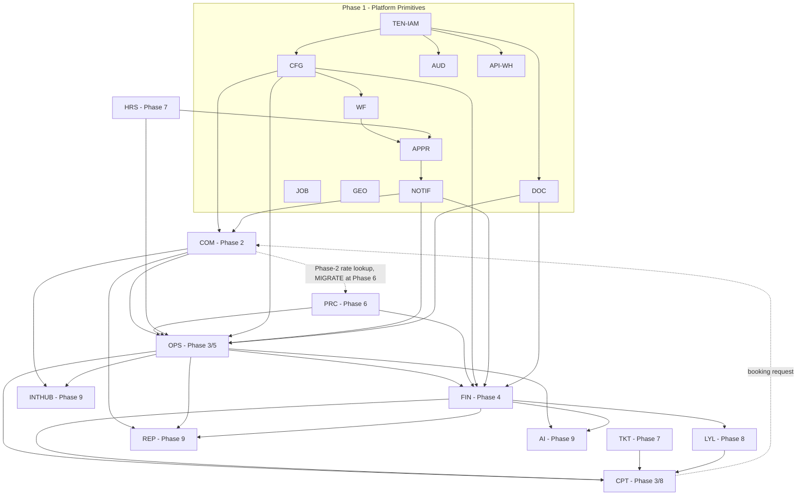

# 01 — Module Dependency Map

**Prompt:** `CG-S3-ARCH-001` (`CG-AABPP-ARCH-036` v0.4.0)
**Runtime output of:** `docs/ai-agent-build-prompt-package/03-architecture-and-plan/36_MODULE_DEPENDENCY_MAP_PROMPT.md`
**Status:** `VERIFIED`

## 0. Checkpoint

| Field | Value |
|---|---|
| Repository | `assujiar/cargogrid.app` |
| Working branch | `agent/cargogrid-autonomous-build` (cut from `origin/main`) |
| HEAD at authoring time | `39d923e54e80eb5f7cc06aa791455fcd72778e8f` |
| Upstream basis | `origin/main` merge of `claude/eloquent-mayer-s40hn4` reconciled with `CG-S2-DISC-001-R1` — Step 2 closure state `RUNTIME_DISCOVERY_VERIFIED` |
| Step 2 evidence checkpoint | `d587445` (all 14 discovery documents cite this HEAD) |
| Drift check | `git diff --stat d587445 HEAD -- . ':(exclude)*.md' ':(exclude)*.sha256'` returns empty — zero non-documentation files changed between the Step 2 evidence checkpoint and this authoring checkpoint, so no Step 2 finding is stale. |
| Package manager/runtime/schema/env | NONE — confirmed absent by `docs/discovery/03,04_*.md`; unchanged |
| Entry gate | Passed: `docs/discovery/14_STEP2_CLOSURE_REPORT.md` = `RUNTIME_DISCOVERY_VERIFIED`; `docs/discovery/12_GREENFIELD_BROWNFIELD_DECISION.md` = `GREENFIELD` (High confidence) |

### Inputs read

- `docs/ai-agent-build-prompt-package/03-architecture-and-plan/35_STEP3_ARCHITECTURE_PLAN_README.md`, `36_MODULE_DEPENDENCY_MAP_PROMPT.md`
- `docs/discovery/02_EXISTING_IMPLEMENTATION_AUDIT.md`, `05_ROUTE_MODULE_INVENTORY.md`, `11_TECHNICAL_DEBT_RISK_REGISTER.md`, `12_GREENFIELD_BROWNFIELD_DECISION.md`, `13_BASELINE_EVIDENCE_INDEX.md`, `14_STEP2_CLOSURE_REPORT.md`
- `docs/blueprint/01_CargoGrid_Project_Product_Charter.md` §38–39, §41
- `docs/blueprint/02_CargoGrid_Business_Process_Product_Requirements_Blueprint.md` §8 (module cards), §6/§20 (data/dependency flow), §21 (release/MVP mapping)
- `docs/blueprint/03_CargoGrid_UX_Data_Access_Design.md` §23–24
- `docs/blueprint/04_CargoGrid_Technical_Architecture_Security_Integration.md` §5 (logical architecture), §8 (backend), §9.3 (domain boundaries), §11–12 (RLS/RBAC), §19 (integration), §26 (integration matrix), §34–35 (risks/ADRs), §37 (sequencing), §39 (open decisions)
- `docs/ai-agent-build-prompt-package/00-control/02_CONFIRMED_DECISION_REGISTER.md` (RPD-001..040), `04_CONFLICT_REGISTER.md` (CON-001..014, GAP-001..018, OD-PKG-001..016 — all `CLOSED`/`RESOLVED`), `03_ASSUMPTION_REGISTER.md`
- `docs/ai-agent-build-prompt-package/06-phase-01-platform-core/103_PLATFORM_CORE_README.md` (capability dependency order PLT-104..140)
- `docs/ai-agent-build-prompt-package/07-phase-02-commercial/141_COMMERCIAL_README.md`, `08-phase-03-operations/166_OPERATIONS_README.md` (capability dependency orders)
- `docs/ai-agent-build-prompt-package/14-phase-09-intelligence-enterprise/328_INTELLIGENCE_ENTERPRISE_README.md`
- Phase directory listing `05-phase-00-*` through `14-phase-09-*` (confirms Phase 0–9 numbering used throughout)
- `docs/runtime/HANDOFF.md`, `TASK_LEDGER.md`, `CARGOGRID_BUILD_STATUS.md`

## 1. Scope and method

The repository is confirmed `GREENFIELD` — zero application code, zero routes, zero schema (`docs/discovery/02_*`, `05_*`). Per the prompt's binding instruction, **no dependency in this document is inferred from an implemented artifact** (none exists); every edge is sourced from a ratified product decision (RPD-xxx), a resolved conflict (CON-xxx), or explicit blueprint/charter content, and every edge's state is `TARGET` unless otherwise marked. Source priority follows repository governance: (1) ratified decisions in `00-control/02_CONFIRMED_DECISION_REGISTER.md` and resolutions in `04_CONFLICT_REGISTER.md`, (2) blueprint documents, (3) AI Agent Build Prompt Package phase capability tables, (4) existing code (none). Where blueprint prose (`Proposed Default`/`Open Decision`) is superseded by a ratified RPD, this document uses the RPD and records the supersession — it does not silently pick the weaker option.

## 2. Module catalogue

### 2.1 Platform primitives (cross-cutting, consumed by every business domain)

| Code | Module | Phase | Package prompts | Owner | Core entities (source: Tech Arch §9.3, §5) |
|---|---|---|---|---|---|
| `TEN-IAM` | Tenant/Subscription + Identity/RBAC/RLS | 1 | PLT-105..116 (`105`–`116`) | Architecture/Security | tenant, company, branch, department, business_unit, user, role, permission, membership |
| `WLB` | White-label, custom domain, localization | 1 | PLT-117..119 | Product/Architecture | brand config, domain, terminology, language, currency, timezone |
| `MDM` | Master data foundation | 1 | PLT-120 | Data | shared master records referenced across domains |
| `CFG` | Configuration Engine | 1 | PLT-121 | Architecture | module, feature, form, field, workflow def, approval def, status, numbering, terminology |
| `WF` | Workflow Engine | 1 | PLT-122 | Architecture | workflow instance/state |
| `APPR` | Approval Engine | 1 | PLT-123 | Architecture | approval matrix, approval instance |
| `STAT` | Status Engine | 1 | PLT-124 | Architecture | canonical status, status transition |
| `NUM` | Numbering Engine | 1 | PLT-125 | Architecture | numbering sequence/scheme |
| `FORM` | Form/custom-field builder | 1 | PLT-126 | Architecture | form def, custom field def |
| `NOTIF` | Notification Engine | 1 | PLT-127 | Architecture | notification, template, channel |
| `DOC` | Document/File Engine | 1 | PLT-128 | Architecture/Security | file, file metadata, access log, malware-scan status |
| `API-WH` | API key/webhook primitives + REST/GraphQL platform API foundation | 1 | PLT-129..130 | Architecture | api_key, webhook subscription, api_log |
| `IMPEXP` | Import/export job framework | 1 | PLT-131 | Data/Architecture | import/export job |
| `JOB` | Background job framework | 1 | PLT-132 | Architecture | job queue record (PostgreSQL durable queue, RPD-012) |
| `FLAG` | Feature flags | 1 | PLT-133 | Architecture | feature flag |
| `GEO` | PostGIS/spatial foundation | 1 | PLT-134 | Data/Operations | geospatial columns/indexes (RPD-015: enabled from Platform Core, not deferred) |
| `AUD` | Audit trail foundation | 1 | PLT-116 (foundation), extended `357` (Phase 9 advanced audit) | Security | audit_log, event_log, api_log, file_access_log, support_access_log (append-only, RPD-022 Supreme Admin exception disclosed) |
| `PORTAL-ADM` | Tenant Admin / Supreme Admin portals | 1 | PLT-135..136 | Architecture | admin UI surfaces over the above primitives |
| `REP` | Reporting/Analytics Engine (full: dashboard builder, saved views, materialized views, scheduled reports) | 1 (per-domain basic reports/dashboards), 9 (full engine `330`–`334`) | PLT-*(domain dashboards), `330`–`334` | Architecture/Data | live-OLTP reads (RPD-014) + materialized views (ADR-007) |
| `INTHUB` | Integration Hub, automation rules, public/customer/vendor API, webhooks, n8n | 9 | `335`–`341` | Architecture/Integration | integration adapters (case-by-case, RPD-038) |
| `AI` | AI-assisted capability (quotation, OCR, ETA, optimization, fraud, forecasting) | 9 | `347`–`353` | Product/Architecture | advisory-only outputs, human-approval gated |
| `ENT` | Enterprise controls (SSO/SAML/OAuth/SCIM, MFA, IP restriction, monitoring, retention, dedicated deployment, DR) | 9 | `354`–`363` | Security/SRE | enterprise-tenant-only surfaces |

### 2.2 Business domains

| Code | Module | Phase (MVP slice / advanced slice) | Blueprint capability codes | Owner |
|---|---|---|---|---|
| `COM` | Commercial (CRM, Quotation) | 2 | `COM-LEAD`, `COM-CRM`, `COM-OPP`, `COM-QTN`, `COM-CPR` | Product/Commercial |
| `OPS` | Operations (Job/Shipment, TMS, WMS, Milestone, ePOD) | 3 (basic) / 5 (advanced) | `OPS-SHP`, `OPS-TMS`, `OPS-WMS`, `OPS-TRK`, `OPS-DOC`, `OPS-CST` | Product/Operations |
| `FIN` | Finance and Accounting | 4 | `FIN-GL`, `FIN-AR`, `FIN-AP`, `FIN-TAX`, `FIN-CLS`, `FIN-PRF` | Finance |
| `PRC` | Procurement and Vendor Management | 6 | `PRC-VND`, `PRC-ASM`, `PRC-RTE`, `PRC-SRC`, `PRC-POI` | Procurement |
| `HRS` | HRIS | 7 | `HRS-EMP`, `HRS-REC`, `HRS-ATT`, `HRS-PAY`, `HRS-KPI`, `HRS-ESS` | HR |
| `TKT` | Ticketing | 7 | `TKT-INT`, `TKT-CUS`, `TKT-HLP`, `TKT-SLA` | Support |
| `CPT` | Customer Portal | 3 (basic tracking/ePOD) / 8 (full portal) | `CPT-QBK`, `CPT-TRK`, `CPT-WHS`, `CPT-BIL`, `CPT-CX` | Product/CX |
| `LYL` | Loyalty and Rewards | 8 | `LYL-PRG`, `LYL-PNT`, `LYL-RDM`, `LYL-ANL` | Product/CX |

Phase splits for `OPS` (TMS/WMS) and `CPT` (Customer Portal) are **ratified, not open**: `docs/ai-agent-build-prompt-package/00-control/04_CONFLICT_REGISTER.md` `CON-004` and `CON-005` — Phase 3/Phase 5 and Phase 3/Phase 8 are internal delivery increments of the **same domain owner**; the full suite is mandatory before GA (RPD-001). No ownership transfer occurs between the basic and advanced slice.

## 3. Dependency matrix

Every row: Provider → Consumer, Type (`COMPILE|RUNTIME|DATA|EVENT|API|CONFIGURATION|ACCESS|REPORTING|RELEASE`), state, owner, phase, criticality, failure effect, evidence.

### 3.1 Platform-primitive internal ordering (within Phase 1, `COMPILE`/`RUNTIME`)

Sourced verbatim from `103_PLATFORM_CORE_README.md` §4 (already an atomic, ratified build order — reproduced here as the primitive-layer dependency backbone, not re-derived):

`TEN-IAM` (PLT-105 tenant → 106 entitlement → 107 Supabase Auth → 108 four-layer access context → 109 org hierarchy → 110 user lifecycle → 111 role/permission → 112 RBAC → 113 RLS → 114 field/record access → 115 support/impersonation → 116 audit) → `WLB` (117→118→119) and `MDM` (120) → `CFG` (121) → `WF` (122) → `APPR` (123) → `STAT` (124) → `NUM` (125) → `FORM` (126) → `NOTIF` (127) → `DOC` (128) → `API-WH` (129→130) → `IMPEXP` (131) → `JOB` (132) → `FLAG` (133) → `GEO` (134) → `PORTAL-ADM` (135→136).

| Provider | Consumer | Type | State | Owner | Phase | Criticality | Failure effect | Evidence |
|---|---|---|---|---|---|---|---|---|
| `TEN-IAM` (105-108) | `TEN-IAM` (109-116) | COMPILE/RUNTIME | TARGET | Architecture | 1 | Critical | No org/user/RBAC/RLS without tenant+auth context first | `103_*.md` §4 |
| `TEN-IAM` (all) | `CFG`,`AUD` | ACCESS | TARGET | Architecture | 1 | Critical | Config/audit writes require actor+tenant+permission context (Backend Rules, Tech Arch §8) | `103_*.md` §4; Tech Arch §8 |
| `CFG` | `WF`,`STAT`,`FORM` | CONFIGURATION | TARGET | Architecture | 1 | Critical | Workflow/status/form definitions are config-engine metadata objects | `103_*.md` §4 |
| `WF` | `APPR` | RUNTIME | TARGET | Architecture | 1 | Critical | Approval steps execute inside workflow instances | Tech Arch §5 (`WF --> APPR`) |
| `APPR` | `NOTIF` | EVENT | TARGET | Architecture | 1 | High | Approval state changes must notify approvers/requesters | Tech Arch §5 (`APPR --> NOTIF`) |
| `CFG`,`STAT`,`NUM` | `NOTIF`,`FORM`,`API-WH` | CONFIGURATION | TARGET | Architecture | 1 | High | Later primitives read published config version | `103_*.md` §4 |
| `DOC` | (Storage) | RUNTIME | TARGET | Architecture | 1 | Critical | Document engine is the only path to Supabase Storage | Tech Arch §5 (`DOC --> STG`), §17.3 |
| `TEN-IAM`,`DOC`,`CFG`,`NOTIF` | `API-WH` | ACCESS/API | TARGET | Architecture | 1 | Critical | Public/webhook APIs enforce the same auth/permission/field policy as internal paths (RPD-033) | `103_*.md` §4; RPD-033 |
| `DOC`,`CFG`,`NOTIF`,`API-WH` | `IMPEXP`→`JOB` | RUNTIME | TARGET | Architecture | 1 | High | Bulk import/export and async work run through the durable job queue | `103_*.md` §4; RPD-012 |
| `TEN-IAM`,`CFG` | `GEO` | DATA | TARGET | Data/Operations | 1 | Medium | Spatial columns/indexes are tenant-scoped master-data extensions | `103_*.md` §4; RPD-015 |
| PLT-106..134 (required subset) | `PORTAL-ADM` | RUNTIME | TARGET | Architecture | 1 | Critical | Tenant/Supreme Admin portals are UI surfaces over all prior primitives; cannot precede them | `103_*.md` §4 |

### 3.2 Platform primitive → business domain (generic — applies to every `COM/OPS/FIN/PRC/HRS/TKT/CPT/LYL` module)

| Provider | Consumer | Type | State | Owner | Phase | Criticality | Failure effect | Evidence |
|---|---|---|---|---|---|---|---|---|
| `TEN-IAM` | every business domain | ACCESS | TARGET | Security | 1 → N | Critical | No domain table is reachable without tenant context + RLS + RBAC (default deny) | Tech Arch §11.1, §5 "Logical Component Rules" |
| `CFG`,`WF`,`APPR`,`STAT`,`NUM`,`FORM` | every business domain | CONFIGURATION | TARGET | Architecture | 1 → N | Critical | Domain workflow/approval/status/numbering/custom-field behavior is config-driven, not hardcoded (Tech Arch §8 Backend Rules: "no tenant-specific branch logic hardcoded") | Tech Arch §8, §13–15 |
| `NOTIF` | every business domain | EVENT | TARGET | Architecture | 1 → N | High | Domain lifecycle events (approval, milestone, invoice, ticket) fan out through one notification engine | Tech Arch §16 |
| `DOC` | `OPS`,`FIN`,`PRC`,`HRS`,`TKT`,`CPT` | RUNTIME | TARGET | Architecture | 1 → N | Critical | ePOD, invoices, contracts, payroll slips, tickets all use the shared signed-URL/malware-scan document path (RPD-032) | Tech Arch §17, RPD-032 |
| `API-WH` | every business domain | API | TARGET | Architecture | 1 → N | Critical | Domain REST/GraphQL endpoints share auth/version/rate-limit/idempotency governance (RPD-033) | Tech Arch §25, RPD-033 |
| `JOB` | `COM`,`OPS`,`FIN`,`CPT`,`LYL`,`INTHUB` | RUNTIME | TARGET | Architecture | 1 → N | High | Report generation, notification batches, webhook retry, loyalty expiry, recurring billing all run on the durable job queue | Tech Arch §32.11, RPD-012 |
| every business domain | `AUD` | EVENT | TARGET | Security | 1 → N | Critical | Every domain mutation is audit-logged append-only, subject to the disclosed RPD-022 Supreme Admin exception | Tech Arch §9.7, RPD-022 |
| every business domain | `REP` | REPORTING | TARGET | Architecture/Data | 1 → N | High | Dashboards/reports read governed domain datasets directly (live OLTP, RPD-014) | RPD-014, Tech Arch §18 |
| `GEO` | `OPS` (TMS/WMS route, geofence, distance) | DATA | TARGET | Operations | 1 → 3/5 | Medium | Route/geofence/distance primitives depend on PostGIS being enabled from Platform Core | RPD-015 |

### 3.3 Business domain → business domain (the core module map)

Primary source: Charter §39 "Module Dependency Map" (hard dependencies + downstream consumers) reconciled with Blueprint §6/§20 end-to-end data flow and §21 release mapping. No edge below is inferred beyond what these two sources state.

| Provider | Consumer | Type | State | Data/Contract Owner | Phase (P→C) | Criticality | Failure effect | Evidence | Status |
|---|---|---|---|---|---|---|---|---|---|
| `COM` (customer, quotation, contract) | `OPS` (job order, shipment) | DATA | TARGET | Commercial | 2 → 3 | Critical | Quote acceptance must create a job order without re-entry (no-reentry invariant) | Charter §39; Blueprint §6, `COM-160/161` | Sourced |
| `COM` (canonical vendor/service/rate lookup, Phase 2 slice) | `OPS` (costing, resource/vendor assignment) | DATA | TARGET | Commercial (P2 slice) → Procurement (P6 full) | 2 → 3 | High | Costing needs a rate figure before Procurement exists | Charter §39; `CON-006` | `ADR_REQUIRED` — see §9 `ADR-CAND-ARCH-001` |
| `OPS` (shipment, job order) | `FIN` (billing readiness, AR) | DATA/EVENT | TARGET | Operations → Finance | 3 → 4 | Critical | No invoice without a billing-ready shipment/job event | Charter §39; Blueprint §6, `OPS-181`→`FIN-AR` | Sourced |
| `OPS` (actual cost) | `FIN` (AP, vendor settlement) | DATA | TARGET | Operations → Finance | 3 → 4 | Critical | Vendor invoice matching needs actual-cost/vendor-assignment data | Charter §39; Blueprint §6 | Sourced |
| `OPS` (actual cost) | `FIN` (job/customer/service profitability, `FIN-PRF`) | DATA | TARGET | Finance | 3 → 4 | High | Profitability requires posted actual cost + revenue | Charter §39; Blueprint §6 | Sourced |
| `COM` (revenue snapshot) | `OPS` (`OPS-179` basic job profitability) | DATA | TARGET | Commercial (source of truth) | 2 → 3 | Medium | A **read-only** snapshot, not a duplicated master — see §5 for the non-cycle clarification | `166_OPERATIONS_README.md` order 12 ("OPS-178; Commercial revenue snapshot") | Sourced; validation rule applies (§11 R3) |
| `PRC` (vendor, vendor rate, contract, performance) | `OPS` (resource/vendor assignment), `FIN` (AP invoice matching) | DATA | TARGET | Procurement | 6 → 3/4 | High | Full vendor lifecycle supersedes the Phase-2 lookup once Procurement lands | Charter §39; `CON-006` | `ADR_REQUIRED` — see §9 `ADR-CAND-ARCH-001` |
| `HRS` (employee, organization) | `APPR` (approver identity), `OPS` (driver/resource assignment), `FIN` (payroll journal) | DATA | TARGET | HR (Phase 7) vs. `TEN-IAM` (Phase 1) for early phases | 7 → 1..6 (inverted) | Medium | Approval/assignment actors exist from Phase 1 via `TEN-IAM`, before HRIS exists — phase-order conflict, not a hard blocker | Charter §39; `103_*.md` (PLT-108/110, Phase 1); `272_*.md` (HRS-EMP, Phase 7) | `ADR_REQUIRED` — see §9 `ADR-CAND-ARCH-002`; flagged as phase-order inversion, resolved by validation rule §11 R4 |
| `TKT` (ticket, linked entity) | `OPS`,`FIN`,`PRC`,`CPT` (typed polymorphic link) | DATA | TARGET | Support (owns ticket); linked domain owns the referenced record | 7 → 3/4/6/8 | Medium | Ticket can link to shipment/invoice/warehouse/vendor/customer via typed reference table, not FK-per-type sprawl | Tech Arch §9.4; Charter §39 | Sourced |
| `FIN` (invoice, payment) | `LYL` (point ledger earning) | EVENT | TARGET | Finance → Loyalty | 4 → 8 | Medium | Points accrue from a posted, payment-confirmed transaction, via ledger not direct mutation | Charter §39; Blueprint §6 ("Invoice→Loyalty Earning") | Sourced |
| `COM`,`OPS`,`FIN`,`TKT`,`LYL` | `CPT` (Customer Portal) | DATA/API | TARGET | Each domain remains data owner; Portal is a scoped read/write boundary | 2/3/4/7/8 → 3/8 | Critical | Portal must never bypass the owning domain's server query/action layer (portal-to-DB-shortcut risk) | Charter §39 ("Portal" downstream of Shipment/WMS/Finance/Ticketing/Loyalty); Tech Arch §3 Principle 5, §7.12 | Sourced; validation rule §11 R2 |
| `CPT` (customer-initiated quote/booking request, `CPT-QBK`) | `COM` (lead/opportunity intake) | API | TARGET | Commercial remains data owner; Portal request is a new intake channel, not a direct write | 3/8 → 2 | High | Portal-submitted bookings must enter through the same lead/opportunity creation path as internally sourced leads, not a parallel shadow table | Blueprint `CPT-QBK`; Tech Arch §3 Principle 5 | Sourced; validation rule §11 R2 — this is a second, distinct edge from the row above, not a cycle (see §5) |
| `PRC` | `COM` (Phase-2 rate lookup, superseded) | RELEASE | MIGRATE | Procurement | 6 (retires 2's interim lookup) | Medium | Once Procurement (Phase 6) is live, Commercial's Phase-2 interim vendor-rate lookup must point at the canonical Procurement rate table, not a Phase-2 shadow copy | `CON-006` | `ADR_REQUIRED` — see §9 `ADR-CAND-ARCH-001` |

### 3.4 Business domain → platform reporting/audit (downstream fan-in)

| Provider | Consumer | Type | State | Owner | Phase | Criticality | Failure effect | Evidence |
|---|---|---|---|---|---|---|---|---|
| `COM`,`OPS`,`FIN`,`PRC`,`HRS`,`TKT`,`CPT`,`LYL` | `REP` (full engine, Phase 9) | REPORTING | TARGET | Architecture/Data | 2-8 → 9 | High | Cross-domain dashboards/materialized views/scheduled reports require every domain's governed dataset | `330`–`334`; RPD-014 |
| `COM`,`OPS`,`FIN`,`PRC`,`HRS`,`TKT`,`CPT`,`LYL` | `AUD` (advanced audit, Phase 9) | EVENT | TARGET | Security | 2-8 → 9 | Critical | Advanced audit/impersonation controls extend the Phase-1 audit foundation across all domains | `357_ADVANCED_AUDIT_IMPERSONATION_PROMPT.md` |
| `COM`,`OPS`,`FIN`,`PRC` | `AI` (quotation assist, ETA, fraud/risk, forecasting, Phase 9) | DATA | TARGET | Product/Architecture | 2/3/4/6 → 9 | Medium | AI outputs are advisory-only; cannot autonomously post ledgers/payments/payroll/tax/contract/price commitments | `347`–`353`; Phase 9 README "Mandatory governance boundaries" |
| all domains | `INTHUB` (integration hub, public/customer/vendor API, webhooks, Phase 9) | API/EVENT | TARGET | Architecture/Integration | 2-8 → 9 | High | External-facing API/webhook surface aggregates domain data through the platform API foundation, not domain-specific ad hoc endpoints | `336`–`340` |

### 3.5 External integration edges

17 categories per Tech Arch §26.1 (Email, WhatsApp, SMS, Google Maps, GPS/Telematics, shipping line, airline, port/airport, customs, banking, payment gateway, e-invoice/tax, external accounting, HR/attendance, marketplace/e-commerce, customer API, vendor API, n8n). Each is `API`/`EVENT` typed, `TARGET`, owned by `INTHUB`/`AI`, phase 9 (with `NOTIF` in Phase 1 covering baseline email/WhatsApp/SMS dispatch primitives before the Phase-9 Integration Hub formalizes provider-specific adapters). **Governing constraint: RPD-038 — every connector is implemented case-by-case inside the shared codebase; no generic provider abstraction is introduced across categories, and no tenant-specific source fork is permitted.** This is binding, not a recommendation open for re-litigation.

## 4. Directed map (compact)

Phase-ordered summary: `Phase 1 (all Platform primitives) → Phase 2 (COM) → Phase 3 (OPS basic, CPT basic) → Phase 4 (FIN) → Phase 5 (OPS advanced) → Phase 6 (PRC) → Phase 7 (HRS, TKT) → Phase 8 (CPT full, LYL) → Phase 9 (REP full, INTHUB, AI, ENT)`. This matches `docs/runtime/CARGOGRID_BUILD_STATUS.md` §3 phase table and Blueprint §21 exactly.

## 5. Cycles, reverse dependencies, and conflicts

No true circular dependency (A→B→A on the same data object) was found. Three patterns require explicit documentation so later prompts do not mistake them for cycles or silently duplicate masters:

1. **`COM` revenue snapshot read by `OPS` profitability** (§3.3 row 6) is a one-directional **read** of Commercial's canonical revenue figure for Operations' basic job-profitability view. It must be implemented as a view/API read against Commercial's data, never a copied/duplicated table in Operations — see validation rule §11 R3. Not a cycle: Operations does not write back to Commercial.
2. **`CPT` booking request → `COM` intake** and **`COM`/`OPS`/`FIN`/`TKT`/`LYL` → `CPT` display** (§3.3 rows 11–12) are two distinct, differently-typed edges (an `API` intake edge and a `DATA` display edge) sharing the same two nodes. This is normal portal behavior, not a cycle — but it is exactly the pattern the prompt's "portal-to-database shortcut" risk category warns about: the intake edge must route through Commercial's existing lead/opportunity creation path (server action/API), never a direct portal-owned write to Commercial's transactional tables.
3. **`HRS` (Phase 7) providing approver/assignment identity used since Phase 1** (§3.3 row 7) is a genuine **phase-order inversion**: the consumer relationship (Approval Engine, Operations assignment) exists five phases before the nominal provider (HRIS Employee master). This is not a blocking cycle because Phase 1's `TEN-IAM` already provides a lighter-weight Platform User/Organization identity that fills the role until HRIS lands — but the two identity models must reconcile via a stable reference key, not duplicate the person master. Raised as `ADR-CAND-ARCH-002` (§9).

Two additional items are **explicitly not conflicts** requiring rework, because they are already ratified in `00-control/04_CONFLICT_REGISTER.md`:

- `CON-004` (WMS Phase 3/5 split) and `CON-005` (Customer Portal Phase 3/8 split) — both `RESOLVED`: internal delivery increments of the same owning domain, full suite mandatory before GA. No ownership ambiguity.
- `CON-006` (Commercial's Phase-2 vendor-rate lookup vs. Procurement's Phase-6 full vendor-rate lifecycle) — `RESOLVED` at the product-decision level ("build the canonical foundation once in Phase 2, extend in Phase 6") but explicitly leaves **domain ownership placement as an implementation ADR for Step 3** — this document raises that ADR (`ADR-CAND-ARCH-001`, §9) rather than silently assuming an owner, per `CON-006`'s own instruction.

No shared-table coupling, no reverse dependency into Platform primitives from any business domain, and no duplicated canonical master were found beyond the two flagged above (`COM`/`PRC` vendor-rate, `TEN-IAM`/`HRS` person identity).

## 6. Shared primitives

| Primitive | Consumed by | Governing decision |
|---|---|---|
| Tenant/Identity/RLS/RBAC context | All modules, always first | RPD-001 (all module suites mandatory before GA), Tech Arch §10–12 |
| Configuration Engine + version stamping | All configurable domain behavior | ADR-012 (config version ID recorded on affected transactions), DUP-003 |
| Workflow/Approval/Status/Numbering engines | Commercial (quote approval), Operations (dispatch/exception), Finance (period lock/approval), Procurement (PO approval), HRIS (leave/expense approval) | DUP-010 |
| Notification Engine | All domains' lifecycle events | Tech Arch §16 |
| Document/File Engine (malware-scanned) | Operations (ePOD), Finance (invoice/receipt), Procurement (contract), HRIS (payroll slip), Ticketing (attachment), Customer Portal (document download) | **RPD-032 — every uploaded file is malware-scanned before any other user can access it.** This is ratified and binding; it supersedes the softer "Proposed Default for enterprise/high-risk document" framing in Tech Arch §32.15 — the document map treats RPD-032 as universal, not tiered. |
| Audit Engine (append-only) | All domains | RPD-022 (Supreme Admin absolute-CRUD exception disclosed, never claimed tamper-proof) |
| REST + GraphQL platform API foundation | All domains' public/customer/vendor APIs | **RPD-033 — REST and GraphQL are built together**, superseding Tech Arch ADR-006's "REST first, GraphQL not baseline" framing; already reconciled in `03_ASSUMPTION_REGISTER.md` `ASM-TA-004`. |
| PostgreSQL durable queue (background jobs) | Import/export, notification batch, webhook retry, report generation, loyalty expiry, recurring billing | **RPD-012 — PostgreSQL durable queue is the initial mechanism**, superseding Tech Arch §39 `OD-002`'s "queue technology not decided" framing; `GAP-004` in the conflict register confirms `CLOSED — RPD-012`. |
| PostGIS/spatial foundation | Operations (route, geofence, distance), enabled from Phase 1 | **RPD-015 — PostGIS is enabled from Platform Core**, superseding Tech Arch §39 `OD-006`'s "needed before Advanced TMS" framing; `OD-PKG-013` confirms `CLOSED — RPD-015`. |
| Live-OLTP reporting/dashboards | All domains | RPD-014 (dashboards read transactional data directly, with read-only/pagination/timeout/query-budget guardrails); RPD-039 (search starts in PostgreSQL FTS/trigram) |
| Feature flags | Release/rollout control across all domains | DUP-012 (flags never bypass security) |

## 7. External dependencies

External integration categories (Email, WhatsApp, SMS, Maps, GPS/Telematics, shipping line, airline, port/airport, customs, banking, payment gateway, e-invoice/tax, external accounting, HR/attendance, marketplace, customer API, vendor API, n8n) are enumerated in Tech Arch §26.1 with direction/trigger/protocol/auth/idempotency/ownership per category, and are formally owned by `INTHUB` (Phase 9) per §3.5 above. **RPD-038 governs all of them: case-by-case implementation in the shared codebase, no generic provider abstraction, no tenant-specific fork.** AI-provider integration (OpenAI multimodal, per `OD-PKG-011` → `RPD-021/028`) is a distinct, separately-governed external dependency under the `AI` module (Phase 9), subject to human-approval gating stated in the Phase 9 README's "Mandatory governance boundaries."

## 8. Preserved assets

Per `docs/discovery/12_GREENFIELD_BROWNFIELD_DECISION.md`, this document does not alter or duplicate: `docs/blueprint/**` (do not edit without a ratified decision change), `docs/ai-agent-build-prompt-package/**` (read-only source of execution prompts and capability-order tables cited throughout §3), `docs/ai-agent-build-prompt-package/00-control/**` registers (authoritative, never silently overridden — this document only *cites* RPD/CON/GAP/OD-PKG IDs, it does not restate or re-decide them), `docs/runtime/**` (updated separately per the runtime ledger rules, see the accompanying checkpoint commit), `docs/discovery/**` (Step 2 evidence, unchanged).

## 9. ADR candidates

| ID | Question | Options | Constraint | Recommendation | Owner | Evidence needed | Downstream effect | Blocking state |
|---|---|---|---|---|---|---|---|---|
| `ADR-CAND-ARCH-001` | Which domain owns the canonical `vendor_rate`/vendor-service table across Commercial's Phase-2 interim lookup and Procurement's Phase-6 full lifecycle? | (a) Procurement owns it from day one, Commercial reads via API in Phase 2 before Procurement UI exists; (b) Commercial owns a minimal rate table in Phase 2, migrated/re-parented to Procurement at Phase 6; (c) a shared `PLT-MDM` master-data table from Phase 1, extended by both. | Must not create two independently-writable vendor-rate masters (Tech Arch §9.4, DUP violation risk); `CON-006` already requires "build once, extend later." | Option (a): seed a minimal Procurement-owned `vendor_rate` schema in Phase 1's `MDM`/`GEO`-adjacent master-data foundation (read/write API surface only, no Procurement UI until Phase 6), so Commercial's Phase-2 lookup is a read against the real eventual owner from the start — avoids the Phase-6 migration edge in §3.3. | Architecture/Procurement | Prompt 40 (Database Schema Workstream) must confirm feasibility of seeding a Phase-1 minimal schema for a Phase-6 domain | `ADR_REQUIRED`, not yet approved — does not block Prompt 37 (data-flow tracing can proceed using the target-state edge either way) |
| `ADR-CAND-ARCH-002` | How does the Phase-1 Platform User/Organization identity (`PLT-108/109/110`) reconcile with the Phase-7 HRIS Employee master (`HRS-EMP`) so approval/assignment actors set up in Phases 1–6 are not duplicated when HRIS lands? | (a) HRIS Employee row FKs to the existing `TEN-IAM` user record (1:0..1, employee is an HR-specific extension of user, not a new identity root); (b) User and Employee remain fully separate with a manual linking step at HRIS onboarding; (c) invert the dependency — pull employee-lite fields into `TEN-IAM` from Phase 1 and let HRIS extend them. | Tech Arch §9.4 forbids sacrificing data integrity for flexibility; no duplicate person master permitted (DUP register intent). | Option (a): `HRS-EMP` extends `TEN-IAM` user via FK from Phase 7 onward; Phase 1–6 approval/assignment continues to resolve through the user/organization model unchanged. | HR/Architecture | Prompt 40/41 (schema + RLS/RBAC workstreams) must define the FK and migration-free extension path | `ADR_REQUIRED`, not yet approved — flagged as a phase-order finding new to this document (not previously in `04_CONFLICT_REGISTER.md`) |
| `ADR-CAND-ARCH-003` | Where do shared Platform primitives (§2.1) and business-domain modules (§2.2) physically live in the repository target structure, and how is the boundary enforced (lint rule, folder convention, or both)? | Deferred in full to Prompt 39 (`04_REPOSITORY_TARGET_STRUCTURE.md`). | Backend Module Layout (Tech Arch §8) shows `server/{queries,mutations,actions,policies,integrations,jobs}/` as a flat cross-domain layout, which does not by itself prevent illegal cross-domain imports. | Tracked here for traceability; Prompt 39 must produce the enforceable boundary and reference validation rule §11 R1 of this document. | Architecture | Prompt 39 output | Deferred, not blocking this document's completion |
| `ADR-CAND-ARCH-004` | At what threshold does live-OLTP reporting (RPD-014 default) graduate to read replicas or a reporting warehouse, and who owns that trigger? | Deferred to the Testing/Performance workstream (Prompt 45) and Phase 9 Reporting Engine (`330`–`333`). | `OD-PKG-010` closes the *default* (live OLTP with guardrails) but explicitly leaves replicas/warehouse as "threshold-driven," i.e. the threshold itself is undefined. | Tracked here for traceability; Prompt 45 must define the measurable threshold (GAP-015 in the conflict register already flags this as `TEST_DERIVED`). | Architecture/Data | Performance baseline evidence (currently `UNKNOWN`, `docs/discovery/08_*.md`) once Phase 0 build-out produces a measurable system | Deferred, not blocking this document's completion |

## 10. Phase implications

| Phase | Scope | Modules unlocked | Gate to enter |
|---:|---|---|---|
| 0 | Discovery and Foundation | none (infra/tooling only) | — (current) |
| 1 | Platform Core | `TEN-IAM`,`WLB`,`MDM`,`CFG`,`WF`,`APPR`,`STAT`,`NUM`,`FORM`,`NOTIF`,`DOC`,`API-WH`,`IMPEXP`,`JOB`,`FLAG`,`GEO`,`AUD`,`PORTAL-ADM` | `PHASE_0_VERIFIED` |
| 2 | Commercial | `COM` | `PHASE_1_VERIFIED` |
| 3 | Operations (basic) + Customer Portal (basic) | `OPS` (basic), `CPT` (basic) | `PHASE_2_VERIFIED` |
| 4 | Finance | `FIN` | `PHASE_3_VERIFIED` |
| 5 | Operations (advanced TMS/WMS) | `OPS` (advanced) | `PHASE_4_VERIFIED` |
| 6 | Procurement/Vendor | `PRC` | `PHASE_5_VERIFIED` |
| 7 | HRIS + Ticketing | `HRS`,`TKT` | `PHASE_6_VERIFIED` |
| 8 | Customer Portal (full) + Loyalty | `CPT` (full), `LYL` | `PHASE_7_VERIFIED` |
| 9 | Intelligence, Automation, Enterprise | `REP` (full), `INTHUB`, `AI`, `ENT` | `PHASE_8_VERIFIED` |

Matches `docs/runtime/CARGOGRID_BUILD_STATUS.md` §3 and Blueprint §21 exactly — no new phase or reordering is introduced by this document.

## 11. Validation rules (for later prompts to reject illegal imports/ownership violations/phase inversions)

- **R1** — A business-domain module must not import or query another domain's tables directly; access only through that domain's server query/action layer or a published view (Tech Arch §5 "Business Domains boleh memanggil shared platform services, tetapi tidak boleh bypass permission/data ownership").
- **R2** — Customer Portal code must never issue direct Supabase table queries; all portal reads/writes flow through the same server query/action/API layer used internally, scoped by `customer_account_id` (Tech Arch §3 Principle 5, §7.12).
- **R3** — No module may create a duplicate canonical master (customer, vendor, service, employee, revenue figure) already owned by another domain; extend or read via FK/view, never copy (Tech Arch §9.4; DUP-002).
- **R4** — Approval/assignment actors in Phases 1–6 resolve through the Platform `TEN-IAM` user/organization model; `HRS-EMP` (Phase 7) must extend that existing user record via a stable FK, not introduce a second person-identity root (`ADR-CAND-ARCH-002`).
- **R5** — Integration Hub adapters (§3.5) are implemented case-by-case in the shared codebase per RPD-038; no generic `IProvider`-style abstraction spanning integration categories may be introduced.
- **R6** — A file is not accessible to any consumer other than its uploader until the malware-scan policy permits release (RPD-032); the Document Engine's release-to-consumer edge is gated (`CONFIGURATION`+`ACCESS`), never immediate.
- **R7** — Background/async work (import/export, notification batch, webhook retry, report generation, loyalty expiry, recurring billing) routes through the PostgreSQL durable queue (RPD-012); no module may introduce an ad hoc external queue/worker without a threshold-triggered ADR.
- **R8** — Every transaction affected by Workflow/Approval/Status/Numbering/Form config must record the config version ID applied at execution time (ADR-012; CON-012/RPD-040 default: active transactions keep their applied version).
- **R9** — Reporting/Dashboard reads may query live OLTP directly (RPD-014) but must use a read-only role, pagination, timeouts, and query budgets; write paths never originate from the Reporting Engine.
- **R10** — A dependency edge whose provider's phase number is greater than its consumer's phase number is a phase-order inversion and is blocking **unless** it is explicitly covered by a ratified `CON-*` resolution or an approved ADR from §9 (the `HRS`→`APPR`/`OPS` edge and the `PRC`→`COM` edge in §3.3 are the two currently-known, tracked exceptions).
- **R11** — Portal-initiated writes (e.g. `CPT-QBK` booking requests) must enter through the owning domain's existing intake path (e.g. Commercial's lead/opportunity creation), never a parallel portal-owned shadow table for the same business object (§5 item 2).

## 12. Risks (architecture-identified, new — not yet in `docs/discovery/11_TECHNICAL_DEBT_RISK_REGISTER.md`)

| ID | Description | Severity | Recommended handling |
|---|---|---|---|
| `MDM-RISK-001` | Commercial's Phase-2 vendor-rate lookup and Procurement's Phase-6 full vendor-rate lifecycle could diverge into two masters if `ADR-CAND-ARCH-001` is not resolved before Phase 2 implementation begins. | Medium | Resolve `ADR-CAND-ARCH-001` no later than Phase 1 database-schema workstream (Prompt 40), before Phase 2 Commercial prompts (`143`+) touch vendor-rate data. |
| `MDM-RISK-002` | If HRIS Employee (Phase 7) is modeled as an independent identity root instead of extending the Phase-1 Platform user record, every approval/assignment reference created in Phases 1–6 becomes unreconciled with the eventual employee record. | Medium | Resolve `ADR-CAND-ARCH-002` no later than the Phase-1 RLS/RBAC workstream (Prompt 41), before any approval/assignment feature (Phase 1 `APPR`, Phase 3 `OPS` dispatch) ships. |

Carried forward, unchanged, from `docs/discovery/11_TECHNICAL_DEBT_RISK_REGISTER.md`: `RISK-004..007` (RPD-022/034-036/031-037/038 standing accepted risks) apply unchanged to this module map's Audit, Release, Recovery, and Integration edges respectively; `RISK-008/009` (`tes.md`, missing `.gitignore`) remain Phase-0-scoped and outside this document's scope.

## 13. Unresolved evidence / open items

None blocking. `docs/ai-agent-build-prompt-package/00-control/04_CONFLICT_REGISTER.md` §5 confirms zero unresolved product decisions and zero provisional conflict resolutions at the product-decision level. The four items in §9 are implementation-level ADR candidates explicitly authorized by Step 3's process ("Architecture uncertainties become ADRs... not silent assumptions") and by `CON-006` itself ("domain ownership is an implementation ADR, not a product decision") — they do not block this document's completion or Prompt 37.

## 14. Completion statement

Every named module in §2 has an owner and a phase. Every critical edge in §3 is sourced to a ratified decision, resolved conflict, or explicit blueprint/charter passage — none is inferred from implemented code, consistent with the confirmed absence of any implementation (`docs/discovery/02_*`, `05_*`). The two genuine phase-order/ownership findings (§5, §9) are resolved-to-`ADR_REQUIRED` rather than silently assumed, and are non-blocking per §13. Downstream Prompt 37 (Canonical Data Flow Map) can trace the Lead→...→Payment/Receipt flow and its parallel branches (actual cost→AP, payment→profitability, invoice→loyalty, shipment→ticket) using the edges in §3.3 without inventing any dependency.

Next eligible prompt: `03-architecture-and-plan/37_CANONICAL_DATA_FLOW_MAP_PROMPT.md` → `docs/architecture/02_CANONICAL_DATA_FLOW_MAP.md`.
