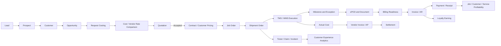
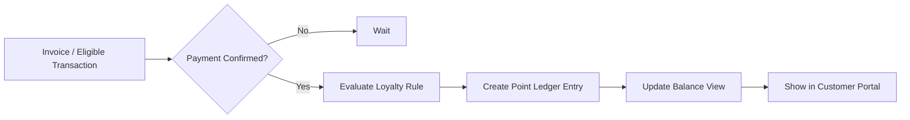
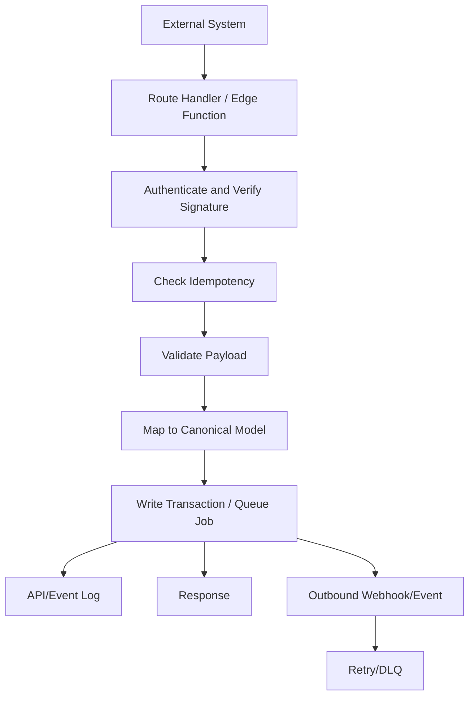
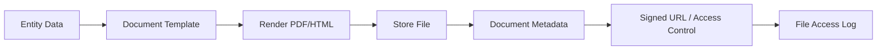
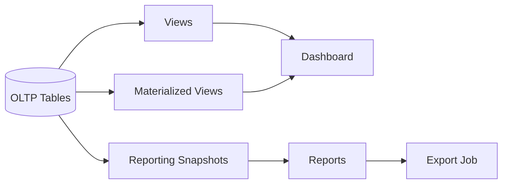

# 02 — Canonical Data Flow Map

**Prompt:** `CG-S3-ARCH-002` (`CG-AABPP-ARCH-037` v0.4.0)
**Runtime output of:** `docs/ai-agent-build-prompt-package/03-architecture-and-plan/37_CANONICAL_DATA_FLOW_MAP_PROMPT.md`
**Status:** `VERIFIED`

## 0. Checkpoint

| Field | Value |
|---|---|
| Repository | `assujiar/cargogrid.app` |
| Working branch | `agent/cargogrid-autonomous-build` |
| HEAD at authoring time | `0386b5970c2d5df8d02aedb574759f5ca21a053c` (parent of this checkpoint's commit) |
| Precondition | `docs/architecture/01_MODULE_DEPENDENCY_MAP.md` = `VERIFIED` (`CG-S3-ARCH-001`) |
| Repository state | Unchanged since Prompt 36: 100% documentation, zero application code (`docs/discovery/02_*`, `05_*`) |

### Inputs read (beyond those already logged in `01_MODULE_DEPENDENCY_MAP.md` §0)

- `docs/blueprint/02_*.md` §6 (End-to-End Data Flow Map, verbatim), §14.1–14.6 (data dictionaries: Customer, Shipment, Vendor, Warehouse, Finance, Employee), §20 (Module Dependency Map, verbatim), §21 (release mapping), and the per-module "Status lifecycle" row of every one of the 41 module cards in §8
- `docs/blueprint/03_*.md` §23 (Data Ownership, verbatim), §24 (Data Access Model, verbatim), §25 (Role/Permission Matrix)
- `docs/blueprint/04_*.md` §12.4 (Field-Level Security), §16 (Notification Engine), §17 (Document Engine, verbatim), §18 (Reporting Engine, verbatim), §19 (Integration Engine, verbatim), §20 (Billing Engine), §21 (Loyalty Engine, verbatim), §22 (Audit Architecture, verbatim), §32.11–32.17 (background jobs, materialized views, realtime, rate limiting, file upload, export, webhook retry/DLQ)
- `docs/ai-agent-build-prompt-package/00-control/02_*.md` RPD-025 (retention schedule), RPD-032 (malware scan), RPD-014/039 (reporting/search); `04_*.md` DUP-002 (no-redundant-entry/lineage canonical control)
- `docs/ai-agent-build-prompt-package/09-phase-04-finance/189_FINANCE_README.md`, `11-phase-06-procurement-vendor/249_PROCUREMENT_VENDOR_README.md`, `12-phase-07-hris-ticketing/272_HRIS_TICKETING_README.md`, `13-phase-08-customer-portal-loyalty/298_CUSTOMER_PORTAL_LOYALTY_README.md` — capability dependency order tables and non-negotiable ownership boundaries

## 1. Scope and method

No flow step below is inferred from implemented code (none exists). Every step is sourced to the blueprint's own end-to-end flow diagram (§6), its per-module status lifecycle, its data dictionary, or the technical architecture's engine-flow diagrams (§16–22, §32). Where `01_MODULE_DEPENDENCY_MAP.md` already established an edge, owner, or risk, this document extends it into a step-by-step lifecycle rather than re-deriving it — cross-references use that document's module codes (`COM`, `OPS`, `FIN`, `PRC`, `HRS`, `TKT`, `CPT`, `LYL`, and the platform primitives).

Note on source depth: Blueprint §8's per-module cards (Procurement, HRIS, Ticketing, Portal, Loyalty) repeat identical boilerplate for `Business rules`/`Approval rules`/`Validation rules`/`Main flow` across nearly every card — only each card's `Status lifecycle` string is materially distinct. Where §8 is generic, this document instead cites the phase-package READMEs (`189_*`, `249_*`, `272_*`, `298_*`), which carry real, differentiated business rules (e.g. "no duplicate vendor master," "an approved PO does not post a journal," "Employee is a workforce/domain profile linked to identity, not a duplicate authentication user"). This document itself fulfills the canonical-lineage-map mandate assigned to "Data Architecture + E2E flows" by `00-control/04_CONFLICT_REGISTER.md` `DUP-002`.

## 2. Canonical entity register

| Entity | System of record (owner module) | Canonical ID | Data dictionary source | Consumed by (read) |
|---|---|---|---|---|
| Tenant, Subscription, Entitlement | `TEN-IAM` | `tenant_id` | Tech Arch §9.2 | All modules |
| User, Role, Permission, Membership | `TEN-IAM` | `user_id` | Tech Arch §9.3 | All modules; `HRS-EMP` extends (see `01_*.md` `ADR-CAND-ARCH-002`) |
| Customer (legal/tax/billing/hierarchy/contact/service-requirement/contract-pricelist/portal-user profile) | `COM` | `customer_id` | Blueprint §14.1 (8 field groups) | `COM`,`OPS`,`FIN`,`CPT`,`LYL` |
| Lead / Opportunity / Quotation / Contract | `COM` | `lead_id`→`opportunity_id`→`quotation_id`→`contract_id` | Blueprint §8.2 module cards | `OPS` (job creation), `FIN` (customer pricing), `CPT` (quote display) |
| Shipment (identifiers, parties, schedule, service/mode, commodity/package, structure, milestone/status, document/ePOD, asset/resource, risk/claim, financial, audit) | `OPS` | `shipment_id` (child of `job_order_id`) | Blueprint §14.2 (13 field groups) | `FIN`,`CPT`,`TKT`,`REP` |
| Vendor (profile, contact/address, legal/tax, rate/pricelist, service/coverage, performance, financial, invoice/payment) | `PRC` (full lifecycle, Phase 6); `COM`/`OPS` (interim rate lookup, Phase 2/3, per `01_*.md` `ADR-CAND-ARCH-001`) | `vendor_id` | Blueprint §14.3 (8 field groups) | `COM`,`OPS`,`FIN` |
| Warehouse (master, layout, SKU/inventory, inbound, movement, outbound, billing/productivity) | `OPS` (WMS) | `warehouse_id`, `sku_id`, `inventory_ledger_id` | Blueprint §14.4 (7 field groups) | `FIN`,`CPT` |
| Finance (COA/ledger, journal, AR, AP, tax/currency, closing, profitability) | `FIN` | `journal_id`, `invoice_id`, `payment_id` | Blueprint §14.5 (8 field groups) | `LYL`,`CPT`,`REP` |
| Employee (master, position/org, attendance, payroll, performance, contract/document, ESS/MSS) | `HRS` | `employee_id` | Blueprint §14.6 (7 field groups) | `APPR` (approver), `OPS` (assignment), `FIN` (payroll journal) |
| Ticket (internal, customer-to-tenant, tenant-to-CargoGrid, SLA/escalation, typed link) | `TKT` | `ticket_id` | Blueprint §8.7 module cards | `CPT`,`REP` |
| Loyalty (program, tier, point ledger, cashback ledger, reward, redemption) | `LYL` | `membership_id`, `point_ledger_id` | Blueprint §21.1 | `CPT`,`REP` |
| Document/File | `DOC` (platform primitive) | `file_id` | Tech Arch §17.1 (10 categories) | Every domain that attaches a document |
| Audit/Event/API/File-access/Support-access log | `AUD` (platform primitive) | `correlation_id` | Tech Arch §22.1, §22.3 | `REP`, Security/Compliance |
| Job (import/export/notification/webhook-retry/report/loyalty-expiry/billing/integration-sync) | `JOB` (platform primitive) | `job_id` | Tech Arch §32.11 | `IMPEXP`,`NOTIF`,`REP`,`LYL`,`FIN`,`INTHUB` |

## 3. Lifecycle flow maps

### 3.1 Primary flow — Lead to Cash (blueprint §6 backbone, extended to step-level detail)

| Step | System of record | Canonical entity/ID | Tenant context | Input/output contract | Validation | Status transition | Event/job | Audit | Access layer | Retention class (RPD-025) | Reconciliation |
|---|---|---|---|---|---|---|---|---|---|---|---|
| Lead → Prospect | `COM` | `lead_id` | `tenant_id`, `owner_user_id` | Manual UI, import, API, portal, or system event → lead record | Required field, dedup check (Blueprint §8.2 "Common pain points": duplicate entry) | `New → Assigned → Contacted → Qualified → Converted → Disqualified` | `NOTIF` (assignment) | Create/assign event | RBAC scope + record ownership | Operational (contract term +90d) | Merge log if duplicate-merged (§6 reuse table) |
| Prospect → Customer | `COM` | `customer_id` | `tenant_id` | Conversion carries lead/contact fields forward, no re-entry (DUP-002) | Legal/tax/billing profile completeness (Blueprint §14.1) | `Draft → Active` (customer) | `NOTIF` | Field change before/after | RLS + scope | Operational | Legal/tax/billing version+approval+effective-date required before reuse (§6 reuse table) |
| Customer → Opportunity → Request Costing | `COM` | `opportunity_id` | `tenant_id` | Opportunity references `customer_id`; costing request references service requirement fields | Service requirement completeness | `Open → Cost Requested → Cost Received → Quoted → Won/Lost` | `NOTIF` | Create/update | Scope by owner/team | Operational | — |
| Cost/Vendor Rate Comparison | `COM` (interim) / `PRC` (full, Phase 6) | `vendor_rate_id` | `tenant_id` | Rate lookup against canonical vendor-rate table | Rate validity window (`effective_from`/`effective_to`) | N/A (read) | — | Rate source/approver logged (§6 reuse table) | Scope by costing permission | Operational | See `01_*.md` `ADR-CAND-ARCH-001` — must read the eventual `PRC`-owned table, not a Phase-2 shadow copy |
| Quotation | `COM` | `quotation_id` | `tenant_id` | Quotation composed from opportunity + rate + margin | Margin/discount rule, approval threshold | `Draft → Submitted → Under Approval → Approved → Sent → Accepted/Rejected/Expired → Converted` | `WF`→`APPR`→`NOTIF` | Approval decision (approver, comment, timestamp, delegation — Tech Arch §22.1) | RBAC + field policy (cost/margin hidden by default, Tech Arch §12.4) | Operational | Config version ID stamped (ADR-012) |
| Quotation → Contract/Customer Pricing (Accepted) | `COM` | `contract_id` | `tenant_id` | Accepted quotation snapshot → contract/pricelist record | Customer acceptance captured | `Draft → Submitted → Under Review → Approved → Active → Closed/Archived` | `NOTIF` | Create | Scope by owner/finance | Operational (contract term +90d after expiry) | — |
| Contract → Job Order (no re-entry) | `OPS` | `job_order_id` | `tenant_id` | Job order created from accepted quotation/contract without re-entry (`COM-160/161`) | Job-order draft input validated against Commercial data | `Draft → Confirmed → Planned → Dispatched → In Transit → Delivered → ePOD Completed → Closed` | `NOTIF`, `JOB` (if bulk) | Create; lineage to source quotation | RLS + scope | Operational | Full lineage into Job Order verified (`COM-160`, `166_*.md` order 18) |
| Job Order → Shipment Order | `OPS` | `shipment_id` | `tenant_id` | Shipment order(s) created under one job order | Mode baseline (land/air/sea, BP-A11) | `Planned → Assigned → Dispatched → Picked Up → In Transit → Arrived → Delivered → Closed` | `NOTIF` | Create | RLS + scope | Operational | Job↔Shipment 1:N atomicity — see §12 finding `MDM-RISK-003` |
| Shipment → TMS/WMS Execution | `OPS` | `shipment_id`, `warehouse_order_id` | `tenant_id` | Resource/vendor assignment, dispatch, warehouse task | Vendor/resource availability | WMS: `Expected → Received → QC → Putaway → Available → Allocated → Picked → Packed → Staged → Loaded/Shipped`; Dispatch: `Scheduled → Started → In Progress → Exception/Delayed → Completed` | `JOB` (dispatch board realtime, Tech Arch §32.13) | Milestone/status log | RLS + scope; realtime scoped to active dispatch board only | Operational | Inventory movement via ledger, never direct qty mutation (Tech Arch §9.3) |
| Execution → Milestone & Exception | `OPS` | `milestone_id` | `tenant_id` | ETA/ETD, delay, exception event append | Exception/escalation rule | `Scheduled → Started → In Progress → Exception/Delayed → Completed` | `NOTIF` | Event log (append-only) | RLS + scope; customer-portal-scoped subset visible to `CPT` | Operational | Milestone/status log (§6 reuse table) |
| Milestone → ePOD & Document | `OPS`/`DOC` | `pod_id`, `file_id` | `tenant_id`, `customer_account_id` (for portal visibility) | Photo/signature/geolocation capture → Document Engine | Document requirement completeness | `Required → Uploaded/Captured → Verified → Approved → Linked to Billing/Claim` | `JOB` (thumbnail/PDF generation, Tech Arch §32.15) | File access log; signed URL generation logged (§17.3) | Signed URL, malware-scan gated (RPD-032) | Operational (financial-document-linked ePOD follows FIN 10y class if attached to invoice) | Signed URL access log (§6 reuse table) |
| ePOD → Billing Readiness | `OPS`→`FIN` | `shipment_id` | `tenant_id` | Billing-ready flag set once ePOD approved + actual cost captured | Billing readiness completeness check (`OPS-181`) | `Estimated → Approved → Actual Captured → Variance Review → Closed` (actual cost) | `NOTIF` | Create billing-ready event | RLS + scope | Operational | Reconciliation point R1 (§8) — billing readiness must match executed shipment state |
| Billing Readiness → Invoice/AR | `FIN` | `invoice_id` | `tenant_id` | Invoice drafted from billing-ready shipment(s) | Tax calculation, credit control (`COM-157`) | `Draft → Submitted → Approved → Posted → Partially Paid/Paid → Closed` | `WF`→`APPR`→`NOTIF` | Approval + posting event | RBAC + field policy (finance fields restricted, Tech Arch §12.4) | **Finance (10y, RPD-025)** | Reconciliation point R2 (§8) — AR aging |
| Execution → Actual Cost | `OPS` | `actual_cost_id` | `tenant_id` | Actual cost captured against job/shipment | Cost source, approval, variance reason (§6 reuse table) | `Estimated → Approved → Actual Captured → Variance Review → Closed` | `NOTIF` | Cost approval | Field policy (cost/margin hidden by default) | Finance-adjacent (10y if posted to AP) | Reconciliation point R3 (§8) — actual cost vs. vendor invoice |
| Actual Cost → Vendor Invoice/AP | `FIN` | `vendor_bill_id` | `tenant_id` | Vendor bill matched to PO/actual cost (three-way match, `PRC-POI`) | Received/matched/approved sequence | `Received → Matched → Approved → Scheduled → Paid → Closed` | `WF`→`APPR`→`NOTIF` | Approval + posting | RBAC + field policy | **Finance (10y, RPD-025)** | Reconciliation point R4 (§8) — AP aging, three-way match |
| Invoice → Payment/Receipt | `FIN` | `payment_id` | `tenant_id` | Payment allocated against one or more invoices | Allocation completeness | `Draft → Submitted → Approved → Posted → Locked/Reversed` (journal) | `WF`→`APPR`→`NOTIF` | Posting event, immutable-journal rule (RPD-022 exception disclosed) | RBAC + field policy | **Finance (10y, RPD-025)** | Reconciliation point R5 (§8) — bank reconciliation |
| Vendor Bill → Settlement | `FIN` | `settlement_id` | `tenant_id` | AP settlement posted | Period-lock check | Same journal lifecycle | `JOB` (recurring billing / scheduled payment run) | Posting event | RBAC + field policy | **Finance (10y, RPD-025)** | Reconciliation point R4 (§8) |
| Payment → Profitability | `FIN` | `profitability_snapshot_id` | `tenant_id` | Job/customer/service profitability computed from posted revenue + actual cost | Requires posted actual cost + revenue (`FIN-PRF`) | `Estimated → Approved → Actual Captured → Variance Review → Closed` (basic, Phase 3) / full `FIN-PRF` (Phase 4) | `JOB` (materialized view refresh, Tech Arch §32.12) | Report generation logged | Reporting layer (RPD-014, live OLTP + materialized view) | Operational (derived) | Reconciliation point R3 (§8) |
| Invoice → Loyalty Earning | `FIN`→`LYL` | `point_ledger_id` | `tenant_id`, `customer_account_id` | Payment-confirmed transaction → point ledger entry (never direct mutation) | Idempotent per eligible transaction (§21.3) | `Configured → Active → Earned → Pending → Available → Redeemed/Expired/Cancelled` | `JOB` (loyalty expiry) | Ledger entry | Scope by customer | Operational (contract term +90d; liability implications, §8 R6) | Reconciliation point R6 (§8) — loyalty liability |
| Shipment → Ticket/Claim/Incident | `OPS`→`TKT` | `ticket_id` | `tenant_id` | Typed reference to shipment/invoice/warehouse/vendor/customer (Tech Arch §9.4) | Link-target existence check | `Open → Assigned → In Progress → Waiting Customer/Internal → Resolved → Closed/Reopened` | `WF`→`APPR` (escalation)→`NOTIF` | SLA/escalation event | Scope by assignee/requester/manager | Operational | Orphan-link risk — see §12 finding `MDM-RISK-004` |
| Ticket → Customer Experience Analytics | `TKT`→`REP` | — | `tenant_id` | Aggregated read via materialized view (ticket SLA summary, Tech Arch §32.12) | — | — | `JOB` (scheduled refresh) | Report access | Reporting layer | Operational (derived) | — |

### 3.2 Vendor onboarding → rate → sourcing → PO → matching flow

Sourced from Blueprint §8.4 module cards and `249_PROCUREMENT_VENDOR_README.md` §4 capability order (21 ordered capabilities, `PRC-VND`→`PRC-ASM`→`PRC-RTE`→`PRC-SRC`→`PRC-POI`, prompts `251`–`271`).

| Step | Canonical entity | Status lifecycle | Key rule | Downstream |
|---|---|---|---|---|
| Registration & onboarding | `vendor_id` | `Draft → Submitted → Under Review → Approved → Active → Closed/Archived` | Vendor banking/tax security hardened as its own capability (order 4, prompt `254`) before rate/PO capability | `PRC-ASM` |
| Qualification, assessment, compliance | `assessment_id` | Same generic lifecycle | Compliance/document-expiry tracked as a distinct capability (order 3, prompt `253`) | Sourcing eligibility |
| Vendor rate, quotation, pricelist | `vendor_rate_id` | Same generic lifecycle | Rate validity/source/approver tracked (§6 reuse table); this is the entity `01_*.md` `ADR-CAND-ARCH-001` requires a single canonical owner for | `COM` costing (Phase 2 interim read), `OPS` assignment |
| Sourcing, capacity, availability | `sourcing_id` | Same generic lifecycle | Vendor comparison (order 8) precedes procurement approval (order 9) | PO creation |
| PO, contract, performance, invoice matching | `po_id`, `vendor_contract_id` | PO: `Draft → Submitted → Under Review → Approved → Active → Closed/Archived`; AP matching uses `Received → Matched → Approved → Scheduled → Paid → Closed` | Three-way match (PO/receipt/invoice) is capability order 15 (prompt `265`), explicitly contracted with `FIN-AP` | `FIN` (AP), `OPS` (vendor assignment feedback via performance, order 14) |

Binding ownership rules, quoted verbatim from `249_*.md` §5–7: *"Extend the single canonical vendor/service/rate foundation adopted in Phase 2. Do not create a second vendor master, rate store, service/coverage truth or vendor-specific tenant fork"* (directly reinforces `01_*.md` `ADR-CAND-ARCH-001`'s "build once, extend later" resolution). *"An approved PO or contract does not post a journal, create AP, execute settlement or change cash. Finance remains owner..."* *"Vendor invoice matching extends the canonical Phase 4 vendor bill... must not create a duplicate invoice/AP root."* Named critical UAT flow: *"Vendor Registration → Mandatory Document Verification → Assessment/Approval → Rate → RFQ/Comparison → PO/Contract → Vendor Assignment → Actual Cost/ePOD → Vendor Invoice Match → AP Handoff."*

### 3.3 HRIS / payroll flow

Sourced from Blueprint §8.6 and `272_HRIS_TICKETING_README.md` §4 (order 1–12, prompts `274`–`285`).

| Step | Canonical entity | Status lifecycle | Key rule |
|---|---|---|---|
| Employee master, organization/position linkage | `employee_id` | `Draft → Submitted → Under Review → Approved → Active → Closed/Archived` | Extends the Phase-1 Platform user record — see `01_*.md` `ADR-CAND-ARCH-002`; not an independent identity root |
| Recruitment, onboarding/offboarding | `candidate_id` | `Draft → Submitted → Under Review → Approved → Active → Closed/Archived` | Onboarding/offboarding is a distinct capability (order 4, prompt `277`) contracted with ESS |
| Attendance, shift/roster, leave, overtime | `attendance_id` | `Scheduled → Checked In → Checked Out → Pending Approval → Approved → Payroll Processed` | Feeds payroll only after approval |
| Payroll foundation, benefit, reimbursement | `payroll_run_id` | `Draft → Calculated → Reviewed → Approved → Finalized → Paid` | Sensitive personal/payroll data controls are a distinct capability (order 20, prompt `293`) — payroll/PII masked by default (Tech Arch §12.4) |
| KPI, performance, training/talent | `kpi_id` | `Draft → Submitted → Under Review → Approved → Active → Closed/Archived` | Consumed by `APPR` for promotion/compensation approval chains |
| ESS/MSS | — | — | Self-service surface over the above; no independent canonical entity |

Binding ownership rules, quoted verbatim from `272_*.md` §5: *"Employee is a workforce/domain profile linked to identity; it is not a duplicate authentication user or organization tree"* — this directly corroborates `01_*.md` `ADR-CAND-ARCH-002`'s recommended direction (HRIS extends the Phase-1 Platform user record via FK, not a second identity root); it does not by itself close the ADR (exact FK/schema shape is still Prompt 41's job), but it confirms the phase-package's own intent agrees with the recommendation. *"HRIS may emit approved payroll posting/payment inputs. Finance remains owner of journals... HRIS never edits posted journals."* Named critical flows: *"Employee → Shift → Attendance → Exception/Correction → Approved Time → Payroll Input → Calculated/Reviewed/Finalized Payroll → Finance Handoff"*; *"Vacancy → Candidate → Assessment/Interview → Offer → Onboarding → Employee/User Link"*; *"Employee Leave Request → Manager/HR Decision → Balance/Calendar → Payroll Input."*

### 3.4 Three-channel ticketing flow

Sourced from Blueprint §8.7 and `272_HRIS_TICKETING_README.md` §4 (order 13–19, prompts `286`–`292`).

| Channel | Status lifecycle | Distinguishing rule |
|---|---|---|
| Internal / interdepartmental (`TKT-INT`) | `Open → Assigned → In Progress → Waiting → Resolved → Closed/Reopened` | Assignment (order 17) is shared across all three channels |
| Customer-to-tenant (`TKT-CUS`) | `Open → Assigned → In Progress → Waiting Customer/Internal → Resolved → Closed/Reopened` | Visible in `CPT`; customer-scoped |
| Tenant-to-CargoGrid helpdesk (`TKT-HLP`) | `Open → Assigned → In Progress → Waiting Customer/Internal → Resolved → Closed/Reopened` | CargoGrid Support role, time-bound/purpose-bound/logged per RPD-035/UX §25 |

All three channels converge on one SLA/escalation engine (order 16, `TKT-SLA`) and one typed-link mechanism (order 19) — no per-channel duplication of the escalation or linkage model.

### 3.5 Customer Portal flow

Sourced from Blueprint §8.8 and `298_CUSTOMER_PORTAL_LOYALTY_README.md` "Non-negotiable boundaries" (quoted in full — this is the binding ownership statement for this flow):

> "Customer Portal is Layer 4 only; customer scope is company/account/site/shipment/warehouse/invoice/document/ticket/loyalty and must be enforced in database/service policy, not UI only. Portal routes, payloads, filters and saved views never become trust roots. Commercial owns customer/quote, Operations owns shipment/ePOD execution, WMS owns inventory/order execution, Finance owns invoice/payment/GL, Ticketing owns tickets/SLA/links, Platform owns identity/config/files/jobs/audit."

| Portal capability | Status lifecycle | Data owner (Portal never owns) |
|---|---|---|
| Quote request & booking (`CPT-QBK`) | `Draft → Submitted → Under Review → Approved → Active → Closed/Archived` (request) | `COM` (intake path — see §11 validation rule R11 in `01_*.md`) |
| Shipment tracking, ePOD & document (`CPT-TRK`) | mirrors `OPS` milestone lifecycle | `OPS` |
| Warehouse, inventory & order monitoring (`CPT-WHS`) | mirrors WMS lifecycle | `OPS` (WMS) |
| Invoice, billing, payment & profile (`CPT-BIL`) | mirrors `FIN` invoice lifecycle | `FIN` |
| Complaint, ticket, loyalty & rewards (`CPT-CX`) | mirrors `TKT`/`LYL` lifecycles | `TKT`, `LYL` |

### 3.6 Loyalty earning / redemption / liability flow

Sourced from Tech Arch §21.2 (verbatim mermaid, reproduced) and §21.3 guardrails:

Redemption: `Requested → Pending Approval → Approved → Fulfilled → Closed/Cancelled` (Blueprint §8.9 `LYL-RDM`). Guardrails (§21.3, binding): earning is idempotent per eligible transaction; point correction is an adjustment entry, never a direct balance edit; redemption requires balance check and configurable approval; expiration runs as a scheduled job creating a ledger event; fraud rules can hold earning/redemption. Loyalty Analytics & Liability (`LYL-ANL`) is the reconciliation surface — see §8 R6.

## 4. Lineage table

Reproduced verbatim from Blueprint §6 (the canonical no-re-entry contract):

| Source Object | Reused By | Re-entry Allowed? | Audit Requirement |
|---|---|---|---|
| Lead/contact data | CRM, account, opportunity | No, except duplicate merge/correction | Merge log, correction reason |
| Customer legal/tax/billing | Quotation, contract, invoice, portal | No | Version, approval, effective date |
| Service configuration | Quotation, shipment, costing, SLA, pricing | No | Config version ID |
| Vendor rate | Costing, quotation, shipment assignment, AP matching | No | Rate validity, source, approver |
| Shipment master | TMS, ePOD, claim, invoice, portal | No | Milestone and status log |
| ePOD/document | Billing readiness, claim, portal | No | Signed URL access log |
| Actual cost | Job profitability, AP, variance report | No | Cost source, approval, variance reason |
| Employee master | Approval, assignment, attendance, payroll, KPI | No | HR audit trail |

Extended by this document with the Module Dependency Map's linkage-key standard (Blueprint §20): every cross-module edge above carries **config version, `tenant_id`, and canonical entity ID** as its required linkage key — no edge is exempt.

## 5. Integration, event, and job flows

### 5.1 Integration pattern (Tech Arch §19.1, verbatim)

| Pattern | Use |
|---|---|
| Inbound REST API | Customer booking, vendor update, external order |
| Outbound REST API | Send invoice/payment/shipment update to external system |
| Webhook receiver | Payment callback, GPS event, marketplace order |
| Webhook sender | Notify customer system of shipment milestone |
| Batch sync | Master data, rate table, accounting sync |
| File-based import/export | Legacy customer/vendor/finance system |
| n8n orchestration | Low-risk workflow automation and external connector glue |

### 5.2 Integration data flow (Tech Arch §19.2, verbatim)

Every integration requires a named business owner, technical owner, credential owner, data owner, support owner, SLA/timeout/retry policy, monitoring dashboard, and runbook (Tech Arch §19.3) — governed case-by-case per RPD-038 (`01_*.md` §7).

### 5.3 Job framework (Tech Arch §32.11, verbatim job table fields)

Background jobs cover: bulk import, export, report generation, notification batch, webhook retry, document/PDF generation, dashboard refresh, loyalty expiration, recurring billing, integration sync. Job table: `job_id, tenant_id, job_type, status, priority, payload, attempts, max_attempts, locked_by, locked_until, error, result_url, created_by, created_at, completed_at`. Mechanism: PostgreSQL durable queue (RPD-012, `01_*.md` §6).

### 5.4 Retry, DLQ, and idempotency (Tech Arch §32.17, verbatim)

Retry pattern: immediate retry for transient error → exponential backoff → max attempts → **DLQ after failure** → **manual replay by authorized admin** → idempotency to avoid duplicate effects. This is the binding recovery path for every webhook/integration edge in §3's flow tables — no flow step that emits an outbound webhook is exempt.

Finance posting idempotency key (Tech Arch §24.5, verbatim formula): `tenant_id + source_entity_type + source_entity_id + posting_type + posting_version`. *"Duplicate posting attempt returns existing result, not duplicate journal."* This is the concrete mechanism behind every `FIN` posting step in §3.1 (invoice, vendor bill, payment, settlement) and behind `189_*.md` capability order 18 ("Idempotent posting").

Full external-integration category matrix (17 categories × direction/trigger/protocol/auth/payload/retry/timeout/error-handling/idempotency/monitoring/security/ownership columns) lives at Tech Arch §26.1 — cited in `01_*.md` §7 and reproduced only by category name there; consult §26.1 directly for the per-category mechanics behind any single integration in Prompt 43 (API/Integration Workstream). Guardrail (§26.2, verbatim): *"Every inbound write has idempotency. Every outbound webhook has retry and DLQ. Failed integration must create operational exception if business-critical. Third-party downtime should not block core transaction unless the external status is mandatory."*

## 6. File flow

Reproduced from Tech Arch §17 (verbatim):

Categories (§17.1): Quotation, Contract, Shipment document, ePOD, Vendor document, Customer document, Invoice, Financial document, HR document, Audit document.

File security (§17.3): tenant-scoped path is not itself a security boundary; storage metadata carries `tenant_id`, `record_type`, `record_id`, `classification`; signed-URL expiry is short by default; download permission is checked **before** signed-URL generation; sensitive document access is logged; public buckets are forbidden for tenant documents. **Binding gate: every uploaded file must pass malware-scan policy before any other user can access it (RPD-032)** — this supersedes §32.15's softer "Proposed Default for enterprise/high-risk document" framing, exactly as already reconciled in `01_*.md` §6.

## 7. Read-model / report flow

Reproduced from Tech Arch §18 (verbatim):

| Layer | Use |
|---|---|
| Direct OLTP query | Small/simple operational view |
| Optimized view | Reusable read model |
| Materialized view | Heavy analytics, dashboard aggregates |
| Reporting table | Precomputed KPI and historical snapshots |
| Export job | Large file generation |

Guardrails (§18.2): tenant-aware and permission-aware; dashboard summaries pre-aggregate heavy widgets; financial reports respect period lock and posted state; export runs as an async job for large datasets; report builder must not expose restricted fields; cross-tenant SaaS reporting is Supreme-Admin-only and should aggregate/anonymize. **Live OLTP dashboard reads are the ratified default (RPD-014)** with read-only role, pagination, timeouts, and query budgets (`01_*.md` §11 R9); materialized views/reporting tables/replicas are threshold-triggered, not the default (`01_*.md` `ADR-CAND-ARCH-004`).

Realtime scope (Tech Arch §32.13) is explicitly limited to: current dispatch board, active shipment timeline, approval notification counter, ticket assignment, warehouse task queue. Realtime is explicitly **not** permitted for: all shipment rows globally, all audit logs, finance posting stream, full dashboard data.

## 8. Reconciliation points

| ID | Checkpoint | Between | Trigger | Evidence |
|---|---|---|---|---|
| R1 | Billing readiness vs. executed shipment state | `OPS` ePOD/actual-cost state ↔ `FIN` billing-ready flag | Every invoice draft | §3.1 "ePOD → Billing Readiness" |
| R2 | AR aging | `FIN` posted invoices ↔ payment/receipt ledger | Scheduled (aging report, `FIN-AR/AP` capability order 20) | `189_*.md` order 20 |
| R3 | Job/customer/service profitability | `OPS` actual cost ↔ `FIN` posted revenue | Post-invoice, post-settlement | §3.1 "Payment → Profitability"; `FIN-PRF` |
| R4 | AP three-way match | `PRC` PO ↔ `OPS` receipt/actual-cost ↔ `FIN` vendor bill | Vendor invoice matching (`249_*.md` order 15) | Blueprint §8.4, §8.5 |
| R5 | Bank reconciliation | `FIN` cash/bank ledger ↔ external bank statement | Scheduled (Tax/Bank Reconciliation card, `FIN-TAX`) | Blueprint §8.5 |
| R6 | Loyalty liability | `LYL` point ledger balance ↔ `FIN` recognized liability | Scheduled (`LYL-ANL`, Loyalty Analytics & Liability) | Blueprint §8.9 |
| R7 | Inventory ledger vs. physical/system quantity | `OPS` (WMS) inventory ledger ↔ warehouse movement events | Continuous (ledger-derived, no direct mutation) | Tech Arch §9.3 |

Every reconciliation point is a **read-side comparison**, never a write path that bypasses the owning module's ledger — consistent with `01_*.md` §11 R1/R3.

## 9. Exception and recovery paths

Every module card in Blueprint §8 carries the same generic exception pattern (quoted from the Finance GL card, §8.5, representative of all 41 cards): *"Invalid data, unauthorized access, expired rule, failed integration, approval timeout, duplicate conflict, locked period, missing attachment, or downstream dependency missing."* Applied to the critical flows in §3.1:

| Flow | Main path | Alternative path | Exception path | Reversal/cancellation | Retry/recovery |
|---|---|---|---|---|---|
| Quotation approval | `Submitted → Approved → Sent` | Delegation, bulk approval, tenant-specific workflow path | Approval timeout → escalation (`WF`/`APPR` engine) | `Rejected`; resubmission creates a new version (`COM-152` Quotation versioning) | N/A (synchronous) |
| Job/Shipment creation | Contract → Job Order → Shipment Order | Import/API-sourced booking, portal-sourced booking (`CPT-QBK`, via §11 R11 intake path) | Missing/invalid `JobOrderDraftInput` (`166_*.md` order 1 precondition) | Cancel with reason (soft delete/cancel per Tech Arch §9.5) | N/A (synchronous, but see §12 `MDM-RISK-003` for multi-shipment atomicity) |
| Invoice posting | `Approved → Posted` | Bulk invoice run (`JOB`) | Locked period, duplicate conflict | **No delete; reversal only** (Tech Arch §9.5); RPD-022 Supreme Admin exception disclosed, never claimed tamper-proof | Idempotent posting (`189_*.md` order 18) |
| Vendor invoice matching | `Received → Matched → Approved → Scheduled → Paid` | Partial match with variance review | Match failure (PO/receipt/invoice mismatch) | Adjustment entry, not direct edit | Reconciliation point R4 |
| Webhook/integration delivery | Deliver → 2xx ack | — | Transient failure | N/A | Immediate retry → exponential backoff → max attempts → **DLQ** → **manual replay by authorized admin** (Tech Arch §32.17) |
| Loyalty earning | Payment confirmed → ledger entry | — | Duplicate earning attempt | Adjustment entry (never direct balance edit) | Idempotent per eligible transaction (§21.3) |
| Inventory movement | Movement event → ledger entry | — | Quantity mismatch | Adjustment movement, audit/approval required (Tech Arch §9.5) | Reconciliation point R7 |
| File upload | Upload → malware scan → release | Direct-to-storage signed upload for large files (§32.15) | Scan failure/quarantine | File remains inaccessible to any consumer other than uploader until scan clears (RPD-032) | Re-upload; no auto-bypass |
| Export job | Request → async job → signed download link | — | Job failure | N/A | `attempts`/`max_attempts`/`locked_until` fields drive retry (§5.3 job table) |

## 10. Data classifications

Reproduced from Tech Arch §12.4 (verbatim):

| Field Group | Examples | Default |
|---|---|---|
| Cost/margin | vendor cost, internal cost, job margin | Hidden unless permission |
| Finance | bank account, payment reference, tax ID | Restricted |
| Payroll | salary, allowance, deduction, tax | HR/payroll only |
| PII | identity number, phone, address | Need purpose/role |
| Security | API key, webhook secret | Masked always; never exported plain |
| Support | impersonation token/grant | Platform security only |

Every field-level policy dimension applies per field: visibility, editability, maskability, exportability, printability, filterability, API exposure, audit requirement (§12.4). The full 7-layer access chain governing every flow step in §3 (Blueprint §24, verbatim): **tenant isolation (RLS) → module entitlement → RBAC action → scope permission → field-level security → lifecycle permission (status) → document/file access (signed URL)**, ending in an audit event where required.

Documentation-consistency note: the source's 7-principle prose list does not map 1:1 onto its own access-chain mermaid diagram, which shows 9 nodes (Authenticate → Resolve Tenant/Portal → Check Subscription/Module/Feature → Check RBAC Action → Apply Scope → Apply Field-Level Policy → Apply RLS → Return Masked/Filtered Data → Audit) and folds "lifecycle permission" and "document/file access" implicitly into "Apply Scope"/RLS rather than showing them as distinct steps. This document treats the 7-principle prose list as authoritative for §10's table above and the diagram as the implementation sequencing of those 7 principles, not a competing 9th/10th layer — flagged here rather than silently picking one over the other.

## 11. Retention and legal-hold implications

Ratified schedule (RPD-025, binding — no flow step below may claim a different retention without a new ADR):

| Class | Retention | Applies to (from §3/§6) |
|---|---|---|
| Finance/tax records | 10 years | Journal, invoice, vendor bill, payment, settlement, tax documents |
| Audit/security | 7 years | `AUD` platform primitive: audit_log, event_log, api_log, file_access_log, support_access_log |
| Operational data | Contract term + 90 days | Lead, customer (non-financial fields), shipment, ticket, loyalty ledger (non-liability-recognized) |
| Backups | 35 days | All of the above, backup copies |
| Legal hold | Overrides deletion | Any record under active legal hold, regardless of class |

`RISK-004` (RPD-022 Supreme Admin absolute CRUD) intersects every row above: Supreme Admin authority can defeat the retention schedule for any record class, and this must remain disclosed, never presented as guaranteed retention (`01_*.md` §6, `RISK-004`). Tech Arch §31 has no dedicated retention section of its own (only scattered "retained according to policy" references) — RPD-025 is confirmed the sole authoritative schedule. Backup/recovery tiers (§31, verbatim, distinct from retention but adjacent): MVP baseline RPO 15 minutes / RTO 4 hours; Scale-up RPO 5–15 minutes / RTO 2–4 hours; Enterprise RPO/RTO contract-defined — consistent with RPD-031/037 (contract-silent recovery is best effort, `01_*.md` §6). Recovery testing includes a **financial reconciliation after restore** step (§31.3) — this is the disaster-recovery counterpart to §8's reconciliation points above.

## 12. Gaps, duplicate/ambiguous findings, and new risks

Carried forward from `01_MODULE_DEPENDENCY_MAP.md` (not re-litigated): `MDM-RISK-001` (vendor-rate ownership), `MDM-RISK-002` (Platform-user/HRIS-employee identity). Two new findings, specific to data-flow atomicity and lineage, identified in this document:

| ID | Description | Category | Severity | Recommended handling |
|---|---|---|---|---|
| `MDM-RISK-003` | A single Job Order can spawn multiple Shipment Orders (§3.1 "Job Order → Shipment Order"); no source document specifies whether this fan-out is one atomic transaction or independent writes, so a partial failure could leave a Job Order with an inconsistent subset of Shipment Orders. | Non-atomic handoff | Medium | Resolve as part of Prompt 40 (Database Schema Workstream): either wrap the fan-out in one DB transaction, or require an idempotency key on Job Order confirmation so a retried request cannot create duplicate/partial Shipment Orders. |
| `MDM-RISK-004` | Ticket-to-entity typed links (§3.1 "Shipment → Ticket/Claim/Incident", Tech Arch §9.4) reference shipment/invoice/warehouse/vendor/customer records that can later be cancelled, voided, or archived; no source document specifies link-integrity behavior when the referenced record's lifecycle moves past the point the ticket was opened against. | Orphan record risk | Low | Resolve as part of Prompt 41 (RLS/RBAC Workstream) or the Ticketing phase (Prompt 286+): typed reference validation must check the target record's current lifecycle state and either block linking to a closed/reversed record or explicitly flag the ticket as referencing a superseded state. |

No duplicate-entry, cross-tenant, or finance-discontinuity finding beyond what `01_*.md` already tracks (`RISK-004..007`, `MDM-RISK-001/002`) and what this document's own reconciliation points (§8) are designed to catch was found. `docs/ai-agent-build-prompt-package/00-control/04_CONFLICT_REGISTER.md` §5 confirms zero unresolved product decisions — both findings above are implementation-level, non-blocking, and explicitly deferred rather than silently assumed.

## 13. ADR candidates (new, specific to data flow)

| ID | Question | Constraint | Recommendation | Owner | Blocking state |
|---|---|---|---|---|---|
| `ADR-CAND-ARCH-005` | Is Job Order → Shipment Order fan-out one DB transaction or an idempotency-key-guarded multi-write sequence? | Backend Rules (Tech Arch §8) require DB transactions for atomic operations | Idempotency key on Job Order confirmation, DB transaction for the fan-out itself | Architecture/Operations | `ADR_REQUIRED`, non-blocking — tracked as `MDM-RISK-003` |
| `ADR-CAND-ARCH-006` | Does a typed ticket link block, warn, or silently allow linking to a record whose lifecycle has moved past the point the ticket references? | Tech Arch §9.4 requires "typed reference table with validation logic," but does not specify lifecycle-staleness behavior | Block linking to a hard-closed/reversed record; allow linking to a soft-archived record with a staleness flag | Support/Architecture | `ADR_REQUIRED`, non-blocking — tracked as `MDM-RISK-004` |

## 14. Downstream schema/API/test inputs

- **Prompt 38 (Domain Boundary Map):** use §2 canonical entity register and §3's per-flow ownership columns as the authoritative "who owns this table" input.
- **Prompt 39 (Repository Target Structure):** use §5–§7 (integration/job/file/report flows) to place `server/{queries,mutations,actions,integrations,jobs}/` boundaries.
- **Prompt 40 (Database Schema Workstream):** use §2 (canonical IDs), §4 (lineage/no-re-entry contract), §11 (retention classes) directly as schema/column requirements; resolve `ADR-CAND-ARCH-001/005` before finalizing the Job Order/Shipment Order and vendor-rate schemas.
- **Prompt 41 (RLS/RBAC Workstream):** use §10 (data classifications, 7-layer access chain) and `ADR-CAND-ARCH-002/006` directly.
- **Prompt 43 (API/Integration Workstream):** use §5 (integration pattern, retry/DLQ/idempotency) directly.
- **Prompt 45 (Testing Workstream):** use §8 (reconciliation points) and §9 (exception/recovery paths) as the E2E/UAT critical-flow test list; use `ADR-CAND-ARCH-004` (from `01_*.md`) for the performance-threshold test.

## 15. Completion statement

Every critical E2E/UAT flow in §3 has traceable ownership from origin (lead, vendor registration, employee master, ticket open, portal request, eligible transaction) to final record (posted journal, settlement, payroll paid, ticket closed, loyalty ledger entry), sourced to the blueprint's own flow diagram, status lifecycles, and engine specifications — none inferred from implemented code, since none exists. Tenant/access context is explicit at every step (§10's 7-layer chain applied per row in §3.1). Financial flows reconcile via seven named checkpoints (§8). Two new non-blocking findings (§12, §13) are raised rather than silently assumed, consistent with `01_MODULE_DEPENDENCY_MAP.md`'s established pattern. No current-state fact was invented; the repository's confirmed-absent implementation (`docs/discovery/02_*`, `05_*`) means every step here is `TARGET`, not `CURRENT`.

Next eligible prompt: `03-architecture-and-plan/38_DOMAIN_BOUNDARY_MAP_PROMPT.md` → `docs/architecture/03_DOMAIN_BOUNDARY_MAP.md`.
