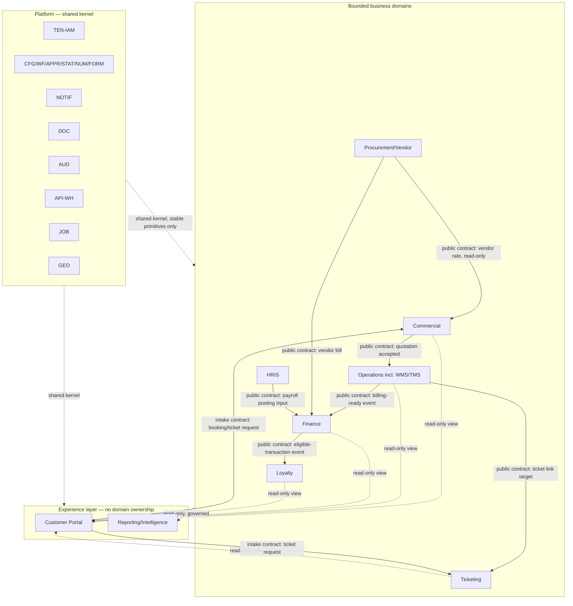

# 03 — Domain Boundary Map

**Prompt:** `CG-S3-ARCH-003` (`CG-AABPP-ARCH-038` v0.4.0)
**Runtime output of:** `docs/ai-agent-build-prompt-package/03-architecture-and-plan/38_DOMAIN_BOUNDARY_MAP_PROMPT.md`
**Status:** `VERIFIED`

> **Amendment (Prompt 40, `docs/architecture/05_DATABASE_SCHEMA_WORKSTREAM.md` §1/§3):** the "Table/schema namespace" column in §3 below (`commercial.*`, `operations.*`, `finance.*`, ...) and `ADR-CAND-ARCH-007` in §11 recommended PostgreSQL schema-per-domain. Concrete SQL evidence found while authoring Prompt 40 (Tech Arch §11.3's example RLS policy, §32.6's example indexes — both use a single flat `app` schema, e.g. `app.shipments`, `app.vendor_rates`) contradicts that recommendation and outranks it. `ADR-CAND-ARCH-007` is **resolved**: one `app` schema for all tenant-owned tables, plus a separate `report` schema for materialized views only; domain ownership is enforced at the application/RLS layer, not by physical schema boundary. Read the namespace column below as superseded by this amendment; every other part of this document (ownership catalogue, contracts, shared kernel, access responsibilities) is unaffected.

## 0. Checkpoint

| Field | Value |
|---|---|
| Repository | `assujiar/cargogrid.app` |
| Working branch | `agent/cargogrid-autonomous-build` |
| HEAD at authoring time | `495fb8abe28c67e8fd4f638012bfca92d0c5bbeb` (parent of this checkpoint's commit) |
| Precondition | `docs/architecture/01_MODULE_DEPENDENCY_MAP.md` and `02_CANONICAL_DATA_FLOW_MAP.md` both `VERIFIED` |
| Repository state | Unchanged: 100% documentation, zero application code |

### Inputs read (beyond `01_*.md`/`02_*.md`, already fully loaded)

- Tech Arch §7.1 (App Router structure, verbatim), §7.5 (Route Handler rules), §8 (Backend Module Layout, verbatim — already cited in `01_*.md` §3.1), §9.1–9.4 (schema strategy, domain boundaries, foreign keys), §10 (multi-tenancy), §11.2 (RLS helper functions)
- `298_CUSTOMER_PORTAL_LOYALTY_README.md` "Non-negotiable boundaries" (already quoted in `02_*.md` §3.5) — this is the single clearest existing ownership-boundary statement in the whole package and is used here as the primary corroborating source, not re-derived
- `docs/discovery/12_GREENFIELD_BROWNFIELD_DECISION.md` (current-to-target reconciliation is trivial: nothing exists to preserve/move/wrap/retire)

## 1. Scope and method

This document formalizes the domain boundaries already implicit in `01_MODULE_DEPENDENCY_MAP.md`'s module catalogue and `02_CANONICAL_DATA_FLOW_MAP.md`'s canonical entity register into bounded-context contracts: one authoritative owner per entity/table-namespace/route/API/event/report/file/config, explicit allowed-dependency directions, and enforcement rules. No new module, entity, or dependency is introduced — this document only adds the **boundary and contract layer** around what 01/02 already established. Because the repository is confirmed `GREENFIELD` (zero code), the "current-to-target" reconciliation required by the prompt (§7) has exactly one class of finding: everything is `TARGET`, nothing is `PRESERVE`/`MOVE`/`WRAP`/`RETIRE` — recorded once in §7, not repeated per entity.

## 2. Boundary context map

Experience-layer modules (`CPT`, `REP`) own **no canonical entity** — every field they display or accept is owned by a business domain or the platform kernel. This is the formal statement of the rule `298_*.md` already states in prose ("Customer Portal is Layer 4 only... Portal routes, payloads, filters and saved views never become trust roots") and that `01_*.md` §11 R2/R11 and `02_*.md` §3.5 already assume.

## 3. Ownership catalogue

Table/schema namespace, service/module, UI route, API, and event/job ownership, one row per bounded domain. Namespace convention derives from Tech Arch §9.2 (`tenant_id` + domain-prefixed tables) and §7.1 (App Router route groups); no naming scheme is invented beyond what those sections already specify.

| Domain | Entities owned (from `02_*.md` §2) | Table/schema namespace | Service/module (`server/` per Tech Arch §8) | UI route group (Tech Arch §7.1) | API namespace | Events/jobs owned |
|---|---|---|---|---|---|---|
| Platform (`TEN-IAM`,`CFG`,`WLB`,`MDM`,`WF`,`APPR`,`STAT`,`NUM`,`FORM`,`NOTIF`,`DOC`,`API-WH`,`IMPEXP`,`JOB`,`FLAG`,`GEO`,`AUD`,`PORTAL-ADM`) | tenant, company, branch, user, role, permission, membership, module/feature/form/field/workflow/approval/status/numbering/terminology config, file, api_key, webhook, job, audit_log, event_log, api_log, file_access_log, support_access_log | `app.*`, `platform.*` | `server/policies/`, `server/integrations/` (platform-owned adapters only), `server/jobs/` | `(supreme)/supreme/**`, `(tenant)/[tenantSlug]/admin/**` | `/api/v1/tenants/{tenant_id}/{admin,config,files,webhooks}` | tenant provisioning, config publish, notification dispatch, malware-scan job, import/export job, audit event |
| Commercial (`COM`) | lead, prospect, customer (legal/tax/billing/hierarchy/contact/service-req/contract-pricelist/portal-user), opportunity, quotation, contract | `commercial.*` | `server/queries/commercial.ts` (etc.), `server/mutations/quotation.ts` | `(tenant)/[tenantSlug]/commercial/**` | `/api/v1/tenants/{tenant_id}/{leads,customers,opportunities,quotations,contracts}` | quotation approval event, customer-created event |
| Operations, incl. TMS/WMS (`OPS`) | job order, shipment, leg, route, dispatch, milestone, ePOD, claim/incident, warehouse/zone/rack/bin/SKU/inventory/inventory-ledger, actual cost | `operations.*`, `wms.*` | `server/queries/shipments.ts`, `server/mutations/shipment.ts` | `(tenant)/[tenantSlug]/operations/**` | `/api/v1/tenants/{tenant_id}/{shipments,warehouses,dispatch}` | milestone event, dispatch-board realtime channel, billing-ready event |
| Finance (`FIN`) | COA, journal, subledger, AR invoice, AP vendor bill, payment, settlement, tax, period lock, profitability | `finance.*` | `server/queries/finance.ts`, `server/mutations/*` (posting) | `(tenant)/[tenantSlug]/finance/**` | `/api/v1/tenants/{tenant_id}/{invoices,payments,journals}` | posting event, recurring-billing job, eligible-transaction event (→ Loyalty) |
| Procurement/Vendor (`PRC`) | vendor, vendor rate, RFQ, assessment, contract, performance, PO | `procurement.*` | `server/queries/procurement.ts` | `(tenant)/[tenantSlug]/procurement/**` | `/api/v1/tenants/{tenant_id}/{vendors,rfq,purchase-orders}` | vendor-invoice-matched event (→ Finance) |
| HRIS (`HRS`) | employee, position/org, attendance, payroll, KPI | `hris.*` | `server/queries/hris.ts` | `(tenant)/[tenantSlug]/hris/**` | `/api/v1/tenants/{tenant_id}/{employees,attendance,payroll}` | payroll-posting-input event (→ Finance) |
| Ticketing (`TKT`) | ticket (3-channel), SLA, escalation, typed link | `ticketing.*` | `server/queries/tickets.ts` | `(tenant)/[tenantSlug]/support/**` | `/api/v1/tenants/{tenant_id}/tickets` | escalation event, SLA-breach event |
| Loyalty (`LYL`) | program, tier, point ledger, cashback ledger, reward, redemption | `loyalty.*` | `server/queries/loyalty.ts` | `(tenant)/[tenantSlug]/loyalty/**` | `/api/v1/tenants/{tenant_id}/loyalty` | ledger-entry event, expiry job |
| Customer Portal (`CPT`, no ownership) | none (read-scoped views + intake) | none (queries only, no `cpt.*` schema) | `server/queries/portal.ts` (read-only re-query of owning domains, scoped by `customer_account_id`) | `(customer)/portal/[tenantSlug]/**` | `/api/v1/customer/{tenant_id}/{shipments,invoices,tickets}` (customer-scoped subset of owning domains' API) | booking-request intake event (→ `COM`), ticket-request intake event (→ `TKT`) |
| Reporting/Intelligence (`REP`, no ownership; Phase 9 full engine) | none (materialized/derived only) | `reporting.*` (materialized views/reporting tables only, never source-of-truth) | `server/queries/reports.ts` | `(tenant)/[tenantSlug]/dashboard/**`, `(supreme)/supreme/**` (cross-tenant, Supreme-only) | `/api/v1/tenants/{tenant_id}/reports` | scheduled-refresh job, export job |

## 4. Allowed dependency directions

Directly derived from `01_MODULE_DEPENDENCY_MAP.md` §3 (not re-derived): platform kernel → every domain (one direction only, kernel never depends on a business domain); business domain → business domain per the specific edges in `01_*.md` §3.3 (no domain may call another domain not named there); every business domain → `REP`/`AUD` (read/append only, one direction); `CPT` → owning domain (read) and owning domain → `CPT` (read) are the only two directions Customer Portal participates in, plus the two named intake contracts (§5). **No business domain may depend on `CPT` or `REP`** — both are strictly downstream/leaf nodes, consistent with §2's diagram.

## 5. Public contracts and anti-corruption boundaries

Every cross-domain edge in `01_*.md` §3.3 becomes a named contract here. A contract is the *only* legal way one domain's code may act on another domain's data — direct table writes across the boundary are a violation regardless of RLS/RBAC passing (RLS/RBAC controls *who*, not *whether the write goes through the owning domain's code path*).

| Contract | Provider → Consumer | Payload (canonical fields only) | Direction | Enforcement |
|---|---|---|---|---|
| Quotation-accepted → Job Order | `COM` → `OPS` | `quotation_id`, `contract_id`, `customer_id`, service/commodity fields (§14.1/14.2 dictionaries) | Sync, server action | `OPS` calls `COM`'s query layer to read; `OPS` never writes to `commercial.*` |
| Vendor-rate lookup | `PRC` (owner) → `COM`/`OPS` (readers) | `vendor_rate_id`, rate, validity window | Sync, read-only | Readers query `PRC`'s exposed view/API; never copy into a local table (see `ADR-CAND-ARCH-001`) |
| Billing-readiness event | `OPS` → `FIN` | `shipment_id`, `job_order_id`, ePOD status, actual cost | Async (event/job) | `FIN` creates its own `invoice_id`; `OPS` never writes to `finance.*` |
| Vendor-bill-matched event | `PRC` → `FIN` | `po_id`, `vendor_id`, matched amount | Async | `FIN` owns `vendor_bill_id`; `PRC` never posts |
| Payroll-posting-input event | `HRS` → `FIN` | payroll run summary, no field-level salary detail unless `FIN`-role-scoped | Async | `FIN` owns the journal; `HRS` "never edits posted journals" (`272_*.md`, quoted in `02_*.md` §3.3) |
| Eligible-transaction event | `FIN` → `LYL` | `invoice_id`, payment-confirmed flag, customer_id | Async, idempotent per transaction | `LYL` creates its own `point_ledger_id`; never reads/writes `finance.*` directly |
| Typed ticket link | `OPS`/`FIN`/`PRC`/`CPT` → `TKT` | `record_type`, `record_id` (typed reference, Tech Arch §9.4) | Sync, validated | `TKT` validates target existence/lifecycle at link time (`ADR-CAND-ARCH-006`); a link grants no access by itself — every read re-checks both ticket and linked-record authorization (`272_*.md`, quoted in `02_*.md`) |
| Booking/quote-request intake | `CPT` → `COM` | customer-submitted request fields | Sync, server action | Enters through `COM`'s existing lead/opportunity creation path — **not** a parallel `cpt.*` table (`01_*.md` §11 R11) |
| Ticket-request intake | `CPT` → `TKT` | customer-submitted ticket fields | Sync, server action | Enters through `TKT`'s existing ticket-creation path, channel = customer-to-tenant |
| Any domain → `REP` | domain → `REP` | governed dataset (Tech Arch §18.2: tenant-aware, permission-aware, restricted fields excluded) | Async/sync read | Read-only query or materialized-view refresh; `REP` never writes back |

**Anti-corruption rule (binding, restates `01_*.md` §11 R1 in contract-map form):** a consumer receiving data across a contract boundary must translate it into its own local read model/DTO, not persist the provider's internal schema shape as its own canonical table. This prevents schema coupling from leaking a provider's internal refactor into every consumer.

## 6. Shared kernel

Per the prompt's instruction to "constrain [shared-kernel candidates] to stable primitives," the shared kernel is **exactly** the Platform primitive set already catalogued in `01_MODULE_DEPENDENCY_MAP.md` §2.1 — no additional shared kernel is introduced here. Stability rule: a primitive qualifies for the shared kernel only if every business domain consumes it identically (same contract, no domain-specific variant) — `TEN-IAM`, `CFG`/`WF`/`APPR`/`STAT`/`NUM`/`FORM`, `NOTIF`, `DOC`, `AUD`, `API-WH`, `JOB`, `FLAG`, `GEO` all satisfy this (verified against `01_*.md` §3.1–3.2: every edge from these primitives to business domains uses the same edge type and contract). `REP` does **not** qualify as shared kernel — it is a downstream consumer, not a primitive every domain depends on for its own operation.

**Intentional duplication (not accidental):** none identified — `02_CANONICAL_DATA_FLOW_MAP.md` §4 lineage table's "Re-entry Allowed? No" column, extended by the "no duplicate master" rules quoted from `249_*.md`/`272_*.md`, establishes that duplication is never intentional at the canonical-entity level in this system. The only sanctioned near-duplication is the Commercial Phase-2 vendor-rate **read** (not a copy — see §5's "Vendor-rate lookup" contract), which is explicitly temporary/interim per `CON-006` and tracked as `ADR-CAND-ARCH-001`, not a second shared kernel.

## 7. Data and access responsibilities at boundaries

Restates `02_CANONICAL_DATA_FLOW_MAP.md` §10's 7-layer chain (Blueprint §24) as a per-boundary responsibility split, so Prompt 39/41 have an unambiguous "who checks what, where" table:

| Layer | Checked by | At which boundary |
|---|---|---|
| Tenant isolation (RLS) | PostgreSQL (`app.current_tenant_id()`, `app.is_tenant_member()`, Tech Arch §11.2) | Every table read/write, regardless of domain |
| Module entitlement | Platform (`TEN-IAM`) | Before any domain route/API resolves |
| RBAC action | Owning domain's `server/policies/permission-check.ts` | At the domain's own query/mutation/action entry point — never at the caller |
| Scope (company/branch/department/team/owner/customer/region/value/status) | Owning domain | Same as RBAC — scope is domain-specific business logic, not a platform primitive |
| Field-level security | Owning domain, using the platform's field-policy primitive | Response serialization, before crossing any contract boundary in §5 |
| Lifecycle (status) permission | Owning domain | At mutation time, against that domain's own status lifecycle (`02_*.md` §3) |
| Document/file access (signed URL) | `DOC` (platform primitive) | Whenever any domain requests a signed URL — `DOC` is the sole issuer |
| Support-grant / Supreme Admin | Platform (`TEN-IAM`/`AUD`), time-bound, logged (RPD-035) | Cuts across every boundary above; disclosed exception (RPD-022) — never presented as absent |

## 8. Current-to-target mapping

`docs/discovery/02_EXISTING_IMPLEMENTATION_AUDIT.md` and `05_ROUTE_MODULE_INVENTORY.md` confirm zero implemented tables, services, routes, or APIs. Applying the prompt's required classification (`CURRENT`/`PRESERVE`/`MOVE`/`WRAP`/`RETIRE`/`UNKNOWN`) to every entry in §3's ownership catalogue: **100% `TARGET`, 0% `PRESERVE`/`MOVE`/`WRAP`/`RETIRE`/`UNKNOWN`.** No per-row repetition of this fact is needed elsewhere in this document. The only artifacts that exist today and are `PRESERVE`d unchanged by this document are the ones already listed in `01_MODULE_DEPENDENCY_MAP.md` §8 (blueprint, prompt package, control registers, runtime ledgers, discovery evidence).

## 9. Boundary violations (patterns to detect, not instances found)

No violation exists today (no code exists). This section defines what Prompt 39's repository-structure enforcement and later lint/test tooling must be able to detect once code exists:

1. A business-domain module importing another domain's `server/queries/*` or `server/mutations/*` file directly instead of going through that domain's public contract (§5).
2. A business-domain module querying another domain's table/schema namespace (§3) directly, bypassing RLS-scoped views.
3. `CPT` (Customer Portal) code containing any direct Supabase table query instead of routing through an owning domain's query layer (`01_*.md` §11 R2).
4. `CPT` code writing to a `cpt.*` shadow table for a business object owned elsewhere (§11 R11; §5 intake contracts).
5. `REP` (Reporting) code containing a write statement of any kind.
6. Any domain re-implementing a Platform primitive (a second notification/document/audit/config engine) instead of consuming the shared kernel (§6).
7. A generic cross-integration-category provider abstraction spanning the 17 categories in Tech Arch §26.1, prohibited by RPD-038 regardless of which domain introduces it.

## 10. Enforcement and test strategy

- **Static enforcement (Prompt 39, Repository Target Structure):** folder-boundary convention (one directory per domain under `server/`) plus an import-boundary lint rule that fails a build importing across domain folders except through an explicit `contracts/` or public-API surface — this document's §5 contract list is the exact allow-list that rule must encode.
- **RLS regression tests (Prompt 41):** every table in §3's namespace list gets a negative test proving cross-tenant and cross-domain-bypass access fails, per Tech Arch §11.4 and `01_*.md` §11 R1.
- **Contract tests (Prompt 43, API/Integration Workstream):** one test per row in §5 asserting the payload shape and that the consumer never persists more than the contract's canonical fields.
- **Portal-boundary tests (Prompt 45, Testing Workstream):** assert `CPT` routes never resolve a direct table query (violation pattern §9.3) and that both intake contracts (§5) land in the owning domain's existing table, not a new one.
- **Shared-kernel drift test:** a scheduled check (or code-review gate) that a new Platform primitive is not silently introduced by a business domain — anything claiming kernel status must be reviewed against §6's stability rule.

## 11. ADR candidates (new, specific to domain boundaries)

| ID | Question | Constraint | Recommendation | Owner | Blocking state |
|---|---|---|---|---|---|
| `ADR-CAND-ARCH-007` | Should domain ownership be enforced by PostgreSQL schema separation (`commercial.*`, `operations.*`, ...) or by a single `public` schema with domain-prefixed table names and RLS-only isolation? | Tech Arch §9.1 fixes shared-database-shared-schema for *tenant* isolation but does not address *domain* namespace strategy | Use PostgreSQL schemas per domain (as tabulated in §3) — gives the import-boundary lint rule (§10) a DB-level backstop, not just an application-level convention, at negligible cost since RLS still operates per-table regardless of schema | Architecture/Data | `ADR_REQUIRED`, non-blocking — resolve at Prompt 40 (Database Schema Workstream) |
| `ADR-CAND-ARCH-008` | Does the Reporting/Intelligence domain (`REP`) get its own PostgreSQL schema (`reporting.*`) from Phase 1 (basic per-domain dashboards) or only from Phase 9 (full engine)? | `01_*.md` §2.1 tags `REP` phase "1 (basic) / 9 (full)" | Create the `reporting.*` schema convention at Phase 1 so early per-domain dashboards already follow the never-write, materialized-view-only pattern, rather than retrofitting it at Phase 9 | Architecture/Data | `ADR_REQUIRED`, non-blocking — resolve at Prompt 40 |

## 12. Phase ownership

Unchanged from `01_MODULE_DEPENDENCY_MAP.md` §10 — this document adds no new phase and does not reorder any domain's phase. Boundary enforcement tooling (§10) must exist by the time each domain's phase begins, not retrofitted afterward: the import-boundary lint rule and RLS regression tests are Phase 1 deliverables (they must cover the shared kernel from day one); per-domain contract tests are added as each domain's phase lands.

## 13. Completion statement

Every requirement family and canonical entity from `01_*.md`/`02_*.md` has exactly one primary boundary owner in §3. Cross-boundary writes are controlled by ten named contracts (§5) plus the anti-corruption rule. No tenant fork is introduced (Tech Arch's shared-schema default, §9.1, is preserved as-is). No generic non-AI provider abstraction is introduced (§9 violation-pattern 7 explicitly forbids it, consistent with RPD-038). Prompt 39 can derive a target repository structure directly from §3's namespace/route/API columns and §9's enforcement requirements without inventing a boundary this document didn't already define.

Next eligible prompt: `03-architecture-and-plan/39_REPOSITORY_TARGET_STRUCTURE_PROMPT.md` → `docs/architecture/04_REPOSITORY_TARGET_STRUCTURE.md`.
