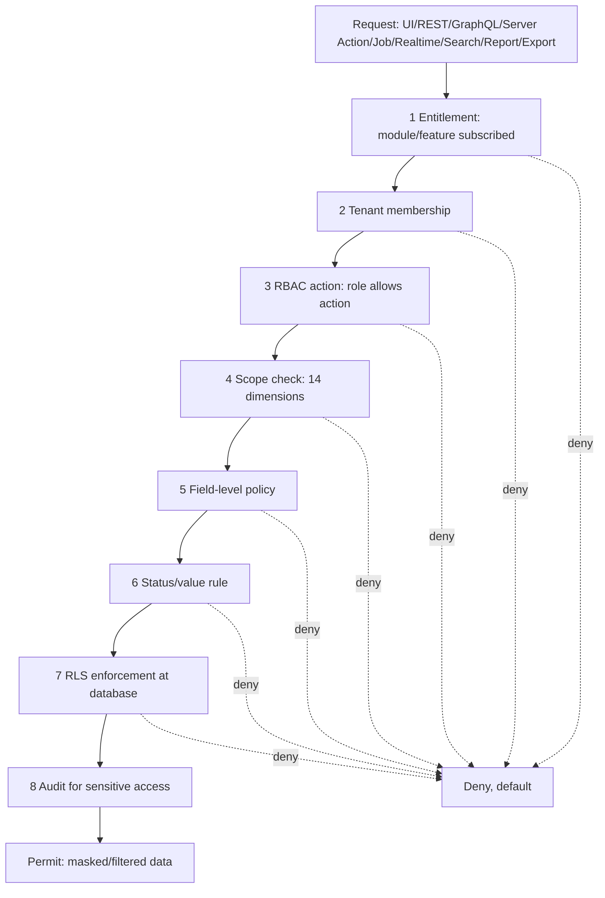

# 06 — RLS/RBAC Workstream

**Prompt:** `CG-S3-ARCH-006` (`CG-AABPP-ARCH-041` v0.4.0)
**Runtime output of:** `docs/ai-agent-build-prompt-package/03-architecture-and-plan/41_RLS_RBAC_WORKSTREAM_PROMPT.md`
**Status:** `VERIFIED`

## 0. Checkpoint

| Field | Value |
|---|---|
| Repository | `assujiar/cargogrid.app` |
| Working branch | `agent/cargogrid-autonomous-build` |
| HEAD at authoring time | `fffd8463ba512b6bc27196b73d410770c15c2f4c` (parent of this checkpoint's commit) |
| Precondition | `docs/architecture/01_*.md` through `05_*.md` all `VERIFIED` |
| Repository state | Unchanged: zero policy, zero permission, zero code (`docs/discovery/06_SECURITY_BASELINE.md` confirms every auth/session/RLS/RBAC/support/impersonation surface `NOT_FOUND`) |
| Mutation performed | **NONE** — planning only; no policy or permission was written (prompt precondition, verified) |

### Inputs read (beyond `01–05_*.md`, already fully loaded)

- Tech Arch §11 (RLS, full: principles, helper functions, example policy, testing — already partially cited, now used in full)
- Tech Arch §12 (RBAC, full: 19 permission actions, 14 scope dimensions, 7-stage evaluation order, field-level security)
- Tech Arch §23 (Security Architecture, full: boundary diagram, authentication, 8-layer authorization, optional ABAC, MFA/SSO/OAuth/SAML table, token/session security, encryption/secrets, PII/financial/payroll categories, privileged access, incident response)
- `docs/blueprint/03_CargoGrid_UX_Data_Access_Design.md` §23 (Data Ownership), §24 (Data Access Model), §25 (Role/Permission Matrix — already captured in full from the Prompt 37 research pass)
- `docs/discovery/06_SECURITY_BASELINE.md` (confirms zero implementation across every auth/RLS/RBAC/support/impersonation/secrets/logging surface)
- `00-control/02_CONFIRMED_DECISION_REGISTER.md` RPD-023 (MFA mandatory for privileged roles), RPD-035 (time-bound/purpose-bound/logged support access)

## 1. Scope and method

No policy or permission is written by this document (prompt precondition). Every table in scope is the exact ~60-table catalogue from `05_DATABASE_SCHEMA_WORKSTREAM.md` §3 (single `app` schema, per that document's resolution of `ADR-CAND-ARCH-007`) — no table is added or removed here. This document adds the authorization design layer: which policy family applies to each table, the exact evaluation order, the permission taxonomy, and the negative-test matrix that later Prompt-105–140 (Platform Core) implementation prompts must satisfy.

## 2. Access model

### 2.1 Identities and principals

| Principal type | Source | Scope boundary |
|---|---|---|
| Internal user | `users` (Tech Arch §9.2/§11.2 `auth.uid()`) | `tenant_id` via `user_tenant_memberships` |
| Customer portal user | `customers` → `Portal user` field group (`02_*.md` §14.1) | `customer_account_id`, never broader |
| Service identity (Edge Function/worker/job) | Supabase service role, server-trusted boundary only (Tech Arch §8 Backend Rules) | No browser reachability, ever |
| API key principal | `api_keys` (`05_*.md` §3, Platform `API-WH`) | Scoped to the issuing tenant + declared permission grant |
| Support/impersonation principal | Time-bound grant record (Tech Arch §23.9, RPD-035) | Explicit grant record, expiring, logged |
| Supreme Admin | Platform-level, cross-tenant | Absolute CRUD, disclosed exception (RPD-022) — see §8 |

### 2.2 Scope dimensions (Tech Arch §12.2, verbatim — 14 dimensions)

Tenant, Company, Branch, Department, Team, Role, User, Record owner, Customer, Service, Region, Business unit, Transaction value, Transaction status.

### 2.3 Delegation and support grants

A support/delegation grant is itself a row (`support_access_grants`, new table — not previously listed in `05_*.md` §3, added here as it belongs to this workstream's access-model layer, not the schema-catalogue layer): `tenant_id`, `grantee_user_id`, `reason`, `case_id`, `scope`, `granted_at`, `expires_at`, `revoked_at`. Every support-access RLS policy (§4) joins against this table's `expires_at > now() AND revoked_at IS NULL` condition — an expired or revoked grant fails closed, per Tech Arch §11.1's "Support access requires active support grant."

## 3. Evaluation flow

Tech Arch has two versions of this flow at different granularity — §12.3 (7 stages, permission-centric) and §23.3 (8 stages, request-centric, adds RLS and audit as explicit final stages). This document adopts §23.3 as the canonical end-to-end flow (it is a strict superset — §12.3's 7 stages map onto §23.3's stages 1, 2, 3, 4, 5, 6, and 7 exactly) and applies it uniformly across every access surface named in the prompt (UI, REST, GraphQL, server actions, database, storage, jobs, realtime, search, reports, exports):

**Deny-by-default is structural, not a fallback**: any stage that cannot affirmatively permit returns `Z` (deny) — there is no "permit if stage is inconclusive" path anywhere in this flow, matching Tech Arch §11.1's "Default deny: No policy, no access."

This flow is identical regardless of entry surface — a GraphQL resolver, a REST route handler, a Server Action, and a background job all call the same underlying stages 3–8 (RBAC/scope/field/status/RLS/audit) via the shared `server/policies/permission-check.ts` module (`04_*.md` §4) — the entry surface only changes stage 1/2's transport (session cookie vs. API key vs. service-role job context), never the evaluation logic itself. This is the concrete mechanism behind RPD-033 (REST and GraphQL share authorization).

## 4. Tenant/RLS matrix

Every table in `05_*.md` §3 is assigned exactly one RLS policy family. Rather than 60 individual rows (redundant with `05_*.md` §3), this table groups tables by policy family and cites the representative table Tech Arch §11.3's example policy already covers:

| Policy family | Applies to | Tenant key | Privileged path | Bypass prohibition | Ownership | Negative-test suite |
|---|---|---|---|---|---|---|
| `standard_tenant_scoped` | Master/transaction tables with no customer-portal or field-sensitivity exposure (`chart_of_accounts`, `warehouses`, `skus`, `vendors`, `employees`, ...) | `tenant_id` | Supreme Admin (§8) | Service role never reachable from browser (Tech Arch §8) | Owning domain per `03_*.md` §3 | Tenant A cannot select Tenant B rows (Tech Arch §11.4 item 1) |
| `customer_portal_scoped` | Tables read/written by `CPT` (`shipments`, `invoices`, `tickets`, `warehouse_orders` — portal-visible subset) | `tenant_id` + `customer_account_id` (Tech Arch §11.3's `app.can_access_record` example, verbatim) | Supreme Admin, tenant Ops/Finance/Support roles | Customer user cannot access shipment outside assigned account (§11.4 item 2) | Owning domain (never `CPT` itself, `03_*.md` §5) | Same as above + portal-boundary test |
| `branch_scoped` | Tables with `branch_id` dimension and department/team-level access (`attendance_records`, `payroll_runs`, most `OPS` tables) | `tenant_id` + `branch_id`/`department_id` | Director/GM (company-wide per `03_*.md` §25 role matrix), Supreme Admin | Internal user branch-limited cannot access other branch (§11.4 item 3) | Owning domain | Branch-boundary negative test |
| `field_masked` | Tables carrying cost/margin/finance/payroll/PII/security-secret fields (`journals`, `payroll_lines`, `api_keys`, any table with a §12.4 sensitive field group) | Same as underlying policy family + field projection | Role holding the specific `View cost`/`View margin`/`View payroll`/`View personal data` permission (§5) | User without `view_cost` cannot access cost fields via API/view (§11.4 item 4) | Owning domain | Field-masking negative test per sensitive field group |
| `append_only_ledger` | `journals`, `journal_lines`, `point_ledger`, `cashback_ledger`, `inventory_ledger`, `audit_logs`, `event_logs`, `api_logs`, `file_access_logs`, `support_access_logs` | `tenant_id` | **Supreme Admin only** (RPD-022 exception, §8) | No `UPDATE`/`DELETE` grant to any normal role after `posted_at`/`created_at` (`05_*.md` §4) | Owning domain (Finance for ledgers, Platform `AUD` for logs) | Posted-record immutability test; Supreme-Admin-mutation audit-trail test |
| `support_access_gated` | Any table accessed under a support/impersonation grant | `tenant_id` + active grant (§2.3) | CargoGrid Support role, time-bound | Support access expired cannot read tenant data (§11.4 item 5) | Platform `TEN-IAM`/`AUD` | Expired-grant-denied test |
| `service_role_only` | `jobs`, `import_staging_rows`, integration adapter tables | N/A (service context, not a user session) | Edge Function/worker only | Service role function cannot be called by normal user (§11.4 item 6) | Platform `JOB`/`INTHUB` | Service-role-unreachable-from-browser test |

Every export/list/detail query uses the same policy family as its underlying table — "Export respects same scope as list/detail" (§11.4 item 7) is not a separate policy, it is the same RLS policy applied to a different query shape (bulk `SELECT` vs. paginated `SELECT`), enforced identically.

## 5. Permission catalogue

### 5.1 Permission actions (Tech Arch §12.1, verbatim — 19 actions)

View, Create, Edit, Delete, Approve, Reject, Assign, Export, Import, Print, Download, View cost, View selling price, View margin, View payroll, View personal data, Configure, Override, Reopen, Close.

### 5.2 Field masking / redaction

Directly implements Tech Arch §12.4's sensitive-field-group table, now bound to specific permission actions from §5.1:

| Field group | Gating permission | Default |
|---|---|---|
| Cost/margin | `View cost` / `View margin` | Hidden unless granted |
| Finance | (role-restricted, no single dedicated action — gated by role membership per Tech Arch §12.4) | Restricted |
| Payroll | `View payroll` | HR/payroll only |
| PII | `View personal data` | Need purpose/role |
| Security (API key/webhook secret) | none — always masked, no permission can unmask an exported value (Tech Arch §23.7 "API keys shown only once") | Masked always |
| Support (impersonation token/grant) | Platform-security-only, not a tenant-assignable permission | Platform security only |

### 5.3 Record ownership / sharing / separation of duties

Record ownership follows `owner_user_id` (§2's scope dimension "Record owner") with sharing expressed as additional scope grants (team/department/branch), never a second ownership column — matches `03_*.md` §4's "one authoritative owner" principle applied at the row level, not just the table level. Separation of duties: the same user may not both create and approve the same transaction where the transaction's approval matrix requires a distinct approver (`05_*.md` §5's approval-matrix reference); this is enforced at the `APPR` engine level (an RLS/RBAC concern only insofar as the approval action's permission check must resolve the actor's identity against the transaction's `created_by`/`owner_user_id`, denying self-approval where the workflow config forbids it).

### 5.4 Approval authority

Approval authority is itself scope-dimensioned (Tech Arch §12.2's "Transaction value" and "Transaction status" dimensions) — e.g., a Manager's `Approve` permission on `quotations` may be capped at a value threshold, escalating to Director/GM above it (matches `03_*.md` §25's role-matrix "Y threshold" cells for Manager rows). No new mechanism beyond §3's evaluation flow stage 6 (Status/value rule) is required.

### 5.5 Sensitive HR/finance access

Payroll (`payroll_runs`/`payroll_lines`) and Finance ledgers (`journals`) both require their §5.2 gating permission **and** pass through `append_only_ledger`/`field_masked` policy families (§4) simultaneously — a user with `View payroll` still cannot `UPDATE` a posted `payroll_lines` row, since the ledger-family RLS policy is evaluated independently of (and after) the field-masking check.

## 6. Privileged and support access paths

- **Supreme Admin** (§8 below) — absolute CRUD, disclosed exception.
- **Support access**: requires ticket/case (Tech Arch §23.9), time-bound (§2.3's `expires_at`), visible impersonation banner during active grant, all actions logged to `support_access_logs` (`05_*.md` §6), no silent cross-tenant browsing.
- **MFA** (RPD-023, Tech Arch §23.5): mandatory for Supreme Admin, tenant admin, finance approver, credential manager; tenant may require it tenant-wide. MVP scope = admin/privileged roles; Enterprise = per-tenant-policy enforcement.
- **Session/token security** (Tech Arch §23.6, verbatim): service role key never in browser; secure HTTP-only cookies where applicable; secret rotation; session revocation on user deactivation; step-up auth for security-sensitive actions; session logs available to admin/security.
- **Machine identities**: API keys and service-role contexts are principals with no session/MFA concept — instead governed by key rotation/revocation (Tech Arch §23.7: "Key rotation with overlap window," "API keys shown only once") and the `service_role_only` policy family (§4).

## 7. API, job, file, report controls

- **API (REST/GraphQL)**: both share the same 8-stage evaluation flow (§3) and the same RPD-033 governance already established in `01_*.md` §6 — no separate authorization model for GraphQL.
- **Jobs**: run under the `service_role_only` family (§4); a job's `payload` still carries the originating `tenant_id`/actor context so downstream mutations it performs re-enter the evaluation flow at stage 2 as if the originating user had made the call directly (no job silently escalates privilege beyond what its triggering user held).
- **Files**: signed-URL issuance is itself gated by the evaluation flow (Tech Arch §17.3: "Download permission checked before signed URL generation") plus the malware-scan gate (RPD-032, `05_*.md` §6) — two independent gates, both must pass.
- **Reports/exports**: read-only, same policy family as the underlying table (§4); "Cross-tenant SaaS reporting only for Supreme Admin and should aggregate/anonymize" (Tech Arch §18.2) is enforced as a distinct `report_cross_tenant` sub-case of the `service_role_only`/Supreme-Admin path, not a new policy family.
- **Search/realtime**: search starts in PostgreSQL FTS/trigram (RPD-039) under the same RLS policy as the underlying table (no separate search-index authorization layer until an external search engine is introduced past a measured threshold); realtime channels are scoped per Tech Arch §32.13's allow-list (dispatch board, active shipment timeline, approval counter, ticket assignment, warehouse task queue) — no table's full row stream is ever broadcast unfiltered.

## 8. Supreme Admin semantics (RPD-022, binding)

Preserved literal, not softened: **Supreme Admin has absolute CRUD**, including the ability to alter or delete any record, including audit, journal, payment, and final records (RPD-022, verbatim from `00-control/02_*.md`). This is implemented as a distinct RLS policy on every `append_only_ledger`-family table (§4) that grants `UPDATE`/`DELETE` to the Supreme Admin role specifically, alongside (not instead of) the normal-role policy that denies it. **CargoGrid must never claim audit or financial records are immutable or tamper-proof** — every place this document, `05_*.md`, or any later prompt describes ledger/audit immutability must carry this disclosed exception. Every Supreme Admin mutation of a normally-immutable record is itself logged to `audit_logs` with before/after values (Tech Arch §22.1), which is the accountability mechanism substituting for true immutability — the log entry itself is still technically alterable by the same Supreme Admin authority, and this residual risk is accepted, not resolved, per `01_MODULE_DEPENDENCY_MAP.md` `RISK-004` (standing, never closed).

## 9. Policy performance and rollout

- **Performance**: every RLS policy's helper-function calls (`app.current_tenant_id()`, `app.is_tenant_member()`, `app.can_access_record()`) must be `STABLE` (already shown as such in Tech Arch §11.2's example) so the query planner can evaluate them once per query, not per row; every table's tenant-leading index from `05_*.md` §7 is a prerequisite for RLS performance at scale, not an independent optimization.
- **Cached authorization invalidation**: role/permission changes must invalidate any cached entitlement/RBAC decision immediately (no stale-permission window) — session-level permission caches (if introduced for performance) are keyed by `(user_id, role_version)` and bumped on every role/permission mutation, mirroring the `record_version` optimistic-concurrency pattern from `05_*.md` §4.
- **Rollout sequence**: RLS is enabled table-by-table in the same order `05_*.md` §12's atomic backlog creates tables — `enable row level security` plus its default-deny policy ships in the **same migration** as the table's creation, never as a follow-up migration (a table that exists without RLS enabled is a critical/Sev-1 defect per `RISK-004`'s adjacent standing-risk framing, not an acceptable interim state).
- **Migration compatibility**: adding a new scope dimension to an existing policy (e.g., adding `region` scoping to a table that previously only had `branch_id` scoping) follows the expand/migrate/contract wave policy from `05_*.md` §8 — the old and new policy coexist during the expand phase, verified by both negative-test suites passing, before the old policy is contracted away.
- **Emergency recovery**: if an RLS policy bug causes either an over-broad grant (security incident) or an over-restrictive deny (availability incident), the fix follows Tech Arch §23.10's 8-stage incident response (Detect→Triage→Contain→Eradicate→Recover→Notify if required→Post-incident review→Control improvement); "Contain" for an over-broad grant means immediately tightening the policy (a forward-fix migration), never disabling RLS entirely on the affected table.

## 10. Negative and abuse test matrix

Directly reproduces Tech Arch §11.4's minimal list (verbatim, 7 items — already distributed into §4's table) plus additions from this document's own analysis:

| # | Test | Source |
|---|---|---|
| 1 | Tenant A cannot select Tenant B rows | Tech Arch §11.4 |
| 2 | Customer user cannot access shipment outside assigned account | Tech Arch §11.4 |
| 3 | Internal user branch-limited cannot access other branch | Tech Arch §11.4 |
| 4 | User without `view_cost` cannot access cost fields via API/view | Tech Arch §11.4 |
| 5 | Support access expired cannot read tenant data | Tech Arch §11.4 |
| 6 | Service role function cannot be called by normal user | Tech Arch §11.4 |
| 7 | Export respects same scope as list/detail | Tech Arch §11.4 |
| 8 | A `posted` journal/ledger row rejects `UPDATE`/`DELETE` from every role except Supreme Admin | This document, §4/§8 |
| 9 | A Supreme Admin mutation of a normally-immutable record produces an `audit_logs` entry with before/after values | This document, §8 |
| 10 | A ticket link to a hard-closed/reversed record is blocked at creation time (`ADR-CAND-ARCH-006`, resolved below) | This document, §11 |
| 11 | An `employees` row's identity resolves through its FK to `users`, never a second identity check path (`ADR-CAND-ARCH-002`, resolved below) | This document, §11 |
| 12 | A role/permission change is reflected in the very next request from an already-logged-in session (no stale-cache window) | §9 |
| 13 | A file's signed URL is never issued while `malware_scan_status != 'clean'`, even to the uploader's own later requests | §7, RPD-032 |
| 14 | A realtime channel never broadcasts a table's full unfiltered row stream (only the §7 allow-listed channels exist at all) | §7 |
| 15 | A GraphQL resolver and its equivalent REST endpoint produce identical authorization outcomes for the same actor/record | §3, RPD-033 |

## 11. ADR candidates — 2 resolved, 0 new

**`ADR-CAND-ARCH-002` resolved**: `employees.user_id` is a required FK to `users` (§2.1), not an independent identity. RBAC/RLS evaluation for any employee-linked action (approval authority, HR self-service, payroll visibility) always resolves through the `users`/`user_tenant_memberships` chain first (§3 stages 1–2), then applies HRIS-specific scope (§5.5) — there is exactly one authentication/session identity per person, and `employees` is a domain-specific extension of it, matching `272_*.md`'s own stated intent (quoted in `02_*.md` §3.3) and now given a concrete enforcement mechanism (test #11, §10).

**`ADR-CAND-ARCH-006` resolved**: ticket-link staleness is enforced as a two-part RLS/RBAC rule: (a) at link-creation time, the `ticket_links` insert policy calls a `STABLE` function checking the target record's `canonical_status`/`deleted_at` and rejects linking to a hard-closed or soft-deleted record; (b) at read time, every ticket-link traversal re-evaluates the full §3 flow against the *linked* record independently of the ticket's own authorization — "a link grants no access by itself," exactly as `272_*.md` states (quoted in `02_*.md` §3.3), now with a concrete enforcement point (test #10, §10).

No new ADR candidates were raised by this document — every question the prompt's required tasks raised was answerable directly from Tech Arch §11/§12/§23 plus `01_*.md`–`05_*.md`'s prior resolutions.

## 12. Atomic backlog

Sized 1–3 migrations / 5–15 changed files each, sequenced to `05_DATABASE_SCHEMA_WORKSTREAM.md` §12's phase order — this backlog is the RLS/RBAC-policy companion to that document's table-creation backlog, one slice per table-creation slice, always shipped in the same migration (§9's rollout rule):

| Slice | Phase | RLS/RBAC content | Depends on |
|---|---|---|---|
| Platform identity core policies | 1 | `standard_tenant_scoped` on `tenants`/`companies`/`branches`/`users`/`roles`/`permissions`; `app.current_tenant_id()`/`app.is_tenant_member()` helper functions; RBAC permission-seed data (19 actions × role templates) | `05_*.md`'s Platform identity core slice |
| Platform config/audit core policies | 1 | `append_only_ledger` on `audit_logs`/`event_logs`; `service_role_only` on `jobs`/`api_logs` | Platform identity core policies |
| Support/impersonation grant model | 1 | `support_access_grants` table (§2.3, new) + `support_access_gated` policy family | Platform identity core policies |
| Commercial policies | 2 | `standard_tenant_scoped` + `field_masked` (cost/margin) on `quotations`/`opportunities`; `customer_portal_scoped` prep on `customers` | Commercial core slice (`05_*.md`) |
| Operations policies | 3 | `customer_portal_scoped` on `shipments`; `branch_scoped` on WMS/dispatch tables; ticket-link staleness function (§11) | Operations core slice, Ticketing core slice (cross-dependency, both must land before `ticket_links` policy is complete) |
| Finance policies | 4 | `append_only_ledger` on `journals`/`invoices`/`vendor_bills`/`payments`; `field_masked` on finance fields | Finance core slice |
| HRIS policies | 7 | `field_masked` (payroll/PII) + `branch_scoped` on `employees`/`payroll_runs`; `ADR-CAND-ARCH-002` FK-based identity check (§11) | HRIS core slice |
| Ticketing policies | 7 | `standard_tenant_scoped` + typed-link staleness policy on `ticket_links` (§11) | Ticketing core slice, Operations policies (for link targets) |
| Loyalty policies | 8 | `append_only_ledger` on `point_ledger`/`cashback_ledger` | Loyalty core slice |
| Cross-cutting negative-test suite | 1 (continuous) | All 15 tests in §10, added incrementally as each table's policy ships — not a single end-of-phase batch | Every slice above, incrementally |

## 13. Release blockers

Per the completion gate: RLS must be enabled (with default-deny) in the same migration as every table's creation (§9) — a table shipped without RLS is a release blocker, not a follow-up item. Every `append_only_ledger` table must have its Supreme-Admin-exception policy tested (test #8/#9) before that table's phase closes. No table may ship without an assigned policy family from §4.

## 14. Completion statement

Every table from `05_*.md` §3 has an assigned RLS policy family and negative-test coverage (§4/§10). Every API/UI/job/file/report/search/realtime access surface shares one evaluation flow (§3), so no surface has a weaker authorization path than another. Cross-tenant negatives are explicit (§10, tests 1–7 reproduced verbatim from Tech Arch §11.4). Supreme Admin semantics match RPD-022 exactly — literal absolute CRUD, disclosed, never claimed tamper-proof (§8). No policy, data, or config change occurred (§0, confirmed). `ADR-CAND-ARCH-002` and `ADR-CAND-ARCH-006` are resolved with concrete enforcement mechanisms, not just directional agreement.

Next eligible prompt: `03-architecture-and-plan/42_CONFIGURATION_ENGINE_WORKSTREAM_PROMPT.md` → `docs/architecture/07_CONFIGURATION_ENGINE_WORKSTREAM.md`.
