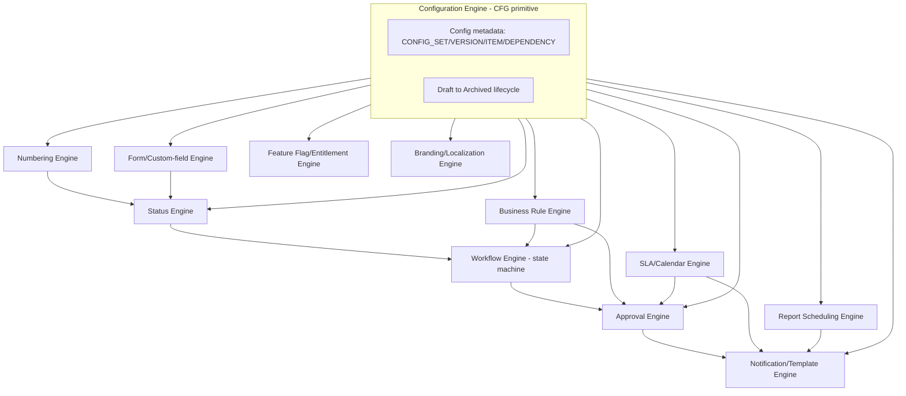
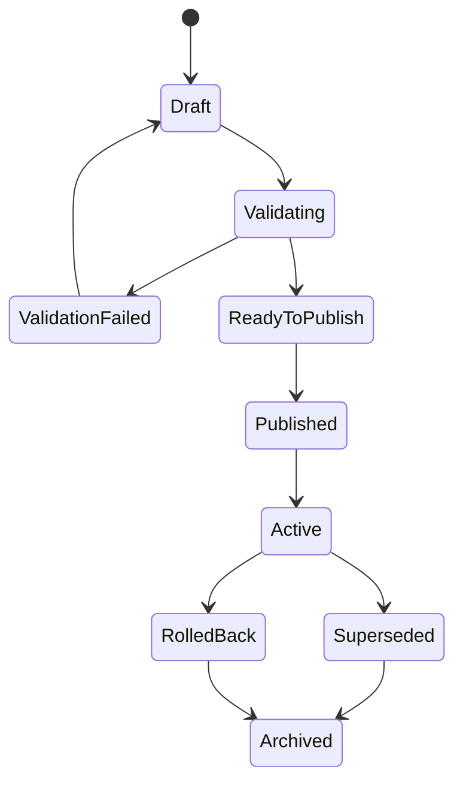
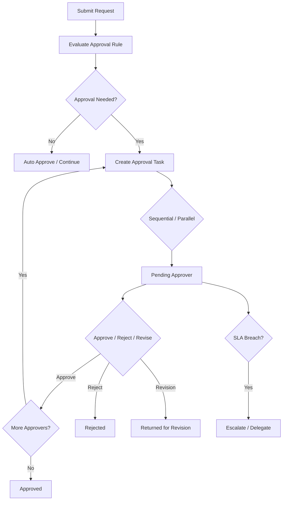

# 07 — Configuration Engine Workstream

**Prompt:** `CG-S3-ARCH-007` (`CG-AABPP-ARCH-042` v0.4.0)
**Runtime output of:** `docs/ai-agent-build-prompt-package/03-architecture-and-plan/42_CONFIGURATION_ENGINE_WORKSTREAM_PROMPT.md`
**Status:** `VERIFIED`

## 0. Checkpoint

| Field | Value |
|---|---|
| Repository | `assujiar/cargogrid.app` |
| Working branch | `agent/cargogrid-autonomous-build` (tracked by GitHub PR #7) |
| HEAD at authoring time | `f9c24f38442f5f568ebe4cc83940958a3af8ff1b` (parent of this checkpoint's commit) |
| Precondition | `docs/architecture/01_*.md` through `06_*.md` all `VERIFIED` |
| Repository state | Unchanged: zero configuration engine implementation |
| Mutation performed | **NONE** — planning only |

### Inputs read (beyond `01–06_*.md`, already fully loaded)

- Tech Arch §13 (Configuration Engine, full: 19 configurable objects, metadata ER diagram, lifecycle state machine, 6-level override precedence, dependency validation, caching, migration-of-config-version table)
- Tech Arch §14 (Workflow Engine, full), §15 (Approval Engine, full: 14 capabilities, flow diagram, approval data, guardrails)
- Blueprint §10 "Business Rules Catalogue" (24 rules, `BR-*`, verbatim), §11.1 "Approval Patterns" (13 patterns, verbatim), §11.2 "Approval Matrix" (14 use cases, verbatim), §12 "Status Lifecycle Catalogue" (24 transitions, verbatim), §13 "Exception Catalogue" (16 exceptions, verbatim) — the prompt's precondition explicitly names these five counts; all five are confirmed exact matches against the source tables, not approximated

## 1. Scope and method

No configuration is written by this document (prompt precondition). Every rule/pattern/transition/exception cited below is one of the exact 24+13+14+24+16 = 91 items already ratified in the blueprint's own catalogues — this document does not invent a 92nd rule, a 15th approval pattern, or a 25th transition; it defines the **engine** that will execute all 91 as data, not code.

## 2. Engine context map

Every sub-engine below `CFG` is a specialization sharing one metadata model (§4) and one lifecycle (§5) — this is the direct answer to the prompt's boundary question: there are 10 named engines, each with its own `config_type`, none with its own independent versioning/publish/rollback mechanism.

## 3. Capability/ownership table

| Engine | `config_type` (§4) | Owner | Consumed by | Source |
|---|---|---|---|---|
| Workflow/state machine | `workflow` | Platform `WF` | All business domains (`01_*.md` §3.2) | Tech Arch §14 |
| Approval | `approval` | Platform `APPR` | All business domains, 14 named use cases (§7 below) | Tech Arch §15, Blueprint §11.2 |
| Status | `status` | Platform `STAT` | All lifecycle entities, 24 named transitions (§7 below) | Blueprint §12 |
| Numbering | `numbering` | Platform `NUM` | Any entity requiring a tenant-scoped sequence (shipment number, invoice number, PO number) | Tech Arch §13.1, `01_*.md` §2.1 |
| Form/custom field | `form`, `field` | Platform `FORM` | All domains' UI forms | Tech Arch §13.1 |
| Business rule | `rule` | Platform `CFG` (no dedicated `RULE` primitive named in `01_*.md` — rules are `CFG`-typed config items evaluated by the owning domain, not a separate execution engine) | All domains, 24 named rules (§6 below) | Blueprint §10 |
| Notification/template | `notification` | Platform `NOTIF` | All domains | Tech Arch §16 |
| Feature flag/entitlement | `feature`, `subscription`, `module` | Platform `FLAG`/`TEN-IAM` | Release/rollout control | Tech Arch §13.1, `01_*.md` §2.1 |
| Branding/localization | `branding`, `terminology` | Platform `WLB` | Tenant-facing UI/documents | Tech Arch §13.1, Blueprint §8.1 |
| SLA/calendar | `sla` | Platform `CFG` (shared by `APPR`, `TKT`, `NOTIF`) | Approval SLA, Ticket SLA (Blueprint `BR-TKT-001`) | Tech Arch §13.1, Blueprint §11.2/§10 |
| Report scheduling | `report`, `dashboard` | Platform `REP` | Scheduled report jobs (`334_SCHEDULED_REPORTS_PROMPT.md`, Phase 9) | Tech Arch §13.1, §18 |

Every row's `config_type` is a value in the shared `CONFIG_SET` table (§4) — this is what makes "one engine owner per catalogue" (the completion gate) verifiable: query `CONFIG_SET` grouped by `config_type`, and every result must map to exactly one row in this table.

## 4. Configuration schema concepts

Reproduces Tech Arch §13.2's metadata ER diagram verbatim as the schema this workstream binds to (already present as `config_objects`/`config_versions` in `05_DATABASE_SCHEMA_WORKSTREAM.md` §3 — this section makes the mapping explicit):

| Blueprint entity (Tech Arch §13.2) | `05_*.md` §3 table | Key fields |
|---|---|---|
| `TENANT` | `tenants` (existing) | `id`, `name` |
| `CONFIG_SET` | `config_objects` | `id`, `tenant_id`, `config_type` (§3's 11 values), `scope_level`, `scope_id` |
| `CONFIG_VERSION` | `config_versions` | `id`, `config_set_id`, `version_no`, `status`, `effective_from`, `effective_to` |
| `CONFIG_ITEM` | new: `config_items` (not previously listed in `05_*.md` §3 — added here as this workstream's schema-level finding) | `id`, `config_version_id`, `key`, `value jsonb`, `canonical_ref` |
| `CONFIG_DEPENDENCY` | new: `config_dependencies` (same — added here) | `config_item_id`, `depends_on_config_item_id` |
| `CONFIG_PUBLISH_EVENT` | folded into `event_logs` (`05_*.md` §6 — no separate table; a config publish is an `event_logs` row with `event_type = 'config_published'`) | — |
| `CONFIG_AUDIT` | folded into `audit_logs` (`05_*.md` §6, same rationale) | — |

`config_items.canonical_ref` is the field that prevents a tenant label from ever being mistaken for canonical meaning (§6 below) — every config item that governs a status/field/entity carries a reference back to the canonical enum/column it labels.

## 5. Lifecycle and state rules

Reproduces Tech Arch §13.3's state machine verbatim as the binding lifecycle for every `config_type`:

- **Draft**: editable, not evaluated by any live transaction.
- **Validating → ValidationFailed/ReadyToPublish**: dependency validation (§8) runs here — this is a mandatory gate, not a warning.
- **Published → Active**: becomes the version resolved by precedence (§9) for new transactions from its `effective_from`.
- **Active → Superseded**: a newer version published; existing in-flight transactions keep their originally-applied version (RPD-040, `01_*.md` §11 R8) unless the change type requires otherwise (§10's migration table).
- **Active → RolledBack**: administrative reversal; the previously-Active version (now Superseded) does **not** automatically reactivate — rollback creates a new version referencing the rolled-back one, preserving the append-only audit trail (`config_versions` is never deleted, matching `05_*.md` §4's soft-delete/no-delete pattern for governance-critical tables).
- **Superseded/RolledBack → Archived**: terminal, retained per RPD-025's retention schedule (Configuration falls under "Operational data: contract term +90 days" unless a specific config type is finance-adjacent, in which case the Finance 10-year class applies — e.g., a `numbering` config governing invoice numbers).

## 6. Precedence and inheritance model

Reproduces Tech Arch §13.4's 6-level override priority verbatim:

1. Global default configuration
2. Tenant-level override
3. Company-level override
4. Branch-level override
5. Role-level override
6. User-level override

**Determinism rule (binding, Tech Arch §13.4's guardrail verbatim):** "override resolution must be deterministic and auditable. Transaction record should store applied config version for critical workflows." Concretely: resolution walks levels 6→1, stopping at the first level with a Published/Active `CONFIG_VERSION` for the given `config_type`+scope; the resolved `config_version_id` is written to the `config_version_id` FK column already established on affected transaction tables (`05_*.md` §6). No two transactions created at the same instant with the same scope may resolve to different versions — this is what makes it deterministic, not just "usually consistent."

**Canonical semantics versus tenant labels (binding, prompt task #3):** a tenant may rename a status label (Tech Arch §13.7 "Change status label | Safe if canonical status unchanged") but `canonical_ref` (§4) never changes meaning — this is the same dual-column pattern (`status_code`/`canonical_status`) already established in `05_*.md` §2, now given its configuration-engine-side counterpart. No configuration may alter what a canonical status/field *means* to downstream reporting/finance/audit, only what it is *labeled* to the tenant's users.

## 7. Evaluation contracts

### 7.1 Approval Engine (Tech Arch §15, full)

14 capabilities (verbatim): Sequential, Parallel, Conditional, Amount threshold, Margin threshold, Department, Role, User, Delegation, Escalation, SLA, Rejection, Revision, Resubmission.

13 approval **patterns** (Blueprint §11.1, `BR`-adjacent but pattern-typed, verbatim — pattern → example): Sequential (Sales Supervisor→Manager→GM), Parallel (Finance+Operations approve cost overrun), Conditional (high-risk customer→Finance approval mandatory), Amount threshold (write-off > Rp X→Director), Margin threshold (margin <15%→Manager), Department-based (warehouse billing change→Warehouse Manager), Role-based (Procurement Manager approves vendor onboarding), User-based (named account director approves strategic customer), Delegation (Manager on leave→Assistant Manager), Escalation (2-day pending→GM), Rejection (reason recorded, flow stops), Revision (submitter edits, approval resets), Resubmission (new cycle, linked to prior cycle).

14 approval **use cases** (Blueprint §11.2 Approval Matrix, verbatim, process→default approver→configurable threshold): Customer approval (Sales/Finance Manager; risk/credit/type), Cost request (Pricing Lead/Procurement; service/lane/urgency/value), Vendor rate approval (Procurement Manager; lane/validity/variance/category), Quotation approval (Sales Manager/GM/Director; margin/discount/amount/tier), Job creation override (Operations Manager; service/customer/reason/risk), Shipment assignment override (Operations Manager/Procurement; availability/compliance/exception), Cost overrun (Operations+Finance; variance/amount/type), Job closing (Operations Manager/Finance; open exception/claim/document), Invoice readiness override (Finance Manager; customer term/document risk), Vendor invoice mismatch (AP+Procurement; amount/percentage variance), Period unlock (Finance Controller/Director; period age/amount/reason), Payroll finalization (HR Manager+Finance; period/variance/exception), Ticket escalation (Service Manager; priority/tier/age), Loyalty redemption (Marketing/Finance; value/tier/fraud score).

Approval data model (Tech Arch §15.2, verbatim): approval instance, approval task, step number, approver role/user, delegation source, threshold rule, decision, comment, decision timestamp, SLA due, escalation event, resubmission counter, related entity, before/after snapshot for sensitive request.

Guardrails (Tech Arch §15.3, verbatim, binding): approver cannot approve own request unless the rule explicitly allows it, audited; approval threshold cannot be changed retroactively for a pending request without config migration policy; rejection requires reason; override requires permission and reason; approval task inherits tenant and record scope (RLS still applies — the Configuration Engine does not create an RLS exception, per §11 below).

### 7.2 Status Engine (Blueprint §12, all 24 transitions, verbatim)

| Entity | Transitions (from→to, count) |
|---|---|
| Lead | New→Assigned, Assigned→Contacted, Qualified→Converted (3) |
| Quotation | Draft→Submitted(Under Approval), Under Approval→Approved, Approved→Sent, Sent→Accepted, Sent→Expired (5) |
| Shipment | Draft→Confirmed, Confirmed→Planned, Planned→Dispatched, In Transit→Delivered, Delivered→ePOD Completed, ePOD Completed→Closed (6) |
| Invoice | Draft→Submitted, Submitted→Approved, Approved→Posted, Posted→Paid/Partially Paid (4) |
| Vendor | Draft→Submitted(Under Review), Under Review→Approved(Active) (2) |
| Ticket | Open→Assigned, Assigned→In Progress, In Progress→Resolved, Resolved→Closed (4) |

Every transition row carries the trigger, condition, and actor/system columns from Blueprint §12's source table — the Status Engine's job is to make each of these 24 a `CONFIG_ITEM` of `config_type = 'status'` with a `canonical_ref` to the entity's fixed status enum (§6), not to hardcode 24 `if`-statements across domain code.

### 7.3 Business Rule Engine (Blueprint §10, all 24 rules, verbatim rule IDs)

`BR-LEAD-001` (lead conversion), `BR-CUST-001` (duplicate customer), `BR-CUST-002` (customer approval), `BR-CREDIT-001` (credit limit), `BR-COST-001` (cost request), `BR-RATE-001` (vendor rate validity), `BR-QTN-001` (quotation margin), `BR-QTN-002` (discount), `BR-QTN-003` (quotation expiration), `BR-JOB-001` (job creation), `BR-SHP-001` (shipment assignment), `BR-SHP-002` (shipment status), `BR-POD-001` (ePOD completion), `BR-CLOSE-001` (job closing), `BR-COST-OVR-001` (cost overrun), `BR-INV-001` (invoice readiness), `BR-REV-001` (revenue recognition), `BR-VIM-001` (vendor invoice matching), `BR-PERIOD-001` (period lock), `BR-ATT-001` (attendance), `BR-PAY-001` (payroll), `BR-TKT-001` (ticket SLA), `BR-LYL-001` (loyalty earning), `BR-LYL-002` (loyalty redemption). Every rule is marked `Configurable` in its source row — none is hardcoded, all 24 are `CONFIG_ITEM` rows of `config_type = 'rule'` (or the domain-specific type they extend, e.g. `BR-PERIOD-001` is a `finance` rule referencing the `fiscal_periods.locked_at` column from `05_*.md` §5).

**Determinism, conflict detection, cycle prevention (prompt task #5):** every rule's evaluation is a pure function of (transaction data, resolved config version) — no rule may call an external service mid-evaluation (that would make evaluation non-deterministic and untestable); §8's dependency validation includes "No circular workflow dependency" as a publish-time gate, extended by this document to all `config_type`s, not just `workflow`; a rule's evaluation must complete within a bounded timeout (`ADR-CAND-ARCH-014`, §12) and produces an explanation record (which rule fired, on which config version, with what inputs) written to `event_logs` for audit — this is the "explanation/audit evidence" the prompt requires.

### 7.4 Exception Catalogue integration (Blueprint §13, all 16 exceptions, verbatim IDs)

`EXC-DATA-001` (missing mandatory data), `EXC-DUP-001` (potential duplicate), `EXC-AUTH-001` (unauthorized access), `EXC-CFG-001` (stale configuration version), `EXC-APR-001` (approval SLA breached), `EXC-INT-001` (integration failed), `EXC-RATE-001` (expired vendor rate), `EXC-MRG-001` (margin below threshold), `EXC-SHP-001` (shipment delay), `EXC-POD-001` (incomplete ePOD), `EXC-COST-001` (cost overrun), `EXC-INV-001` (invoice mismatch), `EXC-PER-001` (period locked), `EXC-ATT-001` (attendance anomaly), `EXC-SLA-001` (ticket SLA breach), `EXC-LYL-001` (suspected loyalty fraud). **`EXC-CFG-001` is the Configuration Engine's own exception**: "Stale configuration version | All configurable modules | Require refresh/revalidation before submit." This is the concrete mechanism preventing a client from submitting against a config version that has since been Superseded/RolledBack between page load and submit — the server re-resolves precedence (§6) at submit time, not just at page load, and rejects with `EXC-CFG-001` on mismatch.

## 8. Dependency validation (Tech Arch §13.5, verbatim, extended to every `config_type`)

Before publish, the system checks: required field exists; status transition has valid start/end; approval approver role exists; numbering pattern unique per scope; notification recipient rule valid; report fields permitted; service references valid cost/revenue component; document template tokens match available data; no circular workflow dependency; no removal of a field used by a published workflow/report without a migration strategy. This document extends the last item to every `config_type`: **no `CONFIG_ITEM` referenced by another Active `CONFIG_ITEM` via `CONFIG_DEPENDENCY` (§4) may be removed without either a migration strategy or the dependent item being updated in the same publish transaction** — this is `config_dependencies`' enforcement purpose.

## 9. Configuration caching (Tech Arch §13.6, verbatim)

Published configuration is cached by `tenant_id + config_type + scope + version`; draft config is never globally cached; cache is invalidated on publish/rollback; a long-running transaction uses the config version active when the transaction started, or refreshes when a specific business rule says so. This directly composes with `06_RLS_RBAC_WORKSTREAM.md` §9's cached-authorization-invalidation rule — both caches key off a version/generation number and both invalidate on the same class of event (a publish/rollback for config, a role/permission mutation for RBAC), so a single cache-invalidation mechanism (Platform `JOB`-triggered cache-bust event) serves both.

## 10. Migration of configuration versions (Tech Arch §13.7, verbatim table)

| Change type | Migration rule |
|---|---|
| Add optional field | No migration needed |
| Add required field | Requires default/backfill or effective only for new records |
| Change status label | Safe if canonical status unchanged |
| Remove status | Requires transition mapping |
| Change approval threshold | Effective date required |
| Change numbering | New sequence scope, preserve old numbers |
| Change service rule | Effective only for new quote/job unless manual reprice |
| Change document template | Regenerate only if allowed |

This table is the config-layer counterpart to `05_DATABASE_SCHEMA_WORKSTREAM.md` §8's expand/migrate/contract wave policy — every row above maps to one of expand (add optional), migrate (add required with backfill), or contract (remove status) at the schema level, keeping the two migration policies (data schema, config schema) mutually consistent rather than defining a second, conflicting migration doctrine.

## 11. Security and finance guardrails (prohibited bypasses, binding)

- **No configuration may bypass RLS/RBAC.** A `config_type = 'approval'` or `'workflow'` item can change *who* must approve or *what* status sequence applies, but can never grant a role a permission action (§5.1 of `06_*.md`) it does not already hold via RBAC — configuration operates strictly inside the RBAC/RLS boundary established in `06_RLS_RBAC_WORKSTREAM.md`, never around it.
- **No configuration may bypass a financial control.** Tech Arch §14.2's Workflow Execution Rule is binding verbatim: "Workflow cannot bypass financial period lock." Extended here: no `config_type` may alter the balanced-posting check, the idempotent-posting key formula, or the append-only nature of `journals`/`point_ledger`/`inventory_ledger` (`05_*.md` §4/§5) — these are code-level invariants, not configuration surface.
- **No arbitrary executable code.** Every `CONFIG_ITEM.value` is data (JSONB per §4's schema) — a rule expression language (if one is introduced, e.g. for `BR-QTN-001`'s margin-threshold conditions) must be a bounded, sandboxed expression evaluator (comparison/boolean/arithmetic operators over named transaction fields only), never a general-purpose scripting/eval capability. This directly prevents the tenant-code-fork risk the prompt names and is consistent with RPD-019 (controlled visual customization only, CargoGrid owns UI structure) and RPD-038 (no generic abstraction, case-by-case code) applied to the configuration layer.
- **No tenant source fork.** All 91 catalogued rules/patterns/transitions/exceptions (§7) are shared-codebase, tenant-parameterized configuration, never a tenant-specific code branch — matching Tech Arch §8 Backend Rules ("Backend tidak boleh membuat tenant-specific branch logic hardcoded") exactly.

## 12. ADR candidates

| ID | Question | Constraint | Recommendation | Owner | Blocking state |
|---|---|---|---|---|---|
| `ADR-CAND-ARCH-014` | What is the bounded-evaluation timeout for a business-rule/workflow-condition expression (§7.3), and what happens on timeout — deny, or fall through to a safe default? | §7.3 requires "a rule's evaluation must complete within a bounded timeout"; no numeric value is evidenced anywhere in the blueprint | Adopt Tech Arch §32.7's existing query-performance threshold (500ms) as the rule-evaluation budget too, since rule evaluation typically runs inside the same request; on timeout, deny (fail closed, consistent with §3's deny-by-default evaluation flow in `06_*.md`) rather than fall through | Architecture/Performance | `ADR_REQUIRED`, non-blocking — resolve at Prompt 45 (Testing Workstream) alongside `ADR-CAND-ARCH-004`'s performance-threshold work |
| `ADR-CAND-ARCH-015` | Exact expression-language grammar for the bounded rule evaluator (§11) — a small custom DSL, a restricted subset of JSONLogic, or a similar off-the-shelf bounded evaluator? | Must be sandboxed, no I/O, no arbitrary code (§11) | Adopt an existing bounded JSON-based rule format (JSONLogic-equivalent) rather than inventing a custom grammar, to avoid an unreviewed parser becoming a security surface | Architecture/Security | `ADR_REQUIRED`, non-blocking — resolve at Phase 1 `CFG`/`RULE` implementation (Prompt 121+) |

`ADR-CAND-ARCH-010` (`server/contracts/` timing, raised in `04_*.md`) is **resolved** here: `server/contracts/config/` is created in the same Phase-1 slice as the Configuration Engine itself (§13's atomic backlog), since every domain's contract (from `03_*.md` §5) already needs to reference a `config_version_id` type — the contracts folder cannot wait past Phase 1.

## 13. Module adoption map

| Phase | Domain | Config types first adopted |
|---|---|---|
| 1 | Platform | `workflow`, `approval`, `status`, `numbering`, `form`, `field`, `notification`, `feature`, `branding`, `terminology` — all 10 engine types bootstrap here, empty/template only |
| 2 | Commercial | `approval` (Quotation, Customer, Vendor-rate-adjacent Cost-request use cases), `rule` (`BR-LEAD-001`, `BR-CUST-001/002`, `BR-CREDIT-001`, `BR-COST-001`, `BR-RATE-001`, `BR-QTN-001..003`), `status` (Lead, Quotation transitions) |
| 3 | Operations | `approval` (Job creation/Shipment assignment/Cost overrun/Job closing), `rule` (`BR-JOB-001`, `BR-SHP-001/002`, `BR-POD-001`, `BR-CLOSE-001`, `BR-COST-OVR-001`), `status` (Shipment transitions), `sla` |
| 4 | Finance | `approval` (Invoice readiness/Vendor invoice mismatch/Period unlock), `rule` (`BR-INV-001`, `BR-REV-001`, `BR-VIM-001`, `BR-PERIOD-001`), `status` (Invoice transitions) |
| 6 | Procurement | (rate/PO rules already partially bootstrapped in Phase 2/1 per `05_*.md` `ADR-CAND-ARCH-001` resolution) `status` (Vendor transitions) |
| 7 | HRIS/Ticketing | `approval` (Payroll finalization/Ticket escalation), `rule` (`BR-ATT-001`, `BR-PAY-001`, `BR-TKT-001`), `status` (Ticket transitions), `sla` (Ticket SLA) |
| 8 | Loyalty | `approval` (Loyalty redemption), `rule` (`BR-LYL-001/002`) |
| 9 | Intelligence/Enterprise | `report`/`dashboard` scheduling (full engine) |

Migration from hard-coded behavior: not applicable — the repository is greenfield, so every domain adopts configuration-driven behavior from its first implementation, never migrates off a hardcoded predecessor (matches `05_*.md` §8's "not applicable pre-Phase-1" framing for schema migration waves).

## 14. Test matrix

| Test type | Applied to |
|---|---|
| Unit | Precedence resolution (6-level walk, §6); dependency-validation gate (§8); bounded-evaluator sandboxing (§11, `ADR-CAND-ARCH-015`) |
| Integration | Publish→Active transition triggers cache invalidation (§9); `EXC-CFG-001` stale-version rejection at submit time (§7.4) |
| Determinism | Same transaction data + same resolved config version → same rule outcome, every time (§7.3) |
| Security | No configuration item can grant an RBAC permission or bypass RLS (§11); rule evaluator cannot perform I/O or call arbitrary code (§11) |
| Financial | No configuration can post/bypass a locked period, alter a balanced-posting check, or mutate an append-only ledger (§11) |
| Migration | Each of §10's 8 migration-rule rows has a corresponding test verifying the stated behavior (e.g. "Remove status requires transition mapping" → a test that removal without a mapping fails validation) |
| Regression | All 24 status transitions (§7.2), all 24 business rules (§7.3), all 14 approval use cases (§7.1), all 16 exceptions (§7.4) each get at least one scenario test — 78 minimum named scenarios, not a sampling |

## 15. Atomic backlog

Sized 1–3 migrations/slices each, sequenced to `13. Module adoption map` above:

| Slice | Phase | Content | Depends on |
|---|---|---|---|
| Config metadata core | 1 | `config_items`, `config_dependencies` tables (new, added by this document to `05_*.md`'s catalogue); `CONFIG_SET`/`CONFIG_VERSION` lifecycle state machine implementation; `server/contracts/config/` (resolves `ADR-CAND-ARCH-010`) | `05_*.md` Platform config/workflow/approval core slice |
| Workflow/Status/Numbering/Form engines | 1 | Bootstrap all 4 as empty templates; dependency-validation gate (§8) | Config metadata core |
| Approval engine + 14 use-case templates | 1 | Approval instance/task model (§7.1); SLA/escalation wiring | Workflow/Status engines |
| Business rule engine + bounded evaluator | 1 | Resolves `ADR-CAND-ARCH-015`; 24 rules registered as empty templates, activated per-domain at their phase | Approval engine |
| Notification/Branding/Feature-flag engines | 1 | Already scoped in `01_*.md` Platform primitives; this slice wires them to the shared `CONFIG_SET` model | Config metadata core |
| Commercial config adoption | 2 | 9 `BR-*` rules + Quotation/Customer/Cost-request approval use cases + Lead/Quotation status transitions activated | Approval/rule engines, Commercial schema (`05_*.md`) |
| Operations config adoption | 3 | 5 `BR-*` rules + 4 approval use cases + Shipment status transitions + SLA engine activated | Commercial config adoption, Operations schema |
| Finance config adoption | 4 | 4 `BR-*` rules + 3 approval use cases + Invoice status transitions activated | Operations config adoption, Finance schema |
| Remaining domain config adoption | 6–9 | Procurement/HRIS/Ticketing/Loyalty/Reporting per §13's table | Respective domain schema slices |

## 16. Exit gates

Each configurable catalogue (§3's 11 `config_type` rows) has exactly one engine owner (verified — every row populated). Precedence (§6) and version snapshots (§5/§9) are deterministic — no conditional/probabilistic resolution path exists anywhere in this design. Prohibited bypasses are explicit (§11 — RLS/RBAC, financial controls, arbitrary code, tenant forks, all four named). Future prompts (Phase 1's `121_CONFIGURATION_ENGINE_PROMPT.md` onward) can implement in the bounded slices of §15, each 1–3 migrations.

## 17. Completion statement

All 91 catalogued items (24 rules + 13 patterns + 14 use cases + 24 transitions + 16 exceptions) are accounted for as data, not hardcoded logic, across §7's four subsections. The Configuration Engine's own metadata schema (§4) is mapped onto `05_DATABASE_SCHEMA_WORKSTREAM.md`'s table catalogue with exactly 2 new tables identified (`config_items`, `config_dependencies`). Security/finance guardrails (§11) are stated as hard prohibitions, not soft guidance. 2 new ADR candidates raised, 1 prior candidate (`ADR-CAND-ARCH-010`) resolved.

Next eligible prompt: `03-architecture-and-plan/43_API_INTEGRATION_WORKSTREAM_PROMPT.md` → `docs/architecture/08_API_INTEGRATION_WORKSTREAM.md`.
