# 12 — Release Train

**Prompt:** `CG-S3-ARCH-012` (`CG-AABPP-ARCH-047` v0.4.0)
**Runtime output of:** `docs/ai-agent-build-prompt-package/03-architecture-and-plan/47_RELEASE_TRAIN_PROMPT.md`
**Status:** `VERIFIED`

## 0. Checkpoint

| Field | Value |
|---|---|
| Repository | `assujiar/cargogrid.app` |
| Working branch | `agent/cargogrid-autonomous-build` (tracked by GitHub PR #7) |
| HEAD at authoring time | `315852c` (parent of this checkpoint's commit) |
| Precondition | `docs/architecture/01_*.md` through `11_*.md` all `VERIFIED` |
| Repository state | Unchanged: zero release branch, zero deployed environment, zero calendar commitment recorded anywhere in this repository |
| Mutation performed | **NONE** — planning only; no code, branch, environment, or calendar artifact was created (prompt precondition, verified) |

### Inputs read (beyond `01–11_*.md`, already fully loaded)

- Blueprint `05_CargoGrid_Delivery_Testing_GoLive_Plan.md` §3 (Delivery Strategy, full: Delivery Principles, Delivery Model, MVP Delivery Boundary), §4 (Development Methodology: Operating Cadence, Delivery Artifacts), §5–7 (Product Organization, Governance, RACI), §8 (Release Plan: 10-row Phase 0–9 table, §8.1 Release Types, §8.2 Release Matrix), §9.1–9.2 (Backlog Hierarchy/Template), §12 (Dependencies), §13 (Sprint Planning), §14 (Definition of Ready), §15 (Definition of Done), §24.5/§25/§26/§27 (already bound in `11_*.md`, cited not re-derived), §31 (Change Management), §32 (Post-Implementation Review), §35 (Risk Register)
- `01_MODULE_DEPENDENCY_MAP.md` §2 (module catalogue), §3 (dependency matrix), §9 (ADR candidates), §10 (Phase implications table, the phase backbone this document sequences), §12 (risks)
- `02_CANONICAL_DATA_FLOW_MAP.md` §3 (6 lifecycle flow maps, used to state each phase's demo/evidence flow)
- `04_REPOSITORY_TARGET_STRUCTURE.md` §8 (10-slice incremental transition sequence)
- `05_DATABASE_SCHEMA_WORKSTREAM.md` §12 (atomic workstream backlog)
- `06_RLS_RBAC_WORKSTREAM.md` §12 (atomic backlog, 9 slices)
- `07_CONFIGURATION_ENGINE_WORKSTREAM.md` §15 (atomic backlog, 9 slices)
- `08_API_INTEGRATION_WORKSTREAM.md` §15 (atomic backlog, 10 slices)
- `09_UX_DESIGN_SYSTEM_WORKSTREAM.md` §14 (atomic backlog, 14 slices)
- `10_TESTING_WORKSTREAM.md` §9 (phase exit criteria — the test-evidence half of this document's exit gates), §12 (atomic backlog, 13 slices), §10.3 (zero-critical-defect direct-GA gate)
- `11_DEVOPS_WORKSTREAM.md` §2 (environment topology), §3 (CI/CD pipeline), §4 (deployment/rollback), §8.5 (runbook catalogue), §11 (atomic backlog, 12 slices), §12 (go-live blockers)
- `00-control/02_CONFIRMED_DECISION_REGISTER.md` RPD-001 (all modules before GA), RPD-034/036 (direct GA, no external pilot, zero critical defects)

## 1. Scope and method

This document does not create a release branch, environment, deployment, or calendar commitment (prompt precondition and completion gate). It translates `01_*.md` §10's phase model and `02_*.md`–`11_*.md`'s workstream backlogs into one internal delivery/release train (§3), reconciles cross-phase splits (§4), fixes integration/stabilization/freeze/promotion/retention policy (§5), reconciles internal feature-flag exposure with direct GA (§6), fixes quality/security/data/finance gates and freeze/go-no-go/rollback/hypercare/PIR rules (§7), states capacity assumptions as assumptions (§8), gives a compact dependency/timeline visualization (§9), carries forward the relevant risk register (§10), and fixes update triggers (§11).

**Supersession note (binding, read before §2):** Blueprint §3.2's delivery model (`... UAT → PILOT[Controlled Pilot] → GO[Go-Live] → HYP[Hypercare] ...`) and §8.1/§8.2 (Release Types table naming "Design partner beta," "Controlled pilot," "Limited availability" as release stages applied *per phase* to real tenants before GA) are **Proposed Default**, superseded by RPD-034/036 (binding, ratified, already restated in `10_*.md` §10.3 and `11_*.md` §4.3): there is no external pilot; CargoGrid moves directly to GA after full internal validation; the first external tenant is a production customer, never a pilot. This document is the third and final place this supersession is applied, and it is the one place it matters most, because §8's own table is the direct source of this document's phase content. Every "pilot"/"beta"/"limited availability" row in Blueprint §8.1/§8.2 is reinterpreted below as an **internal-only** acceptance stage — internal alpha → internal UAT/acceptance → Release Candidate → Go-Live — never a stage where an external tenant is present. §3's train table uses this reinterpretation throughout; it does not restate Blueprint §8.1/§8.2's literal external-facing labels.

## 2. Release principles

Reproduces Blueprint §3.1's 15-row Delivery Principles table verbatim, with the two rows affected by §1's supersession flagged inline (no other row is altered):

| Principle | Delivery Rule (Blueprint §3.1, verbatim) | Gate | Reinterpretation |
|---|---|---|---|
| Foundation before feature | Tenant, identity, RLS/RBAC, entitlement, audit, configuration base, master data, document, notification, and integration primitives must exist before complex modules | Phase 1 exit gate | Unchanged |
| Tenant security before onboarding | No tenant production pilot before tenant isolation, role/permission, storage policy, API token policy, and support access tests pass | Tenant onboarding gate | Unchanged (§1's supersession affects the *word* "pilot," not this gate's substance — every one of these tests is still a hard precondition, only now for the first real GA tenant, not a pilot tenant) |
| Configuration engine before customization | Tenant variation resolved via metadata/configuration, not hardcoded branches | Change control gate | Unchanged |
| Core transactions before advanced analytics | Lead, quote, job, shipment, ePOD, invoice, payment, and basic dashboard precede heavy analytics | Roadmap gate | Unchanged |
| Operational integrity before visual polish | Status lifecycle, assignment, milestone, exception, ePOD, and audit must be valid before deep UI polish | UAT gate | Unchanged |
| Financial integrity before automation | Double-entry, immutable journal, period lock, reversal, AR/AP, reconciliation must be safe before large-scale auto-posting | Finance go-live gate | Unchanged |
| Progressive release | Internal alpha → design partner beta → controlled pilot → limited availability → GA | Release governance | **Superseded (§1):** internal alpha → internal UAT/acceptance → Release Candidate → GA — no external-facing stage precedes GA |
| Controlled pilot | Pilot bounded by tenant, module, user, data volume, integration, support window | Pilot approval | **Superseded (§1):** no external pilot exists; the bounding disciplines (module/user/data-volume/integration/support-window scoping) are retained as internal RC-acceptance scoping instead |
| Feature flags | Module and high-risk feature must be activatable/deactivatable per tenant/cohort | Release gate | Unchanged (§6 below) |
| Automated tests | Unit, integration, API, RLS, RBAC, tenant isolation, regression, and smoke tests are in CI/CD | CI gate | Unchanged (`10_*.md`/`11_*.md` §3) |
| Continuous documentation | User guide, admin guide, release notes, known issues, API docs, support playbook updated every release | Definition of Done | Unchanged |
| Auditability | Config, approval, financial, import/export, impersonation, support access, API/webhook changes are recorded | QA/security gate | Unchanged (`05_*.md` §6, `06_*.md` §4) |
| Backward compatibility | Public API, webhook, export schema, and customer-facing workflow have a deprecation path | Architecture review | Unchanged (`08_*.md` §11) |
| Performance gates | High-volume screens and jobs pass the performance budget | Performance gate | Unchanged (`08_*.md` §12, `10_*.md` §8.1) |
| Measurable acceptance | Every phase has exit criteria, test gate, security gate, performance gate, business acceptance | Phase gate | Unchanged — this is §3's own organizing principle |

## 3. Release train / increment table

### 3.1 Phase increments — scope, prerequisites, gates, consumers

Sequenced identically to `01_*.md` §10 (no new phase or reordering introduced); each phase's "Capabilities unlocked" restates `01_*.md` §10's module list, and "Business acceptance" restates the sign-off actor from Blueprint §8's phase table:

| Phase | Scope (task #1 boundary) | Capabilities unlocked (`01_*.md` §10) | Prerequisite | Entry gate | Business acceptance / exit gate | Downstream consumers |
|---:|---|---|---|---|---|---|
| 0 | Discovery and Foundation | none (infra/tooling only) | — | Product Concept Brief + sponsor alignment (Blueprint §8) | Sponsor accepts phase scope and MVP boundary; Step 3 architecture (this package) `RUNTIME_ARCHITECTURE_VERIFIED` | Phase 1 |
| 1 | Platform Core | `TEN-IAM`,`WLB`,`MDM`,`CFG`,`WF`,`APPR`,`STAT`,`NUM`,`FORM`,`NOTIF`,`DOC`,`API-WH`,`IMPEXP`,`JOB`,`FLAG`,`GEO`,`AUD`,`PORTAL-ADM` | `PHASE_0_VERIFIED` | Internal acceptance by Product, CTO, Security, QA (Blueprint §8); RLS/RBAC baseline passes, config draft/publish/rollback works, CI/CD gates active | Phase 2, and every later phase (Platform primitives are consumed by all business domains, `01_*.md` §3.2) |
| 2 | Commercial | `COM` | `PHASE_1_VERIFIED` | Lead converted to opportunity/customer; quote approved, versioned, accepted, ready for job conversion | Sales/process owner signs off commercial UAT (`UAT-E2E-001..008`, `10_*.md` §5.1/§9) | Phase 3 (`COM`→`OPS` quote-to-job, `01_*.md` §3.3) |
| 3 | Operations (basic) + Customer Portal (basic) | `OPS` (basic), `CPT` (basic) | `PHASE_2_VERIFIED` | Real shipment flow completed; milestone visible; ePOD captured; actual cost logged; billing readiness flagged | Ops/customer user signs off pilot scenario (internal, per §1 supersession) (`UAT-E2E-009..015`, `10_*.md` §9) | Phase 4 (`OPS`→`FIN` billing readiness/AR, `01_*.md` §3.3), Phase 5 (`OPS` advanced extends basic) |
| 4 | Finance | `FIN` | `PHASE_3_VERIFIED` | Posted journal immutable; invoice/payment/journal reconciled; AR/AP aging works; profitability traceable | Finance Manager signs off with reconciliation evidence (24 `FINTEST-*`, Finance Go-Live Gate, `10_*.md` §5.3/§9) | Phase 8 (`FIN`→`LYL` invoice-to-loyalty-earning, `01_*.md` §3.3) |
| 5 | Operations (advanced TMS/WMS) | `OPS` (advanced) | `PHASE_4_VERIFIED` | Advanced operational scenarios pass; inventory reconciles; dispatch performance acceptable | Warehouse/operations signs off (`PERF-003`/`PERF-010` at target volumes, `10_*.md` §9) | Phase 6 (vendor rate/performance feeds `PRC`), Phase 9 (`REP` full engine reads mature `OPS` data) |
| 6 | Procurement and Vendor Management | `PRC` | `PHASE_5_VERIFIED` | Vendor rate flows into costing; vendor invoice matched to shipment/PO/cost; performance tracked | Procurement/Finance signs off (`FINTEST-016` vendor-invoice-matching, `10_*.md` §9) | Phase 3/4 (retires `COM`'s Phase-2 interim vendor-rate lookup, `01_*.md` §3.3 `RELEASE`/`MIGRATE` edge, `ADR-CAND-ARCH-001` resolved in `05_*.md` §4) |
| 7 | HRIS and Ticketing | `HRS`,`TKT` | `PHASE_6_VERIFIED` | Attendance/leave/ticket SLA flows pass; payroll foundation protected; ticket linkage works | HR/Support signs off (`BR-ATT-001`/`BR-PAY-001` regression, PII/payroll masking negative tests, `10_*.md` §9) | Phase 8 (`TKT`→`CPT` ticket display) |
| 8 | Customer Portal (full) and Loyalty | `CPT` (full), `LYL` | `PHASE_7_VERIFIED` | Customer portal end-to-end works; loyalty earning/redemption rule works; customer access isolated | Customer admin and tenant sponsor sign off (`UAT-E2E-019`, full `TI-*` customer-portal subset, `10_*.md` §9) | Phase 9 (`REP`/`AUD`/`AI`/`INTHUB` all read mature domain data) |
| 9 | Intelligence, Automation, Enterprise Expansion | `REP` (full), `INTHUB`, `AI`, `ENT` | `PHASE_8_VERIFIED` | Automation has governance; enterprise controls tested; AI outputs auditable and not autonomous for critical actions | Enterprise customer and security review sign off (`PERF-005`/`PERF-011`, `TI-007`/`TI-008`, 17-category integration adapter sandbox tests, `10_*.md` §9) | Phase 15 |
| 15 | Full-system hardening | Full-system regression, penetration test, DR rehearsal | `PHASE_9_VERIFIED` | Every module shipped (RPD-001) | Full `TI-001..018` + `FINTEST-001..024` + `UAT-E2E-001..020` all green; penetration test complete (`10_*.md` §9) | Phase 16 |
| 16 | Release Candidate and Go-Live | RC cut, Go/No-Go, cutover, hypercare | Hardening `VERIFIED` | Blueprint §27.1's 19-item Go-Live Checklist fully evidenced | Go/No-Go per Blueprint §27.2 (§7 below); direct GA — first external tenant is a production customer, never a pilot (RPD-034/036) | Continuous improvement / next release train cycle (§7.5 below) |

No phase in this table is itself a partial GA (RPD-001, restated) — the "Business acceptance" column above is an **internal** phase-gate sign-off, never a customer-facing release milestone until Phase 16's Go-Live.

### 3.2 Phase increments — workstream outputs, demo/evidence, rollback

Each phase's DB/API/UI/security/test/DevOps outputs are not re-derived here — they are the phase-tagged rows already sized into 1–3-migration/5–15-file slices across `04_*.md` §8, `05_*.md` §12, `06_*.md` §12, `07_*.md` §15, `08_*.md` §15, `09_*.md` §14, `10_*.md` §12, `11_*.md` §11. This table is the cross-workstream index into those slices, plus the demo/evidence and rollback/recovery columns the prompt's task #2 requires and no single workstream document owns alone:

| Phase | DB output (owning backlog) | API/UI output (owning backlog) | Security/Test output (owning backlog) | DevOps output (owning backlog) | Demo/evidence | Rollback/recovery |
|---:|---|---|---|---|---|---|
| 1 | Platform identity/config/notification-document-audit/API-job-flag-spatial core (`05_*.md` §12, 4 slices) | `server/` target layout (`04_*.md` §8 slices 1–3); API/webhook/job foundation + GraphQL foundation (`08_*.md` §15) | RLS/RBAC negative-test suite (`06_*.md` §12); CI pipeline + test-data factory foundation (`10_*.md` §12) | Environment provisioning, CI pipeline, secret/key management, observability foundation, backup/PITR (`11_*.md` §11, 5 slices) | Demo: tenant provisioning → role/permission preview → config draft/publish/rollback (`07_*.md` §7.1 patterns) | `11_*.md` §4.4 (per-layer rollback); Platform Core has no prior version to roll back to — a failed Phase-1 exit is a hold, not a rollback |
| 2 | Commercial core (`05_*.md` §12) | REST/GraphQL Commercial fields (`08_*.md` §15); Commercial UI slices (`09_*.md` §14) | Commercial E2E + regression suite (`10_*.md` §12); Commercial-domain RLS policies extend Phase-1 families (`06_*.md` §12) | Feature-flag infrastructure slice active for Commercial rollout gating (`11_*.md` §11) | Demo: lead → opportunity → quotation → approval → customer acceptance (`02_*.md` §3 flow 1) | Feature-flag disable (`11_*.md` §9.2); DB forward-fix preferred (`11_*.md` §4.4) |
| 3 | Operations core (basic) (`05_*.md` §12) | Operations REST/GraphQL fields + `import_staging_rows` adoption (`08_*.md` §15); Operations/Portal-basic UI slices (`09_*.md` §14) | Operations E2E + basic-Portal isolation suite (`10_*.md` §12) | Job/queue capacity monitoring slice (`11_*.md` §11) | Demo: job order → shipment → milestone → ePOD → actual cost → billing-ready flag (`02_*.md` §3 flow 2) | Feature-flag disable; `TI-002`/`TI-015` re-validation before re-enabling (`10_*.md` §5.2) |
| 4 | Finance core (`05_*.md` §12) | Finance REST/GraphQL fields + idempotent-posting API enforcement (`08_*.md` §15); Finance UI slices (`09_*.md` §14) | Financial Integrity suite + Finance Go-Live Gate (`10_*.md` §12) | DR rehearsal program begins exercising finance reconciliation-after-restore (`11_*.md` §8.2, shared with `10_*.md` §12) | Demo: billing-ready job → invoice → journal posting → payment → profitability (`02_*.md` §3 flow 3) | Business-correction only, never a destructive data rollback for a posting error (`11_*.md` §4.4 "Data" row) |
| 5 | Operations advanced (WMS/TMS) (`05_*.md` §12) | Remaining domain slices (rolling) | Performance/load-test harness (`10_*.md` §12); reporting-replica graduation if `ADR-CAND-ARCH-004`'s trigger fires (`11_*.md` §9.1/§11) | Reporting-replica graduation slice (conditional, `11_*.md` §11) | Demo: multi-leg dispatch board, WMS inbound→putaway→pick→pack→outbound, inventory ledger reconciliation | Feature-flag disable; inventory-ledger reconciliation re-check before re-enabling |
| 6 | Procurement core (`05_*.md` §12) | Customer/Vendor external API + OAuth/API-key scoping (`08_*.md` §15, rolling from Phase 2) | Vendor-rate/vendor-invoice-matching negative tests (`FINTEST-016`) | Webhook-endpoint-recovery / job-DLQ runbooks exercised for vendor-integration categories (`11_*.md` §8.5) | Demo: vendor onboarding → RFQ → PO → vendor invoice → three-way match | `ADR-CAND-ARCH-001`'s already-seeded Phase-1 `vendor_rate` schema means this phase's rollback never re-creates a second master (`05_*.md` §4) |
| 7 | HRIS core, Ticketing core (`05_*.md` §12) | Remaining domain slices (rolling) | Payroll/attendance business-rule regression; PII/payroll field-masking negative tests (`TI-014`-class) | Incident/support tooling slice (`11_*.md` §11) applies its P1–P4 SLA model to the new HR/Ticketing support surface | Demo: attendance clock-in/out → leave approval → payroll run (foundation only); ticket creation → SLA → escalation | Feature-flag disable; payroll data never rolled back destructively (financial-adjacent, same rule as Phase 4) |
| 8 | Loyalty core (`05_*.md` §12) | Remaining domain slices (rolling); Customer/Vendor external API extended | `UAT-E2E-019..020`; full `TI-*` customer-portal subset (`10_*.md` §9) | — | Demo: customer portal quote request → tracking → invoice visibility → loyalty point earning/redemption | Feature-flag disable; loyalty point ledger is append-only (`05_*.md` §4), a rollback reverses via ledger entry, never a balance edit |
| 9 | Reporting core (full), Integration Hub, AI, Enterprise controls (`05_*.md` §12) | Remaining 14 integration categories (`08_*.md` §15); `REP` full engine | Full-system 17-category integration adapter sandbox tests (`08_*.md` §8.2); enterprise SSO/SAML/MFA/IP/audit/dedicated-instance tests | Reporting-replica/warehouse graduation per `11_*.md` §9.1 if not already triggered at Phase 5 | Demo: executive dashboard at scale, AI-assisted quotation (advisory, human-approved), enterprise SSO login | Feature-flag disable; AI outputs are advisory-only so a rollback never needs to "undo" an autonomous financial/legal action (Phase 9 README governance boundary, `01_*.md` §7) |
| 15 | Full-system hardening | — (no new schema; hardening pass only) | Full `TI-001..018` + `FINTEST-001..024` + `UAT-E2E-001..020` re-run; penetration test (`10_*.md` §12) | DR/backup rehearsal program (`11_*.md` §11, shared cadence with `10_*.md` §12) | Demo: full regression suite green, penetration-test findings closed or formally risk-accepted (Blueprint §20.2) | `11_*.md` §8.3 (migration/cutover rollback procedures, cited not re-authored) |
| 16 | — | — | Go-live readiness dashboard (`10_*.md` §12/§13) | Release-artifact provenance tooling already in place from Phase 0 (`11_*.md` §11); cutover runbooks (`11_*.md` §8.5) | Demo: Blueprint §27.1's 19-item checklist fully green, Go/No-Go recorded | Full Blueprint §26.3 cutover-rollback procedure (`11_*.md` §8.3) |

## 4. Cross-phase split reconciliation

Restates — does not re-decide — the four splits `01_*.md` and `05_*.md` already resolved, so this document's train table (§3) does not silently reopen them:

- **Vendor-rate lookup vs. full procurement.** `ADR-CAND-ARCH-001` (raised `01_*.md` §9, resolved `05_*.md` §4): Procurement (`PRC`) owns `vendor_rates` from a Phase-1 minimal schema onward (empty, no Procurement UI until Phase 6); Commercial's Phase-2 costing reads it via `app.v_active_vendor_rates`. §3.1's Phase 6 "Downstream consumers" column reflects this — Phase 6 does not migrate a second master, it activates the UI over an already-correctly-owned table.
- **Basic vs. advanced TMS/WMS.** `CON-004` (ratified, `01_*.md` §5/§8): Phase 3 (basic Operations) and Phase 5 (advanced TMS/WMS) are internal delivery increments of the same domain owner (`OPS`); no ownership transfer occurs, and the full suite (basic + advanced) is mandatory before GA (RPD-001) — Phase 5 is not a separately-releasable module, it is Phase 3's continuation, reflected in §3.1's Phase 5 row citing `PHASE_4_VERIFIED` (not `PHASE_3_VERIFIED`) as its entry gate because Finance must land between the basic and advanced Operations slices per the phase order, not because Operations ownership changes.
- **WMS ownership.** Owned by `OPS` throughout (§2.2 of `01_*.md`) — WMS is never a candidate for a separate Procurement or standalone-module ownership; its Phase-6 interaction with Procurement is a consumer relationship (vendor rate/performance feeding Operations costing), not a WMS ownership question.
- **Customer Portal basic vs. full.** `CON-005` (ratified, `01_*.md` §5/§8): Phase 3 (basic tracking/ePOD download) and Phase 8 (full self-service portal) are internal increments of the same domain owner (`CPT`); `CPT` owns no table of its own (`05_*.md` §3) at either slice — both remain a scoped read/write boundary over the owning domains' data (`01_*.md` §11 R2), so "Customer Portal basic vs. full" is a UI/API surface-area split, never a data-ownership split.
- **Finance linkage.** Finance (`FIN`, Phase 4) is a hard dependency for three later phases' full evidence, not merely a parallel track: Phase 8's Loyalty earning requires a posted, payment-confirmed Finance event (`01_*.md` §3.3, `FIN`→`LYL` `EVENT` edge); Phase 6's Procurement vendor-invoice-matching requires Finance's AP posting path; Phase 7's Payroll foundation requires Finance's journal-posting mechanism (payroll lines post as journal entries, `05_*.md` §5). §3.1's phase-entry-gate column already encodes this — no phase downstream of Finance can demo its Finance-linked flow using a stub.
- **Platform-engine adoption.** Every business-domain phase (2–9) consumes the full Platform-primitive set from Phase 1 identically (`01_*.md` §3.2's generic platform→domain edges) — no phase is permitted to adopt a "lighter" subset of Config/Workflow/Approval/Status/Numbering/Notification/Document/Audit/API-WH/JOB for schedule reasons; a domain phase that cannot yet use a primitive (e.g., Phase 2 Commercial has no need for `GEO` yet) simply does not exercise that primitive, it does not implement a parallel lighter one (`01_*.md` §11 R1's anti-corruption rule extended to primitive adoption itself).

## 5. Integration points, stabilization windows, compatibility, freeze, promotion, retention

- **Integration points.** Every cross-phase `DATA`/`EVENT`/`API` edge in `01_*.md` §3.3 (e.g. `COM`→`OPS`, `OPS`→`FIN`, `FIN`→`LYL`) is the exact integration point exercised at its consumer phase's entry gate (§3.1) — this document introduces no integration point beyond what `01_*.md` §3 already catalogues.
- **Stabilization windows.** Following Blueprint §13.1's Proposed Default sprint cadence (2-week sprints, monthly release train for non-critical changes, a separate hotfix path) — the "release train" cadence named there is this document's own namesake — each phase's final 1–2 sprints before its exit gate are a stabilization window: no new capability slice merges, only defect-fix and exit-gate-evidence work, mirroring §7.2's no-new-feature-window rule applied per-phase rather than only at Phase 16.
- **Schema/API compatibility windows.** Reproduces `08_*.md` §11 (additive changes always safe; breaking changes need a new version/deprecated field plus `ADR-CAND-ARCH-019`'s overlap window) and `05_*.md` §8 (expand/migrate/contract waves) as the binding compatibility contract across every phase transition — a later phase's schema change to an earlier phase's table follows the same expand/migrate/contract discipline, it does not get a phase-transition exception.
- **Release-branch/freeze policy.** Reproduces Tech Arch §27.2 (already bound in `11_*.md` §3): trunk-based development, `main` always production-ready, short-lived feature branches, mandatory PR review, migration review, and architecture/security review for security-sensitive changes — a phase's capability slices merge to `main` continuously through its sprints; the stabilization window (above) is a *policy* freeze (no new-feature merges), not a *branch* freeze (trunk-based means there is no long-lived release branch to freeze).
- **Environment promotion.** Reproduces `11_*.md` §2's promotion path verbatim: Local → Development → Testing (auto per CI run) → Staging (tagged release candidate) → UAT (same candidate once Staging exit criteria pass) → Production (only after Go/No-Go). A phase's capability slice is promotable to Staging as soon as its own test layers (§3.2's Security/Test column) pass — promotion to UAT/Production for that phase's tenant-facing surface still waits for the full phase's exit gate (§3.1), since a partial phase is never independently GA'd (RPD-001).
- **Evidence retention.** Reproduces `11_*.md` §6.3's RPD-025 class-based schedule: every phase's exit-gate evidence (test reports, reconciliation reports, sign-off records) is retained per its content class — financial exit evidence (Phase 4) 10 years, security/audit exit evidence 7 years, general delivery evidence (sprint demos, retrospective notes) as operational data (contract term + 90 days) — no phase invents a separate retention rule.

## 6. Internal feature flags and progressive technical exposure

Applies `11_*.md` §4.3/§9.2 per-phase, concretely: every phase's capability slices ship behind a module/feature-level flag (Tech Arch §27.4's 8 dimensions: tenant, module, feature, environment, role/user cohort, rollout percentage, effective date, rollback) from their first merge to `main`. Internal exposure sequencing per phase mirrors Blueprint §3.1's superseded "progressive release" row reinterpreted per §1/§2: dev-only → QA/Staging-only → all-internal-roles (an internal "alpha," visible only to Engineering/QA/Product) → Release Candidate (flag still present, but every phase gate in §3.1 has passed) → the flag is enabled tenant-wide only at that phase's Go-Live moment, which for Phases 1–15 means "available to the internal build" and for Phase 16 means real external GA. **DUP-012 applies at every step of this sequence without exception:** a flag controls reachability of a code path, never whether the 8-stage evaluation flow (`06_*.md` §3) or any RLS/RBAC/audit control runs once the path is reached — internal-only visibility is never used as a justification to skip a security control "because no tenant sees it yet."

## 7. Quality, security, data, finance gates; freeze; go/no-go; rollback; hypercare; PIR

### 7.1 Defect thresholds

Reproduces Blueprint §15 Definition of Done's "No critical bug" item and RPD-034/036 (binding, restated a further time — this is the fourth document to cite it, after `10_*.md` §10.3 and `11_*.md` §4.3/§12, because it is this document's own go/no-go criterion): no phase's exit gate (§3.1) is met while a Sev-1/critical security, tenant-isolation, or financial defect is open against that phase's own capability slices; Phase 16's Go/No-Go additionally requires **zero** open Sev-1/critical defects system-wide, not merely within the phase most recently shipped.

### 7.2 No-new-feature window

At Phase 16 (Release Candidate cut), the same stabilization-window discipline (§5) applies system-wide rather than per-phase: once the RC is cut, only defect-fix, security-fix, and exit-gate-evidence work merges — no new capability slice from any phase, even an already-`VERIFIED` phase's minor enhancement, merges into the RC branch (trunk still, per §5, but the RC is a tagged, frozen artifact per `11_*.md` §3's build-artifact-provenance rule — the *artifact* is frozen even though `main` is not a long-lived branch).

### 7.3 Go/no-go authority

Reproduces Blueprint §5.2/§7 verbatim: the Release Board holds release go/no-go, deployment readiness, and rollback decision authority for every phase's internal exit gate (§3.1); the Steering Committee (Sponsor/CPO/CTO, RACI §7 "Go/no-go: A") holds final authority for Phase 16's GA Go/No-Go specifically, per Blueprint §27.2's three-way decision (Go / Conditional Go / No-Go, reproduced verbatim in `10_*.md` §10.3).

### 7.4 Rollback triggers

Reproduces `11_*.md` §4.4 (per-layer rollback: Frontend/API/DB-schema/Config/Feature/Data) and `10_*.md` §10.2 (Blueprint §26.2's 9-item rollback-consideration list: tenant isolation failure, auth/login outage, data corruption, financial posting defect, material migration-reconciliation failure, a critical workflow that cannot execute, performance preventing critical operation, a security incident during cutover, a deployment breaking core pages/API) as the single rollback-trigger set governing every phase transition and Phase 16's cutover alike — this document does not add a phase-specific rollback trigger beyond what those two documents already fix.

### 7.5 Hypercare and Post-Implementation Review

Reproduces Blueprint §26.1 step 14 (Hypercare start, Support/Implementation owned) and §32 verbatim as the binding post-Go-Live sequence: a hypercare period (duration `ADR_REQUIRED` — no blueprint-evidenced number, tracked as an assumption in §8, not fabricated here) follows Phase 16's Go-Live, during which the Infrastructure/Security escalation tiers (`11_*.md` §8.4) run at heightened readiness; hypercare closes into a Post-Implementation Review using Blueprint §32.1's 12-area agenda (scope, timeline, quality, adoption, data, performance, security, training, support, business outcome, product improvement, implementation improvement) and §32.2's report template — PIR findings feed back into the product backlog (Blueprint §9's hierarchy) as the start of the *next* release-train cycle (§5's stabilization-window/monthly-cadence pattern repeating for post-GA releases), closing the loop Blueprint §3.2's delivery model diagram already draws (`PIR → IMP[Continuous Improvement] → BACKLOG`).

## 8. Assumptions and capacity/resource (not commitments)

Per the prompt's task #7, every figure below is an **assumption**, not a schedule commitment — this repository has zero measured velocity (greenfield, no prior sprint), so no date is derivable, and none is invented:

- **Team sizing (Blueprint §6.1/§6.2, Proposed Default, assumption):** Minimum team (Phase 0–3 controlled build) — 19 named roles at 0.25–2 FTE each, including DevOps/Release Manager 0.5–1 FTE (`11_*.md` §0's Platform Reliability Pod). Scale-up team (Phase 4–9) — the same 19 roles at 1–8 FTE each. Actual staffing is a commercial/organizational decision outside this architecture package's authority.
- **Sprint cadence (Blueprint §13.1, Proposed Default, assumption):** 2-week sprints; a monthly release train for non-critical changes; a separate, faster hotfix path for critical fixes. This document's own name ("Release Train") is this cadence's namesake — it does not imply a specific calendar date for any phase's completion.
- **Sequencing basis (binding, not an assumption):** in the complete absence of calendar dates, §3.1's phase order is **dependency-based**, not time-based — Phase N's entry gate is always "Phase N−1 `VERIFIED`," never "N weeks after Phase N−1 started." This is the concrete mechanism satisfying the prompt's "provide dependency-based sequencing when dates are unavailable" instruction: every phase transition in this document is a gate, never a date.
- **Capacity-threshold assumption:** `11_*.md` §9.1's `ADR-CAND-ARCH-004` resolution (reporting-replica graduation trigger) and §9.3's queue-depth/connection-pool triggers are the only *capacity* (as opposed to calendar) assumptions this train relies on, and both are already stated as measured-signal triggers, not guessed numbers or dates.

## 9. Compact dependency/timeline visualization

Extends `01_*.md` §4's directed module map with explicit critical gates (diamond nodes) between phases — the module-level edges are not repeated here (see `01_*.md` §4 for the full module graph); this diagram is phase-level only, showing gates as the only thing that can block progression:

```mermaid
flowchart LR
    P0[Phase 0: Discovery/Foundation] --> G0{PHASE_0_VERIFIED}
    G0 --> P1[Phase 1: Platform Core]
    P1 --> G1{PHASE_1_VERIFIED: RLS/RBAC baseline, config draft/publish/rollback, CI/CD gates}
    G1 --> P2[Phase 2: Commercial]
    P2 --> G2{PHASE_2_VERIFIED: lead-to-accepted-quote UAT}
    G2 --> P3[Phase 3: Operations basic + Portal basic]
    P3 --> G3{PHASE_3_VERIFIED: shipment-to-ePOD-to-billing-readiness}
    G3 --> P4[Phase 4: Finance]
    P4 --> G4{PHASE_4_VERIFIED: Finance Go-Live Gate, 24 FINTEST}
    G4 --> P5[Phase 5: Operations advanced TMS/WMS]
    G4 --> P6[Phase 6: Procurement/Vendor]
    P5 --> G5{PHASE_5_VERIFIED: inventory reconciliation, dispatch performance}
    P6 --> G6{PHASE_6_VERIFIED: vendor-invoice three-way match}
    G5 --> P7[Phase 7: HRIS + Ticketing]
    G6 --> P7
    P7 --> G7{PHASE_7_VERIFIED: payroll/PII masking, ticket SLA}
    G7 --> P8[Phase 8: Portal full + Loyalty]
    P8 --> G8{PHASE_8_VERIFIED: full TI-* portal subset, loyalty earn/redeem}
    G8 --> P9[Phase 9: Intelligence/Automation/Enterprise]
    P9 --> G9{PHASE_9_VERIFIED: enterprise controls, AI governance}
    G9 --> P15[Phase 15: Full-system hardening]
    P15 --> G15{Full TI/FINTEST/UAT-E2E green, pen test complete}
    G15 --> P16[Phase 16: RC and Go-Live]
    P16 --> G16{Blueprint §27.1 19-item checklist, Go/No-Go}
    G16 --> GA[Direct GA — first external tenant is a production customer]
```

Two phases (5 and 6) share a common prerequisite (`PHASE_4_VERIFIED`) and can proceed with parallel internal workstreams, but both must independently reach their own exit gate before Phase 7 begins (Phase 7's `HRS`→`APPR`/`OPS` phase-order-inversion pattern, `01_*.md` §5 item 3, already relies on Phase 1's identity model, not Phase 5/6's outputs, so this parallelism does not create a hidden dependency).

## 10. Risks

Carries forward Blueprint §35's Risk Register rows most directly relevant to release sequencing (verbatim ID/description/severity), rather than re-deriving a parallel list:

| ID | Risk | Severity | Mitigation (Blueprint §35, verbatim) | Relevance to this document |
|---|---|---:|---|---|
| `R-001` | Scope too broad for MVP | Critical | Phase discipline, MVP boundary, roadmap gate | §3.1's phase-gated sequencing *is* this mitigation, operationalized |
| `R-002` | RLS policy gap causes tenant leak | Critical | Automated RLS test, security review, no table without policy | Every phase entry gate (§3.1) includes RLS/tenant-isolation evidence before proceeding |
| `R-005` | Financial posting defect | Critical | Finance SME, financial test, immutable journal | Phase 4's exit gate (§3.1) and §7.1's defect threshold are this mitigation's enforcement point |
| `R-006` | Poor data migration | High | Trial migration, cleansing, reconciliation, sign-off | Applies at Phase 16 cutover (Blueprint §24, `11_*.md` §8.3) and at any tenant's later onboarding |
| `R-007` | Performance bottleneck on high-volume tables | High | Server-side pagination, indexes, load test, query plan review | Phase 5/9 exit gates (§3.1) both cite `PERF-*` scenario evidence |
| `R-010` | Insufficient QA automation | High | Automation roadmap, CI gates, regression suite | `ADR-CAND-ARCH-022` (`10_*.md` §11) is the Phase-0 resolution point |
| `R-012` | Security findings late before GA | High | Early threat modeling, SAST/DAST, security review per release | §7.1's per-phase (not only per-GA) defect-threshold rule directly mitigates "late" discovery |
| `R-013` | Reporting overloads OLTP | High | Materialized views/reporting tables/pre-aggregation | `11_*.md` §9.1's `ADR-CAND-ARCH-004` resolution is this risk's concrete trigger definition |

Carried forward unchanged from `01_*.md` §12: `MDM-RISK-001` (vendor-rate divergence, mitigated — `ADR-CAND-ARCH-001` resolved before Phase 2 per §4 above) and `MDM-RISK-002` (HRIS identity divergence, mitigated — `ADR-CAND-ARCH-002` resolved in `06_*.md`). No new risk is introduced by this document; sequencing itself is this document's risk-mitigation mechanism, not a new risk source.

## 11. Update triggers

This document must be revisited when: a phase's entry/exit gate criteria change (any `01_*.md`–`11_*.md` amendment); a new ADR candidate resolution changes phase ownership or ordering (per §4's pattern); `11_*.md` §9.1's `ADR-CAND-ARCH-004` trigger fires (moves the reporting-replica graduation slice from "conditional" to "scheduled" within Phase 5/9, §3.2); Blueprint §8's Release Plan table is amended by a ratified decision change; or Phase 0's environment/CI kickoff produces the first measured velocity data, at which point §8's assumption-only framing may be supplemented (never replaced) with evidence-based estimates — this document does not gain calendar dates until real evidence exists to support them.

## 12. ADR candidates

None new. This document sequences architecture decisions already resolved (§4) or already raised with an owning workstream (`11_*.md` §10's four DevOps-tooling ADRs, `10_*.md` §11's two testing-tooling ADRs) — it introduces no additional open question of its own.

## 13. Exit gates

Every parent phase (0 through 16) has entry and exit evidence (§3.1, sourced to `01_*.md` §10 and the owning workstream's own exit criteria, never invented here). No external pilot is inserted anywhere in §3 (§1's supersession note, applied consistently through every phase row — verified by grep: no row's "Business acceptance" column names an external tenant before Phase 16). All modules precede GA: §3.1's Phase 16 row is reachable only after Phases 1–15 (every module in `01_*.md` §2) are `VERIFIED` (RPD-001, restated). Cross-phase handoffs are unambiguous: §4 resolves all four named splits by citation to an already-ratified decision, introducing no new ambiguity. Dates are absent: §8 confirms every capacity/cadence figure is an assumption, and §3's entire sequencing model is gate-based, not date-based, with zero calendar commitment appearing anywhere in this document.

## 14. Completion statement

Release principles (§2) reproduce Blueprint §3.1 verbatim, with the "progressive release"/"controlled pilot" rows explicitly superseded by RPD-034/036 rather than silently carried forward with a now-incorrect external-facing meaning. The release train/increment table (§3) sequences all 12 phases (0–9, 15, 16) from `01_*.md` §10, cross-referencing every phase's DB/API/UI/security/test/DevOps output to its owning workstream's already-sized atomic backlog, and adds the demo/evidence and rollback/recovery columns no single workstream document owns alone. Cross-phase split reconciliation (§4) restates — without reopening — the four already-ratified splits (vendor-rate, TMS/WMS, WMS ownership, Customer Portal, plus Finance-linkage and platform-engine-adoption rules newly stated here). Integration/stabilization/compatibility/freeze/promotion/retention policy (§5) binds Blueprint's own "release train" cadence language to this document's phase-gated model. Internal feature-flag exposure (§6) reconciles progressive technical rollout with DUP-012's "flags never bypass security" rule at every exposure step. Quality/security/data/finance gates, freeze, go/no-go, rollback, hypercare, and PIR (§7) tie every phase transition and the Phase-16 GA decision to already-fixed criteria (RPD-034/036, Blueprint §26/§27/§32), introducing no softer or additional criterion. Capacity/resource assumptions (§8) are explicitly labeled assumptions, and sequencing is dependency-based throughout, with zero calendar date anywhere in the document. A compact phase-level dependency/timeline diagram (§9) makes every critical gate explicit. The relevant subset of Blueprint's Risk Register (§10) is carried forward with this document's own mitigation linkage. No new ADR candidate is raised (§12); update triggers (§11) are fixed for when this document must be revisited.

Next eligible prompt: `03-architecture-and-plan/48_FULL_WORK_BREAKDOWN_STRUCTURE_PROMPT.md` → `docs/architecture/13_FULL_WORK_BREAKDOWN_STRUCTURE.md`.
