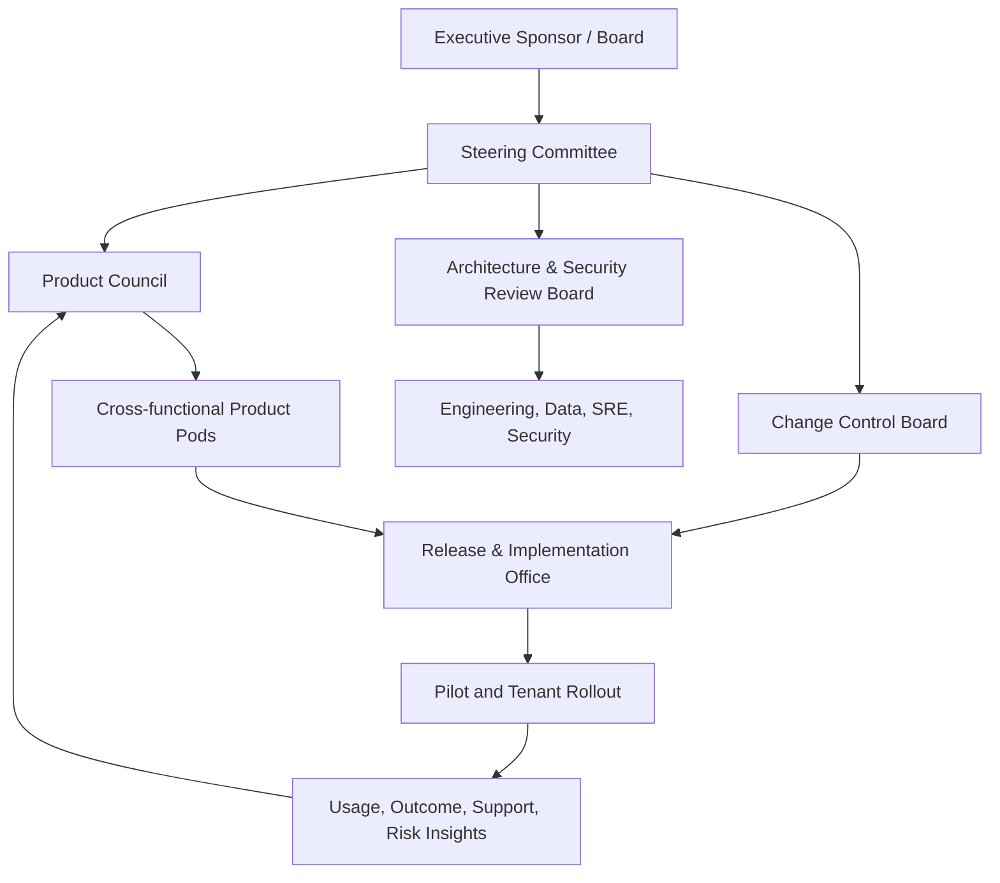
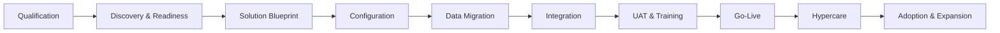
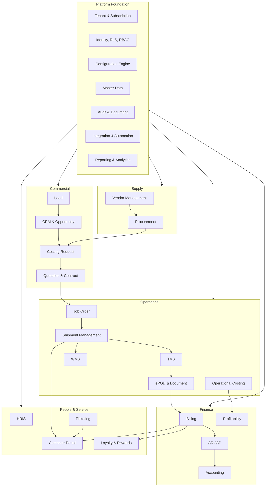
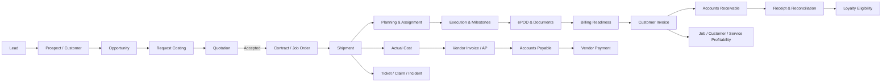
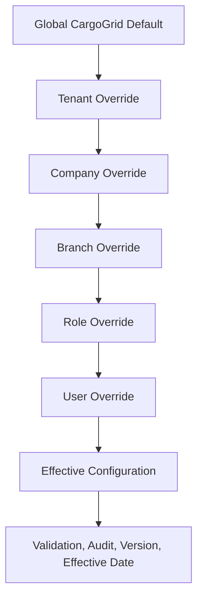

# CargoGrid Project & Product Charter

**Document ID:** CG-CHARTER-001  
**Version:** 1.0 Draft  
**Status:** Draft for Review and Sign-Off  
**Product:** CargoGrid  
**Document Owner:** CargoGrid Product Office  
**Primary Source of Truth:** `CargoGrid_Product_Concept_Brief.md`  
**Language:** Bahasa Indonesia dengan istilah teknis dalam English  

---

## Document Control

| Item | Description |
|---|---|
| Purpose | Menjadi dokumen induk untuk menyelaraskan product direction, business model, scope, governance, roadmap, commercialization, security, performance, risk, dan success metrics CargoGrid. |
| Intended audience | Founder, Product Team, Technical Team, Investor, Implementation Partner, Enterprise Customer, dan Management. |
| Authority | Keputusan yang berlabel **Confirmed Product Decision** berasal dari Product Concept Brief dan tidak boleh diubah tanpa formal change control. |
| Gap handling | Setiap gap dilengkapi sebagai **Proposed Default** dan dicatat dalam Assumption Register. |
| Precedence | Jika terdapat konflik antara praktik umum ERP/SaaS dengan Product Concept Brief, Product Concept Brief memiliki prioritas tertinggi. |
| Review cycle | **Proposed Default A-01:** quarterly review, serta ad-hoc review ketika ada perubahan material pada product strategy, architecture, regulation, atau commercialization. |

### Decision Labels

- **Confirmed Product Decision:** keputusan yang sudah dikonfirmasi dalam Product Concept Brief.
- **Proposed Default:** keputusan awal yang diperlukan agar draft dapat dieksekusi, tetapi masih dapat diubah melalui governance.
- **Open Decision:** keputusan yang belum cukup matang untuk ditetapkan sebagai default dan harus masuk decision backlog.

---

# 1. Executive Summary

CargoGrid adalah **multi-tenant, white-label, modular SaaS ERP** yang dirancang khusus untuk menjalankan bisnis dan operasi 3PL, freight forwarder, cargo company, trucking company, warehouse operator, courier dan distribution company, project logistics provider, serta in-house logistics operation. Produk ini diposisikan sebagai **all-in-one, end-to-end logistics operating system**, bukan sekadar aplikasi administrasi atau kumpulan modul yang berdiri sendiri.

**Confirmed Product Decision:** CargoGrid harus menghubungkan proses lead-to-revenue, quote-to-job, booking-to-delivery, vendor-to-payment, employee-to-performance, dan customer-transaction-to-loyalty dalam satu transactional backbone. Data yang sudah tersedia tidak boleh diminta ulang tanpa alasan bisnis yang jelas dan dapat diaudit.

Arsitektur produk menggunakan Next.js, TypeScript, Supabase, PostgreSQL, Supabase Auth, Row-Level Security, dan Role-Based Access Control. Seluruh konfigurasi tenant—termasuk module, feature, role, hierarchy, permission, workflow, approval, service, form, field, status, numbering, terminology, branding, notification, dashboard, report, API, dan webhook—harus dilakukan melalui UI tanpa perubahan source code backend.

CargoGrid akan dibangun bertahap. MVP tidak memuat seluruh modul. Foundation, tenant isolation, identity, entitlements, configuration engine, audit trail, master data, dan integration primitives dibangun lebih dahulu; commercial, operations, dan finance kemudian dirilis sebagai vertical slices yang menghasilkan nilai bisnis nyata. TMS, WMS, Procurement, Vendor Management, HRIS, Ticketing, Customer Portal, Loyalty, automation, dan enterprise capabilities diperluas melalui fase berikutnya.

**Proposed Default A-02:** strategi go-to-market awal menggunakan pendekatan land-and-expand: mulai dari tenant yang memiliki pain tinggi pada Commercial-to-Operations dan Shipment-to-Billing, lalu memperluas subscription ke Finance, Procurement, WMS, Customer Portal, dan advanced automation. Strategi ini mengurangi implementation risk sekaligus mempercepat time-to-value.

Keberhasilan CargoGrid tidak hanya diukur dari kelengkapan fitur. Produk harus cepat, stabil, aman, mudah dikonfigurasi, dapat diimplementasikan secara repeatable, dan memberi dampak terukur terhadap cycle time, data quality, visibility, on-time execution, billing readiness, profitability control, dan customer experience.

---

# 2. Product Background

Industri logistik sering tumbuh melalui kombinasi spreadsheet, messaging application, email, legacy accounting software, GPS portal, warehouse tools, custom database, dan proses manual. Akibatnya, satu transaksi dapat berpindah antar-department tanpa data lineage yang konsisten. Sales membuat quotation di satu file, Operations membuat job order di tempat lain, Procurement membandingkan vendor secara manual, ePOD tersimpan di chat, dan Finance menunggu dokumen sebelum invoice dapat diterbitkan.

CargoGrid dibentuk untuk menghilangkan fragmentasi tersebut melalui satu platform yang memodelkan customer, service, quotation, shipment, vendor, warehouse, cost, document, invoice, payment, employee, ticket, dan loyalty sebagai objek bisnis yang saling terhubung.

**Confirmed Product Decision:** CargoGrid harus mendukung variasi proses antar-tenant melalui metadata-driven dan configuration-driven architecture. Produk tidak boleh menjadi proyek custom software baru untuk setiap customer. Konfigurasi diperbolehkan; tenant-specific source-code fork tidak menjadi operating model utama.

---

# 3. Industry Problem Statement

Masalah inti yang hendak diselesaikan adalah:

| Problem | Manifestation | Business impact |
|---|---|---|
| Fragmented systems | CRM, shipment, costing, warehouse, finance, dan document berada di sistem berbeda | Reconciliation tinggi, error, duplicate work, dan keputusan terlambat |
| Redundant data entry | Data customer, shipment, vendor, rate, dan invoice diketik ulang | Data inconsistency, delay, dan audit difficulty |
| Weak operational visibility | Milestone dan exception tidak terstandardisasi | Customer escalation, missed SLA, dan reactive operation |
| Manual costing and quotation | Rate tersebar dan approval tidak terkontrol | Slow response, margin leakage, dan quotation inconsistency |
| Poor vendor governance | Vendor onboarding, rate, capacity, compliance, dan performance tidak terintegrasi | Procurement risk dan service failure |
| Delayed billing readiness | ePOD dan supporting document tidak terhubung ke billing | DSO meningkat dan revenue recognition terlambat |
| Rigid software | Perubahan workflow memerlukan developer atau vendor | High customization cost dan slow adaptation |
| Weak tenant and access governance | Access sering hanya berbasis menu | Risiko cross-company data exposure dan excessive privilege |
| Non-scalable reporting | Dashboard menarik seluruh dataset atau menghitung secara live | Sistem lambat dan biaya infrastruktur membesar |
| Limited customer self-service | Customer bergantung pada account manager untuk status dan dokumen | High service cost dan customer frustration |

CargoGrid mengatasi problem tersebut melalui common data model, configurable process, strict tenant isolation, transactional integration, auditable workflow, dan modular subscription.

---

# 4. Product Vision

> **Menjadi all-in-one, end-to-end, configurable logistics ERP system yang berfungsi sebagai operating system utama bagi perusahaan logistik dan in-house logistics operation, dari lead sampai revenue, booking sampai delivery, vendor sampai payment, employee sampai performance, serta customer transaction sampai loyalty.**

Visi ini mengandung lima konsekuensi:

1. CargoGrid harus menguasai transactional backbone, bukan hanya reporting layer.
2. Modul harus berinteraksi melalui shared business objects dan governed events.
3. Tenant configuration harus dapat dilakukan melalui UI.
4. Security dan data isolation harus menjadi architecture primitive.
5. Produk harus tumbuh dari SME sampai enterprise tanpa mengganti platform inti.

---

# 5. Product Mission

CargoGrid memiliki misi untuk:

- Menyatukan commercial, operations, procurement, finance, workforce, customer service, dan customer engagement ke dalam satu source of truth.
- Mengurangi manual handoff, spreadsheet dependency, duplicate entry, dan untracked approval.
- Mempercepat quotation, job creation, execution, documentation, billing, dan settlement.
- Memberi visibility atas revenue, cost, margin, service performance, vendor performance, dan working capital.
- Memberi tenant kemampuan menyesuaikan struktur organisasi dan operating model tanpa backend customization.
- Memberikan customer portal yang transparan dan aman.
- Menyediakan platform integration yang mampu terhubung dengan GPS, telematics, payment, accounting, customs, carrier, marketplace, dan enterprise system.

---

# 6. Product Positioning

CargoGrid diposisikan sebagai:

> **Configurable Logistics ERP and Operating System for companies that need commercial, operational, financial, and customer workflows to work as one connected system.**

CargoGrid bukan:

- Generic ERP yang hanya diberi label logistics.
- TMS tunggal tanpa finance dan commercial linkage.
- CRM yang berhenti pada quotation.
- Fleet tracking dashboard tanpa transactional control.
- Custom software house project yang difork per customer.
- Marketplace freight atau freight brokerage platform, kecuali ditetapkan pada fase lain.

**Proposed Default A-03:** positioning eksternal dibagi dalam tiga message layer:

| Layer | Message |
|---|---|
| Executive | Control revenue, operations, cost, cash, and customer experience from one logistics operating system. |
| Functional | Replace disconnected CRM, shipment, costing, document, vendor, billing, and reporting workflows. |
| Technical | Multi-tenant, configurable, API-ready, permission-aware, and scalable without tenant-specific backend changes. |

---

# 7. Core Value Proposition

| Value pillar | Customer outcome |
|---|---|
| One transaction, one data lineage | Data mengalir dari lead, quote, job, shipment, ePOD, invoice, dan payment tanpa re-entry |
| Configurable without code changes | Tenant mengadaptasi role, workflow, approval, form, field, service, status, dan terminology melalui UI |
| Logistics-native depth | Mendukung multimode, multi-leg, multi-pickup, multi-drop, warehouse, vendor, costing, and profitability |
| Commercial-to-cash control | Quotation, margin approval, contract, billing readiness, AR, dan payment terhubung |
| Operational visibility | Milestone, ETA, exception, delay, ePOD, claims, dan customer notification konsisten |
| Secure multi-tenancy | Data, user, configuration, document, branding, integration, dan reporting diisolasi per tenant |
| Modular adoption | Customer membeli capability sesuai maturity dan memperluas module secara bertahap |
| Enterprise extensibility | API, webhook, queue, background job, SSO, custom domain, audit, dan integration governance |

---

# 8. Target Market

Target market CargoGrid mencakup:

1. 3PL dengan kombinasi transport, warehousing, fulfillment, dan value-added services.
2. Freight forwarder yang mengelola air, sea, land, customs, consolidation, dan cross-border shipment.
3. Cargo company dan trucking company dengan operasi FTL, LTL, linehaul, first-mile, middle-mile, last-mile, dan multi-drop.
4. Warehouse operator dan fulfillment provider.
5. Courier dan distribution company.
6. Project logistics provider.
7. In-house logistics operation milik manufacturer, distributor, retailer, FMCG, industrial, healthcare, atau enterprise lain.

**Proposed Default A-04:** prioritas awal adalah Indonesia dan perusahaan yang menjalankan proses multi-branch atau multi-service dengan pain tinggi pada visibility, costing, vendor control, document readiness, dan billing. Expansion regional dipertimbangkan setelah multi-currency, localization, tax abstraction, data residency, dan support model matang.

---

# 9. Ideal Customer Profile

| Dimension | Core ICP | Enterprise ICP |
|---|---|---|
| Company type | 3PL, freight forwarder, trucking, warehouse, distribution | Multi-company logistics group atau enterprise in-house logistics |
| Operational complexity | Multi-service, multi-branch, vendor-assisted | Multi-country, multi-entity, high-volume, integration-heavy |
| Current pain | Spreadsheet and disconnected systems | Legacy ERP fragmentation and expensive customization |
| Transaction volume | Growing, repeatable jobs | High-volume shipment, inventory, document, and financial transactions |
| Buying trigger | Scale, audit issue, margin leakage, billing delay | Transformation program, platform consolidation, customer experience mandate |
| Sponsor | Owner, Director, GM, Head of Operations/Commercial/Finance | C-level, Transformation Office, CIO, COO, CFO |
| Readiness | Process owner available and willing to standardize | Governance, data migration, integration, and change management capability |
| Expansion potential | 3+ modules within 12–18 months | Enterprise package, SSO, advanced integration, dedicated support |

Negative ICP pada tahap awal adalah perusahaan yang hanya ingin menyalin semua proses lama tanpa standardization, menuntut source-code fork, tidak menyediakan process owner, atau mengharapkan seluruh module selesai sebelum pilot.

---

# 10. User Groups

## 10.1 Four User Layers

| Layer | User group | Core authority |
|---|---|---|
| Layer 1 | Supreme Admin | Absolute CRUD seluruh platform dan tenant, dengan controlled impersonation dan audit trail |
| Layer 2 | User Admin | Mengelola tenant dalam batas subscription, entitlement, policy, dan delegated permission |
| Layer 3 | Internal Organizational User | Menjalankan business process berdasarkan role, hierarchy, organization scope, ownership, value, dan status |
| Layer 4 | Customer User | Mengakses customer portal berdasarkan company, account, transaction, warehouse, invoice, dan delegated scope |

## 10.2 Layer 3 Default Hierarchy

**Confirmed Product Decision:** hierarchy default adalah Director, General Manager, Manager, Assistant Manager, Supervisor, Team Leader, dan Staff. Seluruh title, level, reporting line, approval authority, access scope, dan CRUD permission harus configurable.

## 10.3 Persona Groups

- Executive and management
- Sales and account management
- Sales support and pricing
- Operations control tower
- Transport planner and dispatcher
- Driver or field operator
- Warehouse operator and supervisor
- Procurement and vendor management
- Finance and accounting
- HR and people manager
- Customer service and claims
- IT, security, audit, and tenant administrator
- Customer shipper, consignee, finance, warehouse, and management user
- CargoGrid implementation, support, product, operations, and platform administrator

---

# 11. Business Objectives

1. Membangun recurring revenue melalui modular SaaS subscription.
2. Menghasilkan repeatable implementation model yang tidak bergantung pada custom development per tenant.
3. Menciptakan expansion revenue melalui module add-on, user tier, usage tier, integration, white-label, dan enterprise capabilities.
4. Menurunkan cost-to-serve melalui self-service configuration, reusable templates, observability, dan in-product support.
5. Membangun defensibility melalui logistics-native data model, workflow configuration, implementation knowledge, dan integration ecosystem.
6. Menghasilkan reference customer dengan outcome operasional dan finansial yang dapat dibuktikan.
7. Menjaga gross margin software dan implementation secara sehat melalui boundary yang jelas antara standard configuration dan paid professional services.

---

# 12. Product Objectives

- Menyediakan tenant provisioning dan module entitlement yang aman.
- Menyediakan reusable master data dan transaction lifecycle.
- Menjamin no redundant data entry sebagai default behavior.
- Mendukung configurable service, workflow, approval, form, field, status, numbering, document, report, dan terminology.
- Menyediakan full audit trail untuk perubahan data, configuration, approval, impersonation, dan integration.
- Menyediakan performance yang konsisten dari small tenant hingga enterprise.
- Menyediakan API-first integration primitives.
- Menghubungkan operational completion dengan billing readiness dan profitability.
- Menyediakan permission-aware reporting and analytics.

---

# 13. Product Principles

1. **Logistics-native, not generic-first.**
2. **Configuration over customization.**
3. **Single source of truth.**
4. **Enter once, reuse everywhere.**
5. **Security by design and default deny.**
6. **Tenant isolation at every layer.**
7. **Workflow must reflect authority, not only screen access.**
8. **Operational events must be auditable.**
9. **Performance is a product feature.**
10. **Server-side by default for sensitive and data-heavy operations.**
11. **Realtime only where realtime creates value.**
12. **Modular commercially, coherent architecturally.**
13. **Progressive complexity.** Basic tenant dapat mulai sederhana; enterprise dapat mengaktifkan advanced controls.
14. **No silent financial mutation.** Posted journal dan approved financial records harus immutable atau diperbaiki melalui governed reversal.
15. **Measure business outcomes, not feature count.**

---

# 14. Product Differentiators

- End-to-end commercial, operations, procurement, finance, HR, customer service, dan loyalty dalam satu logistics data model.
- Configuration engine yang mengatur bukan hanya form, tetapi workflow, approval, service, status, SLA, numbering, notification, and module entitlement.
- Four-layer access architecture dengan organization, record, field, transaction value, dan transaction status scope.
- White-label hingga domain, terminology, menu, template, portal, email, document, invoice, dan quotation.
- Job-level estimated-versus-actual profitability.
- Transactional link dari ePOD/document completion ke billing readiness.
- Vendor rate, compliance, capacity, performance, invoice, dan payment dalam satu vendor lifecycle.
- High-volume design yang menghindari excessive client fetching, N+1 query, global realtime subscription, dan full-dataset browser loading.

---

# 15. Project Scope

Project scope adalah seluruh pekerjaan untuk merancang, membangun, menguji, mengoperasikan, menjual, mengimplementasikan, dan meningkatkan CargoGrid sebagai SaaS product.

Project scope mencakup:

- Product discovery dan process research.
- Product architecture, domain model, UX system, and design system.
- Platform engineering, application development, testing, DevSecOps, observability, and support tooling.
- Tenant provisioning, subscription, billing support, white-label, and implementation tooling.
- Data migration framework dan integration framework.
- Product documentation, user guide, admin guide, API documentation, and training assets.
- Pricing, packaging, sales enablement, partner enablement, and commercialization.
- Pilot implementation, feedback loop, release management, and customer success.

---

# 16. Product Scope

Product scope adalah capability yang tersedia bagi Supreme Admin, User Admin, Internal Organizational User, Customer User, implementation team, support team, dan integration client.

Product scope dibagi menjadi:

1. Platform Foundation
2. Commercial and CRM
3. Quotation and Costing
4. Shipment Management and TMS
5. WMS
6. ePOD and Document
7. Procurement and Vendor Management
8. Finance and Accounting
9. HRIS
10. Ticketing
11. Customer Portal
12. Loyalty and Rewards
13. Reporting and Analytics
14. Integration
15. Configuration Engine

---

# 17. In Scope

- Multi-tenant SaaS and strict data isolation.
- White-label and custom domain.
- Modular subscription and feature entitlements.
- Four user layers and configurable organization hierarchy.
- RBAC, RLS, field-level, record-level, company, branch, department, team, customer, and ownership-based access.
- Configurable workflow, approval, service, form, field, status, numbering, SLA, notification, terminology, and document template.
- Commercial, CRM, quotation, shipment, TMS, WMS, costing, procurement, vendor, finance, HRIS, ticketing, portal, loyalty, reporting, analytics, API, and webhook capabilities defined in the Product Concept Brief.
- Responsive web application; PWA as optional capability.
- Audit trail, versioning, publish, rollback, effective date, and dependency validation for configuration.
- Data migration and integration support within approved implementation scope.

---

# 18. Out of Scope

**Proposed Default A-05:** items berikut tidak termasuk baseline scope kecuali disetujui melalui roadmap atau enterprise contract:

- Native iOS and Android application pada fase awal.
- Physical GPS device manufacturing atau telematics hardware.
- Owning carrier, warehouse, fleet, atau freight marketplace operation.
- Core banking, lending, insurance underwriting, atau embedded finance balance sheet.
- Customs authority system replacement.
- Fully autonomous AI decision-making tanpa human approval untuk pricing, financial posting, hiring, atau compliance.
- Tenant-specific source-code fork.
- Unlimited historical data cleansing di luar migration package.
- Country-specific payroll, tax, accounting, dan legal localization yang belum dipaketkan.
- Guaranteed integration dengan sistem eksternal yang tidak memiliki stable API atau contractual access.
- Blockchain implementation, IoT hardware, predictive maintenance, dan advanced AI sampai fase yang ditetapkan.

---

# 19. Assumptions

Seluruh asumsi yang digunakan dalam charter ini dicatat pada Assumption Register. Asumsi tidak mengubah Confirmed Product Decisions.

## 19.1 Assumption Register

| ID | Assumption / Proposed Default | Rationale | Validation owner | Validation point |
|---|---|---|---|---|
| A-01 | Charter direview quarterly | Menjaga alignment dengan roadmap dan market | Product Office | Setiap quarter |
| A-02 | GTM awal land-and-expand | Menurunkan implementation risk | CPO / Commercial | Sebelum pilot pricing |
| A-03 | Positioning memakai executive, functional, technical layers | Memudahkan multi-stakeholder sale | Marketing / Product | Messaging test |
| A-04 | Indonesia menjadi initial market | Relevansi domain dan implementation proximity | Founder / Commercial | Annual strategy |
| A-05 | Native mobile dan advanced AI di luar baseline | Fokus pada transactional core | Product Council | Roadmap review |
| A-06 | Shared multi-tenant database menjadi default, dengan tenant-aware schema and RLS | Efisiensi dan operability | CTO / Security | Architecture review |
| A-07 | Dedicated enterprise instance dapat ditawarkan sebagai premium deployment option | Memenuhi isolation atau procurement requirement tertentu | CTO / Commercial | Enterprise demand validation |
| A-08 | App Router dan Server Components menjadi default Next.js approach | Mengurangi client bundle dan excessive fetching | Engineering | Technical design authority |
| A-09 | Common reads memiliki p95 server response target ≤500 ms, excluding third-party latency | Performance budget awal | Engineering / SRE | Load test |
| A-10 | Core application monthly availability target 99.9% setelah General Availability | Baseline SaaS SLA | SRE / Legal | Pre-GA |
| A-11 | RPO 15 menit dan RTO 4 jam untuk production baseline | Recovery default awal | SRE / Security | DR test |
| A-12 | Implementation dibagi Standard, Advanced, Enterprise | Mengendalikan scope and margin | Implementation Office | Packaging approval |
| A-13 | Pricing terdiri atas platform fee, module fee, user/usage tier, and one-time implementation | Mencerminkan value and cost drivers | Commercial / Finance | Pricing workshop |
| A-14 | Customer data ownership tetap pada tenant; CargoGrid bertindak sesuai contractual role | Enterprise expectation | Legal / Security | Contract design |
| A-15 | ISO/IEC 27001 readiness, NIST CSF, dan OWASP ASVS digunakan sebagai control references, bukan klaim sertifikasi | Security maturity framework | Security | Annual security plan |
| A-16 | Finance MVP dimulai dari operational billing, AR/AP, payment, and job profitability sebelum full localization depth | Menghasilkan value lebih cepat | Product / Finance SME | Phase 4 design |
| A-17 | HRIS dan Loyalty tidak menjadi commercial MVP | Menghindari MVP overload | Product Council | Roadmap approval |
| A-18 | Data warehouse atau analytics replica dipisahkan ketika transactional workload membutuhkannya | Menjaga OLTP performance | Data / Engineering | Capacity threshold |
| A-19 | Implementation partner hanya boleh mengubah configuration dalam delegated scope | Menjaga platform integrity | Partner Office / Security | Partner agreement |
| A-20 | Pilot tenant mendapat controlled feature flags dan migration support | Mempercepat feedback dengan risiko terkontrol | Product / Implementation | Pilot kickoff |

---

# 20. Constraints

- Product breadth sangat besar; sequencing harus disiplin.
- Supabase/PostgreSQL architecture harus dirancang agar RLS tidak menjadi afterthought.
- White-label dan deep configurability meningkatkan test matrix.
- Full finance dan HRIS memerlukan domain expertise serta localization.
- Integrasi eksternal bergantung pada quality, availability, rate limit, dan contract system lain.
- Data migration quality bergantung pada sumber customer.
- Feature flexibility tidak boleh mengorbankan performance, security, dan supportability.
- Small product team tidak dapat membangun semua module paralel tanpa technical debt tinggi.
- Enterprise requirement dapat mendorong custom request yang bertentangan dengan product standardization.

---

# 21. Dependencies

| Dependency | Type | Impact if unavailable | Mitigation |
|---|---|---|---|
| Product Concept Brief and domain decisions | Product | Scope ambiguity | Formal decision log |
| Logistics SMEs | Domain | Incorrect workflow and data model | SME council and design review |
| Finance/accounting SME | Domain | Posting and reporting risk | Phase-gated finance design |
| Supabase/PostgreSQL capability | Technical | Auth, RLS, storage, realtime dependency | Abstraction, testing, backup, exit plan |
| Next.js ecosystem | Technical | Rendering and deployment behavior | Version policy and architecture standards |
| Cloud, CDN, monitoring, email, queue provider | Infrastructure | Reliability and latency | Multi-provider contingency where justified |
| External APIs | Integration | Delayed implementation | Adapter pattern, retry, queue, circuit breaker |
| Tenant data | Implementation | Migration delay | Data readiness assessment |
| Product analytics | Operating | Weak adoption insight | Instrumentation from early releases |
| Legal and regulatory review | Compliance | Contract and privacy risk | Legal gates before GA and new jurisdiction |

---

# 22. Stakeholder Register

| Stakeholder | Interest | Authority | Primary concern | Engagement |
|---|---|---|---|---|
| Founder / Executive Sponsor | Company value and funding | Final strategic authority | Market fit, capital, speed | Monthly steering committee |
| Chief Product Officer | Product outcomes | Product scope and priority | Coherence and adoption | Weekly product council |
| Chief Technology Officer | Architecture and delivery | Technical authority | Scale, security, maintainability | Architecture review |
| Commercial Lead | Revenue | GTM and pipeline | Pricing, ICP, win rate | Biweekly commercialization review |
| Implementation Lead | Customer delivery | Implementation method | Scope, time-to-value, migration | Weekly delivery review |
| Customer Success Lead | Adoption and retention | Success playbook | Usage, outcome, churn | Monthly account health review |
| Security / Privacy Lead | Risk and controls | Security gate authority | Isolation, access, incident | Security review and audit |
| Finance Lead | Unit economics | Budget and pricing input | Gross margin, billing, cash | Monthly business review |
| Logistics SME Council | Domain accuracy | Advisory / design sign-off | Workflow realism | Domain design workshops |
| Pilot Customer Sponsor | Business outcome | Tenant acceptance | Value and disruption | Steering and UAT |
| Pilot Customer Process Owners | Process fit | Functional acceptance | Usability and data | Sprint demos and UAT |
| Engineering and QA | Product delivery | Build and quality | Clear requirements and testability | Sprint rituals |
| Implementation Partner | Scale delivery | Delegated | Repeatability and margin | Certification and governance |
| Investor / Board | Growth and risk | Funding and oversight | Market size, defensibility, metrics | Board reporting |

---

# 23. Governance Structure

## Governance Bodies

- **Steering Committee:** strategy, funding, phase gates, major commercial commitments.
- **Product Council:** roadmap, product outcome, module priority, product standard versus customization.
- **Architecture & Security Review Board:** architecture, data model, RLS, integration, performance, security, reliability.
- **Change Control Board:** material scope, timeline, pricing, contract, migration, and breaking changes.
- **Release & Implementation Office:** release readiness, rollout, training, migration, support transition, customer acceptance.

---

# 24. Decision Rights

| Decision | Accountable authority | Mandatory consultation |
|---|---|---|
| Product vision and target market | Executive Sponsor | CPO, Commercial, Board |
| Confirmed Product Decision change | Steering Committee | CPO, CTO, affected SMEs, Security |
| Roadmap priority | CPO | Product Council, Commercial, Implementation |
| Architecture standard | CTO | ARB, Product, Security |
| Security exception | Security Lead and CTO | CPO, Legal, SRE |
| Pricing and packaging | Commercial Lead | CPO, Finance, Implementation |
| Standard versus custom request | CPO | CTO, Implementation, Commercial |
| Release go/no-go | CPO and CTO | QA, Security, SRE, Implementation |
| Tenant production acceptance | Tenant Sponsor and Implementation Lead | Process owners, Product, Support |
| Data incident response | Security Lead | CTO, Legal, Executive Sponsor |

---

# 25. RACI Matrix

Legend: **R** Responsible, **A** Accountable, **C** Consulted, **I** Informed.

| Workstream | Sponsor | CPO | CTO | Commercial | Implementation | Security | Finance | Customer Sponsor |
|---|---:|---:|---:|---:|---:|---:|---:|---:|
| Vision and strategy | A | R | C | C | I | I | C | I |
| Product discovery | I | A/R | C | C | C | I | I | C |
| Architecture | I | C | A/R | I | C | C | I | I |
| Security and privacy | I | C | C | I | C | A/R | I | I |
| Roadmap | C | A/R | C | C | C | C | I | I |
| Pricing and packaging | C | C | I | A/R | C | I | C | I |
| Pilot implementation | I | C | C | C | A/R | C | I | C |
| UAT and acceptance | I | C | C | I | R | C | I | A/R |
| Release go/no-go | I | A | A | I | R | C | I | I |
| SaaS metric reporting | I | A | C | R | C | I | R | I |
| Incident response | I | I | R | I | C | A | I | I |
| Change control | A | R | R | C | C | C | C | I |

---

# 26. Product Ownership Model

CargoGrid menggunakan **platform-plus-domain ownership model**.

- **Platform Product Owner:** tenancy, identity, entitlement, configuration engine, audit, notification, integration, search, document, reporting primitives.
- **Commercial Product Owner:** lead, CRM, opportunity, costing request, quotation, contract, sales target.
- **Operations Product Owner:** shipment, TMS, milestone, ePOD, claims, operational costing.
- **Warehouse Product Owner:** WMS, inventory, inbound, outbound, warehouse billing.
- **Procurement Product Owner:** vendor lifecycle, rate, sourcing, capacity, assessment, performance.
- **Finance Product Owner:** billing, AR, AP, payment, accounting, profitability.
- **People and Service Product Owner:** HRIS, ticketing, customer portal, loyalty.

Setiap owner bertanggung jawab pada outcome, discovery, backlog, acceptance criteria, dependency, adoption, and metric—not merely feature delivery.

---

# 27. SaaS Business Model

CargoGrid menggunakan B2B SaaS model dengan recurring subscription dan professional services.

Revenue streams yang diperbolehkan:

- Platform subscription.
- Module subscription.
- Feature add-on.
- User tier atau active user band.
- Usage tier untuk transaction, storage, API, document, notification, atau automation.
- White-label and custom domain fee.
- Enterprise security and deployment option.
- Implementation, migration, integration, training, and process advisory.
- Premium support and managed administration.
- Partner certification dan marketplace revenue pada fase berikutnya.

Tidak boleh terjadi unlimited customization yang disubsidi subscription standar. Custom requirement harus diklasifikasikan menjadi product roadmap, configurable implementation, reusable paid extension, atau rejected divergence.

---

# 28. Subscription Model

**Proposed Default A-13:** subscription memiliki empat lapisan:

1. **Platform Base:** tenant, company, branch, users, role, permission, configuration, audit, document, notification, dashboard foundation.
2. **Business Modules:** Commercial, Operations, Finance, WMS, Procurement, HRIS, Ticketing, Portal, Loyalty.
3. **Advanced Add-ons:** SSO, advanced analytics, high-volume API, advanced automation, dedicated environment, extended retention, premium support.
4. **Usage:** transaction, storage, integration, notification, OCR/AI, and compute-heavy workloads.

Entitlement harus dapat ditentukan pada tenant, module, feature, limit, effective date, grace period, trial, and suspension state.

---

# 29. Module Packaging

| Package | Core content | Best fit |
|---|---|---|
| CargoGrid Foundation | Tenant, user, role, permission, master data, configuration, audit, document, notification, basic reporting | Semua tenant |
| Commercial Suite | Lead, CRM, account, opportunity, activity, costing request, quotation, approval | Sales-driven logistics company |
| Operations Suite | Job order, shipment, milestone, dispatch, ePOD, actual cost, claims | 3PL, freight, trucking, distribution |
| Finance Suite | Billing, AR, AP, payment, journal, profitability, financial reports | Tenant yang membutuhkan control-to-cash |
| Warehouse Suite | Inbound, inventory, putaway, picking, outbound, billing | Warehouse and fulfillment operator |
| Vendor & Procurement Suite | Registration, compliance, rate, sourcing, capacity, performance | Asset-light and vendor-heavy operator |
| People & Service Suite | HRIS, ticketing, service desk | Multi-branch operation |
| Customer Experience Suite | Portal, ticket, document, billing visibility, loyalty | Customer-facing 3PL |
| Enterprise Control Pack | SSO, advanced audit, enterprise integration, dedicated support, deployment option | Enterprise and regulated customer |

**Proposed Default:** bundle tidak menghilangkan modular entitlement. Tenant dapat membeli bundle atau module individual sesuai pricing policy.

---

# 30. White-label Strategy

White-label adalah Confirmed Product Decision dan mencakup:

- Product name and logo.
- Color, typography, favicon, login page, and custom domain.
- Email, notification, quotation, invoice, ePOD, and document templates.
- Customer portal branding.
- Terminology and menu naming.
- Sender identity and helpdesk identity sesuai policy.

## White-label Guardrails

- Branding override tidak boleh mengubah security behavior.
- Tenant terminology tidak boleh mengubah internal canonical entity names.
- Custom domain harus melalui domain verification dan managed certificate.
- Template engine harus mencegah arbitrary code execution.
- CargoGrid dapat mempertahankan mandatory legal/security footer sesuai contract.
- Deep UI structural divergence tidak menjadi standard white-label.

---

# 31. Tenant Onboarding Strategy

Onboarding stages:

1. Commercial qualification and ICP fit.
2. Process, data, integration, security, and organization readiness assessment.
3. Solution blueprint and scope baseline.
4. Tenant provisioning, branding, entitlement, role, workflow, and service configuration.
5. Data cleansing and migration rehearsal.
6. Integration build and verification.
7. Role-based training, UAT, and cutover rehearsal.
8. Go-live with rollback plan.
9. Hypercare and defect triage.
10. Outcome review and module expansion.

Exit from onboarding requires named process owners, approved data, completed access matrix, signed UAT, reconciliation, operational readiness, support handover, and executive acceptance.

---

# 32. Implementation Model

| Model | Scope | Typical characteristic |
|---|---|---|
| Standard | Configuration of standard template, limited migration, standard training | Fastest and lowest complexity |
| Advanced | Multi-branch, workflow variations, migration, selected integrations | Medium complexity |
| Enterprise | Multi-company, SSO, extensive integration, high volume, security review, phased rollout | Governed program |

Implementation principles:

- Configure before extending.
- Standardize before migrating exceptions.
- No production data migration without rehearsal and reconciliation.
- No role go-live without access testing.
- No finance go-live without opening balance and transaction reconciliation.
- No integration go-live without retry, idempotency, monitoring, and failure ownership.
- Tenant-specific extension must have ownership, support, versioning, and upgrade policy.

---

# 33. Product Success Metrics

| Metric | Definition | Proposed target stage |
|---|---|---|
| Time-to-first-value | Days from kickoff to first live business transaction | Set by implementation package |
| Workflow completion rate | Started core workflows completed without workaround | ≥90% after stabilization |
| Active role adoption | Active users / licensed or expected active users | ≥70% monthly for operational roles |
| Configuration without code | Tenant changes completed through UI / total approved changes | ≥90% standard changes |
| Duplicate entry reduction | Baseline versus post-go-live repeated manual entry | Material reduction per process |
| Quote-to-job conversion integrity | Accepted quote converted without re-keying | ≥95% eligible transactions |
| ePOD-to-billing readiness | Completed ePOD automatically flagged for billing | ≥95% eligible jobs |
| Data quality score | Required field completeness and master duplicate rate | Tenant-specific threshold |
| Critical workflow defect rate | Sev-1/Sev-2 defects per release | Declining trend and release gate |

Targets are Proposed Defaults until baseline data tersedia.

---

# 34. Business Success Metrics

- ARR and MRR.
- New ARR, expansion ARR, contraction, and churned ARR.
- Net Revenue Retention and Gross Revenue Retention.
- Average Contract Value and Total Contract Value.
- CAC, CAC payback, LTV, and LTV:CAC.
- Software gross margin and professional services gross margin.
- Pipeline coverage, win rate, sales cycle, and implementation conversion.
- Module attach rate and expansion time.
- Referenceable customer rate.
- Partner-sourced revenue.

**Proposed Default:** metrics harus disegmentasi berdasarkan ICP, company size, package, acquisition channel, implementation model, dan cohort.

---

# 35. Operational Success Metrics

- Quotation turnaround time.
- Costing response time.
- Booking-to-job creation time.
- On-time pickup and on-time delivery.
- Milestone update timeliness.
- Exception resolution time.
- ePOD completeness and turnaround.
- Billing readiness cycle time.
- Invoice issuance lead time.
- DSO and AR aging.
- Vendor response, acceptance, and fulfillment rate.
- Cost variance and job gross margin.
- Inventory accuracy and warehouse order cycle time.
- Ticket first response, resolution, reopen, and SLA compliance.

CargoGrid harus memungkinkan metric definition, numerator, denominator, data source, exclusions, timezone, period, and ownership untuk dikonfigurasi dan diaudit.

---

# 36. SaaS Success Metrics

| Category | Metric |
|---|---|
| Reliability | Availability, error rate, incident rate, MTTA, MTTR |
| Performance | p50/p95/p99 latency, LCP, INP, query latency, queue delay |
| Scale | Transactions per tenant, concurrent users, API throughput, storage growth |
| Adoption | DAU/WAU/MAU, active roles, feature adoption, module depth |
| Retention | Logo churn, revenue churn, GRR, NRR, cohort retention |
| Economics | MRR, ARR, ARPA, CAC, payback, LTV, gross margin |
| Support | Ticket volume per tenant, first response, resolution, defect escape |
| Implementation | Time-to-live, migration defect, UAT pass, scope variance |

SaaS dashboard Supreme Admin harus memisahkan product usage, customer health, technical health, revenue health, entitlement, support, and security indicators.

---

# 37. Security and Compliance Objectives

CargoGrid harus menerapkan defense-in-depth dengan RLS dan RBAC sebagai core, bukan satu-satunya control.

## Objectives

- Strict tenant isolation pada database, storage, cache, queue, logs, search, analytics, export, backup, and integration.
- Default-deny access policy.
- MFA; SSO/SAML sebagai enterprise option.
- Field and record-level authorization.
- Secure session, token rotation, secret management, and least privilege.
- Signed URL and time-bound document access.
- Encryption in transit and at rest.
- Immutable or protected audit trail.
- Impersonation approval, purpose capture, visible banner, and detailed logging.
- Secure SDLC, threat modeling, dependency scanning, SAST/DAST, penetration testing, and RLS regression tests.
- Backup, restore, disaster recovery, incident response, breach notification process, and forensic readiness.
- Data retention, deletion, export, legal hold, and tenant offboarding control.
- Privacy-by-design and data minimization.

**Proposed Default A-15:** NIST CSF digunakan untuk governance and risk outcomes, OWASP ASVS untuk application security verification, dan ISO/IEC 27001 sebagai readiness reference. Kepatuhan terhadap UU Pelindungan Data Pribadi Indonesia dan peraturan lain harus diverifikasi oleh legal counsel sesuai peran CargoGrid sebagai controller atau processor dalam setiap use case.

## Security Gates

- No table exposed to tenant traffic without reviewed RLS or approved compensating control.
- No service-role credential in browser.
- No cross-tenant export without explicit Supreme Admin workflow and audit.
- No sensitive production impersonation without reason and logging.
- No GA without independent penetration test and remediation of critical/high findings.

---

# 38. High-Level Module Map

---

# 39. Module Dependency Map

| Module | Hard dependencies | Key downstream consumers |
|---|---|---|
| Platform Foundation | None | All modules |
| CRM | Tenant, identity, customer master | Quotation, ticketing, portal |
| Quotation | CRM, service, rate/costing, approval | Contract, job order, finance |
| Shipment Management | Customer, service, job order | TMS, WMS, ePOD, portal, finance |
| TMS | Shipment, route, fleet/vendor, milestone | ePOD, costing, analytics |
| WMS | Customer, warehouse, SKU, inventory ownership | Shipment, billing, portal |
| ePOD and Document | Shipment, storage, access control | Billing readiness, claims, portal |
| Operational Costing | Shipment, vendor rate, cost component | Profitability, AP, quotation learning |
| Procurement | Vendor, service, rate, approval | Costing and shipment assignment |
| Vendor Management | Master data, document, compliance | Procurement, TMS, AP |
| Finance | Customer/vendor, shipment, billing event | Reports, portal, loyalty |
| HRIS | Organization, user, employee | Approval, assignment, payroll, KPI |
| Ticketing | User/customer, SLA, linked entities | Portal, support analytics |
| Loyalty | Customer, eligible transaction, payment status | Portal and engagement |
| Reporting | All governed datasets | Management and customer insight |
| Integration | Identity, event, webhook, API policy | External ecosystem |
| Configuration Engine | Platform metadata and versioning | All configurable modules |

---

# 40. Product Roadmap

Roadmap bersifat capability-based, bukan janji tanggal. Timeline ditetapkan setelah capacity planning dan validation.

| Phase | Objective | Capability / Module | Dependency | Target user | Business value | Major risk | Exit criteria |
|---|---|---|---|---|---|---|---|
| Phase 0: Discovery and Foundation | Memvalidasi problem, domain model, ICP, architecture, and governance | Discovery, process map, canonical entities, design system, security model, product analytics plan | Sponsor, SMEs | Product, technical, pilot sponsors | Mengurangi salah bangun | Scope breadth and false consensus | Approved charter, domain map, architecture decision records, pilot candidates |
| Phase 1: Platform Core | Membangun secure configurable SaaS foundation | Tenant, subscription, identity, RLS/RBAC, organization, master data, configuration engine base, audit, document, notification, API primitives | Phase 0 | Supreme Admin, User Admin | Foundation reusable untuk semua modules | RLS and configurability complexity | Tenant provisioning, isolation test, role test, audit, configuration publish/rollback |
| Phase 2: Commercial MVP | Mengelola lead-to-accepted quotation | Lead, CRM, account, contact, opportunity, activity, costing request, quotation, approval, document generation | Phase 1 | Sales, pricing, manager | Faster quote, controlled margin, pipeline visibility | Over-configured CRM | Pilot handles real opportunities and converts accepted quote without re-entry |
| Phase 3: Operations MVP | Mengelola accepted quote-to-delivery | Job order, shipment, basic transport planning, milestone, exception, ePOD, document, actual cost, portal tracking basic | Phases 1–2 | Operations, customer user | Operational visibility and billing evidence | Mode complexity | Real shipments completed, status visible, ePOD linked, audit passed |
| Phase 4: Finance MVP | Mengubah completed job menjadi controlled billing and cash visibility | Billing readiness, invoice, AR, AP, receipt/payment, job profitability, basic GL and journal control | Phase 3 | Finance, management | Faster billing, margin and DSO control | Accounting correctness | Reconciled pilot invoices, payments, AP, job P&L, immutable posting controls |
| Phase 5: Advanced TMS and WMS | Menangani scale and complex execution | Multi-leg, multi-modal, load/route/capacity, dispatch, GPS, claims, WMS inbound-to-outbound, warehouse billing | Phases 3–4 | Transport and warehouse teams | Deeper operational coverage | Performance and edge cases | Load tests, operational UAT, inventory reconciliation, SLA dashboards |
| Phase 6: Procurement and Vendor Management | Mengendalikan vendor lifecycle and sourcing | Registration, compliance, assessment, rate card, RFQ, comparison, capacity, performance, contract | Phases 1,3,4 | Procurement, vendor manager | Lower cost and vendor risk | Poor vendor data | Vendor onboarding-to-payment traceability and KPI acceptance |
| Phase 7: HRIS and Ticketing | Mengelola workforce and service operations | Employee, attendance, leave, basic payroll foundation, KPI, internal/customer/CargoGrid ticketing | Phase 1 | HR, all internal users, support | Workforce and issue control | Localization and scope creep | Role/UAT, SLA workflow, employee data protection |
| Phase 8: Customer Portal and Loyalty | Memperluas self-service and engagement | Full booking, quote request, tracking, document, inventory, billing, ticket, profile, loyalty, rewards | Phases 2–7 | Customer User | Lower service cost, retention, differentiation | Portal permission leakage | Customer scope tests, adoption, transaction-linked loyalty accuracy |
| Phase 9: Intelligence, Automation, and Enterprise Expansion | Meningkatkan decision support and enterprise readiness | AI-assisted quotation, predictive ETA, OCR, optimization, fraud, advanced analytics, SSO, multi-region, dedicated instance | Mature data and controls | Enterprise users, management | Expansion revenue and differentiation | AI accuracy, cost, regulation | Model governance, measurable lift, enterprise security and performance gates |

---

# 41. MVP Definition

MVP CargoGrid adalah gabungan **Phase 1 + Phase 2 + minimum vertical slice Phase 3**, bukan seluruh roadmap.

## MVP Must Have

- Tenant provisioning and subscription entitlement.
- Four user layers.
- Configurable organization, hierarchy, role, permission, and scope.
- RLS-based tenant isolation.
- Customer, contact, address, service, vendor, and basic location master.
- Lead, opportunity, activity, costing request, quotation, version, approval, and conversion.
- Job order and basic shipment lifecycle.
- Milestone, status history, exception, document, and ePOD.
- Basic actual cost and job margin view.
- Audit trail, notification, template, and basic dashboard.
- Portal tracking and ePOD access for controlled customer user pilot.

## MVP Explicitly Excludes

Full WMS, full double-entry finance suite, full HRIS, advanced route optimization, loyalty, predictive AI, native mobile, multi-region, and comprehensive localization.

## MVP Outcome

A tenant harus dapat menerima lead, mengelola opportunity, membuat approved quotation, mengonversinya menjadi job and shipment, mengupdate milestone, menangkap ePOD, melihat estimated-versus-actual margin, dan memberi customer visibility tanpa duplicate entry.

---

# 42. Release Strategy

CargoGrid menggunakan progressive release:

1. Internal development environment.
2. Automated test and preview environment.
3. Internal alpha with seeded tenants.
4. Design partner beta.
5. Controlled pilot production.
6. Limited availability.
7. General availability.

Release controls:

- Semantic versioning untuk public API and integration contract.
- Feature flags per tenant and cohort.
- Backward-compatible database migration where possible.
- Migration rehearsal and rollback plan.
- Release notes for user, admin, API, and breaking change.
- Canary release for high-risk changes.
- Error budget and freeze rule after severe incident.
- Deprecation window for public API and critical workflow.

---

# 43. Commercialization Strategy

## 43.1 Initial Commercial Motion

**Proposed Default:** founder-led and consultative enterprise sale pada tahap awal, didukung industry-specific demo dan quantified value case.

Sales sequence:

1. ICP qualification.
2. Business process diagnostic.
3. Current-state cost and risk assessment.
4. Target-state demo menggunakan tenant configuration yang relevan.
5. Value case and phased solution.
6. Paid discovery atau implementation blueprint untuk complex tenant.
7. Pilot with success criteria.
8. Rollout and module expansion.

## 43.2 Proof Points

- Quote turnaround reduction.
- Shipment visibility improvement.
- ePOD and billing readiness acceleration.
- Reduction in manual reconciliation.
- Better vendor and cost control.
- Faster management reporting.
- Improved customer self-service.

## 43.3 Channel Strategy

- Direct enterprise sales.
- Logistics consulting and implementation partners.
- Accounting, GPS, telematics, warehouse automation, and system integration partners.
- Industry association and ecosystem partnerships.
- Content-led demand generation based on operational pain, not generic digital transformation claims.

---

# 44. Pricing Model Concept

Pricing harus sederhana untuk dibeli tetapi mencerminkan complexity and value.

## Proposed Pricing Components

| Component | Charging basis | Purpose |
|---|---|---|
| Platform fee | Per tenant / company band | Membiayai foundation and administration |
| Module fee | Per activated module or suite | Menyelaraskan price dengan business capability |
| User fee | Named or active user band | Mengikuti adoption scale |
| Usage fee | Shipment, order, inventory transaction, document, API, storage, notification | Mengikuti infrastructure and value drivers |
| White-label fee | Branding and domain tier | Premium configuration |
| Enterprise fee | SSO, dedicated environment, advanced audit, SLA, support | Enterprise requirement |
| Implementation | Fixed scope or time-and-material | Configuration, migration, integration, training |
| Support | Standard, premium, mission-critical | Response and service commitment |

Pricing guardrails:

- Tidak mengenakan terlalu banyak meter yang sulit diprediksi.
- Overage dan limit harus terlihat di admin dashboard.
- Trial dan pilot tidak boleh membuat production dependency tanpa commercial conversion plan.
- Discount memiliki authority matrix, expiry, minimum term, and expansion protection.
- Implementation fee tidak disembunyikan ke subscription apabila scope memang berat.

---

# 45. Risk Register

| ID | Risk | Probability | Impact | Owner | Early indicator |
|---|---|---:|---:|---|---|
| R-01 | Product scope terlalu luas | High | High | CPO | Banyak module paralel tanpa completed flow |
| R-02 | Tenant data leakage akibat RLS/config error | Medium | Critical | Security/CTO | Failed isolation test or suspicious access log |
| R-03 | Configurability menghasilkan complexity and poor UX | High | High | Product/CTO | Admin task memerlukan expert intervention |
| R-04 | Performance turun pada high-volume tenant | Medium | High | SRE/Engineering | p95 latency, slow query, queue backlog naik |
| R-05 | Finance logic tidak akurat | Medium | Critical | Finance PO | Reconciliation difference or manual journal workaround |
| R-06 | Excessive customer customization | High | High | CPO/Commercial | Tenant-specific code and branching |
| R-07 | Implementation time terlalu panjang | Medium | High | Implementation | Data readiness and scope variance |
| R-08 | Poor user adoption | Medium | High | Customer Success | Low active users and off-system workflow |
| R-09 | Third-party integration instability | High | Medium | Integration Lead | Retry volume and API failure |
| R-10 | Weak data migration | High | High | Implementation/Data | Duplicate master and reconciliation issue |
| R-11 | Pricing tidak menutup cost-to-serve | Medium | High | Commercial/Finance | Low gross margin by cohort |
| R-12 | Security or privacy non-compliance | Medium | Critical | Security/Legal | Audit finding or missing data process |
| R-13 | Vendor lock-in | Medium | Medium | CTO | Inability to restore or move critical services |
| R-14 | AI feature produces unsafe or incorrect decisions | Medium | High | AI/Product | Low precision, override, complaint |
| R-15 | Product roadmap driven by loudest customer | High | High | CPO | Low reuse of delivered features |
| R-16 | White-label variations break test coverage | Medium | High | QA/Product | Tenant-specific UI defects |
| R-17 | Support access abused or insufficiently logged | Low | Critical | Security/Support | Unexplained impersonation |
| R-18 | Analytics workload harms transactions | Medium | High | Data/SRE | DB CPU and lock contention |

---

# 46. Risk Mitigation

| Risk group | Mitigation |
|---|---|
| Scope | Phase gates, WIP limit, vertical-slice roadmap, explicit out-of-scope |
| Isolation | Automated RLS tests, tenant fuzz tests, default deny, security review, no service-role browser access |
| Configurability | Configuration schema, validation, versioning, preview, rollback, template, complexity budget |
| Performance | Performance budget, load testing, pagination, indexes, selective columns, caching, queue, observability |
| Finance | SME review, double-entry rules, immutable posting, reconciliation, audit scenarios |
| Customization | Product fit review, reusable extension policy, paid discovery, no code fork principle |
| Implementation | Readiness assessment, standard templates, data rehearsal, change control, phased rollout |
| Adoption | Role-based UX, embedded guidance, training, product analytics, customer success playbook |
| Integration | Adapter layer, idempotency, retry, dead-letter queue, versioned contract, monitoring |
| Commercial | Cohort unit economics, implementation margin tracking, module attach and expansion review |
| Compliance | Data inventory, privacy impact review, retention policy, incident plan, legal review |
| Vendor dependency | Backup/export test, abstraction where justified, recovery and migration plan |

---

# 47. Change Control

## Change Classes

- **Class 1 — Product Configuration:** tenant configuration within existing capability; no product code change.
- **Class 2 — Standard Product Enhancement:** reusable enhancement aligned with roadmap.
- **Class 3 — Enterprise Extension:** reusable but customer-funded extension with support and upgrade policy.
- **Class 4 — Breaking Change:** data model, API, workflow, pricing, security, or contract change requiring formal approval.
- **Class 5 — Confirmed Decision Change:** alteration to Product Concept Brief decisions; requires Steering Committee approval and source-of-truth update.

## Change Request Minimum Content

- Problem and desired outcome.
- Affected user and tenant.
- Confirmed decision impact.
- Scope, dependency, security, performance, data, migration, commercial, and support impact.
- Reuse potential.
- Alternatives considered.
- Acceptance criteria and rollback.
- Owner and decision deadline.

No change is approved only because a prospect requests it. Product fit, reuse, strategic value, implementation cost, security, and long-term support must be evaluated.

---

# 48. Approval and Sign-Off

Dokumen ini menjadi baseline setelah ditandatangani oleh accountable stakeholders. Approval tidak berarti seluruh Proposed Defaults menjadi immutable; default tetap dapat diubah melalui change control.

| Role | Name | Decision | Date | Signature / Evidence |
|---|---|---|---|---|
| Executive Sponsor / Founder |  | Approve / Reject |  |  |
| Chief Product Officer |  | Approve / Reject |  |  |
| Chief Technology Officer |  | Approve / Reject |  |  |
| Commercial Lead |  | Approve / Reject |  |  |
| Security / Privacy Lead |  | Approve / Reject |  |  |
| Finance Domain Owner |  | Approve / Reject |  |  |
| Implementation Lead |  | Approve / Reject |  |  |

## Sign-Off Conditions

- Confirmed Product Decisions tetap utuh.
- Assumption Register telah direview dan memiliki owner.
- MVP boundary diterima.
- Phase-gate governance disetujui.
- Security and performance objectives diterima sebagai product requirements.
- Pricing and implementation model masuk commercial validation.
- Open decisions dipindahkan ke decision backlog.

---

# Appendix A — End-to-End Value Stream

---

# Appendix B — Performance Positioning and Budget

CargoGrid tidak boleh terasa berat atau lambat. Performance requirement berlaku sejak architecture design, bukan setelah customer complaint.

## Proposed Performance Budget

| Area | Proposed Default Target | Notes |
|---|---|---|
| Common server read p95 | ≤500 ms | Tidak termasuk latency third-party API |
| Common mutation p95 | ≤800 ms | Async work dipindahkan ke queue |
| Heavy report request | Accepted ≤1 s; processed async bila perlu | User mendapat status/progress |
| Core page LCP p75 | ≤2.5 s pada supported network/device | Perlu real-user monitoring |
| Interaction responsiveness | INP p75 ≤200 ms | Client bundle dikendalikan |
| API error rate | <1% untuk first-party requests | Excluding expected validation error |
| Availability | 99.9% monthly after GA | Service credits subject to contract |
| Queue delay | Defined per workload class | Notification berbeda dengan financial posting |
| Data export | Async for large dataset | Tidak membawa seluruh dataset ke browser |

## Mandatory Engineering Practices

- Server Components and server-side data access untuk data-heavy or sensitive views.
- Client Components hanya untuk interactivity yang membutuhkan browser state.
- Pagination, server-side filter/sort, selective columns, and tenant-aware indexes.
- N+1 detection and slow-query logging.
- Controlled caching with invalidation ownership.
- Materialized/precomputed summary untuk complex dashboards bila relevan.
- Background jobs and queues untuk report, notification, integration, automation, OCR, and bulk processing.
- Realtime subscription hanya pada entity dan user scope yang membutuhkan realtime.
- Load tests berdasarkan realistic tenant distribution and worst-case authorization policy.
- Separate analytical workload ketika OLTP performance mulai terpengaruh.

---

# Appendix C — Configuration Precedence

Rules:

1. Override hanya dapat dilakukan bila parent policy mengizinkan.
2. Security minimum tidak dapat diturunkan oleh lower-level override.
3. Subscription entitlement membatasi configuration availability.
4. Conflict resolution harus deterministic dan dapat dijelaskan di UI.
5. Setiap publish menghasilkan version, effective date, author, diff, and rollback reference.

---

# Appendix D — External Validation Basis

Product Concept Brief tetap menjadi single source of truth. External sources hanya digunakan untuk memvalidasi technical and management practices, bukan mengganti keputusan produk.

- Next.js official documentation: server-side data fetching, Server Components, lazy loading, caching, and Route Handlers.
- Supabase official documentation: Auth, RLS, RBAC custom claims, Storage access control, API security, and SSO.
- PostgreSQL official documentation: Row Security Policies and policy behavior.
- NIST Cybersecurity Framework 2.0: cybersecurity governance and risk outcome structure.
- OWASP ASVS and Cheat Sheet Series: application security verification, access control, logging, and file upload controls.
- UU Nomor 27 Tahun 2022 tentang Pelindungan Data Pribadi: Indonesian personal data protection baseline, subject to legal interpretation.
- Stripe and Paddle SaaS metric references: MRR, ARR, churn, CAC, LTV, NRR, and expansion measurement.

---

# Appendix E — Open Decision Backlog

| ID | Decision | Why not fixed in charter | Owner |
|---|---|---|---|
| OD-01 | Exact legal entity and contracting model | Corporate decision outside concept brief | Founder / Legal |
| OD-02 | Final package names and price points | Requires willingness-to-pay validation | Commercial |
| OD-03 | Hosting region and deployment provider | Requires cost, latency, and data residency analysis | CTO |
| OD-04 | Dedicated instance architecture | Requires enterprise demand and operational model | CTO |
| OD-05 | Accounting and tax localization sequence | Requires market and finance SME prioritization | Finance PO |
| OD-06 | Mobile strategy: PWA versus native | Requires field workflow validation | Product |
| OD-07 | Initial design-partner tenants | Commercial and readiness decision | Founder / CPO |
| OD-08 | Product support hours and formal SLA tiers | Requires pricing and staffing model | Support / Commercial |
| OD-09 | AI provider and model governance | Future phase and risk review | CTO / Product |
| OD-10 | Partner certification and revenue share | Requires channel design | Commercial |

---

# Appendix F — Charter Acceptance Statement

Dengan menyetujui charter ini, stakeholder menerima bahwa CargoGrid adalah configurable logistics SaaS ERP dengan broad long-term scope, tetapi harus dibangun melalui disciplined phases. Kecepatan delivery tidak dicapai dengan memasukkan seluruh modul ke MVP. Kecepatan dicapai dengan memilih vertical slice yang menghasilkan business outcome, menggunakan foundation yang dapat dipakai ulang, dan menolak custom divergence yang melemahkan platform.

**End of Document**
