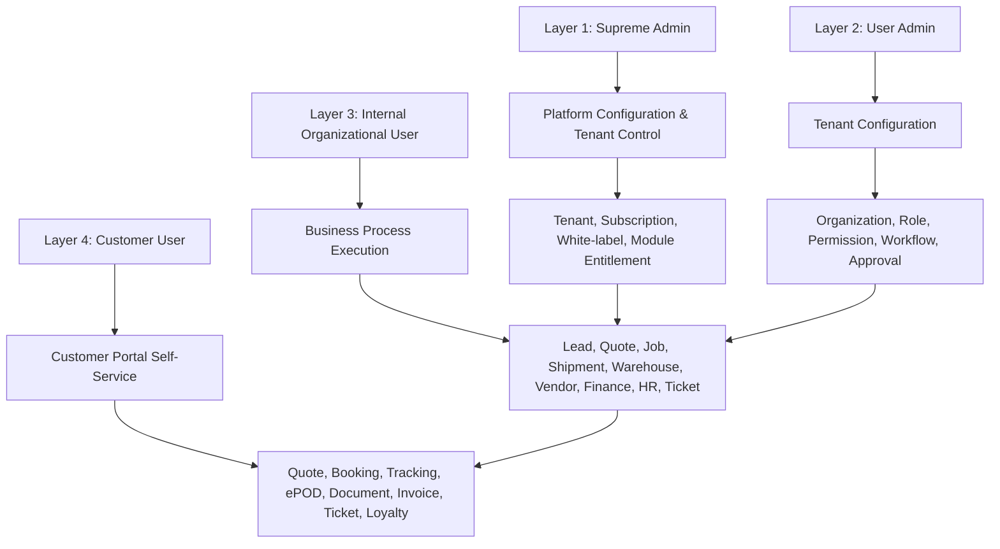
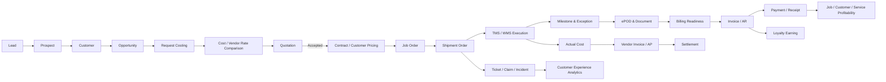

# CargoGrid Business Process & Product Requirements Blueprint

**Document ID:** CG-BPR-002  
**Version:** 1.0 Draft  
**Status:** Draft for Product, Technical, and Implementation Review  
**Product:** CargoGrid  
**Target Output File:** `02_CargoGrid_Business_Process_Product_Requirements_Blueprint.md`  
**Primary Source of Truth:** `CargoGrid_Product_Concept_Brief.md`  
**Secondary Context:** `01_CargoGrid_Project_Product_Charter.md`  
**Language:** Bahasa Indonesia profesional dengan istilah teknis dalam English  

---

## Document Control

| Item | Description |
|---|---|
| Purpose | Menjadi blueprint gabungan BRD, PRD, FRD/FRS, AS-IS Process, TO-BE Process, Business Rules Catalogue, Approval Matrix, User Story Catalogue, Acceptance Criteria, Status Lifecycle, Exception Catalogue, Reporting Requirement, Data Requirement, dan Non-Functional Requirement untuk CargoGrid. |
| Authority | Product Concept Brief menjadi single source of truth. Keputusan yang sudah menjadi **Confirmed Product Decision** tidak diubah. |
| Gap handling | Gap bisnis, proses, data, release, metric, dan implementation dilengkapi sebagai **Proposed Default** dan dicatat dalam **Assumption Register**. |
| Conflict rule | Jika praktik umum ERP/SaaS/logistics bertentangan dengan Product Concept Brief, Product Concept Brief memiliki prioritas tertinggi. |
| Intended audience | Founder, Product Team, Technical Team, Solution Architect, Business Analyst, QA, Implementation Partner, Investor, Management, dan Enterprise Customer. |

## Decision Labels

- **Confirmed Product Decision:** keputusan yang berasal dari Product Concept Brief dan tidak boleh diubah tanpa formal change control.
- **Proposed Default:** default awal agar requirement bisa dieksekusi, namun masih bisa diubah melalui governance.
- **Configurable Rule:** rule yang wajib bisa dikonfigurasi oleh Supreme Admin atau User Admin sesuai entitlement dan permission.
- **Open Decision:** keputusan yang belum cukup matang dan harus masuk decision backlog.

# 1. Executive Summary

CargoGrid adalah SaaS ERP multi-tenant, white-label, modular, dan configurable untuk 3PL, freight forwarder, cargo company, trucking company, warehouse operator, distribution company, project logistics provider, serta in-house logistics operation.

Blueprint ini menerjemahkan product direction CargoGrid menjadi proses bisnis, requirement fungsional, requirement data, approval, lifecycle, user story, reporting, security, auditability, dan performance control yang bisa dipakai langsung oleh product team, engineering, QA, implementation partner, dan management.

**Confirmed Product Decision:** CargoGrid harus menjadi **all-in-one, end-to-end logistics ERP system** yang menghubungkan commercial, operations, procurement, vendor management, finance, HRIS, ticketing, customer portal, loyalty, reporting, integration, dan configuration engine. Sistem harus mendukung **single source of truth**, **no redundant data entry**, **directional and transactional module linkage**, **strict tenant isolation**, **RLS/RBAC**, **audit trail**, **API/webhook integration**, serta **configuration through UI tanpa perubahan source code backend**.

Blueprint ini tidak memaksakan semua modul masuk MVP. Setiap requirement diberi **Suggested Release** supaya build sequence tetap realistis. Platform Foundation, Commercial MVP, Operations MVP slice, dan Finance MVP menjadi core awal. WMS advanced, Procurement/Vendor, HRIS, Ticketing, Customer Portal penuh, Loyalty, Intelligence, dan Enterprise Expansion masuk fase lanjutan sesuai dependency.

CargoGrid harus cepat. Sistem tidak boleh menjadi ERP berat yang setiap screen menarik dataset besar ke browser. Karena itu, blueprint ini menetapkan performance requirement eksplisit: hindari N+1 query, hindari `SELECT *`, gunakan server-side pagination, cursor pagination untuk high-volume entity, selective column query, tenant-aware indexing, composite indexes, query plan review, caching strategy, background jobs, queue, batch processing, materialized views untuk analytics berat, pemisahan transactional/reporting workload, limited realtime subscriptions, API rate limiting, slow-query logging, performance budget, dashboard pre-aggregation, bulk import strategy, dan export strategy.

# 2. Source of Truth Alignment

Blueprint ini mengikuti keputusan inti berikut.

| Area | Confirmed Product Decision yang Dipertahankan | Implikasi Requirement |
| --- | --- | --- |
| Product model | CargoGrid adalah SaaS ERP multi-tenant, white-label, modular subscription. | Setiap requirement harus tenant-aware, entitlement-aware, dan configurable. |
| Target market | 3PL, cargo company, freight forwarder, trucking, warehouse, distribution, project logistics, dan in-house logistics operation. | Data model dan process flow harus logistics-native, bukan generic ERP dulu baru ditempeli istilah logistik. |
| Access layer | Empat layer: Supreme Admin, User Admin, Internal Organizational User, Customer User. | Access, workflow, approval, reporting, dan portal scope wajib memisahkan layer dan data boundary. |
| Configurability | Role, permission, workflow, approval, form, field, status, numbering, service, document, dashboard, report, API, webhook dikonfigurasi melalui UI. | Configuration Engine menjadi dependency hampir semua module. |
| No backend code change | Tenant configuration tidak boleh membutuhkan perubahan source code backend. | Tenant-specific variance harus diselesaikan dengan metadata, rule engine, template, feature flag, atau approved extension. |
| End-to-end flow | Lead → CRM → opportunity → costing → quotation → contract/job → shipment → ePOD → invoice → payment → loyalty. | Master data dan transaction object harus reuse. Tidak boleh re-keying kecuali ada alasan bisnis dan audit. |
| Security | Strict tenant isolation, RLS, RBAC, field-level, record-level, audit, signed URL, secure auth. | Security rule wajib masuk acceptance criteria, bukan tambahan belakangan. |
| Performance | Backend dan API harus efisien, ringan, dan scalable. | NFR performance mengikat desain query, rendering, report, realtime, import/export, dan dashboard. |

# 3. Blueprint Scope and Reading Guide

Blueprint ini memuat lima lapisan requirement.

1. **Business Process Blueprint:** AS-IS, pain point, TO-BE, main flow, alternative flow, exception flow.
2. **Product Requirement Blueprint:** capability, functional requirement, business rule, validation, calculation, approval, lifecycle.
3. **Data Blueprint:** field detail untuk customer, shipment, vendor, warehouse, finance, employee, ticket, dan loyalty.
4. **Control Blueprint:** security, audit trail, approval matrix, business rule catalogue, status transition, exception catalogue.
5. **Delivery Blueprint:** requirement ID, priority, dependency, suggested release, user story, acceptance criteria, edge cases, out of scope, future enhancement.

Untuk menghindari dokumen yang isinya berulang dan tidak enak dipakai, setiap module/submodule disusun dalam **Module Requirement Card**. Card ini tetap memuat 34 elemen yang diminta, lalu dilengkapi matrix requirement, business rule catalogue, data dictionary, lifecycle, reporting, dan NFR yang lebih granular.

# 4. System Context

| Layer | Primary Purpose | Core Data Scope | Primary Controls |
| --- | --- | --- | --- |
| Supreme Admin | Mengelola platform, tenant, subscription, white-label, entitlement, global template, dan support access. | All tenants dengan controlled access. | Absolute CRUD, impersonation logging, configuration versioning, service-role control. |
| User Admin | Mengelola konfigurasi tenant sesuai subscription dan delegated authority. | Tenant sendiri: company, branch, department, user, role, workflow, approval, master data. | RBAC, tenant entitlement, admin permission, audit trail. |
| Internal Organizational User | Menjalankan proses bisnis internal tenant. | Data sesuai role, department, branch, team, ownership, value, status, service, region. | RBAC, RLS, field-level access, approval authority, transaction state. |
| Customer User | Self-service customer portal. | Data company/account/site/shipment/warehouse/invoice/ticket/loyalty sesuai assignment. | Customer-level access, portal permission, signed URL, masking if needed. |

# 5. Assumption Register

| ID | Assumption / Proposed Default | Rationale | Owner | Validation Point |
| --- | --- | --- | --- | --- |
| BP-A01 | Blueprint release mapping mengikuti charter Phase 1–9. | Product Concept Brief tidak memberi sequencing detail untuk semua requirement. | Product Owner | Roadmap review |
| BP-A02 | MVP memuat Platform Core, Commercial MVP, Operations MVP slice, dan Finance readiness dasar. | Menghindari MVP overload. | CPO/CTO | MVP scope gate |
| BP-A03 | Approval engine memakai generic rule evaluator berbasis metadata. | Diperlukan agar approval configurable tanpa backend changes. | Solution Architect | Architecture design |
| BP-A04 | Status lifecycle bisa dibuat per entity dan per service, tetapi canonical lifecycle tetap dipertahankan untuk reporting. | Terminology tenant boleh berbeda, reporting perlu konsistensi. | Product/Data Architect | Data model review |
| BP-A05 | Finance localization Indonesia masuk bertahap; full multi-country localization tidak menjadi MVP. | Finance dan payroll sangat lokal. | Finance SME | Finance design |
| BP-A06 | Customer Portal awal fokus pada quote request, booking, tracking, document, ePOD, ticket, invoice visibility. | Loyalty dan warehouse portal penuh masuk fase lanjutan. | Product Owner | Phase 8 planning |
| BP-A07 | Driver/mobile field capture dapat dimulai sebagai responsive web/PWA sebelum native mobile. | Native mobile bukan baseline awal. | Product/Engineering | Operations UAT |
| BP-A08 | Vendor self-registration dapat dinyalakan per tenant, tidak wajib global. | Sebagian tenant belum tentu siap membuka vendor portal. | Procurement PO | Tenant configuration |
| BP-A09 | Materialized view digunakan untuk analytics berat, bukan transaksi real-time. | Menjaga OLTP tetap cepat. | Data Engineering | Performance review |
| BP-A10 | Posted journal immutable; koreksi via reversal atau adjustment journal. | Akuntansi dan auditability. | Finance SME | Finance UAT |
| BP-A11 | Shipment mode awal mencakup land, air, sea; rail/customs/advanced cross-border diperluas bertahap. | Mengurangi breadth pada MVP. | Operations PO | Release planning |
| BP-A12 | Bulk import harus asynchronous untuk dataset besar. | Menghindari timeout dan blocking UI. | Engineering | Performance test |
| BP-A13 | Permission matrix menyimpan action-level dan field-level policy. | RBAC menu saja tidak cukup. | Security Architect | Security review |
| BP-A14 | Audit trail minimal mencatat who, what, when, before, after, reason, source, IP/device, correlation ID. | Dibutuhkan untuk compliance dan troubleshooting. | Security/Data | Audit UAT |
| BP-A15 | Ticketing dapat menautkan ticket ke shipment, invoice, warehouse order, vendor, customer, atau user. | Product Brief menetapkan ticket terkait transaksi. | Service PO | Ticketing design |

# 6. End-to-End Data Flow Map

CargoGrid harus menghubungkan data secara transaksional. Data tidak boleh berhenti di satu modul.

| Source Object | Reused By | Re-entry Allowed? | Audit Requirement |
| --- | --- | --- | --- |
| Lead/contact data | CRM, account, opportunity | Tidak, kecuali duplicate merge/correction | Merge log, correction reason |
| Customer legal/tax/billing | Quotation, contract, invoice, portal | Tidak | Version, approval, effective date |
| Service configuration | Quotation, shipment, costing, SLA, pricing | Tidak | Config version ID |
| Vendor rate | Costing, quotation, shipment assignment, AP matching | Tidak | Rate validity, source, approver |
| Shipment master | TMS, ePOD, claim, invoice, portal | Tidak | Milestone and status log |
| ePOD/document | Billing readiness, claim, portal | Tidak | Signed URL access log |
| Actual cost | Job profitability, AP, variance report | Tidak | Cost source, approval, variance reason |
| Employee master | Approval, assignment, attendance, payroll, KPI | Tidak | HR audit trail |

# 7. Global Requirement ID Standard

Requirement ID menggunakan pola `<DOMAIN>-<SUBDOMAIN>-<SEQUENCE>`.

| Domain | Prefix | Example |
| --- | --- | --- |
| Platform Foundation | PLT | PLT-TNT-001 |
| Commercial | COM | COM-LEAD-001 |
| Operations | OPS | OPS-TMS-001 |
| Procurement and Vendor | PRC | PRC-VND-001 |
| Finance and Accounting | FIN | FIN-GL-001 |
| HRIS | HRS | HRS-ATT-001 |
| Ticketing | TKT | TKT-SLA-001 |
| Customer Portal | CPT | CPT-TRK-001 |
| Loyalty and Rewards | LYL | LYL-PNT-001 |
| Non-Functional | NFR | NFR-PERF-001 |

# 8. Module Blueprint Cards

Bagian ini memuat blueprint per module dan submodule. Semua card mengikuti 34 elemen yang diminta agar requirement bisa langsung dipakai BA, product, engineering, QA, dan implementation team.

## 8.1 Platform Foundation

### Platform Foundation — Tenant & Subscription

| Requirement Card Item | Blueprint |
|---|---|
| Overview | Tenant & Subscription mengelola Tenant provisioning, module entitlement, subscription limit, feature availability, suspension, trial, renewal. Capability ini harus tenant-aware, subscription-aware, role-aware, status-aware, dan audit-ready. |
| Business objective | Mengurangi manual handoff, memastikan data lineage, mempercepat cycle time, menjaga control, dan memberi visibility yang konsisten. |
| Problem addressed | Proses manual, data tersebar, approval tidak konsisten, reporting lambat, dan risiko akses berlebihan. |
| Primary user | Supreme Admin. |
| Secondary user | User Admin. |
| Preconditions | Tenant aktif, module entitlement aktif, role/permission dikonfigurasi, master data minimum tersedia, dan workflow/status lifecycle dipublish. |
| Trigger | User membuat record baru, import data, API/webhook menerima event, customer portal request, atau system job berjalan. |
| Generic industry AS-IS | Umumnya proses berjalan lewat spreadsheet, chat, email, file attachment, atau software terpisah sehingga data sering diketik ulang dan sulit diaudit. |
| Common pain points | Duplicate entry, tidak ada single source of truth, approval bypass, status tidak standard, data tidak lengkap, document tercecer, dashboard tidak reliable, dan ownership kabur. |
| Proposed TO-BE | Proses berjalan di CargoGrid dengan canonical data object, validation, configurable workflow, approval, notification, audit trail, dan downstream linkage otomatis. |
| Main flow | Create/capture → validate → enrich → submit → approve/assign → execute/update → notify → link to downstream module → report/audit. |
| Alternative flow | Import file/API, duplicate merge, revision/resubmission, delegation, bulk action, tenant-specific workflow path, or customer portal initiated flow. |
| Exception flow | Invalid data, unauthorized access, expired rule, failed integration, approval timeout, duplicate conflict, locked period, missing attachment, or downstream dependency missing. |
| Functional capabilities | Tenant provisioning, module entitlement, subscription limit, feature availability, suspension, trial, renewal. |
| Functional requirements | Minimal requirement utama: `PLT-TNT-001` dan requirement turunan pada matrix domain. |
| Business rules | Rule harus configurable oleh authorized admin: eligibility, mandatory field, threshold, lifecycle, approval path, SLA, downstream conversion rule, and exception policy. |
| Validation rules | Required field, data type, uniqueness, tenant scope, status permission, date consistency, currency consistency, attachment requirement, and duplicate check. |
| Calculation rules | Jika relevan: margin, aging, SLA due time, chargeable weight, volume, tax, point, cost variance, utilization, productivity, or financial balance. Formula harus versioned dan auditable. |
| Approval rules | Sequential, parallel, conditional, threshold-based, role/user/department-based, delegation, escalation, rejection, revision, resubmission. |
| Status lifecycle | `Draft → Submitted → Under Review → Approved → Active → Closed/Archived`. Tenant boleh rename status, tetapi canonical state harus tetap tersimpan untuk reporting. |
| Required data | Tenant ID, company/branch scope, owner, status, effective date, source, reference number, related entity, audit metadata, and module-specific fields. |
| Inputs | Manual UI input, import, API, webhook, previous module conversion, customer portal request, or system-generated event. |
| Outputs | Transaction record, status update, document, notification, downstream task, report metric, audit event, and integration event. |
| Notifications | In-app, email, webhook, optional WhatsApp/SMS via integration, approval reminder, escalation alert, and customer-facing notification if enabled. |
| Integrations | REST API, webhook, storage, email/notification service, external system adapter, queue/background job where needed. |
| Dependencies | Platform Foundation, identity, RLS/RBAC, master data, configuration engine, audit, notification, and relevant upstream module. |
| Reports | Operational dashboard, aging, SLA, exception, productivity, conversion, cost/margin, compliance, and user activity report as relevant. |
| Audit trail | Create/update/delete, status change, approval action, field change before/after, attachment access, impersonation, import/export, API event. |
| Security considerations | Tenant isolation, role/field/record-level access, customer scope filter, signed URL, masking for sensitive fields, service-role protection. |
| User stories | As a `Supreme Admin`, I need to manage tenant & subscription so that the business process can continue without duplicate entry and with auditable control. |
| Acceptance criteria | User can create/update/search/filter/export according to permission; invalid data is rejected; approval follows rule; lifecycle transition is enforced; audit record is created; downstream linkage works. |
| Edge cases | Duplicate record, partial data, concurrent update, stale configuration version, integration retry, inactive user, locked record, expired document/rate, cross-branch access attempt. |
| Out of scope | Native mobile-specific UI, tenant source-code fork, unsupported external system behavior, and business decision automation without human governance. |
| Future enhancements | AI assistance, OCR, predictive analytics, optimization, advanced automation, native mobile, and external ecosystem extension where relevant. |

### Platform Foundation — White-label & Localization

| Requirement Card Item | Blueprint |
|---|---|
| Overview | White-label & Localization mengelola Branding, custom domain, terminology, language, currency, timezone, document/email template. Capability ini harus tenant-aware, subscription-aware, role-aware, status-aware, dan audit-ready. |
| Business objective | Mengurangi manual handoff, memastikan data lineage, mempercepat cycle time, menjaga control, dan memberi visibility yang konsisten. |
| Problem addressed | Proses manual, data tersebar, approval tidak konsisten, reporting lambat, dan risiko akses berlebihan. |
| Primary user | Supreme Admin. |
| Secondary user | User Admin. |
| Preconditions | Tenant aktif, module entitlement aktif, role/permission dikonfigurasi, master data minimum tersedia, dan workflow/status lifecycle dipublish. |
| Trigger | User membuat record baru, import data, API/webhook menerima event, customer portal request, atau system job berjalan. |
| Generic industry AS-IS | Umumnya proses berjalan lewat spreadsheet, chat, email, file attachment, atau software terpisah sehingga data sering diketik ulang dan sulit diaudit. |
| Common pain points | Duplicate entry, tidak ada single source of truth, approval bypass, status tidak standard, data tidak lengkap, document tercecer, dashboard tidak reliable, dan ownership kabur. |
| Proposed TO-BE | Proses berjalan di CargoGrid dengan canonical data object, validation, configurable workflow, approval, notification, audit trail, dan downstream linkage otomatis. |
| Main flow | Create/capture → validate → enrich → submit → approve/assign → execute/update → notify → link to downstream module → report/audit. |
| Alternative flow | Import file/API, duplicate merge, revision/resubmission, delegation, bulk action, tenant-specific workflow path, or customer portal initiated flow. |
| Exception flow | Invalid data, unauthorized access, expired rule, failed integration, approval timeout, duplicate conflict, locked period, missing attachment, or downstream dependency missing. |
| Functional capabilities | Branding, custom domain, terminology, language, currency, timezone, document/email template. |
| Functional requirements | Minimal requirement utama: `PLT-WLB-001` dan requirement turunan pada matrix domain. |
| Business rules | Rule harus configurable oleh authorized admin: eligibility, mandatory field, threshold, lifecycle, approval path, SLA, downstream conversion rule, and exception policy. |
| Validation rules | Required field, data type, uniqueness, tenant scope, status permission, date consistency, currency consistency, attachment requirement, and duplicate check. |
| Calculation rules | Jika relevan: margin, aging, SLA due time, chargeable weight, volume, tax, point, cost variance, utilization, productivity, or financial balance. Formula harus versioned dan auditable. |
| Approval rules | Sequential, parallel, conditional, threshold-based, role/user/department-based, delegation, escalation, rejection, revision, resubmission. |
| Status lifecycle | `Draft → Submitted → Under Review → Approved → Active → Closed/Archived`. Tenant boleh rename status, tetapi canonical state harus tetap tersimpan untuk reporting. |
| Required data | Tenant ID, company/branch scope, owner, status, effective date, source, reference number, related entity, audit metadata, and module-specific fields. |
| Inputs | Manual UI input, import, API, webhook, previous module conversion, customer portal request, or system-generated event. |
| Outputs | Transaction record, status update, document, notification, downstream task, report metric, audit event, and integration event. |
| Notifications | In-app, email, webhook, optional WhatsApp/SMS via integration, approval reminder, escalation alert, and customer-facing notification if enabled. |
| Integrations | REST API, webhook, storage, email/notification service, external system adapter, queue/background job where needed. |
| Dependencies | Platform Foundation, identity, RLS/RBAC, master data, configuration engine, audit, notification, and relevant upstream module. |
| Reports | Operational dashboard, aging, SLA, exception, productivity, conversion, cost/margin, compliance, and user activity report as relevant. |
| Audit trail | Create/update/delete, status change, approval action, field change before/after, attachment access, impersonation, import/export, API event. |
| Security considerations | Tenant isolation, role/field/record-level access, customer scope filter, signed URL, masking for sensitive fields, service-role protection. |
| User stories | As a `Supreme Admin`, I need to manage white-label & localization so that the business process can continue without duplicate entry and with auditable control. |
| Acceptance criteria | User can create/update/search/filter/export according to permission; invalid data is rejected; approval follows rule; lifecycle transition is enforced; audit record is created; downstream linkage works. |
| Edge cases | Duplicate record, partial data, concurrent update, stale configuration version, integration retry, inactive user, locked record, expired document/rate, cross-branch access attempt. |
| Out of scope | Native mobile-specific UI, tenant source-code fork, unsupported external system behavior, and business decision automation without human governance. |
| Future enhancements | AI assistance, OCR, predictive analytics, optimization, advanced automation, native mobile, and external ecosystem extension where relevant. |

### Platform Foundation — User, Organization, Role & Permission

| Requirement Card Item | Blueprint |
|---|---|
| Overview | User, Organization, Role & Permission mengelola User lifecycle, org hierarchy, RBAC, field-level and record-level access, customer portal user. Capability ini harus tenant-aware, subscription-aware, role-aware, status-aware, dan audit-ready. |
| Business objective | Mengurangi manual handoff, memastikan data lineage, mempercepat cycle time, menjaga control, dan memberi visibility yang konsisten. |
| Problem addressed | Proses manual, data tersebar, approval tidak konsisten, reporting lambat, dan risiko akses berlebihan. |
| Primary user | User Admin. |
| Secondary user | Supreme Admin. |
| Preconditions | Tenant aktif, module entitlement aktif, role/permission dikonfigurasi, master data minimum tersedia, dan workflow/status lifecycle dipublish. |
| Trigger | User membuat record baru, import data, API/webhook menerima event, customer portal request, atau system job berjalan. |
| Generic industry AS-IS | Umumnya proses berjalan lewat spreadsheet, chat, email, file attachment, atau software terpisah sehingga data sering diketik ulang dan sulit diaudit. |
| Common pain points | Duplicate entry, tidak ada single source of truth, approval bypass, status tidak standard, data tidak lengkap, document tercecer, dashboard tidak reliable, dan ownership kabur. |
| Proposed TO-BE | Proses berjalan di CargoGrid dengan canonical data object, validation, configurable workflow, approval, notification, audit trail, dan downstream linkage otomatis. |
| Main flow | Create/capture → validate → enrich → submit → approve/assign → execute/update → notify → link to downstream module → report/audit. |
| Alternative flow | Import file/API, duplicate merge, revision/resubmission, delegation, bulk action, tenant-specific workflow path, or customer portal initiated flow. |
| Exception flow | Invalid data, unauthorized access, expired rule, failed integration, approval timeout, duplicate conflict, locked period, missing attachment, or downstream dependency missing. |
| Functional capabilities | User lifecycle, org hierarchy, RBAC, field-level and record-level access, customer portal user. |
| Functional requirements | Minimal requirement utama: `PLT-IAM-001` dan requirement turunan pada matrix domain. |
| Business rules | Rule harus configurable oleh authorized admin: eligibility, mandatory field, threshold, lifecycle, approval path, SLA, downstream conversion rule, and exception policy. |
| Validation rules | Required field, data type, uniqueness, tenant scope, status permission, date consistency, currency consistency, attachment requirement, and duplicate check. |
| Calculation rules | Jika relevan: margin, aging, SLA due time, chargeable weight, volume, tax, point, cost variance, utilization, productivity, or financial balance. Formula harus versioned dan auditable. |
| Approval rules | Sequential, parallel, conditional, threshold-based, role/user/department-based, delegation, escalation, rejection, revision, resubmission. |
| Status lifecycle | `Draft → Submitted → Under Review → Approved → Active → Closed/Archived`. Tenant boleh rename status, tetapi canonical state harus tetap tersimpan untuk reporting. |
| Required data | Tenant ID, company/branch scope, owner, status, effective date, source, reference number, related entity, audit metadata, and module-specific fields. |
| Inputs | Manual UI input, import, API, webhook, previous module conversion, customer portal request, or system-generated event. |
| Outputs | Transaction record, status update, document, notification, downstream task, report metric, audit event, and integration event. |
| Notifications | In-app, email, webhook, optional WhatsApp/SMS via integration, approval reminder, escalation alert, and customer-facing notification if enabled. |
| Integrations | REST API, webhook, storage, email/notification service, external system adapter, queue/background job where needed. |
| Dependencies | Platform Foundation, identity, RLS/RBAC, master data, configuration engine, audit, notification, and relevant upstream module. |
| Reports | Operational dashboard, aging, SLA, exception, productivity, conversion, cost/margin, compliance, and user activity report as relevant. |
| Audit trail | Create/update/delete, status change, approval action, field change before/after, attachment access, impersonation, import/export, API event. |
| Security considerations | Tenant isolation, role/field/record-level access, customer scope filter, signed URL, masking for sensitive fields, service-role protection. |
| User stories | As a `User Admin`, I need to manage user, organization, role & permission so that the business process can continue without duplicate entry and with auditable control. |
| Acceptance criteria | User can create/update/search/filter/export according to permission; invalid data is rejected; approval follows rule; lifecycle transition is enforced; audit record is created; downstream linkage works. |
| Edge cases | Duplicate record, partial data, concurrent update, stale configuration version, integration retry, inactive user, locked record, expired document/rate, cross-branch access attempt. |
| Out of scope | Native mobile-specific UI, tenant source-code fork, unsupported external system behavior, and business decision automation without human governance. |
| Future enhancements | AI assistance, OCR, predictive analytics, optimization, advanced automation, native mobile, and external ecosystem extension where relevant. |

### Platform Foundation — Workflow, Approval & Configuration Engine

| Requirement Card Item | Blueprint |
|---|---|
| Overview | Workflow, Approval & Configuration Engine mengelola No-code workflow, approval, form, field, status, numbering, notification, SLA, service configuration. Capability ini harus tenant-aware, subscription-aware, role-aware, status-aware, dan audit-ready. |
| Business objective | Mengurangi manual handoff, memastikan data lineage, mempercepat cycle time, menjaga control, dan memberi visibility yang konsisten. |
| Problem addressed | Proses manual, data tersebar, approval tidak konsisten, reporting lambat, dan risiko akses berlebihan. |
| Primary user | Supreme Admin. |
| Secondary user | User Admin. |
| Preconditions | Tenant aktif, module entitlement aktif, role/permission dikonfigurasi, master data minimum tersedia, dan workflow/status lifecycle dipublish. |
| Trigger | User membuat record baru, import data, API/webhook menerima event, customer portal request, atau system job berjalan. |
| Generic industry AS-IS | Umumnya proses berjalan lewat spreadsheet, chat, email, file attachment, atau software terpisah sehingga data sering diketik ulang dan sulit diaudit. |
| Common pain points | Duplicate entry, tidak ada single source of truth, approval bypass, status tidak standard, data tidak lengkap, document tercecer, dashboard tidak reliable, dan ownership kabur. |
| Proposed TO-BE | Proses berjalan di CargoGrid dengan canonical data object, validation, configurable workflow, approval, notification, audit trail, dan downstream linkage otomatis. |
| Main flow | Create/capture → validate → enrich → submit → approve/assign → execute/update → notify → link to downstream module → report/audit. |
| Alternative flow | Import file/API, duplicate merge, revision/resubmission, delegation, bulk action, tenant-specific workflow path, or customer portal initiated flow. |
| Exception flow | Invalid data, unauthorized access, expired rule, failed integration, approval timeout, duplicate conflict, locked period, missing attachment, or downstream dependency missing. |
| Functional capabilities | No-code workflow, approval, form, field, status, numbering, notification, SLA, service configuration. |
| Functional requirements | Minimal requirement utama: `PLT-CFG-001` dan requirement turunan pada matrix domain. |
| Business rules | Rule harus configurable oleh authorized admin: eligibility, mandatory field, threshold, lifecycle, approval path, SLA, downstream conversion rule, and exception policy. |
| Validation rules | Required field, data type, uniqueness, tenant scope, status permission, date consistency, currency consistency, attachment requirement, and duplicate check. |
| Calculation rules | Jika relevan: margin, aging, SLA due time, chargeable weight, volume, tax, point, cost variance, utilization, productivity, or financial balance. Formula harus versioned dan auditable. |
| Approval rules | Sequential, parallel, conditional, threshold-based, role/user/department-based, delegation, escalation, rejection, revision, resubmission. |
| Status lifecycle | `Draft → Submitted → Under Review → Approved → Active → Closed/Archived`. Tenant boleh rename status, tetapi canonical state harus tetap tersimpan untuk reporting. |
| Required data | Tenant ID, company/branch scope, owner, status, effective date, source, reference number, related entity, audit metadata, and module-specific fields. |
| Inputs | Manual UI input, import, API, webhook, previous module conversion, customer portal request, or system-generated event. |
| Outputs | Transaction record, status update, document, notification, downstream task, report metric, audit event, and integration event. |
| Notifications | In-app, email, webhook, optional WhatsApp/SMS via integration, approval reminder, escalation alert, and customer-facing notification if enabled. |
| Integrations | REST API, webhook, storage, email/notification service, external system adapter, queue/background job where needed. |
| Dependencies | Platform Foundation, identity, RLS/RBAC, master data, configuration engine, audit, notification, and relevant upstream module. |
| Reports | Operational dashboard, aging, SLA, exception, productivity, conversion, cost/margin, compliance, and user activity report as relevant. |
| Audit trail | Create/update/delete, status change, approval action, field change before/after, attachment access, impersonation, import/export, API event. |
| Security considerations | Tenant isolation, role/field/record-level access, customer scope filter, signed URL, masking for sensitive fields, service-role protection. |
| User stories | As a `Supreme Admin`, I need to manage workflow, approval & configuration engine so that the business process can continue without duplicate entry and with auditable control. |
| Acceptance criteria | User can create/update/search/filter/export according to permission; invalid data is rejected; approval follows rule; lifecycle transition is enforced; audit record is created; downstream linkage works. |
| Edge cases | Duplicate record, partial data, concurrent update, stale configuration version, integration retry, inactive user, locked record, expired document/rate, cross-branch access attempt. |
| Out of scope | Native mobile-specific UI, tenant source-code fork, unsupported external system behavior, and business decision automation without human governance. |
| Future enhancements | AI assistance, OCR, predictive analytics, optimization, advanced automation, native mobile, and external ecosystem extension where relevant. |

### Platform Foundation — Master Data & Integration Foundation

| Requirement Card Item | Blueprint |
|---|---|
| Overview | Master Data & Integration Foundation mengelola Common master data, API, webhook, feature flag, audit, import/export. Capability ini harus tenant-aware, subscription-aware, role-aware, status-aware, dan audit-ready. |
| Business objective | Mengurangi manual handoff, memastikan data lineage, mempercepat cycle time, menjaga control, dan memberi visibility yang konsisten. |
| Problem addressed | Proses manual, data tersebar, approval tidak konsisten, reporting lambat, dan risiko akses berlebihan. |
| Primary user | User Admin. |
| Secondary user | Internal User. |
| Preconditions | Tenant aktif, module entitlement aktif, role/permission dikonfigurasi, master data minimum tersedia, dan workflow/status lifecycle dipublish. |
| Trigger | User membuat record baru, import data, API/webhook menerima event, customer portal request, atau system job berjalan. |
| Generic industry AS-IS | Umumnya proses berjalan lewat spreadsheet, chat, email, file attachment, atau software terpisah sehingga data sering diketik ulang dan sulit diaudit. |
| Common pain points | Duplicate entry, tidak ada single source of truth, approval bypass, status tidak standard, data tidak lengkap, document tercecer, dashboard tidak reliable, dan ownership kabur. |
| Proposed TO-BE | Proses berjalan di CargoGrid dengan canonical data object, validation, configurable workflow, approval, notification, audit trail, dan downstream linkage otomatis. |
| Main flow | Create/capture → validate → enrich → submit → approve/assign → execute/update → notify → link to downstream module → report/audit. |
| Alternative flow | Import file/API, duplicate merge, revision/resubmission, delegation, bulk action, tenant-specific workflow path, or customer portal initiated flow. |
| Exception flow | Invalid data, unauthorized access, expired rule, failed integration, approval timeout, duplicate conflict, locked period, missing attachment, or downstream dependency missing. |
| Functional capabilities | Common master data, API, webhook, feature flag, audit, import/export. |
| Functional requirements | Minimal requirement utama: `PLT-MDM-001` dan requirement turunan pada matrix domain. |
| Business rules | Rule harus configurable oleh authorized admin: eligibility, mandatory field, threshold, lifecycle, approval path, SLA, downstream conversion rule, and exception policy. |
| Validation rules | Required field, data type, uniqueness, tenant scope, status permission, date consistency, currency consistency, attachment requirement, and duplicate check. |
| Calculation rules | Jika relevan: margin, aging, SLA due time, chargeable weight, volume, tax, point, cost variance, utilization, productivity, or financial balance. Formula harus versioned dan auditable. |
| Approval rules | Sequential, parallel, conditional, threshold-based, role/user/department-based, delegation, escalation, rejection, revision, resubmission. |
| Status lifecycle | `Draft → Submitted → Under Review → Approved → Active → Closed/Archived`. Tenant boleh rename status, tetapi canonical state harus tetap tersimpan untuk reporting. |
| Required data | Tenant ID, company/branch scope, owner, status, effective date, source, reference number, related entity, audit metadata, and module-specific fields. |
| Inputs | Manual UI input, import, API, webhook, previous module conversion, customer portal request, or system-generated event. |
| Outputs | Transaction record, status update, document, notification, downstream task, report metric, audit event, and integration event. |
| Notifications | In-app, email, webhook, optional WhatsApp/SMS via integration, approval reminder, escalation alert, and customer-facing notification if enabled. |
| Integrations | REST API, webhook, storage, email/notification service, external system adapter, queue/background job where needed. |
| Dependencies | Platform Foundation, identity, RLS/RBAC, master data, configuration engine, audit, notification, and relevant upstream module. |
| Reports | Operational dashboard, aging, SLA, exception, productivity, conversion, cost/margin, compliance, and user activity report as relevant. |
| Audit trail | Create/update/delete, status change, approval action, field change before/after, attachment access, impersonation, import/export, API event. |
| Security considerations | Tenant isolation, role/field/record-level access, customer scope filter, signed URL, masking for sensitive fields, service-role protection. |
| User stories | As a `User Admin`, I need to manage master data & integration foundation so that the business process can continue without duplicate entry and with auditable control. |
| Acceptance criteria | User can create/update/search/filter/export according to permission; invalid data is rejected; approval follows rule; lifecycle transition is enforced; audit record is created; downstream linkage works. |
| Edge cases | Duplicate record, partial data, concurrent update, stale configuration version, integration retry, inactive user, locked record, expired document/rate, cross-branch access attempt. |
| Out of scope | Native mobile-specific UI, tenant source-code fork, unsupported external system behavior, and business decision automation without human governance. |
| Future enhancements | AI assistance, OCR, predictive analytics, optimization, advanced automation, native mobile, and external ecosystem extension where relevant. |

## 8.2 Commercial

### Commercial — Lead Management

| Requirement Card Item | Blueprint |
|---|---|
| Overview | Lead Management mengelola Lead capture, source, scoring, qualification, assignment, duplicate detection, conversion. Capability ini harus tenant-aware, subscription-aware, role-aware, status-aware, dan audit-ready. |
| Business objective | Mengurangi manual handoff, memastikan data lineage, mempercepat cycle time, menjaga control, dan memberi visibility yang konsisten. |
| Problem addressed | Proses manual, data tersebar, approval tidak konsisten, reporting lambat, dan risiko akses berlebihan. |
| Primary user | Sales/Marketing. |
| Secondary user | Sales Manager. |
| Preconditions | Tenant aktif, module entitlement aktif, role/permission dikonfigurasi, master data minimum tersedia, dan workflow/status lifecycle dipublish. |
| Trigger | User membuat record baru, import data, API/webhook menerima event, customer portal request, atau system job berjalan. |
| Generic industry AS-IS | Umumnya proses berjalan lewat spreadsheet, chat, email, file attachment, atau software terpisah sehingga data sering diketik ulang dan sulit diaudit. |
| Common pain points | Duplicate entry, tidak ada single source of truth, approval bypass, status tidak standard, data tidak lengkap, document tercecer, dashboard tidak reliable, dan ownership kabur. |
| Proposed TO-BE | Proses berjalan di CargoGrid dengan canonical data object, validation, configurable workflow, approval, notification, audit trail, dan downstream linkage otomatis. |
| Main flow | Create/capture → validate → enrich → submit → approve/assign → execute/update → notify → link to downstream module → report/audit. |
| Alternative flow | Import file/API, duplicate merge, revision/resubmission, delegation, bulk action, tenant-specific workflow path, or customer portal initiated flow. |
| Exception flow | Invalid data, unauthorized access, expired rule, failed integration, approval timeout, duplicate conflict, locked period, missing attachment, or downstream dependency missing. |
| Functional capabilities | Lead capture, source, scoring, qualification, assignment, duplicate detection, conversion. |
| Functional requirements | Minimal requirement utama: `COM-LEAD-001` dan requirement turunan pada matrix domain. |
| Business rules | Rule harus configurable oleh authorized admin: eligibility, mandatory field, threshold, lifecycle, approval path, SLA, downstream conversion rule, and exception policy. |
| Validation rules | Required field, data type, uniqueness, tenant scope, status permission, date consistency, currency consistency, attachment requirement, and duplicate check. |
| Calculation rules | Jika relevan: margin, aging, SLA due time, chargeable weight, volume, tax, point, cost variance, utilization, productivity, or financial balance. Formula harus versioned dan auditable. |
| Approval rules | Sequential, parallel, conditional, threshold-based, role/user/department-based, delegation, escalation, rejection, revision, resubmission. |
| Status lifecycle | `New → Assigned → Contacted → Qualified → Converted → Disqualified`. Tenant boleh rename status, tetapi canonical state harus tetap tersimpan untuk reporting. |
| Required data | Tenant ID, company/branch scope, owner, status, effective date, source, reference number, related entity, audit metadata, and module-specific fields. |
| Inputs | Manual UI input, import, API, webhook, previous module conversion, customer portal request, or system-generated event. |
| Outputs | Transaction record, status update, document, notification, downstream task, report metric, audit event, and integration event. |
| Notifications | In-app, email, webhook, optional WhatsApp/SMS via integration, approval reminder, escalation alert, and customer-facing notification if enabled. |
| Integrations | REST API, webhook, storage, email/notification service, external system adapter, queue/background job where needed. |
| Dependencies | Platform Foundation, identity, RLS/RBAC, master data, configuration engine, audit, notification, and relevant upstream module. |
| Reports | Operational dashboard, aging, SLA, exception, productivity, conversion, cost/margin, compliance, and user activity report as relevant. |
| Audit trail | Create/update/delete, status change, approval action, field change before/after, attachment access, impersonation, import/export, API event. |
| Security considerations | Tenant isolation, role/field/record-level access, customer scope filter, signed URL, masking for sensitive fields, service-role protection. |
| User stories | As a `Sales/Marketing`, I need to manage lead management so that the business process can continue without duplicate entry and with auditable control. |
| Acceptance criteria | User can create/update/search/filter/export according to permission; invalid data is rejected; approval follows rule; lifecycle transition is enforced; audit record is created; downstream linkage works. |
| Edge cases | Duplicate record, partial data, concurrent update, stale configuration version, integration retry, inactive user, locked record, expired document/rate, cross-branch access attempt. |
| Out of scope | Native mobile-specific UI, tenant source-code fork, unsupported external system behavior, and business decision automation without human governance. |
| Future enhancements | AI assistance, OCR, predictive analytics, optimization, advanced automation, native mobile, and external ecosystem extension where relevant. |

### Commercial — CRM, Account & Contact

| Requirement Card Item | Blueprint |
|---|---|
| Overview | CRM, Account & Contact mengelola Account, contact, activity, sales plan, pipeline, forecast, win-loss analytics. Capability ini harus tenant-aware, subscription-aware, role-aware, status-aware, dan audit-ready. |
| Business objective | Mengurangi manual handoff, memastikan data lineage, mempercepat cycle time, menjaga control, dan memberi visibility yang konsisten. |
| Problem addressed | Proses manual, data tersebar, approval tidak konsisten, reporting lambat, dan risiko akses berlebihan. |
| Primary user | Sales. |
| Secondary user | Sales Manager. |
| Preconditions | Tenant aktif, module entitlement aktif, role/permission dikonfigurasi, master data minimum tersedia, dan workflow/status lifecycle dipublish. |
| Trigger | User membuat record baru, import data, API/webhook menerima event, customer portal request, atau system job berjalan. |
| Generic industry AS-IS | Umumnya proses berjalan lewat spreadsheet, chat, email, file attachment, atau software terpisah sehingga data sering diketik ulang dan sulit diaudit. |
| Common pain points | Duplicate entry, tidak ada single source of truth, approval bypass, status tidak standard, data tidak lengkap, document tercecer, dashboard tidak reliable, dan ownership kabur. |
| Proposed TO-BE | Proses berjalan di CargoGrid dengan canonical data object, validation, configurable workflow, approval, notification, audit trail, dan downstream linkage otomatis. |
| Main flow | Create/capture → validate → enrich → submit → approve/assign → execute/update → notify → link to downstream module → report/audit. |
| Alternative flow | Import file/API, duplicate merge, revision/resubmission, delegation, bulk action, tenant-specific workflow path, or customer portal initiated flow. |
| Exception flow | Invalid data, unauthorized access, expired rule, failed integration, approval timeout, duplicate conflict, locked period, missing attachment, or downstream dependency missing. |
| Functional capabilities | Account, contact, activity, sales plan, pipeline, forecast, win-loss analytics. |
| Functional requirements | Minimal requirement utama: `COM-CRM-001` dan requirement turunan pada matrix domain. |
| Business rules | Rule harus configurable oleh authorized admin: eligibility, mandatory field, threshold, lifecycle, approval path, SLA, downstream conversion rule, and exception policy. |
| Validation rules | Required field, data type, uniqueness, tenant scope, status permission, date consistency, currency consistency, attachment requirement, and duplicate check. |
| Calculation rules | Jika relevan: margin, aging, SLA due time, chargeable weight, volume, tax, point, cost variance, utilization, productivity, or financial balance. Formula harus versioned dan auditable. |
| Approval rules | Sequential, parallel, conditional, threshold-based, role/user/department-based, delegation, escalation, rejection, revision, resubmission. |
| Status lifecycle | `Draft → Active → In Progress → Won/Lost → Archived`. Tenant boleh rename status, tetapi canonical state harus tetap tersimpan untuk reporting. |
| Required data | Tenant ID, company/branch scope, owner, status, effective date, source, reference number, related entity, audit metadata, and module-specific fields. |
| Inputs | Manual UI input, import, API, webhook, previous module conversion, customer portal request, or system-generated event. |
| Outputs | Transaction record, status update, document, notification, downstream task, report metric, audit event, and integration event. |
| Notifications | In-app, email, webhook, optional WhatsApp/SMS via integration, approval reminder, escalation alert, and customer-facing notification if enabled. |
| Integrations | REST API, webhook, storage, email/notification service, external system adapter, queue/background job where needed. |
| Dependencies | Platform Foundation, identity, RLS/RBAC, master data, configuration engine, audit, notification, and relevant upstream module. |
| Reports | Operational dashboard, aging, SLA, exception, productivity, conversion, cost/margin, compliance, and user activity report as relevant. |
| Audit trail | Create/update/delete, status change, approval action, field change before/after, attachment access, impersonation, import/export, API event. |
| Security considerations | Tenant isolation, role/field/record-level access, customer scope filter, signed URL, masking for sensitive fields, service-role protection. |
| User stories | As a `Sales`, I need to manage crm, account & contact so that the business process can continue without duplicate entry and with auditable control. |
| Acceptance criteria | User can create/update/search/filter/export according to permission; invalid data is rejected; approval follows rule; lifecycle transition is enforced; audit record is created; downstream linkage works. |
| Edge cases | Duplicate record, partial data, concurrent update, stale configuration version, integration retry, inactive user, locked record, expired document/rate, cross-branch access attempt. |
| Out of scope | Native mobile-specific UI, tenant source-code fork, unsupported external system behavior, and business decision automation without human governance. |
| Future enhancements | AI assistance, OCR, predictive analytics, optimization, advanced automation, native mobile, and external ecosystem extension where relevant. |

### Commercial — Opportunity & Request Costing

| Requirement Card Item | Blueprint |
|---|---|
| Overview | Opportunity & Request Costing mengelola Opportunity, cost request, cost search, vendor rate comparison, commercial feasibility. Capability ini harus tenant-aware, subscription-aware, role-aware, status-aware, dan audit-ready. |
| Business objective | Mengurangi manual handoff, memastikan data lineage, mempercepat cycle time, menjaga control, dan memberi visibility yang konsisten. |
| Problem addressed | Proses manual, data tersebar, approval tidak konsisten, reporting lambat, dan risiko akses berlebihan. |
| Primary user | Sales. |
| Secondary user | Pricing/Procurement. |
| Preconditions | Tenant aktif, module entitlement aktif, role/permission dikonfigurasi, master data minimum tersedia, dan workflow/status lifecycle dipublish. |
| Trigger | User membuat record baru, import data, API/webhook menerima event, customer portal request, atau system job berjalan. |
| Generic industry AS-IS | Umumnya proses berjalan lewat spreadsheet, chat, email, file attachment, atau software terpisah sehingga data sering diketik ulang dan sulit diaudit. |
| Common pain points | Duplicate entry, tidak ada single source of truth, approval bypass, status tidak standard, data tidak lengkap, document tercecer, dashboard tidak reliable, dan ownership kabur. |
| Proposed TO-BE | Proses berjalan di CargoGrid dengan canonical data object, validation, configurable workflow, approval, notification, audit trail, dan downstream linkage otomatis. |
| Main flow | Create/capture → validate → enrich → submit → approve/assign → execute/update → notify → link to downstream module → report/audit. |
| Alternative flow | Import file/API, duplicate merge, revision/resubmission, delegation, bulk action, tenant-specific workflow path, or customer portal initiated flow. |
| Exception flow | Invalid data, unauthorized access, expired rule, failed integration, approval timeout, duplicate conflict, locked period, missing attachment, or downstream dependency missing. |
| Functional capabilities | Opportunity, cost request, cost search, vendor rate comparison, commercial feasibility. |
| Functional requirements | Minimal requirement utama: `COM-OPP-001` dan requirement turunan pada matrix domain. |
| Business rules | Rule harus configurable oleh authorized admin: eligibility, mandatory field, threshold, lifecycle, approval path, SLA, downstream conversion rule, and exception policy. |
| Validation rules | Required field, data type, uniqueness, tenant scope, status permission, date consistency, currency consistency, attachment requirement, and duplicate check. |
| Calculation rules | Jika relevan: margin, aging, SLA due time, chargeable weight, volume, tax, point, cost variance, utilization, productivity, or financial balance. Formula harus versioned dan auditable. |
| Approval rules | Sequential, parallel, conditional, threshold-based, role/user/department-based, delegation, escalation, rejection, revision, resubmission. |
| Status lifecycle | `Open → Cost Requested → Cost Received → Quoted → Won/Lost`. Tenant boleh rename status, tetapi canonical state harus tetap tersimpan untuk reporting. |
| Required data | Tenant ID, company/branch scope, owner, status, effective date, source, reference number, related entity, audit metadata, and module-specific fields. |
| Inputs | Manual UI input, import, API, webhook, previous module conversion, customer portal request, or system-generated event. |
| Outputs | Transaction record, status update, document, notification, downstream task, report metric, audit event, and integration event. |
| Notifications | In-app, email, webhook, optional WhatsApp/SMS via integration, approval reminder, escalation alert, and customer-facing notification if enabled. |
| Integrations | REST API, webhook, storage, email/notification service, external system adapter, queue/background job where needed. |
| Dependencies | Platform Foundation, identity, RLS/RBAC, master data, configuration engine, audit, notification, and relevant upstream module. |
| Reports | Operational dashboard, aging, SLA, exception, productivity, conversion, cost/margin, compliance, and user activity report as relevant. |
| Audit trail | Create/update/delete, status change, approval action, field change before/after, attachment access, impersonation, import/export, API event. |
| Security considerations | Tenant isolation, role/field/record-level access, customer scope filter, signed URL, masking for sensitive fields, service-role protection. |
| User stories | As a `Sales`, I need to manage opportunity & request costing so that the business process can continue without duplicate entry and with auditable control. |
| Acceptance criteria | User can create/update/search/filter/export according to permission; invalid data is rejected; approval follows rule; lifecycle transition is enforced; audit record is created; downstream linkage works. |
| Edge cases | Duplicate record, partial data, concurrent update, stale configuration version, integration retry, inactive user, locked record, expired document/rate, cross-branch access attempt. |
| Out of scope | Native mobile-specific UI, tenant source-code fork, unsupported external system behavior, and business decision automation without human governance. |
| Future enhancements | AI assistance, OCR, predictive analytics, optimization, advanced automation, native mobile, and external ecosystem extension where relevant. |

### Commercial — Quotation, Approval & Contract

| Requirement Card Item | Blueprint |
|---|---|
| Overview | Quotation, Approval & Contract mengelola Quotation versioning, margin, discount, approval, validity, acceptance, contract, job conversion. Capability ini harus tenant-aware, subscription-aware, role-aware, status-aware, dan audit-ready. |
| Business objective | Mengurangi manual handoff, memastikan data lineage, mempercepat cycle time, menjaga control, dan memberi visibility yang konsisten. |
| Problem addressed | Proses manual, data tersebar, approval tidak konsisten, reporting lambat, dan risiko akses berlebihan. |
| Primary user | Sales Support. |
| Secondary user | Manager/Customer. |
| Preconditions | Tenant aktif, module entitlement aktif, role/permission dikonfigurasi, master data minimum tersedia, dan workflow/status lifecycle dipublish. |
| Trigger | User membuat record baru, import data, API/webhook menerima event, customer portal request, atau system job berjalan. |
| Generic industry AS-IS | Umumnya proses berjalan lewat spreadsheet, chat, email, file attachment, atau software terpisah sehingga data sering diketik ulang dan sulit diaudit. |
| Common pain points | Duplicate entry, tidak ada single source of truth, approval bypass, status tidak standard, data tidak lengkap, document tercecer, dashboard tidak reliable, dan ownership kabur. |
| Proposed TO-BE | Proses berjalan di CargoGrid dengan canonical data object, validation, configurable workflow, approval, notification, audit trail, dan downstream linkage otomatis. |
| Main flow | Create/capture → validate → enrich → submit → approve/assign → execute/update → notify → link to downstream module → report/audit. |
| Alternative flow | Import file/API, duplicate merge, revision/resubmission, delegation, bulk action, tenant-specific workflow path, or customer portal initiated flow. |
| Exception flow | Invalid data, unauthorized access, expired rule, failed integration, approval timeout, duplicate conflict, locked period, missing attachment, or downstream dependency missing. |
| Functional capabilities | Quotation versioning, margin, discount, approval, validity, acceptance, contract, job conversion. |
| Functional requirements | Minimal requirement utama: `COM-QTN-001` dan requirement turunan pada matrix domain. |
| Business rules | Rule harus configurable oleh authorized admin: eligibility, mandatory field, threshold, lifecycle, approval path, SLA, downstream conversion rule, and exception policy. |
| Validation rules | Required field, data type, uniqueness, tenant scope, status permission, date consistency, currency consistency, attachment requirement, and duplicate check. |
| Calculation rules | Jika relevan: margin, aging, SLA due time, chargeable weight, volume, tax, point, cost variance, utilization, productivity, or financial balance. Formula harus versioned dan auditable. |
| Approval rules | Sequential, parallel, conditional, threshold-based, role/user/department-based, delegation, escalation, rejection, revision, resubmission. |
| Status lifecycle | `Draft → Submitted → Under Approval → Approved → Sent → Accepted/Rejected/Expired → Converted`. Tenant boleh rename status, tetapi canonical state harus tetap tersimpan untuk reporting. |
| Required data | Tenant ID, company/branch scope, owner, status, effective date, source, reference number, related entity, audit metadata, and module-specific fields. |
| Inputs | Manual UI input, import, API, webhook, previous module conversion, customer portal request, or system-generated event. |
| Outputs | Transaction record, status update, document, notification, downstream task, report metric, audit event, and integration event. |
| Notifications | In-app, email, webhook, optional WhatsApp/SMS via integration, approval reminder, escalation alert, and customer-facing notification if enabled. |
| Integrations | REST API, webhook, storage, email/notification service, external system adapter, queue/background job where needed. |
| Dependencies | Platform Foundation, identity, RLS/RBAC, master data, configuration engine, audit, notification, and relevant upstream module. |
| Reports | Operational dashboard, aging, SLA, exception, productivity, conversion, cost/margin, compliance, and user activity report as relevant. |
| Audit trail | Create/update/delete, status change, approval action, field change before/after, attachment access, impersonation, import/export, API event. |
| Security considerations | Tenant isolation, role/field/record-level access, customer scope filter, signed URL, masking for sensitive fields, service-role protection. |
| User stories | As a `Sales Support`, I need to manage quotation, approval & contract so that the business process can continue without duplicate entry and with auditable control. |
| Acceptance criteria | User can create/update/search/filter/export according to permission; invalid data is rejected; approval follows rule; lifecycle transition is enforced; audit record is created; downstream linkage works. |
| Edge cases | Duplicate record, partial data, concurrent update, stale configuration version, integration retry, inactive user, locked record, expired document/rate, cross-branch access attempt. |
| Out of scope | Native mobile-specific UI, tenant source-code fork, unsupported external system behavior, and business decision automation without human governance. |
| Future enhancements | AI assistance, OCR, predictive analytics, optimization, advanced automation, native mobile, and external ecosystem extension where relevant. |

### Commercial — Customer Pricing & Commercial Analytics

| Requirement Card Item | Blueprint |
|---|---|
| Overview | Customer Pricing & Commercial Analytics mengelola Pricelist, contract rate, customer profitability, conversion analytics. Capability ini harus tenant-aware, subscription-aware, role-aware, status-aware, dan audit-ready. |
| Business objective | Mengurangi manual handoff, memastikan data lineage, mempercepat cycle time, menjaga control, dan memberi visibility yang konsisten. |
| Problem addressed | Proses manual, data tersebar, approval tidak konsisten, reporting lambat, dan risiko akses berlebihan. |
| Primary user | Commercial Manager. |
| Secondary user | Finance/Management. |
| Preconditions | Tenant aktif, module entitlement aktif, role/permission dikonfigurasi, master data minimum tersedia, dan workflow/status lifecycle dipublish. |
| Trigger | User membuat record baru, import data, API/webhook menerima event, customer portal request, atau system job berjalan. |
| Generic industry AS-IS | Umumnya proses berjalan lewat spreadsheet, chat, email, file attachment, atau software terpisah sehingga data sering diketik ulang dan sulit diaudit. |
| Common pain points | Duplicate entry, tidak ada single source of truth, approval bypass, status tidak standard, data tidak lengkap, document tercecer, dashboard tidak reliable, dan ownership kabur. |
| Proposed TO-BE | Proses berjalan di CargoGrid dengan canonical data object, validation, configurable workflow, approval, notification, audit trail, dan downstream linkage otomatis. |
| Main flow | Create/capture → validate → enrich → submit → approve/assign → execute/update → notify → link to downstream module → report/audit. |
| Alternative flow | Import file/API, duplicate merge, revision/resubmission, delegation, bulk action, tenant-specific workflow path, or customer portal initiated flow. |
| Exception flow | Invalid data, unauthorized access, expired rule, failed integration, approval timeout, duplicate conflict, locked period, missing attachment, or downstream dependency missing. |
| Functional capabilities | Pricelist, contract rate, customer profitability, conversion analytics. |
| Functional requirements | Minimal requirement utama: `COM-CPR-001` dan requirement turunan pada matrix domain. |
| Business rules | Rule harus configurable oleh authorized admin: eligibility, mandatory field, threshold, lifecycle, approval path, SLA, downstream conversion rule, and exception policy. |
| Validation rules | Required field, data type, uniqueness, tenant scope, status permission, date consistency, currency consistency, attachment requirement, and duplicate check. |
| Calculation rules | Jika relevan: margin, aging, SLA due time, chargeable weight, volume, tax, point, cost variance, utilization, productivity, or financial balance. Formula harus versioned dan auditable. |
| Approval rules | Sequential, parallel, conditional, threshold-based, role/user/department-based, delegation, escalation, rejection, revision, resubmission. |
| Status lifecycle | `Draft → Submitted → Under Review → Approved → Active → Closed/Archived`. Tenant boleh rename status, tetapi canonical state harus tetap tersimpan untuk reporting. |
| Required data | Tenant ID, company/branch scope, owner, status, effective date, source, reference number, related entity, audit metadata, and module-specific fields. |
| Inputs | Manual UI input, import, API, webhook, previous module conversion, customer portal request, or system-generated event. |
| Outputs | Transaction record, status update, document, notification, downstream task, report metric, audit event, and integration event. |
| Notifications | In-app, email, webhook, optional WhatsApp/SMS via integration, approval reminder, escalation alert, and customer-facing notification if enabled. |
| Integrations | REST API, webhook, storage, email/notification service, external system adapter, queue/background job where needed. |
| Dependencies | Platform Foundation, identity, RLS/RBAC, master data, configuration engine, audit, notification, and relevant upstream module. |
| Reports | Operational dashboard, aging, SLA, exception, productivity, conversion, cost/margin, compliance, and user activity report as relevant. |
| Audit trail | Create/update/delete, status change, approval action, field change before/after, attachment access, impersonation, import/export, API event. |
| Security considerations | Tenant isolation, role/field/record-level access, customer scope filter, signed URL, masking for sensitive fields, service-role protection. |
| User stories | As a `Commercial Manager`, I need to manage customer pricing & commercial analytics so that the business process can continue without duplicate entry and with auditable control. |
| Acceptance criteria | User can create/update/search/filter/export according to permission; invalid data is rejected; approval follows rule; lifecycle transition is enforced; audit record is created; downstream linkage works. |
| Edge cases | Duplicate record, partial data, concurrent update, stale configuration version, integration retry, inactive user, locked record, expired document/rate, cross-branch access attempt. |
| Out of scope | Native mobile-specific UI, tenant source-code fork, unsupported external system behavior, and business decision automation without human governance. |
| Future enhancements | AI assistance, OCR, predictive analytics, optimization, advanced automation, native mobile, and external ecosystem extension where relevant. |

## 8.3 Operations

### Operations — Job Order & Shipment Order

| Requirement Card Item | Blueprint |
|---|---|
| Overview | Job Order & Shipment Order mengelola Job creation, shipment order, booking, shipper/consignee, service, mode, route, schedule. Capability ini harus tenant-aware, subscription-aware, role-aware, status-aware, dan audit-ready. |
| Business objective | Mengurangi manual handoff, memastikan data lineage, mempercepat cycle time, menjaga control, dan memberi visibility yang konsisten. |
| Problem addressed | Proses manual, data tersebar, approval tidak konsisten, reporting lambat, dan risiko akses berlebihan. |
| Primary user | Operations. |
| Secondary user | Sales/Customer. |
| Preconditions | Tenant aktif, module entitlement aktif, role/permission dikonfigurasi, master data minimum tersedia, dan workflow/status lifecycle dipublish. |
| Trigger | User membuat record baru, import data, API/webhook menerima event, customer portal request, atau system job berjalan. |
| Generic industry AS-IS | Umumnya proses berjalan lewat spreadsheet, chat, email, file attachment, atau software terpisah sehingga data sering diketik ulang dan sulit diaudit. |
| Common pain points | Duplicate entry, tidak ada single source of truth, approval bypass, status tidak standard, data tidak lengkap, document tercecer, dashboard tidak reliable, dan ownership kabur. |
| Proposed TO-BE | Proses berjalan di CargoGrid dengan canonical data object, validation, configurable workflow, approval, notification, audit trail, dan downstream linkage otomatis. |
| Main flow | Create/capture → validate → enrich → submit → approve/assign → execute/update → notify → link to downstream module → report/audit. |
| Alternative flow | Import file/API, duplicate merge, revision/resubmission, delegation, bulk action, tenant-specific workflow path, or customer portal initiated flow. |
| Exception flow | Invalid data, unauthorized access, expired rule, failed integration, approval timeout, duplicate conflict, locked period, missing attachment, or downstream dependency missing. |
| Functional capabilities | Job creation, shipment order, booking, shipper/consignee, service, mode, route, schedule. |
| Functional requirements | Minimal requirement utama: `OPS-SHP-001` dan requirement turunan pada matrix domain. |
| Business rules | Rule harus configurable oleh authorized admin: eligibility, mandatory field, threshold, lifecycle, approval path, SLA, downstream conversion rule, and exception policy. |
| Validation rules | Required field, data type, uniqueness, tenant scope, status permission, date consistency, currency consistency, attachment requirement, and duplicate check. |
| Calculation rules | Jika relevan: margin, aging, SLA due time, chargeable weight, volume, tax, point, cost variance, utilization, productivity, or financial balance. Formula harus versioned dan auditable. |
| Approval rules | Sequential, parallel, conditional, threshold-based, role/user/department-based, delegation, escalation, rejection, revision, resubmission. |
| Status lifecycle | `Draft → Confirmed → Planned → Dispatched → In Transit → Delivered → ePOD Completed → Closed`. Tenant boleh rename status, tetapi canonical state harus tetap tersimpan untuk reporting. |
| Required data | Tenant ID, company/branch scope, owner, status, effective date, source, reference number, related entity, audit metadata, and module-specific fields. |
| Inputs | Manual UI input, import, API, webhook, previous module conversion, customer portal request, or system-generated event. |
| Outputs | Transaction record, status update, document, notification, downstream task, report metric, audit event, and integration event. |
| Notifications | In-app, email, webhook, optional WhatsApp/SMS via integration, approval reminder, escalation alert, and customer-facing notification if enabled. |
| Integrations | REST API, webhook, storage, email/notification service, external system adapter, queue/background job where needed. |
| Dependencies | Platform Foundation, identity, RLS/RBAC, master data, configuration engine, audit, notification, and relevant upstream module. |
| Reports | Operational dashboard, aging, SLA, exception, productivity, conversion, cost/margin, compliance, and user activity report as relevant. |
| Audit trail | Create/update/delete, status change, approval action, field change before/after, attachment access, impersonation, import/export, API event. |
| Security considerations | Tenant isolation, role/field/record-level access, customer scope filter, signed URL, masking for sensitive fields, service-role protection. |
| User stories | As a `Operations`, I need to manage job order & shipment order so that the business process can continue without duplicate entry and with auditable control. |
| Acceptance criteria | User can create/update/search/filter/export according to permission; invalid data is rejected; approval follows rule; lifecycle transition is enforced; audit record is created; downstream linkage works. |
| Edge cases | Duplicate record, partial data, concurrent update, stale configuration version, integration retry, inactive user, locked record, expired document/rate, cross-branch access attempt. |
| Out of scope | Native mobile-specific UI, tenant source-code fork, unsupported external system behavior, and business decision automation without human governance. |
| Future enhancements | AI assistance, OCR, predictive analytics, optimization, advanced automation, native mobile, and external ecosystem extension where relevant. |

### Operations — Transportation Management System

| Requirement Card Item | Blueprint |
|---|---|
| Overview | Transportation Management System mengelola Planning, route, load, fleet, driver, vendor, dispatch, multi-pickup/drop/leg/modal. Capability ini harus tenant-aware, subscription-aware, role-aware, status-aware, dan audit-ready. |
| Business objective | Mengurangi manual handoff, memastikan data lineage, mempercepat cycle time, menjaga control, dan memberi visibility yang konsisten. |
| Problem addressed | Proses manual, data tersebar, approval tidak konsisten, reporting lambat, dan risiko akses berlebihan. |
| Primary user | Transport Planner. |
| Secondary user | Dispatcher/Driver/Vendor. |
| Preconditions | Tenant aktif, module entitlement aktif, role/permission dikonfigurasi, master data minimum tersedia, dan workflow/status lifecycle dipublish. |
| Trigger | User membuat record baru, import data, API/webhook menerima event, customer portal request, atau system job berjalan. |
| Generic industry AS-IS | Umumnya proses berjalan lewat spreadsheet, chat, email, file attachment, atau software terpisah sehingga data sering diketik ulang dan sulit diaudit. |
| Common pain points | Duplicate entry, tidak ada single source of truth, approval bypass, status tidak standard, data tidak lengkap, document tercecer, dashboard tidak reliable, dan ownership kabur. |
| Proposed TO-BE | Proses berjalan di CargoGrid dengan canonical data object, validation, configurable workflow, approval, notification, audit trail, dan downstream linkage otomatis. |
| Main flow | Create/capture → validate → enrich → submit → approve/assign → execute/update → notify → link to downstream module → report/audit. |
| Alternative flow | Import file/API, duplicate merge, revision/resubmission, delegation, bulk action, tenant-specific workflow path, or customer portal initiated flow. |
| Exception flow | Invalid data, unauthorized access, expired rule, failed integration, approval timeout, duplicate conflict, locked period, missing attachment, or downstream dependency missing. |
| Functional capabilities | Planning, route, load, fleet, driver, vendor, dispatch, multi-pickup/drop/leg/modal. |
| Functional requirements | Minimal requirement utama: `OPS-TMS-001` dan requirement turunan pada matrix domain. |
| Business rules | Rule harus configurable oleh authorized admin: eligibility, mandatory field, threshold, lifecycle, approval path, SLA, downstream conversion rule, and exception policy. |
| Validation rules | Required field, data type, uniqueness, tenant scope, status permission, date consistency, currency consistency, attachment requirement, and duplicate check. |
| Calculation rules | Jika relevan: margin, aging, SLA due time, chargeable weight, volume, tax, point, cost variance, utilization, productivity, or financial balance. Formula harus versioned dan auditable. |
| Approval rules | Sequential, parallel, conditional, threshold-based, role/user/department-based, delegation, escalation, rejection, revision, resubmission. |
| Status lifecycle | `Planned → Assigned → Dispatched → Picked Up → In Transit → Arrived → Delivered → Closed`. Tenant boleh rename status, tetapi canonical state harus tetap tersimpan untuk reporting. |
| Required data | Tenant ID, company/branch scope, owner, status, effective date, source, reference number, related entity, audit metadata, and module-specific fields. |
| Inputs | Manual UI input, import, API, webhook, previous module conversion, customer portal request, or system-generated event. |
| Outputs | Transaction record, status update, document, notification, downstream task, report metric, audit event, and integration event. |
| Notifications | In-app, email, webhook, optional WhatsApp/SMS via integration, approval reminder, escalation alert, and customer-facing notification if enabled. |
| Integrations | REST API, webhook, storage, email/notification service, external system adapter, queue/background job where needed. |
| Dependencies | Platform Foundation, identity, RLS/RBAC, master data, configuration engine, audit, notification, and relevant upstream module. |
| Reports | Operational dashboard, aging, SLA, exception, productivity, conversion, cost/margin, compliance, and user activity report as relevant. |
| Audit trail | Create/update/delete, status change, approval action, field change before/after, attachment access, impersonation, import/export, API event. |
| Security considerations | Tenant isolation, role/field/record-level access, customer scope filter, signed URL, masking for sensitive fields, service-role protection. |
| User stories | As a `Transport Planner`, I need to manage transportation management system so that the business process can continue without duplicate entry and with auditable control. |
| Acceptance criteria | User can create/update/search/filter/export according to permission; invalid data is rejected; approval follows rule; lifecycle transition is enforced; audit record is created; downstream linkage works. |
| Edge cases | Duplicate record, partial data, concurrent update, stale configuration version, integration retry, inactive user, locked record, expired document/rate, cross-branch access attempt. |
| Out of scope | Native mobile-specific UI, tenant source-code fork, unsupported external system behavior, and business decision automation without human governance. |
| Future enhancements | AI assistance, OCR, predictive analytics, optimization, advanced automation, native mobile, and external ecosystem extension where relevant. |

### Operations — Warehouse Management System

| Requirement Card Item | Blueprint |
|---|---|
| Overview | Warehouse Management System mengelola Warehouse, zone, bin, inbound, putaway, inventory, picking, packing, outbound, billing. Capability ini harus tenant-aware, subscription-aware, role-aware, status-aware, dan audit-ready. |
| Business objective | Mengurangi manual handoff, memastikan data lineage, mempercepat cycle time, menjaga control, dan memberi visibility yang konsisten. |
| Problem addressed | Proses manual, data tersebar, approval tidak konsisten, reporting lambat, dan risiko akses berlebihan. |
| Primary user | Warehouse User. |
| Secondary user | Warehouse Supervisor/Customer. |
| Preconditions | Tenant aktif, module entitlement aktif, role/permission dikonfigurasi, master data minimum tersedia, dan workflow/status lifecycle dipublish. |
| Trigger | User membuat record baru, import data, API/webhook menerima event, customer portal request, atau system job berjalan. |
| Generic industry AS-IS | Umumnya proses berjalan lewat spreadsheet, chat, email, file attachment, atau software terpisah sehingga data sering diketik ulang dan sulit diaudit. |
| Common pain points | Duplicate entry, tidak ada single source of truth, approval bypass, status tidak standard, data tidak lengkap, document tercecer, dashboard tidak reliable, dan ownership kabur. |
| Proposed TO-BE | Proses berjalan di CargoGrid dengan canonical data object, validation, configurable workflow, approval, notification, audit trail, dan downstream linkage otomatis. |
| Main flow | Create/capture → validate → enrich → submit → approve/assign → execute/update → notify → link to downstream module → report/audit. |
| Alternative flow | Import file/API, duplicate merge, revision/resubmission, delegation, bulk action, tenant-specific workflow path, or customer portal initiated flow. |
| Exception flow | Invalid data, unauthorized access, expired rule, failed integration, approval timeout, duplicate conflict, locked period, missing attachment, or downstream dependency missing. |
| Functional capabilities | Warehouse, zone, bin, inbound, putaway, inventory, picking, packing, outbound, billing. |
| Functional requirements | Minimal requirement utama: `OPS-WMS-001` dan requirement turunan pada matrix domain. |
| Business rules | Rule harus configurable oleh authorized admin: eligibility, mandatory field, threshold, lifecycle, approval path, SLA, downstream conversion rule, and exception policy. |
| Validation rules | Required field, data type, uniqueness, tenant scope, status permission, date consistency, currency consistency, attachment requirement, and duplicate check. |
| Calculation rules | Jika relevan: margin, aging, SLA due time, chargeable weight, volume, tax, point, cost variance, utilization, productivity, or financial balance. Formula harus versioned dan auditable. |
| Approval rules | Sequential, parallel, conditional, threshold-based, role/user/department-based, delegation, escalation, rejection, revision, resubmission. |
| Status lifecycle | `Expected → Received → QC → Putaway → Available → Allocated → Picked → Packed → Staged → Loaded/Shipped`. Tenant boleh rename status, tetapi canonical state harus tetap tersimpan untuk reporting. |
| Required data | Tenant ID, company/branch scope, owner, status, effective date, source, reference number, related entity, audit metadata, and module-specific fields. |
| Inputs | Manual UI input, import, API, webhook, previous module conversion, customer portal request, or system-generated event. |
| Outputs | Transaction record, status update, document, notification, downstream task, report metric, audit event, and integration event. |
| Notifications | In-app, email, webhook, optional WhatsApp/SMS via integration, approval reminder, escalation alert, and customer-facing notification if enabled. |
| Integrations | REST API, webhook, storage, email/notification service, external system adapter, queue/background job where needed. |
| Dependencies | Platform Foundation, identity, RLS/RBAC, master data, configuration engine, audit, notification, and relevant upstream module. |
| Reports | Operational dashboard, aging, SLA, exception, productivity, conversion, cost/margin, compliance, and user activity report as relevant. |
| Audit trail | Create/update/delete, status change, approval action, field change before/after, attachment access, impersonation, import/export, API event. |
| Security considerations | Tenant isolation, role/field/record-level access, customer scope filter, signed URL, masking for sensitive fields, service-role protection. |
| User stories | As a `Warehouse User`, I need to manage warehouse management system so that the business process can continue without duplicate entry and with auditable control. |
| Acceptance criteria | User can create/update/search/filter/export according to permission; invalid data is rejected; approval follows rule; lifecycle transition is enforced; audit record is created; downstream linkage works. |
| Edge cases | Duplicate record, partial data, concurrent update, stale configuration version, integration retry, inactive user, locked record, expired document/rate, cross-branch access attempt. |
| Out of scope | Native mobile-specific UI, tenant source-code fork, unsupported external system behavior, and business decision automation without human governance. |
| Future enhancements | AI assistance, OCR, predictive analytics, optimization, advanced automation, native mobile, and external ecosystem extension where relevant. |

### Operations — Milestone, Tracking & Exception

| Requirement Card Item | Blueprint |
|---|---|
| Overview | Milestone, Tracking & Exception mengelola Milestone update, ETA/ETD, delay, exception, notification, timeline, map tracking. Capability ini harus tenant-aware, subscription-aware, role-aware, status-aware, dan audit-ready. |
| Business objective | Mengurangi manual handoff, memastikan data lineage, mempercepat cycle time, menjaga control, dan memberi visibility yang konsisten. |
| Problem addressed | Proses manual, data tersebar, approval tidak konsisten, reporting lambat, dan risiko akses berlebihan. |
| Primary user | Operations Control Tower. |
| Secondary user | Customer Service/Customer. |
| Preconditions | Tenant aktif, module entitlement aktif, role/permission dikonfigurasi, master data minimum tersedia, dan workflow/status lifecycle dipublish. |
| Trigger | User membuat record baru, import data, API/webhook menerima event, customer portal request, atau system job berjalan. |
| Generic industry AS-IS | Umumnya proses berjalan lewat spreadsheet, chat, email, file attachment, atau software terpisah sehingga data sering diketik ulang dan sulit diaudit. |
| Common pain points | Duplicate entry, tidak ada single source of truth, approval bypass, status tidak standard, data tidak lengkap, document tercecer, dashboard tidak reliable, dan ownership kabur. |
| Proposed TO-BE | Proses berjalan di CargoGrid dengan canonical data object, validation, configurable workflow, approval, notification, audit trail, dan downstream linkage otomatis. |
| Main flow | Create/capture → validate → enrich → submit → approve/assign → execute/update → notify → link to downstream module → report/audit. |
| Alternative flow | Import file/API, duplicate merge, revision/resubmission, delegation, bulk action, tenant-specific workflow path, or customer portal initiated flow. |
| Exception flow | Invalid data, unauthorized access, expired rule, failed integration, approval timeout, duplicate conflict, locked period, missing attachment, or downstream dependency missing. |
| Functional capabilities | Milestone update, ETA/ETD, delay, exception, notification, timeline, map tracking. |
| Functional requirements | Minimal requirement utama: `OPS-TRK-001` dan requirement turunan pada matrix domain. |
| Business rules | Rule harus configurable oleh authorized admin: eligibility, mandatory field, threshold, lifecycle, approval path, SLA, downstream conversion rule, and exception policy. |
| Validation rules | Required field, data type, uniqueness, tenant scope, status permission, date consistency, currency consistency, attachment requirement, and duplicate check. |
| Calculation rules | Jika relevan: margin, aging, SLA due time, chargeable weight, volume, tax, point, cost variance, utilization, productivity, or financial balance. Formula harus versioned dan auditable. |
| Approval rules | Sequential, parallel, conditional, threshold-based, role/user/department-based, delegation, escalation, rejection, revision, resubmission. |
| Status lifecycle | `Scheduled → Started → In Progress → Exception/Delayed → Completed`. Tenant boleh rename status, tetapi canonical state harus tetap tersimpan untuk reporting. |
| Required data | Tenant ID, company/branch scope, owner, status, effective date, source, reference number, related entity, audit metadata, and module-specific fields. |
| Inputs | Manual UI input, import, API, webhook, previous module conversion, customer portal request, or system-generated event. |
| Outputs | Transaction record, status update, document, notification, downstream task, report metric, audit event, and integration event. |
| Notifications | In-app, email, webhook, optional WhatsApp/SMS via integration, approval reminder, escalation alert, and customer-facing notification if enabled. |
| Integrations | REST API, webhook, storage, email/notification service, external system adapter, queue/background job where needed. |
| Dependencies | Platform Foundation, identity, RLS/RBAC, master data, configuration engine, audit, notification, and relevant upstream module. |
| Reports | Operational dashboard, aging, SLA, exception, productivity, conversion, cost/margin, compliance, and user activity report as relevant. |
| Audit trail | Create/update/delete, status change, approval action, field change before/after, attachment access, impersonation, import/export, API event. |
| Security considerations | Tenant isolation, role/field/record-level access, customer scope filter, signed URL, masking for sensitive fields, service-role protection. |
| User stories | As a `Operations Control Tower`, I need to manage milestone, tracking & exception so that the business process can continue without duplicate entry and with auditable control. |
| Acceptance criteria | User can create/update/search/filter/export according to permission; invalid data is rejected; approval follows rule; lifecycle transition is enforced; audit record is created; downstream linkage works. |
| Edge cases | Duplicate record, partial data, concurrent update, stale configuration version, integration retry, inactive user, locked record, expired document/rate, cross-branch access attempt. |
| Out of scope | Native mobile-specific UI, tenant source-code fork, unsupported external system behavior, and business decision automation without human governance. |
| Future enhancements | AI assistance, OCR, predictive analytics, optimization, advanced automation, native mobile, and external ecosystem extension where relevant. |

### Operations — ePOD, Document, Claim & Incident

| Requirement Card Item | Blueprint |
|---|---|
| Overview | ePOD, Document, Claim & Incident mengelola ePOD, photo, signature, geolocation, timestamp, document, claim, incident. Capability ini harus tenant-aware, subscription-aware, role-aware, status-aware, dan audit-ready. |
| Business objective | Mengurangi manual handoff, memastikan data lineage, mempercepat cycle time, menjaga control, dan memberi visibility yang konsisten. |
| Problem addressed | Proses manual, data tersebar, approval tidak konsisten, reporting lambat, dan risiko akses berlebihan. |
| Primary user | Field User/Operations. |
| Secondary user | Finance/Customer. |
| Preconditions | Tenant aktif, module entitlement aktif, role/permission dikonfigurasi, master data minimum tersedia, dan workflow/status lifecycle dipublish. |
| Trigger | User membuat record baru, import data, API/webhook menerima event, customer portal request, atau system job berjalan. |
| Generic industry AS-IS | Umumnya proses berjalan lewat spreadsheet, chat, email, file attachment, atau software terpisah sehingga data sering diketik ulang dan sulit diaudit. |
| Common pain points | Duplicate entry, tidak ada single source of truth, approval bypass, status tidak standard, data tidak lengkap, document tercecer, dashboard tidak reliable, dan ownership kabur. |
| Proposed TO-BE | Proses berjalan di CargoGrid dengan canonical data object, validation, configurable workflow, approval, notification, audit trail, dan downstream linkage otomatis. |
| Main flow | Create/capture → validate → enrich → submit → approve/assign → execute/update → notify → link to downstream module → report/audit. |
| Alternative flow | Import file/API, duplicate merge, revision/resubmission, delegation, bulk action, tenant-specific workflow path, or customer portal initiated flow. |
| Exception flow | Invalid data, unauthorized access, expired rule, failed integration, approval timeout, duplicate conflict, locked period, missing attachment, or downstream dependency missing. |
| Functional capabilities | ePOD, photo, signature, geolocation, timestamp, document, claim, incident. |
| Functional requirements | Minimal requirement utama: `OPS-DOC-001` dan requirement turunan pada matrix domain. |
| Business rules | Rule harus configurable oleh authorized admin: eligibility, mandatory field, threshold, lifecycle, approval path, SLA, downstream conversion rule, and exception policy. |
| Validation rules | Required field, data type, uniqueness, tenant scope, status permission, date consistency, currency consistency, attachment requirement, and duplicate check. |
| Calculation rules | Jika relevan: margin, aging, SLA due time, chargeable weight, volume, tax, point, cost variance, utilization, productivity, or financial balance. Formula harus versioned dan auditable. |
| Approval rules | Sequential, parallel, conditional, threshold-based, role/user/department-based, delegation, escalation, rejection, revision, resubmission. |
| Status lifecycle | `Required → Uploaded/Captured → Verified → Approved → Linked to Billing/Claim`. Tenant boleh rename status, tetapi canonical state harus tetap tersimpan untuk reporting. |
| Required data | Tenant ID, company/branch scope, owner, status, effective date, source, reference number, related entity, audit metadata, and module-specific fields. |
| Inputs | Manual UI input, import, API, webhook, previous module conversion, customer portal request, or system-generated event. |
| Outputs | Transaction record, status update, document, notification, downstream task, report metric, audit event, and integration event. |
| Notifications | In-app, email, webhook, optional WhatsApp/SMS via integration, approval reminder, escalation alert, and customer-facing notification if enabled. |
| Integrations | REST API, webhook, storage, email/notification service, external system adapter, queue/background job where needed. |
| Dependencies | Platform Foundation, identity, RLS/RBAC, master data, configuration engine, audit, notification, and relevant upstream module. |
| Reports | Operational dashboard, aging, SLA, exception, productivity, conversion, cost/margin, compliance, and user activity report as relevant. |
| Audit trail | Create/update/delete, status change, approval action, field change before/after, attachment access, impersonation, import/export, API event. |
| Security considerations | Tenant isolation, role/field/record-level access, customer scope filter, signed URL, masking for sensitive fields, service-role protection. |
| User stories | As a `Field User/Operations`, I need to manage epod, document, claim & incident so that the business process can continue without duplicate entry and with auditable control. |
| Acceptance criteria | User can create/update/search/filter/export according to permission; invalid data is rejected; approval follows rule; lifecycle transition is enforced; audit record is created; downstream linkage works. |
| Edge cases | Duplicate record, partial data, concurrent update, stale configuration version, integration retry, inactive user, locked record, expired document/rate, cross-branch access attempt. |
| Out of scope | Native mobile-specific UI, tenant source-code fork, unsupported external system behavior, and business decision automation without human governance. |
| Future enhancements | AI assistance, OCR, predictive analytics, optimization, advanced automation, native mobile, and external ecosystem extension where relevant. |

### Operations — Estimated Cost, Actual Cost & Job Closing

| Requirement Card Item | Blueprint |
|---|---|
| Overview | Estimated Cost, Actual Cost & Job Closing mengelola Estimated cost, actual cost, variance, cost overrun, profitability, job close. Capability ini harus tenant-aware, subscription-aware, role-aware, status-aware, dan audit-ready. |
| Business objective | Mengurangi manual handoff, memastikan data lineage, mempercepat cycle time, menjaga control, dan memberi visibility yang konsisten. |
| Problem addressed | Proses manual, data tersebar, approval tidak konsisten, reporting lambat, dan risiko akses berlebihan. |
| Primary user | Operations/Finance. |
| Secondary user | Manager. |
| Preconditions | Tenant aktif, module entitlement aktif, role/permission dikonfigurasi, master data minimum tersedia, dan workflow/status lifecycle dipublish. |
| Trigger | User membuat record baru, import data, API/webhook menerima event, customer portal request, atau system job berjalan. |
| Generic industry AS-IS | Umumnya proses berjalan lewat spreadsheet, chat, email, file attachment, atau software terpisah sehingga data sering diketik ulang dan sulit diaudit. |
| Common pain points | Duplicate entry, tidak ada single source of truth, approval bypass, status tidak standard, data tidak lengkap, document tercecer, dashboard tidak reliable, dan ownership kabur. |
| Proposed TO-BE | Proses berjalan di CargoGrid dengan canonical data object, validation, configurable workflow, approval, notification, audit trail, dan downstream linkage otomatis. |
| Main flow | Create/capture → validate → enrich → submit → approve/assign → execute/update → notify → link to downstream module → report/audit. |
| Alternative flow | Import file/API, duplicate merge, revision/resubmission, delegation, bulk action, tenant-specific workflow path, or customer portal initiated flow. |
| Exception flow | Invalid data, unauthorized access, expired rule, failed integration, approval timeout, duplicate conflict, locked period, missing attachment, or downstream dependency missing. |
| Functional capabilities | Estimated cost, actual cost, variance, cost overrun, profitability, job close. |
| Functional requirements | Minimal requirement utama: `OPS-CST-001` dan requirement turunan pada matrix domain. |
| Business rules | Rule harus configurable oleh authorized admin: eligibility, mandatory field, threshold, lifecycle, approval path, SLA, downstream conversion rule, and exception policy. |
| Validation rules | Required field, data type, uniqueness, tenant scope, status permission, date consistency, currency consistency, attachment requirement, and duplicate check. |
| Calculation rules | Jika relevan: margin, aging, SLA due time, chargeable weight, volume, tax, point, cost variance, utilization, productivity, or financial balance. Formula harus versioned dan auditable. |
| Approval rules | Sequential, parallel, conditional, threshold-based, role/user/department-based, delegation, escalation, rejection, revision, resubmission. |
| Status lifecycle | `Estimated → Approved → Actual Captured → Variance Review → Closed`. Tenant boleh rename status, tetapi canonical state harus tetap tersimpan untuk reporting. |
| Required data | Tenant ID, company/branch scope, owner, status, effective date, source, reference number, related entity, audit metadata, and module-specific fields. |
| Inputs | Manual UI input, import, API, webhook, previous module conversion, customer portal request, or system-generated event. |
| Outputs | Transaction record, status update, document, notification, downstream task, report metric, audit event, and integration event. |
| Notifications | In-app, email, webhook, optional WhatsApp/SMS via integration, approval reminder, escalation alert, and customer-facing notification if enabled. |
| Integrations | REST API, webhook, storage, email/notification service, external system adapter, queue/background job where needed. |
| Dependencies | Platform Foundation, identity, RLS/RBAC, master data, configuration engine, audit, notification, and relevant upstream module. |
| Reports | Operational dashboard, aging, SLA, exception, productivity, conversion, cost/margin, compliance, and user activity report as relevant. |
| Audit trail | Create/update/delete, status change, approval action, field change before/after, attachment access, impersonation, import/export, API event. |
| Security considerations | Tenant isolation, role/field/record-level access, customer scope filter, signed URL, masking for sensitive fields, service-role protection. |
| User stories | As a `Operations/Finance`, I need to manage estimated cost, actual cost & job closing so that the business process can continue without duplicate entry and with auditable control. |
| Acceptance criteria | User can create/update/search/filter/export according to permission; invalid data is rejected; approval follows rule; lifecycle transition is enforced; audit record is created; downstream linkage works. |
| Edge cases | Duplicate record, partial data, concurrent update, stale configuration version, integration retry, inactive user, locked record, expired document/rate, cross-branch access attempt. |
| Out of scope | Native mobile-specific UI, tenant source-code fork, unsupported external system behavior, and business decision automation without human governance. |
| Future enhancements | AI assistance, OCR, predictive analytics, optimization, advanced automation, native mobile, and external ecosystem extension where relevant. |

## 8.4 Procurement and Vendor Management

### Procurement and Vendor Management — Vendor Registration & Onboarding

| Requirement Card Item | Blueprint |
|---|---|
| Overview | Vendor Registration & Onboarding mengelola Vendor profile, legal/tax/bank/contact, service, coverage, document, approval. Capability ini harus tenant-aware, subscription-aware, role-aware, status-aware, dan audit-ready. |
| Business objective | Mengurangi manual handoff, memastikan data lineage, mempercepat cycle time, menjaga control, dan memberi visibility yang konsisten. |
| Problem addressed | Proses manual, data tersebar, approval tidak konsisten, reporting lambat, dan risiko akses berlebihan. |
| Primary user | Procurement. |
| Secondary user | Vendor/User Admin. |
| Preconditions | Tenant aktif, module entitlement aktif, role/permission dikonfigurasi, master data minimum tersedia, dan workflow/status lifecycle dipublish. |
| Trigger | User membuat record baru, import data, API/webhook menerima event, customer portal request, atau system job berjalan. |
| Generic industry AS-IS | Umumnya proses berjalan lewat spreadsheet, chat, email, file attachment, atau software terpisah sehingga data sering diketik ulang dan sulit diaudit. |
| Common pain points | Duplicate entry, tidak ada single source of truth, approval bypass, status tidak standard, data tidak lengkap, document tercecer, dashboard tidak reliable, dan ownership kabur. |
| Proposed TO-BE | Proses berjalan di CargoGrid dengan canonical data object, validation, configurable workflow, approval, notification, audit trail, dan downstream linkage otomatis. |
| Main flow | Create/capture → validate → enrich → submit → approve/assign → execute/update → notify → link to downstream module → report/audit. |
| Alternative flow | Import file/API, duplicate merge, revision/resubmission, delegation, bulk action, tenant-specific workflow path, or customer portal initiated flow. |
| Exception flow | Invalid data, unauthorized access, expired rule, failed integration, approval timeout, duplicate conflict, locked period, missing attachment, or downstream dependency missing. |
| Functional capabilities | Vendor profile, legal/tax/bank/contact, service, coverage, document, approval. |
| Functional requirements | Minimal requirement utama: `PRC-VND-001` dan requirement turunan pada matrix domain. |
| Business rules | Rule harus configurable oleh authorized admin: eligibility, mandatory field, threshold, lifecycle, approval path, SLA, downstream conversion rule, and exception policy. |
| Validation rules | Required field, data type, uniqueness, tenant scope, status permission, date consistency, currency consistency, attachment requirement, and duplicate check. |
| Calculation rules | Jika relevan: margin, aging, SLA due time, chargeable weight, volume, tax, point, cost variance, utilization, productivity, or financial balance. Formula harus versioned dan auditable. |
| Approval rules | Sequential, parallel, conditional, threshold-based, role/user/department-based, delegation, escalation, rejection, revision, resubmission. |
| Status lifecycle | `Draft → Submitted → Under Review → Approved → Active → Closed/Archived`. Tenant boleh rename status, tetapi canonical state harus tetap tersimpan untuk reporting. |
| Required data | Tenant ID, company/branch scope, owner, status, effective date, source, reference number, related entity, audit metadata, and module-specific fields. |
| Inputs | Manual UI input, import, API, webhook, previous module conversion, customer portal request, or system-generated event. |
| Outputs | Transaction record, status update, document, notification, downstream task, report metric, audit event, and integration event. |
| Notifications | In-app, email, webhook, optional WhatsApp/SMS via integration, approval reminder, escalation alert, and customer-facing notification if enabled. |
| Integrations | REST API, webhook, storage, email/notification service, external system adapter, queue/background job where needed. |
| Dependencies | Platform Foundation, identity, RLS/RBAC, master data, configuration engine, audit, notification, and relevant upstream module. |
| Reports | Operational dashboard, aging, SLA, exception, productivity, conversion, cost/margin, compliance, and user activity report as relevant. |
| Audit trail | Create/update/delete, status change, approval action, field change before/after, attachment access, impersonation, import/export, API event. |
| Security considerations | Tenant isolation, role/field/record-level access, customer scope filter, signed URL, masking for sensitive fields, service-role protection. |
| User stories | As a `Procurement`, I need to manage vendor registration & onboarding so that the business process can continue without duplicate entry and with auditable control. |
| Acceptance criteria | User can create/update/search/filter/export according to permission; invalid data is rejected; approval follows rule; lifecycle transition is enforced; audit record is created; downstream linkage works. |
| Edge cases | Duplicate record, partial data, concurrent update, stale configuration version, integration retry, inactive user, locked record, expired document/rate, cross-branch access attempt. |
| Out of scope | Native mobile-specific UI, tenant source-code fork, unsupported external system behavior, and business decision automation without human governance. |
| Future enhancements | AI assistance, OCR, predictive analytics, optimization, advanced automation, native mobile, and external ecosystem extension where relevant. |

### Procurement and Vendor Management — Qualification, Assessment & Compliance

| Requirement Card Item | Blueprint |
|---|---|
| Overview | Qualification, Assessment & Compliance mengelola Assessment, compliance, risk, document completeness, expiry, corrective action. Capability ini harus tenant-aware, subscription-aware, role-aware, status-aware, dan audit-ready. |
| Business objective | Mengurangi manual handoff, memastikan data lineage, mempercepat cycle time, menjaga control, dan memberi visibility yang konsisten. |
| Problem addressed | Proses manual, data tersebar, approval tidak konsisten, reporting lambat, dan risiko akses berlebihan. |
| Primary user | Procurement. |
| Secondary user | Manager/Compliance. |
| Preconditions | Tenant aktif, module entitlement aktif, role/permission dikonfigurasi, master data minimum tersedia, dan workflow/status lifecycle dipublish. |
| Trigger | User membuat record baru, import data, API/webhook menerima event, customer portal request, atau system job berjalan. |
| Generic industry AS-IS | Umumnya proses berjalan lewat spreadsheet, chat, email, file attachment, atau software terpisah sehingga data sering diketik ulang dan sulit diaudit. |
| Common pain points | Duplicate entry, tidak ada single source of truth, approval bypass, status tidak standard, data tidak lengkap, document tercecer, dashboard tidak reliable, dan ownership kabur. |
| Proposed TO-BE | Proses berjalan di CargoGrid dengan canonical data object, validation, configurable workflow, approval, notification, audit trail, dan downstream linkage otomatis. |
| Main flow | Create/capture → validate → enrich → submit → approve/assign → execute/update → notify → link to downstream module → report/audit. |
| Alternative flow | Import file/API, duplicate merge, revision/resubmission, delegation, bulk action, tenant-specific workflow path, or customer portal initiated flow. |
| Exception flow | Invalid data, unauthorized access, expired rule, failed integration, approval timeout, duplicate conflict, locked period, missing attachment, or downstream dependency missing. |
| Functional capabilities | Assessment, compliance, risk, document completeness, expiry, corrective action. |
| Functional requirements | Minimal requirement utama: `PRC-ASM-001` dan requirement turunan pada matrix domain. |
| Business rules | Rule harus configurable oleh authorized admin: eligibility, mandatory field, threshold, lifecycle, approval path, SLA, downstream conversion rule, and exception policy. |
| Validation rules | Required field, data type, uniqueness, tenant scope, status permission, date consistency, currency consistency, attachment requirement, and duplicate check. |
| Calculation rules | Jika relevan: margin, aging, SLA due time, chargeable weight, volume, tax, point, cost variance, utilization, productivity, or financial balance. Formula harus versioned dan auditable. |
| Approval rules | Sequential, parallel, conditional, threshold-based, role/user/department-based, delegation, escalation, rejection, revision, resubmission. |
| Status lifecycle | `Draft → Submitted → Under Review → Approved → Active → Closed/Archived`. Tenant boleh rename status, tetapi canonical state harus tetap tersimpan untuk reporting. |
| Required data | Tenant ID, company/branch scope, owner, status, effective date, source, reference number, related entity, audit metadata, and module-specific fields. |
| Inputs | Manual UI input, import, API, webhook, previous module conversion, customer portal request, or system-generated event. |
| Outputs | Transaction record, status update, document, notification, downstream task, report metric, audit event, and integration event. |
| Notifications | In-app, email, webhook, optional WhatsApp/SMS via integration, approval reminder, escalation alert, and customer-facing notification if enabled. |
| Integrations | REST API, webhook, storage, email/notification service, external system adapter, queue/background job where needed. |
| Dependencies | Platform Foundation, identity, RLS/RBAC, master data, configuration engine, audit, notification, and relevant upstream module. |
| Reports | Operational dashboard, aging, SLA, exception, productivity, conversion, cost/margin, compliance, and user activity report as relevant. |
| Audit trail | Create/update/delete, status change, approval action, field change before/after, attachment access, impersonation, import/export, API event. |
| Security considerations | Tenant isolation, role/field/record-level access, customer scope filter, signed URL, masking for sensitive fields, service-role protection. |
| User stories | As a `Procurement`, I need to manage qualification, assessment & compliance so that the business process can continue without duplicate entry and with auditable control. |
| Acceptance criteria | User can create/update/search/filter/export according to permission; invalid data is rejected; approval follows rule; lifecycle transition is enforced; audit record is created; downstream linkage works. |
| Edge cases | Duplicate record, partial data, concurrent update, stale configuration version, integration retry, inactive user, locked record, expired document/rate, cross-branch access attempt. |
| Out of scope | Native mobile-specific UI, tenant source-code fork, unsupported external system behavior, and business decision automation without human governance. |
| Future enhancements | AI assistance, OCR, predictive analytics, optimization, advanced automation, native mobile, and external ecosystem extension where relevant. |

### Procurement and Vendor Management — Vendor Rate, Quotation & Pricelist

| Requirement Card Item | Blueprint |
|---|---|
| Overview | Vendor Rate, Quotation & Pricelist mengelola Rate card, quotation, tiering, surcharge, validity, approval, comparison. Capability ini harus tenant-aware, subscription-aware, role-aware, status-aware, dan audit-ready. |
| Business objective | Mengurangi manual handoff, memastikan data lineage, mempercepat cycle time, menjaga control, dan memberi visibility yang konsisten. |
| Problem addressed | Proses manual, data tersebar, approval tidak konsisten, reporting lambat, dan risiko akses berlebihan. |
| Primary user | Procurement/Pricing. |
| Secondary user | Sales/Operations. |
| Preconditions | Tenant aktif, module entitlement aktif, role/permission dikonfigurasi, master data minimum tersedia, dan workflow/status lifecycle dipublish. |
| Trigger | User membuat record baru, import data, API/webhook menerima event, customer portal request, atau system job berjalan. |
| Generic industry AS-IS | Umumnya proses berjalan lewat spreadsheet, chat, email, file attachment, atau software terpisah sehingga data sering diketik ulang dan sulit diaudit. |
| Common pain points | Duplicate entry, tidak ada single source of truth, approval bypass, status tidak standard, data tidak lengkap, document tercecer, dashboard tidak reliable, dan ownership kabur. |
| Proposed TO-BE | Proses berjalan di CargoGrid dengan canonical data object, validation, configurable workflow, approval, notification, audit trail, dan downstream linkage otomatis. |
| Main flow | Create/capture → validate → enrich → submit → approve/assign → execute/update → notify → link to downstream module → report/audit. |
| Alternative flow | Import file/API, duplicate merge, revision/resubmission, delegation, bulk action, tenant-specific workflow path, or customer portal initiated flow. |
| Exception flow | Invalid data, unauthorized access, expired rule, failed integration, approval timeout, duplicate conflict, locked period, missing attachment, or downstream dependency missing. |
| Functional capabilities | Rate card, quotation, tiering, surcharge, validity, approval, comparison. |
| Functional requirements | Minimal requirement utama: `PRC-RTE-001` dan requirement turunan pada matrix domain. |
| Business rules | Rule harus configurable oleh authorized admin: eligibility, mandatory field, threshold, lifecycle, approval path, SLA, downstream conversion rule, and exception policy. |
| Validation rules | Required field, data type, uniqueness, tenant scope, status permission, date consistency, currency consistency, attachment requirement, and duplicate check. |
| Calculation rules | Jika relevan: margin, aging, SLA due time, chargeable weight, volume, tax, point, cost variance, utilization, productivity, or financial balance. Formula harus versioned dan auditable. |
| Approval rules | Sequential, parallel, conditional, threshold-based, role/user/department-based, delegation, escalation, rejection, revision, resubmission. |
| Status lifecycle | `Draft → Submitted → Under Review → Approved → Active → Closed/Archived`. Tenant boleh rename status, tetapi canonical state harus tetap tersimpan untuk reporting. |
| Required data | Tenant ID, company/branch scope, owner, status, effective date, source, reference number, related entity, audit metadata, and module-specific fields. |
| Inputs | Manual UI input, import, API, webhook, previous module conversion, customer portal request, or system-generated event. |
| Outputs | Transaction record, status update, document, notification, downstream task, report metric, audit event, and integration event. |
| Notifications | In-app, email, webhook, optional WhatsApp/SMS via integration, approval reminder, escalation alert, and customer-facing notification if enabled. |
| Integrations | REST API, webhook, storage, email/notification service, external system adapter, queue/background job where needed. |
| Dependencies | Platform Foundation, identity, RLS/RBAC, master data, configuration engine, audit, notification, and relevant upstream module. |
| Reports | Operational dashboard, aging, SLA, exception, productivity, conversion, cost/margin, compliance, and user activity report as relevant. |
| Audit trail | Create/update/delete, status change, approval action, field change before/after, attachment access, impersonation, import/export, API event. |
| Security considerations | Tenant isolation, role/field/record-level access, customer scope filter, signed URL, masking for sensitive fields, service-role protection. |
| User stories | As a `Procurement/Pricing`, I need to manage vendor rate, quotation & pricelist so that the business process can continue without duplicate entry and with auditable control. |
| Acceptance criteria | User can create/update/search/filter/export according to permission; invalid data is rejected; approval follows rule; lifecycle transition is enforced; audit record is created; downstream linkage works. |
| Edge cases | Duplicate record, partial data, concurrent update, stale configuration version, integration retry, inactive user, locked record, expired document/rate, cross-branch access attempt. |
| Out of scope | Native mobile-specific UI, tenant source-code fork, unsupported external system behavior, and business decision automation without human governance. |
| Future enhancements | AI assistance, OCR, predictive analytics, optimization, advanced automation, native mobile, and external ecosystem extension where relevant. |

### Procurement and Vendor Management — Sourcing, Capacity & Availability

| Requirement Card Item | Blueprint |
|---|---|
| Overview | Sourcing, Capacity & Availability mengelola RFQ, vendor selection, capacity, availability, acceptance rate, allocation. Capability ini harus tenant-aware, subscription-aware, role-aware, status-aware, dan audit-ready. |
| Business objective | Mengurangi manual handoff, memastikan data lineage, mempercepat cycle time, menjaga control, dan memberi visibility yang konsisten. |
| Problem addressed | Proses manual, data tersebar, approval tidak konsisten, reporting lambat, dan risiko akses berlebihan. |
| Primary user | Procurement. |
| Secondary user | Operations. |
| Preconditions | Tenant aktif, module entitlement aktif, role/permission dikonfigurasi, master data minimum tersedia, dan workflow/status lifecycle dipublish. |
| Trigger | User membuat record baru, import data, API/webhook menerima event, customer portal request, atau system job berjalan. |
| Generic industry AS-IS | Umumnya proses berjalan lewat spreadsheet, chat, email, file attachment, atau software terpisah sehingga data sering diketik ulang dan sulit diaudit. |
| Common pain points | Duplicate entry, tidak ada single source of truth, approval bypass, status tidak standard, data tidak lengkap, document tercecer, dashboard tidak reliable, dan ownership kabur. |
| Proposed TO-BE | Proses berjalan di CargoGrid dengan canonical data object, validation, configurable workflow, approval, notification, audit trail, dan downstream linkage otomatis. |
| Main flow | Create/capture → validate → enrich → submit → approve/assign → execute/update → notify → link to downstream module → report/audit. |
| Alternative flow | Import file/API, duplicate merge, revision/resubmission, delegation, bulk action, tenant-specific workflow path, or customer portal initiated flow. |
| Exception flow | Invalid data, unauthorized access, expired rule, failed integration, approval timeout, duplicate conflict, locked period, missing attachment, or downstream dependency missing. |
| Functional capabilities | RFQ, vendor selection, capacity, availability, acceptance rate, allocation. |
| Functional requirements | Minimal requirement utama: `PRC-SRC-001` dan requirement turunan pada matrix domain. |
| Business rules | Rule harus configurable oleh authorized admin: eligibility, mandatory field, threshold, lifecycle, approval path, SLA, downstream conversion rule, and exception policy. |
| Validation rules | Required field, data type, uniqueness, tenant scope, status permission, date consistency, currency consistency, attachment requirement, and duplicate check. |
| Calculation rules | Jika relevan: margin, aging, SLA due time, chargeable weight, volume, tax, point, cost variance, utilization, productivity, or financial balance. Formula harus versioned dan auditable. |
| Approval rules | Sequential, parallel, conditional, threshold-based, role/user/department-based, delegation, escalation, rejection, revision, resubmission. |
| Status lifecycle | `Draft → Submitted → Under Review → Approved → Active → Closed/Archived`. Tenant boleh rename status, tetapi canonical state harus tetap tersimpan untuk reporting. |
| Required data | Tenant ID, company/branch scope, owner, status, effective date, source, reference number, related entity, audit metadata, and module-specific fields. |
| Inputs | Manual UI input, import, API, webhook, previous module conversion, customer portal request, or system-generated event. |
| Outputs | Transaction record, status update, document, notification, downstream task, report metric, audit event, and integration event. |
| Notifications | In-app, email, webhook, optional WhatsApp/SMS via integration, approval reminder, escalation alert, and customer-facing notification if enabled. |
| Integrations | REST API, webhook, storage, email/notification service, external system adapter, queue/background job where needed. |
| Dependencies | Platform Foundation, identity, RLS/RBAC, master data, configuration engine, audit, notification, and relevant upstream module. |
| Reports | Operational dashboard, aging, SLA, exception, productivity, conversion, cost/margin, compliance, and user activity report as relevant. |
| Audit trail | Create/update/delete, status change, approval action, field change before/after, attachment access, impersonation, import/export, API event. |
| Security considerations | Tenant isolation, role/field/record-level access, customer scope filter, signed URL, masking for sensitive fields, service-role protection. |
| User stories | As a `Procurement`, I need to manage sourcing, capacity & availability so that the business process can continue without duplicate entry and with auditable control. |
| Acceptance criteria | User can create/update/search/filter/export according to permission; invalid data is rejected; approval follows rule; lifecycle transition is enforced; audit record is created; downstream linkage works. |
| Edge cases | Duplicate record, partial data, concurrent update, stale configuration version, integration retry, inactive user, locked record, expired document/rate, cross-branch access attempt. |
| Out of scope | Native mobile-specific UI, tenant source-code fork, unsupported external system behavior, and business decision automation without human governance. |
| Future enhancements | AI assistance, OCR, predictive analytics, optimization, advanced automation, native mobile, and external ecosystem extension where relevant. |

### Procurement and Vendor Management — PO, Contract, Performance & Invoice Matching

| Requirement Card Item | Blueprint |
|---|---|
| Overview | PO, Contract, Performance & Invoice Matching mengelola PO, vendor contract, KPI, performance, invoice matching, dispute. Capability ini harus tenant-aware, subscription-aware, role-aware, status-aware, dan audit-ready. |
| Business objective | Mengurangi manual handoff, memastikan data lineage, mempercepat cycle time, menjaga control, dan memberi visibility yang konsisten. |
| Problem addressed | Proses manual, data tersebar, approval tidak konsisten, reporting lambat, dan risiko akses berlebihan. |
| Primary user | Procurement/Finance. |
| Secondary user | Vendor Manager. |
| Preconditions | Tenant aktif, module entitlement aktif, role/permission dikonfigurasi, master data minimum tersedia, dan workflow/status lifecycle dipublish. |
| Trigger | User membuat record baru, import data, API/webhook menerima event, customer portal request, atau system job berjalan. |
| Generic industry AS-IS | Umumnya proses berjalan lewat spreadsheet, chat, email, file attachment, atau software terpisah sehingga data sering diketik ulang dan sulit diaudit. |
| Common pain points | Duplicate entry, tidak ada single source of truth, approval bypass, status tidak standard, data tidak lengkap, document tercecer, dashboard tidak reliable, dan ownership kabur. |
| Proposed TO-BE | Proses berjalan di CargoGrid dengan canonical data object, validation, configurable workflow, approval, notification, audit trail, dan downstream linkage otomatis. |
| Main flow | Create/capture → validate → enrich → submit → approve/assign → execute/update → notify → link to downstream module → report/audit. |
| Alternative flow | Import file/API, duplicate merge, revision/resubmission, delegation, bulk action, tenant-specific workflow path, or customer portal initiated flow. |
| Exception flow | Invalid data, unauthorized access, expired rule, failed integration, approval timeout, duplicate conflict, locked period, missing attachment, or downstream dependency missing. |
| Functional capabilities | PO, vendor contract, KPI, performance, invoice matching, dispute. |
| Functional requirements | Minimal requirement utama: `PRC-POI-001` dan requirement turunan pada matrix domain. |
| Business rules | Rule harus configurable oleh authorized admin: eligibility, mandatory field, threshold, lifecycle, approval path, SLA, downstream conversion rule, and exception policy. |
| Validation rules | Required field, data type, uniqueness, tenant scope, status permission, date consistency, currency consistency, attachment requirement, and duplicate check. |
| Calculation rules | Jika relevan: margin, aging, SLA due time, chargeable weight, volume, tax, point, cost variance, utilization, productivity, or financial balance. Formula harus versioned dan auditable. |
| Approval rules | Sequential, parallel, conditional, threshold-based, role/user/department-based, delegation, escalation, rejection, revision, resubmission. |
| Status lifecycle | `Draft → Submitted → Under Review → Approved → Active → Closed/Archived`. Tenant boleh rename status, tetapi canonical state harus tetap tersimpan untuk reporting. |
| Required data | Tenant ID, company/branch scope, owner, status, effective date, source, reference number, related entity, audit metadata, and module-specific fields. |
| Inputs | Manual UI input, import, API, webhook, previous module conversion, customer portal request, or system-generated event. |
| Outputs | Transaction record, status update, document, notification, downstream task, report metric, audit event, and integration event. |
| Notifications | In-app, email, webhook, optional WhatsApp/SMS via integration, approval reminder, escalation alert, and customer-facing notification if enabled. |
| Integrations | REST API, webhook, storage, email/notification service, external system adapter, queue/background job where needed. |
| Dependencies | Platform Foundation, identity, RLS/RBAC, master data, configuration engine, audit, notification, and relevant upstream module. |
| Reports | Operational dashboard, aging, SLA, exception, productivity, conversion, cost/margin, compliance, and user activity report as relevant. |
| Audit trail | Create/update/delete, status change, approval action, field change before/after, attachment access, impersonation, import/export, API event. |
| Security considerations | Tenant isolation, role/field/record-level access, customer scope filter, signed URL, masking for sensitive fields, service-role protection. |
| User stories | As a `Procurement/Finance`, I need to manage po, contract, performance & invoice matching so that the business process can continue without duplicate entry and with auditable control. |
| Acceptance criteria | User can create/update/search/filter/export according to permission; invalid data is rejected; approval follows rule; lifecycle transition is enforced; audit record is created; downstream linkage works. |
| Edge cases | Duplicate record, partial data, concurrent update, stale configuration version, integration retry, inactive user, locked record, expired document/rate, cross-branch access attempt. |
| Out of scope | Native mobile-specific UI, tenant source-code fork, unsupported external system behavior, and business decision automation without human governance. |
| Future enhancements | AI assistance, OCR, predictive analytics, optimization, advanced automation, native mobile, and external ecosystem extension where relevant. |

## 8.5 Finance and Accounting

### Finance and Accounting — Chart of Accounts, Journal & General Ledger

| Requirement Card Item | Blueprint |
|---|---|
| Overview | Chart of Accounts, Journal & General Ledger mengelola COA, journal, subledger, GL, posting, approval, immutable journal. Capability ini harus tenant-aware, subscription-aware, role-aware, status-aware, dan audit-ready. |
| Business objective | Mengurangi manual handoff, memastikan data lineage, mempercepat cycle time, menjaga control, dan memberi visibility yang konsisten. |
| Problem addressed | Proses manual, data tersebar, approval tidak konsisten, reporting lambat, dan risiko akses berlebihan. |
| Primary user | Finance Admin. |
| Secondary user | Finance Manager. |
| Preconditions | Tenant aktif, module entitlement aktif, role/permission dikonfigurasi, master data minimum tersedia, dan workflow/status lifecycle dipublish. |
| Trigger | User membuat record baru, import data, API/webhook menerima event, customer portal request, atau system job berjalan. |
| Generic industry AS-IS | Umumnya proses berjalan lewat spreadsheet, chat, email, file attachment, atau software terpisah sehingga data sering diketik ulang dan sulit diaudit. |
| Common pain points | Duplicate entry, tidak ada single source of truth, approval bypass, status tidak standard, data tidak lengkap, document tercecer, dashboard tidak reliable, dan ownership kabur. |
| Proposed TO-BE | Proses berjalan di CargoGrid dengan canonical data object, validation, configurable workflow, approval, notification, audit trail, dan downstream linkage otomatis. |
| Main flow | Create/capture → validate → enrich → submit → approve/assign → execute/update → notify → link to downstream module → report/audit. |
| Alternative flow | Import file/API, duplicate merge, revision/resubmission, delegation, bulk action, tenant-specific workflow path, or customer portal initiated flow. |
| Exception flow | Invalid data, unauthorized access, expired rule, failed integration, approval timeout, duplicate conflict, locked period, missing attachment, or downstream dependency missing. |
| Functional capabilities | COA, journal, subledger, GL, posting, approval, immutable journal. |
| Functional requirements | Minimal requirement utama: `FIN-GL-001` dan requirement turunan pada matrix domain. |
| Business rules | Rule harus configurable oleh authorized admin: eligibility, mandatory field, threshold, lifecycle, approval path, SLA, downstream conversion rule, and exception policy. |
| Validation rules | Required field, data type, uniqueness, tenant scope, status permission, date consistency, currency consistency, attachment requirement, and duplicate check. |
| Calculation rules | Jika relevan: margin, aging, SLA due time, chargeable weight, volume, tax, point, cost variance, utilization, productivity, or financial balance. Formula harus versioned dan auditable. |
| Approval rules | Sequential, parallel, conditional, threshold-based, role/user/department-based, delegation, escalation, rejection, revision, resubmission. |
| Status lifecycle | `Draft → Submitted → Approved → Posted → Locked/Reversed`. Tenant boleh rename status, tetapi canonical state harus tetap tersimpan untuk reporting. |
| Required data | Tenant ID, company/branch scope, owner, status, effective date, source, reference number, related entity, audit metadata, and module-specific fields. |
| Inputs | Manual UI input, import, API, webhook, previous module conversion, customer portal request, or system-generated event. |
| Outputs | Transaction record, status update, document, notification, downstream task, report metric, audit event, and integration event. |
| Notifications | In-app, email, webhook, optional WhatsApp/SMS via integration, approval reminder, escalation alert, and customer-facing notification if enabled. |
| Integrations | REST API, webhook, storage, email/notification service, external system adapter, queue/background job where needed. |
| Dependencies | Platform Foundation, identity, RLS/RBAC, master data, configuration engine, audit, notification, and relevant upstream module. |
| Reports | Operational dashboard, aging, SLA, exception, productivity, conversion, cost/margin, compliance, and user activity report as relevant. |
| Audit trail | Create/update/delete, status change, approval action, field change before/after, attachment access, impersonation, import/export, API event. |
| Security considerations | Tenant isolation, role/field/record-level access, customer scope filter, signed URL, masking for sensitive fields, service-role protection. |
| User stories | As a `Finance Admin`, I need to manage chart of accounts, journal & general ledger so that the business process can continue without duplicate entry and with auditable control. |
| Acceptance criteria | User can create/update/search/filter/export according to permission; invalid data is rejected; approval follows rule; lifecycle transition is enforced; audit record is created; downstream linkage works. |
| Edge cases | Duplicate record, partial data, concurrent update, stale configuration version, integration retry, inactive user, locked record, expired document/rate, cross-branch access attempt. |
| Out of scope | Native mobile-specific UI, tenant source-code fork, unsupported external system behavior, and business decision automation without human governance. |
| Future enhancements | AI assistance, OCR, predictive analytics, optimization, advanced automation, native mobile, and external ecosystem extension where relevant. |

### Finance and Accounting — Billing, Invoice & Accounts Receivable

| Requirement Card Item | Blueprint |
|---|---|
| Overview | Billing, Invoice & Accounts Receivable mengelola Billing readiness, invoice, AR, receipt, allocation, aging, credit note. Capability ini harus tenant-aware, subscription-aware, role-aware, status-aware, dan audit-ready. |
| Business objective | Mengurangi manual handoff, memastikan data lineage, mempercepat cycle time, menjaga control, dan memberi visibility yang konsisten. |
| Problem addressed | Proses manual, data tersebar, approval tidak konsisten, reporting lambat, dan risiko akses berlebihan. |
| Primary user | Billing/Finance. |
| Secondary user | Customer/User. |
| Preconditions | Tenant aktif, module entitlement aktif, role/permission dikonfigurasi, master data minimum tersedia, dan workflow/status lifecycle dipublish. |
| Trigger | User membuat record baru, import data, API/webhook menerima event, customer portal request, atau system job berjalan. |
| Generic industry AS-IS | Umumnya proses berjalan lewat spreadsheet, chat, email, file attachment, atau software terpisah sehingga data sering diketik ulang dan sulit diaudit. |
| Common pain points | Duplicate entry, tidak ada single source of truth, approval bypass, status tidak standard, data tidak lengkap, document tercecer, dashboard tidak reliable, dan ownership kabur. |
| Proposed TO-BE | Proses berjalan di CargoGrid dengan canonical data object, validation, configurable workflow, approval, notification, audit trail, dan downstream linkage otomatis. |
| Main flow | Create/capture → validate → enrich → submit → approve/assign → execute/update → notify → link to downstream module → report/audit. |
| Alternative flow | Import file/API, duplicate merge, revision/resubmission, delegation, bulk action, tenant-specific workflow path, or customer portal initiated flow. |
| Exception flow | Invalid data, unauthorized access, expired rule, failed integration, approval timeout, duplicate conflict, locked period, missing attachment, or downstream dependency missing. |
| Functional capabilities | Billing readiness, invoice, AR, receipt, allocation, aging, credit note. |
| Functional requirements | Minimal requirement utama: `FIN-AR-001` dan requirement turunan pada matrix domain. |
| Business rules | Rule harus configurable oleh authorized admin: eligibility, mandatory field, threshold, lifecycle, approval path, SLA, downstream conversion rule, and exception policy. |
| Validation rules | Required field, data type, uniqueness, tenant scope, status permission, date consistency, currency consistency, attachment requirement, and duplicate check. |
| Calculation rules | Jika relevan: margin, aging, SLA due time, chargeable weight, volume, tax, point, cost variance, utilization, productivity, or financial balance. Formula harus versioned dan auditable. |
| Approval rules | Sequential, parallel, conditional, threshold-based, role/user/department-based, delegation, escalation, rejection, revision, resubmission. |
| Status lifecycle | `Draft → Submitted → Approved → Posted → Partially Paid/Paid → Closed`. Tenant boleh rename status, tetapi canonical state harus tetap tersimpan untuk reporting. |
| Required data | Tenant ID, company/branch scope, owner, status, effective date, source, reference number, related entity, audit metadata, and module-specific fields. |
| Inputs | Manual UI input, import, API, webhook, previous module conversion, customer portal request, or system-generated event. |
| Outputs | Transaction record, status update, document, notification, downstream task, report metric, audit event, and integration event. |
| Notifications | In-app, email, webhook, optional WhatsApp/SMS via integration, approval reminder, escalation alert, and customer-facing notification if enabled. |
| Integrations | REST API, webhook, storage, email/notification service, external system adapter, queue/background job where needed. |
| Dependencies | Platform Foundation, identity, RLS/RBAC, master data, configuration engine, audit, notification, and relevant upstream module. |
| Reports | Operational dashboard, aging, SLA, exception, productivity, conversion, cost/margin, compliance, and user activity report as relevant. |
| Audit trail | Create/update/delete, status change, approval action, field change before/after, attachment access, impersonation, import/export, API event. |
| Security considerations | Tenant isolation, role/field/record-level access, customer scope filter, signed URL, masking for sensitive fields, service-role protection. |
| User stories | As a `Billing/Finance`, I need to manage billing, invoice & accounts receivable so that the business process can continue without duplicate entry and with auditable control. |
| Acceptance criteria | User can create/update/search/filter/export according to permission; invalid data is rejected; approval follows rule; lifecycle transition is enforced; audit record is created; downstream linkage works. |
| Edge cases | Duplicate record, partial data, concurrent update, stale configuration version, integration retry, inactive user, locked record, expired document/rate, cross-branch access attempt. |
| Out of scope | Native mobile-specific UI, tenant source-code fork, unsupported external system behavior, and business decision automation without human governance. |
| Future enhancements | AI assistance, OCR, predictive analytics, optimization, advanced automation, native mobile, and external ecosystem extension where relevant. |

### Finance and Accounting — Vendor Billing & Accounts Payable

| Requirement Card Item | Blueprint |
|---|---|
| Overview | Vendor Billing & Accounts Payable mengelola Vendor invoice, matching, AP, payment, withholding, debit note. Capability ini harus tenant-aware, subscription-aware, role-aware, status-aware, dan audit-ready. |
| Business objective | Mengurangi manual handoff, memastikan data lineage, mempercepat cycle time, menjaga control, dan memberi visibility yang konsisten. |
| Problem addressed | Proses manual, data tersebar, approval tidak konsisten, reporting lambat, dan risiko akses berlebihan. |
| Primary user | AP Finance. |
| Secondary user | Procurement/Vendor. |
| Preconditions | Tenant aktif, module entitlement aktif, role/permission dikonfigurasi, master data minimum tersedia, dan workflow/status lifecycle dipublish. |
| Trigger | User membuat record baru, import data, API/webhook menerima event, customer portal request, atau system job berjalan. |
| Generic industry AS-IS | Umumnya proses berjalan lewat spreadsheet, chat, email, file attachment, atau software terpisah sehingga data sering diketik ulang dan sulit diaudit. |
| Common pain points | Duplicate entry, tidak ada single source of truth, approval bypass, status tidak standard, data tidak lengkap, document tercecer, dashboard tidak reliable, dan ownership kabur. |
| Proposed TO-BE | Proses berjalan di CargoGrid dengan canonical data object, validation, configurable workflow, approval, notification, audit trail, dan downstream linkage otomatis. |
| Main flow | Create/capture → validate → enrich → submit → approve/assign → execute/update → notify → link to downstream module → report/audit. |
| Alternative flow | Import file/API, duplicate merge, revision/resubmission, delegation, bulk action, tenant-specific workflow path, or customer portal initiated flow. |
| Exception flow | Invalid data, unauthorized access, expired rule, failed integration, approval timeout, duplicate conflict, locked period, missing attachment, or downstream dependency missing. |
| Functional capabilities | Vendor invoice, matching, AP, payment, withholding, debit note. |
| Functional requirements | Minimal requirement utama: `FIN-AP-001` dan requirement turunan pada matrix domain. |
| Business rules | Rule harus configurable oleh authorized admin: eligibility, mandatory field, threshold, lifecycle, approval path, SLA, downstream conversion rule, and exception policy. |
| Validation rules | Required field, data type, uniqueness, tenant scope, status permission, date consistency, currency consistency, attachment requirement, and duplicate check. |
| Calculation rules | Jika relevan: margin, aging, SLA due time, chargeable weight, volume, tax, point, cost variance, utilization, productivity, or financial balance. Formula harus versioned dan auditable. |
| Approval rules | Sequential, parallel, conditional, threshold-based, role/user/department-based, delegation, escalation, rejection, revision, resubmission. |
| Status lifecycle | `Received → Matched → Approved → Scheduled → Paid → Closed`. Tenant boleh rename status, tetapi canonical state harus tetap tersimpan untuk reporting. |
| Required data | Tenant ID, company/branch scope, owner, status, effective date, source, reference number, related entity, audit metadata, and module-specific fields. |
| Inputs | Manual UI input, import, API, webhook, previous module conversion, customer portal request, or system-generated event. |
| Outputs | Transaction record, status update, document, notification, downstream task, report metric, audit event, and integration event. |
| Notifications | In-app, email, webhook, optional WhatsApp/SMS via integration, approval reminder, escalation alert, and customer-facing notification if enabled. |
| Integrations | REST API, webhook, storage, email/notification service, external system adapter, queue/background job where needed. |
| Dependencies | Platform Foundation, identity, RLS/RBAC, master data, configuration engine, audit, notification, and relevant upstream module. |
| Reports | Operational dashboard, aging, SLA, exception, productivity, conversion, cost/margin, compliance, and user activity report as relevant. |
| Audit trail | Create/update/delete, status change, approval action, field change before/after, attachment access, impersonation, import/export, API event. |
| Security considerations | Tenant isolation, role/field/record-level access, customer scope filter, signed URL, masking for sensitive fields, service-role protection. |
| User stories | As a `AP Finance`, I need to manage vendor billing & accounts payable so that the business process can continue without duplicate entry and with auditable control. |
| Acceptance criteria | User can create/update/search/filter/export according to permission; invalid data is rejected; approval follows rule; lifecycle transition is enforced; audit record is created; downstream linkage works. |
| Edge cases | Duplicate record, partial data, concurrent update, stale configuration version, integration retry, inactive user, locked record, expired document/rate, cross-branch access attempt. |
| Out of scope | Native mobile-specific UI, tenant source-code fork, unsupported external system behavior, and business decision automation without human governance. |
| Future enhancements | AI assistance, OCR, predictive analytics, optimization, advanced automation, native mobile, and external ecosystem extension where relevant. |

### Finance and Accounting — Tax, Bank Reconciliation & Cash Management

| Requirement Card Item | Blueprint |
|---|---|
| Overview | Tax, Bank Reconciliation & Cash Management mengelola Tax, VAT/withholding, bank, reconciliation, cash, petty cash. Capability ini harus tenant-aware, subscription-aware, role-aware, status-aware, dan audit-ready. |
| Business objective | Mengurangi manual handoff, memastikan data lineage, mempercepat cycle time, menjaga control, dan memberi visibility yang konsisten. |
| Problem addressed | Proses manual, data tersebar, approval tidak konsisten, reporting lambat, dan risiko akses berlebihan. |
| Primary user | Finance. |
| Secondary user | Management. |
| Preconditions | Tenant aktif, module entitlement aktif, role/permission dikonfigurasi, master data minimum tersedia, dan workflow/status lifecycle dipublish. |
| Trigger | User membuat record baru, import data, API/webhook menerima event, customer portal request, atau system job berjalan. |
| Generic industry AS-IS | Umumnya proses berjalan lewat spreadsheet, chat, email, file attachment, atau software terpisah sehingga data sering diketik ulang dan sulit diaudit. |
| Common pain points | Duplicate entry, tidak ada single source of truth, approval bypass, status tidak standard, data tidak lengkap, document tercecer, dashboard tidak reliable, dan ownership kabur. |
| Proposed TO-BE | Proses berjalan di CargoGrid dengan canonical data object, validation, configurable workflow, approval, notification, audit trail, dan downstream linkage otomatis. |
| Main flow | Create/capture → validate → enrich → submit → approve/assign → execute/update → notify → link to downstream module → report/audit. |
| Alternative flow | Import file/API, duplicate merge, revision/resubmission, delegation, bulk action, tenant-specific workflow path, or customer portal initiated flow. |
| Exception flow | Invalid data, unauthorized access, expired rule, failed integration, approval timeout, duplicate conflict, locked period, missing attachment, or downstream dependency missing. |
| Functional capabilities | Tax, VAT/withholding, bank, reconciliation, cash, petty cash. |
| Functional requirements | Minimal requirement utama: `FIN-TAX-001` dan requirement turunan pada matrix domain. |
| Business rules | Rule harus configurable oleh authorized admin: eligibility, mandatory field, threshold, lifecycle, approval path, SLA, downstream conversion rule, and exception policy. |
| Validation rules | Required field, data type, uniqueness, tenant scope, status permission, date consistency, currency consistency, attachment requirement, and duplicate check. |
| Calculation rules | Jika relevan: margin, aging, SLA due time, chargeable weight, volume, tax, point, cost variance, utilization, productivity, or financial balance. Formula harus versioned dan auditable. |
| Approval rules | Sequential, parallel, conditional, threshold-based, role/user/department-based, delegation, escalation, rejection, revision, resubmission. |
| Status lifecycle | `Draft → Submitted → Under Review → Approved → Active → Closed/Archived`. Tenant boleh rename status, tetapi canonical state harus tetap tersimpan untuk reporting. |
| Required data | Tenant ID, company/branch scope, owner, status, effective date, source, reference number, related entity, audit metadata, and module-specific fields. |
| Inputs | Manual UI input, import, API, webhook, previous module conversion, customer portal request, or system-generated event. |
| Outputs | Transaction record, status update, document, notification, downstream task, report metric, audit event, and integration event. |
| Notifications | In-app, email, webhook, optional WhatsApp/SMS via integration, approval reminder, escalation alert, and customer-facing notification if enabled. |
| Integrations | REST API, webhook, storage, email/notification service, external system adapter, queue/background job where needed. |
| Dependencies | Platform Foundation, identity, RLS/RBAC, master data, configuration engine, audit, notification, and relevant upstream module. |
| Reports | Operational dashboard, aging, SLA, exception, productivity, conversion, cost/margin, compliance, and user activity report as relevant. |
| Audit trail | Create/update/delete, status change, approval action, field change before/after, attachment access, impersonation, import/export, API event. |
| Security considerations | Tenant isolation, role/field/record-level access, customer scope filter, signed URL, masking for sensitive fields, service-role protection. |
| User stories | As a `Finance`, I need to manage tax, bank reconciliation & cash management so that the business process can continue without duplicate entry and with auditable control. |
| Acceptance criteria | User can create/update/search/filter/export according to permission; invalid data is rejected; approval follows rule; lifecycle transition is enforced; audit record is created; downstream linkage works. |
| Edge cases | Duplicate record, partial data, concurrent update, stale configuration version, integration retry, inactive user, locked record, expired document/rate, cross-branch access attempt. |
| Out of scope | Native mobile-specific UI, tenant source-code fork, unsupported external system behavior, and business decision automation without human governance. |
| Future enhancements | AI assistance, OCR, predictive analytics, optimization, advanced automation, native mobile, and external ecosystem extension where relevant. |

### Finance and Accounting — Budget, Accrual, Revenue Recognition & Closing

| Requirement Card Item | Blueprint |
|---|---|
| Overview | Budget, Accrual, Revenue Recognition & Closing mengelola Budget, accrual, revenue/cost recognition, period lock, consolidation, financial statement. Capability ini harus tenant-aware, subscription-aware, role-aware, status-aware, dan audit-ready. |
| Business objective | Mengurangi manual handoff, memastikan data lineage, mempercepat cycle time, menjaga control, dan memberi visibility yang konsisten. |
| Problem addressed | Proses manual, data tersebar, approval tidak konsisten, reporting lambat, dan risiko akses berlebihan. |
| Primary user | Finance Manager. |
| Secondary user | Management/Auditor. |
| Preconditions | Tenant aktif, module entitlement aktif, role/permission dikonfigurasi, master data minimum tersedia, dan workflow/status lifecycle dipublish. |
| Trigger | User membuat record baru, import data, API/webhook menerima event, customer portal request, atau system job berjalan. |
| Generic industry AS-IS | Umumnya proses berjalan lewat spreadsheet, chat, email, file attachment, atau software terpisah sehingga data sering diketik ulang dan sulit diaudit. |
| Common pain points | Duplicate entry, tidak ada single source of truth, approval bypass, status tidak standard, data tidak lengkap, document tercecer, dashboard tidak reliable, dan ownership kabur. |
| Proposed TO-BE | Proses berjalan di CargoGrid dengan canonical data object, validation, configurable workflow, approval, notification, audit trail, dan downstream linkage otomatis. |
| Main flow | Create/capture → validate → enrich → submit → approve/assign → execute/update → notify → link to downstream module → report/audit. |
| Alternative flow | Import file/API, duplicate merge, revision/resubmission, delegation, bulk action, tenant-specific workflow path, or customer portal initiated flow. |
| Exception flow | Invalid data, unauthorized access, expired rule, failed integration, approval timeout, duplicate conflict, locked period, missing attachment, or downstream dependency missing. |
| Functional capabilities | Budget, accrual, revenue/cost recognition, period lock, consolidation, financial statement. |
| Functional requirements | Minimal requirement utama: `FIN-CLS-001` dan requirement turunan pada matrix domain. |
| Business rules | Rule harus configurable oleh authorized admin: eligibility, mandatory field, threshold, lifecycle, approval path, SLA, downstream conversion rule, and exception policy. |
| Validation rules | Required field, data type, uniqueness, tenant scope, status permission, date consistency, currency consistency, attachment requirement, and duplicate check. |
| Calculation rules | Jika relevan: margin, aging, SLA due time, chargeable weight, volume, tax, point, cost variance, utilization, productivity, or financial balance. Formula harus versioned dan auditable. |
| Approval rules | Sequential, parallel, conditional, threshold-based, role/user/department-based, delegation, escalation, rejection, revision, resubmission. |
| Status lifecycle | `Draft → Submitted → Under Review → Approved → Active → Closed/Archived`. Tenant boleh rename status, tetapi canonical state harus tetap tersimpan untuk reporting. |
| Required data | Tenant ID, company/branch scope, owner, status, effective date, source, reference number, related entity, audit metadata, and module-specific fields. |
| Inputs | Manual UI input, import, API, webhook, previous module conversion, customer portal request, or system-generated event. |
| Outputs | Transaction record, status update, document, notification, downstream task, report metric, audit event, and integration event. |
| Notifications | In-app, email, webhook, optional WhatsApp/SMS via integration, approval reminder, escalation alert, and customer-facing notification if enabled. |
| Integrations | REST API, webhook, storage, email/notification service, external system adapter, queue/background job where needed. |
| Dependencies | Platform Foundation, identity, RLS/RBAC, master data, configuration engine, audit, notification, and relevant upstream module. |
| Reports | Operational dashboard, aging, SLA, exception, productivity, conversion, cost/margin, compliance, and user activity report as relevant. |
| Audit trail | Create/update/delete, status change, approval action, field change before/after, attachment access, impersonation, import/export, API event. |
| Security considerations | Tenant isolation, role/field/record-level access, customer scope filter, signed URL, masking for sensitive fields, service-role protection. |
| User stories | As a `Finance Manager`, I need to manage budget, accrual, revenue recognition & closing so that the business process can continue without duplicate entry and with auditable control. |
| Acceptance criteria | User can create/update/search/filter/export according to permission; invalid data is rejected; approval follows rule; lifecycle transition is enforced; audit record is created; downstream linkage works. |
| Edge cases | Duplicate record, partial data, concurrent update, stale configuration version, integration retry, inactive user, locked record, expired document/rate, cross-branch access attempt. |
| Out of scope | Native mobile-specific UI, tenant source-code fork, unsupported external system behavior, and business decision automation without human governance. |
| Future enhancements | AI assistance, OCR, predictive analytics, optimization, advanced automation, native mobile, and external ecosystem extension where relevant. |

### Finance and Accounting — Job, Customer, Service & Branch Profitability

| Requirement Card Item | Blueprint |
|---|---|
| Overview | Job, Customer, Service & Branch Profitability mengelola Cost allocation, margin, profitability, variance, dashboard. Capability ini harus tenant-aware, subscription-aware, role-aware, status-aware, dan audit-ready. |
| Business objective | Mengurangi manual handoff, memastikan data lineage, mempercepat cycle time, menjaga control, dan memberi visibility yang konsisten. |
| Problem addressed | Proses manual, data tersebar, approval tidak konsisten, reporting lambat, dan risiko akses berlebihan. |
| Primary user | Management. |
| Secondary user | Finance/Ops. |
| Preconditions | Tenant aktif, module entitlement aktif, role/permission dikonfigurasi, master data minimum tersedia, dan workflow/status lifecycle dipublish. |
| Trigger | User membuat record baru, import data, API/webhook menerima event, customer portal request, atau system job berjalan. |
| Generic industry AS-IS | Umumnya proses berjalan lewat spreadsheet, chat, email, file attachment, atau software terpisah sehingga data sering diketik ulang dan sulit diaudit. |
| Common pain points | Duplicate entry, tidak ada single source of truth, approval bypass, status tidak standard, data tidak lengkap, document tercecer, dashboard tidak reliable, dan ownership kabur. |
| Proposed TO-BE | Proses berjalan di CargoGrid dengan canonical data object, validation, configurable workflow, approval, notification, audit trail, dan downstream linkage otomatis. |
| Main flow | Create/capture → validate → enrich → submit → approve/assign → execute/update → notify → link to downstream module → report/audit. |
| Alternative flow | Import file/API, duplicate merge, revision/resubmission, delegation, bulk action, tenant-specific workflow path, or customer portal initiated flow. |
| Exception flow | Invalid data, unauthorized access, expired rule, failed integration, approval timeout, duplicate conflict, locked period, missing attachment, or downstream dependency missing. |
| Functional capabilities | Cost allocation, margin, profitability, variance, dashboard. |
| Functional requirements | Minimal requirement utama: `FIN-PRF-001` dan requirement turunan pada matrix domain. |
| Business rules | Rule harus configurable oleh authorized admin: eligibility, mandatory field, threshold, lifecycle, approval path, SLA, downstream conversion rule, and exception policy. |
| Validation rules | Required field, data type, uniqueness, tenant scope, status permission, date consistency, currency consistency, attachment requirement, and duplicate check. |
| Calculation rules | Jika relevan: margin, aging, SLA due time, chargeable weight, volume, tax, point, cost variance, utilization, productivity, or financial balance. Formula harus versioned dan auditable. |
| Approval rules | Sequential, parallel, conditional, threshold-based, role/user/department-based, delegation, escalation, rejection, revision, resubmission. |
| Status lifecycle | `Draft → Submitted → Under Review → Approved → Active → Closed/Archived`. Tenant boleh rename status, tetapi canonical state harus tetap tersimpan untuk reporting. |
| Required data | Tenant ID, company/branch scope, owner, status, effective date, source, reference number, related entity, audit metadata, and module-specific fields. |
| Inputs | Manual UI input, import, API, webhook, previous module conversion, customer portal request, or system-generated event. |
| Outputs | Transaction record, status update, document, notification, downstream task, report metric, audit event, and integration event. |
| Notifications | In-app, email, webhook, optional WhatsApp/SMS via integration, approval reminder, escalation alert, and customer-facing notification if enabled. |
| Integrations | REST API, webhook, storage, email/notification service, external system adapter, queue/background job where needed. |
| Dependencies | Platform Foundation, identity, RLS/RBAC, master data, configuration engine, audit, notification, and relevant upstream module. |
| Reports | Operational dashboard, aging, SLA, exception, productivity, conversion, cost/margin, compliance, and user activity report as relevant. |
| Audit trail | Create/update/delete, status change, approval action, field change before/after, attachment access, impersonation, import/export, API event. |
| Security considerations | Tenant isolation, role/field/record-level access, customer scope filter, signed URL, masking for sensitive fields, service-role protection. |
| User stories | As a `Management`, I need to manage job, customer, service & branch profitability so that the business process can continue without duplicate entry and with auditable control. |
| Acceptance criteria | User can create/update/search/filter/export according to permission; invalid data is rejected; approval follows rule; lifecycle transition is enforced; audit record is created; downstream linkage works. |
| Edge cases | Duplicate record, partial data, concurrent update, stale configuration version, integration retry, inactive user, locked record, expired document/rate, cross-branch access attempt. |
| Out of scope | Native mobile-specific UI, tenant source-code fork, unsupported external system behavior, and business decision automation without human governance. |
| Future enhancements | AI assistance, OCR, predictive analytics, optimization, advanced automation, native mobile, and external ecosystem extension where relevant. |

## 8.6 HRIS

### HRIS — Organization, Employee & Position

| Requirement Card Item | Blueprint |
|---|---|
| Overview | Organization, Employee & Position mengelola Employee master, position, grade, department, branch, reporting line, document. Capability ini harus tenant-aware, subscription-aware, role-aware, status-aware, dan audit-ready. |
| Business objective | Mengurangi manual handoff, memastikan data lineage, mempercepat cycle time, menjaga control, dan memberi visibility yang konsisten. |
| Problem addressed | Proses manual, data tersebar, approval tidak konsisten, reporting lambat, dan risiko akses berlebihan. |
| Primary user | HR Admin. |
| Secondary user | Manager/User Admin. |
| Preconditions | Tenant aktif, module entitlement aktif, role/permission dikonfigurasi, master data minimum tersedia, dan workflow/status lifecycle dipublish. |
| Trigger | User membuat record baru, import data, API/webhook menerima event, customer portal request, atau system job berjalan. |
| Generic industry AS-IS | Umumnya proses berjalan lewat spreadsheet, chat, email, file attachment, atau software terpisah sehingga data sering diketik ulang dan sulit diaudit. |
| Common pain points | Duplicate entry, tidak ada single source of truth, approval bypass, status tidak standard, data tidak lengkap, document tercecer, dashboard tidak reliable, dan ownership kabur. |
| Proposed TO-BE | Proses berjalan di CargoGrid dengan canonical data object, validation, configurable workflow, approval, notification, audit trail, dan downstream linkage otomatis. |
| Main flow | Create/capture → validate → enrich → submit → approve/assign → execute/update → notify → link to downstream module → report/audit. |
| Alternative flow | Import file/API, duplicate merge, revision/resubmission, delegation, bulk action, tenant-specific workflow path, or customer portal initiated flow. |
| Exception flow | Invalid data, unauthorized access, expired rule, failed integration, approval timeout, duplicate conflict, locked period, missing attachment, or downstream dependency missing. |
| Functional capabilities | Employee master, position, grade, department, branch, reporting line, document. |
| Functional requirements | Minimal requirement utama: `HRS-EMP-001` dan requirement turunan pada matrix domain. |
| Business rules | Rule harus configurable oleh authorized admin: eligibility, mandatory field, threshold, lifecycle, approval path, SLA, downstream conversion rule, and exception policy. |
| Validation rules | Required field, data type, uniqueness, tenant scope, status permission, date consistency, currency consistency, attachment requirement, and duplicate check. |
| Calculation rules | Jika relevan: margin, aging, SLA due time, chargeable weight, volume, tax, point, cost variance, utilization, productivity, or financial balance. Formula harus versioned dan auditable. |
| Approval rules | Sequential, parallel, conditional, threshold-based, role/user/department-based, delegation, escalation, rejection, revision, resubmission. |
| Status lifecycle | `Draft → Submitted → Under Review → Approved → Active → Closed/Archived`. Tenant boleh rename status, tetapi canonical state harus tetap tersimpan untuk reporting. |
| Required data | Tenant ID, company/branch scope, owner, status, effective date, source, reference number, related entity, audit metadata, and module-specific fields. |
| Inputs | Manual UI input, import, API, webhook, previous module conversion, customer portal request, or system-generated event. |
| Outputs | Transaction record, status update, document, notification, downstream task, report metric, audit event, and integration event. |
| Notifications | In-app, email, webhook, optional WhatsApp/SMS via integration, approval reminder, escalation alert, and customer-facing notification if enabled. |
| Integrations | REST API, webhook, storage, email/notification service, external system adapter, queue/background job where needed. |
| Dependencies | Platform Foundation, identity, RLS/RBAC, master data, configuration engine, audit, notification, and relevant upstream module. |
| Reports | Operational dashboard, aging, SLA, exception, productivity, conversion, cost/margin, compliance, and user activity report as relevant. |
| Audit trail | Create/update/delete, status change, approval action, field change before/after, attachment access, impersonation, import/export, API event. |
| Security considerations | Tenant isolation, role/field/record-level access, customer scope filter, signed URL, masking for sensitive fields, service-role protection. |
| User stories | As a `HR Admin`, I need to manage organization, employee & position so that the business process can continue without duplicate entry and with auditable control. |
| Acceptance criteria | User can create/update/search/filter/export according to permission; invalid data is rejected; approval follows rule; lifecycle transition is enforced; audit record is created; downstream linkage works. |
| Edge cases | Duplicate record, partial data, concurrent update, stale configuration version, integration retry, inactive user, locked record, expired document/rate, cross-branch access attempt. |
| Out of scope | Native mobile-specific UI, tenant source-code fork, unsupported external system behavior, and business decision automation without human governance. |
| Future enhancements | AI assistance, OCR, predictive analytics, optimization, advanced automation, native mobile, and external ecosystem extension where relevant. |

### HRIS — Recruitment, Job Portal & ATS

| Requirement Card Item | Blueprint |
|---|---|
| Overview | Recruitment, Job Portal & ATS mengelola Vacancy, candidate, assessment, interview, offering, onboarding. Capability ini harus tenant-aware, subscription-aware, role-aware, status-aware, dan audit-ready. |
| Business objective | Mengurangi manual handoff, memastikan data lineage, mempercepat cycle time, menjaga control, dan memberi visibility yang konsisten. |
| Problem addressed | Proses manual, data tersebar, approval tidak konsisten, reporting lambat, dan risiko akses berlebihan. |
| Primary user | HR Recruiter. |
| Secondary user | Hiring Manager. |
| Preconditions | Tenant aktif, module entitlement aktif, role/permission dikonfigurasi, master data minimum tersedia, dan workflow/status lifecycle dipublish. |
| Trigger | User membuat record baru, import data, API/webhook menerima event, customer portal request, atau system job berjalan. |
| Generic industry AS-IS | Umumnya proses berjalan lewat spreadsheet, chat, email, file attachment, atau software terpisah sehingga data sering diketik ulang dan sulit diaudit. |
| Common pain points | Duplicate entry, tidak ada single source of truth, approval bypass, status tidak standard, data tidak lengkap, document tercecer, dashboard tidak reliable, dan ownership kabur. |
| Proposed TO-BE | Proses berjalan di CargoGrid dengan canonical data object, validation, configurable workflow, approval, notification, audit trail, dan downstream linkage otomatis. |
| Main flow | Create/capture → validate → enrich → submit → approve/assign → execute/update → notify → link to downstream module → report/audit. |
| Alternative flow | Import file/API, duplicate merge, revision/resubmission, delegation, bulk action, tenant-specific workflow path, or customer portal initiated flow. |
| Exception flow | Invalid data, unauthorized access, expired rule, failed integration, approval timeout, duplicate conflict, locked period, missing attachment, or downstream dependency missing. |
| Functional capabilities | Vacancy, candidate, assessment, interview, offering, onboarding. |
| Functional requirements | Minimal requirement utama: `HRS-REC-001` dan requirement turunan pada matrix domain. |
| Business rules | Rule harus configurable oleh authorized admin: eligibility, mandatory field, threshold, lifecycle, approval path, SLA, downstream conversion rule, and exception policy. |
| Validation rules | Required field, data type, uniqueness, tenant scope, status permission, date consistency, currency consistency, attachment requirement, and duplicate check. |
| Calculation rules | Jika relevan: margin, aging, SLA due time, chargeable weight, volume, tax, point, cost variance, utilization, productivity, or financial balance. Formula harus versioned dan auditable. |
| Approval rules | Sequential, parallel, conditional, threshold-based, role/user/department-based, delegation, escalation, rejection, revision, resubmission. |
| Status lifecycle | `Draft → Submitted → Under Review → Approved → Active → Closed/Archived`. Tenant boleh rename status, tetapi canonical state harus tetap tersimpan untuk reporting. |
| Required data | Tenant ID, company/branch scope, owner, status, effective date, source, reference number, related entity, audit metadata, and module-specific fields. |
| Inputs | Manual UI input, import, API, webhook, previous module conversion, customer portal request, or system-generated event. |
| Outputs | Transaction record, status update, document, notification, downstream task, report metric, audit event, and integration event. |
| Notifications | In-app, email, webhook, optional WhatsApp/SMS via integration, approval reminder, escalation alert, and customer-facing notification if enabled. |
| Integrations | REST API, webhook, storage, email/notification service, external system adapter, queue/background job where needed. |
| Dependencies | Platform Foundation, identity, RLS/RBAC, master data, configuration engine, audit, notification, and relevant upstream module. |
| Reports | Operational dashboard, aging, SLA, exception, productivity, conversion, cost/margin, compliance, and user activity report as relevant. |
| Audit trail | Create/update/delete, status change, approval action, field change before/after, attachment access, impersonation, import/export, API event. |
| Security considerations | Tenant isolation, role/field/record-level access, customer scope filter, signed URL, masking for sensitive fields, service-role protection. |
| User stories | As a `HR Recruiter`, I need to manage recruitment, job portal & ats so that the business process can continue without duplicate entry and with auditable control. |
| Acceptance criteria | User can create/update/search/filter/export according to permission; invalid data is rejected; approval follows rule; lifecycle transition is enforced; audit record is created; downstream linkage works. |
| Edge cases | Duplicate record, partial data, concurrent update, stale configuration version, integration retry, inactive user, locked record, expired document/rate, cross-branch access attempt. |
| Out of scope | Native mobile-specific UI, tenant source-code fork, unsupported external system behavior, and business decision automation without human governance. |
| Future enhancements | AI assistance, OCR, predictive analytics, optimization, advanced automation, native mobile, and external ecosystem extension where relevant. |

### HRIS — Attendance, Shift, Leave & Overtime

| Requirement Card Item | Blueprint |
|---|---|
| Overview | Attendance, Shift, Leave & Overtime mengelola Attendance, shift, roster, leave, permit, overtime, business trip, timesheet. Capability ini harus tenant-aware, subscription-aware, role-aware, status-aware, dan audit-ready. |
| Business objective | Mengurangi manual handoff, memastikan data lineage, mempercepat cycle time, menjaga control, dan memberi visibility yang konsisten. |
| Problem addressed | Proses manual, data tersebar, approval tidak konsisten, reporting lambat, dan risiko akses berlebihan. |
| Primary user | Employee/HR. |
| Secondary user | Manager. |
| Preconditions | Tenant aktif, module entitlement aktif, role/permission dikonfigurasi, master data minimum tersedia, dan workflow/status lifecycle dipublish. |
| Trigger | User membuat record baru, import data, API/webhook menerima event, customer portal request, atau system job berjalan. |
| Generic industry AS-IS | Umumnya proses berjalan lewat spreadsheet, chat, email, file attachment, atau software terpisah sehingga data sering diketik ulang dan sulit diaudit. |
| Common pain points | Duplicate entry, tidak ada single source of truth, approval bypass, status tidak standard, data tidak lengkap, document tercecer, dashboard tidak reliable, dan ownership kabur. |
| Proposed TO-BE | Proses berjalan di CargoGrid dengan canonical data object, validation, configurable workflow, approval, notification, audit trail, dan downstream linkage otomatis. |
| Main flow | Create/capture → validate → enrich → submit → approve/assign → execute/update → notify → link to downstream module → report/audit. |
| Alternative flow | Import file/API, duplicate merge, revision/resubmission, delegation, bulk action, tenant-specific workflow path, or customer portal initiated flow. |
| Exception flow | Invalid data, unauthorized access, expired rule, failed integration, approval timeout, duplicate conflict, locked period, missing attachment, or downstream dependency missing. |
| Functional capabilities | Attendance, shift, roster, leave, permit, overtime, business trip, timesheet. |
| Functional requirements | Minimal requirement utama: `HRS-ATT-001` dan requirement turunan pada matrix domain. |
| Business rules | Rule harus configurable oleh authorized admin: eligibility, mandatory field, threshold, lifecycle, approval path, SLA, downstream conversion rule, and exception policy. |
| Validation rules | Required field, data type, uniqueness, tenant scope, status permission, date consistency, currency consistency, attachment requirement, and duplicate check. |
| Calculation rules | Jika relevan: margin, aging, SLA due time, chargeable weight, volume, tax, point, cost variance, utilization, productivity, or financial balance. Formula harus versioned dan auditable. |
| Approval rules | Sequential, parallel, conditional, threshold-based, role/user/department-based, delegation, escalation, rejection, revision, resubmission. |
| Status lifecycle | `Scheduled → Checked In → Checked Out → Pending Approval → Approved → Payroll Processed`. Tenant boleh rename status, tetapi canonical state harus tetap tersimpan untuk reporting. |
| Required data | Tenant ID, company/branch scope, owner, status, effective date, source, reference number, related entity, audit metadata, and module-specific fields. |
| Inputs | Manual UI input, import, API, webhook, previous module conversion, customer portal request, or system-generated event. |
| Outputs | Transaction record, status update, document, notification, downstream task, report metric, audit event, and integration event. |
| Notifications | In-app, email, webhook, optional WhatsApp/SMS via integration, approval reminder, escalation alert, and customer-facing notification if enabled. |
| Integrations | REST API, webhook, storage, email/notification service, external system adapter, queue/background job where needed. |
| Dependencies | Platform Foundation, identity, RLS/RBAC, master data, configuration engine, audit, notification, and relevant upstream module. |
| Reports | Operational dashboard, aging, SLA, exception, productivity, conversion, cost/margin, compliance, and user activity report as relevant. |
| Audit trail | Create/update/delete, status change, approval action, field change before/after, attachment access, impersonation, import/export, API event. |
| Security considerations | Tenant isolation, role/field/record-level access, customer scope filter, signed URL, masking for sensitive fields, service-role protection. |
| User stories | As a `Employee/HR`, I need to manage attendance, shift, leave & overtime so that the business process can continue without duplicate entry and with auditable control. |
| Acceptance criteria | User can create/update/search/filter/export according to permission; invalid data is rejected; approval follows rule; lifecycle transition is enforced; audit record is created; downstream linkage works. |
| Edge cases | Duplicate record, partial data, concurrent update, stale configuration version, integration retry, inactive user, locked record, expired document/rate, cross-branch access attempt. |
| Out of scope | Native mobile-specific UI, tenant source-code fork, unsupported external system behavior, and business decision automation without human governance. |
| Future enhancements | AI assistance, OCR, predictive analytics, optimization, advanced automation, native mobile, and external ecosystem extension where relevant. |

### HRIS — Payroll, Benefit & Reimbursement

| Requirement Card Item | Blueprint |
|---|---|
| Overview | Payroll, Benefit & Reimbursement mengelola Payroll, allowance, deduction, tax, loan, reimbursement, payslip. Capability ini harus tenant-aware, subscription-aware, role-aware, status-aware, dan audit-ready. |
| Business objective | Mengurangi manual handoff, memastikan data lineage, mempercepat cycle time, menjaga control, dan memberi visibility yang konsisten. |
| Problem addressed | Proses manual, data tersebar, approval tidak konsisten, reporting lambat, dan risiko akses berlebihan. |
| Primary user | HR Payroll. |
| Secondary user | Finance/Employee. |
| Preconditions | Tenant aktif, module entitlement aktif, role/permission dikonfigurasi, master data minimum tersedia, dan workflow/status lifecycle dipublish. |
| Trigger | User membuat record baru, import data, API/webhook menerima event, customer portal request, atau system job berjalan. |
| Generic industry AS-IS | Umumnya proses berjalan lewat spreadsheet, chat, email, file attachment, atau software terpisah sehingga data sering diketik ulang dan sulit diaudit. |
| Common pain points | Duplicate entry, tidak ada single source of truth, approval bypass, status tidak standard, data tidak lengkap, document tercecer, dashboard tidak reliable, dan ownership kabur. |
| Proposed TO-BE | Proses berjalan di CargoGrid dengan canonical data object, validation, configurable workflow, approval, notification, audit trail, dan downstream linkage otomatis. |
| Main flow | Create/capture → validate → enrich → submit → approve/assign → execute/update → notify → link to downstream module → report/audit. |
| Alternative flow | Import file/API, duplicate merge, revision/resubmission, delegation, bulk action, tenant-specific workflow path, or customer portal initiated flow. |
| Exception flow | Invalid data, unauthorized access, expired rule, failed integration, approval timeout, duplicate conflict, locked period, missing attachment, or downstream dependency missing. |
| Functional capabilities | Payroll, allowance, deduction, tax, loan, reimbursement, payslip. |
| Functional requirements | Minimal requirement utama: `HRS-PAY-001` dan requirement turunan pada matrix domain. |
| Business rules | Rule harus configurable oleh authorized admin: eligibility, mandatory field, threshold, lifecycle, approval path, SLA, downstream conversion rule, and exception policy. |
| Validation rules | Required field, data type, uniqueness, tenant scope, status permission, date consistency, currency consistency, attachment requirement, and duplicate check. |
| Calculation rules | Jika relevan: margin, aging, SLA due time, chargeable weight, volume, tax, point, cost variance, utilization, productivity, or financial balance. Formula harus versioned dan auditable. |
| Approval rules | Sequential, parallel, conditional, threshold-based, role/user/department-based, delegation, escalation, rejection, revision, resubmission. |
| Status lifecycle | `Draft → Calculated → Reviewed → Approved → Finalized → Paid`. Tenant boleh rename status, tetapi canonical state harus tetap tersimpan untuk reporting. |
| Required data | Tenant ID, company/branch scope, owner, status, effective date, source, reference number, related entity, audit metadata, and module-specific fields. |
| Inputs | Manual UI input, import, API, webhook, previous module conversion, customer portal request, or system-generated event. |
| Outputs | Transaction record, status update, document, notification, downstream task, report metric, audit event, and integration event. |
| Notifications | In-app, email, webhook, optional WhatsApp/SMS via integration, approval reminder, escalation alert, and customer-facing notification if enabled. |
| Integrations | REST API, webhook, storage, email/notification service, external system adapter, queue/background job where needed. |
| Dependencies | Platform Foundation, identity, RLS/RBAC, master data, configuration engine, audit, notification, and relevant upstream module. |
| Reports | Operational dashboard, aging, SLA, exception, productivity, conversion, cost/margin, compliance, and user activity report as relevant. |
| Audit trail | Create/update/delete, status change, approval action, field change before/after, attachment access, impersonation, import/export, API event. |
| Security considerations | Tenant isolation, role/field/record-level access, customer scope filter, signed URL, masking for sensitive fields, service-role protection. |
| User stories | As a `HR Payroll`, I need to manage payroll, benefit & reimbursement so that the business process can continue without duplicate entry and with auditable control. |
| Acceptance criteria | User can create/update/search/filter/export according to permission; invalid data is rejected; approval follows rule; lifecycle transition is enforced; audit record is created; downstream linkage works. |
| Edge cases | Duplicate record, partial data, concurrent update, stale configuration version, integration retry, inactive user, locked record, expired document/rate, cross-branch access attempt. |
| Out of scope | Native mobile-specific UI, tenant source-code fork, unsupported external system behavior, and business decision automation without human governance. |
| Future enhancements | AI assistance, OCR, predictive analytics, optimization, advanced automation, native mobile, and external ecosystem extension where relevant. |

### HRIS — Performance, KPI, Training & Talent

| Requirement Card Item | Blueprint |
|---|---|
| Overview | Performance, KPI, Training & Talent mengelola KPI, competency, training, learning, career, succession, performance review. Capability ini harus tenant-aware, subscription-aware, role-aware, status-aware, dan audit-ready. |
| Business objective | Mengurangi manual handoff, memastikan data lineage, mempercepat cycle time, menjaga control, dan memberi visibility yang konsisten. |
| Problem addressed | Proses manual, data tersebar, approval tidak konsisten, reporting lambat, dan risiko akses berlebihan. |
| Primary user | Manager/HR. |
| Secondary user | Employee. |
| Preconditions | Tenant aktif, module entitlement aktif, role/permission dikonfigurasi, master data minimum tersedia, dan workflow/status lifecycle dipublish. |
| Trigger | User membuat record baru, import data, API/webhook menerima event, customer portal request, atau system job berjalan. |
| Generic industry AS-IS | Umumnya proses berjalan lewat spreadsheet, chat, email, file attachment, atau software terpisah sehingga data sering diketik ulang dan sulit diaudit. |
| Common pain points | Duplicate entry, tidak ada single source of truth, approval bypass, status tidak standard, data tidak lengkap, document tercecer, dashboard tidak reliable, dan ownership kabur. |
| Proposed TO-BE | Proses berjalan di CargoGrid dengan canonical data object, validation, configurable workflow, approval, notification, audit trail, dan downstream linkage otomatis. |
| Main flow | Create/capture → validate → enrich → submit → approve/assign → execute/update → notify → link to downstream module → report/audit. |
| Alternative flow | Import file/API, duplicate merge, revision/resubmission, delegation, bulk action, tenant-specific workflow path, or customer portal initiated flow. |
| Exception flow | Invalid data, unauthorized access, expired rule, failed integration, approval timeout, duplicate conflict, locked period, missing attachment, or downstream dependency missing. |
| Functional capabilities | KPI, competency, training, learning, career, succession, performance review. |
| Functional requirements | Minimal requirement utama: `HRS-KPI-001` dan requirement turunan pada matrix domain. |
| Business rules | Rule harus configurable oleh authorized admin: eligibility, mandatory field, threshold, lifecycle, approval path, SLA, downstream conversion rule, and exception policy. |
| Validation rules | Required field, data type, uniqueness, tenant scope, status permission, date consistency, currency consistency, attachment requirement, and duplicate check. |
| Calculation rules | Jika relevan: margin, aging, SLA due time, chargeable weight, volume, tax, point, cost variance, utilization, productivity, or financial balance. Formula harus versioned dan auditable. |
| Approval rules | Sequential, parallel, conditional, threshold-based, role/user/department-based, delegation, escalation, rejection, revision, resubmission. |
| Status lifecycle | `Draft → Submitted → Under Review → Approved → Active → Closed/Archived`. Tenant boleh rename status, tetapi canonical state harus tetap tersimpan untuk reporting. |
| Required data | Tenant ID, company/branch scope, owner, status, effective date, source, reference number, related entity, audit metadata, and module-specific fields. |
| Inputs | Manual UI input, import, API, webhook, previous module conversion, customer portal request, or system-generated event. |
| Outputs | Transaction record, status update, document, notification, downstream task, report metric, audit event, and integration event. |
| Notifications | In-app, email, webhook, optional WhatsApp/SMS via integration, approval reminder, escalation alert, and customer-facing notification if enabled. |
| Integrations | REST API, webhook, storage, email/notification service, external system adapter, queue/background job where needed. |
| Dependencies | Platform Foundation, identity, RLS/RBAC, master data, configuration engine, audit, notification, and relevant upstream module. |
| Reports | Operational dashboard, aging, SLA, exception, productivity, conversion, cost/margin, compliance, and user activity report as relevant. |
| Audit trail | Create/update/delete, status change, approval action, field change before/after, attachment access, impersonation, import/export, API event. |
| Security considerations | Tenant isolation, role/field/record-level access, customer scope filter, signed URL, masking for sensitive fields, service-role protection. |
| User stories | As a `Manager/HR`, I need to manage performance, kpi, training & talent so that the business process can continue without duplicate entry and with auditable control. |
| Acceptance criteria | User can create/update/search/filter/export according to permission; invalid data is rejected; approval follows rule; lifecycle transition is enforced; audit record is created; downstream linkage works. |
| Edge cases | Duplicate record, partial data, concurrent update, stale configuration version, integration retry, inactive user, locked record, expired document/rate, cross-branch access attempt. |
| Out of scope | Native mobile-specific UI, tenant source-code fork, unsupported external system behavior, and business decision automation without human governance. |
| Future enhancements | AI assistance, OCR, predictive analytics, optimization, advanced automation, native mobile, and external ecosystem extension where relevant. |

### HRIS — ESS, MSS & Offboarding

| Requirement Card Item | Blueprint |
|---|---|
| Overview | ESS, MSS & Offboarding mengelola Employee self-service, manager self-service, disciplinary, offboarding, exit clearance. Capability ini harus tenant-aware, subscription-aware, role-aware, status-aware, dan audit-ready. |
| Business objective | Mengurangi manual handoff, memastikan data lineage, mempercepat cycle time, menjaga control, dan memberi visibility yang konsisten. |
| Problem addressed | Proses manual, data tersebar, approval tidak konsisten, reporting lambat, dan risiko akses berlebihan. |
| Primary user | Employee/Manager. |
| Secondary user | HR. |
| Preconditions | Tenant aktif, module entitlement aktif, role/permission dikonfigurasi, master data minimum tersedia, dan workflow/status lifecycle dipublish. |
| Trigger | User membuat record baru, import data, API/webhook menerima event, customer portal request, atau system job berjalan. |
| Generic industry AS-IS | Umumnya proses berjalan lewat spreadsheet, chat, email, file attachment, atau software terpisah sehingga data sering diketik ulang dan sulit diaudit. |
| Common pain points | Duplicate entry, tidak ada single source of truth, approval bypass, status tidak standard, data tidak lengkap, document tercecer, dashboard tidak reliable, dan ownership kabur. |
| Proposed TO-BE | Proses berjalan di CargoGrid dengan canonical data object, validation, configurable workflow, approval, notification, audit trail, dan downstream linkage otomatis. |
| Main flow | Create/capture → validate → enrich → submit → approve/assign → execute/update → notify → link to downstream module → report/audit. |
| Alternative flow | Import file/API, duplicate merge, revision/resubmission, delegation, bulk action, tenant-specific workflow path, or customer portal initiated flow. |
| Exception flow | Invalid data, unauthorized access, expired rule, failed integration, approval timeout, duplicate conflict, locked period, missing attachment, or downstream dependency missing. |
| Functional capabilities | Employee self-service, manager self-service, disciplinary, offboarding, exit clearance. |
| Functional requirements | Minimal requirement utama: `HRS-ESS-001` dan requirement turunan pada matrix domain. |
| Business rules | Rule harus configurable oleh authorized admin: eligibility, mandatory field, threshold, lifecycle, approval path, SLA, downstream conversion rule, and exception policy. |
| Validation rules | Required field, data type, uniqueness, tenant scope, status permission, date consistency, currency consistency, attachment requirement, and duplicate check. |
| Calculation rules | Jika relevan: margin, aging, SLA due time, chargeable weight, volume, tax, point, cost variance, utilization, productivity, or financial balance. Formula harus versioned dan auditable. |
| Approval rules | Sequential, parallel, conditional, threshold-based, role/user/department-based, delegation, escalation, rejection, revision, resubmission. |
| Status lifecycle | `Draft → Submitted → Under Review → Approved → Active → Closed/Archived`. Tenant boleh rename status, tetapi canonical state harus tetap tersimpan untuk reporting. |
| Required data | Tenant ID, company/branch scope, owner, status, effective date, source, reference number, related entity, audit metadata, and module-specific fields. |
| Inputs | Manual UI input, import, API, webhook, previous module conversion, customer portal request, or system-generated event. |
| Outputs | Transaction record, status update, document, notification, downstream task, report metric, audit event, and integration event. |
| Notifications | In-app, email, webhook, optional WhatsApp/SMS via integration, approval reminder, escalation alert, and customer-facing notification if enabled. |
| Integrations | REST API, webhook, storage, email/notification service, external system adapter, queue/background job where needed. |
| Dependencies | Platform Foundation, identity, RLS/RBAC, master data, configuration engine, audit, notification, and relevant upstream module. |
| Reports | Operational dashboard, aging, SLA, exception, productivity, conversion, cost/margin, compliance, and user activity report as relevant. |
| Audit trail | Create/update/delete, status change, approval action, field change before/after, attachment access, impersonation, import/export, API event. |
| Security considerations | Tenant isolation, role/field/record-level access, customer scope filter, signed URL, masking for sensitive fields, service-role protection. |
| User stories | As a `Employee/Manager`, I need to manage ess, mss & offboarding so that the business process can continue without duplicate entry and with auditable control. |
| Acceptance criteria | User can create/update/search/filter/export according to permission; invalid data is rejected; approval follows rule; lifecycle transition is enforced; audit record is created; downstream linkage works. |
| Edge cases | Duplicate record, partial data, concurrent update, stale configuration version, integration retry, inactive user, locked record, expired document/rate, cross-branch access attempt. |
| Out of scope | Native mobile-specific UI, tenant source-code fork, unsupported external system behavior, and business decision automation without human governance. |
| Future enhancements | AI assistance, OCR, predictive analytics, optimization, advanced automation, native mobile, and external ecosystem extension where relevant. |

## 8.7 Ticketing

### Ticketing — Internal and Interdepartmental Ticket

| Requirement Card Item | Blueprint |
|---|---|
| Overview | Internal and Interdepartmental Ticket mengelola Internal issue, interdepartmental request, assignment, priority, SLA, escalation. Capability ini harus tenant-aware, subscription-aware, role-aware, status-aware, dan audit-ready. |
| Business objective | Mengurangi manual handoff, memastikan data lineage, mempercepat cycle time, menjaga control, dan memberi visibility yang konsisten. |
| Problem addressed | Proses manual, data tersebar, approval tidak konsisten, reporting lambat, dan risiko akses berlebihan. |
| Primary user | Internal User. |
| Secondary user | Department Owner. |
| Preconditions | Tenant aktif, module entitlement aktif, role/permission dikonfigurasi, master data minimum tersedia, dan workflow/status lifecycle dipublish. |
| Trigger | User membuat record baru, import data, API/webhook menerima event, customer portal request, atau system job berjalan. |
| Generic industry AS-IS | Umumnya proses berjalan lewat spreadsheet, chat, email, file attachment, atau software terpisah sehingga data sering diketik ulang dan sulit diaudit. |
| Common pain points | Duplicate entry, tidak ada single source of truth, approval bypass, status tidak standard, data tidak lengkap, document tercecer, dashboard tidak reliable, dan ownership kabur. |
| Proposed TO-BE | Proses berjalan di CargoGrid dengan canonical data object, validation, configurable workflow, approval, notification, audit trail, dan downstream linkage otomatis. |
| Main flow | Create/capture → validate → enrich → submit → approve/assign → execute/update → notify → link to downstream module → report/audit. |
| Alternative flow | Import file/API, duplicate merge, revision/resubmission, delegation, bulk action, tenant-specific workflow path, or customer portal initiated flow. |
| Exception flow | Invalid data, unauthorized access, expired rule, failed integration, approval timeout, duplicate conflict, locked period, missing attachment, or downstream dependency missing. |
| Functional capabilities | Internal issue, interdepartmental request, assignment, priority, SLA, escalation. |
| Functional requirements | Minimal requirement utama: `TKT-INT-001` dan requirement turunan pada matrix domain. |
| Business rules | Rule harus configurable oleh authorized admin: eligibility, mandatory field, threshold, lifecycle, approval path, SLA, downstream conversion rule, and exception policy. |
| Validation rules | Required field, data type, uniqueness, tenant scope, status permission, date consistency, currency consistency, attachment requirement, and duplicate check. |
| Calculation rules | Jika relevan: margin, aging, SLA due time, chargeable weight, volume, tax, point, cost variance, utilization, productivity, or financial balance. Formula harus versioned dan auditable. |
| Approval rules | Sequential, parallel, conditional, threshold-based, role/user/department-based, delegation, escalation, rejection, revision, resubmission. |
| Status lifecycle | `Open → Assigned → In Progress → Waiting → Resolved → Closed/Reopened`. Tenant boleh rename status, tetapi canonical state harus tetap tersimpan untuk reporting. |
| Required data | Tenant ID, company/branch scope, owner, status, effective date, source, reference number, related entity, audit metadata, and module-specific fields. |
| Inputs | Manual UI input, import, API, webhook, previous module conversion, customer portal request, or system-generated event. |
| Outputs | Transaction record, status update, document, notification, downstream task, report metric, audit event, and integration event. |
| Notifications | In-app, email, webhook, optional WhatsApp/SMS via integration, approval reminder, escalation alert, and customer-facing notification if enabled. |
| Integrations | REST API, webhook, storage, email/notification service, external system adapter, queue/background job where needed. |
| Dependencies | Platform Foundation, identity, RLS/RBAC, master data, configuration engine, audit, notification, and relevant upstream module. |
| Reports | Operational dashboard, aging, SLA, exception, productivity, conversion, cost/margin, compliance, and user activity report as relevant. |
| Audit trail | Create/update/delete, status change, approval action, field change before/after, attachment access, impersonation, import/export, API event. |
| Security considerations | Tenant isolation, role/field/record-level access, customer scope filter, signed URL, masking for sensitive fields, service-role protection. |
| User stories | As a `Internal User`, I need to manage internal and interdepartmental ticket so that the business process can continue without duplicate entry and with auditable control. |
| Acceptance criteria | User can create/update/search/filter/export according to permission; invalid data is rejected; approval follows rule; lifecycle transition is enforced; audit record is created; downstream linkage works. |
| Edge cases | Duplicate record, partial data, concurrent update, stale configuration version, integration retry, inactive user, locked record, expired document/rate, cross-branch access attempt. |
| Out of scope | Native mobile-specific UI, tenant source-code fork, unsupported external system behavior, and business decision automation without human governance. |
| Future enhancements | AI assistance, OCR, predictive analytics, optimization, advanced automation, native mobile, and external ecosystem extension where relevant. |

### Ticketing — Customer-to-Tenant Ticket

| Requirement Card Item | Blueprint |
|---|---|
| Overview | Customer-to-Tenant Ticket mengelola Complaint, shipment issue, billing issue, warehouse issue, claim, feedback. Capability ini harus tenant-aware, subscription-aware, role-aware, status-aware, dan audit-ready. |
| Business objective | Mengurangi manual handoff, memastikan data lineage, mempercepat cycle time, menjaga control, dan memberi visibility yang konsisten. |
| Problem addressed | Proses manual, data tersebar, approval tidak konsisten, reporting lambat, dan risiko akses berlebihan. |
| Primary user | Customer User. |
| Secondary user | Customer Service. |
| Preconditions | Tenant aktif, module entitlement aktif, role/permission dikonfigurasi, master data minimum tersedia, dan workflow/status lifecycle dipublish. |
| Trigger | User membuat record baru, import data, API/webhook menerima event, customer portal request, atau system job berjalan. |
| Generic industry AS-IS | Umumnya proses berjalan lewat spreadsheet, chat, email, file attachment, atau software terpisah sehingga data sering diketik ulang dan sulit diaudit. |
| Common pain points | Duplicate entry, tidak ada single source of truth, approval bypass, status tidak standard, data tidak lengkap, document tercecer, dashboard tidak reliable, dan ownership kabur. |
| Proposed TO-BE | Proses berjalan di CargoGrid dengan canonical data object, validation, configurable workflow, approval, notification, audit trail, dan downstream linkage otomatis. |
| Main flow | Create/capture → validate → enrich → submit → approve/assign → execute/update → notify → link to downstream module → report/audit. |
| Alternative flow | Import file/API, duplicate merge, revision/resubmission, delegation, bulk action, tenant-specific workflow path, or customer portal initiated flow. |
| Exception flow | Invalid data, unauthorized access, expired rule, failed integration, approval timeout, duplicate conflict, locked period, missing attachment, or downstream dependency missing. |
| Functional capabilities | Complaint, shipment issue, billing issue, warehouse issue, claim, feedback. |
| Functional requirements | Minimal requirement utama: `TKT-CUS-001` dan requirement turunan pada matrix domain. |
| Business rules | Rule harus configurable oleh authorized admin: eligibility, mandatory field, threshold, lifecycle, approval path, SLA, downstream conversion rule, and exception policy. |
| Validation rules | Required field, data type, uniqueness, tenant scope, status permission, date consistency, currency consistency, attachment requirement, and duplicate check. |
| Calculation rules | Jika relevan: margin, aging, SLA due time, chargeable weight, volume, tax, point, cost variance, utilization, productivity, or financial balance. Formula harus versioned dan auditable. |
| Approval rules | Sequential, parallel, conditional, threshold-based, role/user/department-based, delegation, escalation, rejection, revision, resubmission. |
| Status lifecycle | `Open → Assigned → In Progress → Waiting Customer/Internal → Resolved → Closed/Reopened`. Tenant boleh rename status, tetapi canonical state harus tetap tersimpan untuk reporting. |
| Required data | Tenant ID, company/branch scope, owner, status, effective date, source, reference number, related entity, audit metadata, and module-specific fields. |
| Inputs | Manual UI input, import, API, webhook, previous module conversion, customer portal request, or system-generated event. |
| Outputs | Transaction record, status update, document, notification, downstream task, report metric, audit event, and integration event. |
| Notifications | In-app, email, webhook, optional WhatsApp/SMS via integration, approval reminder, escalation alert, and customer-facing notification if enabled. |
| Integrations | REST API, webhook, storage, email/notification service, external system adapter, queue/background job where needed. |
| Dependencies | Platform Foundation, identity, RLS/RBAC, master data, configuration engine, audit, notification, and relevant upstream module. |
| Reports | Operational dashboard, aging, SLA, exception, productivity, conversion, cost/margin, compliance, and user activity report as relevant. |
| Audit trail | Create/update/delete, status change, approval action, field change before/after, attachment access, impersonation, import/export, API event. |
| Security considerations | Tenant isolation, role/field/record-level access, customer scope filter, signed URL, masking for sensitive fields, service-role protection. |
| User stories | As a `Customer User`, I need to manage customer-to-tenant ticket so that the business process can continue without duplicate entry and with auditable control. |
| Acceptance criteria | User can create/update/search/filter/export according to permission; invalid data is rejected; approval follows rule; lifecycle transition is enforced; audit record is created; downstream linkage works. |
| Edge cases | Duplicate record, partial data, concurrent update, stale configuration version, integration retry, inactive user, locked record, expired document/rate, cross-branch access attempt. |
| Out of scope | Native mobile-specific UI, tenant source-code fork, unsupported external system behavior, and business decision automation without human governance. |
| Future enhancements | AI assistance, OCR, predictive analytics, optimization, advanced automation, native mobile, and external ecosystem extension where relevant. |

### Ticketing — Tenant-to-CargoGrid Helpdesk

| Requirement Card Item | Blueprint |
|---|---|
| Overview | Tenant-to-CargoGrid Helpdesk mengelola Functional support, technical support, bug, feature request, security issue. Capability ini harus tenant-aware, subscription-aware, role-aware, status-aware, dan audit-ready. |
| Business objective | Mengurangi manual handoff, memastikan data lineage, mempercepat cycle time, menjaga control, dan memberi visibility yang konsisten. |
| Problem addressed | Proses manual, data tersebar, approval tidak konsisten, reporting lambat, dan risiko akses berlebihan. |
| Primary user | User Admin. |
| Secondary user | CargoGrid Support. |
| Preconditions | Tenant aktif, module entitlement aktif, role/permission dikonfigurasi, master data minimum tersedia, dan workflow/status lifecycle dipublish. |
| Trigger | User membuat record baru, import data, API/webhook menerima event, customer portal request, atau system job berjalan. |
| Generic industry AS-IS | Umumnya proses berjalan lewat spreadsheet, chat, email, file attachment, atau software terpisah sehingga data sering diketik ulang dan sulit diaudit. |
| Common pain points | Duplicate entry, tidak ada single source of truth, approval bypass, status tidak standard, data tidak lengkap, document tercecer, dashboard tidak reliable, dan ownership kabur. |
| Proposed TO-BE | Proses berjalan di CargoGrid dengan canonical data object, validation, configurable workflow, approval, notification, audit trail, dan downstream linkage otomatis. |
| Main flow | Create/capture → validate → enrich → submit → approve/assign → execute/update → notify → link to downstream module → report/audit. |
| Alternative flow | Import file/API, duplicate merge, revision/resubmission, delegation, bulk action, tenant-specific workflow path, or customer portal initiated flow. |
| Exception flow | Invalid data, unauthorized access, expired rule, failed integration, approval timeout, duplicate conflict, locked period, missing attachment, or downstream dependency missing. |
| Functional capabilities | Functional support, technical support, bug, feature request, security issue. |
| Functional requirements | Minimal requirement utama: `TKT-HLP-001` dan requirement turunan pada matrix domain. |
| Business rules | Rule harus configurable oleh authorized admin: eligibility, mandatory field, threshold, lifecycle, approval path, SLA, downstream conversion rule, and exception policy. |
| Validation rules | Required field, data type, uniqueness, tenant scope, status permission, date consistency, currency consistency, attachment requirement, and duplicate check. |
| Calculation rules | Jika relevan: margin, aging, SLA due time, chargeable weight, volume, tax, point, cost variance, utilization, productivity, or financial balance. Formula harus versioned dan auditable. |
| Approval rules | Sequential, parallel, conditional, threshold-based, role/user/department-based, delegation, escalation, rejection, revision, resubmission. |
| Status lifecycle | `Draft → Submitted → Under Review → Approved → Active → Closed/Archived`. Tenant boleh rename status, tetapi canonical state harus tetap tersimpan untuk reporting. |
| Required data | Tenant ID, company/branch scope, owner, status, effective date, source, reference number, related entity, audit metadata, and module-specific fields. |
| Inputs | Manual UI input, import, API, webhook, previous module conversion, customer portal request, or system-generated event. |
| Outputs | Transaction record, status update, document, notification, downstream task, report metric, audit event, and integration event. |
| Notifications | In-app, email, webhook, optional WhatsApp/SMS via integration, approval reminder, escalation alert, and customer-facing notification if enabled. |
| Integrations | REST API, webhook, storage, email/notification service, external system adapter, queue/background job where needed. |
| Dependencies | Platform Foundation, identity, RLS/RBAC, master data, configuration engine, audit, notification, and relevant upstream module. |
| Reports | Operational dashboard, aging, SLA, exception, productivity, conversion, cost/margin, compliance, and user activity report as relevant. |
| Audit trail | Create/update/delete, status change, approval action, field change before/after, attachment access, impersonation, import/export, API event. |
| Security considerations | Tenant isolation, role/field/record-level access, customer scope filter, signed URL, masking for sensitive fields, service-role protection. |
| User stories | As a `User Admin`, I need to manage tenant-to-cargogrid helpdesk so that the business process can continue without duplicate entry and with auditable control. |
| Acceptance criteria | User can create/update/search/filter/export according to permission; invalid data is rejected; approval follows rule; lifecycle transition is enforced; audit record is created; downstream linkage works. |
| Edge cases | Duplicate record, partial data, concurrent update, stale configuration version, integration retry, inactive user, locked record, expired document/rate, cross-branch access attempt. |
| Out of scope | Native mobile-specific UI, tenant source-code fork, unsupported external system behavior, and business decision automation without human governance. |
| Future enhancements | AI assistance, OCR, predictive analytics, optimization, advanced automation, native mobile, and external ecosystem extension where relevant. |

### Ticketing — SLA, Escalation & Knowledge Base

| Requirement Card Item | Blueprint |
|---|---|
| Overview | SLA, Escalation & Knowledge Base mengelola SLA policy, priority, escalation, resolution, KB article, deflection. Capability ini harus tenant-aware, subscription-aware, role-aware, status-aware, dan audit-ready. |
| Business objective | Mengurangi manual handoff, memastikan data lineage, mempercepat cycle time, menjaga control, dan memberi visibility yang konsisten. |
| Problem addressed | Proses manual, data tersebar, approval tidak konsisten, reporting lambat, dan risiko akses berlebihan. |
| Primary user | Service Manager. |
| Secondary user | All Users. |
| Preconditions | Tenant aktif, module entitlement aktif, role/permission dikonfigurasi, master data minimum tersedia, dan workflow/status lifecycle dipublish. |
| Trigger | User membuat record baru, import data, API/webhook menerima event, customer portal request, atau system job berjalan. |
| Generic industry AS-IS | Umumnya proses berjalan lewat spreadsheet, chat, email, file attachment, atau software terpisah sehingga data sering diketik ulang dan sulit diaudit. |
| Common pain points | Duplicate entry, tidak ada single source of truth, approval bypass, status tidak standard, data tidak lengkap, document tercecer, dashboard tidak reliable, dan ownership kabur. |
| Proposed TO-BE | Proses berjalan di CargoGrid dengan canonical data object, validation, configurable workflow, approval, notification, audit trail, dan downstream linkage otomatis. |
| Main flow | Create/capture → validate → enrich → submit → approve/assign → execute/update → notify → link to downstream module → report/audit. |
| Alternative flow | Import file/API, duplicate merge, revision/resubmission, delegation, bulk action, tenant-specific workflow path, or customer portal initiated flow. |
| Exception flow | Invalid data, unauthorized access, expired rule, failed integration, approval timeout, duplicate conflict, locked period, missing attachment, or downstream dependency missing. |
| Functional capabilities | SLA policy, priority, escalation, resolution, KB article, deflection. |
| Functional requirements | Minimal requirement utama: `TKT-SLA-001` dan requirement turunan pada matrix domain. |
| Business rules | Rule harus configurable oleh authorized admin: eligibility, mandatory field, threshold, lifecycle, approval path, SLA, downstream conversion rule, and exception policy. |
| Validation rules | Required field, data type, uniqueness, tenant scope, status permission, date consistency, currency consistency, attachment requirement, and duplicate check. |
| Calculation rules | Jika relevan: margin, aging, SLA due time, chargeable weight, volume, tax, point, cost variance, utilization, productivity, or financial balance. Formula harus versioned dan auditable. |
| Approval rules | Sequential, parallel, conditional, threshold-based, role/user/department-based, delegation, escalation, rejection, revision, resubmission. |
| Status lifecycle | `Draft → Submitted → Under Review → Approved → Active → Closed/Archived`. Tenant boleh rename status, tetapi canonical state harus tetap tersimpan untuk reporting. |
| Required data | Tenant ID, company/branch scope, owner, status, effective date, source, reference number, related entity, audit metadata, and module-specific fields. |
| Inputs | Manual UI input, import, API, webhook, previous module conversion, customer portal request, or system-generated event. |
| Outputs | Transaction record, status update, document, notification, downstream task, report metric, audit event, and integration event. |
| Notifications | In-app, email, webhook, optional WhatsApp/SMS via integration, approval reminder, escalation alert, and customer-facing notification if enabled. |
| Integrations | REST API, webhook, storage, email/notification service, external system adapter, queue/background job where needed. |
| Dependencies | Platform Foundation, identity, RLS/RBAC, master data, configuration engine, audit, notification, and relevant upstream module. |
| Reports | Operational dashboard, aging, SLA, exception, productivity, conversion, cost/margin, compliance, and user activity report as relevant. |
| Audit trail | Create/update/delete, status change, approval action, field change before/after, attachment access, impersonation, import/export, API event. |
| Security considerations | Tenant isolation, role/field/record-level access, customer scope filter, signed URL, masking for sensitive fields, service-role protection. |
| User stories | As a `Service Manager`, I need to manage sla, escalation & knowledge base so that the business process can continue without duplicate entry and with auditable control. |
| Acceptance criteria | User can create/update/search/filter/export according to permission; invalid data is rejected; approval follows rule; lifecycle transition is enforced; audit record is created; downstream linkage works. |
| Edge cases | Duplicate record, partial data, concurrent update, stale configuration version, integration retry, inactive user, locked record, expired document/rate, cross-branch access attempt. |
| Out of scope | Native mobile-specific UI, tenant source-code fork, unsupported external system behavior, and business decision automation without human governance. |
| Future enhancements | AI assistance, OCR, predictive analytics, optimization, advanced automation, native mobile, and external ecosystem extension where relevant. |

## 8.8 Customer Portal

### Customer Portal — Quote Request & Booking

| Requirement Card Item | Blueprint |
|---|---|
| Overview | Quote Request & Booking mengelola Request quote, booking shipment, shipment order creation, attachment. Capability ini harus tenant-aware, subscription-aware, role-aware, status-aware, dan audit-ready. |
| Business objective | Mengurangi manual handoff, memastikan data lineage, mempercepat cycle time, menjaga control, dan memberi visibility yang konsisten. |
| Problem addressed | Proses manual, data tersebar, approval tidak konsisten, reporting lambat, dan risiko akses berlebihan. |
| Primary user | Customer User. |
| Secondary user | Sales/Ops. |
| Preconditions | Tenant aktif, module entitlement aktif, role/permission dikonfigurasi, master data minimum tersedia, dan workflow/status lifecycle dipublish. |
| Trigger | User membuat record baru, import data, API/webhook menerima event, customer portal request, atau system job berjalan. |
| Generic industry AS-IS | Umumnya proses berjalan lewat spreadsheet, chat, email, file attachment, atau software terpisah sehingga data sering diketik ulang dan sulit diaudit. |
| Common pain points | Duplicate entry, tidak ada single source of truth, approval bypass, status tidak standard, data tidak lengkap, document tercecer, dashboard tidak reliable, dan ownership kabur. |
| Proposed TO-BE | Proses berjalan di CargoGrid dengan canonical data object, validation, configurable workflow, approval, notification, audit trail, dan downstream linkage otomatis. |
| Main flow | Create/capture → validate → enrich → submit → approve/assign → execute/update → notify → link to downstream module → report/audit. |
| Alternative flow | Import file/API, duplicate merge, revision/resubmission, delegation, bulk action, tenant-specific workflow path, or customer portal initiated flow. |
| Exception flow | Invalid data, unauthorized access, expired rule, failed integration, approval timeout, duplicate conflict, locked period, missing attachment, or downstream dependency missing. |
| Functional capabilities | Request quote, booking shipment, shipment order creation, attachment. |
| Functional requirements | Minimal requirement utama: `CPT-QBK-001` dan requirement turunan pada matrix domain. |
| Business rules | Rule harus configurable oleh authorized admin: eligibility, mandatory field, threshold, lifecycle, approval path, SLA, downstream conversion rule, and exception policy. |
| Validation rules | Required field, data type, uniqueness, tenant scope, status permission, date consistency, currency consistency, attachment requirement, and duplicate check. |
| Calculation rules | Jika relevan: margin, aging, SLA due time, chargeable weight, volume, tax, point, cost variance, utilization, productivity, or financial balance. Formula harus versioned dan auditable. |
| Approval rules | Sequential, parallel, conditional, threshold-based, role/user/department-based, delegation, escalation, rejection, revision, resubmission. |
| Status lifecycle | `Draft → Submitted → Under Review → Approved → Active → Closed/Archived`. Tenant boleh rename status, tetapi canonical state harus tetap tersimpan untuk reporting. |
| Required data | Tenant ID, company/branch scope, owner, status, effective date, source, reference number, related entity, audit metadata, and module-specific fields. |
| Inputs | Manual UI input, import, API, webhook, previous module conversion, customer portal request, or system-generated event. |
| Outputs | Transaction record, status update, document, notification, downstream task, report metric, audit event, and integration event. |
| Notifications | In-app, email, webhook, optional WhatsApp/SMS via integration, approval reminder, escalation alert, and customer-facing notification if enabled. |
| Integrations | REST API, webhook, storage, email/notification service, external system adapter, queue/background job where needed. |
| Dependencies | Platform Foundation, identity, RLS/RBAC, master data, configuration engine, audit, notification, and relevant upstream module. |
| Reports | Operational dashboard, aging, SLA, exception, productivity, conversion, cost/margin, compliance, and user activity report as relevant. |
| Audit trail | Create/update/delete, status change, approval action, field change before/after, attachment access, impersonation, import/export, API event. |
| Security considerations | Tenant isolation, role/field/record-level access, customer scope filter, signed URL, masking for sensitive fields, service-role protection. |
| User stories | As a `Customer User`, I need to manage quote request & booking so that the business process can continue without duplicate entry and with auditable control. |
| Acceptance criteria | User can create/update/search/filter/export according to permission; invalid data is rejected; approval follows rule; lifecycle transition is enforced; audit record is created; downstream linkage works. |
| Edge cases | Duplicate record, partial data, concurrent update, stale configuration version, integration retry, inactive user, locked record, expired document/rate, cross-branch access attempt. |
| Out of scope | Native mobile-specific UI, tenant source-code fork, unsupported external system behavior, and business decision automation without human governance. |
| Future enhancements | AI assistance, OCR, predictive analytics, optimization, advanced automation, native mobile, and external ecosystem extension where relevant. |

### Customer Portal — Shipment Tracking, ePOD & Document

| Requirement Card Item | Blueprint |
|---|---|
| Overview | Shipment Tracking, ePOD & Document mengelola Tracking, monitoring, ePOD access, shipment document, timeline. Capability ini harus tenant-aware, subscription-aware, role-aware, status-aware, dan audit-ready. |
| Business objective | Mengurangi manual handoff, memastikan data lineage, mempercepat cycle time, menjaga control, dan memberi visibility yang konsisten. |
| Problem addressed | Proses manual, data tersebar, approval tidak konsisten, reporting lambat, dan risiko akses berlebihan. |
| Primary user | Customer User. |
| Secondary user | Operations. |
| Preconditions | Tenant aktif, module entitlement aktif, role/permission dikonfigurasi, master data minimum tersedia, dan workflow/status lifecycle dipublish. |
| Trigger | User membuat record baru, import data, API/webhook menerima event, customer portal request, atau system job berjalan. |
| Generic industry AS-IS | Umumnya proses berjalan lewat spreadsheet, chat, email, file attachment, atau software terpisah sehingga data sering diketik ulang dan sulit diaudit. |
| Common pain points | Duplicate entry, tidak ada single source of truth, approval bypass, status tidak standard, data tidak lengkap, document tercecer, dashboard tidak reliable, dan ownership kabur. |
| Proposed TO-BE | Proses berjalan di CargoGrid dengan canonical data object, validation, configurable workflow, approval, notification, audit trail, dan downstream linkage otomatis. |
| Main flow | Create/capture → validate → enrich → submit → approve/assign → execute/update → notify → link to downstream module → report/audit. |
| Alternative flow | Import file/API, duplicate merge, revision/resubmission, delegation, bulk action, tenant-specific workflow path, or customer portal initiated flow. |
| Exception flow | Invalid data, unauthorized access, expired rule, failed integration, approval timeout, duplicate conflict, locked period, missing attachment, or downstream dependency missing. |
| Functional capabilities | Tracking, monitoring, ePOD access, shipment document, timeline. |
| Functional requirements | Minimal requirement utama: `CPT-TRK-001` dan requirement turunan pada matrix domain. |
| Business rules | Rule harus configurable oleh authorized admin: eligibility, mandatory field, threshold, lifecycle, approval path, SLA, downstream conversion rule, and exception policy. |
| Validation rules | Required field, data type, uniqueness, tenant scope, status permission, date consistency, currency consistency, attachment requirement, and duplicate check. |
| Calculation rules | Jika relevan: margin, aging, SLA due time, chargeable weight, volume, tax, point, cost variance, utilization, productivity, or financial balance. Formula harus versioned dan auditable. |
| Approval rules | Sequential, parallel, conditional, threshold-based, role/user/department-based, delegation, escalation, rejection, revision, resubmission. |
| Status lifecycle | `Scheduled → Started → In Progress → Exception/Delayed → Completed`. Tenant boleh rename status, tetapi canonical state harus tetap tersimpan untuk reporting. |
| Required data | Tenant ID, company/branch scope, owner, status, effective date, source, reference number, related entity, audit metadata, and module-specific fields. |
| Inputs | Manual UI input, import, API, webhook, previous module conversion, customer portal request, or system-generated event. |
| Outputs | Transaction record, status update, document, notification, downstream task, report metric, audit event, and integration event. |
| Notifications | In-app, email, webhook, optional WhatsApp/SMS via integration, approval reminder, escalation alert, and customer-facing notification if enabled. |
| Integrations | REST API, webhook, storage, email/notification service, external system adapter, queue/background job where needed. |
| Dependencies | Platform Foundation, identity, RLS/RBAC, master data, configuration engine, audit, notification, and relevant upstream module. |
| Reports | Operational dashboard, aging, SLA, exception, productivity, conversion, cost/margin, compliance, and user activity report as relevant. |
| Audit trail | Create/update/delete, status change, approval action, field change before/after, attachment access, impersonation, import/export, API event. |
| Security considerations | Tenant isolation, role/field/record-level access, customer scope filter, signed URL, masking for sensitive fields, service-role protection. |
| User stories | As a `Customer User`, I need to manage shipment tracking, epod & document so that the business process can continue without duplicate entry and with auditable control. |
| Acceptance criteria | User can create/update/search/filter/export according to permission; invalid data is rejected; approval follows rule; lifecycle transition is enforced; audit record is created; downstream linkage works. |
| Edge cases | Duplicate record, partial data, concurrent update, stale configuration version, integration retry, inactive user, locked record, expired document/rate, cross-branch access attempt. |
| Out of scope | Native mobile-specific UI, tenant source-code fork, unsupported external system behavior, and business decision automation without human governance. |
| Future enhancements | AI assistance, OCR, predictive analytics, optimization, advanced automation, native mobile, and external ecosystem extension where relevant. |

### Customer Portal — Warehouse, Inventory & Order Monitoring

| Requirement Card Item | Blueprint |
|---|---|
| Overview | Warehouse, Inventory & Order Monitoring mengelola Inventory control, warehouse order, fulfillment, billing visibility. Capability ini harus tenant-aware, subscription-aware, role-aware, status-aware, dan audit-ready. |
| Business objective | Mengurangi manual handoff, memastikan data lineage, mempercepat cycle time, menjaga control, dan memberi visibility yang konsisten. |
| Problem addressed | Proses manual, data tersebar, approval tidak konsisten, reporting lambat, dan risiko akses berlebihan. |
| Primary user | Customer User. |
| Secondary user | Warehouse. |
| Preconditions | Tenant aktif, module entitlement aktif, role/permission dikonfigurasi, master data minimum tersedia, dan workflow/status lifecycle dipublish. |
| Trigger | User membuat record baru, import data, API/webhook menerima event, customer portal request, atau system job berjalan. |
| Generic industry AS-IS | Umumnya proses berjalan lewat spreadsheet, chat, email, file attachment, atau software terpisah sehingga data sering diketik ulang dan sulit diaudit. |
| Common pain points | Duplicate entry, tidak ada single source of truth, approval bypass, status tidak standard, data tidak lengkap, document tercecer, dashboard tidak reliable, dan ownership kabur. |
| Proposed TO-BE | Proses berjalan di CargoGrid dengan canonical data object, validation, configurable workflow, approval, notification, audit trail, dan downstream linkage otomatis. |
| Main flow | Create/capture → validate → enrich → submit → approve/assign → execute/update → notify → link to downstream module → report/audit. |
| Alternative flow | Import file/API, duplicate merge, revision/resubmission, delegation, bulk action, tenant-specific workflow path, or customer portal initiated flow. |
| Exception flow | Invalid data, unauthorized access, expired rule, failed integration, approval timeout, duplicate conflict, locked period, missing attachment, or downstream dependency missing. |
| Functional capabilities | Inventory control, warehouse order, fulfillment, billing visibility. |
| Functional requirements | Minimal requirement utama: `CPT-WHS-001` dan requirement turunan pada matrix domain. |
| Business rules | Rule harus configurable oleh authorized admin: eligibility, mandatory field, threshold, lifecycle, approval path, SLA, downstream conversion rule, and exception policy. |
| Validation rules | Required field, data type, uniqueness, tenant scope, status permission, date consistency, currency consistency, attachment requirement, and duplicate check. |
| Calculation rules | Jika relevan: margin, aging, SLA due time, chargeable weight, volume, tax, point, cost variance, utilization, productivity, or financial balance. Formula harus versioned dan auditable. |
| Approval rules | Sequential, parallel, conditional, threshold-based, role/user/department-based, delegation, escalation, rejection, revision, resubmission. |
| Status lifecycle | `Draft → Submitted → Under Review → Approved → Active → Closed/Archived`. Tenant boleh rename status, tetapi canonical state harus tetap tersimpan untuk reporting. |
| Required data | Tenant ID, company/branch scope, owner, status, effective date, source, reference number, related entity, audit metadata, and module-specific fields. |
| Inputs | Manual UI input, import, API, webhook, previous module conversion, customer portal request, or system-generated event. |
| Outputs | Transaction record, status update, document, notification, downstream task, report metric, audit event, and integration event. |
| Notifications | In-app, email, webhook, optional WhatsApp/SMS via integration, approval reminder, escalation alert, and customer-facing notification if enabled. |
| Integrations | REST API, webhook, storage, email/notification service, external system adapter, queue/background job where needed. |
| Dependencies | Platform Foundation, identity, RLS/RBAC, master data, configuration engine, audit, notification, and relevant upstream module. |
| Reports | Operational dashboard, aging, SLA, exception, productivity, conversion, cost/margin, compliance, and user activity report as relevant. |
| Audit trail | Create/update/delete, status change, approval action, field change before/after, attachment access, impersonation, import/export, API event. |
| Security considerations | Tenant isolation, role/field/record-level access, customer scope filter, signed URL, masking for sensitive fields, service-role protection. |
| User stories | As a `Customer User`, I need to manage warehouse, inventory & order monitoring so that the business process can continue without duplicate entry and with auditable control. |
| Acceptance criteria | User can create/update/search/filter/export according to permission; invalid data is rejected; approval follows rule; lifecycle transition is enforced; audit record is created; downstream linkage works. |
| Edge cases | Duplicate record, partial data, concurrent update, stale configuration version, integration retry, inactive user, locked record, expired document/rate, cross-branch access attempt. |
| Out of scope | Native mobile-specific UI, tenant source-code fork, unsupported external system behavior, and business decision automation without human governance. |
| Future enhancements | AI assistance, OCR, predictive analytics, optimization, advanced automation, native mobile, and external ecosystem extension where relevant. |

### Customer Portal — Invoice, Billing, Payment & Profile

| Requirement Card Item | Blueprint |
|---|---|
| Overview | Invoice, Billing, Payment & Profile mengelola Invoice control, billing, payment monitoring, profile, user management. Capability ini harus tenant-aware, subscription-aware, role-aware, status-aware, dan audit-ready. |
| Business objective | Mengurangi manual handoff, memastikan data lineage, mempercepat cycle time, menjaga control, dan memberi visibility yang konsisten. |
| Problem addressed | Proses manual, data tersebar, approval tidak konsisten, reporting lambat, dan risiko akses berlebihan. |
| Primary user | Customer User. |
| Secondary user | Finance. |
| Preconditions | Tenant aktif, module entitlement aktif, role/permission dikonfigurasi, master data minimum tersedia, dan workflow/status lifecycle dipublish. |
| Trigger | User membuat record baru, import data, API/webhook menerima event, customer portal request, atau system job berjalan. |
| Generic industry AS-IS | Umumnya proses berjalan lewat spreadsheet, chat, email, file attachment, atau software terpisah sehingga data sering diketik ulang dan sulit diaudit. |
| Common pain points | Duplicate entry, tidak ada single source of truth, approval bypass, status tidak standard, data tidak lengkap, document tercecer, dashboard tidak reliable, dan ownership kabur. |
| Proposed TO-BE | Proses berjalan di CargoGrid dengan canonical data object, validation, configurable workflow, approval, notification, audit trail, dan downstream linkage otomatis. |
| Main flow | Create/capture → validate → enrich → submit → approve/assign → execute/update → notify → link to downstream module → report/audit. |
| Alternative flow | Import file/API, duplicate merge, revision/resubmission, delegation, bulk action, tenant-specific workflow path, or customer portal initiated flow. |
| Exception flow | Invalid data, unauthorized access, expired rule, failed integration, approval timeout, duplicate conflict, locked period, missing attachment, or downstream dependency missing. |
| Functional capabilities | Invoice control, billing, payment monitoring, profile, user management. |
| Functional requirements | Minimal requirement utama: `CPT-BIL-001` dan requirement turunan pada matrix domain. |
| Business rules | Rule harus configurable oleh authorized admin: eligibility, mandatory field, threshold, lifecycle, approval path, SLA, downstream conversion rule, and exception policy. |
| Validation rules | Required field, data type, uniqueness, tenant scope, status permission, date consistency, currency consistency, attachment requirement, and duplicate check. |
| Calculation rules | Jika relevan: margin, aging, SLA due time, chargeable weight, volume, tax, point, cost variance, utilization, productivity, or financial balance. Formula harus versioned dan auditable. |
| Approval rules | Sequential, parallel, conditional, threshold-based, role/user/department-based, delegation, escalation, rejection, revision, resubmission. |
| Status lifecycle | `Draft → Submitted → Under Review → Approved → Active → Closed/Archived`. Tenant boleh rename status, tetapi canonical state harus tetap tersimpan untuk reporting. |
| Required data | Tenant ID, company/branch scope, owner, status, effective date, source, reference number, related entity, audit metadata, and module-specific fields. |
| Inputs | Manual UI input, import, API, webhook, previous module conversion, customer portal request, or system-generated event. |
| Outputs | Transaction record, status update, document, notification, downstream task, report metric, audit event, and integration event. |
| Notifications | In-app, email, webhook, optional WhatsApp/SMS via integration, approval reminder, escalation alert, and customer-facing notification if enabled. |
| Integrations | REST API, webhook, storage, email/notification service, external system adapter, queue/background job where needed. |
| Dependencies | Platform Foundation, identity, RLS/RBAC, master data, configuration engine, audit, notification, and relevant upstream module. |
| Reports | Operational dashboard, aging, SLA, exception, productivity, conversion, cost/margin, compliance, and user activity report as relevant. |
| Audit trail | Create/update/delete, status change, approval action, field change before/after, attachment access, impersonation, import/export, API event. |
| Security considerations | Tenant isolation, role/field/record-level access, customer scope filter, signed URL, masking for sensitive fields, service-role protection. |
| User stories | As a `Customer User`, I need to manage invoice, billing, payment & profile so that the business process can continue without duplicate entry and with auditable control. |
| Acceptance criteria | User can create/update/search/filter/export according to permission; invalid data is rejected; approval follows rule; lifecycle transition is enforced; audit record is created; downstream linkage works. |
| Edge cases | Duplicate record, partial data, concurrent update, stale configuration version, integration retry, inactive user, locked record, expired document/rate, cross-branch access attempt. |
| Out of scope | Native mobile-specific UI, tenant source-code fork, unsupported external system behavior, and business decision automation without human governance. |
| Future enhancements | AI assistance, OCR, predictive analytics, optimization, advanced automation, native mobile, and external ecosystem extension where relevant. |

### Customer Portal — Complaint, Ticket, Loyalty & Rewards

| Requirement Card Item | Blueprint |
|---|---|
| Overview | Complaint, Ticket, Loyalty & Rewards mengelola Complaint, ticket, loyalty, reward, redemption. Capability ini harus tenant-aware, subscription-aware, role-aware, status-aware, dan audit-ready. |
| Business objective | Mengurangi manual handoff, memastikan data lineage, mempercepat cycle time, menjaga control, dan memberi visibility yang konsisten. |
| Problem addressed | Proses manual, data tersebar, approval tidak konsisten, reporting lambat, dan risiko akses berlebihan. |
| Primary user | Customer User. |
| Secondary user | Customer Service. |
| Preconditions | Tenant aktif, module entitlement aktif, role/permission dikonfigurasi, master data minimum tersedia, dan workflow/status lifecycle dipublish. |
| Trigger | User membuat record baru, import data, API/webhook menerima event, customer portal request, atau system job berjalan. |
| Generic industry AS-IS | Umumnya proses berjalan lewat spreadsheet, chat, email, file attachment, atau software terpisah sehingga data sering diketik ulang dan sulit diaudit. |
| Common pain points | Duplicate entry, tidak ada single source of truth, approval bypass, status tidak standard, data tidak lengkap, document tercecer, dashboard tidak reliable, dan ownership kabur. |
| Proposed TO-BE | Proses berjalan di CargoGrid dengan canonical data object, validation, configurable workflow, approval, notification, audit trail, dan downstream linkage otomatis. |
| Main flow | Create/capture → validate → enrich → submit → approve/assign → execute/update → notify → link to downstream module → report/audit. |
| Alternative flow | Import file/API, duplicate merge, revision/resubmission, delegation, bulk action, tenant-specific workflow path, or customer portal initiated flow. |
| Exception flow | Invalid data, unauthorized access, expired rule, failed integration, approval timeout, duplicate conflict, locked period, missing attachment, or downstream dependency missing. |
| Functional capabilities | Complaint, ticket, loyalty, reward, redemption. |
| Functional requirements | Minimal requirement utama: `CPT-CX-001` dan requirement turunan pada matrix domain. |
| Business rules | Rule harus configurable oleh authorized admin: eligibility, mandatory field, threshold, lifecycle, approval path, SLA, downstream conversion rule, and exception policy. |
| Validation rules | Required field, data type, uniqueness, tenant scope, status permission, date consistency, currency consistency, attachment requirement, and duplicate check. |
| Calculation rules | Jika relevan: margin, aging, SLA due time, chargeable weight, volume, tax, point, cost variance, utilization, productivity, or financial balance. Formula harus versioned dan auditable. |
| Approval rules | Sequential, parallel, conditional, threshold-based, role/user/department-based, delegation, escalation, rejection, revision, resubmission. |
| Status lifecycle | `Draft → Submitted → Under Review → Approved → Active → Closed/Archived`. Tenant boleh rename status, tetapi canonical state harus tetap tersimpan untuk reporting. |
| Required data | Tenant ID, company/branch scope, owner, status, effective date, source, reference number, related entity, audit metadata, and module-specific fields. |
| Inputs | Manual UI input, import, API, webhook, previous module conversion, customer portal request, or system-generated event. |
| Outputs | Transaction record, status update, document, notification, downstream task, report metric, audit event, and integration event. |
| Notifications | In-app, email, webhook, optional WhatsApp/SMS via integration, approval reminder, escalation alert, and customer-facing notification if enabled. |
| Integrations | REST API, webhook, storage, email/notification service, external system adapter, queue/background job where needed. |
| Dependencies | Platform Foundation, identity, RLS/RBAC, master data, configuration engine, audit, notification, and relevant upstream module. |
| Reports | Operational dashboard, aging, SLA, exception, productivity, conversion, cost/margin, compliance, and user activity report as relevant. |
| Audit trail | Create/update/delete, status change, approval action, field change before/after, attachment access, impersonation, import/export, API event. |
| Security considerations | Tenant isolation, role/field/record-level access, customer scope filter, signed URL, masking for sensitive fields, service-role protection. |
| User stories | As a `Customer User`, I need to manage complaint, ticket, loyalty & rewards so that the business process can continue without duplicate entry and with auditable control. |
| Acceptance criteria | User can create/update/search/filter/export according to permission; invalid data is rejected; approval follows rule; lifecycle transition is enforced; audit record is created; downstream linkage works. |
| Edge cases | Duplicate record, partial data, concurrent update, stale configuration version, integration retry, inactive user, locked record, expired document/rate, cross-branch access attempt. |
| Out of scope | Native mobile-specific UI, tenant source-code fork, unsupported external system behavior, and business decision automation without human governance. |
| Future enhancements | AI assistance, OCR, predictive analytics, optimization, advanced automation, native mobile, and external ecosystem extension where relevant. |

## 8.9 Loyalty and Rewards

### Loyalty and Rewards — Program, Tier & Segmentation

| Requirement Card Item | Blueprint |
|---|---|
| Overview | Program, Tier & Segmentation mengelola Loyalty program, membership tier, segmentation, eligibility, campaign. Capability ini harus tenant-aware, subscription-aware, role-aware, status-aware, dan audit-ready. |
| Business objective | Mengurangi manual handoff, memastikan data lineage, mempercepat cycle time, menjaga control, dan memberi visibility yang konsisten. |
| Problem addressed | Proses manual, data tersebar, approval tidak konsisten, reporting lambat, dan risiko akses berlebihan. |
| Primary user | Marketing/Admin. |
| Secondary user | Management. |
| Preconditions | Tenant aktif, module entitlement aktif, role/permission dikonfigurasi, master data minimum tersedia, dan workflow/status lifecycle dipublish. |
| Trigger | User membuat record baru, import data, API/webhook menerima event, customer portal request, atau system job berjalan. |
| Generic industry AS-IS | Umumnya proses berjalan lewat spreadsheet, chat, email, file attachment, atau software terpisah sehingga data sering diketik ulang dan sulit diaudit. |
| Common pain points | Duplicate entry, tidak ada single source of truth, approval bypass, status tidak standard, data tidak lengkap, document tercecer, dashboard tidak reliable, dan ownership kabur. |
| Proposed TO-BE | Proses berjalan di CargoGrid dengan canonical data object, validation, configurable workflow, approval, notification, audit trail, dan downstream linkage otomatis. |
| Main flow | Create/capture → validate → enrich → submit → approve/assign → execute/update → notify → link to downstream module → report/audit. |
| Alternative flow | Import file/API, duplicate merge, revision/resubmission, delegation, bulk action, tenant-specific workflow path, or customer portal initiated flow. |
| Exception flow | Invalid data, unauthorized access, expired rule, failed integration, approval timeout, duplicate conflict, locked period, missing attachment, or downstream dependency missing. |
| Functional capabilities | Loyalty program, membership tier, segmentation, eligibility, campaign. |
| Functional requirements | Minimal requirement utama: `LYL-PRG-001` dan requirement turunan pada matrix domain. |
| Business rules | Rule harus configurable oleh authorized admin: eligibility, mandatory field, threshold, lifecycle, approval path, SLA, downstream conversion rule, and exception policy. |
| Validation rules | Required field, data type, uniqueness, tenant scope, status permission, date consistency, currency consistency, attachment requirement, and duplicate check. |
| Calculation rules | Jika relevan: margin, aging, SLA due time, chargeable weight, volume, tax, point, cost variance, utilization, productivity, or financial balance. Formula harus versioned dan auditable. |
| Approval rules | Sequential, parallel, conditional, threshold-based, role/user/department-based, delegation, escalation, rejection, revision, resubmission. |
| Status lifecycle | `Draft → Submitted → Under Review → Approved → Active → Closed/Archived`. Tenant boleh rename status, tetapi canonical state harus tetap tersimpan untuk reporting. |
| Required data | Tenant ID, company/branch scope, owner, status, effective date, source, reference number, related entity, audit metadata, and module-specific fields. |
| Inputs | Manual UI input, import, API, webhook, previous module conversion, customer portal request, or system-generated event. |
| Outputs | Transaction record, status update, document, notification, downstream task, report metric, audit event, and integration event. |
| Notifications | In-app, email, webhook, optional WhatsApp/SMS via integration, approval reminder, escalation alert, and customer-facing notification if enabled. |
| Integrations | REST API, webhook, storage, email/notification service, external system adapter, queue/background job where needed. |
| Dependencies | Platform Foundation, identity, RLS/RBAC, master data, configuration engine, audit, notification, and relevant upstream module. |
| Reports | Operational dashboard, aging, SLA, exception, productivity, conversion, cost/margin, compliance, and user activity report as relevant. |
| Audit trail | Create/update/delete, status change, approval action, field change before/after, attachment access, impersonation, import/export, API event. |
| Security considerations | Tenant isolation, role/field/record-level access, customer scope filter, signed URL, masking for sensitive fields, service-role protection. |
| User stories | As a `Marketing/Admin`, I need to manage program, tier & segmentation so that the business process can continue without duplicate entry and with auditable control. |
| Acceptance criteria | User can create/update/search/filter/export according to permission; invalid data is rejected; approval follows rule; lifecycle transition is enforced; audit record is created; downstream linkage works. |
| Edge cases | Duplicate record, partial data, concurrent update, stale configuration version, integration retry, inactive user, locked record, expired document/rate, cross-branch access attempt. |
| Out of scope | Native mobile-specific UI, tenant source-code fork, unsupported external system behavior, and business decision automation without human governance. |
| Future enhancements | AI assistance, OCR, predictive analytics, optimization, advanced automation, native mobile, and external ecosystem extension where relevant. |

### Loyalty and Rewards — Point, Cashback, Discount & Voucher

| Requirement Card Item | Blueprint |
|---|---|
| Overview | Point, Cashback, Discount & Voucher mengelola Point earning, multiplier, cashback, discount, coupon, voucher. Capability ini harus tenant-aware, subscription-aware, role-aware, status-aware, dan audit-ready. |
| Business objective | Mengurangi manual handoff, memastikan data lineage, mempercepat cycle time, menjaga control, dan memberi visibility yang konsisten. |
| Problem addressed | Proses manual, data tersebar, approval tidak konsisten, reporting lambat, dan risiko akses berlebihan. |
| Primary user | Customer/User Admin. |
| Secondary user | Finance/Marketing. |
| Preconditions | Tenant aktif, module entitlement aktif, role/permission dikonfigurasi, master data minimum tersedia, dan workflow/status lifecycle dipublish. |
| Trigger | User membuat record baru, import data, API/webhook menerima event, customer portal request, atau system job berjalan. |
| Generic industry AS-IS | Umumnya proses berjalan lewat spreadsheet, chat, email, file attachment, atau software terpisah sehingga data sering diketik ulang dan sulit diaudit. |
| Common pain points | Duplicate entry, tidak ada single source of truth, approval bypass, status tidak standard, data tidak lengkap, document tercecer, dashboard tidak reliable, dan ownership kabur. |
| Proposed TO-BE | Proses berjalan di CargoGrid dengan canonical data object, validation, configurable workflow, approval, notification, audit trail, dan downstream linkage otomatis. |
| Main flow | Create/capture → validate → enrich → submit → approve/assign → execute/update → notify → link to downstream module → report/audit. |
| Alternative flow | Import file/API, duplicate merge, revision/resubmission, delegation, bulk action, tenant-specific workflow path, or customer portal initiated flow. |
| Exception flow | Invalid data, unauthorized access, expired rule, failed integration, approval timeout, duplicate conflict, locked period, missing attachment, or downstream dependency missing. |
| Functional capabilities | Point earning, multiplier, cashback, discount, coupon, voucher. |
| Functional requirements | Minimal requirement utama: `LYL-PNT-001` dan requirement turunan pada matrix domain. |
| Business rules | Rule harus configurable oleh authorized admin: eligibility, mandatory field, threshold, lifecycle, approval path, SLA, downstream conversion rule, and exception policy. |
| Validation rules | Required field, data type, uniqueness, tenant scope, status permission, date consistency, currency consistency, attachment requirement, and duplicate check. |
| Calculation rules | Jika relevan: margin, aging, SLA due time, chargeable weight, volume, tax, point, cost variance, utilization, productivity, or financial balance. Formula harus versioned dan auditable. |
| Approval rules | Sequential, parallel, conditional, threshold-based, role/user/department-based, delegation, escalation, rejection, revision, resubmission. |
| Status lifecycle | `Configured → Active → Earned → Pending → Available → Redeemed/Expired/Cancelled`. Tenant boleh rename status, tetapi canonical state harus tetap tersimpan untuk reporting. |
| Required data | Tenant ID, company/branch scope, owner, status, effective date, source, reference number, related entity, audit metadata, and module-specific fields. |
| Inputs | Manual UI input, import, API, webhook, previous module conversion, customer portal request, or system-generated event. |
| Outputs | Transaction record, status update, document, notification, downstream task, report metric, audit event, and integration event. |
| Notifications | In-app, email, webhook, optional WhatsApp/SMS via integration, approval reminder, escalation alert, and customer-facing notification if enabled. |
| Integrations | REST API, webhook, storage, email/notification service, external system adapter, queue/background job where needed. |
| Dependencies | Platform Foundation, identity, RLS/RBAC, master data, configuration engine, audit, notification, and relevant upstream module. |
| Reports | Operational dashboard, aging, SLA, exception, productivity, conversion, cost/margin, compliance, and user activity report as relevant. |
| Audit trail | Create/update/delete, status change, approval action, field change before/after, attachment access, impersonation, import/export, API event. |
| Security considerations | Tenant isolation, role/field/record-level access, customer scope filter, signed URL, masking for sensitive fields, service-role protection. |
| User stories | As a `Customer/User Admin`, I need to manage point, cashback, discount & voucher so that the business process can continue without duplicate entry and with auditable control. |
| Acceptance criteria | User can create/update/search/filter/export according to permission; invalid data is rejected; approval follows rule; lifecycle transition is enforced; audit record is created; downstream linkage works. |
| Edge cases | Duplicate record, partial data, concurrent update, stale configuration version, integration retry, inactive user, locked record, expired document/rate, cross-branch access attempt. |
| Out of scope | Native mobile-specific UI, tenant source-code fork, unsupported external system behavior, and business decision automation without human governance. |
| Future enhancements | AI assistance, OCR, predictive analytics, optimization, advanced automation, native mobile, and external ecosystem extension where relevant. |

### Loyalty and Rewards — Reward, Redemption, Referral & Expiration

| Requirement Card Item | Blueprint |
|---|---|
| Overview | Reward, Redemption, Referral & Expiration mengelola Reward catalogue, redemption, approval, referral, expiration, fraud control. Capability ini harus tenant-aware, subscription-aware, role-aware, status-aware, dan audit-ready. |
| Business objective | Mengurangi manual handoff, memastikan data lineage, mempercepat cycle time, menjaga control, dan memberi visibility yang konsisten. |
| Problem addressed | Proses manual, data tersebar, approval tidak konsisten, reporting lambat, dan risiko akses berlebihan. |
| Primary user | Customer User. |
| Secondary user | Marketing/Finance. |
| Preconditions | Tenant aktif, module entitlement aktif, role/permission dikonfigurasi, master data minimum tersedia, dan workflow/status lifecycle dipublish. |
| Trigger | User membuat record baru, import data, API/webhook menerima event, customer portal request, atau system job berjalan. |
| Generic industry AS-IS | Umumnya proses berjalan lewat spreadsheet, chat, email, file attachment, atau software terpisah sehingga data sering diketik ulang dan sulit diaudit. |
| Common pain points | Duplicate entry, tidak ada single source of truth, approval bypass, status tidak standard, data tidak lengkap, document tercecer, dashboard tidak reliable, dan ownership kabur. |
| Proposed TO-BE | Proses berjalan di CargoGrid dengan canonical data object, validation, configurable workflow, approval, notification, audit trail, dan downstream linkage otomatis. |
| Main flow | Create/capture → validate → enrich → submit → approve/assign → execute/update → notify → link to downstream module → report/audit. |
| Alternative flow | Import file/API, duplicate merge, revision/resubmission, delegation, bulk action, tenant-specific workflow path, or customer portal initiated flow. |
| Exception flow | Invalid data, unauthorized access, expired rule, failed integration, approval timeout, duplicate conflict, locked period, missing attachment, or downstream dependency missing. |
| Functional capabilities | Reward catalogue, redemption, approval, referral, expiration, fraud control. |
| Functional requirements | Minimal requirement utama: `LYL-RDM-001` dan requirement turunan pada matrix domain. |
| Business rules | Rule harus configurable oleh authorized admin: eligibility, mandatory field, threshold, lifecycle, approval path, SLA, downstream conversion rule, and exception policy. |
| Validation rules | Required field, data type, uniqueness, tenant scope, status permission, date consistency, currency consistency, attachment requirement, and duplicate check. |
| Calculation rules | Jika relevan: margin, aging, SLA due time, chargeable weight, volume, tax, point, cost variance, utilization, productivity, or financial balance. Formula harus versioned dan auditable. |
| Approval rules | Sequential, parallel, conditional, threshold-based, role/user/department-based, delegation, escalation, rejection, revision, resubmission. |
| Status lifecycle | `Requested → Pending Approval → Approved → Fulfilled → Closed/Cancelled`. Tenant boleh rename status, tetapi canonical state harus tetap tersimpan untuk reporting. |
| Required data | Tenant ID, company/branch scope, owner, status, effective date, source, reference number, related entity, audit metadata, and module-specific fields. |
| Inputs | Manual UI input, import, API, webhook, previous module conversion, customer portal request, or system-generated event. |
| Outputs | Transaction record, status update, document, notification, downstream task, report metric, audit event, and integration event. |
| Notifications | In-app, email, webhook, optional WhatsApp/SMS via integration, approval reminder, escalation alert, and customer-facing notification if enabled. |
| Integrations | REST API, webhook, storage, email/notification service, external system adapter, queue/background job where needed. |
| Dependencies | Platform Foundation, identity, RLS/RBAC, master data, configuration engine, audit, notification, and relevant upstream module. |
| Reports | Operational dashboard, aging, SLA, exception, productivity, conversion, cost/margin, compliance, and user activity report as relevant. |
| Audit trail | Create/update/delete, status change, approval action, field change before/after, attachment access, impersonation, import/export, API event. |
| Security considerations | Tenant isolation, role/field/record-level access, customer scope filter, signed URL, masking for sensitive fields, service-role protection. |
| User stories | As a `Customer User`, I need to manage reward, redemption, referral & expiration so that the business process can continue without duplicate entry and with auditable control. |
| Acceptance criteria | User can create/update/search/filter/export according to permission; invalid data is rejected; approval follows rule; lifecycle transition is enforced; audit record is created; downstream linkage works. |
| Edge cases | Duplicate record, partial data, concurrent update, stale configuration version, integration retry, inactive user, locked record, expired document/rate, cross-branch access attempt. |
| Out of scope | Native mobile-specific UI, tenant source-code fork, unsupported external system behavior, and business decision automation without human governance. |
| Future enhancements | AI assistance, OCR, predictive analytics, optimization, advanced automation, native mobile, and external ecosystem extension where relevant. |

### Loyalty and Rewards — Loyalty Analytics & Liability

| Requirement Card Item | Blueprint |
|---|---|
| Overview | Loyalty Analytics & Liability mengelola Customer engagement, point liability, campaign performance, fraud analytics. Capability ini harus tenant-aware, subscription-aware, role-aware, status-aware, dan audit-ready. |
| Business objective | Mengurangi manual handoff, memastikan data lineage, mempercepat cycle time, menjaga control, dan memberi visibility yang konsisten. |
| Problem addressed | Proses manual, data tersebar, approval tidak konsisten, reporting lambat, dan risiko akses berlebihan. |
| Primary user | Management. |
| Secondary user | Finance/Marketing. |
| Preconditions | Tenant aktif, module entitlement aktif, role/permission dikonfigurasi, master data minimum tersedia, dan workflow/status lifecycle dipublish. |
| Trigger | User membuat record baru, import data, API/webhook menerima event, customer portal request, atau system job berjalan. |
| Generic industry AS-IS | Umumnya proses berjalan lewat spreadsheet, chat, email, file attachment, atau software terpisah sehingga data sering diketik ulang dan sulit diaudit. |
| Common pain points | Duplicate entry, tidak ada single source of truth, approval bypass, status tidak standard, data tidak lengkap, document tercecer, dashboard tidak reliable, dan ownership kabur. |
| Proposed TO-BE | Proses berjalan di CargoGrid dengan canonical data object, validation, configurable workflow, approval, notification, audit trail, dan downstream linkage otomatis. |
| Main flow | Create/capture → validate → enrich → submit → approve/assign → execute/update → notify → link to downstream module → report/audit. |
| Alternative flow | Import file/API, duplicate merge, revision/resubmission, delegation, bulk action, tenant-specific workflow path, or customer portal initiated flow. |
| Exception flow | Invalid data, unauthorized access, expired rule, failed integration, approval timeout, duplicate conflict, locked period, missing attachment, or downstream dependency missing. |
| Functional capabilities | Customer engagement, point liability, campaign performance, fraud analytics. |
| Functional requirements | Minimal requirement utama: `LYL-ANL-001` dan requirement turunan pada matrix domain. |
| Business rules | Rule harus configurable oleh authorized admin: eligibility, mandatory field, threshold, lifecycle, approval path, SLA, downstream conversion rule, and exception policy. |
| Validation rules | Required field, data type, uniqueness, tenant scope, status permission, date consistency, currency consistency, attachment requirement, and duplicate check. |
| Calculation rules | Jika relevan: margin, aging, SLA due time, chargeable weight, volume, tax, point, cost variance, utilization, productivity, or financial balance. Formula harus versioned dan auditable. |
| Approval rules | Sequential, parallel, conditional, threshold-based, role/user/department-based, delegation, escalation, rejection, revision, resubmission. |
| Status lifecycle | `Draft → Submitted → Under Review → Approved → Active → Closed/Archived`. Tenant boleh rename status, tetapi canonical state harus tetap tersimpan untuk reporting. |
| Required data | Tenant ID, company/branch scope, owner, status, effective date, source, reference number, related entity, audit metadata, and module-specific fields. |
| Inputs | Manual UI input, import, API, webhook, previous module conversion, customer portal request, or system-generated event. |
| Outputs | Transaction record, status update, document, notification, downstream task, report metric, audit event, and integration event. |
| Notifications | In-app, email, webhook, optional WhatsApp/SMS via integration, approval reminder, escalation alert, and customer-facing notification if enabled. |
| Integrations | REST API, webhook, storage, email/notification service, external system adapter, queue/background job where needed. |
| Dependencies | Platform Foundation, identity, RLS/RBAC, master data, configuration engine, audit, notification, and relevant upstream module. |
| Reports | Operational dashboard, aging, SLA, exception, productivity, conversion, cost/margin, compliance, and user activity report as relevant. |
| Audit trail | Create/update/delete, status change, approval action, field change before/after, attachment access, impersonation, import/export, API event. |
| Security considerations | Tenant isolation, role/field/record-level access, customer scope filter, signed URL, masking for sensitive fields, service-role protection. |
| User stories | As a `Management`, I need to manage loyalty analytics & liability so that the business process can continue without duplicate entry and with auditable control. |
| Acceptance criteria | User can create/update/search/filter/export according to permission; invalid data is rejected; approval follows rule; lifecycle transition is enforced; audit record is created; downstream linkage works. |
| Edge cases | Duplicate record, partial data, concurrent update, stale configuration version, integration retry, inactive user, locked record, expired document/rate, cross-branch access attempt. |
| Out of scope | Native mobile-specific UI, tenant source-code fork, unsupported external system behavior, and business decision automation without human governance. |
| Future enhancements | AI assistance, OCR, predictive analytics, optimization, advanced automation, native mobile, and external ecosystem extension where relevant. |

# 9. Requirement Matrix

| ID | Title | Description | Actor | Priority | Dependency | Business Rule | Acceptance Criteria | Suggested Release |
| --- | --- | --- | --- | --- | --- | --- | --- | --- |
| PLT-TNT-001 | Create and Maintain Tenant & Subscription | Sistem harus memungkinkan authorized user membuat, mengubah, membaca, menonaktifkan, dan mengarsipkan data Tenant & Subscription sesuai scope akses. | Supreme Admin | P0 | Platform Foundation, RLS/RBAC, Configuration Engine, Master Data | BR-PLT-TNT: semua rule Tenant & Subscription wajib tenant-aware, role-aware, status-aware, dan auditable. | Given user memiliki permission dan data valid, when user menjalankan proses Tenant & Subscription, then sistem menyimpan record, menerapkan validation/rule/approval, membuat audit trail, dan membuka downstream action sesuai lifecycle. | Phase 1 |
| PLT-TNT-002 | Configurable Workflow for Tenant & Subscription | Sistem harus mengatur workflow Tenant & Subscription melalui configuration UI dengan versioning, publish, rollback, dan dependency validation. | Supreme Admin | P0 | Platform Foundation, RLS/RBAC, Configuration Engine, Master Data | BR-PLT-TNT: semua rule Tenant & Subscription wajib tenant-aware, role-aware, status-aware, dan auditable. | Given user memiliki permission dan data valid, when user menjalankan proses Tenant & Subscription, then sistem menyimpan record, menerapkan validation/rule/approval, membuat audit trail, dan membuka downstream action sesuai lifecycle. | Phase 1 |
| PLT-TNT-003 | Approval and Exception Control for Tenant & Subscription | Sistem harus mendukung approval, rejection, revision, escalation, SLA, dan exception handling untuk Tenant & Subscription. | Supreme Admin | P0 | Platform Foundation, RLS/RBAC, Configuration Engine, Master Data | BR-PLT-TNT: semua rule Tenant & Subscription wajib tenant-aware, role-aware, status-aware, dan auditable. | Given user memiliki permission dan data valid, when user menjalankan proses Tenant & Subscription, then sistem menyimpan record, menerapkan validation/rule/approval, membuat audit trail, dan membuka downstream action sesuai lifecycle. | Phase 1 |
| PLT-TNT-004 | Reporting and Audit for Tenant & Subscription | Sistem harus menyediakan audit trail, report, filter, export, dan dashboard terkait Tenant & Subscription sesuai permission. | Supreme Admin | P0 | Platform Foundation, RLS/RBAC, Configuration Engine, Master Data | BR-PLT-TNT: semua rule Tenant & Subscription wajib tenant-aware, role-aware, status-aware, dan auditable. | Given user memiliki permission dan data valid, when user menjalankan proses Tenant & Subscription, then sistem menyimpan record, menerapkan validation/rule/approval, membuat audit trail, dan membuka downstream action sesuai lifecycle. | Phase 1 |
| PLT-WLB-001 | Create and Maintain White-label & Localization | Sistem harus memungkinkan authorized user membuat, mengubah, membaca, menonaktifkan, dan mengarsipkan data White-label & Localization sesuai scope akses. | Supreme Admin | P0 | Platform Foundation, RLS/RBAC, Configuration Engine, Master Data | BR-PLT-WLB: semua rule White-label & Localization wajib tenant-aware, role-aware, status-aware, dan auditable. | Given user memiliki permission dan data valid, when user menjalankan proses White-label & Localization, then sistem menyimpan record, menerapkan validation/rule/approval, membuat audit trail, dan membuka downstream action sesuai lifecycle. | Phase 1 |
| PLT-WLB-002 | Configurable Workflow for White-label & Localization | Sistem harus mengatur workflow White-label & Localization melalui configuration UI dengan versioning, publish, rollback, dan dependency validation. | Supreme Admin | P0 | Platform Foundation, RLS/RBAC, Configuration Engine, Master Data | BR-PLT-WLB: semua rule White-label & Localization wajib tenant-aware, role-aware, status-aware, dan auditable. | Given user memiliki permission dan data valid, when user menjalankan proses White-label & Localization, then sistem menyimpan record, menerapkan validation/rule/approval, membuat audit trail, dan membuka downstream action sesuai lifecycle. | Phase 1 |
| PLT-WLB-003 | Approval and Exception Control for White-label & Localization | Sistem harus mendukung approval, rejection, revision, escalation, SLA, dan exception handling untuk White-label & Localization. | Supreme Admin | P0 | Platform Foundation, RLS/RBAC, Configuration Engine, Master Data | BR-PLT-WLB: semua rule White-label & Localization wajib tenant-aware, role-aware, status-aware, dan auditable. | Given user memiliki permission dan data valid, when user menjalankan proses White-label & Localization, then sistem menyimpan record, menerapkan validation/rule/approval, membuat audit trail, dan membuka downstream action sesuai lifecycle. | Phase 1 |
| PLT-WLB-004 | Reporting and Audit for White-label & Localization | Sistem harus menyediakan audit trail, report, filter, export, dan dashboard terkait White-label & Localization sesuai permission. | Supreme Admin | P0 | Platform Foundation, RLS/RBAC, Configuration Engine, Master Data | BR-PLT-WLB: semua rule White-label & Localization wajib tenant-aware, role-aware, status-aware, dan auditable. | Given user memiliki permission dan data valid, when user menjalankan proses White-label & Localization, then sistem menyimpan record, menerapkan validation/rule/approval, membuat audit trail, dan membuka downstream action sesuai lifecycle. | Phase 1 |
| PLT-IAM-001 | Create and Maintain User, Organization, Role & Permission | Sistem harus memungkinkan authorized user membuat, mengubah, membaca, menonaktifkan, dan mengarsipkan data User, Organization, Role & Permission sesuai scope akses. | User Admin | P0 | Platform Foundation, RLS/RBAC, Configuration Engine, Master Data | BR-PLT-IAM: semua rule User, Organization, Role & Permission wajib tenant-aware, role-aware, status-aware, dan auditable. | Given user memiliki permission dan data valid, when user menjalankan proses User, Organization, Role & Permission, then sistem menyimpan record, menerapkan validation/rule/approval, membuat audit trail, dan membuka downstream action sesuai lifecycle. | Phase 1 |
| PLT-IAM-002 | Configurable Workflow for User, Organization, Role & Permission | Sistem harus mengatur workflow User, Organization, Role & Permission melalui configuration UI dengan versioning, publish, rollback, dan dependency validation. | User Admin | P0 | Platform Foundation, RLS/RBAC, Configuration Engine, Master Data | BR-PLT-IAM: semua rule User, Organization, Role & Permission wajib tenant-aware, role-aware, status-aware, dan auditable. | Given user memiliki permission dan data valid, when user menjalankan proses User, Organization, Role & Permission, then sistem menyimpan record, menerapkan validation/rule/approval, membuat audit trail, dan membuka downstream action sesuai lifecycle. | Phase 1 |
| PLT-IAM-003 | Approval and Exception Control for User, Organization, Role & Permission | Sistem harus mendukung approval, rejection, revision, escalation, SLA, dan exception handling untuk User, Organization, Role & Permission. | User Admin | P0 | Platform Foundation, RLS/RBAC, Configuration Engine, Master Data | BR-PLT-IAM: semua rule User, Organization, Role & Permission wajib tenant-aware, role-aware, status-aware, dan auditable. | Given user memiliki permission dan data valid, when user menjalankan proses User, Organization, Role & Permission, then sistem menyimpan record, menerapkan validation/rule/approval, membuat audit trail, dan membuka downstream action sesuai lifecycle. | Phase 1 |
| PLT-IAM-004 | Reporting and Audit for User, Organization, Role & Permission | Sistem harus menyediakan audit trail, report, filter, export, dan dashboard terkait User, Organization, Role & Permission sesuai permission. | User Admin | P0 | Platform Foundation, RLS/RBAC, Configuration Engine, Master Data | BR-PLT-IAM: semua rule User, Organization, Role & Permission wajib tenant-aware, role-aware, status-aware, dan auditable. | Given user memiliki permission dan data valid, when user menjalankan proses User, Organization, Role & Permission, then sistem menyimpan record, menerapkan validation/rule/approval, membuat audit trail, dan membuka downstream action sesuai lifecycle. | Phase 1 |
| PLT-CFG-001 | Create and Maintain Workflow, Approval & Configuration Engine | Sistem harus memungkinkan authorized user membuat, mengubah, membaca, menonaktifkan, dan mengarsipkan data Workflow, Approval & Configuration Engine sesuai scope akses. | Supreme Admin | P0 | Platform Foundation, RLS/RBAC, Configuration Engine, Master Data | BR-PLT-CFG: semua rule Workflow, Approval & Configuration Engine wajib tenant-aware, role-aware, status-aware, dan auditable. | Given user memiliki permission dan data valid, when user menjalankan proses Workflow, Approval & Configuration Engine, then sistem menyimpan record, menerapkan validation/rule/approval, membuat audit trail, dan membuka downstream action sesuai lifecycle. | Phase 1 |
| PLT-CFG-002 | Configurable Workflow for Workflow, Approval & Configuration Engine | Sistem harus mengatur workflow Workflow, Approval & Configuration Engine melalui configuration UI dengan versioning, publish, rollback, dan dependency validation. | Supreme Admin | P0 | Platform Foundation, RLS/RBAC, Configuration Engine, Master Data | BR-PLT-CFG: semua rule Workflow, Approval & Configuration Engine wajib tenant-aware, role-aware, status-aware, dan auditable. | Given user memiliki permission dan data valid, when user menjalankan proses Workflow, Approval & Configuration Engine, then sistem menyimpan record, menerapkan validation/rule/approval, membuat audit trail, dan membuka downstream action sesuai lifecycle. | Phase 1 |
| PLT-CFG-003 | Approval and Exception Control for Workflow, Approval & Configuration Engine | Sistem harus mendukung approval, rejection, revision, escalation, SLA, dan exception handling untuk Workflow, Approval & Configuration Engine. | Supreme Admin | P0 | Platform Foundation, RLS/RBAC, Configuration Engine, Master Data | BR-PLT-CFG: semua rule Workflow, Approval & Configuration Engine wajib tenant-aware, role-aware, status-aware, dan auditable. | Given user memiliki permission dan data valid, when user menjalankan proses Workflow, Approval & Configuration Engine, then sistem menyimpan record, menerapkan validation/rule/approval, membuat audit trail, dan membuka downstream action sesuai lifecycle. | Phase 1 |
| PLT-CFG-004 | Reporting and Audit for Workflow, Approval & Configuration Engine | Sistem harus menyediakan audit trail, report, filter, export, dan dashboard terkait Workflow, Approval & Configuration Engine sesuai permission. | Supreme Admin | P0 | Platform Foundation, RLS/RBAC, Configuration Engine, Master Data | BR-PLT-CFG: semua rule Workflow, Approval & Configuration Engine wajib tenant-aware, role-aware, status-aware, dan auditable. | Given user memiliki permission dan data valid, when user menjalankan proses Workflow, Approval & Configuration Engine, then sistem menyimpan record, menerapkan validation/rule/approval, membuat audit trail, dan membuka downstream action sesuai lifecycle. | Phase 1 |
| PLT-MDM-001 | Create and Maintain Master Data & Integration Foundation | Sistem harus memungkinkan authorized user membuat, mengubah, membaca, menonaktifkan, dan mengarsipkan data Master Data & Integration Foundation sesuai scope akses. | User Admin | P0 | Platform Foundation, RLS/RBAC, Configuration Engine, Master Data | BR-PLT-MDM: semua rule Master Data & Integration Foundation wajib tenant-aware, role-aware, status-aware, dan auditable. | Given user memiliki permission dan data valid, when user menjalankan proses Master Data & Integration Foundation, then sistem menyimpan record, menerapkan validation/rule/approval, membuat audit trail, dan membuka downstream action sesuai lifecycle. | Phase 1 |
| PLT-MDM-002 | Configurable Workflow for Master Data & Integration Foundation | Sistem harus mengatur workflow Master Data & Integration Foundation melalui configuration UI dengan versioning, publish, rollback, dan dependency validation. | User Admin | P0 | Platform Foundation, RLS/RBAC, Configuration Engine, Master Data | BR-PLT-MDM: semua rule Master Data & Integration Foundation wajib tenant-aware, role-aware, status-aware, dan auditable. | Given user memiliki permission dan data valid, when user menjalankan proses Master Data & Integration Foundation, then sistem menyimpan record, menerapkan validation/rule/approval, membuat audit trail, dan membuka downstream action sesuai lifecycle. | Phase 1 |
| PLT-MDM-003 | Approval and Exception Control for Master Data & Integration Foundation | Sistem harus mendukung approval, rejection, revision, escalation, SLA, dan exception handling untuk Master Data & Integration Foundation. | User Admin | P0 | Platform Foundation, RLS/RBAC, Configuration Engine, Master Data | BR-PLT-MDM: semua rule Master Data & Integration Foundation wajib tenant-aware, role-aware, status-aware, dan auditable. | Given user memiliki permission dan data valid, when user menjalankan proses Master Data & Integration Foundation, then sistem menyimpan record, menerapkan validation/rule/approval, membuat audit trail, dan membuka downstream action sesuai lifecycle. | Phase 1 |
| PLT-MDM-004 | Reporting and Audit for Master Data & Integration Foundation | Sistem harus menyediakan audit trail, report, filter, export, dan dashboard terkait Master Data & Integration Foundation sesuai permission. | User Admin | P0 | Platform Foundation, RLS/RBAC, Configuration Engine, Master Data | BR-PLT-MDM: semua rule Master Data & Integration Foundation wajib tenant-aware, role-aware, status-aware, dan auditable. | Given user memiliki permission dan data valid, when user menjalankan proses Master Data & Integration Foundation, then sistem menyimpan record, menerapkan validation/rule/approval, membuat audit trail, dan membuka downstream action sesuai lifecycle. | Phase 1 |
| COM-LEAD-001 | Create and Maintain Lead Management | Sistem harus memungkinkan authorized user membuat, mengubah, membaca, menonaktifkan, dan mengarsipkan data Lead Management sesuai scope akses. | Sales/Marketing | P0/P1 | Platform Foundation, RLS/RBAC, Configuration Engine, Master Data | BR-COM-LEAD: semua rule Lead Management wajib tenant-aware, role-aware, status-aware, dan auditable. | Given user memiliki permission dan data valid, when user menjalankan proses Lead Management, then sistem menyimpan record, menerapkan validation/rule/approval, membuat audit trail, dan membuka downstream action sesuai lifecycle. | Phase 2 |
| COM-LEAD-002 | Configurable Workflow for Lead Management | Sistem harus mengatur workflow Lead Management melalui configuration UI dengan versioning, publish, rollback, dan dependency validation. | Sales/Marketing | P0/P1 | Platform Foundation, RLS/RBAC, Configuration Engine, Master Data | BR-COM-LEAD: semua rule Lead Management wajib tenant-aware, role-aware, status-aware, dan auditable. | Given user memiliki permission dan data valid, when user menjalankan proses Lead Management, then sistem menyimpan record, menerapkan validation/rule/approval, membuat audit trail, dan membuka downstream action sesuai lifecycle. | Phase 2 |
| COM-LEAD-003 | Approval and Exception Control for Lead Management | Sistem harus mendukung approval, rejection, revision, escalation, SLA, dan exception handling untuk Lead Management. | Sales/Marketing | P0/P1 | Platform Foundation, RLS/RBAC, Configuration Engine, Master Data | BR-COM-LEAD: semua rule Lead Management wajib tenant-aware, role-aware, status-aware, dan auditable. | Given user memiliki permission dan data valid, when user menjalankan proses Lead Management, then sistem menyimpan record, menerapkan validation/rule/approval, membuat audit trail, dan membuka downstream action sesuai lifecycle. | Phase 2 |
| COM-LEAD-004 | Reporting and Audit for Lead Management | Sistem harus menyediakan audit trail, report, filter, export, dan dashboard terkait Lead Management sesuai permission. | Sales/Marketing | P0/P1 | Platform Foundation, RLS/RBAC, Configuration Engine, Master Data | BR-COM-LEAD: semua rule Lead Management wajib tenant-aware, role-aware, status-aware, dan auditable. | Given user memiliki permission dan data valid, when user menjalankan proses Lead Management, then sistem menyimpan record, menerapkan validation/rule/approval, membuat audit trail, dan membuka downstream action sesuai lifecycle. | Phase 2 |
| COM-CRM-001 | Create and Maintain CRM, Account & Contact | Sistem harus memungkinkan authorized user membuat, mengubah, membaca, menonaktifkan, dan mengarsipkan data CRM, Account & Contact sesuai scope akses. | Sales | P0/P1 | Platform Foundation, RLS/RBAC, Configuration Engine, Master Data | BR-COM-CRM: semua rule CRM, Account & Contact wajib tenant-aware, role-aware, status-aware, dan auditable. | Given user memiliki permission dan data valid, when user menjalankan proses CRM, Account & Contact, then sistem menyimpan record, menerapkan validation/rule/approval, membuat audit trail, dan membuka downstream action sesuai lifecycle. | Phase 2 |
| COM-CRM-002 | Configurable Workflow for CRM, Account & Contact | Sistem harus mengatur workflow CRM, Account & Contact melalui configuration UI dengan versioning, publish, rollback, dan dependency validation. | Sales | P0/P1 | Platform Foundation, RLS/RBAC, Configuration Engine, Master Data | BR-COM-CRM: semua rule CRM, Account & Contact wajib tenant-aware, role-aware, status-aware, dan auditable. | Given user memiliki permission dan data valid, when user menjalankan proses CRM, Account & Contact, then sistem menyimpan record, menerapkan validation/rule/approval, membuat audit trail, dan membuka downstream action sesuai lifecycle. | Phase 2 |
| COM-CRM-003 | Approval and Exception Control for CRM, Account & Contact | Sistem harus mendukung approval, rejection, revision, escalation, SLA, dan exception handling untuk CRM, Account & Contact. | Sales | P0/P1 | Platform Foundation, RLS/RBAC, Configuration Engine, Master Data | BR-COM-CRM: semua rule CRM, Account & Contact wajib tenant-aware, role-aware, status-aware, dan auditable. | Given user memiliki permission dan data valid, when user menjalankan proses CRM, Account & Contact, then sistem menyimpan record, menerapkan validation/rule/approval, membuat audit trail, dan membuka downstream action sesuai lifecycle. | Phase 2 |
| COM-CRM-004 | Reporting and Audit for CRM, Account & Contact | Sistem harus menyediakan audit trail, report, filter, export, dan dashboard terkait CRM, Account & Contact sesuai permission. | Sales | P0/P1 | Platform Foundation, RLS/RBAC, Configuration Engine, Master Data | BR-COM-CRM: semua rule CRM, Account & Contact wajib tenant-aware, role-aware, status-aware, dan auditable. | Given user memiliki permission dan data valid, when user menjalankan proses CRM, Account & Contact, then sistem menyimpan record, menerapkan validation/rule/approval, membuat audit trail, dan membuka downstream action sesuai lifecycle. | Phase 2 |
| COM-OPP-001 | Create and Maintain Opportunity & Request Costing | Sistem harus memungkinkan authorized user membuat, mengubah, membaca, menonaktifkan, dan mengarsipkan data Opportunity & Request Costing sesuai scope akses. | Sales | P0/P1 | Platform Foundation, RLS/RBAC, Configuration Engine, Master Data | BR-COM-OPP: semua rule Opportunity & Request Costing wajib tenant-aware, role-aware, status-aware, dan auditable. | Given user memiliki permission dan data valid, when user menjalankan proses Opportunity & Request Costing, then sistem menyimpan record, menerapkan validation/rule/approval, membuat audit trail, dan membuka downstream action sesuai lifecycle. | Phase 2 |
| COM-OPP-002 | Configurable Workflow for Opportunity & Request Costing | Sistem harus mengatur workflow Opportunity & Request Costing melalui configuration UI dengan versioning, publish, rollback, dan dependency validation. | Sales | P0/P1 | Platform Foundation, RLS/RBAC, Configuration Engine, Master Data | BR-COM-OPP: semua rule Opportunity & Request Costing wajib tenant-aware, role-aware, status-aware, dan auditable. | Given user memiliki permission dan data valid, when user menjalankan proses Opportunity & Request Costing, then sistem menyimpan record, menerapkan validation/rule/approval, membuat audit trail, dan membuka downstream action sesuai lifecycle. | Phase 2 |
| COM-OPP-003 | Approval and Exception Control for Opportunity & Request Costing | Sistem harus mendukung approval, rejection, revision, escalation, SLA, dan exception handling untuk Opportunity & Request Costing. | Sales | P0/P1 | Platform Foundation, RLS/RBAC, Configuration Engine, Master Data | BR-COM-OPP: semua rule Opportunity & Request Costing wajib tenant-aware, role-aware, status-aware, dan auditable. | Given user memiliki permission dan data valid, when user menjalankan proses Opportunity & Request Costing, then sistem menyimpan record, menerapkan validation/rule/approval, membuat audit trail, dan membuka downstream action sesuai lifecycle. | Phase 2 |
| COM-OPP-004 | Reporting and Audit for Opportunity & Request Costing | Sistem harus menyediakan audit trail, report, filter, export, dan dashboard terkait Opportunity & Request Costing sesuai permission. | Sales | P0/P1 | Platform Foundation, RLS/RBAC, Configuration Engine, Master Data | BR-COM-OPP: semua rule Opportunity & Request Costing wajib tenant-aware, role-aware, status-aware, dan auditable. | Given user memiliki permission dan data valid, when user menjalankan proses Opportunity & Request Costing, then sistem menyimpan record, menerapkan validation/rule/approval, membuat audit trail, dan membuka downstream action sesuai lifecycle. | Phase 2 |
| COM-QTN-001 | Create and Maintain Quotation, Approval & Contract | Sistem harus memungkinkan authorized user membuat, mengubah, membaca, menonaktifkan, dan mengarsipkan data Quotation, Approval & Contract sesuai scope akses. | Sales Support | P0/P1 | Platform Foundation, RLS/RBAC, Configuration Engine, Master Data | BR-COM-QTN: semua rule Quotation, Approval & Contract wajib tenant-aware, role-aware, status-aware, dan auditable. | Given user memiliki permission dan data valid, when user menjalankan proses Quotation, Approval & Contract, then sistem menyimpan record, menerapkan validation/rule/approval, membuat audit trail, dan membuka downstream action sesuai lifecycle. | Phase 2 |
| COM-QTN-002 | Configurable Workflow for Quotation, Approval & Contract | Sistem harus mengatur workflow Quotation, Approval & Contract melalui configuration UI dengan versioning, publish, rollback, dan dependency validation. | Sales Support | P0/P1 | Platform Foundation, RLS/RBAC, Configuration Engine, Master Data | BR-COM-QTN: semua rule Quotation, Approval & Contract wajib tenant-aware, role-aware, status-aware, dan auditable. | Given user memiliki permission dan data valid, when user menjalankan proses Quotation, Approval & Contract, then sistem menyimpan record, menerapkan validation/rule/approval, membuat audit trail, dan membuka downstream action sesuai lifecycle. | Phase 2 |
| COM-QTN-003 | Approval and Exception Control for Quotation, Approval & Contract | Sistem harus mendukung approval, rejection, revision, escalation, SLA, dan exception handling untuk Quotation, Approval & Contract. | Sales Support | P0/P1 | Platform Foundation, RLS/RBAC, Configuration Engine, Master Data | BR-COM-QTN: semua rule Quotation, Approval & Contract wajib tenant-aware, role-aware, status-aware, dan auditable. | Given user memiliki permission dan data valid, when user menjalankan proses Quotation, Approval & Contract, then sistem menyimpan record, menerapkan validation/rule/approval, membuat audit trail, dan membuka downstream action sesuai lifecycle. | Phase 2 |
| COM-QTN-004 | Reporting and Audit for Quotation, Approval & Contract | Sistem harus menyediakan audit trail, report, filter, export, dan dashboard terkait Quotation, Approval & Contract sesuai permission. | Sales Support | P0/P1 | Platform Foundation, RLS/RBAC, Configuration Engine, Master Data | BR-COM-QTN: semua rule Quotation, Approval & Contract wajib tenant-aware, role-aware, status-aware, dan auditable. | Given user memiliki permission dan data valid, when user menjalankan proses Quotation, Approval & Contract, then sistem menyimpan record, menerapkan validation/rule/approval, membuat audit trail, dan membuka downstream action sesuai lifecycle. | Phase 2 |
| COM-CPR-001 | Create and Maintain Customer Pricing & Commercial Analytics | Sistem harus memungkinkan authorized user membuat, mengubah, membaca, menonaktifkan, dan mengarsipkan data Customer Pricing & Commercial Analytics sesuai scope akses. | Commercial Manager | P0/P1 | Platform Foundation, RLS/RBAC, Configuration Engine, Master Data | BR-COM-CPR: semua rule Customer Pricing & Commercial Analytics wajib tenant-aware, role-aware, status-aware, dan auditable. | Given user memiliki permission dan data valid, when user menjalankan proses Customer Pricing & Commercial Analytics, then sistem menyimpan record, menerapkan validation/rule/approval, membuat audit trail, dan membuka downstream action sesuai lifecycle. | Phase 2 |
| COM-CPR-002 | Configurable Workflow for Customer Pricing & Commercial Analytics | Sistem harus mengatur workflow Customer Pricing & Commercial Analytics melalui configuration UI dengan versioning, publish, rollback, dan dependency validation. | Commercial Manager | P0/P1 | Platform Foundation, RLS/RBAC, Configuration Engine, Master Data | BR-COM-CPR: semua rule Customer Pricing & Commercial Analytics wajib tenant-aware, role-aware, status-aware, dan auditable. | Given user memiliki permission dan data valid, when user menjalankan proses Customer Pricing & Commercial Analytics, then sistem menyimpan record, menerapkan validation/rule/approval, membuat audit trail, dan membuka downstream action sesuai lifecycle. | Phase 2 |
| COM-CPR-003 | Approval and Exception Control for Customer Pricing & Commercial Analytics | Sistem harus mendukung approval, rejection, revision, escalation, SLA, dan exception handling untuk Customer Pricing & Commercial Analytics. | Commercial Manager | P0/P1 | Platform Foundation, RLS/RBAC, Configuration Engine, Master Data | BR-COM-CPR: semua rule Customer Pricing & Commercial Analytics wajib tenant-aware, role-aware, status-aware, dan auditable. | Given user memiliki permission dan data valid, when user menjalankan proses Customer Pricing & Commercial Analytics, then sistem menyimpan record, menerapkan validation/rule/approval, membuat audit trail, dan membuka downstream action sesuai lifecycle. | Phase 2 |
| COM-CPR-004 | Reporting and Audit for Customer Pricing & Commercial Analytics | Sistem harus menyediakan audit trail, report, filter, export, dan dashboard terkait Customer Pricing & Commercial Analytics sesuai permission. | Commercial Manager | P0/P1 | Platform Foundation, RLS/RBAC, Configuration Engine, Master Data | BR-COM-CPR: semua rule Customer Pricing & Commercial Analytics wajib tenant-aware, role-aware, status-aware, dan auditable. | Given user memiliki permission dan data valid, when user menjalankan proses Customer Pricing & Commercial Analytics, then sistem menyimpan record, menerapkan validation/rule/approval, membuat audit trail, dan membuka downstream action sesuai lifecycle. | Phase 2 |
| OPS-SHP-001 | Create and Maintain Job Order & Shipment Order | Sistem harus memungkinkan authorized user membuat, mengubah, membaca, menonaktifkan, dan mengarsipkan data Job Order & Shipment Order sesuai scope akses. | Operations | P0/P1 | Platform Foundation, RLS/RBAC, Configuration Engine, Master Data | BR-OPS-SHP: semua rule Job Order & Shipment Order wajib tenant-aware, role-aware, status-aware, dan auditable. | Given user memiliki permission dan data valid, when user menjalankan proses Job Order & Shipment Order, then sistem menyimpan record, menerapkan validation/rule/approval, membuat audit trail, dan membuka downstream action sesuai lifecycle. | Phase 3 / Phase 5 |
| OPS-SHP-002 | Configurable Workflow for Job Order & Shipment Order | Sistem harus mengatur workflow Job Order & Shipment Order melalui configuration UI dengan versioning, publish, rollback, dan dependency validation. | Operations | P0/P1 | Platform Foundation, RLS/RBAC, Configuration Engine, Master Data | BR-OPS-SHP: semua rule Job Order & Shipment Order wajib tenant-aware, role-aware, status-aware, dan auditable. | Given user memiliki permission dan data valid, when user menjalankan proses Job Order & Shipment Order, then sistem menyimpan record, menerapkan validation/rule/approval, membuat audit trail, dan membuka downstream action sesuai lifecycle. | Phase 3 / Phase 5 |
| OPS-SHP-003 | Approval and Exception Control for Job Order & Shipment Order | Sistem harus mendukung approval, rejection, revision, escalation, SLA, dan exception handling untuk Job Order & Shipment Order. | Operations | P0/P1 | Platform Foundation, RLS/RBAC, Configuration Engine, Master Data | BR-OPS-SHP: semua rule Job Order & Shipment Order wajib tenant-aware, role-aware, status-aware, dan auditable. | Given user memiliki permission dan data valid, when user menjalankan proses Job Order & Shipment Order, then sistem menyimpan record, menerapkan validation/rule/approval, membuat audit trail, dan membuka downstream action sesuai lifecycle. | Phase 3 / Phase 5 |
| OPS-SHP-004 | Reporting and Audit for Job Order & Shipment Order | Sistem harus menyediakan audit trail, report, filter, export, dan dashboard terkait Job Order & Shipment Order sesuai permission. | Operations | P0/P1 | Platform Foundation, RLS/RBAC, Configuration Engine, Master Data | BR-OPS-SHP: semua rule Job Order & Shipment Order wajib tenant-aware, role-aware, status-aware, dan auditable. | Given user memiliki permission dan data valid, when user menjalankan proses Job Order & Shipment Order, then sistem menyimpan record, menerapkan validation/rule/approval, membuat audit trail, dan membuka downstream action sesuai lifecycle. | Phase 3 / Phase 5 |
| OPS-TMS-001 | Create and Maintain Transportation Management System | Sistem harus memungkinkan authorized user membuat, mengubah, membaca, menonaktifkan, dan mengarsipkan data Transportation Management System sesuai scope akses. | Transport Planner | P0/P1 | Platform Foundation, RLS/RBAC, Configuration Engine, Master Data | BR-OPS-TMS: semua rule Transportation Management System wajib tenant-aware, role-aware, status-aware, dan auditable. | Given user memiliki permission dan data valid, when user menjalankan proses Transportation Management System, then sistem menyimpan record, menerapkan validation/rule/approval, membuat audit trail, dan membuka downstream action sesuai lifecycle. | Phase 3 / Phase 5 |
| OPS-TMS-002 | Configurable Workflow for Transportation Management System | Sistem harus mengatur workflow Transportation Management System melalui configuration UI dengan versioning, publish, rollback, dan dependency validation. | Transport Planner | P0/P1 | Platform Foundation, RLS/RBAC, Configuration Engine, Master Data | BR-OPS-TMS: semua rule Transportation Management System wajib tenant-aware, role-aware, status-aware, dan auditable. | Given user memiliki permission dan data valid, when user menjalankan proses Transportation Management System, then sistem menyimpan record, menerapkan validation/rule/approval, membuat audit trail, dan membuka downstream action sesuai lifecycle. | Phase 3 / Phase 5 |
| OPS-TMS-003 | Approval and Exception Control for Transportation Management System | Sistem harus mendukung approval, rejection, revision, escalation, SLA, dan exception handling untuk Transportation Management System. | Transport Planner | P0/P1 | Platform Foundation, RLS/RBAC, Configuration Engine, Master Data | BR-OPS-TMS: semua rule Transportation Management System wajib tenant-aware, role-aware, status-aware, dan auditable. | Given user memiliki permission dan data valid, when user menjalankan proses Transportation Management System, then sistem menyimpan record, menerapkan validation/rule/approval, membuat audit trail, dan membuka downstream action sesuai lifecycle. | Phase 3 / Phase 5 |
| OPS-TMS-004 | Reporting and Audit for Transportation Management System | Sistem harus menyediakan audit trail, report, filter, export, dan dashboard terkait Transportation Management System sesuai permission. | Transport Planner | P0/P1 | Platform Foundation, RLS/RBAC, Configuration Engine, Master Data | BR-OPS-TMS: semua rule Transportation Management System wajib tenant-aware, role-aware, status-aware, dan auditable. | Given user memiliki permission dan data valid, when user menjalankan proses Transportation Management System, then sistem menyimpan record, menerapkan validation/rule/approval, membuat audit trail, dan membuka downstream action sesuai lifecycle. | Phase 3 / Phase 5 |
| OPS-WMS-001 | Create and Maintain Warehouse Management System | Sistem harus memungkinkan authorized user membuat, mengubah, membaca, menonaktifkan, dan mengarsipkan data Warehouse Management System sesuai scope akses. | Warehouse User | P0/P1 | Platform Foundation, RLS/RBAC, Configuration Engine, Master Data | BR-OPS-WMS: semua rule Warehouse Management System wajib tenant-aware, role-aware, status-aware, dan auditable. | Given user memiliki permission dan data valid, when user menjalankan proses Warehouse Management System, then sistem menyimpan record, menerapkan validation/rule/approval, membuat audit trail, dan membuka downstream action sesuai lifecycle. | Phase 3 / Phase 5 |
| OPS-WMS-002 | Configurable Workflow for Warehouse Management System | Sistem harus mengatur workflow Warehouse Management System melalui configuration UI dengan versioning, publish, rollback, dan dependency validation. | Warehouse User | P0/P1 | Platform Foundation, RLS/RBAC, Configuration Engine, Master Data | BR-OPS-WMS: semua rule Warehouse Management System wajib tenant-aware, role-aware, status-aware, dan auditable. | Given user memiliki permission dan data valid, when user menjalankan proses Warehouse Management System, then sistem menyimpan record, menerapkan validation/rule/approval, membuat audit trail, dan membuka downstream action sesuai lifecycle. | Phase 3 / Phase 5 |
| OPS-WMS-003 | Approval and Exception Control for Warehouse Management System | Sistem harus mendukung approval, rejection, revision, escalation, SLA, dan exception handling untuk Warehouse Management System. | Warehouse User | P0/P1 | Platform Foundation, RLS/RBAC, Configuration Engine, Master Data | BR-OPS-WMS: semua rule Warehouse Management System wajib tenant-aware, role-aware, status-aware, dan auditable. | Given user memiliki permission dan data valid, when user menjalankan proses Warehouse Management System, then sistem menyimpan record, menerapkan validation/rule/approval, membuat audit trail, dan membuka downstream action sesuai lifecycle. | Phase 3 / Phase 5 |
| OPS-WMS-004 | Reporting and Audit for Warehouse Management System | Sistem harus menyediakan audit trail, report, filter, export, dan dashboard terkait Warehouse Management System sesuai permission. | Warehouse User | P0/P1 | Platform Foundation, RLS/RBAC, Configuration Engine, Master Data | BR-OPS-WMS: semua rule Warehouse Management System wajib tenant-aware, role-aware, status-aware, dan auditable. | Given user memiliki permission dan data valid, when user menjalankan proses Warehouse Management System, then sistem menyimpan record, menerapkan validation/rule/approval, membuat audit trail, dan membuka downstream action sesuai lifecycle. | Phase 3 / Phase 5 |
| OPS-TRK-001 | Create and Maintain Milestone, Tracking & Exception | Sistem harus memungkinkan authorized user membuat, mengubah, membaca, menonaktifkan, dan mengarsipkan data Milestone, Tracking & Exception sesuai scope akses. | Operations Control Tower | P0/P1 | Platform Foundation, RLS/RBAC, Configuration Engine, Master Data | BR-OPS-TRK: semua rule Milestone, Tracking & Exception wajib tenant-aware, role-aware, status-aware, dan auditable. | Given user memiliki permission dan data valid, when user menjalankan proses Milestone, Tracking & Exception, then sistem menyimpan record, menerapkan validation/rule/approval, membuat audit trail, dan membuka downstream action sesuai lifecycle. | Phase 3 / Phase 5 |
| OPS-TRK-002 | Configurable Workflow for Milestone, Tracking & Exception | Sistem harus mengatur workflow Milestone, Tracking & Exception melalui configuration UI dengan versioning, publish, rollback, dan dependency validation. | Operations Control Tower | P0/P1 | Platform Foundation, RLS/RBAC, Configuration Engine, Master Data | BR-OPS-TRK: semua rule Milestone, Tracking & Exception wajib tenant-aware, role-aware, status-aware, dan auditable. | Given user memiliki permission dan data valid, when user menjalankan proses Milestone, Tracking & Exception, then sistem menyimpan record, menerapkan validation/rule/approval, membuat audit trail, dan membuka downstream action sesuai lifecycle. | Phase 3 / Phase 5 |
| OPS-TRK-003 | Approval and Exception Control for Milestone, Tracking & Exception | Sistem harus mendukung approval, rejection, revision, escalation, SLA, dan exception handling untuk Milestone, Tracking & Exception. | Operations Control Tower | P0/P1 | Platform Foundation, RLS/RBAC, Configuration Engine, Master Data | BR-OPS-TRK: semua rule Milestone, Tracking & Exception wajib tenant-aware, role-aware, status-aware, dan auditable. | Given user memiliki permission dan data valid, when user menjalankan proses Milestone, Tracking & Exception, then sistem menyimpan record, menerapkan validation/rule/approval, membuat audit trail, dan membuka downstream action sesuai lifecycle. | Phase 3 / Phase 5 |
| OPS-TRK-004 | Reporting and Audit for Milestone, Tracking & Exception | Sistem harus menyediakan audit trail, report, filter, export, dan dashboard terkait Milestone, Tracking & Exception sesuai permission. | Operations Control Tower | P0/P1 | Platform Foundation, RLS/RBAC, Configuration Engine, Master Data | BR-OPS-TRK: semua rule Milestone, Tracking & Exception wajib tenant-aware, role-aware, status-aware, dan auditable. | Given user memiliki permission dan data valid, when user menjalankan proses Milestone, Tracking & Exception, then sistem menyimpan record, menerapkan validation/rule/approval, membuat audit trail, dan membuka downstream action sesuai lifecycle. | Phase 3 / Phase 5 |
| OPS-DOC-001 | Create and Maintain ePOD, Document, Claim & Incident | Sistem harus memungkinkan authorized user membuat, mengubah, membaca, menonaktifkan, dan mengarsipkan data ePOD, Document, Claim & Incident sesuai scope akses. | Field User/Operations | P0/P1 | Platform Foundation, RLS/RBAC, Configuration Engine, Master Data | BR-OPS-DOC: semua rule ePOD, Document, Claim & Incident wajib tenant-aware, role-aware, status-aware, dan auditable. | Given user memiliki permission dan data valid, when user menjalankan proses ePOD, Document, Claim & Incident, then sistem menyimpan record, menerapkan validation/rule/approval, membuat audit trail, dan membuka downstream action sesuai lifecycle. | Phase 3 / Phase 5 |
| OPS-DOC-002 | Configurable Workflow for ePOD, Document, Claim & Incident | Sistem harus mengatur workflow ePOD, Document, Claim & Incident melalui configuration UI dengan versioning, publish, rollback, dan dependency validation. | Field User/Operations | P0/P1 | Platform Foundation, RLS/RBAC, Configuration Engine, Master Data | BR-OPS-DOC: semua rule ePOD, Document, Claim & Incident wajib tenant-aware, role-aware, status-aware, dan auditable. | Given user memiliki permission dan data valid, when user menjalankan proses ePOD, Document, Claim & Incident, then sistem menyimpan record, menerapkan validation/rule/approval, membuat audit trail, dan membuka downstream action sesuai lifecycle. | Phase 3 / Phase 5 |
| OPS-DOC-003 | Approval and Exception Control for ePOD, Document, Claim & Incident | Sistem harus mendukung approval, rejection, revision, escalation, SLA, dan exception handling untuk ePOD, Document, Claim & Incident. | Field User/Operations | P0/P1 | Platform Foundation, RLS/RBAC, Configuration Engine, Master Data | BR-OPS-DOC: semua rule ePOD, Document, Claim & Incident wajib tenant-aware, role-aware, status-aware, dan auditable. | Given user memiliki permission dan data valid, when user menjalankan proses ePOD, Document, Claim & Incident, then sistem menyimpan record, menerapkan validation/rule/approval, membuat audit trail, dan membuka downstream action sesuai lifecycle. | Phase 3 / Phase 5 |
| OPS-DOC-004 | Reporting and Audit for ePOD, Document, Claim & Incident | Sistem harus menyediakan audit trail, report, filter, export, dan dashboard terkait ePOD, Document, Claim & Incident sesuai permission. | Field User/Operations | P0/P1 | Platform Foundation, RLS/RBAC, Configuration Engine, Master Data | BR-OPS-DOC: semua rule ePOD, Document, Claim & Incident wajib tenant-aware, role-aware, status-aware, dan auditable. | Given user memiliki permission dan data valid, when user menjalankan proses ePOD, Document, Claim & Incident, then sistem menyimpan record, menerapkan validation/rule/approval, membuat audit trail, dan membuka downstream action sesuai lifecycle. | Phase 3 / Phase 5 |
| OPS-CST-001 | Create and Maintain Estimated Cost, Actual Cost & Job Closing | Sistem harus memungkinkan authorized user membuat, mengubah, membaca, menonaktifkan, dan mengarsipkan data Estimated Cost, Actual Cost & Job Closing sesuai scope akses. | Operations/Finance | P0/P1 | Platform Foundation, RLS/RBAC, Configuration Engine, Master Data | BR-OPS-CST: semua rule Estimated Cost, Actual Cost & Job Closing wajib tenant-aware, role-aware, status-aware, dan auditable. | Given user memiliki permission dan data valid, when user menjalankan proses Estimated Cost, Actual Cost & Job Closing, then sistem menyimpan record, menerapkan validation/rule/approval, membuat audit trail, dan membuka downstream action sesuai lifecycle. | Phase 3 / Phase 5 |
| OPS-CST-002 | Configurable Workflow for Estimated Cost, Actual Cost & Job Closing | Sistem harus mengatur workflow Estimated Cost, Actual Cost & Job Closing melalui configuration UI dengan versioning, publish, rollback, dan dependency validation. | Operations/Finance | P0/P1 | Platform Foundation, RLS/RBAC, Configuration Engine, Master Data | BR-OPS-CST: semua rule Estimated Cost, Actual Cost & Job Closing wajib tenant-aware, role-aware, status-aware, dan auditable. | Given user memiliki permission dan data valid, when user menjalankan proses Estimated Cost, Actual Cost & Job Closing, then sistem menyimpan record, menerapkan validation/rule/approval, membuat audit trail, dan membuka downstream action sesuai lifecycle. | Phase 3 / Phase 5 |
| OPS-CST-003 | Approval and Exception Control for Estimated Cost, Actual Cost & Job Closing | Sistem harus mendukung approval, rejection, revision, escalation, SLA, dan exception handling untuk Estimated Cost, Actual Cost & Job Closing. | Operations/Finance | P0/P1 | Platform Foundation, RLS/RBAC, Configuration Engine, Master Data | BR-OPS-CST: semua rule Estimated Cost, Actual Cost & Job Closing wajib tenant-aware, role-aware, status-aware, dan auditable. | Given user memiliki permission dan data valid, when user menjalankan proses Estimated Cost, Actual Cost & Job Closing, then sistem menyimpan record, menerapkan validation/rule/approval, membuat audit trail, dan membuka downstream action sesuai lifecycle. | Phase 3 / Phase 5 |
| OPS-CST-004 | Reporting and Audit for Estimated Cost, Actual Cost & Job Closing | Sistem harus menyediakan audit trail, report, filter, export, dan dashboard terkait Estimated Cost, Actual Cost & Job Closing sesuai permission. | Operations/Finance | P0/P1 | Platform Foundation, RLS/RBAC, Configuration Engine, Master Data | BR-OPS-CST: semua rule Estimated Cost, Actual Cost & Job Closing wajib tenant-aware, role-aware, status-aware, dan auditable. | Given user memiliki permission dan data valid, when user menjalankan proses Estimated Cost, Actual Cost & Job Closing, then sistem menyimpan record, menerapkan validation/rule/approval, membuat audit trail, dan membuka downstream action sesuai lifecycle. | Phase 3 / Phase 5 |
| PRC-VND-001 | Create and Maintain Vendor Registration & Onboarding | Sistem harus memungkinkan authorized user membuat, mengubah, membaca, menonaktifkan, dan mengarsipkan data Vendor Registration & Onboarding sesuai scope akses. | Procurement | P2 | Platform Foundation, RLS/RBAC, Configuration Engine, Master Data | BR-PRC-VND: semua rule Vendor Registration & Onboarding wajib tenant-aware, role-aware, status-aware, dan auditable. | Given user memiliki permission dan data valid, when user menjalankan proses Vendor Registration & Onboarding, then sistem menyimpan record, menerapkan validation/rule/approval, membuat audit trail, dan membuka downstream action sesuai lifecycle. | Phase 6 |
| PRC-VND-002 | Configurable Workflow for Vendor Registration & Onboarding | Sistem harus mengatur workflow Vendor Registration & Onboarding melalui configuration UI dengan versioning, publish, rollback, dan dependency validation. | Procurement | P2 | Platform Foundation, RLS/RBAC, Configuration Engine, Master Data | BR-PRC-VND: semua rule Vendor Registration & Onboarding wajib tenant-aware, role-aware, status-aware, dan auditable. | Given user memiliki permission dan data valid, when user menjalankan proses Vendor Registration & Onboarding, then sistem menyimpan record, menerapkan validation/rule/approval, membuat audit trail, dan membuka downstream action sesuai lifecycle. | Phase 6 |
| PRC-VND-003 | Approval and Exception Control for Vendor Registration & Onboarding | Sistem harus mendukung approval, rejection, revision, escalation, SLA, dan exception handling untuk Vendor Registration & Onboarding. | Procurement | P2 | Platform Foundation, RLS/RBAC, Configuration Engine, Master Data | BR-PRC-VND: semua rule Vendor Registration & Onboarding wajib tenant-aware, role-aware, status-aware, dan auditable. | Given user memiliki permission dan data valid, when user menjalankan proses Vendor Registration & Onboarding, then sistem menyimpan record, menerapkan validation/rule/approval, membuat audit trail, dan membuka downstream action sesuai lifecycle. | Phase 6 |
| PRC-VND-004 | Reporting and Audit for Vendor Registration & Onboarding | Sistem harus menyediakan audit trail, report, filter, export, dan dashboard terkait Vendor Registration & Onboarding sesuai permission. | Procurement | P2 | Platform Foundation, RLS/RBAC, Configuration Engine, Master Data | BR-PRC-VND: semua rule Vendor Registration & Onboarding wajib tenant-aware, role-aware, status-aware, dan auditable. | Given user memiliki permission dan data valid, when user menjalankan proses Vendor Registration & Onboarding, then sistem menyimpan record, menerapkan validation/rule/approval, membuat audit trail, dan membuka downstream action sesuai lifecycle. | Phase 6 |
| PRC-ASM-001 | Create and Maintain Qualification, Assessment & Compliance | Sistem harus memungkinkan authorized user membuat, mengubah, membaca, menonaktifkan, dan mengarsipkan data Qualification, Assessment & Compliance sesuai scope akses. | Procurement | P2 | Platform Foundation, RLS/RBAC, Configuration Engine, Master Data | BR-PRC-ASM: semua rule Qualification, Assessment & Compliance wajib tenant-aware, role-aware, status-aware, dan auditable. | Given user memiliki permission dan data valid, when user menjalankan proses Qualification, Assessment & Compliance, then sistem menyimpan record, menerapkan validation/rule/approval, membuat audit trail, dan membuka downstream action sesuai lifecycle. | Phase 6 |
| PRC-ASM-002 | Configurable Workflow for Qualification, Assessment & Compliance | Sistem harus mengatur workflow Qualification, Assessment & Compliance melalui configuration UI dengan versioning, publish, rollback, dan dependency validation. | Procurement | P2 | Platform Foundation, RLS/RBAC, Configuration Engine, Master Data | BR-PRC-ASM: semua rule Qualification, Assessment & Compliance wajib tenant-aware, role-aware, status-aware, dan auditable. | Given user memiliki permission dan data valid, when user menjalankan proses Qualification, Assessment & Compliance, then sistem menyimpan record, menerapkan validation/rule/approval, membuat audit trail, dan membuka downstream action sesuai lifecycle. | Phase 6 |
| PRC-ASM-003 | Approval and Exception Control for Qualification, Assessment & Compliance | Sistem harus mendukung approval, rejection, revision, escalation, SLA, dan exception handling untuk Qualification, Assessment & Compliance. | Procurement | P2 | Platform Foundation, RLS/RBAC, Configuration Engine, Master Data | BR-PRC-ASM: semua rule Qualification, Assessment & Compliance wajib tenant-aware, role-aware, status-aware, dan auditable. | Given user memiliki permission dan data valid, when user menjalankan proses Qualification, Assessment & Compliance, then sistem menyimpan record, menerapkan validation/rule/approval, membuat audit trail, dan membuka downstream action sesuai lifecycle. | Phase 6 |
| PRC-ASM-004 | Reporting and Audit for Qualification, Assessment & Compliance | Sistem harus menyediakan audit trail, report, filter, export, dan dashboard terkait Qualification, Assessment & Compliance sesuai permission. | Procurement | P2 | Platform Foundation, RLS/RBAC, Configuration Engine, Master Data | BR-PRC-ASM: semua rule Qualification, Assessment & Compliance wajib tenant-aware, role-aware, status-aware, dan auditable. | Given user memiliki permission dan data valid, when user menjalankan proses Qualification, Assessment & Compliance, then sistem menyimpan record, menerapkan validation/rule/approval, membuat audit trail, dan membuka downstream action sesuai lifecycle. | Phase 6 |
| PRC-RTE-001 | Create and Maintain Vendor Rate, Quotation & Pricelist | Sistem harus memungkinkan authorized user membuat, mengubah, membaca, menonaktifkan, dan mengarsipkan data Vendor Rate, Quotation & Pricelist sesuai scope akses. | Procurement/Pricing | P2 | Platform Foundation, RLS/RBAC, Configuration Engine, Master Data | BR-PRC-RTE: semua rule Vendor Rate, Quotation & Pricelist wajib tenant-aware, role-aware, status-aware, dan auditable. | Given user memiliki permission dan data valid, when user menjalankan proses Vendor Rate, Quotation & Pricelist, then sistem menyimpan record, menerapkan validation/rule/approval, membuat audit trail, dan membuka downstream action sesuai lifecycle. | Phase 6 |
| PRC-RTE-002 | Configurable Workflow for Vendor Rate, Quotation & Pricelist | Sistem harus mengatur workflow Vendor Rate, Quotation & Pricelist melalui configuration UI dengan versioning, publish, rollback, dan dependency validation. | Procurement/Pricing | P2 | Platform Foundation, RLS/RBAC, Configuration Engine, Master Data | BR-PRC-RTE: semua rule Vendor Rate, Quotation & Pricelist wajib tenant-aware, role-aware, status-aware, dan auditable. | Given user memiliki permission dan data valid, when user menjalankan proses Vendor Rate, Quotation & Pricelist, then sistem menyimpan record, menerapkan validation/rule/approval, membuat audit trail, dan membuka downstream action sesuai lifecycle. | Phase 6 |
| PRC-RTE-003 | Approval and Exception Control for Vendor Rate, Quotation & Pricelist | Sistem harus mendukung approval, rejection, revision, escalation, SLA, dan exception handling untuk Vendor Rate, Quotation & Pricelist. | Procurement/Pricing | P2 | Platform Foundation, RLS/RBAC, Configuration Engine, Master Data | BR-PRC-RTE: semua rule Vendor Rate, Quotation & Pricelist wajib tenant-aware, role-aware, status-aware, dan auditable. | Given user memiliki permission dan data valid, when user menjalankan proses Vendor Rate, Quotation & Pricelist, then sistem menyimpan record, menerapkan validation/rule/approval, membuat audit trail, dan membuka downstream action sesuai lifecycle. | Phase 6 |
| PRC-RTE-004 | Reporting and Audit for Vendor Rate, Quotation & Pricelist | Sistem harus menyediakan audit trail, report, filter, export, dan dashboard terkait Vendor Rate, Quotation & Pricelist sesuai permission. | Procurement/Pricing | P2 | Platform Foundation, RLS/RBAC, Configuration Engine, Master Data | BR-PRC-RTE: semua rule Vendor Rate, Quotation & Pricelist wajib tenant-aware, role-aware, status-aware, dan auditable. | Given user memiliki permission dan data valid, when user menjalankan proses Vendor Rate, Quotation & Pricelist, then sistem menyimpan record, menerapkan validation/rule/approval, membuat audit trail, dan membuka downstream action sesuai lifecycle. | Phase 6 |
| PRC-SRC-001 | Create and Maintain Sourcing, Capacity & Availability | Sistem harus memungkinkan authorized user membuat, mengubah, membaca, menonaktifkan, dan mengarsipkan data Sourcing, Capacity & Availability sesuai scope akses. | Procurement | P2 | Platform Foundation, RLS/RBAC, Configuration Engine, Master Data | BR-PRC-SRC: semua rule Sourcing, Capacity & Availability wajib tenant-aware, role-aware, status-aware, dan auditable. | Given user memiliki permission dan data valid, when user menjalankan proses Sourcing, Capacity & Availability, then sistem menyimpan record, menerapkan validation/rule/approval, membuat audit trail, dan membuka downstream action sesuai lifecycle. | Phase 6 |
| PRC-SRC-002 | Configurable Workflow for Sourcing, Capacity & Availability | Sistem harus mengatur workflow Sourcing, Capacity & Availability melalui configuration UI dengan versioning, publish, rollback, dan dependency validation. | Procurement | P2 | Platform Foundation, RLS/RBAC, Configuration Engine, Master Data | BR-PRC-SRC: semua rule Sourcing, Capacity & Availability wajib tenant-aware, role-aware, status-aware, dan auditable. | Given user memiliki permission dan data valid, when user menjalankan proses Sourcing, Capacity & Availability, then sistem menyimpan record, menerapkan validation/rule/approval, membuat audit trail, dan membuka downstream action sesuai lifecycle. | Phase 6 |
| PRC-SRC-003 | Approval and Exception Control for Sourcing, Capacity & Availability | Sistem harus mendukung approval, rejection, revision, escalation, SLA, dan exception handling untuk Sourcing, Capacity & Availability. | Procurement | P2 | Platform Foundation, RLS/RBAC, Configuration Engine, Master Data | BR-PRC-SRC: semua rule Sourcing, Capacity & Availability wajib tenant-aware, role-aware, status-aware, dan auditable. | Given user memiliki permission dan data valid, when user menjalankan proses Sourcing, Capacity & Availability, then sistem menyimpan record, menerapkan validation/rule/approval, membuat audit trail, dan membuka downstream action sesuai lifecycle. | Phase 6 |
| PRC-SRC-004 | Reporting and Audit for Sourcing, Capacity & Availability | Sistem harus menyediakan audit trail, report, filter, export, dan dashboard terkait Sourcing, Capacity & Availability sesuai permission. | Procurement | P2 | Platform Foundation, RLS/RBAC, Configuration Engine, Master Data | BR-PRC-SRC: semua rule Sourcing, Capacity & Availability wajib tenant-aware, role-aware, status-aware, dan auditable. | Given user memiliki permission dan data valid, when user menjalankan proses Sourcing, Capacity & Availability, then sistem menyimpan record, menerapkan validation/rule/approval, membuat audit trail, dan membuka downstream action sesuai lifecycle. | Phase 6 |
| PRC-POI-001 | Create and Maintain PO, Contract, Performance & Invoice Matching | Sistem harus memungkinkan authorized user membuat, mengubah, membaca, menonaktifkan, dan mengarsipkan data PO, Contract, Performance & Invoice Matching sesuai scope akses. | Procurement/Finance | P2 | Platform Foundation, RLS/RBAC, Configuration Engine, Master Data | BR-PRC-POI: semua rule PO, Contract, Performance & Invoice Matching wajib tenant-aware, role-aware, status-aware, dan auditable. | Given user memiliki permission dan data valid, when user menjalankan proses PO, Contract, Performance & Invoice Matching, then sistem menyimpan record, menerapkan validation/rule/approval, membuat audit trail, dan membuka downstream action sesuai lifecycle. | Phase 6 |
| PRC-POI-002 | Configurable Workflow for PO, Contract, Performance & Invoice Matching | Sistem harus mengatur workflow PO, Contract, Performance & Invoice Matching melalui configuration UI dengan versioning, publish, rollback, dan dependency validation. | Procurement/Finance | P2 | Platform Foundation, RLS/RBAC, Configuration Engine, Master Data | BR-PRC-POI: semua rule PO, Contract, Performance & Invoice Matching wajib tenant-aware, role-aware, status-aware, dan auditable. | Given user memiliki permission dan data valid, when user menjalankan proses PO, Contract, Performance & Invoice Matching, then sistem menyimpan record, menerapkan validation/rule/approval, membuat audit trail, dan membuka downstream action sesuai lifecycle. | Phase 6 |
| PRC-POI-003 | Approval and Exception Control for PO, Contract, Performance & Invoice Matching | Sistem harus mendukung approval, rejection, revision, escalation, SLA, dan exception handling untuk PO, Contract, Performance & Invoice Matching. | Procurement/Finance | P2 | Platform Foundation, RLS/RBAC, Configuration Engine, Master Data | BR-PRC-POI: semua rule PO, Contract, Performance & Invoice Matching wajib tenant-aware, role-aware, status-aware, dan auditable. | Given user memiliki permission dan data valid, when user menjalankan proses PO, Contract, Performance & Invoice Matching, then sistem menyimpan record, menerapkan validation/rule/approval, membuat audit trail, dan membuka downstream action sesuai lifecycle. | Phase 6 |
| PRC-POI-004 | Reporting and Audit for PO, Contract, Performance & Invoice Matching | Sistem harus menyediakan audit trail, report, filter, export, dan dashboard terkait PO, Contract, Performance & Invoice Matching sesuai permission. | Procurement/Finance | P2 | Platform Foundation, RLS/RBAC, Configuration Engine, Master Data | BR-PRC-POI: semua rule PO, Contract, Performance & Invoice Matching wajib tenant-aware, role-aware, status-aware, dan auditable. | Given user memiliki permission dan data valid, when user menjalankan proses PO, Contract, Performance & Invoice Matching, then sistem menyimpan record, menerapkan validation/rule/approval, membuat audit trail, dan membuka downstream action sesuai lifecycle. | Phase 6 |
| FIN-GL-001 | Create and Maintain Chart of Accounts, Journal & General Ledger | Sistem harus memungkinkan authorized user membuat, mengubah, membaca, menonaktifkan, dan mengarsipkan data Chart of Accounts, Journal & General Ledger sesuai scope akses. | Finance Admin | P1/P2 | Platform Foundation, RLS/RBAC, Configuration Engine, Master Data | BR-FIN-GL: semua rule Chart of Accounts, Journal & General Ledger wajib tenant-aware, role-aware, status-aware, dan auditable. | Given user memiliki permission dan data valid, when user menjalankan proses Chart of Accounts, Journal & General Ledger, then sistem menyimpan record, menerapkan validation/rule/approval, membuat audit trail, dan membuka downstream action sesuai lifecycle. | Phase 4 |
| FIN-GL-002 | Configurable Workflow for Chart of Accounts, Journal & General Ledger | Sistem harus mengatur workflow Chart of Accounts, Journal & General Ledger melalui configuration UI dengan versioning, publish, rollback, dan dependency validation. | Finance Admin | P1/P2 | Platform Foundation, RLS/RBAC, Configuration Engine, Master Data | BR-FIN-GL: semua rule Chart of Accounts, Journal & General Ledger wajib tenant-aware, role-aware, status-aware, dan auditable. | Given user memiliki permission dan data valid, when user menjalankan proses Chart of Accounts, Journal & General Ledger, then sistem menyimpan record, menerapkan validation/rule/approval, membuat audit trail, dan membuka downstream action sesuai lifecycle. | Phase 4 |
| FIN-GL-003 | Approval and Exception Control for Chart of Accounts, Journal & General Ledger | Sistem harus mendukung approval, rejection, revision, escalation, SLA, dan exception handling untuk Chart of Accounts, Journal & General Ledger. | Finance Admin | P1/P2 | Platform Foundation, RLS/RBAC, Configuration Engine, Master Data | BR-FIN-GL: semua rule Chart of Accounts, Journal & General Ledger wajib tenant-aware, role-aware, status-aware, dan auditable. | Given user memiliki permission dan data valid, when user menjalankan proses Chart of Accounts, Journal & General Ledger, then sistem menyimpan record, menerapkan validation/rule/approval, membuat audit trail, dan membuka downstream action sesuai lifecycle. | Phase 4 |
| FIN-GL-004 | Reporting and Audit for Chart of Accounts, Journal & General Ledger | Sistem harus menyediakan audit trail, report, filter, export, dan dashboard terkait Chart of Accounts, Journal & General Ledger sesuai permission. | Finance Admin | P1/P2 | Platform Foundation, RLS/RBAC, Configuration Engine, Master Data | BR-FIN-GL: semua rule Chart of Accounts, Journal & General Ledger wajib tenant-aware, role-aware, status-aware, dan auditable. | Given user memiliki permission dan data valid, when user menjalankan proses Chart of Accounts, Journal & General Ledger, then sistem menyimpan record, menerapkan validation/rule/approval, membuat audit trail, dan membuka downstream action sesuai lifecycle. | Phase 4 |
| FIN-AR-001 | Create and Maintain Billing, Invoice & Accounts Receivable | Sistem harus memungkinkan authorized user membuat, mengubah, membaca, menonaktifkan, dan mengarsipkan data Billing, Invoice & Accounts Receivable sesuai scope akses. | Billing/Finance | P1/P2 | Platform Foundation, RLS/RBAC, Configuration Engine, Master Data | BR-FIN-AR: semua rule Billing, Invoice & Accounts Receivable wajib tenant-aware, role-aware, status-aware, dan auditable. | Given user memiliki permission dan data valid, when user menjalankan proses Billing, Invoice & Accounts Receivable, then sistem menyimpan record, menerapkan validation/rule/approval, membuat audit trail, dan membuka downstream action sesuai lifecycle. | Phase 4 |
| FIN-AR-002 | Configurable Workflow for Billing, Invoice & Accounts Receivable | Sistem harus mengatur workflow Billing, Invoice & Accounts Receivable melalui configuration UI dengan versioning, publish, rollback, dan dependency validation. | Billing/Finance | P1/P2 | Platform Foundation, RLS/RBAC, Configuration Engine, Master Data | BR-FIN-AR: semua rule Billing, Invoice & Accounts Receivable wajib tenant-aware, role-aware, status-aware, dan auditable. | Given user memiliki permission dan data valid, when user menjalankan proses Billing, Invoice & Accounts Receivable, then sistem menyimpan record, menerapkan validation/rule/approval, membuat audit trail, dan membuka downstream action sesuai lifecycle. | Phase 4 |
| FIN-AR-003 | Approval and Exception Control for Billing, Invoice & Accounts Receivable | Sistem harus mendukung approval, rejection, revision, escalation, SLA, dan exception handling untuk Billing, Invoice & Accounts Receivable. | Billing/Finance | P1/P2 | Platform Foundation, RLS/RBAC, Configuration Engine, Master Data | BR-FIN-AR: semua rule Billing, Invoice & Accounts Receivable wajib tenant-aware, role-aware, status-aware, dan auditable. | Given user memiliki permission dan data valid, when user menjalankan proses Billing, Invoice & Accounts Receivable, then sistem menyimpan record, menerapkan validation/rule/approval, membuat audit trail, dan membuka downstream action sesuai lifecycle. | Phase 4 |
| FIN-AR-004 | Reporting and Audit for Billing, Invoice & Accounts Receivable | Sistem harus menyediakan audit trail, report, filter, export, dan dashboard terkait Billing, Invoice & Accounts Receivable sesuai permission. | Billing/Finance | P1/P2 | Platform Foundation, RLS/RBAC, Configuration Engine, Master Data | BR-FIN-AR: semua rule Billing, Invoice & Accounts Receivable wajib tenant-aware, role-aware, status-aware, dan auditable. | Given user memiliki permission dan data valid, when user menjalankan proses Billing, Invoice & Accounts Receivable, then sistem menyimpan record, menerapkan validation/rule/approval, membuat audit trail, dan membuka downstream action sesuai lifecycle. | Phase 4 |
| FIN-AP-001 | Create and Maintain Vendor Billing & Accounts Payable | Sistem harus memungkinkan authorized user membuat, mengubah, membaca, menonaktifkan, dan mengarsipkan data Vendor Billing & Accounts Payable sesuai scope akses. | AP Finance | P1/P2 | Platform Foundation, RLS/RBAC, Configuration Engine, Master Data | BR-FIN-AP: semua rule Vendor Billing & Accounts Payable wajib tenant-aware, role-aware, status-aware, dan auditable. | Given user memiliki permission dan data valid, when user menjalankan proses Vendor Billing & Accounts Payable, then sistem menyimpan record, menerapkan validation/rule/approval, membuat audit trail, dan membuka downstream action sesuai lifecycle. | Phase 4 |
| FIN-AP-002 | Configurable Workflow for Vendor Billing & Accounts Payable | Sistem harus mengatur workflow Vendor Billing & Accounts Payable melalui configuration UI dengan versioning, publish, rollback, dan dependency validation. | AP Finance | P1/P2 | Platform Foundation, RLS/RBAC, Configuration Engine, Master Data | BR-FIN-AP: semua rule Vendor Billing & Accounts Payable wajib tenant-aware, role-aware, status-aware, dan auditable. | Given user memiliki permission dan data valid, when user menjalankan proses Vendor Billing & Accounts Payable, then sistem menyimpan record, menerapkan validation/rule/approval, membuat audit trail, dan membuka downstream action sesuai lifecycle. | Phase 4 |
| FIN-AP-003 | Approval and Exception Control for Vendor Billing & Accounts Payable | Sistem harus mendukung approval, rejection, revision, escalation, SLA, dan exception handling untuk Vendor Billing & Accounts Payable. | AP Finance | P1/P2 | Platform Foundation, RLS/RBAC, Configuration Engine, Master Data | BR-FIN-AP: semua rule Vendor Billing & Accounts Payable wajib tenant-aware, role-aware, status-aware, dan auditable. | Given user memiliki permission dan data valid, when user menjalankan proses Vendor Billing & Accounts Payable, then sistem menyimpan record, menerapkan validation/rule/approval, membuat audit trail, dan membuka downstream action sesuai lifecycle. | Phase 4 |
| FIN-AP-004 | Reporting and Audit for Vendor Billing & Accounts Payable | Sistem harus menyediakan audit trail, report, filter, export, dan dashboard terkait Vendor Billing & Accounts Payable sesuai permission. | AP Finance | P1/P2 | Platform Foundation, RLS/RBAC, Configuration Engine, Master Data | BR-FIN-AP: semua rule Vendor Billing & Accounts Payable wajib tenant-aware, role-aware, status-aware, dan auditable. | Given user memiliki permission dan data valid, when user menjalankan proses Vendor Billing & Accounts Payable, then sistem menyimpan record, menerapkan validation/rule/approval, membuat audit trail, dan membuka downstream action sesuai lifecycle. | Phase 4 |
| FIN-TAX-001 | Create and Maintain Tax, Bank Reconciliation & Cash Management | Sistem harus memungkinkan authorized user membuat, mengubah, membaca, menonaktifkan, dan mengarsipkan data Tax, Bank Reconciliation & Cash Management sesuai scope akses. | Finance | P1/P2 | Platform Foundation, RLS/RBAC, Configuration Engine, Master Data | BR-FIN-TAX: semua rule Tax, Bank Reconciliation & Cash Management wajib tenant-aware, role-aware, status-aware, dan auditable. | Given user memiliki permission dan data valid, when user menjalankan proses Tax, Bank Reconciliation & Cash Management, then sistem menyimpan record, menerapkan validation/rule/approval, membuat audit trail, dan membuka downstream action sesuai lifecycle. | Phase 4 |
| FIN-TAX-002 | Configurable Workflow for Tax, Bank Reconciliation & Cash Management | Sistem harus mengatur workflow Tax, Bank Reconciliation & Cash Management melalui configuration UI dengan versioning, publish, rollback, dan dependency validation. | Finance | P1/P2 | Platform Foundation, RLS/RBAC, Configuration Engine, Master Data | BR-FIN-TAX: semua rule Tax, Bank Reconciliation & Cash Management wajib tenant-aware, role-aware, status-aware, dan auditable. | Given user memiliki permission dan data valid, when user menjalankan proses Tax, Bank Reconciliation & Cash Management, then sistem menyimpan record, menerapkan validation/rule/approval, membuat audit trail, dan membuka downstream action sesuai lifecycle. | Phase 4 |
| FIN-TAX-003 | Approval and Exception Control for Tax, Bank Reconciliation & Cash Management | Sistem harus mendukung approval, rejection, revision, escalation, SLA, dan exception handling untuk Tax, Bank Reconciliation & Cash Management. | Finance | P1/P2 | Platform Foundation, RLS/RBAC, Configuration Engine, Master Data | BR-FIN-TAX: semua rule Tax, Bank Reconciliation & Cash Management wajib tenant-aware, role-aware, status-aware, dan auditable. | Given user memiliki permission dan data valid, when user menjalankan proses Tax, Bank Reconciliation & Cash Management, then sistem menyimpan record, menerapkan validation/rule/approval, membuat audit trail, dan membuka downstream action sesuai lifecycle. | Phase 4 |
| FIN-TAX-004 | Reporting and Audit for Tax, Bank Reconciliation & Cash Management | Sistem harus menyediakan audit trail, report, filter, export, dan dashboard terkait Tax, Bank Reconciliation & Cash Management sesuai permission. | Finance | P1/P2 | Platform Foundation, RLS/RBAC, Configuration Engine, Master Data | BR-FIN-TAX: semua rule Tax, Bank Reconciliation & Cash Management wajib tenant-aware, role-aware, status-aware, dan auditable. | Given user memiliki permission dan data valid, when user menjalankan proses Tax, Bank Reconciliation & Cash Management, then sistem menyimpan record, menerapkan validation/rule/approval, membuat audit trail, dan membuka downstream action sesuai lifecycle. | Phase 4 |
| FIN-CLS-001 | Create and Maintain Budget, Accrual, Revenue Recognition & Closing | Sistem harus memungkinkan authorized user membuat, mengubah, membaca, menonaktifkan, dan mengarsipkan data Budget, Accrual, Revenue Recognition & Closing sesuai scope akses. | Finance Manager | P1/P2 | Platform Foundation, RLS/RBAC, Configuration Engine, Master Data | BR-FIN-CLS: semua rule Budget, Accrual, Revenue Recognition & Closing wajib tenant-aware, role-aware, status-aware, dan auditable. | Given user memiliki permission dan data valid, when user menjalankan proses Budget, Accrual, Revenue Recognition & Closing, then sistem menyimpan record, menerapkan validation/rule/approval, membuat audit trail, dan membuka downstream action sesuai lifecycle. | Phase 4 |
| FIN-CLS-002 | Configurable Workflow for Budget, Accrual, Revenue Recognition & Closing | Sistem harus mengatur workflow Budget, Accrual, Revenue Recognition & Closing melalui configuration UI dengan versioning, publish, rollback, dan dependency validation. | Finance Manager | P1/P2 | Platform Foundation, RLS/RBAC, Configuration Engine, Master Data | BR-FIN-CLS: semua rule Budget, Accrual, Revenue Recognition & Closing wajib tenant-aware, role-aware, status-aware, dan auditable. | Given user memiliki permission dan data valid, when user menjalankan proses Budget, Accrual, Revenue Recognition & Closing, then sistem menyimpan record, menerapkan validation/rule/approval, membuat audit trail, dan membuka downstream action sesuai lifecycle. | Phase 4 |
| FIN-CLS-003 | Approval and Exception Control for Budget, Accrual, Revenue Recognition & Closing | Sistem harus mendukung approval, rejection, revision, escalation, SLA, dan exception handling untuk Budget, Accrual, Revenue Recognition & Closing. | Finance Manager | P1/P2 | Platform Foundation, RLS/RBAC, Configuration Engine, Master Data | BR-FIN-CLS: semua rule Budget, Accrual, Revenue Recognition & Closing wajib tenant-aware, role-aware, status-aware, dan auditable. | Given user memiliki permission dan data valid, when user menjalankan proses Budget, Accrual, Revenue Recognition & Closing, then sistem menyimpan record, menerapkan validation/rule/approval, membuat audit trail, dan membuka downstream action sesuai lifecycle. | Phase 4 |
| FIN-CLS-004 | Reporting and Audit for Budget, Accrual, Revenue Recognition & Closing | Sistem harus menyediakan audit trail, report, filter, export, dan dashboard terkait Budget, Accrual, Revenue Recognition & Closing sesuai permission. | Finance Manager | P1/P2 | Platform Foundation, RLS/RBAC, Configuration Engine, Master Data | BR-FIN-CLS: semua rule Budget, Accrual, Revenue Recognition & Closing wajib tenant-aware, role-aware, status-aware, dan auditable. | Given user memiliki permission dan data valid, when user menjalankan proses Budget, Accrual, Revenue Recognition & Closing, then sistem menyimpan record, menerapkan validation/rule/approval, membuat audit trail, dan membuka downstream action sesuai lifecycle. | Phase 4 |
| FIN-PRF-001 | Create and Maintain Job, Customer, Service & Branch Profitability | Sistem harus memungkinkan authorized user membuat, mengubah, membaca, menonaktifkan, dan mengarsipkan data Job, Customer, Service & Branch Profitability sesuai scope akses. | Management | P1/P2 | Platform Foundation, RLS/RBAC, Configuration Engine, Master Data | BR-FIN-PRF: semua rule Job, Customer, Service & Branch Profitability wajib tenant-aware, role-aware, status-aware, dan auditable. | Given user memiliki permission dan data valid, when user menjalankan proses Job, Customer, Service & Branch Profitability, then sistem menyimpan record, menerapkan validation/rule/approval, membuat audit trail, dan membuka downstream action sesuai lifecycle. | Phase 4 |
| FIN-PRF-002 | Configurable Workflow for Job, Customer, Service & Branch Profitability | Sistem harus mengatur workflow Job, Customer, Service & Branch Profitability melalui configuration UI dengan versioning, publish, rollback, dan dependency validation. | Management | P1/P2 | Platform Foundation, RLS/RBAC, Configuration Engine, Master Data | BR-FIN-PRF: semua rule Job, Customer, Service & Branch Profitability wajib tenant-aware, role-aware, status-aware, dan auditable. | Given user memiliki permission dan data valid, when user menjalankan proses Job, Customer, Service & Branch Profitability, then sistem menyimpan record, menerapkan validation/rule/approval, membuat audit trail, dan membuka downstream action sesuai lifecycle. | Phase 4 |
| FIN-PRF-003 | Approval and Exception Control for Job, Customer, Service & Branch Profitability | Sistem harus mendukung approval, rejection, revision, escalation, SLA, dan exception handling untuk Job, Customer, Service & Branch Profitability. | Management | P1/P2 | Platform Foundation, RLS/RBAC, Configuration Engine, Master Data | BR-FIN-PRF: semua rule Job, Customer, Service & Branch Profitability wajib tenant-aware, role-aware, status-aware, dan auditable. | Given user memiliki permission dan data valid, when user menjalankan proses Job, Customer, Service & Branch Profitability, then sistem menyimpan record, menerapkan validation/rule/approval, membuat audit trail, dan membuka downstream action sesuai lifecycle. | Phase 4 |
| FIN-PRF-004 | Reporting and Audit for Job, Customer, Service & Branch Profitability | Sistem harus menyediakan audit trail, report, filter, export, dan dashboard terkait Job, Customer, Service & Branch Profitability sesuai permission. | Management | P1/P2 | Platform Foundation, RLS/RBAC, Configuration Engine, Master Data | BR-FIN-PRF: semua rule Job, Customer, Service & Branch Profitability wajib tenant-aware, role-aware, status-aware, dan auditable. | Given user memiliki permission dan data valid, when user menjalankan proses Job, Customer, Service & Branch Profitability, then sistem menyimpan record, menerapkan validation/rule/approval, membuat audit trail, dan membuka downstream action sesuai lifecycle. | Phase 4 |
| HRS-EMP-001 | Create and Maintain Organization, Employee & Position | Sistem harus memungkinkan authorized user membuat, mengubah, membaca, menonaktifkan, dan mengarsipkan data Organization, Employee & Position sesuai scope akses. | HR Admin | P3 | Platform Foundation, RLS/RBAC, Configuration Engine, Master Data | BR-HRS-EMP: semua rule Organization, Employee & Position wajib tenant-aware, role-aware, status-aware, dan auditable. | Given user memiliki permission dan data valid, when user menjalankan proses Organization, Employee & Position, then sistem menyimpan record, menerapkan validation/rule/approval, membuat audit trail, dan membuka downstream action sesuai lifecycle. | Phase 7 |
| HRS-EMP-002 | Configurable Workflow for Organization, Employee & Position | Sistem harus mengatur workflow Organization, Employee & Position melalui configuration UI dengan versioning, publish, rollback, dan dependency validation. | HR Admin | P3 | Platform Foundation, RLS/RBAC, Configuration Engine, Master Data | BR-HRS-EMP: semua rule Organization, Employee & Position wajib tenant-aware, role-aware, status-aware, dan auditable. | Given user memiliki permission dan data valid, when user menjalankan proses Organization, Employee & Position, then sistem menyimpan record, menerapkan validation/rule/approval, membuat audit trail, dan membuka downstream action sesuai lifecycle. | Phase 7 |
| HRS-EMP-003 | Approval and Exception Control for Organization, Employee & Position | Sistem harus mendukung approval, rejection, revision, escalation, SLA, dan exception handling untuk Organization, Employee & Position. | HR Admin | P3 | Platform Foundation, RLS/RBAC, Configuration Engine, Master Data | BR-HRS-EMP: semua rule Organization, Employee & Position wajib tenant-aware, role-aware, status-aware, dan auditable. | Given user memiliki permission dan data valid, when user menjalankan proses Organization, Employee & Position, then sistem menyimpan record, menerapkan validation/rule/approval, membuat audit trail, dan membuka downstream action sesuai lifecycle. | Phase 7 |
| HRS-EMP-004 | Reporting and Audit for Organization, Employee & Position | Sistem harus menyediakan audit trail, report, filter, export, dan dashboard terkait Organization, Employee & Position sesuai permission. | HR Admin | P3 | Platform Foundation, RLS/RBAC, Configuration Engine, Master Data | BR-HRS-EMP: semua rule Organization, Employee & Position wajib tenant-aware, role-aware, status-aware, dan auditable. | Given user memiliki permission dan data valid, when user menjalankan proses Organization, Employee & Position, then sistem menyimpan record, menerapkan validation/rule/approval, membuat audit trail, dan membuka downstream action sesuai lifecycle. | Phase 7 |
| HRS-REC-001 | Create and Maintain Recruitment, Job Portal & ATS | Sistem harus memungkinkan authorized user membuat, mengubah, membaca, menonaktifkan, dan mengarsipkan data Recruitment, Job Portal & ATS sesuai scope akses. | HR Recruiter | P3 | Platform Foundation, RLS/RBAC, Configuration Engine, Master Data | BR-HRS-REC: semua rule Recruitment, Job Portal & ATS wajib tenant-aware, role-aware, status-aware, dan auditable. | Given user memiliki permission dan data valid, when user menjalankan proses Recruitment, Job Portal & ATS, then sistem menyimpan record, menerapkan validation/rule/approval, membuat audit trail, dan membuka downstream action sesuai lifecycle. | Phase 7 |
| HRS-REC-002 | Configurable Workflow for Recruitment, Job Portal & ATS | Sistem harus mengatur workflow Recruitment, Job Portal & ATS melalui configuration UI dengan versioning, publish, rollback, dan dependency validation. | HR Recruiter | P3 | Platform Foundation, RLS/RBAC, Configuration Engine, Master Data | BR-HRS-REC: semua rule Recruitment, Job Portal & ATS wajib tenant-aware, role-aware, status-aware, dan auditable. | Given user memiliki permission dan data valid, when user menjalankan proses Recruitment, Job Portal & ATS, then sistem menyimpan record, menerapkan validation/rule/approval, membuat audit trail, dan membuka downstream action sesuai lifecycle. | Phase 7 |
| HRS-REC-003 | Approval and Exception Control for Recruitment, Job Portal & ATS | Sistem harus mendukung approval, rejection, revision, escalation, SLA, dan exception handling untuk Recruitment, Job Portal & ATS. | HR Recruiter | P3 | Platform Foundation, RLS/RBAC, Configuration Engine, Master Data | BR-HRS-REC: semua rule Recruitment, Job Portal & ATS wajib tenant-aware, role-aware, status-aware, dan auditable. | Given user memiliki permission dan data valid, when user menjalankan proses Recruitment, Job Portal & ATS, then sistem menyimpan record, menerapkan validation/rule/approval, membuat audit trail, dan membuka downstream action sesuai lifecycle. | Phase 7 |
| HRS-REC-004 | Reporting and Audit for Recruitment, Job Portal & ATS | Sistem harus menyediakan audit trail, report, filter, export, dan dashboard terkait Recruitment, Job Portal & ATS sesuai permission. | HR Recruiter | P3 | Platform Foundation, RLS/RBAC, Configuration Engine, Master Data | BR-HRS-REC: semua rule Recruitment, Job Portal & ATS wajib tenant-aware, role-aware, status-aware, dan auditable. | Given user memiliki permission dan data valid, when user menjalankan proses Recruitment, Job Portal & ATS, then sistem menyimpan record, menerapkan validation/rule/approval, membuat audit trail, dan membuka downstream action sesuai lifecycle. | Phase 7 |
| HRS-ATT-001 | Create and Maintain Attendance, Shift, Leave & Overtime | Sistem harus memungkinkan authorized user membuat, mengubah, membaca, menonaktifkan, dan mengarsipkan data Attendance, Shift, Leave & Overtime sesuai scope akses. | Employee/HR | P3 | Platform Foundation, RLS/RBAC, Configuration Engine, Master Data | BR-HRS-ATT: semua rule Attendance, Shift, Leave & Overtime wajib tenant-aware, role-aware, status-aware, dan auditable. | Given user memiliki permission dan data valid, when user menjalankan proses Attendance, Shift, Leave & Overtime, then sistem menyimpan record, menerapkan validation/rule/approval, membuat audit trail, dan membuka downstream action sesuai lifecycle. | Phase 7 |
| HRS-ATT-002 | Configurable Workflow for Attendance, Shift, Leave & Overtime | Sistem harus mengatur workflow Attendance, Shift, Leave & Overtime melalui configuration UI dengan versioning, publish, rollback, dan dependency validation. | Employee/HR | P3 | Platform Foundation, RLS/RBAC, Configuration Engine, Master Data | BR-HRS-ATT: semua rule Attendance, Shift, Leave & Overtime wajib tenant-aware, role-aware, status-aware, dan auditable. | Given user memiliki permission dan data valid, when user menjalankan proses Attendance, Shift, Leave & Overtime, then sistem menyimpan record, menerapkan validation/rule/approval, membuat audit trail, dan membuka downstream action sesuai lifecycle. | Phase 7 |
| HRS-ATT-003 | Approval and Exception Control for Attendance, Shift, Leave & Overtime | Sistem harus mendukung approval, rejection, revision, escalation, SLA, dan exception handling untuk Attendance, Shift, Leave & Overtime. | Employee/HR | P3 | Platform Foundation, RLS/RBAC, Configuration Engine, Master Data | BR-HRS-ATT: semua rule Attendance, Shift, Leave & Overtime wajib tenant-aware, role-aware, status-aware, dan auditable. | Given user memiliki permission dan data valid, when user menjalankan proses Attendance, Shift, Leave & Overtime, then sistem menyimpan record, menerapkan validation/rule/approval, membuat audit trail, dan membuka downstream action sesuai lifecycle. | Phase 7 |
| HRS-ATT-004 | Reporting and Audit for Attendance, Shift, Leave & Overtime | Sistem harus menyediakan audit trail, report, filter, export, dan dashboard terkait Attendance, Shift, Leave & Overtime sesuai permission. | Employee/HR | P3 | Platform Foundation, RLS/RBAC, Configuration Engine, Master Data | BR-HRS-ATT: semua rule Attendance, Shift, Leave & Overtime wajib tenant-aware, role-aware, status-aware, dan auditable. | Given user memiliki permission dan data valid, when user menjalankan proses Attendance, Shift, Leave & Overtime, then sistem menyimpan record, menerapkan validation/rule/approval, membuat audit trail, dan membuka downstream action sesuai lifecycle. | Phase 7 |
| HRS-PAY-001 | Create and Maintain Payroll, Benefit & Reimbursement | Sistem harus memungkinkan authorized user membuat, mengubah, membaca, menonaktifkan, dan mengarsipkan data Payroll, Benefit & Reimbursement sesuai scope akses. | HR Payroll | P3 | Platform Foundation, RLS/RBAC, Configuration Engine, Master Data | BR-HRS-PAY: semua rule Payroll, Benefit & Reimbursement wajib tenant-aware, role-aware, status-aware, dan auditable. | Given user memiliki permission dan data valid, when user menjalankan proses Payroll, Benefit & Reimbursement, then sistem menyimpan record, menerapkan validation/rule/approval, membuat audit trail, dan membuka downstream action sesuai lifecycle. | Phase 7 |
| HRS-PAY-002 | Configurable Workflow for Payroll, Benefit & Reimbursement | Sistem harus mengatur workflow Payroll, Benefit & Reimbursement melalui configuration UI dengan versioning, publish, rollback, dan dependency validation. | HR Payroll | P3 | Platform Foundation, RLS/RBAC, Configuration Engine, Master Data | BR-HRS-PAY: semua rule Payroll, Benefit & Reimbursement wajib tenant-aware, role-aware, status-aware, dan auditable. | Given user memiliki permission dan data valid, when user menjalankan proses Payroll, Benefit & Reimbursement, then sistem menyimpan record, menerapkan validation/rule/approval, membuat audit trail, dan membuka downstream action sesuai lifecycle. | Phase 7 |
| HRS-PAY-003 | Approval and Exception Control for Payroll, Benefit & Reimbursement | Sistem harus mendukung approval, rejection, revision, escalation, SLA, dan exception handling untuk Payroll, Benefit & Reimbursement. | HR Payroll | P3 | Platform Foundation, RLS/RBAC, Configuration Engine, Master Data | BR-HRS-PAY: semua rule Payroll, Benefit & Reimbursement wajib tenant-aware, role-aware, status-aware, dan auditable. | Given user memiliki permission dan data valid, when user menjalankan proses Payroll, Benefit & Reimbursement, then sistem menyimpan record, menerapkan validation/rule/approval, membuat audit trail, dan membuka downstream action sesuai lifecycle. | Phase 7 |
| HRS-PAY-004 | Reporting and Audit for Payroll, Benefit & Reimbursement | Sistem harus menyediakan audit trail, report, filter, export, dan dashboard terkait Payroll, Benefit & Reimbursement sesuai permission. | HR Payroll | P3 | Platform Foundation, RLS/RBAC, Configuration Engine, Master Data | BR-HRS-PAY: semua rule Payroll, Benefit & Reimbursement wajib tenant-aware, role-aware, status-aware, dan auditable. | Given user memiliki permission dan data valid, when user menjalankan proses Payroll, Benefit & Reimbursement, then sistem menyimpan record, menerapkan validation/rule/approval, membuat audit trail, dan membuka downstream action sesuai lifecycle. | Phase 7 |
| HRS-KPI-001 | Create and Maintain Performance, KPI, Training & Talent | Sistem harus memungkinkan authorized user membuat, mengubah, membaca, menonaktifkan, dan mengarsipkan data Performance, KPI, Training & Talent sesuai scope akses. | Manager/HR | P3 | Platform Foundation, RLS/RBAC, Configuration Engine, Master Data | BR-HRS-KPI: semua rule Performance, KPI, Training & Talent wajib tenant-aware, role-aware, status-aware, dan auditable. | Given user memiliki permission dan data valid, when user menjalankan proses Performance, KPI, Training & Talent, then sistem menyimpan record, menerapkan validation/rule/approval, membuat audit trail, dan membuka downstream action sesuai lifecycle. | Phase 7 |
| HRS-KPI-002 | Configurable Workflow for Performance, KPI, Training & Talent | Sistem harus mengatur workflow Performance, KPI, Training & Talent melalui configuration UI dengan versioning, publish, rollback, dan dependency validation. | Manager/HR | P3 | Platform Foundation, RLS/RBAC, Configuration Engine, Master Data | BR-HRS-KPI: semua rule Performance, KPI, Training & Talent wajib tenant-aware, role-aware, status-aware, dan auditable. | Given user memiliki permission dan data valid, when user menjalankan proses Performance, KPI, Training & Talent, then sistem menyimpan record, menerapkan validation/rule/approval, membuat audit trail, dan membuka downstream action sesuai lifecycle. | Phase 7 |
| HRS-KPI-003 | Approval and Exception Control for Performance, KPI, Training & Talent | Sistem harus mendukung approval, rejection, revision, escalation, SLA, dan exception handling untuk Performance, KPI, Training & Talent. | Manager/HR | P3 | Platform Foundation, RLS/RBAC, Configuration Engine, Master Data | BR-HRS-KPI: semua rule Performance, KPI, Training & Talent wajib tenant-aware, role-aware, status-aware, dan auditable. | Given user memiliki permission dan data valid, when user menjalankan proses Performance, KPI, Training & Talent, then sistem menyimpan record, menerapkan validation/rule/approval, membuat audit trail, dan membuka downstream action sesuai lifecycle. | Phase 7 |
| HRS-KPI-004 | Reporting and Audit for Performance, KPI, Training & Talent | Sistem harus menyediakan audit trail, report, filter, export, dan dashboard terkait Performance, KPI, Training & Talent sesuai permission. | Manager/HR | P3 | Platform Foundation, RLS/RBAC, Configuration Engine, Master Data | BR-HRS-KPI: semua rule Performance, KPI, Training & Talent wajib tenant-aware, role-aware, status-aware, dan auditable. | Given user memiliki permission dan data valid, when user menjalankan proses Performance, KPI, Training & Talent, then sistem menyimpan record, menerapkan validation/rule/approval, membuat audit trail, dan membuka downstream action sesuai lifecycle. | Phase 7 |
| HRS-ESS-001 | Create and Maintain ESS, MSS & Offboarding | Sistem harus memungkinkan authorized user membuat, mengubah, membaca, menonaktifkan, dan mengarsipkan data ESS, MSS & Offboarding sesuai scope akses. | Employee/Manager | P3 | Platform Foundation, RLS/RBAC, Configuration Engine, Master Data | BR-HRS-ESS: semua rule ESS, MSS & Offboarding wajib tenant-aware, role-aware, status-aware, dan auditable. | Given user memiliki permission dan data valid, when user menjalankan proses ESS, MSS & Offboarding, then sistem menyimpan record, menerapkan validation/rule/approval, membuat audit trail, dan membuka downstream action sesuai lifecycle. | Phase 7 |
| HRS-ESS-002 | Configurable Workflow for ESS, MSS & Offboarding | Sistem harus mengatur workflow ESS, MSS & Offboarding melalui configuration UI dengan versioning, publish, rollback, dan dependency validation. | Employee/Manager | P3 | Platform Foundation, RLS/RBAC, Configuration Engine, Master Data | BR-HRS-ESS: semua rule ESS, MSS & Offboarding wajib tenant-aware, role-aware, status-aware, dan auditable. | Given user memiliki permission dan data valid, when user menjalankan proses ESS, MSS & Offboarding, then sistem menyimpan record, menerapkan validation/rule/approval, membuat audit trail, dan membuka downstream action sesuai lifecycle. | Phase 7 |
| HRS-ESS-003 | Approval and Exception Control for ESS, MSS & Offboarding | Sistem harus mendukung approval, rejection, revision, escalation, SLA, dan exception handling untuk ESS, MSS & Offboarding. | Employee/Manager | P3 | Platform Foundation, RLS/RBAC, Configuration Engine, Master Data | BR-HRS-ESS: semua rule ESS, MSS & Offboarding wajib tenant-aware, role-aware, status-aware, dan auditable. | Given user memiliki permission dan data valid, when user menjalankan proses ESS, MSS & Offboarding, then sistem menyimpan record, menerapkan validation/rule/approval, membuat audit trail, dan membuka downstream action sesuai lifecycle. | Phase 7 |
| HRS-ESS-004 | Reporting and Audit for ESS, MSS & Offboarding | Sistem harus menyediakan audit trail, report, filter, export, dan dashboard terkait ESS, MSS & Offboarding sesuai permission. | Employee/Manager | P3 | Platform Foundation, RLS/RBAC, Configuration Engine, Master Data | BR-HRS-ESS: semua rule ESS, MSS & Offboarding wajib tenant-aware, role-aware, status-aware, dan auditable. | Given user memiliki permission dan data valid, when user menjalankan proses ESS, MSS & Offboarding, then sistem menyimpan record, menerapkan validation/rule/approval, membuat audit trail, dan membuka downstream action sesuai lifecycle. | Phase 7 |
| TKT-INT-001 | Create and Maintain Internal and Interdepartmental Ticket | Sistem harus memungkinkan authorized user membuat, mengubah, membaca, menonaktifkan, dan mengarsipkan data Internal and Interdepartmental Ticket sesuai scope akses. | Internal User | P2/P3 | Platform Foundation, RLS/RBAC, Configuration Engine, Master Data | BR-TKT-INT: semua rule Internal and Interdepartmental Ticket wajib tenant-aware, role-aware, status-aware, dan auditable. | Given user memiliki permission dan data valid, when user menjalankan proses Internal and Interdepartmental Ticket, then sistem menyimpan record, menerapkan validation/rule/approval, membuat audit trail, dan membuka downstream action sesuai lifecycle. | Phase 7 |
| TKT-INT-002 | Configurable Workflow for Internal and Interdepartmental Ticket | Sistem harus mengatur workflow Internal and Interdepartmental Ticket melalui configuration UI dengan versioning, publish, rollback, dan dependency validation. | Internal User | P2/P3 | Platform Foundation, RLS/RBAC, Configuration Engine, Master Data | BR-TKT-INT: semua rule Internal and Interdepartmental Ticket wajib tenant-aware, role-aware, status-aware, dan auditable. | Given user memiliki permission dan data valid, when user menjalankan proses Internal and Interdepartmental Ticket, then sistem menyimpan record, menerapkan validation/rule/approval, membuat audit trail, dan membuka downstream action sesuai lifecycle. | Phase 7 |
| TKT-INT-003 | Approval and Exception Control for Internal and Interdepartmental Ticket | Sistem harus mendukung approval, rejection, revision, escalation, SLA, dan exception handling untuk Internal and Interdepartmental Ticket. | Internal User | P2/P3 | Platform Foundation, RLS/RBAC, Configuration Engine, Master Data | BR-TKT-INT: semua rule Internal and Interdepartmental Ticket wajib tenant-aware, role-aware, status-aware, dan auditable. | Given user memiliki permission dan data valid, when user menjalankan proses Internal and Interdepartmental Ticket, then sistem menyimpan record, menerapkan validation/rule/approval, membuat audit trail, dan membuka downstream action sesuai lifecycle. | Phase 7 |
| TKT-INT-004 | Reporting and Audit for Internal and Interdepartmental Ticket | Sistem harus menyediakan audit trail, report, filter, export, dan dashboard terkait Internal and Interdepartmental Ticket sesuai permission. | Internal User | P2/P3 | Platform Foundation, RLS/RBAC, Configuration Engine, Master Data | BR-TKT-INT: semua rule Internal and Interdepartmental Ticket wajib tenant-aware, role-aware, status-aware, dan auditable. | Given user memiliki permission dan data valid, when user menjalankan proses Internal and Interdepartmental Ticket, then sistem menyimpan record, menerapkan validation/rule/approval, membuat audit trail, dan membuka downstream action sesuai lifecycle. | Phase 7 |
| TKT-CUS-001 | Create and Maintain Customer-to-Tenant Ticket | Sistem harus memungkinkan authorized user membuat, mengubah, membaca, menonaktifkan, dan mengarsipkan data Customer-to-Tenant Ticket sesuai scope akses. | Customer User | P2/P3 | Platform Foundation, RLS/RBAC, Configuration Engine, Master Data | BR-TKT-CUS: semua rule Customer-to-Tenant Ticket wajib tenant-aware, role-aware, status-aware, dan auditable. | Given user memiliki permission dan data valid, when user menjalankan proses Customer-to-Tenant Ticket, then sistem menyimpan record, menerapkan validation/rule/approval, membuat audit trail, dan membuka downstream action sesuai lifecycle. | Phase 7 |
| TKT-CUS-002 | Configurable Workflow for Customer-to-Tenant Ticket | Sistem harus mengatur workflow Customer-to-Tenant Ticket melalui configuration UI dengan versioning, publish, rollback, dan dependency validation. | Customer User | P2/P3 | Platform Foundation, RLS/RBAC, Configuration Engine, Master Data | BR-TKT-CUS: semua rule Customer-to-Tenant Ticket wajib tenant-aware, role-aware, status-aware, dan auditable. | Given user memiliki permission dan data valid, when user menjalankan proses Customer-to-Tenant Ticket, then sistem menyimpan record, menerapkan validation/rule/approval, membuat audit trail, dan membuka downstream action sesuai lifecycle. | Phase 7 |
| TKT-CUS-003 | Approval and Exception Control for Customer-to-Tenant Ticket | Sistem harus mendukung approval, rejection, revision, escalation, SLA, dan exception handling untuk Customer-to-Tenant Ticket. | Customer User | P2/P3 | Platform Foundation, RLS/RBAC, Configuration Engine, Master Data | BR-TKT-CUS: semua rule Customer-to-Tenant Ticket wajib tenant-aware, role-aware, status-aware, dan auditable. | Given user memiliki permission dan data valid, when user menjalankan proses Customer-to-Tenant Ticket, then sistem menyimpan record, menerapkan validation/rule/approval, membuat audit trail, dan membuka downstream action sesuai lifecycle. | Phase 7 |
| TKT-CUS-004 | Reporting and Audit for Customer-to-Tenant Ticket | Sistem harus menyediakan audit trail, report, filter, export, dan dashboard terkait Customer-to-Tenant Ticket sesuai permission. | Customer User | P2/P3 | Platform Foundation, RLS/RBAC, Configuration Engine, Master Data | BR-TKT-CUS: semua rule Customer-to-Tenant Ticket wajib tenant-aware, role-aware, status-aware, dan auditable. | Given user memiliki permission dan data valid, when user menjalankan proses Customer-to-Tenant Ticket, then sistem menyimpan record, menerapkan validation/rule/approval, membuat audit trail, dan membuka downstream action sesuai lifecycle. | Phase 7 |
| TKT-HLP-001 | Create and Maintain Tenant-to-CargoGrid Helpdesk | Sistem harus memungkinkan authorized user membuat, mengubah, membaca, menonaktifkan, dan mengarsipkan data Tenant-to-CargoGrid Helpdesk sesuai scope akses. | User Admin | P2/P3 | Platform Foundation, RLS/RBAC, Configuration Engine, Master Data | BR-TKT-HLP: semua rule Tenant-to-CargoGrid Helpdesk wajib tenant-aware, role-aware, status-aware, dan auditable. | Given user memiliki permission dan data valid, when user menjalankan proses Tenant-to-CargoGrid Helpdesk, then sistem menyimpan record, menerapkan validation/rule/approval, membuat audit trail, dan membuka downstream action sesuai lifecycle. | Phase 7 |
| TKT-HLP-002 | Configurable Workflow for Tenant-to-CargoGrid Helpdesk | Sistem harus mengatur workflow Tenant-to-CargoGrid Helpdesk melalui configuration UI dengan versioning, publish, rollback, dan dependency validation. | User Admin | P2/P3 | Platform Foundation, RLS/RBAC, Configuration Engine, Master Data | BR-TKT-HLP: semua rule Tenant-to-CargoGrid Helpdesk wajib tenant-aware, role-aware, status-aware, dan auditable. | Given user memiliki permission dan data valid, when user menjalankan proses Tenant-to-CargoGrid Helpdesk, then sistem menyimpan record, menerapkan validation/rule/approval, membuat audit trail, dan membuka downstream action sesuai lifecycle. | Phase 7 |
| TKT-HLP-003 | Approval and Exception Control for Tenant-to-CargoGrid Helpdesk | Sistem harus mendukung approval, rejection, revision, escalation, SLA, dan exception handling untuk Tenant-to-CargoGrid Helpdesk. | User Admin | P2/P3 | Platform Foundation, RLS/RBAC, Configuration Engine, Master Data | BR-TKT-HLP: semua rule Tenant-to-CargoGrid Helpdesk wajib tenant-aware, role-aware, status-aware, dan auditable. | Given user memiliki permission dan data valid, when user menjalankan proses Tenant-to-CargoGrid Helpdesk, then sistem menyimpan record, menerapkan validation/rule/approval, membuat audit trail, dan membuka downstream action sesuai lifecycle. | Phase 7 |
| TKT-HLP-004 | Reporting and Audit for Tenant-to-CargoGrid Helpdesk | Sistem harus menyediakan audit trail, report, filter, export, dan dashboard terkait Tenant-to-CargoGrid Helpdesk sesuai permission. | User Admin | P2/P3 | Platform Foundation, RLS/RBAC, Configuration Engine, Master Data | BR-TKT-HLP: semua rule Tenant-to-CargoGrid Helpdesk wajib tenant-aware, role-aware, status-aware, dan auditable. | Given user memiliki permission dan data valid, when user menjalankan proses Tenant-to-CargoGrid Helpdesk, then sistem menyimpan record, menerapkan validation/rule/approval, membuat audit trail, dan membuka downstream action sesuai lifecycle. | Phase 7 |
| TKT-SLA-001 | Create and Maintain SLA, Escalation & Knowledge Base | Sistem harus memungkinkan authorized user membuat, mengubah, membaca, menonaktifkan, dan mengarsipkan data SLA, Escalation & Knowledge Base sesuai scope akses. | Service Manager | P2/P3 | Platform Foundation, RLS/RBAC, Configuration Engine, Master Data | BR-TKT-SLA: semua rule SLA, Escalation & Knowledge Base wajib tenant-aware, role-aware, status-aware, dan auditable. | Given user memiliki permission dan data valid, when user menjalankan proses SLA, Escalation & Knowledge Base, then sistem menyimpan record, menerapkan validation/rule/approval, membuat audit trail, dan membuka downstream action sesuai lifecycle. | Phase 7 |
| TKT-SLA-002 | Configurable Workflow for SLA, Escalation & Knowledge Base | Sistem harus mengatur workflow SLA, Escalation & Knowledge Base melalui configuration UI dengan versioning, publish, rollback, dan dependency validation. | Service Manager | P2/P3 | Platform Foundation, RLS/RBAC, Configuration Engine, Master Data | BR-TKT-SLA: semua rule SLA, Escalation & Knowledge Base wajib tenant-aware, role-aware, status-aware, dan auditable. | Given user memiliki permission dan data valid, when user menjalankan proses SLA, Escalation & Knowledge Base, then sistem menyimpan record, menerapkan validation/rule/approval, membuat audit trail, dan membuka downstream action sesuai lifecycle. | Phase 7 |
| TKT-SLA-003 | Approval and Exception Control for SLA, Escalation & Knowledge Base | Sistem harus mendukung approval, rejection, revision, escalation, SLA, dan exception handling untuk SLA, Escalation & Knowledge Base. | Service Manager | P2/P3 | Platform Foundation, RLS/RBAC, Configuration Engine, Master Data | BR-TKT-SLA: semua rule SLA, Escalation & Knowledge Base wajib tenant-aware, role-aware, status-aware, dan auditable. | Given user memiliki permission dan data valid, when user menjalankan proses SLA, Escalation & Knowledge Base, then sistem menyimpan record, menerapkan validation/rule/approval, membuat audit trail, dan membuka downstream action sesuai lifecycle. | Phase 7 |
| TKT-SLA-004 | Reporting and Audit for SLA, Escalation & Knowledge Base | Sistem harus menyediakan audit trail, report, filter, export, dan dashboard terkait SLA, Escalation & Knowledge Base sesuai permission. | Service Manager | P2/P3 | Platform Foundation, RLS/RBAC, Configuration Engine, Master Data | BR-TKT-SLA: semua rule SLA, Escalation & Knowledge Base wajib tenant-aware, role-aware, status-aware, dan auditable. | Given user memiliki permission dan data valid, when user menjalankan proses SLA, Escalation & Knowledge Base, then sistem menyimpan record, menerapkan validation/rule/approval, membuat audit trail, dan membuka downstream action sesuai lifecycle. | Phase 7 |
| CPT-QBK-001 | Create and Maintain Quote Request & Booking | Sistem harus memungkinkan authorized user membuat, mengubah, membaca, menonaktifkan, dan mengarsipkan data Quote Request & Booking sesuai scope akses. | Customer User | P1/P3 | Platform Foundation, RLS/RBAC, Configuration Engine, Master Data | BR-CPT-QBK: semua rule Quote Request & Booking wajib tenant-aware, role-aware, status-aware, dan auditable. | Given user memiliki permission dan data valid, when user menjalankan proses Quote Request & Booking, then sistem menyimpan record, menerapkan validation/rule/approval, membuat audit trail, dan membuka downstream action sesuai lifecycle. | Phase 3 / Phase 8 |
| CPT-QBK-002 | Configurable Workflow for Quote Request & Booking | Sistem harus mengatur workflow Quote Request & Booking melalui configuration UI dengan versioning, publish, rollback, dan dependency validation. | Customer User | P1/P3 | Platform Foundation, RLS/RBAC, Configuration Engine, Master Data | BR-CPT-QBK: semua rule Quote Request & Booking wajib tenant-aware, role-aware, status-aware, dan auditable. | Given user memiliki permission dan data valid, when user menjalankan proses Quote Request & Booking, then sistem menyimpan record, menerapkan validation/rule/approval, membuat audit trail, dan membuka downstream action sesuai lifecycle. | Phase 3 / Phase 8 |
| CPT-QBK-003 | Approval and Exception Control for Quote Request & Booking | Sistem harus mendukung approval, rejection, revision, escalation, SLA, dan exception handling untuk Quote Request & Booking. | Customer User | P1/P3 | Platform Foundation, RLS/RBAC, Configuration Engine, Master Data | BR-CPT-QBK: semua rule Quote Request & Booking wajib tenant-aware, role-aware, status-aware, dan auditable. | Given user memiliki permission dan data valid, when user menjalankan proses Quote Request & Booking, then sistem menyimpan record, menerapkan validation/rule/approval, membuat audit trail, dan membuka downstream action sesuai lifecycle. | Phase 3 / Phase 8 |
| CPT-QBK-004 | Reporting and Audit for Quote Request & Booking | Sistem harus menyediakan audit trail, report, filter, export, dan dashboard terkait Quote Request & Booking sesuai permission. | Customer User | P1/P3 | Platform Foundation, RLS/RBAC, Configuration Engine, Master Data | BR-CPT-QBK: semua rule Quote Request & Booking wajib tenant-aware, role-aware, status-aware, dan auditable. | Given user memiliki permission dan data valid, when user menjalankan proses Quote Request & Booking, then sistem menyimpan record, menerapkan validation/rule/approval, membuat audit trail, dan membuka downstream action sesuai lifecycle. | Phase 3 / Phase 8 |
| CPT-TRK-001 | Create and Maintain Shipment Tracking, ePOD & Document | Sistem harus memungkinkan authorized user membuat, mengubah, membaca, menonaktifkan, dan mengarsipkan data Shipment Tracking, ePOD & Document sesuai scope akses. | Customer User | P1/P3 | Platform Foundation, RLS/RBAC, Configuration Engine, Master Data | BR-CPT-TRK: semua rule Shipment Tracking, ePOD & Document wajib tenant-aware, role-aware, status-aware, dan auditable. | Given user memiliki permission dan data valid, when user menjalankan proses Shipment Tracking, ePOD & Document, then sistem menyimpan record, menerapkan validation/rule/approval, membuat audit trail, dan membuka downstream action sesuai lifecycle. | Phase 3 / Phase 8 |
| CPT-TRK-002 | Configurable Workflow for Shipment Tracking, ePOD & Document | Sistem harus mengatur workflow Shipment Tracking, ePOD & Document melalui configuration UI dengan versioning, publish, rollback, dan dependency validation. | Customer User | P1/P3 | Platform Foundation, RLS/RBAC, Configuration Engine, Master Data | BR-CPT-TRK: semua rule Shipment Tracking, ePOD & Document wajib tenant-aware, role-aware, status-aware, dan auditable. | Given user memiliki permission dan data valid, when user menjalankan proses Shipment Tracking, ePOD & Document, then sistem menyimpan record, menerapkan validation/rule/approval, membuat audit trail, dan membuka downstream action sesuai lifecycle. | Phase 3 / Phase 8 |
| CPT-TRK-003 | Approval and Exception Control for Shipment Tracking, ePOD & Document | Sistem harus mendukung approval, rejection, revision, escalation, SLA, dan exception handling untuk Shipment Tracking, ePOD & Document. | Customer User | P1/P3 | Platform Foundation, RLS/RBAC, Configuration Engine, Master Data | BR-CPT-TRK: semua rule Shipment Tracking, ePOD & Document wajib tenant-aware, role-aware, status-aware, dan auditable. | Given user memiliki permission dan data valid, when user menjalankan proses Shipment Tracking, ePOD & Document, then sistem menyimpan record, menerapkan validation/rule/approval, membuat audit trail, dan membuka downstream action sesuai lifecycle. | Phase 3 / Phase 8 |
| CPT-TRK-004 | Reporting and Audit for Shipment Tracking, ePOD & Document | Sistem harus menyediakan audit trail, report, filter, export, dan dashboard terkait Shipment Tracking, ePOD & Document sesuai permission. | Customer User | P1/P3 | Platform Foundation, RLS/RBAC, Configuration Engine, Master Data | BR-CPT-TRK: semua rule Shipment Tracking, ePOD & Document wajib tenant-aware, role-aware, status-aware, dan auditable. | Given user memiliki permission dan data valid, when user menjalankan proses Shipment Tracking, ePOD & Document, then sistem menyimpan record, menerapkan validation/rule/approval, membuat audit trail, dan membuka downstream action sesuai lifecycle. | Phase 3 / Phase 8 |
| CPT-WHS-001 | Create and Maintain Warehouse, Inventory & Order Monitoring | Sistem harus memungkinkan authorized user membuat, mengubah, membaca, menonaktifkan, dan mengarsipkan data Warehouse, Inventory & Order Monitoring sesuai scope akses. | Customer User | P1/P3 | Platform Foundation, RLS/RBAC, Configuration Engine, Master Data | BR-CPT-WHS: semua rule Warehouse, Inventory & Order Monitoring wajib tenant-aware, role-aware, status-aware, dan auditable. | Given user memiliki permission dan data valid, when user menjalankan proses Warehouse, Inventory & Order Monitoring, then sistem menyimpan record, menerapkan validation/rule/approval, membuat audit trail, dan membuka downstream action sesuai lifecycle. | Phase 3 / Phase 8 |
| CPT-WHS-002 | Configurable Workflow for Warehouse, Inventory & Order Monitoring | Sistem harus mengatur workflow Warehouse, Inventory & Order Monitoring melalui configuration UI dengan versioning, publish, rollback, dan dependency validation. | Customer User | P1/P3 | Platform Foundation, RLS/RBAC, Configuration Engine, Master Data | BR-CPT-WHS: semua rule Warehouse, Inventory & Order Monitoring wajib tenant-aware, role-aware, status-aware, dan auditable. | Given user memiliki permission dan data valid, when user menjalankan proses Warehouse, Inventory & Order Monitoring, then sistem menyimpan record, menerapkan validation/rule/approval, membuat audit trail, dan membuka downstream action sesuai lifecycle. | Phase 3 / Phase 8 |
| CPT-WHS-003 | Approval and Exception Control for Warehouse, Inventory & Order Monitoring | Sistem harus mendukung approval, rejection, revision, escalation, SLA, dan exception handling untuk Warehouse, Inventory & Order Monitoring. | Customer User | P1/P3 | Platform Foundation, RLS/RBAC, Configuration Engine, Master Data | BR-CPT-WHS: semua rule Warehouse, Inventory & Order Monitoring wajib tenant-aware, role-aware, status-aware, dan auditable. | Given user memiliki permission dan data valid, when user menjalankan proses Warehouse, Inventory & Order Monitoring, then sistem menyimpan record, menerapkan validation/rule/approval, membuat audit trail, dan membuka downstream action sesuai lifecycle. | Phase 3 / Phase 8 |
| CPT-WHS-004 | Reporting and Audit for Warehouse, Inventory & Order Monitoring | Sistem harus menyediakan audit trail, report, filter, export, dan dashboard terkait Warehouse, Inventory & Order Monitoring sesuai permission. | Customer User | P1/P3 | Platform Foundation, RLS/RBAC, Configuration Engine, Master Data | BR-CPT-WHS: semua rule Warehouse, Inventory & Order Monitoring wajib tenant-aware, role-aware, status-aware, dan auditable. | Given user memiliki permission dan data valid, when user menjalankan proses Warehouse, Inventory & Order Monitoring, then sistem menyimpan record, menerapkan validation/rule/approval, membuat audit trail, dan membuka downstream action sesuai lifecycle. | Phase 3 / Phase 8 |
| CPT-BIL-001 | Create and Maintain Invoice, Billing, Payment & Profile | Sistem harus memungkinkan authorized user membuat, mengubah, membaca, menonaktifkan, dan mengarsipkan data Invoice, Billing, Payment & Profile sesuai scope akses. | Customer User | P1/P3 | Platform Foundation, RLS/RBAC, Configuration Engine, Master Data | BR-CPT-BIL: semua rule Invoice, Billing, Payment & Profile wajib tenant-aware, role-aware, status-aware, dan auditable. | Given user memiliki permission dan data valid, when user menjalankan proses Invoice, Billing, Payment & Profile, then sistem menyimpan record, menerapkan validation/rule/approval, membuat audit trail, dan membuka downstream action sesuai lifecycle. | Phase 3 / Phase 8 |
| CPT-BIL-002 | Configurable Workflow for Invoice, Billing, Payment & Profile | Sistem harus mengatur workflow Invoice, Billing, Payment & Profile melalui configuration UI dengan versioning, publish, rollback, dan dependency validation. | Customer User | P1/P3 | Platform Foundation, RLS/RBAC, Configuration Engine, Master Data | BR-CPT-BIL: semua rule Invoice, Billing, Payment & Profile wajib tenant-aware, role-aware, status-aware, dan auditable. | Given user memiliki permission dan data valid, when user menjalankan proses Invoice, Billing, Payment & Profile, then sistem menyimpan record, menerapkan validation/rule/approval, membuat audit trail, dan membuka downstream action sesuai lifecycle. | Phase 3 / Phase 8 |
| CPT-BIL-003 | Approval and Exception Control for Invoice, Billing, Payment & Profile | Sistem harus mendukung approval, rejection, revision, escalation, SLA, dan exception handling untuk Invoice, Billing, Payment & Profile. | Customer User | P1/P3 | Platform Foundation, RLS/RBAC, Configuration Engine, Master Data | BR-CPT-BIL: semua rule Invoice, Billing, Payment & Profile wajib tenant-aware, role-aware, status-aware, dan auditable. | Given user memiliki permission dan data valid, when user menjalankan proses Invoice, Billing, Payment & Profile, then sistem menyimpan record, menerapkan validation/rule/approval, membuat audit trail, dan membuka downstream action sesuai lifecycle. | Phase 3 / Phase 8 |
| CPT-BIL-004 | Reporting and Audit for Invoice, Billing, Payment & Profile | Sistem harus menyediakan audit trail, report, filter, export, dan dashboard terkait Invoice, Billing, Payment & Profile sesuai permission. | Customer User | P1/P3 | Platform Foundation, RLS/RBAC, Configuration Engine, Master Data | BR-CPT-BIL: semua rule Invoice, Billing, Payment & Profile wajib tenant-aware, role-aware, status-aware, dan auditable. | Given user memiliki permission dan data valid, when user menjalankan proses Invoice, Billing, Payment & Profile, then sistem menyimpan record, menerapkan validation/rule/approval, membuat audit trail, dan membuka downstream action sesuai lifecycle. | Phase 3 / Phase 8 |
| CPT-CX-001 | Create and Maintain Complaint, Ticket, Loyalty & Rewards | Sistem harus memungkinkan authorized user membuat, mengubah, membaca, menonaktifkan, dan mengarsipkan data Complaint, Ticket, Loyalty & Rewards sesuai scope akses. | Customer User | P1/P3 | Platform Foundation, RLS/RBAC, Configuration Engine, Master Data | BR-CPT-CX: semua rule Complaint, Ticket, Loyalty & Rewards wajib tenant-aware, role-aware, status-aware, dan auditable. | Given user memiliki permission dan data valid, when user menjalankan proses Complaint, Ticket, Loyalty & Rewards, then sistem menyimpan record, menerapkan validation/rule/approval, membuat audit trail, dan membuka downstream action sesuai lifecycle. | Phase 3 / Phase 8 |
| CPT-CX-002 | Configurable Workflow for Complaint, Ticket, Loyalty & Rewards | Sistem harus mengatur workflow Complaint, Ticket, Loyalty & Rewards melalui configuration UI dengan versioning, publish, rollback, dan dependency validation. | Customer User | P1/P3 | Platform Foundation, RLS/RBAC, Configuration Engine, Master Data | BR-CPT-CX: semua rule Complaint, Ticket, Loyalty & Rewards wajib tenant-aware, role-aware, status-aware, dan auditable. | Given user memiliki permission dan data valid, when user menjalankan proses Complaint, Ticket, Loyalty & Rewards, then sistem menyimpan record, menerapkan validation/rule/approval, membuat audit trail, dan membuka downstream action sesuai lifecycle. | Phase 3 / Phase 8 |
| CPT-CX-003 | Approval and Exception Control for Complaint, Ticket, Loyalty & Rewards | Sistem harus mendukung approval, rejection, revision, escalation, SLA, dan exception handling untuk Complaint, Ticket, Loyalty & Rewards. | Customer User | P1/P3 | Platform Foundation, RLS/RBAC, Configuration Engine, Master Data | BR-CPT-CX: semua rule Complaint, Ticket, Loyalty & Rewards wajib tenant-aware, role-aware, status-aware, dan auditable. | Given user memiliki permission dan data valid, when user menjalankan proses Complaint, Ticket, Loyalty & Rewards, then sistem menyimpan record, menerapkan validation/rule/approval, membuat audit trail, dan membuka downstream action sesuai lifecycle. | Phase 3 / Phase 8 |
| CPT-CX-004 | Reporting and Audit for Complaint, Ticket, Loyalty & Rewards | Sistem harus menyediakan audit trail, report, filter, export, dan dashboard terkait Complaint, Ticket, Loyalty & Rewards sesuai permission. | Customer User | P1/P3 | Platform Foundation, RLS/RBAC, Configuration Engine, Master Data | BR-CPT-CX: semua rule Complaint, Ticket, Loyalty & Rewards wajib tenant-aware, role-aware, status-aware, dan auditable. | Given user memiliki permission dan data valid, when user menjalankan proses Complaint, Ticket, Loyalty & Rewards, then sistem menyimpan record, menerapkan validation/rule/approval, membuat audit trail, dan membuka downstream action sesuai lifecycle. | Phase 3 / Phase 8 |
| LYL-PRG-001 | Create and Maintain Program, Tier & Segmentation | Sistem harus memungkinkan authorized user membuat, mengubah, membaca, menonaktifkan, dan mengarsipkan data Program, Tier & Segmentation sesuai scope akses. | Marketing/Admin | P3 | Platform Foundation, RLS/RBAC, Configuration Engine, Master Data | BR-LYL-PRG: semua rule Program, Tier & Segmentation wajib tenant-aware, role-aware, status-aware, dan auditable. | Given user memiliki permission dan data valid, when user menjalankan proses Program, Tier & Segmentation, then sistem menyimpan record, menerapkan validation/rule/approval, membuat audit trail, dan membuka downstream action sesuai lifecycle. | Phase 8 |
| LYL-PRG-002 | Configurable Workflow for Program, Tier & Segmentation | Sistem harus mengatur workflow Program, Tier & Segmentation melalui configuration UI dengan versioning, publish, rollback, dan dependency validation. | Marketing/Admin | P3 | Platform Foundation, RLS/RBAC, Configuration Engine, Master Data | BR-LYL-PRG: semua rule Program, Tier & Segmentation wajib tenant-aware, role-aware, status-aware, dan auditable. | Given user memiliki permission dan data valid, when user menjalankan proses Program, Tier & Segmentation, then sistem menyimpan record, menerapkan validation/rule/approval, membuat audit trail, dan membuka downstream action sesuai lifecycle. | Phase 8 |
| LYL-PRG-003 | Approval and Exception Control for Program, Tier & Segmentation | Sistem harus mendukung approval, rejection, revision, escalation, SLA, dan exception handling untuk Program, Tier & Segmentation. | Marketing/Admin | P3 | Platform Foundation, RLS/RBAC, Configuration Engine, Master Data | BR-LYL-PRG: semua rule Program, Tier & Segmentation wajib tenant-aware, role-aware, status-aware, dan auditable. | Given user memiliki permission dan data valid, when user menjalankan proses Program, Tier & Segmentation, then sistem menyimpan record, menerapkan validation/rule/approval, membuat audit trail, dan membuka downstream action sesuai lifecycle. | Phase 8 |
| LYL-PRG-004 | Reporting and Audit for Program, Tier & Segmentation | Sistem harus menyediakan audit trail, report, filter, export, dan dashboard terkait Program, Tier & Segmentation sesuai permission. | Marketing/Admin | P3 | Platform Foundation, RLS/RBAC, Configuration Engine, Master Data | BR-LYL-PRG: semua rule Program, Tier & Segmentation wajib tenant-aware, role-aware, status-aware, dan auditable. | Given user memiliki permission dan data valid, when user menjalankan proses Program, Tier & Segmentation, then sistem menyimpan record, menerapkan validation/rule/approval, membuat audit trail, dan membuka downstream action sesuai lifecycle. | Phase 8 |
| LYL-PNT-001 | Create and Maintain Point, Cashback, Discount & Voucher | Sistem harus memungkinkan authorized user membuat, mengubah, membaca, menonaktifkan, dan mengarsipkan data Point, Cashback, Discount & Voucher sesuai scope akses. | Customer/User Admin | P3 | Platform Foundation, RLS/RBAC, Configuration Engine, Master Data | BR-LYL-PNT: semua rule Point, Cashback, Discount & Voucher wajib tenant-aware, role-aware, status-aware, dan auditable. | Given user memiliki permission dan data valid, when user menjalankan proses Point, Cashback, Discount & Voucher, then sistem menyimpan record, menerapkan validation/rule/approval, membuat audit trail, dan membuka downstream action sesuai lifecycle. | Phase 8 |
| LYL-PNT-002 | Configurable Workflow for Point, Cashback, Discount & Voucher | Sistem harus mengatur workflow Point, Cashback, Discount & Voucher melalui configuration UI dengan versioning, publish, rollback, dan dependency validation. | Customer/User Admin | P3 | Platform Foundation, RLS/RBAC, Configuration Engine, Master Data | BR-LYL-PNT: semua rule Point, Cashback, Discount & Voucher wajib tenant-aware, role-aware, status-aware, dan auditable. | Given user memiliki permission dan data valid, when user menjalankan proses Point, Cashback, Discount & Voucher, then sistem menyimpan record, menerapkan validation/rule/approval, membuat audit trail, dan membuka downstream action sesuai lifecycle. | Phase 8 |
| LYL-PNT-003 | Approval and Exception Control for Point, Cashback, Discount & Voucher | Sistem harus mendukung approval, rejection, revision, escalation, SLA, dan exception handling untuk Point, Cashback, Discount & Voucher. | Customer/User Admin | P3 | Platform Foundation, RLS/RBAC, Configuration Engine, Master Data | BR-LYL-PNT: semua rule Point, Cashback, Discount & Voucher wajib tenant-aware, role-aware, status-aware, dan auditable. | Given user memiliki permission dan data valid, when user menjalankan proses Point, Cashback, Discount & Voucher, then sistem menyimpan record, menerapkan validation/rule/approval, membuat audit trail, dan membuka downstream action sesuai lifecycle. | Phase 8 |
| LYL-PNT-004 | Reporting and Audit for Point, Cashback, Discount & Voucher | Sistem harus menyediakan audit trail, report, filter, export, dan dashboard terkait Point, Cashback, Discount & Voucher sesuai permission. | Customer/User Admin | P3 | Platform Foundation, RLS/RBAC, Configuration Engine, Master Data | BR-LYL-PNT: semua rule Point, Cashback, Discount & Voucher wajib tenant-aware, role-aware, status-aware, dan auditable. | Given user memiliki permission dan data valid, when user menjalankan proses Point, Cashback, Discount & Voucher, then sistem menyimpan record, menerapkan validation/rule/approval, membuat audit trail, dan membuka downstream action sesuai lifecycle. | Phase 8 |
| LYL-RDM-001 | Create and Maintain Reward, Redemption, Referral & Expiration | Sistem harus memungkinkan authorized user membuat, mengubah, membaca, menonaktifkan, dan mengarsipkan data Reward, Redemption, Referral & Expiration sesuai scope akses. | Customer User | P3 | Platform Foundation, RLS/RBAC, Configuration Engine, Master Data | BR-LYL-RDM: semua rule Reward, Redemption, Referral & Expiration wajib tenant-aware, role-aware, status-aware, dan auditable. | Given user memiliki permission dan data valid, when user menjalankan proses Reward, Redemption, Referral & Expiration, then sistem menyimpan record, menerapkan validation/rule/approval, membuat audit trail, dan membuka downstream action sesuai lifecycle. | Phase 8 |
| LYL-RDM-002 | Configurable Workflow for Reward, Redemption, Referral & Expiration | Sistem harus mengatur workflow Reward, Redemption, Referral & Expiration melalui configuration UI dengan versioning, publish, rollback, dan dependency validation. | Customer User | P3 | Platform Foundation, RLS/RBAC, Configuration Engine, Master Data | BR-LYL-RDM: semua rule Reward, Redemption, Referral & Expiration wajib tenant-aware, role-aware, status-aware, dan auditable. | Given user memiliki permission dan data valid, when user menjalankan proses Reward, Redemption, Referral & Expiration, then sistem menyimpan record, menerapkan validation/rule/approval, membuat audit trail, dan membuka downstream action sesuai lifecycle. | Phase 8 |
| LYL-RDM-003 | Approval and Exception Control for Reward, Redemption, Referral & Expiration | Sistem harus mendukung approval, rejection, revision, escalation, SLA, dan exception handling untuk Reward, Redemption, Referral & Expiration. | Customer User | P3 | Platform Foundation, RLS/RBAC, Configuration Engine, Master Data | BR-LYL-RDM: semua rule Reward, Redemption, Referral & Expiration wajib tenant-aware, role-aware, status-aware, dan auditable. | Given user memiliki permission dan data valid, when user menjalankan proses Reward, Redemption, Referral & Expiration, then sistem menyimpan record, menerapkan validation/rule/approval, membuat audit trail, dan membuka downstream action sesuai lifecycle. | Phase 8 |
| LYL-RDM-004 | Reporting and Audit for Reward, Redemption, Referral & Expiration | Sistem harus menyediakan audit trail, report, filter, export, dan dashboard terkait Reward, Redemption, Referral & Expiration sesuai permission. | Customer User | P3 | Platform Foundation, RLS/RBAC, Configuration Engine, Master Data | BR-LYL-RDM: semua rule Reward, Redemption, Referral & Expiration wajib tenant-aware, role-aware, status-aware, dan auditable. | Given user memiliki permission dan data valid, when user menjalankan proses Reward, Redemption, Referral & Expiration, then sistem menyimpan record, menerapkan validation/rule/approval, membuat audit trail, dan membuka downstream action sesuai lifecycle. | Phase 8 |
| LYL-ANL-001 | Create and Maintain Loyalty Analytics & Liability | Sistem harus memungkinkan authorized user membuat, mengubah, membaca, menonaktifkan, dan mengarsipkan data Loyalty Analytics & Liability sesuai scope akses. | Management | P3 | Platform Foundation, RLS/RBAC, Configuration Engine, Master Data | BR-LYL-ANL: semua rule Loyalty Analytics & Liability wajib tenant-aware, role-aware, status-aware, dan auditable. | Given user memiliki permission dan data valid, when user menjalankan proses Loyalty Analytics & Liability, then sistem menyimpan record, menerapkan validation/rule/approval, membuat audit trail, dan membuka downstream action sesuai lifecycle. | Phase 8 |
| LYL-ANL-002 | Configurable Workflow for Loyalty Analytics & Liability | Sistem harus mengatur workflow Loyalty Analytics & Liability melalui configuration UI dengan versioning, publish, rollback, dan dependency validation. | Management | P3 | Platform Foundation, RLS/RBAC, Configuration Engine, Master Data | BR-LYL-ANL: semua rule Loyalty Analytics & Liability wajib tenant-aware, role-aware, status-aware, dan auditable. | Given user memiliki permission dan data valid, when user menjalankan proses Loyalty Analytics & Liability, then sistem menyimpan record, menerapkan validation/rule/approval, membuat audit trail, dan membuka downstream action sesuai lifecycle. | Phase 8 |
| LYL-ANL-003 | Approval and Exception Control for Loyalty Analytics & Liability | Sistem harus mendukung approval, rejection, revision, escalation, SLA, dan exception handling untuk Loyalty Analytics & Liability. | Management | P3 | Platform Foundation, RLS/RBAC, Configuration Engine, Master Data | BR-LYL-ANL: semua rule Loyalty Analytics & Liability wajib tenant-aware, role-aware, status-aware, dan auditable. | Given user memiliki permission dan data valid, when user menjalankan proses Loyalty Analytics & Liability, then sistem menyimpan record, menerapkan validation/rule/approval, membuat audit trail, dan membuka downstream action sesuai lifecycle. | Phase 8 |
| LYL-ANL-004 | Reporting and Audit for Loyalty Analytics & Liability | Sistem harus menyediakan audit trail, report, filter, export, dan dashboard terkait Loyalty Analytics & Liability sesuai permission. | Management | P3 | Platform Foundation, RLS/RBAC, Configuration Engine, Master Data | BR-LYL-ANL: semua rule Loyalty Analytics & Liability wajib tenant-aware, role-aware, status-aware, dan auditable. | Given user memiliki permission dan data valid, when user menjalankan proses Loyalty Analytics & Liability, then sistem menyimpan record, menerapkan validation/rule/approval, membuat audit trail, dan membuka downstream action sesuai lifecycle. | Phase 8 |
| NFR-PERF-001 | Avoid N+1 Query | Setiap endpoint/list/detail/report harus direview untuk menghindari N+1 query dan repetitive per-row fetching. | Engineering | P0 | PostgreSQL schema, query review | BR-NFR-PERF | Query plan review menunjukkan join/batch/selective loading; tidak ada per-row backend call pada list besar. | Phase 1 onward |
| NFR-PERF-002 | Avoid SELECT Star | Transaksi utama tidak boleh menggunakan SELECT *; query harus selective-column sesuai use case. | Engineering | P0 | Data access layer | BR-NFR-PERF | Code review/query log menunjukkan selected column eksplisit untuk endpoint kritikal. | Phase 1 onward |
| NFR-PERF-003 | Server-side Pagination | List besar wajib memakai pagination/filter/sort di server. | Engineering | P0 | API/Data access | BR-NFR-PERF | Browser tidak menerima seluruh dataset; pagination metadata jelas; filter terjadi di database. | Phase 1 onward |
| NFR-PERF-004 | Cursor Pagination for High Volume | Entity high-volume seperti shipment, milestone, document, audit, journal, ticket wajib mendukung cursor pagination jika offset tidak stabil/mahal. | Engineering | P1 | High-volume tables | BR-NFR-PERF | Pagination tetap stabil untuk data baru dan performa tidak turun signifikan pada page dalam. | Phase 2 onward |
| NFR-PERF-005 | Tenant-aware Indexing | Table multi-tenant wajib memiliki index yang mempertimbangkan tenant_id + common filters. | Data Engineering | P0 | Database schema | BR-NFR-PERF | Query explain untuk endpoint utama memakai tenant-aware/composite index. | Phase 1 onward |
| NFR-SEC-001 | Strict Tenant Isolation | Semua table tenant-scoped wajib dilindungi RLS atau compensating control yang disetujui. | Security | P0 | Supabase/PostgreSQL RLS | BR-NFR-SEC | Cross-tenant access test gagal dengan benar; service role tidak terekspos client. | Phase 1 onward |
| NFR-SEC-002 | Field and Record-Level Access | Sensitive field dan record business-critical harus mengikuti permission, hierarchy, ownership, branch/company, dan customer scope. | Security/Product | P0 | RBAC/RLS/configuration | BR-NFR-SEC | User hanya melihat field dan record sesuai scope; export mengikuti filter permission. | Phase 1 onward |
| NFR-AUD-001 | Comprehensive Audit Trail | Semua entity critical wajib mencatat create/update/delete/status/approval/import/export/API/document access. | Engineering/Security | P0 | Audit service | BR-NFR-AUD | Audit mencatat actor, timestamp, before/after, reason, source, IP/device, correlation ID. | Phase 1 onward |
| NFR-REL-001 | Backup and Recovery | Production harus memiliki backup, restore test, RPO/RTO target, dan DR runbook. | SRE | P0 | Cloud/Supabase plan | BR-NFR-REL | Restore test berhasil dan RPO/RTO tercatat sebelum GA. | Phase 1 onward |
| NFR-API-001 | API Rate Limiting and Idempotency | API publik/webhook critical wajib rate-limited, signed jika relevan, retry-safe, dan idempotent. | Engineering | P1 | API gateway/integration | BR-NFR-API | Duplicate webhook/API retry tidak membuat transaksi ganda; rate limit mengembalikan error jelas. | Phase 2 onward |

# 10. Business Rules Catalogue

| Rule ID | Rule Name | Rule Type | Rule Definition | Linked Requirement | Acceptance Criteria |
| --- | --- | --- | --- | --- | --- |
| BR-LEAD-001 | Lead Conversion | Configurable | Lead hanya dapat dikonversi jika mandatory field terpenuhi, duplicate check selesai, owner valid, dan qualification status eligible. | COM-LEAD-001 | Converted lead membuat prospect/customer/opportunity sesuai tenant rule tanpa re-entry. |
| BR-CUST-001 | Duplicate Customer | Configurable | Duplicate detection berdasarkan legal name, tax ID, email domain, phone, address, parent company, dan alias matching. | COM-CRM-001 | Sistem memberi warning/merge flow dan mencatat audit ketika duplicate di-merge atau diabaikan. |
| BR-CUST-002 | Customer Approval | Configurable | Customer baru atau perubahan legal/tax/billing/credit limit dapat memerlukan approval sesuai risk category. | COM-CRM-002 | Customer tidak bisa digunakan untuk invoice/contract sebelum status approved jika rule diaktifkan. |
| BR-CREDIT-001 | Credit Limit | Configurable | Booking/job/invoice baru dapat diblokir, warning, atau eskalasi jika exposure melewati credit limit. | FIN-AR-001 | Sistem menghitung outstanding AR + unbilled exposure sesuai policy. |
| BR-COST-001 | Cost Request | Configurable | Cost request wajib memiliki service, lane, shipment detail, validity need date, and minimum comparison rule. | COM-OPP-001 | Cost request tidak bisa submit jika required detail kosong. |
| BR-RATE-001 | Vendor Rate Validity | Configurable | Vendor rate hanya eligible jika active, approved, within validity date, service/lane/currency match, dan vendor eligible. | PRC-RTE-001 | Expired/unapproved rate tidak muncul sebagai selectable cost kecuali override approved. |
| BR-QTN-001 | Quotation Margin | Configurable | Quotation margin minimum dapat berdasarkan service, customer segment, lane, amount, sales role, atau risk category. | COM-QTN-003 | Below-threshold quotation otomatis masuk approval. |
| BR-QTN-002 | Discount | Configurable | Discount dapat dibatasi berdasarkan role, amount, margin impact, campaign, customer tier, dan approval authority. | COM-QTN-003 | Discount melebihi limit tidak bisa dikirim tanpa approval. |
| BR-QTN-003 | Quotation Expiration | Configurable | Quotation memiliki validity date; expired quotation tidak bisa accepted kecuali revalidation/revision. | COM-QTN-001 | Sistem mengubah status ke Expired dan memblokir conversion tanpa renewal. |
| BR-JOB-001 | Job Creation | Configurable | Job dapat dibuat dari accepted quotation/contract/booking sesuai tenant rule; mandatory service and customer data harus ada. | OPS-SHP-001 | Job menyimpan linkage ke quote/contract/customer tanpa re-keying. |
| BR-SHP-001 | Shipment Assignment | Configurable | Assignment ke fleet/driver/vendor/warehouse harus mengikuti availability, capability, coverage, compliance, dan permission. | OPS-TMS-001 | Sistem menolak assignment jika resource inactive/unqualified. |
| BR-SHP-002 | Shipment Status | Configurable | Status hanya bisa bergerak sesuai lifecycle, role permission, service workflow, dan mandatory event/document. | OPS-TRK-002 | Invalid transition ditolak dan dicatat sebagai audit/security event jika mencurigakan. |
| BR-POD-001 | ePOD Completion | Configurable | ePOD complete jika signature/photo/receiver/geolocation/timestamp/document memenuhi service requirement. | OPS-DOC-001 | Completed ePOD membuat billing readiness event jika job eligible. |
| BR-CLOSE-001 | Job Closing | Configurable | Job hanya bisa closed jika shipment completed, ePOD/document complete, actual cost reviewed, exception/claim closed, dan billing readiness resolved. | OPS-CST-003 | Close action gagal jika dependency belum selesai. |
| BR-COST-OVR-001 | Cost Overrun | Configurable | Actual cost melebihi estimated/approved cost threshold wajib reason and approval. | OPS-CST-003 | Cost overrun muncul di profitability report dan approval log. |
| BR-INV-001 | Invoice Readiness | Configurable | Invoice readiness dipicu oleh ePOD/document complete, job status, customer billing term, contract/pricelist, and no blocking issue. | FIN-AR-001 | Invoice draft tidak bisa dibuat jika blocking rule belum resolved. |
| BR-REV-001 | Revenue Recognition | Configurable | Revenue recognition mengikuti service completion, delivery milestone, period, contract, and accounting policy. | FIN-CLS-001 | Revenue posting terjadi sesuai policy dan journal immutable. |
| BR-VIM-001 | Vendor Invoice Matching | Configurable | Vendor invoice dicocokkan dengan PO/job/actual cost/rate/document/tax/payment term. | PRC-POI-001 | Mismatch melewati threshold masuk dispute/approval. |
| BR-PERIOD-001 | Period Lock | Configurable | Period locked tidak boleh menerima posting baru kecuali reversal/adjustment dengan authority khusus. | FIN-CLS-003 | Attempt posting ke locked period ditolak dan diaudit. |
| BR-ATT-001 | Attendance | Configurable | Attendance valid jika sesuai shift, location/device/geofence jika aktif, cut-off, dan approval exception. | HRS-ATT-001 | Late/absence/overtime dihitung sesuai policy. |
| BR-PAY-001 | Payroll | Configurable | Payroll dihitung dari attendance, overtime, allowance, deduction, tax, benefit, loan, reimbursement, dan adjustment approved. | HRS-PAY-001 | Payroll tidak bisa finalized jika input pending approval. |
| BR-TKT-001 | Ticket SLA | Configurable | SLA dihitung berdasarkan category, priority, customer tier, working calendar, assignment group, and escalation path. | TKT-SLA-001 | Breach/near breach memicu notification and escalation. |
| BR-LYL-001 | Loyalty Earning | Configurable | Point/cashback/discount earning berdasarkan eligible transaction, status paid/settled, service, revenue, volume, customer tier, and fraud rule. | LYL-PNT-001 | Point pending menjadi available setelah trigger terpenuhi. |
| BR-LYL-002 | Loyalty Redemption | Configurable | Redemption mengikuti balance, eligibility, reward stock, expiration, approval, fraud screening, and liability policy. | LYL-RDM-001 | Redemption mengurangi balance secara auditable dan dapat dibatalkan sesuai rule. |

# 11. Approval Engine Requirement

Approval engine adalah capability lintas modul. Approval tidak boleh hard-coded per screen. Semua approval harus bisa dikonfigurasi melalui UI oleh authorized admin sesuai entitlement.

## 11.1 Approval Patterns

| Pattern | Description | Example |
| --- | --- | --- |
| Sequential | Approver berjalan berurutan. | Sales Supervisor → Manager → GM untuk quotation below margin. |
| Parallel | Beberapa approver dapat approve bersamaan. | Finance dan Operations approve cost overrun. |
| Conditional | Path berubah berdasarkan field/rule. | Jika customer risk high, Finance approval wajib. |
| Amount threshold | Approval berdasarkan nilai transaksi. | Invoice write-off > Rp X perlu Director. |
| Margin threshold | Approval berdasarkan gross margin/net margin. | Quotation margin < 15% perlu Manager. |
| Department-based | Approval mengikuti department owner. | Warehouse billing change butuh Warehouse Manager. |
| Role-based | Approval ke role tertentu. | Procurement Manager approve vendor onboarding. |
| User-based | Approval ke user tertentu. | Named account director approve strategic customer. |
| Delegation | Approver dapat delegasi dalam periode tertentu. | Manager cuti delegasi ke Assistant Manager. |
| Escalation | Jika SLA approval terlewati, naik ke level berikutnya. | 2 hari pending naik ke GM. |
| Rejection | Reject mencatat reason dan menghentikan flow. | Rejected quotation kembali ke Draft/Revision. |
| Revision | Submitter melakukan perubahan setelah request revision. | Approval reset sesuai rule. |
| Resubmission | Dokumen revisi disubmit ulang. | Membuat approval cycle baru dengan linkage ke cycle sebelumnya. |

## 11.2 Approval Matrix

| Process | Trigger | Default Approver | Configurable Threshold | Outcome |
| --- | --- | --- | --- | --- |
| Customer approval | New customer atau perubahan legal/tax/billing/credit limit | Sales Manager / Finance Manager | Risk category, credit limit, customer type | Customer Approved/Rejected/Revision |
| Cost request | Cost request ke procurement/pricing | Pricing Lead / Procurement | Service, lane, urgency, estimated value | Cost Provided / Rework |
| Vendor rate approval | Rate baru atau perubahan rate | Procurement Manager | Lane, validity, price variance, service category | Rate Active/Rejected |
| Quotation approval | Margin below threshold atau discount above authority | Sales Manager/GM/Director | Margin, discount, amount, customer tier | Approved/Sent or Revision |
| Job creation override | Job dibuat tanpa accepted quote/contract | Operations Manager | Service, customer, reason, risk | Job Confirmed or Blocked |
| Shipment assignment override | Vendor/fleet tidak memenuhi rule tetapi dipilih | Operations Manager/Procurement | Availability, compliance, exception reason | Assignment Allowed/Rejected |
| Cost overrun | Actual cost > approved cost threshold | Operations + Finance | Variance %, amount, cost type | Approved cost variance / dispute |
| Job closing | Close job dengan unresolved issue | Operations Manager/Finance | Open exception, claim, document missing | Closed / Blocked |
| Invoice readiness override | Invoice dibuat saat dokumen belum lengkap | Finance Manager | Customer term, document risk | Invoice Draft Allowed / Blocked |
| Vendor invoice mismatch | Vendor invoice beda dari PO/rate/actual cost | AP + Procurement | Amount/percentage variance | Approved / Disputed / Rejected |
| Period unlock | Need posting in locked period | Finance Controller/Director | Period age, amount, reason | Temporary unlock or reject |
| Payroll finalization | Payroll batch finalized | HR Manager + Finance | Payroll period, variance, exception | Finalized / Rework |
| Ticket escalation | SLA breached atau VIP customer | Service Manager | Priority, customer tier, age | Escalated / Reassigned |
| Loyalty redemption | Reward redemption above threshold | Marketing/Finance | Value, tier, fraud score | Approved / Rejected |

# 12. Status Lifecycle Catalogue

| Entity | From Status | Trigger | Condition | To Status | Actor/System |
| --- | --- | --- | --- | --- | --- |
| Lead | New | Assigned | Manual/API/import creates lead | Assigned | Sales/Marketing |
| Lead | Assigned | Contacted | Activity logged | Contacted | Owner |
| Lead | Qualified | Converted | Qualification criteria met | Converted to prospect/customer/opportunity | Sales |
| Quotation | Draft | Submitted | Required fields complete | Under Approval | Sales Support |
| Quotation | Under Approval | Approved | Approver approves | Approved | Approver |
| Quotation | Approved | Sent | Send to customer | Sent | Sales |
| Quotation | Sent | Accepted | Customer accepts before expiry | Accepted | Customer/Sales |
| Quotation | Sent | Expired | Validity date passed | Expired | System |
| Shipment | Draft | Confirmed | Job/order validated | Confirmed | Operations |
| Shipment | Confirmed | Planned | Route/resource planned | Planned | Planner |
| Shipment | Planned | Dispatched | Fleet/driver/vendor assigned | Dispatched | Dispatcher |
| Shipment | In Transit | Delivered | Delivery milestone complete | Delivered | Driver/Ops |
| Shipment | Delivered | ePOD Completed | ePOD mandatory fields complete | ePOD Completed | Field User |
| Shipment | ePOD Completed | Closed | Cost/document/billing rules complete | Closed | Ops/Finance |
| Invoice | Draft | Submitted | Invoice detail complete | Submitted | Billing |
| Invoice | Submitted | Approved | Approval passed | Approved | Finance Manager |
| Invoice | Approved | Posted | Journal/invoice posting | Posted | Finance |
| Invoice | Posted | Paid/Partially Paid | Receipt allocation | Paid/Partially Paid | Finance |
| Vendor | Draft | Submitted | Onboarding data complete | Under Review | Procurement |
| Vendor | Under Review | Approved | Verification complete | Active | Procurement Manager |
| Ticket | Open | Assigned | Queue owner assigned | Assigned | Service Desk |
| Ticket | Assigned | In Progress | Work started | In Progress | Assignee |
| Ticket | In Progress | Resolved | Resolution provided | Resolved | Assignee |
| Ticket | Resolved | Closed | User confirms/no reopen within policy | Closed | Requester/System |

# 13. Exception Catalogue

| Exception ID | Exception | Module | System Response | Owner |
| --- | --- | --- | --- | --- |
| EXC-DATA-001 | Mandatory data missing | All modules | Block submit; show missing fields; allow draft save if configured. | User |
| EXC-DUP-001 | Potential duplicate | Lead, Customer, Vendor, Contact | Show duplicate candidates; require merge/ignore reason. | Owner/Manager |
| EXC-AUTH-001 | Unauthorized access | All modules | Deny; log security event; do not expose data existence if sensitive. | Security/System |
| EXC-CFG-001 | Stale configuration version | All configurable modules | Require refresh/revalidation before submit. | System |
| EXC-APR-001 | Approval SLA breached | Approval engine | Escalate/remind based on rule. | System/Approver |
| EXC-INT-001 | Integration failed | API/webhook/import | Retry with backoff; queue dead-letter; alert owner. | Integration Owner |
| EXC-RATE-001 | Expired vendor rate | Costing/Quotation/Procurement | Block or require override approval. | Procurement |
| EXC-MRG-001 | Margin below threshold | Quotation | Route to approval; block send before approval. | Sales Manager |
| EXC-SHP-001 | Shipment delay | Operations/TMS | Capture reason, notify impacted users/customer if configured. | Operations |
| EXC-POD-001 | Incomplete ePOD | ePOD/Billing | Block billing readiness unless override approved. | Operations/Finance |
| EXC-COST-001 | Cost overrun | Actual cost/job closing | Require reason and approval. | Operations/Finance |
| EXC-INV-001 | Invoice mismatch | AR/AP | Create dispute/revision workflow. | Finance |
| EXC-PER-001 | Period locked | Finance | Block posting; allow controlled unlock/reversal workflow. | Finance Controller |
| EXC-ATT-001 | Attendance anomaly | HRIS | Require manager/HR approval. | Manager/HR |
| EXC-SLA-001 | Ticket SLA breach | Ticketing | Escalate, notify, update SLA report. | Service Manager |
| EXC-LYL-001 | Suspected loyalty fraud | Loyalty | Freeze earning/redemption pending review. | Marketing/Finance |

# 14. Detailed Data Requirement

Data dictionary ini menjadi baseline logical data model. Field dapat ditambah per tenant melalui custom field, tetapi canonical field di bawah tidak boleh hilang karena dibutuhkan untuk flow, reporting, security, dan audit.

## 14.1 Customer Data Dictionary

| Data Group | Field | Description | Required | Validation / Rule | Used By |
| --- | --- | --- | --- | --- | --- |
| Legal profile | customer_id | Canonical field `customer_id` untuk legal profile. | Conditional/Yes | Tenant-aware, permission-aware, lifecycle-aware, audited. | CRM, Quotation, Shipment, Finance, Portal, Loyalty |
| Legal profile | tenant_id | Canonical field `tenant_id` untuk legal profile. | Conditional/Yes | Tenant-aware, permission-aware, lifecycle-aware, audited. | CRM, Quotation, Shipment, Finance, Portal, Loyalty |
| Legal profile | customer_code | Canonical field `customer_code` untuk legal profile. | Conditional/Yes | Tenant-aware, permission-aware, lifecycle-aware, audited. | CRM, Quotation, Shipment, Finance, Portal, Loyalty |
| Legal profile | legal_name | Canonical field `legal_name` untuk legal profile. | Conditional/Yes | Tenant-aware, permission-aware, lifecycle-aware, audited. | CRM, Quotation, Shipment, Finance, Portal, Loyalty |
| Legal profile | trade_name | Canonical field `trade_name` untuk legal profile. | Conditional/Yes | Tenant-aware, permission-aware, lifecycle-aware, audited. | CRM, Quotation, Shipment, Finance, Portal, Loyalty |
| Legal profile | entity_type | Canonical field `entity_type` untuk legal profile. | Conditional/Yes | Tenant-aware, permission-aware, lifecycle-aware, audited. | CRM, Quotation, Shipment, Finance, Portal, Loyalty |
| Legal profile | industry | Canonical field `industry` untuk legal profile. | Conditional/Yes | Tenant-aware, permission-aware, lifecycle-aware, audited. | CRM, Quotation, Shipment, Finance, Portal, Loyalty |
| Legal profile | customer_category | Canonical field `customer_category` untuk legal profile. | Conditional/Yes | Tenant-aware, permission-aware, lifecycle-aware, audited. | CRM, Quotation, Shipment, Finance, Portal, Loyalty |
| Legal profile | registration_number | Canonical field `registration_number` untuk legal profile. | Conditional/Yes | Tenant-aware, permission-aware, lifecycle-aware, audited. | CRM, Quotation, Shipment, Finance, Portal, Loyalty |
| Legal profile | legal_address | Canonical field `legal_address` untuk legal profile. | Conditional/Yes | Tenant-aware, permission-aware, lifecycle-aware, audited. | CRM, Quotation, Shipment, Finance, Portal, Loyalty |
| Legal profile | country | Canonical field `country` untuk legal profile. | Conditional/Yes | Tenant-aware, permission-aware, lifecycle-aware, audited. | CRM, Quotation, Shipment, Finance, Portal, Loyalty |
| Legal profile | status | Canonical field `status` untuk legal profile. | Conditional/Yes | Tenant-aware, permission-aware, lifecycle-aware, audited. | CRM, Quotation, Shipment, Finance, Portal, Loyalty |
| Legal profile | risk_category | Canonical field `risk_category` untuk legal profile. | Conditional/Yes | Tenant-aware, permission-aware, lifecycle-aware, audited. | CRM, Quotation, Shipment, Finance, Portal, Loyalty |
| Tax profile | tax_id_npwp | Canonical field `tax_id_npwp` untuk tax profile. | Conditional/Yes | Tenant-aware, permission-aware, lifecycle-aware, audited. | CRM, Quotation, Shipment, Finance, Portal, Loyalty |
| Tax profile | tax_name | Canonical field `tax_name` untuk tax profile. | Conditional/Yes | Tenant-aware, permission-aware, lifecycle-aware, audited. | CRM, Quotation, Shipment, Finance, Portal, Loyalty |
| Tax profile | tax_address | Canonical field `tax_address` untuk tax profile. | Conditional/Yes | Tenant-aware, permission-aware, lifecycle-aware, audited. | CRM, Quotation, Shipment, Finance, Portal, Loyalty |
| Tax profile | tax_type | Canonical field `tax_type` untuk tax profile. | Conditional/Yes | Tenant-aware, permission-aware, lifecycle-aware, audited. | CRM, Quotation, Shipment, Finance, Portal, Loyalty |
| Tax profile | vat_status | Canonical field `vat_status` untuk tax profile. | Conditional/Yes | Tenant-aware, permission-aware, lifecycle-aware, audited. | CRM, Quotation, Shipment, Finance, Portal, Loyalty |
| Tax profile | withholding_tax_profile | Canonical field `withholding_tax_profile` untuk tax profile. | Conditional/Yes | Tenant-aware, permission-aware, lifecycle-aware, audited. | CRM, Quotation, Shipment, Finance, Portal, Loyalty |
| Tax profile | tax_document | Canonical field `tax_document` untuk tax profile. | Conditional/Yes | Tenant-aware, permission-aware, lifecycle-aware, audited. | CRM, Quotation, Shipment, Finance, Portal, Loyalty |
| Tax profile | tax_effective_date | Canonical field `tax_effective_date` untuk tax profile. | Conditional/Yes | Tenant-aware, permission-aware, lifecycle-aware, audited. | CRM, Quotation, Shipment, Finance, Portal, Loyalty |
| Billing profile | billing_name | Canonical field `billing_name` untuk billing profile. | Conditional/Yes | Tenant-aware, permission-aware, lifecycle-aware, audited. | CRM, Quotation, Shipment, Finance, Portal, Loyalty |
| Billing profile | billing_address | Canonical field `billing_address` untuk billing profile. | Conditional/Yes | Tenant-aware, permission-aware, lifecycle-aware, audited. | CRM, Quotation, Shipment, Finance, Portal, Loyalty |
| Billing profile | billing_contact | Canonical field `billing_contact` untuk billing profile. | Conditional/Yes | Tenant-aware, permission-aware, lifecycle-aware, audited. | CRM, Quotation, Shipment, Finance, Portal, Loyalty |
| Billing profile | billing_email | Canonical field `billing_email` untuk billing profile. | Conditional/Yes | Tenant-aware, permission-aware, lifecycle-aware, audited. | CRM, Quotation, Shipment, Finance, Portal, Loyalty |
| Billing profile | invoice_delivery_method | Canonical field `invoice_delivery_method` untuk billing profile. | Conditional/Yes | Tenant-aware, permission-aware, lifecycle-aware, audited. | CRM, Quotation, Shipment, Finance, Portal, Loyalty |
| Billing profile | payment_term | Canonical field `payment_term` untuk billing profile. | Conditional/Yes | Tenant-aware, permission-aware, lifecycle-aware, audited. | CRM, Quotation, Shipment, Finance, Portal, Loyalty |
| Billing profile | credit_limit | Canonical field `credit_limit` untuk billing profile. | Conditional/Yes | Tenant-aware, permission-aware, lifecycle-aware, audited. | CRM, Quotation, Shipment, Finance, Portal, Loyalty |
| Billing profile | currency | Canonical field `currency` untuk billing profile. | Conditional/Yes | Tenant-aware, permission-aware, lifecycle-aware, audited. | CRM, Quotation, Shipment, Finance, Portal, Loyalty |
| Billing profile | billing_cycle | Canonical field `billing_cycle` untuk billing profile. | Conditional/Yes | Tenant-aware, permission-aware, lifecycle-aware, audited. | CRM, Quotation, Shipment, Finance, Portal, Loyalty |
| Billing profile | billing_cutoff | Canonical field `billing_cutoff` untuk billing profile. | Conditional/Yes | Tenant-aware, permission-aware, lifecycle-aware, audited. | CRM, Quotation, Shipment, Finance, Portal, Loyalty |
| Billing profile | collection_pic | Canonical field `collection_pic` untuk billing profile. | Conditional/Yes | Tenant-aware, permission-aware, lifecycle-aware, audited. | CRM, Quotation, Shipment, Finance, Portal, Loyalty |
| Hierarchy | parent_customer_id | Canonical field `parent_customer_id` untuk hierarchy. | Conditional/Yes | Tenant-aware, permission-aware, lifecycle-aware, audited. | CRM, Quotation, Shipment, Finance, Portal, Loyalty |
| Hierarchy | subsidiary_flag | Canonical field `subsidiary_flag` untuk hierarchy. | Conditional/Yes | Tenant-aware, permission-aware, lifecycle-aware, audited. | CRM, Quotation, Shipment, Finance, Portal, Loyalty |
| Hierarchy | group_account_id | Canonical field `group_account_id` untuk hierarchy. | Conditional/Yes | Tenant-aware, permission-aware, lifecycle-aware, audited. | CRM, Quotation, Shipment, Finance, Portal, Loyalty |
| Hierarchy | branch_id | Canonical field `branch_id` untuk hierarchy. | Conditional/Yes | Tenant-aware, permission-aware, lifecycle-aware, audited. | CRM, Quotation, Shipment, Finance, Portal, Loyalty |
| Hierarchy | site_id | Canonical field `site_id` untuk hierarchy. | Conditional/Yes | Tenant-aware, permission-aware, lifecycle-aware, audited. | CRM, Quotation, Shipment, Finance, Portal, Loyalty |
| Hierarchy | site_type | Canonical field `site_type` untuk hierarchy. | Conditional/Yes | Tenant-aware, permission-aware, lifecycle-aware, audited. | CRM, Quotation, Shipment, Finance, Portal, Loyalty |
| Hierarchy | customer_segment | Canonical field `customer_segment` untuk hierarchy. | Conditional/Yes | Tenant-aware, permission-aware, lifecycle-aware, audited. | CRM, Quotation, Shipment, Finance, Portal, Loyalty |
| Contact/PIC | contact_id | Canonical field `contact_id` untuk contact/pic. | Conditional/Yes | Tenant-aware, permission-aware, lifecycle-aware, audited. | CRM, Quotation, Shipment, Finance, Portal, Loyalty |
| Contact/PIC | name | Canonical field `name` untuk contact/pic. | Conditional/Yes | Tenant-aware, permission-aware, lifecycle-aware, audited. | CRM, Quotation, Shipment, Finance, Portal, Loyalty |
| Contact/PIC | position | Canonical field `position` untuk contact/pic. | Conditional/Yes | Tenant-aware, permission-aware, lifecycle-aware, audited. | CRM, Quotation, Shipment, Finance, Portal, Loyalty |
| Contact/PIC | email | Canonical field `email` untuk contact/pic. | Conditional/Yes | Tenant-aware, permission-aware, lifecycle-aware, audited. | CRM, Quotation, Shipment, Finance, Portal, Loyalty |
| Contact/PIC | phone | Canonical field `phone` untuk contact/pic. | Conditional/Yes | Tenant-aware, permission-aware, lifecycle-aware, audited. | CRM, Quotation, Shipment, Finance, Portal, Loyalty |
| Contact/PIC | department | Canonical field `department` untuk contact/pic. | Conditional/Yes | Tenant-aware, permission-aware, lifecycle-aware, audited. | CRM, Quotation, Shipment, Finance, Portal, Loyalty |
| Contact/PIC | decision_role | Canonical field `decision_role` untuk contact/pic. | Conditional/Yes | Tenant-aware, permission-aware, lifecycle-aware, audited. | CRM, Quotation, Shipment, Finance, Portal, Loyalty |
| Contact/PIC | portal_access_flag | Canonical field `portal_access_flag` untuk contact/pic. | Conditional/Yes | Tenant-aware, permission-aware, lifecycle-aware, audited. | CRM, Quotation, Shipment, Finance, Portal, Loyalty |
| Contact/PIC | notification_preference | Canonical field `notification_preference` untuk contact/pic. | Conditional/Yes | Tenant-aware, permission-aware, lifecycle-aware, audited. | CRM, Quotation, Shipment, Finance, Portal, Loyalty |
| Service requirement | service_mode | Canonical field `service_mode` untuk service requirement. | Conditional/Yes | Tenant-aware, permission-aware, lifecycle-aware, audited. | CRM, Quotation, Shipment, Finance, Portal, Loyalty |
| Service requirement | origin_coverage | Canonical field `origin_coverage` untuk service requirement. | Conditional/Yes | Tenant-aware, permission-aware, lifecycle-aware, audited. | CRM, Quotation, Shipment, Finance, Portal, Loyalty |
| Service requirement | destination_coverage | Canonical field `destination_coverage` untuk service requirement. | Conditional/Yes | Tenant-aware, permission-aware, lifecycle-aware, audited. | CRM, Quotation, Shipment, Finance, Portal, Loyalty |
| Service requirement | sla | Canonical field `sla` untuk service requirement. | Conditional/Yes | Tenant-aware, permission-aware, lifecycle-aware, audited. | CRM, Quotation, Shipment, Finance, Portal, Loyalty |
| Service requirement | document_requirement | Canonical field `document_requirement` untuk service requirement. | Conditional/Yes | Tenant-aware, permission-aware, lifecycle-aware, audited. | CRM, Quotation, Shipment, Finance, Portal, Loyalty |
| Service requirement | handling_requirement | Canonical field `handling_requirement` untuk service requirement. | Conditional/Yes | Tenant-aware, permission-aware, lifecycle-aware, audited. | CRM, Quotation, Shipment, Finance, Portal, Loyalty |
| Service requirement | commodity_restriction | Canonical field `commodity_restriction` untuk service requirement. | Conditional/Yes | Tenant-aware, permission-aware, lifecycle-aware, audited. | CRM, Quotation, Shipment, Finance, Portal, Loyalty |
| Service requirement | insurance_requirement | Canonical field `insurance_requirement` untuk service requirement. | Conditional/Yes | Tenant-aware, permission-aware, lifecycle-aware, audited. | CRM, Quotation, Shipment, Finance, Portal, Loyalty |
| Contract/Pricelist | contract_id | Canonical field `contract_id` untuk contract/pricelist. | Conditional/Yes | Tenant-aware, permission-aware, lifecycle-aware, audited. | CRM, Quotation, Shipment, Finance, Portal, Loyalty |
| Contract/Pricelist | contract_number | Canonical field `contract_number` untuk contract/pricelist. | Conditional/Yes | Tenant-aware, permission-aware, lifecycle-aware, audited. | CRM, Quotation, Shipment, Finance, Portal, Loyalty |
| Contract/Pricelist | valid_from | Canonical field `valid_from` untuk contract/pricelist. | Conditional/Yes | Tenant-aware, permission-aware, lifecycle-aware, audited. | CRM, Quotation, Shipment, Finance, Portal, Loyalty |
| Contract/Pricelist | valid_to | Canonical field `valid_to` untuk contract/pricelist. | Conditional/Yes | Tenant-aware, permission-aware, lifecycle-aware, audited. | CRM, Quotation, Shipment, Finance, Portal, Loyalty |
| Contract/Pricelist | pricelist_id | Canonical field `pricelist_id` untuk contract/pricelist. | Conditional/Yes | Tenant-aware, permission-aware, lifecycle-aware, audited. | CRM, Quotation, Shipment, Finance, Portal, Loyalty |
| Contract/Pricelist | rate_version | Canonical field `rate_version` untuk contract/pricelist. | Conditional/Yes | Tenant-aware, permission-aware, lifecycle-aware, audited. | CRM, Quotation, Shipment, Finance, Portal, Loyalty |
| Contract/Pricelist | discount_rule | Canonical field `discount_rule` untuk contract/pricelist. | Conditional/Yes | Tenant-aware, permission-aware, lifecycle-aware, audited. | CRM, Quotation, Shipment, Finance, Portal, Loyalty |
| Contract/Pricelist | minimum_charge | Canonical field `minimum_charge` untuk contract/pricelist. | Conditional/Yes | Tenant-aware, permission-aware, lifecycle-aware, audited. | CRM, Quotation, Shipment, Finance, Portal, Loyalty |
| Contract/Pricelist | surcharge_rule | Canonical field `surcharge_rule` untuk contract/pricelist. | Conditional/Yes | Tenant-aware, permission-aware, lifecycle-aware, audited. | CRM, Quotation, Shipment, Finance, Portal, Loyalty |
| Portal user | portal_user_id | Canonical field `portal_user_id` untuk portal user. | Conditional/Yes | Tenant-aware, permission-aware, lifecycle-aware, audited. | CRM, Quotation, Shipment, Finance, Portal, Loyalty |
| Portal user | access_scope | Canonical field `access_scope` untuk portal user. | Conditional/Yes | Tenant-aware, permission-aware, lifecycle-aware, audited. | CRM, Quotation, Shipment, Finance, Portal, Loyalty |
| Portal user | allowed_site | Canonical field `allowed_site` untuk portal user. | Conditional/Yes | Tenant-aware, permission-aware, lifecycle-aware, audited. | CRM, Quotation, Shipment, Finance, Portal, Loyalty |
| Portal user | allowed_invoice | Canonical field `allowed_invoice` untuk portal user. | Conditional/Yes | Tenant-aware, permission-aware, lifecycle-aware, audited. | CRM, Quotation, Shipment, Finance, Portal, Loyalty |
| Portal user | allowed_shipment | Canonical field `allowed_shipment` untuk portal user. | Conditional/Yes | Tenant-aware, permission-aware, lifecycle-aware, audited. | CRM, Quotation, Shipment, Finance, Portal, Loyalty |
| Portal user | allowed_document | Canonical field `allowed_document` untuk portal user. | Conditional/Yes | Tenant-aware, permission-aware, lifecycle-aware, audited. | CRM, Quotation, Shipment, Finance, Portal, Loyalty |
| Portal user | is_active | Canonical field `is_active` untuk portal user. | Conditional/Yes | Tenant-aware, permission-aware, lifecycle-aware, audited. | CRM, Quotation, Shipment, Finance, Portal, Loyalty |

## 14.2 Shipment Data Dictionary

| Data Group | Field | Description | Required | Validation / Rule | Used By |
| --- | --- | --- | --- | --- | --- |
| Identifiers | shipment_id | Canonical field `shipment_id` untuk identifiers. | Conditional/Yes | Tenant-aware, permission-aware, lifecycle-aware, audited. | TMS, WMS, ePOD, Finance, Portal, Reporting |
| Identifiers | shipment_number | Canonical field `shipment_number` untuk identifiers. | Conditional/Yes | Tenant-aware, permission-aware, lifecycle-aware, audited. | TMS, WMS, ePOD, Finance, Portal, Reporting |
| Identifiers | job_id | Canonical field `job_id` untuk identifiers. | Conditional/Yes | Tenant-aware, permission-aware, lifecycle-aware, audited. | TMS, WMS, ePOD, Finance, Portal, Reporting |
| Identifiers | job_number | Canonical field `job_number` untuk identifiers. | Conditional/Yes | Tenant-aware, permission-aware, lifecycle-aware, audited. | TMS, WMS, ePOD, Finance, Portal, Reporting |
| Identifiers | booking_id | Canonical field `booking_id` untuk identifiers. | Conditional/Yes | Tenant-aware, permission-aware, lifecycle-aware, audited. | TMS, WMS, ePOD, Finance, Portal, Reporting |
| Identifiers | quotation_id | Canonical field `quotation_id` untuk identifiers. | Conditional/Yes | Tenant-aware, permission-aware, lifecycle-aware, audited. | TMS, WMS, ePOD, Finance, Portal, Reporting |
| Identifiers | contract_id | Canonical field `contract_id` untuk identifiers. | Conditional/Yes | Tenant-aware, permission-aware, lifecycle-aware, audited. | TMS, WMS, ePOD, Finance, Portal, Reporting |
| Identifiers | tenant_id | Canonical field `tenant_id` untuk identifiers. | Conditional/Yes | Tenant-aware, permission-aware, lifecycle-aware, audited. | TMS, WMS, ePOD, Finance, Portal, Reporting |
| Identifiers | company_id | Canonical field `company_id` untuk identifiers. | Conditional/Yes | Tenant-aware, permission-aware, lifecycle-aware, audited. | TMS, WMS, ePOD, Finance, Portal, Reporting |
| Identifiers | branch_id | Canonical field `branch_id` untuk identifiers. | Conditional/Yes | Tenant-aware, permission-aware, lifecycle-aware, audited. | TMS, WMS, ePOD, Finance, Portal, Reporting |
| Parties | customer_id | Canonical field `customer_id` untuk parties. | Conditional/Yes | Tenant-aware, permission-aware, lifecycle-aware, audited. | TMS, WMS, ePOD, Finance, Portal, Reporting |
| Parties | shipper_id | Canonical field `shipper_id` untuk parties. | Conditional/Yes | Tenant-aware, permission-aware, lifecycle-aware, audited. | TMS, WMS, ePOD, Finance, Portal, Reporting |
| Parties | consignee_id | Canonical field `consignee_id` untuk parties. | Conditional/Yes | Tenant-aware, permission-aware, lifecycle-aware, audited. | TMS, WMS, ePOD, Finance, Portal, Reporting |
| Parties | notify_party_id | Canonical field `notify_party_id` untuk parties. | Conditional/Yes | Tenant-aware, permission-aware, lifecycle-aware, audited. | TMS, WMS, ePOD, Finance, Portal, Reporting |
| Parties | bill_to_customer_id | Canonical field `bill_to_customer_id` untuk parties. | Conditional/Yes | Tenant-aware, permission-aware, lifecycle-aware, audited. | TMS, WMS, ePOD, Finance, Portal, Reporting |
| Parties | payer_id | Canonical field `payer_id` untuk parties. | Conditional/Yes | Tenant-aware, permission-aware, lifecycle-aware, audited. | TMS, WMS, ePOD, Finance, Portal, Reporting |
| Parties | customer_site_id | Canonical field `customer_site_id` untuk parties. | Conditional/Yes | Tenant-aware, permission-aware, lifecycle-aware, audited. | TMS, WMS, ePOD, Finance, Portal, Reporting |
| Service and mode | service_id | Canonical field `service_id` untuk service and mode. | Conditional/Yes | Tenant-aware, permission-aware, lifecycle-aware, audited. | TMS, WMS, ePOD, Finance, Portal, Reporting |
| Service and mode | service_category | Canonical field `service_category` untuk service and mode. | Conditional/Yes | Tenant-aware, permission-aware, lifecycle-aware, audited. | TMS, WMS, ePOD, Finance, Portal, Reporting |
| Service and mode | shipment_mode | Canonical field `shipment_mode` untuk service and mode. | Conditional/Yes | Tenant-aware, permission-aware, lifecycle-aware, audited. | TMS, WMS, ePOD, Finance, Portal, Reporting |
| Service and mode | shipment_type | Canonical field `shipment_type` untuk service and mode. | Conditional/Yes | Tenant-aware, permission-aware, lifecycle-aware, audited. | TMS, WMS, ePOD, Finance, Portal, Reporting |
| Service and mode | incoterm | Canonical field `incoterm` untuk service and mode. | Conditional/Yes | Tenant-aware, permission-aware, lifecycle-aware, audited. | TMS, WMS, ePOD, Finance, Portal, Reporting |
| Service and mode | customs_flag | Canonical field `customs_flag` untuk service and mode. | Conditional/Yes | Tenant-aware, permission-aware, lifecycle-aware, audited. | TMS, WMS, ePOD, Finance, Portal, Reporting |
| Service and mode | cross_border_flag | Canonical field `cross_border_flag` untuk service and mode. | Conditional/Yes | Tenant-aware, permission-aware, lifecycle-aware, audited. | TMS, WMS, ePOD, Finance, Portal, Reporting |
| Service and mode | project_flag | Canonical field `project_flag` untuk service and mode. | Conditional/Yes | Tenant-aware, permission-aware, lifecycle-aware, audited. | TMS, WMS, ePOD, Finance, Portal, Reporting |
| Location | origin | Canonical field `origin` untuk location. | Conditional/Yes | Tenant-aware, permission-aware, lifecycle-aware, audited. | TMS, WMS, ePOD, Finance, Portal, Reporting |
| Location | destination | Canonical field `destination` untuk location. | Conditional/Yes | Tenant-aware, permission-aware, lifecycle-aware, audited. | TMS, WMS, ePOD, Finance, Portal, Reporting |
| Location | pickup_address | Canonical field `pickup_address` untuk location. | Conditional/Yes | Tenant-aware, permission-aware, lifecycle-aware, audited. | TMS, WMS, ePOD, Finance, Portal, Reporting |
| Location | delivery_address | Canonical field `delivery_address` untuk location. | Conditional/Yes | Tenant-aware, permission-aware, lifecycle-aware, audited. | TMS, WMS, ePOD, Finance, Portal, Reporting |
| Location | pol | Canonical field `pol` untuk location. | Conditional/Yes | Tenant-aware, permission-aware, lifecycle-aware, audited. | TMS, WMS, ePOD, Finance, Portal, Reporting |
| Location | pod | Canonical field `pod` untuk location. | Conditional/Yes | Tenant-aware, permission-aware, lifecycle-aware, audited. | TMS, WMS, ePOD, Finance, Portal, Reporting |
| Location | departure_airport | Canonical field `departure_airport` untuk location. | Conditional/Yes | Tenant-aware, permission-aware, lifecycle-aware, audited. | TMS, WMS, ePOD, Finance, Portal, Reporting |
| Location | arrival_airport | Canonical field `arrival_airport` untuk location. | Conditional/Yes | Tenant-aware, permission-aware, lifecycle-aware, audited. | TMS, WMS, ePOD, Finance, Portal, Reporting |
| Location | route_id | Canonical field `route_id` untuk location. | Conditional/Yes | Tenant-aware, permission-aware, lifecycle-aware, audited. | TMS, WMS, ePOD, Finance, Portal, Reporting |
| Location | zone | Canonical field `zone` untuk location. | Conditional/Yes | Tenant-aware, permission-aware, lifecycle-aware, audited. | TMS, WMS, ePOD, Finance, Portal, Reporting |
| Location | region | Canonical field `region` untuk location. | Conditional/Yes | Tenant-aware, permission-aware, lifecycle-aware, audited. | TMS, WMS, ePOD, Finance, Portal, Reporting |
| Structure | multi_leg_flag | Canonical field `multi_leg_flag` untuk structure. | Conditional/Yes | Tenant-aware, permission-aware, lifecycle-aware, audited. | TMS, WMS, ePOD, Finance, Portal, Reporting |
| Structure | leg_sequence | Canonical field `leg_sequence` untuk structure. | Conditional/Yes | Tenant-aware, permission-aware, lifecycle-aware, audited. | TMS, WMS, ePOD, Finance, Portal, Reporting |
| Structure | multi_pickup_flag | Canonical field `multi_pickup_flag` untuk structure. | Conditional/Yes | Tenant-aware, permission-aware, lifecycle-aware, audited. | TMS, WMS, ePOD, Finance, Portal, Reporting |
| Structure | pickup_sequence | Canonical field `pickup_sequence` untuk structure. | Conditional/Yes | Tenant-aware, permission-aware, lifecycle-aware, audited. | TMS, WMS, ePOD, Finance, Portal, Reporting |
| Structure | multi_drop_flag | Canonical field `multi_drop_flag` untuk structure. | Conditional/Yes | Tenant-aware, permission-aware, lifecycle-aware, audited. | TMS, WMS, ePOD, Finance, Portal, Reporting |
| Structure | drop_sequence | Canonical field `drop_sequence` untuk structure. | Conditional/Yes | Tenant-aware, permission-aware, lifecycle-aware, audited. | TMS, WMS, ePOD, Finance, Portal, Reporting |
| Structure | consolidation_id | Canonical field `consolidation_id` untuk structure. | Conditional/Yes | Tenant-aware, permission-aware, lifecycle-aware, audited. | TMS, WMS, ePOD, Finance, Portal, Reporting |
| Commodity/package | commodity | Canonical field `commodity` untuk commodity/package. | Conditional/Yes | Tenant-aware, permission-aware, lifecycle-aware, audited. | TMS, WMS, ePOD, Finance, Portal, Reporting |
| Commodity/package | hs_code | Canonical field `hs_code` untuk commodity/package. | Conditional/Yes | Tenant-aware, permission-aware, lifecycle-aware, audited. | TMS, WMS, ePOD, Finance, Portal, Reporting |
| Commodity/package | package_type | Canonical field `package_type` untuk commodity/package. | Conditional/Yes | Tenant-aware, permission-aware, lifecycle-aware, audited. | TMS, WMS, ePOD, Finance, Portal, Reporting |
| Commodity/package | quantity | Canonical field `quantity` untuk commodity/package. | Conditional/Yes | Tenant-aware, permission-aware, lifecycle-aware, audited. | TMS, WMS, ePOD, Finance, Portal, Reporting |
| Commodity/package | uom | Canonical field `uom` untuk commodity/package. | Conditional/Yes | Tenant-aware, permission-aware, lifecycle-aware, audited. | TMS, WMS, ePOD, Finance, Portal, Reporting |
| Commodity/package | gross_weight | Canonical field `gross_weight` untuk commodity/package. | Conditional/Yes | Tenant-aware, permission-aware, lifecycle-aware, audited. | TMS, WMS, ePOD, Finance, Portal, Reporting |
| Commodity/package | net_weight | Canonical field `net_weight` untuk commodity/package. | Conditional/Yes | Tenant-aware, permission-aware, lifecycle-aware, audited. | TMS, WMS, ePOD, Finance, Portal, Reporting |
| Commodity/package | volume | Canonical field `volume` untuk commodity/package. | Conditional/Yes | Tenant-aware, permission-aware, lifecycle-aware, audited. | TMS, WMS, ePOD, Finance, Portal, Reporting |
| Commodity/package | length | Canonical field `length` untuk commodity/package. | Conditional/Yes | Tenant-aware, permission-aware, lifecycle-aware, audited. | TMS, WMS, ePOD, Finance, Portal, Reporting |
| Commodity/package | width | Canonical field `width` untuk commodity/package. | Conditional/Yes | Tenant-aware, permission-aware, lifecycle-aware, audited. | TMS, WMS, ePOD, Finance, Portal, Reporting |
| Commodity/package | height | Canonical field `height` untuk commodity/package. | Conditional/Yes | Tenant-aware, permission-aware, lifecycle-aware, audited. | TMS, WMS, ePOD, Finance, Portal, Reporting |
| Commodity/package | chargeable_weight | Canonical field `chargeable_weight` untuk commodity/package. | Conditional/Yes | Tenant-aware, permission-aware, lifecycle-aware, audited. | TMS, WMS, ePOD, Finance, Portal, Reporting |
| Commodity/package | dim_factor | Canonical field `dim_factor` untuk commodity/package. | Conditional/Yes | Tenant-aware, permission-aware, lifecycle-aware, audited. | TMS, WMS, ePOD, Finance, Portal, Reporting |
| Asset/resource | container_no | Canonical field `container_no` untuk asset/resource. | Conditional/Yes | Tenant-aware, permission-aware, lifecycle-aware, audited. | TMS, WMS, ePOD, Finance, Portal, Reporting |
| Asset/resource | container_type | Canonical field `container_type` untuk asset/resource. | Conditional/Yes | Tenant-aware, permission-aware, lifecycle-aware, audited. | TMS, WMS, ePOD, Finance, Portal, Reporting |
| Asset/resource | seal_no | Canonical field `seal_no` untuk asset/resource. | Conditional/Yes | Tenant-aware, permission-aware, lifecycle-aware, audited. | TMS, WMS, ePOD, Finance, Portal, Reporting |
| Asset/resource | fleet_type | Canonical field `fleet_type` untuk asset/resource. | Conditional/Yes | Tenant-aware, permission-aware, lifecycle-aware, audited. | TMS, WMS, ePOD, Finance, Portal, Reporting |
| Asset/resource | vehicle_id | Canonical field `vehicle_id` untuk asset/resource. | Conditional/Yes | Tenant-aware, permission-aware, lifecycle-aware, audited. | TMS, WMS, ePOD, Finance, Portal, Reporting |
| Asset/resource | driver_id | Canonical field `driver_id` untuk asset/resource. | Conditional/Yes | Tenant-aware, permission-aware, lifecycle-aware, audited. | TMS, WMS, ePOD, Finance, Portal, Reporting |
| Asset/resource | vendor_id | Canonical field `vendor_id` untuk asset/resource. | Conditional/Yes | Tenant-aware, permission-aware, lifecycle-aware, audited. | TMS, WMS, ePOD, Finance, Portal, Reporting |
| Asset/resource | warehouse_id | Canonical field `warehouse_id` untuk asset/resource. | Conditional/Yes | Tenant-aware, permission-aware, lifecycle-aware, audited. | TMS, WMS, ePOD, Finance, Portal, Reporting |
| Asset/resource | equipment_requirement | Canonical field `equipment_requirement` untuk asset/resource. | Conditional/Yes | Tenant-aware, permission-aware, lifecycle-aware, audited. | TMS, WMS, ePOD, Finance, Portal, Reporting |
| Schedule | requested_pickup_time | Canonical field `requested_pickup_time` untuk schedule. | Conditional/Yes | Tenant-aware, permission-aware, lifecycle-aware, audited. | TMS, WMS, ePOD, Finance, Portal, Reporting |
| Schedule | planned_pickup_time | Canonical field `planned_pickup_time` untuk schedule. | Conditional/Yes | Tenant-aware, permission-aware, lifecycle-aware, audited. | TMS, WMS, ePOD, Finance, Portal, Reporting |
| Schedule | actual_pickup_time | Canonical field `actual_pickup_time` untuk schedule. | Conditional/Yes | Tenant-aware, permission-aware, lifecycle-aware, audited. | TMS, WMS, ePOD, Finance, Portal, Reporting |
| Schedule | eta | Canonical field `eta` untuk schedule. | Conditional/Yes | Tenant-aware, permission-aware, lifecycle-aware, audited. | TMS, WMS, ePOD, Finance, Portal, Reporting |
| Schedule | etd | Canonical field `etd` untuk schedule. | Conditional/Yes | Tenant-aware, permission-aware, lifecycle-aware, audited. | TMS, WMS, ePOD, Finance, Portal, Reporting |
| Schedule | actual_arrival | Canonical field `actual_arrival` untuk schedule. | Conditional/Yes | Tenant-aware, permission-aware, lifecycle-aware, audited. | TMS, WMS, ePOD, Finance, Portal, Reporting |
| Schedule | actual_departure | Canonical field `actual_departure` untuk schedule. | Conditional/Yes | Tenant-aware, permission-aware, lifecycle-aware, audited. | TMS, WMS, ePOD, Finance, Portal, Reporting |
| Schedule | delivery_deadline | Canonical field `delivery_deadline` untuk schedule. | Conditional/Yes | Tenant-aware, permission-aware, lifecycle-aware, audited. | TMS, WMS, ePOD, Finance, Portal, Reporting |
| Milestone/status | current_status | Canonical field `current_status` untuk milestone/status. | Conditional/Yes | Tenant-aware, permission-aware, lifecycle-aware, audited. | TMS, WMS, ePOD, Finance, Portal, Reporting |
| Milestone/status | canonical_status | Canonical field `canonical_status` untuk milestone/status. | Conditional/Yes | Tenant-aware, permission-aware, lifecycle-aware, audited. | TMS, WMS, ePOD, Finance, Portal, Reporting |
| Milestone/status | milestone_code | Canonical field `milestone_code` untuk milestone/status. | Conditional/Yes | Tenant-aware, permission-aware, lifecycle-aware, audited. | TMS, WMS, ePOD, Finance, Portal, Reporting |
| Milestone/status | milestone_time | Canonical field `milestone_time` untuk milestone/status. | Conditional/Yes | Tenant-aware, permission-aware, lifecycle-aware, audited. | TMS, WMS, ePOD, Finance, Portal, Reporting |
| Milestone/status | exception_code | Canonical field `exception_code` untuk milestone/status. | Conditional/Yes | Tenant-aware, permission-aware, lifecycle-aware, audited. | TMS, WMS, ePOD, Finance, Portal, Reporting |
| Milestone/status | delay_reason | Canonical field `delay_reason` untuk milestone/status. | Conditional/Yes | Tenant-aware, permission-aware, lifecycle-aware, audited. | TMS, WMS, ePOD, Finance, Portal, Reporting |
| Milestone/status | hold_reason | Canonical field `hold_reason` untuk milestone/status. | Conditional/Yes | Tenant-aware, permission-aware, lifecycle-aware, audited. | TMS, WMS, ePOD, Finance, Portal, Reporting |
| Financial | estimated_cost | Canonical field `estimated_cost` untuk financial. | Conditional/Yes | Tenant-aware, permission-aware, lifecycle-aware, audited. | TMS, WMS, ePOD, Finance, Portal, Reporting |
| Financial | approved_cost | Canonical field `approved_cost` untuk financial. | Conditional/Yes | Tenant-aware, permission-aware, lifecycle-aware, audited. | TMS, WMS, ePOD, Finance, Portal, Reporting |
| Financial | actual_cost | Canonical field `actual_cost` untuk financial. | Conditional/Yes | Tenant-aware, permission-aware, lifecycle-aware, audited. | TMS, WMS, ePOD, Finance, Portal, Reporting |
| Financial | revenue | Canonical field `revenue` untuk financial. | Conditional/Yes | Tenant-aware, permission-aware, lifecycle-aware, audited. | TMS, WMS, ePOD, Finance, Portal, Reporting |
| Financial | margin_amount | Canonical field `margin_amount` untuk financial. | Conditional/Yes | Tenant-aware, permission-aware, lifecycle-aware, audited. | TMS, WMS, ePOD, Finance, Portal, Reporting |
| Financial | margin_percent | Canonical field `margin_percent` untuk financial. | Conditional/Yes | Tenant-aware, permission-aware, lifecycle-aware, audited. | TMS, WMS, ePOD, Finance, Portal, Reporting |
| Financial | currency | Canonical field `currency` untuk financial. | Conditional/Yes | Tenant-aware, permission-aware, lifecycle-aware, audited. | TMS, WMS, ePOD, Finance, Portal, Reporting |
| Financial | tax_profile | Canonical field `tax_profile` untuk financial. | Conditional/Yes | Tenant-aware, permission-aware, lifecycle-aware, audited. | TMS, WMS, ePOD, Finance, Portal, Reporting |
| Financial | billing_status | Canonical field `billing_status` untuk financial. | Conditional/Yes | Tenant-aware, permission-aware, lifecycle-aware, audited. | TMS, WMS, ePOD, Finance, Portal, Reporting |
| Financial | invoice_id | Canonical field `invoice_id` untuk financial. | Conditional/Yes | Tenant-aware, permission-aware, lifecycle-aware, audited. | TMS, WMS, ePOD, Finance, Portal, Reporting |
| Financial | payment_status | Canonical field `payment_status` untuk financial. | Conditional/Yes | Tenant-aware, permission-aware, lifecycle-aware, audited. | TMS, WMS, ePOD, Finance, Portal, Reporting |
| Document/ePOD | document_id | Canonical field `document_id` untuk document/epod. | Conditional/Yes | Tenant-aware, permission-aware, lifecycle-aware, audited. | TMS, WMS, ePOD, Finance, Portal, Reporting |
| Document/ePOD | document_type | Canonical field `document_type` untuk document/epod. | Conditional/Yes | Tenant-aware, permission-aware, lifecycle-aware, audited. | TMS, WMS, ePOD, Finance, Portal, Reporting |
| Document/ePOD | document_status | Canonical field `document_status` untuk document/epod. | Conditional/Yes | Tenant-aware, permission-aware, lifecycle-aware, audited. | TMS, WMS, ePOD, Finance, Portal, Reporting |
| Document/ePOD | epod_id | Canonical field `epod_id` untuk document/epod. | Conditional/Yes | Tenant-aware, permission-aware, lifecycle-aware, audited. | TMS, WMS, ePOD, Finance, Portal, Reporting |
| Document/ePOD | receiver_name | Canonical field `receiver_name` untuk document/epod. | Conditional/Yes | Tenant-aware, permission-aware, lifecycle-aware, audited. | TMS, WMS, ePOD, Finance, Portal, Reporting |
| Document/ePOD | receiver_position | Canonical field `receiver_position` untuk document/epod. | Conditional/Yes | Tenant-aware, permission-aware, lifecycle-aware, audited. | TMS, WMS, ePOD, Finance, Portal, Reporting |
| Document/ePOD | signature | Canonical field `signature` untuk document/epod. | Conditional/Yes | Tenant-aware, permission-aware, lifecycle-aware, audited. | TMS, WMS, ePOD, Finance, Portal, Reporting |
| Document/ePOD | photo | Canonical field `photo` untuk document/epod. | Conditional/Yes | Tenant-aware, permission-aware, lifecycle-aware, audited. | TMS, WMS, ePOD, Finance, Portal, Reporting |
| Document/ePOD | geolocation | Canonical field `geolocation` untuk document/epod. | Conditional/Yes | Tenant-aware, permission-aware, lifecycle-aware, audited. | TMS, WMS, ePOD, Finance, Portal, Reporting |
| Document/ePOD | timestamp | Canonical field `timestamp` untuk document/epod. | Conditional/Yes | Tenant-aware, permission-aware, lifecycle-aware, audited. | TMS, WMS, ePOD, Finance, Portal, Reporting |
| Risk/claim | claim_id | Canonical field `claim_id` untuk risk/claim. | Conditional/Yes | Tenant-aware, permission-aware, lifecycle-aware, audited. | TMS, WMS, ePOD, Finance, Portal, Reporting |
| Risk/claim | incident_id | Canonical field `incident_id` untuk risk/claim. | Conditional/Yes | Tenant-aware, permission-aware, lifecycle-aware, audited. | TMS, WMS, ePOD, Finance, Portal, Reporting |
| Risk/claim | damage_flag | Canonical field `damage_flag` untuk risk/claim. | Conditional/Yes | Tenant-aware, permission-aware, lifecycle-aware, audited. | TMS, WMS, ePOD, Finance, Portal, Reporting |
| Risk/claim | loss_flag | Canonical field `loss_flag` untuk risk/claim. | Conditional/Yes | Tenant-aware, permission-aware, lifecycle-aware, audited. | TMS, WMS, ePOD, Finance, Portal, Reporting |
| Risk/claim | insurance_status | Canonical field `insurance_status` untuk risk/claim. | Conditional/Yes | Tenant-aware, permission-aware, lifecycle-aware, audited. | TMS, WMS, ePOD, Finance, Portal, Reporting |
| Risk/claim | claim_amount | Canonical field `claim_amount` untuk risk/claim. | Conditional/Yes | Tenant-aware, permission-aware, lifecycle-aware, audited. | TMS, WMS, ePOD, Finance, Portal, Reporting |
| Risk/claim | resolution_status | Canonical field `resolution_status` untuk risk/claim. | Conditional/Yes | Tenant-aware, permission-aware, lifecycle-aware, audited. | TMS, WMS, ePOD, Finance, Portal, Reporting |
| Audit | created_by | Canonical field `created_by` untuk audit. | Conditional/Yes | Tenant-aware, permission-aware, lifecycle-aware, audited. | TMS, WMS, ePOD, Finance, Portal, Reporting |
| Audit | created_at | Canonical field `created_at` untuk audit. | Conditional/Yes | Tenant-aware, permission-aware, lifecycle-aware, audited. | TMS, WMS, ePOD, Finance, Portal, Reporting |
| Audit | updated_by | Canonical field `updated_by` untuk audit. | Conditional/Yes | Tenant-aware, permission-aware, lifecycle-aware, audited. | TMS, WMS, ePOD, Finance, Portal, Reporting |
| Audit | updated_at | Canonical field `updated_at` untuk audit. | Conditional/Yes | Tenant-aware, permission-aware, lifecycle-aware, audited. | TMS, WMS, ePOD, Finance, Portal, Reporting |
| Audit | source | Canonical field `source` untuk audit. | Conditional/Yes | Tenant-aware, permission-aware, lifecycle-aware, audited. | TMS, WMS, ePOD, Finance, Portal, Reporting |
| Audit | correlation_id | Canonical field `correlation_id` untuk audit. | Conditional/Yes | Tenant-aware, permission-aware, lifecycle-aware, audited. | TMS, WMS, ePOD, Finance, Portal, Reporting |
| Audit | audit_version | Canonical field `audit_version` untuk audit. | Conditional/Yes | Tenant-aware, permission-aware, lifecycle-aware, audited. | TMS, WMS, ePOD, Finance, Portal, Reporting |

## 14.3 Vendor Data Dictionary

| Data Group | Field | Description | Required | Validation / Rule | Used By |
| --- | --- | --- | --- | --- | --- |
| Vendor profile | vendor_id | Canonical field `vendor_id` untuk vendor profile. | Conditional/Yes | Tenant-aware, permission-aware, lifecycle-aware, audited. | Procurement, Costing, TMS, AP, Reporting |
| Vendor profile | vendor_code | Canonical field `vendor_code` untuk vendor profile. | Conditional/Yes | Tenant-aware, permission-aware, lifecycle-aware, audited. | Procurement, Costing, TMS, AP, Reporting |
| Vendor profile | legal_name | Canonical field `legal_name` untuk vendor profile. | Conditional/Yes | Tenant-aware, permission-aware, lifecycle-aware, audited. | Procurement, Costing, TMS, AP, Reporting |
| Vendor profile | trade_name | Canonical field `trade_name` untuk vendor profile. | Conditional/Yes | Tenant-aware, permission-aware, lifecycle-aware, audited. | Procurement, Costing, TMS, AP, Reporting |
| Vendor profile | vendor_category | Canonical field `vendor_category` untuk vendor profile. | Conditional/Yes | Tenant-aware, permission-aware, lifecycle-aware, audited. | Procurement, Costing, TMS, AP, Reporting |
| Vendor profile | service_category | Canonical field `service_category` untuk vendor profile. | Conditional/Yes | Tenant-aware, permission-aware, lifecycle-aware, audited. | Procurement, Costing, TMS, AP, Reporting |
| Vendor profile | status | Canonical field `status` untuk vendor profile. | Conditional/Yes | Tenant-aware, permission-aware, lifecycle-aware, audited. | Procurement, Costing, TMS, AP, Reporting |
| Vendor profile | risk_level | Canonical field `risk_level` untuk vendor profile. | Conditional/Yes | Tenant-aware, permission-aware, lifecycle-aware, audited. | Procurement, Costing, TMS, AP, Reporting |
| Vendor profile | onboarding_source | Canonical field `onboarding_source` untuk vendor profile. | Conditional/Yes | Tenant-aware, permission-aware, lifecycle-aware, audited. | Procurement, Costing, TMS, AP, Reporting |
| Legal/tax | legal_id | Canonical field `legal_id` untuk legal/tax. | Conditional/Yes | Tenant-aware, permission-aware, lifecycle-aware, audited. | Procurement, Costing, TMS, AP, Reporting |
| Legal/tax | tax_id | Canonical field `tax_id` untuk legal/tax. | Conditional/Yes | Tenant-aware, permission-aware, lifecycle-aware, audited. | Procurement, Costing, TMS, AP, Reporting |
| Legal/tax | tax_name | Canonical field `tax_name` untuk legal/tax. | Conditional/Yes | Tenant-aware, permission-aware, lifecycle-aware, audited. | Procurement, Costing, TMS, AP, Reporting |
| Legal/tax | tax_address | Canonical field `tax_address` untuk legal/tax. | Conditional/Yes | Tenant-aware, permission-aware, lifecycle-aware, audited. | Procurement, Costing, TMS, AP, Reporting |
| Legal/tax | business_license | Canonical field `business_license` untuk legal/tax. | Conditional/Yes | Tenant-aware, permission-aware, lifecycle-aware, audited. | Procurement, Costing, TMS, AP, Reporting |
| Legal/tax | compliance_document | Canonical field `compliance_document` untuk legal/tax. | Conditional/Yes | Tenant-aware, permission-aware, lifecycle-aware, audited. | Procurement, Costing, TMS, AP, Reporting |
| Legal/tax | expiry_date | Canonical field `expiry_date` untuk legal/tax. | Conditional/Yes | Tenant-aware, permission-aware, lifecycle-aware, audited. | Procurement, Costing, TMS, AP, Reporting |
| Contact/address | address | Canonical field `address` untuk contact/address. | Conditional/Yes | Tenant-aware, permission-aware, lifecycle-aware, audited. | Procurement, Costing, TMS, AP, Reporting |
| Contact/address | city | Canonical field `city` untuk contact/address. | Conditional/Yes | Tenant-aware, permission-aware, lifecycle-aware, audited. | Procurement, Costing, TMS, AP, Reporting |
| Contact/address | province | Canonical field `province` untuk contact/address. | Conditional/Yes | Tenant-aware, permission-aware, lifecycle-aware, audited. | Procurement, Costing, TMS, AP, Reporting |
| Contact/address | country | Canonical field `country` untuk contact/address. | Conditional/Yes | Tenant-aware, permission-aware, lifecycle-aware, audited. | Procurement, Costing, TMS, AP, Reporting |
| Contact/address | contact_name | Canonical field `contact_name` untuk contact/address. | Conditional/Yes | Tenant-aware, permission-aware, lifecycle-aware, audited. | Procurement, Costing, TMS, AP, Reporting |
| Contact/address | email | Canonical field `email` untuk contact/address. | Conditional/Yes | Tenant-aware, permission-aware, lifecycle-aware, audited. | Procurement, Costing, TMS, AP, Reporting |
| Contact/address | phone | Canonical field `phone` untuk contact/address. | Conditional/Yes | Tenant-aware, permission-aware, lifecycle-aware, audited. | Procurement, Costing, TMS, AP, Reporting |
| Contact/address | emergency_contact | Canonical field `emergency_contact` untuk contact/address. | Conditional/Yes | Tenant-aware, permission-aware, lifecycle-aware, audited. | Procurement, Costing, TMS, AP, Reporting |
| Service/coverage | service_mode | Canonical field `service_mode` untuk service/coverage. | Conditional/Yes | Tenant-aware, permission-aware, lifecycle-aware, audited. | Procurement, Costing, TMS, AP, Reporting |
| Service/coverage | lane | Canonical field `lane` untuk service/coverage. | Conditional/Yes | Tenant-aware, permission-aware, lifecycle-aware, audited. | Procurement, Costing, TMS, AP, Reporting |
| Service/coverage | origin_coverage | Canonical field `origin_coverage` untuk service/coverage. | Conditional/Yes | Tenant-aware, permission-aware, lifecycle-aware, audited. | Procurement, Costing, TMS, AP, Reporting |
| Service/coverage | destination_coverage | Canonical field `destination_coverage` untuk service/coverage. | Conditional/Yes | Tenant-aware, permission-aware, lifecycle-aware, audited. | Procurement, Costing, TMS, AP, Reporting |
| Service/coverage | fleet_type | Canonical field `fleet_type` untuk service/coverage. | Conditional/Yes | Tenant-aware, permission-aware, lifecycle-aware, audited. | Procurement, Costing, TMS, AP, Reporting |
| Service/coverage | warehouse_capability | Canonical field `warehouse_capability` untuk service/coverage. | Conditional/Yes | Tenant-aware, permission-aware, lifecycle-aware, audited. | Procurement, Costing, TMS, AP, Reporting |
| Service/coverage | capacity | Canonical field `capacity` untuk service/coverage. | Conditional/Yes | Tenant-aware, permission-aware, lifecycle-aware, audited. | Procurement, Costing, TMS, AP, Reporting |
| Service/coverage | availability | Canonical field `availability` untuk service/coverage. | Conditional/Yes | Tenant-aware, permission-aware, lifecycle-aware, audited. | Procurement, Costing, TMS, AP, Reporting |
| Financial | bank_account | Canonical field `bank_account` untuk financial. | Conditional/Yes | Tenant-aware, permission-aware, lifecycle-aware, audited. | Procurement, Costing, TMS, AP, Reporting |
| Financial | bank_name | Canonical field `bank_name` untuk financial. | Conditional/Yes | Tenant-aware, permission-aware, lifecycle-aware, audited. | Procurement, Costing, TMS, AP, Reporting |
| Financial | account_name | Canonical field `account_name` untuk financial. | Conditional/Yes | Tenant-aware, permission-aware, lifecycle-aware, audited. | Procurement, Costing, TMS, AP, Reporting |
| Financial | payment_term | Canonical field `payment_term` untuk financial. | Conditional/Yes | Tenant-aware, permission-aware, lifecycle-aware, audited. | Procurement, Costing, TMS, AP, Reporting |
| Financial | currency | Canonical field `currency` untuk financial. | Conditional/Yes | Tenant-aware, permission-aware, lifecycle-aware, audited. | Procurement, Costing, TMS, AP, Reporting |
| Financial | tax_profile | Canonical field `tax_profile` untuk financial. | Conditional/Yes | Tenant-aware, permission-aware, lifecycle-aware, audited. | Procurement, Costing, TMS, AP, Reporting |
| Financial | withholding_tax_profile | Canonical field `withholding_tax_profile` untuk financial. | Conditional/Yes | Tenant-aware, permission-aware, lifecycle-aware, audited. | Procurement, Costing, TMS, AP, Reporting |
| Rate/pricelist | rate_id | Canonical field `rate_id` untuk rate/pricelist. | Conditional/Yes | Tenant-aware, permission-aware, lifecycle-aware, audited. | Procurement, Costing, TMS, AP, Reporting |
| Rate/pricelist | rate_card_id | Canonical field `rate_card_id` untuk rate/pricelist. | Conditional/Yes | Tenant-aware, permission-aware, lifecycle-aware, audited. | Procurement, Costing, TMS, AP, Reporting |
| Rate/pricelist | lane | Canonical field `lane` untuk rate/pricelist. | Conditional/Yes | Tenant-aware, permission-aware, lifecycle-aware, audited. | Procurement, Costing, TMS, AP, Reporting |
| Rate/pricelist | rate_basis | Canonical field `rate_basis` untuk rate/pricelist. | Conditional/Yes | Tenant-aware, permission-aware, lifecycle-aware, audited. | Procurement, Costing, TMS, AP, Reporting |
| Rate/pricelist | minimum_charge | Canonical field `minimum_charge` untuk rate/pricelist. | Conditional/Yes | Tenant-aware, permission-aware, lifecycle-aware, audited. | Procurement, Costing, TMS, AP, Reporting |
| Rate/pricelist | tier | Canonical field `tier` untuk rate/pricelist. | Conditional/Yes | Tenant-aware, permission-aware, lifecycle-aware, audited. | Procurement, Costing, TMS, AP, Reporting |
| Rate/pricelist | surcharge | Canonical field `surcharge` untuk rate/pricelist. | Conditional/Yes | Tenant-aware, permission-aware, lifecycle-aware, audited. | Procurement, Costing, TMS, AP, Reporting |
| Rate/pricelist | valid_from | Canonical field `valid_from` untuk rate/pricelist. | Conditional/Yes | Tenant-aware, permission-aware, lifecycle-aware, audited. | Procurement, Costing, TMS, AP, Reporting |
| Rate/pricelist | valid_to | Canonical field `valid_to` untuk rate/pricelist. | Conditional/Yes | Tenant-aware, permission-aware, lifecycle-aware, audited. | Procurement, Costing, TMS, AP, Reporting |
| Rate/pricelist | approval_status | Canonical field `approval_status` untuk rate/pricelist. | Conditional/Yes | Tenant-aware, permission-aware, lifecycle-aware, audited. | Procurement, Costing, TMS, AP, Reporting |
| Performance | otp | Canonical field `otp` untuk performance. | Conditional/Yes | Tenant-aware, permission-aware, lifecycle-aware, audited. | Procurement, Costing, TMS, AP, Reporting |
| Performance | otd | Canonical field `otd` untuk performance. | Conditional/Yes | Tenant-aware, permission-aware, lifecycle-aware, audited. | Procurement, Costing, TMS, AP, Reporting |
| Performance | acceptance_rate | Canonical field `acceptance_rate` untuk performance. | Conditional/Yes | Tenant-aware, permission-aware, lifecycle-aware, audited. | Procurement, Costing, TMS, AP, Reporting |
| Performance | response_time | Canonical field `response_time` untuk performance. | Conditional/Yes | Tenant-aware, permission-aware, lifecycle-aware, audited. | Procurement, Costing, TMS, AP, Reporting |
| Performance | claim_rate | Canonical field `claim_rate` untuk performance. | Conditional/Yes | Tenant-aware, permission-aware, lifecycle-aware, audited. | Procurement, Costing, TMS, AP, Reporting |
| Performance | damage_rate | Canonical field `damage_rate` untuk performance. | Conditional/Yes | Tenant-aware, permission-aware, lifecycle-aware, audited. | Procurement, Costing, TMS, AP, Reporting |
| Performance | invoice_accuracy | Canonical field `invoice_accuracy` untuk performance. | Conditional/Yes | Tenant-aware, permission-aware, lifecycle-aware, audited. | Procurement, Costing, TMS, AP, Reporting |
| Performance | sla_compliance | Canonical field `sla_compliance` untuk performance. | Conditional/Yes | Tenant-aware, permission-aware, lifecycle-aware, audited. | Procurement, Costing, TMS, AP, Reporting |
| Invoice/payment | vendor_invoice_id | Canonical field `vendor_invoice_id` untuk invoice/payment. | Conditional/Yes | Tenant-aware, permission-aware, lifecycle-aware, audited. | Procurement, Costing, TMS, AP, Reporting |
| Invoice/payment | po_id | Canonical field `po_id` untuk invoice/payment. | Conditional/Yes | Tenant-aware, permission-aware, lifecycle-aware, audited. | Procurement, Costing, TMS, AP, Reporting |
| Invoice/payment | matched_job_id | Canonical field `matched_job_id` untuk invoice/payment. | Conditional/Yes | Tenant-aware, permission-aware, lifecycle-aware, audited. | Procurement, Costing, TMS, AP, Reporting |
| Invoice/payment | amount | Canonical field `amount` untuk invoice/payment. | Conditional/Yes | Tenant-aware, permission-aware, lifecycle-aware, audited. | Procurement, Costing, TMS, AP, Reporting |
| Invoice/payment | tax | Canonical field `tax` untuk invoice/payment. | Conditional/Yes | Tenant-aware, permission-aware, lifecycle-aware, audited. | Procurement, Costing, TMS, AP, Reporting |
| Invoice/payment | payment_status | Canonical field `payment_status` untuk invoice/payment. | Conditional/Yes | Tenant-aware, permission-aware, lifecycle-aware, audited. | Procurement, Costing, TMS, AP, Reporting |
| Invoice/payment | dispute_status | Canonical field `dispute_status` untuk invoice/payment. | Conditional/Yes | Tenant-aware, permission-aware, lifecycle-aware, audited. | Procurement, Costing, TMS, AP, Reporting |

## 14.4 Warehouse Data Dictionary

| Data Group | Field | Description | Required | Validation / Rule | Used By |
| --- | --- | --- | --- | --- | --- |
| Warehouse master | warehouse_id | Canonical field `warehouse_id` untuk warehouse master. | Conditional/Yes | Tenant-aware, permission-aware, lifecycle-aware, audited. | WMS, Shipment, Finance, Portal |
| Warehouse master | warehouse_code | Canonical field `warehouse_code` untuk warehouse master. | Conditional/Yes | Tenant-aware, permission-aware, lifecycle-aware, audited. | WMS, Shipment, Finance, Portal |
| Warehouse master | name | Canonical field `name` untuk warehouse master. | Conditional/Yes | Tenant-aware, permission-aware, lifecycle-aware, audited. | WMS, Shipment, Finance, Portal |
| Warehouse master | owner | Canonical field `owner` untuk warehouse master. | Conditional/Yes | Tenant-aware, permission-aware, lifecycle-aware, audited. | WMS, Shipment, Finance, Portal |
| Warehouse master | address | Canonical field `address` untuk warehouse master. | Conditional/Yes | Tenant-aware, permission-aware, lifecycle-aware, audited. | WMS, Shipment, Finance, Portal |
| Warehouse master | branch_id | Canonical field `branch_id` untuk warehouse master. | Conditional/Yes | Tenant-aware, permission-aware, lifecycle-aware, audited. | WMS, Shipment, Finance, Portal |
| Warehouse master | operating_hours | Canonical field `operating_hours` untuk warehouse master. | Conditional/Yes | Tenant-aware, permission-aware, lifecycle-aware, audited. | WMS, Shipment, Finance, Portal |
| Warehouse master | timezone | Canonical field `timezone` untuk warehouse master. | Conditional/Yes | Tenant-aware, permission-aware, lifecycle-aware, audited. | WMS, Shipment, Finance, Portal |
| Warehouse master | status | Canonical field `status` untuk warehouse master. | Conditional/Yes | Tenant-aware, permission-aware, lifecycle-aware, audited. | WMS, Shipment, Finance, Portal |
| Layout | zone_id | Canonical field `zone_id` untuk layout. | Conditional/Yes | Tenant-aware, permission-aware, lifecycle-aware, audited. | WMS, Shipment, Finance, Portal |
| Layout | area_id | Canonical field `area_id` untuk layout. | Conditional/Yes | Tenant-aware, permission-aware, lifecycle-aware, audited. | WMS, Shipment, Finance, Portal |
| Layout | rack_id | Canonical field `rack_id` untuk layout. | Conditional/Yes | Tenant-aware, permission-aware, lifecycle-aware, audited. | WMS, Shipment, Finance, Portal |
| Layout | bin_id | Canonical field `bin_id` untuk layout. | Conditional/Yes | Tenant-aware, permission-aware, lifecycle-aware, audited. | WMS, Shipment, Finance, Portal |
| Layout | location_code | Canonical field `location_code` untuk layout. | Conditional/Yes | Tenant-aware, permission-aware, lifecycle-aware, audited. | WMS, Shipment, Finance, Portal |
| Layout | temperature_zone | Canonical field `temperature_zone` untuk layout. | Conditional/Yes | Tenant-aware, permission-aware, lifecycle-aware, audited. | WMS, Shipment, Finance, Portal |
| Layout | capacity | Canonical field `capacity` untuk layout. | Conditional/Yes | Tenant-aware, permission-aware, lifecycle-aware, audited. | WMS, Shipment, Finance, Portal |
| Layout | restriction | Canonical field `restriction` untuk layout. | Conditional/Yes | Tenant-aware, permission-aware, lifecycle-aware, audited. | WMS, Shipment, Finance, Portal |
| SKU/inventory | sku_id | Canonical field `sku_id` untuk sku/inventory. | Conditional/Yes | Tenant-aware, permission-aware, lifecycle-aware, audited. | WMS, Shipment, Finance, Portal |
| SKU/inventory | sku_code | Canonical field `sku_code` untuk sku/inventory. | Conditional/Yes | Tenant-aware, permission-aware, lifecycle-aware, audited. | WMS, Shipment, Finance, Portal |
| SKU/inventory | description | Canonical field `description` untuk sku/inventory. | Conditional/Yes | Tenant-aware, permission-aware, lifecycle-aware, audited. | WMS, Shipment, Finance, Portal |
| SKU/inventory | batch | Canonical field `batch` untuk sku/inventory. | Conditional/Yes | Tenant-aware, permission-aware, lifecycle-aware, audited. | WMS, Shipment, Finance, Portal |
| SKU/inventory | lot | Canonical field `lot` untuk sku/inventory. | Conditional/Yes | Tenant-aware, permission-aware, lifecycle-aware, audited. | WMS, Shipment, Finance, Portal |
| SKU/inventory | serial | Canonical field `serial` untuk sku/inventory. | Conditional/Yes | Tenant-aware, permission-aware, lifecycle-aware, audited. | WMS, Shipment, Finance, Portal |
| SKU/inventory | expiry | Canonical field `expiry` untuk sku/inventory. | Conditional/Yes | Tenant-aware, permission-aware, lifecycle-aware, audited. | WMS, Shipment, Finance, Portal |
| SKU/inventory | uom | Canonical field `uom` untuk sku/inventory. | Conditional/Yes | Tenant-aware, permission-aware, lifecycle-aware, audited. | WMS, Shipment, Finance, Portal |
| SKU/inventory | quantity_on_hand | Canonical field `quantity_on_hand` untuk sku/inventory. | Conditional/Yes | Tenant-aware, permission-aware, lifecycle-aware, audited. | WMS, Shipment, Finance, Portal |
| SKU/inventory | allocated_qty | Canonical field `allocated_qty` untuk sku/inventory. | Conditional/Yes | Tenant-aware, permission-aware, lifecycle-aware, audited. | WMS, Shipment, Finance, Portal |
| SKU/inventory | available_qty | Canonical field `available_qty` untuk sku/inventory. | Conditional/Yes | Tenant-aware, permission-aware, lifecycle-aware, audited. | WMS, Shipment, Finance, Portal |
| SKU/inventory | inventory_owner | Canonical field `inventory_owner` untuk sku/inventory. | Conditional/Yes | Tenant-aware, permission-aware, lifecycle-aware, audited. | WMS, Shipment, Finance, Portal |
| Inbound | inbound_order_id | Canonical field `inbound_order_id` untuk inbound. | Conditional/Yes | Tenant-aware, permission-aware, lifecycle-aware, audited. | WMS, Shipment, Finance, Portal |
| Inbound | asn | Canonical field `asn` untuk inbound. | Conditional/Yes | Tenant-aware, permission-aware, lifecycle-aware, audited. | WMS, Shipment, Finance, Portal |
| Inbound | received_qty | Canonical field `received_qty` untuk inbound. | Conditional/Yes | Tenant-aware, permission-aware, lifecycle-aware, audited. | WMS, Shipment, Finance, Portal |
| Inbound | qc_status | Canonical field `qc_status` untuk inbound. | Conditional/Yes | Tenant-aware, permission-aware, lifecycle-aware, audited. | WMS, Shipment, Finance, Portal |
| Inbound | putaway_status | Canonical field `putaway_status` untuk inbound. | Conditional/Yes | Tenant-aware, permission-aware, lifecycle-aware, audited. | WMS, Shipment, Finance, Portal |
| Inbound | receipt_time | Canonical field `receipt_time` untuk inbound. | Conditional/Yes | Tenant-aware, permission-aware, lifecycle-aware, audited. | WMS, Shipment, Finance, Portal |
| Inbound | supplier_vendor | Canonical field `supplier_vendor` untuk inbound. | Conditional/Yes | Tenant-aware, permission-aware, lifecycle-aware, audited. | WMS, Shipment, Finance, Portal |
| Movement | movement_id | Canonical field `movement_id` untuk movement. | Conditional/Yes | Tenant-aware, permission-aware, lifecycle-aware, audited. | WMS, Shipment, Finance, Portal |
| Movement | from_location | Canonical field `from_location` untuk movement. | Conditional/Yes | Tenant-aware, permission-aware, lifecycle-aware, audited. | WMS, Shipment, Finance, Portal |
| Movement | to_location | Canonical field `to_location` untuk movement. | Conditional/Yes | Tenant-aware, permission-aware, lifecycle-aware, audited. | WMS, Shipment, Finance, Portal |
| Movement | movement_type | Canonical field `movement_type` untuk movement. | Conditional/Yes | Tenant-aware, permission-aware, lifecycle-aware, audited. | WMS, Shipment, Finance, Portal |
| Movement | reason | Canonical field `reason` untuk movement. | Conditional/Yes | Tenant-aware, permission-aware, lifecycle-aware, audited. | WMS, Shipment, Finance, Portal |
| Movement | operator | Canonical field `operator` untuk movement. | Conditional/Yes | Tenant-aware, permission-aware, lifecycle-aware, audited. | WMS, Shipment, Finance, Portal |
| Movement | timestamp | Canonical field `timestamp` untuk movement. | Conditional/Yes | Tenant-aware, permission-aware, lifecycle-aware, audited. | WMS, Shipment, Finance, Portal |
| Outbound | outbound_order_id | Canonical field `outbound_order_id` untuk outbound. | Conditional/Yes | Tenant-aware, permission-aware, lifecycle-aware, audited. | WMS, Shipment, Finance, Portal |
| Outbound | pick_status | Canonical field `pick_status` untuk outbound. | Conditional/Yes | Tenant-aware, permission-aware, lifecycle-aware, audited. | WMS, Shipment, Finance, Portal |
| Outbound | pack_status | Canonical field `pack_status` untuk outbound. | Conditional/Yes | Tenant-aware, permission-aware, lifecycle-aware, audited. | WMS, Shipment, Finance, Portal |
| Outbound | staging_status | Canonical field `staging_status` untuk outbound. | Conditional/Yes | Tenant-aware, permission-aware, lifecycle-aware, audited. | WMS, Shipment, Finance, Portal |
| Outbound | loading_status | Canonical field `loading_status` untuk outbound. | Conditional/Yes | Tenant-aware, permission-aware, lifecycle-aware, audited. | WMS, Shipment, Finance, Portal |
| Outbound | shipment_id | Canonical field `shipment_id` untuk outbound. | Conditional/Yes | Tenant-aware, permission-aware, lifecycle-aware, audited. | WMS, Shipment, Finance, Portal |
| Billing/productivity | storage_days | Canonical field `storage_days` untuk billing/productivity. | Conditional/Yes | Tenant-aware, permission-aware, lifecycle-aware, audited. | WMS, Shipment, Finance, Portal |
| Billing/productivity | handling_activity | Canonical field `handling_activity` untuk billing/productivity. | Conditional/Yes | Tenant-aware, permission-aware, lifecycle-aware, audited. | WMS, Shipment, Finance, Portal |
| Billing/productivity | charge_code | Canonical field `charge_code` untuk billing/productivity. | Conditional/Yes | Tenant-aware, permission-aware, lifecycle-aware, audited. | WMS, Shipment, Finance, Portal |
| Billing/productivity | warehouse_billing_status | Canonical field `warehouse_billing_status` untuk billing/productivity. | Conditional/Yes | Tenant-aware, permission-aware, lifecycle-aware, audited. | WMS, Shipment, Finance, Portal |
| Billing/productivity | productivity_metric | Canonical field `productivity_metric` untuk billing/productivity. | Conditional/Yes | Tenant-aware, permission-aware, lifecycle-aware, audited. | WMS, Shipment, Finance, Portal |

## 14.5 Finance Data Dictionary

| Data Group | Field | Description | Required | Validation / Rule | Used By |
| --- | --- | --- | --- | --- | --- |
| COA/ledger | coa_id | Canonical field `coa_id` untuk coa/ledger. | Conditional/Yes | Tenant-aware, permission-aware, lifecycle-aware, audited. | Finance, Operations, Procurement, Reporting |
| COA/ledger | account_code | Canonical field `account_code` untuk coa/ledger. | Conditional/Yes | Tenant-aware, permission-aware, lifecycle-aware, audited. | Finance, Operations, Procurement, Reporting |
| COA/ledger | account_name | Canonical field `account_name` untuk coa/ledger. | Conditional/Yes | Tenant-aware, permission-aware, lifecycle-aware, audited. | Finance, Operations, Procurement, Reporting |
| COA/ledger | account_type | Canonical field `account_type` untuk coa/ledger. | Conditional/Yes | Tenant-aware, permission-aware, lifecycle-aware, audited. | Finance, Operations, Procurement, Reporting |
| COA/ledger | parent_account | Canonical field `parent_account` untuk coa/ledger. | Conditional/Yes | Tenant-aware, permission-aware, lifecycle-aware, audited. | Finance, Operations, Procurement, Reporting |
| COA/ledger | currency | Canonical field `currency` untuk coa/ledger. | Conditional/Yes | Tenant-aware, permission-aware, lifecycle-aware, audited. | Finance, Operations, Procurement, Reporting |
| COA/ledger | active_status | Canonical field `active_status` untuk coa/ledger. | Conditional/Yes | Tenant-aware, permission-aware, lifecycle-aware, audited. | Finance, Operations, Procurement, Reporting |
| Journal | journal_id | Canonical field `journal_id` untuk journal. | Conditional/Yes | Tenant-aware, permission-aware, lifecycle-aware, audited. | Finance, Operations, Procurement, Reporting |
| Journal | journal_number | Canonical field `journal_number` untuk journal. | Conditional/Yes | Tenant-aware, permission-aware, lifecycle-aware, audited. | Finance, Operations, Procurement, Reporting |
| Journal | journal_date | Canonical field `journal_date` untuk journal. | Conditional/Yes | Tenant-aware, permission-aware, lifecycle-aware, audited. | Finance, Operations, Procurement, Reporting |
| Journal | period | Canonical field `period` untuk journal. | Conditional/Yes | Tenant-aware, permission-aware, lifecycle-aware, audited. | Finance, Operations, Procurement, Reporting |
| Journal | source_module | Canonical field `source_module` untuk journal. | Conditional/Yes | Tenant-aware, permission-aware, lifecycle-aware, audited. | Finance, Operations, Procurement, Reporting |
| Journal | debit | Canonical field `debit` untuk journal. | Conditional/Yes | Tenant-aware, permission-aware, lifecycle-aware, audited. | Finance, Operations, Procurement, Reporting |
| Journal | credit | Canonical field `credit` untuk journal. | Conditional/Yes | Tenant-aware, permission-aware, lifecycle-aware, audited. | Finance, Operations, Procurement, Reporting |
| Journal | description | Canonical field `description` untuk journal. | Conditional/Yes | Tenant-aware, permission-aware, lifecycle-aware, audited. | Finance, Operations, Procurement, Reporting |
| Journal | posting_status | Canonical field `posting_status` untuk journal. | Conditional/Yes | Tenant-aware, permission-aware, lifecycle-aware, audited. | Finance, Operations, Procurement, Reporting |
| Journal | posted_by | Canonical field `posted_by` untuk journal. | Conditional/Yes | Tenant-aware, permission-aware, lifecycle-aware, audited. | Finance, Operations, Procurement, Reporting |
| Journal | posted_at | Canonical field `posted_at` untuk journal. | Conditional/Yes | Tenant-aware, permission-aware, lifecycle-aware, audited. | Finance, Operations, Procurement, Reporting |
| AR | invoice_id | Canonical field `invoice_id` untuk ar. | Conditional/Yes | Tenant-aware, permission-aware, lifecycle-aware, audited. | Finance, Operations, Procurement, Reporting |
| AR | invoice_number | Canonical field `invoice_number` untuk ar. | Conditional/Yes | Tenant-aware, permission-aware, lifecycle-aware, audited. | Finance, Operations, Procurement, Reporting |
| AR | customer_id | Canonical field `customer_id` untuk ar. | Conditional/Yes | Tenant-aware, permission-aware, lifecycle-aware, audited. | Finance, Operations, Procurement, Reporting |
| AR | bill_to | Canonical field `bill_to` untuk ar. | Conditional/Yes | Tenant-aware, permission-aware, lifecycle-aware, audited. | Finance, Operations, Procurement, Reporting |
| AR | amount | Canonical field `amount` untuk ar. | Conditional/Yes | Tenant-aware, permission-aware, lifecycle-aware, audited. | Finance, Operations, Procurement, Reporting |
| AR | tax | Canonical field `tax` untuk ar. | Conditional/Yes | Tenant-aware, permission-aware, lifecycle-aware, audited. | Finance, Operations, Procurement, Reporting |
| AR | due_date | Canonical field `due_date` untuk ar. | Conditional/Yes | Tenant-aware, permission-aware, lifecycle-aware, audited. | Finance, Operations, Procurement, Reporting |
| AR | payment_term | Canonical field `payment_term` untuk ar. | Conditional/Yes | Tenant-aware, permission-aware, lifecycle-aware, audited. | Finance, Operations, Procurement, Reporting |
| AR | outstanding | Canonical field `outstanding` untuk ar. | Conditional/Yes | Tenant-aware, permission-aware, lifecycle-aware, audited. | Finance, Operations, Procurement, Reporting |
| AR | aging_bucket | Canonical field `aging_bucket` untuk ar. | Conditional/Yes | Tenant-aware, permission-aware, lifecycle-aware, audited. | Finance, Operations, Procurement, Reporting |
| AR | collection_status | Canonical field `collection_status` untuk ar. | Conditional/Yes | Tenant-aware, permission-aware, lifecycle-aware, audited. | Finance, Operations, Procurement, Reporting |
| AP | vendor_invoice_id | Canonical field `vendor_invoice_id` untuk ap. | Conditional/Yes | Tenant-aware, permission-aware, lifecycle-aware, audited. | Finance, Operations, Procurement, Reporting |
| AP | vendor_id | Canonical field `vendor_id` untuk ap. | Conditional/Yes | Tenant-aware, permission-aware, lifecycle-aware, audited. | Finance, Operations, Procurement, Reporting |
| AP | po_id | Canonical field `po_id` untuk ap. | Conditional/Yes | Tenant-aware, permission-aware, lifecycle-aware, audited. | Finance, Operations, Procurement, Reporting |
| AP | job_id | Canonical field `job_id` untuk ap. | Conditional/Yes | Tenant-aware, permission-aware, lifecycle-aware, audited. | Finance, Operations, Procurement, Reporting |
| AP | amount | Canonical field `amount` untuk ap. | Conditional/Yes | Tenant-aware, permission-aware, lifecycle-aware, audited. | Finance, Operations, Procurement, Reporting |
| AP | tax | Canonical field `tax` untuk ap. | Conditional/Yes | Tenant-aware, permission-aware, lifecycle-aware, audited. | Finance, Operations, Procurement, Reporting |
| AP | due_date | Canonical field `due_date` untuk ap. | Conditional/Yes | Tenant-aware, permission-aware, lifecycle-aware, audited. | Finance, Operations, Procurement, Reporting |
| AP | matching_status | Canonical field `matching_status` untuk ap. | Conditional/Yes | Tenant-aware, permission-aware, lifecycle-aware, audited. | Finance, Operations, Procurement, Reporting |
| AP | payment_status | Canonical field `payment_status` untuk ap. | Conditional/Yes | Tenant-aware, permission-aware, lifecycle-aware, audited. | Finance, Operations, Procurement, Reporting |
| Payment | payment_id | Canonical field `payment_id` untuk payment. | Conditional/Yes | Tenant-aware, permission-aware, lifecycle-aware, audited. | Finance, Operations, Procurement, Reporting |
| Payment | receipt_id | Canonical field `receipt_id` untuk payment. | Conditional/Yes | Tenant-aware, permission-aware, lifecycle-aware, audited. | Finance, Operations, Procurement, Reporting |
| Payment | bank_account | Canonical field `bank_account` untuk payment. | Conditional/Yes | Tenant-aware, permission-aware, lifecycle-aware, audited. | Finance, Operations, Procurement, Reporting |
| Payment | payment_date | Canonical field `payment_date` untuk payment. | Conditional/Yes | Tenant-aware, permission-aware, lifecycle-aware, audited. | Finance, Operations, Procurement, Reporting |
| Payment | amount | Canonical field `amount` untuk payment. | Conditional/Yes | Tenant-aware, permission-aware, lifecycle-aware, audited. | Finance, Operations, Procurement, Reporting |
| Payment | currency | Canonical field `currency` untuk payment. | Conditional/Yes | Tenant-aware, permission-aware, lifecycle-aware, audited. | Finance, Operations, Procurement, Reporting |
| Payment | allocation | Canonical field `allocation` untuk payment. | Conditional/Yes | Tenant-aware, permission-aware, lifecycle-aware, audited. | Finance, Operations, Procurement, Reporting |
| Payment | reconciliation_status | Canonical field `reconciliation_status` untuk payment. | Conditional/Yes | Tenant-aware, permission-aware, lifecycle-aware, audited. | Finance, Operations, Procurement, Reporting |
| Tax/currency | tax_code | Canonical field `tax_code` untuk tax/currency. | Conditional/Yes | Tenant-aware, permission-aware, lifecycle-aware, audited. | Finance, Operations, Procurement, Reporting |
| Tax/currency | vat_rate | Canonical field `vat_rate` untuk tax/currency. | Conditional/Yes | Tenant-aware, permission-aware, lifecycle-aware, audited. | Finance, Operations, Procurement, Reporting |
| Tax/currency | withholding_rate | Canonical field `withholding_rate` untuk tax/currency. | Conditional/Yes | Tenant-aware, permission-aware, lifecycle-aware, audited. | Finance, Operations, Procurement, Reporting |
| Tax/currency | exchange_rate | Canonical field `exchange_rate` untuk tax/currency. | Conditional/Yes | Tenant-aware, permission-aware, lifecycle-aware, audited. | Finance, Operations, Procurement, Reporting |
| Tax/currency | rate_date | Canonical field `rate_date` untuk tax/currency. | Conditional/Yes | Tenant-aware, permission-aware, lifecycle-aware, audited. | Finance, Operations, Procurement, Reporting |
| Tax/currency | tax_invoice_number | Canonical field `tax_invoice_number` untuk tax/currency. | Conditional/Yes | Tenant-aware, permission-aware, lifecycle-aware, audited. | Finance, Operations, Procurement, Reporting |
| Closing | period_id | Canonical field `period_id` untuk closing. | Conditional/Yes | Tenant-aware, permission-aware, lifecycle-aware, audited. | Finance, Operations, Procurement, Reporting |
| Closing | period_status | Canonical field `period_status` untuk closing. | Conditional/Yes | Tenant-aware, permission-aware, lifecycle-aware, audited. | Finance, Operations, Procurement, Reporting |
| Closing | lock_date | Canonical field `lock_date` untuk closing. | Conditional/Yes | Tenant-aware, permission-aware, lifecycle-aware, audited. | Finance, Operations, Procurement, Reporting |
| Closing | closed_by | Canonical field `closed_by` untuk closing. | Conditional/Yes | Tenant-aware, permission-aware, lifecycle-aware, audited. | Finance, Operations, Procurement, Reporting |
| Closing | reversal_reference | Canonical field `reversal_reference` untuk closing. | Conditional/Yes | Tenant-aware, permission-aware, lifecycle-aware, audited. | Finance, Operations, Procurement, Reporting |
| Closing | consolidation_group | Canonical field `consolidation_group` untuk closing. | Conditional/Yes | Tenant-aware, permission-aware, lifecycle-aware, audited. | Finance, Operations, Procurement, Reporting |
| Profitability | job_id | Canonical field `job_id` untuk profitability. | Conditional/Yes | Tenant-aware, permission-aware, lifecycle-aware, audited. | Finance, Operations, Procurement, Reporting |
| Profitability | revenue | Canonical field `revenue` untuk profitability. | Conditional/Yes | Tenant-aware, permission-aware, lifecycle-aware, audited. | Finance, Operations, Procurement, Reporting |
| Profitability | estimated_cost | Canonical field `estimated_cost` untuk profitability. | Conditional/Yes | Tenant-aware, permission-aware, lifecycle-aware, audited. | Finance, Operations, Procurement, Reporting |
| Profitability | actual_cost | Canonical field `actual_cost` untuk profitability. | Conditional/Yes | Tenant-aware, permission-aware, lifecycle-aware, audited. | Finance, Operations, Procurement, Reporting |
| Profitability | gross_margin | Canonical field `gross_margin` untuk profitability. | Conditional/Yes | Tenant-aware, permission-aware, lifecycle-aware, audited. | Finance, Operations, Procurement, Reporting |
| Profitability | cost_allocation | Canonical field `cost_allocation` untuk profitability. | Conditional/Yes | Tenant-aware, permission-aware, lifecycle-aware, audited. | Finance, Operations, Procurement, Reporting |
| Profitability | profit_center | Canonical field `profit_center` untuk profitability. | Conditional/Yes | Tenant-aware, permission-aware, lifecycle-aware, audited. | Finance, Operations, Procurement, Reporting |
| Profitability | cost_center | Canonical field `cost_center` untuk profitability. | Conditional/Yes | Tenant-aware, permission-aware, lifecycle-aware, audited. | Finance, Operations, Procurement, Reporting |

## 14.6 Employee Data Dictionary

| Data Group | Field | Description | Required | Validation / Rule | Used By |
| --- | --- | --- | --- | --- | --- |
| Employee master | employee_id | Canonical field `employee_id` untuk employee master. | Conditional/Yes | Tenant-aware, permission-aware, lifecycle-aware, audited. | HRIS, Approval, Payroll, KPI |
| Employee master | employee_number | Canonical field `employee_number` untuk employee master. | Conditional/Yes | Tenant-aware, permission-aware, lifecycle-aware, audited. | HRIS, Approval, Payroll, KPI |
| Employee master | name | Canonical field `name` untuk employee master. | Conditional/Yes | Tenant-aware, permission-aware, lifecycle-aware, audited. | HRIS, Approval, Payroll, KPI |
| Employee master | email | Canonical field `email` untuk employee master. | Conditional/Yes | Tenant-aware, permission-aware, lifecycle-aware, audited. | HRIS, Approval, Payroll, KPI |
| Employee master | phone | Canonical field `phone` untuk employee master. | Conditional/Yes | Tenant-aware, permission-aware, lifecycle-aware, audited. | HRIS, Approval, Payroll, KPI |
| Employee master | employment_status | Canonical field `employment_status` untuk employee master. | Conditional/Yes | Tenant-aware, permission-aware, lifecycle-aware, audited. | HRIS, Approval, Payroll, KPI |
| Employee master | join_date | Canonical field `join_date` untuk employee master. | Conditional/Yes | Tenant-aware, permission-aware, lifecycle-aware, audited. | HRIS, Approval, Payroll, KPI |
| Employee master | resign_date | Canonical field `resign_date` untuk employee master. | Conditional/Yes | Tenant-aware, permission-aware, lifecycle-aware, audited. | HRIS, Approval, Payroll, KPI |
| Employee master | branch_id | Canonical field `branch_id` untuk employee master. | Conditional/Yes | Tenant-aware, permission-aware, lifecycle-aware, audited. | HRIS, Approval, Payroll, KPI |
| Employee master | department_id | Canonical field `department_id` untuk employee master. | Conditional/Yes | Tenant-aware, permission-aware, lifecycle-aware, audited. | HRIS, Approval, Payroll, KPI |
| Position/org | position_id | Canonical field `position_id` untuk position/org. | Conditional/Yes | Tenant-aware, permission-aware, lifecycle-aware, audited. | HRIS, Approval, Payroll, KPI |
| Position/org | job_level | Canonical field `job_level` untuk position/org. | Conditional/Yes | Tenant-aware, permission-aware, lifecycle-aware, audited. | HRIS, Approval, Payroll, KPI |
| Position/org | job_grade | Canonical field `job_grade` untuk position/org. | Conditional/Yes | Tenant-aware, permission-aware, lifecycle-aware, audited. | HRIS, Approval, Payroll, KPI |
| Position/org | manager_id | Canonical field `manager_id` untuk position/org. | Conditional/Yes | Tenant-aware, permission-aware, lifecycle-aware, audited. | HRIS, Approval, Payroll, KPI |
| Position/org | reporting_line | Canonical field `reporting_line` untuk position/org. | Conditional/Yes | Tenant-aware, permission-aware, lifecycle-aware, audited. | HRIS, Approval, Payroll, KPI |
| Position/org | approval_authority | Canonical field `approval_authority` untuk position/org. | Conditional/Yes | Tenant-aware, permission-aware, lifecycle-aware, audited. | HRIS, Approval, Payroll, KPI |
| Position/org | cost_center | Canonical field `cost_center` untuk position/org. | Conditional/Yes | Tenant-aware, permission-aware, lifecycle-aware, audited. | HRIS, Approval, Payroll, KPI |
| Contract/document | contract_type | Canonical field `contract_type` untuk contract/document. | Conditional/Yes | Tenant-aware, permission-aware, lifecycle-aware, audited. | HRIS, Approval, Payroll, KPI |
| Contract/document | contract_start | Canonical field `contract_start` untuk contract/document. | Conditional/Yes | Tenant-aware, permission-aware, lifecycle-aware, audited. | HRIS, Approval, Payroll, KPI |
| Contract/document | contract_end | Canonical field `contract_end` untuk contract/document. | Conditional/Yes | Tenant-aware, permission-aware, lifecycle-aware, audited. | HRIS, Approval, Payroll, KPI |
| Contract/document | document_id | Canonical field `document_id` untuk contract/document. | Conditional/Yes | Tenant-aware, permission-aware, lifecycle-aware, audited. | HRIS, Approval, Payroll, KPI |
| Contract/document | document_expiry | Canonical field `document_expiry` untuk contract/document. | Conditional/Yes | Tenant-aware, permission-aware, lifecycle-aware, audited. | HRIS, Approval, Payroll, KPI |
| Contract/document | disciplinary_status | Canonical field `disciplinary_status` untuk contract/document. | Conditional/Yes | Tenant-aware, permission-aware, lifecycle-aware, audited. | HRIS, Approval, Payroll, KPI |
| Attendance | shift_id | Canonical field `shift_id` untuk attendance. | Conditional/Yes | Tenant-aware, permission-aware, lifecycle-aware, audited. | HRIS, Approval, Payroll, KPI |
| Attendance | schedule | Canonical field `schedule` untuk attendance. | Conditional/Yes | Tenant-aware, permission-aware, lifecycle-aware, audited. | HRIS, Approval, Payroll, KPI |
| Attendance | check_in | Canonical field `check_in` untuk attendance. | Conditional/Yes | Tenant-aware, permission-aware, lifecycle-aware, audited. | HRIS, Approval, Payroll, KPI |
| Attendance | check_out | Canonical field `check_out` untuk attendance. | Conditional/Yes | Tenant-aware, permission-aware, lifecycle-aware, audited. | HRIS, Approval, Payroll, KPI |
| Attendance | location | Canonical field `location` untuk attendance. | Conditional/Yes | Tenant-aware, permission-aware, lifecycle-aware, audited. | HRIS, Approval, Payroll, KPI |
| Attendance | attendance_status | Canonical field `attendance_status` untuk attendance. | Conditional/Yes | Tenant-aware, permission-aware, lifecycle-aware, audited. | HRIS, Approval, Payroll, KPI |
| Attendance | late_minutes | Canonical field `late_minutes` untuk attendance. | Conditional/Yes | Tenant-aware, permission-aware, lifecycle-aware, audited. | HRIS, Approval, Payroll, KPI |
| Attendance | overtime_minutes | Canonical field `overtime_minutes` untuk attendance. | Conditional/Yes | Tenant-aware, permission-aware, lifecycle-aware, audited. | HRIS, Approval, Payroll, KPI |
| Payroll | salary_component | Canonical field `salary_component` untuk payroll. | Conditional/Yes | Tenant-aware, permission-aware, lifecycle-aware, audited. | HRIS, Approval, Payroll, KPI |
| Payroll | allowance | Canonical field `allowance` untuk payroll. | Conditional/Yes | Tenant-aware, permission-aware, lifecycle-aware, audited. | HRIS, Approval, Payroll, KPI |
| Payroll | deduction | Canonical field `deduction` untuk payroll. | Conditional/Yes | Tenant-aware, permission-aware, lifecycle-aware, audited. | HRIS, Approval, Payroll, KPI |
| Payroll | tax | Canonical field `tax` untuk payroll. | Conditional/Yes | Tenant-aware, permission-aware, lifecycle-aware, audited. | HRIS, Approval, Payroll, KPI |
| Payroll | benefit | Canonical field `benefit` untuk payroll. | Conditional/Yes | Tenant-aware, permission-aware, lifecycle-aware, audited. | HRIS, Approval, Payroll, KPI |
| Payroll | loan | Canonical field `loan` untuk payroll. | Conditional/Yes | Tenant-aware, permission-aware, lifecycle-aware, audited. | HRIS, Approval, Payroll, KPI |
| Payroll | reimbursement | Canonical field `reimbursement` untuk payroll. | Conditional/Yes | Tenant-aware, permission-aware, lifecycle-aware, audited. | HRIS, Approval, Payroll, KPI |
| Payroll | payroll_period | Canonical field `payroll_period` untuk payroll. | Conditional/Yes | Tenant-aware, permission-aware, lifecycle-aware, audited. | HRIS, Approval, Payroll, KPI |
| Payroll | net_pay | Canonical field `net_pay` untuk payroll. | Conditional/Yes | Tenant-aware, permission-aware, lifecycle-aware, audited. | HRIS, Approval, Payroll, KPI |
| Performance | kpi_id | Canonical field `kpi_id` untuk performance. | Conditional/Yes | Tenant-aware, permission-aware, lifecycle-aware, audited. | HRIS, Approval, Payroll, KPI |
| Performance | target | Canonical field `target` untuk performance. | Conditional/Yes | Tenant-aware, permission-aware, lifecycle-aware, audited. | HRIS, Approval, Payroll, KPI |
| Performance | actual | Canonical field `actual` untuk performance. | Conditional/Yes | Tenant-aware, permission-aware, lifecycle-aware, audited. | HRIS, Approval, Payroll, KPI |
| Performance | score | Canonical field `score` untuk performance. | Conditional/Yes | Tenant-aware, permission-aware, lifecycle-aware, audited. | HRIS, Approval, Payroll, KPI |
| Performance | competency | Canonical field `competency` untuk performance. | Conditional/Yes | Tenant-aware, permission-aware, lifecycle-aware, audited. | HRIS, Approval, Payroll, KPI |
| Performance | training_record | Canonical field `training_record` untuk performance. | Conditional/Yes | Tenant-aware, permission-aware, lifecycle-aware, audited. | HRIS, Approval, Payroll, KPI |
| Performance | review_period | Canonical field `review_period` untuk performance. | Conditional/Yes | Tenant-aware, permission-aware, lifecycle-aware, audited. | HRIS, Approval, Payroll, KPI |
| Performance | talent_status | Canonical field `talent_status` untuk performance. | Conditional/Yes | Tenant-aware, permission-aware, lifecycle-aware, audited. | HRIS, Approval, Payroll, KPI |
| ESS/MSS | leave_balance | Canonical field `leave_balance` untuk ess/mss. | Conditional/Yes | Tenant-aware, permission-aware, lifecycle-aware, audited. | HRIS, Approval, Payroll, KPI |
| ESS/MSS | request_id | Canonical field `request_id` untuk ess/mss. | Conditional/Yes | Tenant-aware, permission-aware, lifecycle-aware, audited. | HRIS, Approval, Payroll, KPI |
| ESS/MSS | approval_status | Canonical field `approval_status` untuk ess/mss. | Conditional/Yes | Tenant-aware, permission-aware, lifecycle-aware, audited. | HRIS, Approval, Payroll, KPI |
| ESS/MSS | self_service_access | Canonical field `self_service_access` untuk ess/mss. | Conditional/Yes | Tenant-aware, permission-aware, lifecycle-aware, audited. | HRIS, Approval, Payroll, KPI |
| ESS/MSS | manager_action | Canonical field `manager_action` untuk ess/mss. | Conditional/Yes | Tenant-aware, permission-aware, lifecycle-aware, audited. | HRIS, Approval, Payroll, KPI |

# 15. Reporting Requirement Catalogue

| Report | Audience | Core Metrics | Frequency | Security/Performance Rule |
| --- | --- | --- | --- | --- |
| Executive Dashboard | Management | Revenue, margin, shipment volume, OTD, billing readiness, AR aging, vendor performance, ticket SLA. | Daily / near real-time where appropriate | Permission-aware, tenant/company/branch filter. |
| Commercial Dashboard | Sales Manager | Lead source, pipeline, forecast, conversion, win/loss, quote turnaround, margin. | Daily | Sales hierarchy and ownership aware. |
| Quotation Report | Sales/Pricing | Cost comparison, margin, discount, approval aging, expired quotes. | Daily | Version history visible. |
| Operations Control Tower | Operations | Shipment status, ETA, delay, exception, milestone compliance, ePOD pending. | Near real-time | Limited realtime subscription; dashboard pre-aggregation. |
| TMS Performance | Transport Manager | Fleet utilization, driver productivity, vendor assignment, route performance. | Daily/Weekly | Route and service filters. |
| WMS Dashboard | Warehouse Manager | Inbound, inventory accuracy, aging, picking/packing status, SLA, warehouse billing. | Daily | Customer inventory scope. |
| Procurement Dashboard | Procurement | Vendor onboarding, compliance, rate validity, response, acceptance, performance, cost competitiveness. | Weekly | Vendor category/service filter. |
| Finance Dashboard | Finance/Management | Billing readiness, invoice issued, AR/AP, cash, period close, job profitability. | Daily/Monthly | Financial permission strict. |
| HR Dashboard | HR/Management | Headcount, attendance, overtime, leave, payroll status, KPI, training. | Daily/Monthly | Sensitive data masked. |
| Ticket SLA Dashboard | Service Manager | Open ticket, breach, priority, escalation, resolution time, reopen rate. | Near real-time/Daily | Customer/department scope. |
| Customer Portal Dashboard | Customer User | Shipment, document, invoice, warehouse inventory, ticket, loyalty. | Near real-time where needed | Customer-company scope only. |
| Supreme Admin SaaS Dashboard | CargoGrid Admin | Tenant usage, subscription, health, error, API, storage, support, security events. | Daily/Near real-time | Internal CargoGrid only. |

# 16. Non-Functional Requirement Catalogue

| NFR Area | Requirement Target | Linked ID | Verification Method |
| --- | --- | --- | --- |
| Availability | Core app target 99.9% monthly after GA as Proposed Default; lower targets may apply during beta. | NFR-REL-001 | Status page, uptime monitoring, incident review. |
| Performance | Common server responses p95 ≤500ms excluding third-party latency as Proposed Default; heavy report via async/precomputed approach. | NFR-PERF-001..005 | APM, query logs, load test, Web Vitals. |
| Scalability | Support SME to enterprise tenant through tenant-aware indexing, pagination, queue, and module entitlement. | NFR-PERF-005 | Load test by transaction profile. |
| Reliability | Retry-safe integration, idempotency, queue, dead-letter, rollback and recovery process. | NFR-API-001 | Failure injection and retry test. |
| Security | RLS/RBAC, field/record access, MFA option, SSO option, signed URL, encryption, secret management. | NFR-SEC-001..002 | Security test, RLS regression, penetration test. |
| Auditability | Critical event audit with before/after, reason, actor, source, IP/device, correlation ID. | NFR-AUD-001 | Audit evidence sampling. |
| Maintainability | Domain modularity, configuration versioning, ADR, test coverage, documented API. | NFR-MNT-001 | Code review and release checklist. |
| Configurability | Tenant configuration via UI for role, workflow, approval, form, field, status, service, numbering, template, report. | PLT-CFG-001 | Admin UAT without code change. |
| Accessibility | Target WCAG-aware UI baseline; keyboard navigation and readable contrast for core workflows. | NFR-ACC-001 | Accessibility check. |
| Responsiveness | Desktop-first enterprise UI with responsive support for tablet/mobile; field capture can be PWA-first. | NFR-UX-001 | Device/browser test matrix. |
| Browser compatibility | Latest Chrome/Edge/Safari/Firefox supported; enterprise browser policy to be defined. | NFR-UX-002 | Cross-browser QA. |
| Mobile compatibility | Responsive web/PWA for operational capture as Proposed Default; native mobile future enhancement. | NFR-UX-003 | Mobile field workflow UAT. |
| Localization | Language, timezone, currency, number/date format, terminology configurable; country-specific finance/payroll phased. | PLT-WLB-001 | Localization UAT. |
| Data retention | Retention configurable by tenant/package/legal requirement with deletion/export/legal hold control. | NFR-DATA-001 | Retention policy test. |
| Backup/Recovery | Backup, restore drill, RPO/RTO definition, DR runbook. | NFR-REL-001 | Restore test evidence. |
| Monitoring/Logging | Application, database, integration, queue, security, audit, and user activity logs monitored. | NFR-OBS-001 | Alert and dashboard review. |
| Concurrent users | Capacity target defined per package; enterprise tenant tested against contracted peak. | NFR-SCL-001 | Concurrent load test. |
| File storage | Separate storage for documents; signed URL; access audit; file size/type policy. | NFR-FILE-001 | Document access test. |
| API response | API pagination, rate limit, idempotency, error contract, webhook signing. | NFR-API-001 | API contract test. |
| Tenant isolation | Data/config/report/document/integration isolation across tenant boundary. | NFR-SEC-001 | Cross-tenant test suite. |

# 17. Performance Requirement Detail

CargoGrid harus terasa cepat, terutama karena operasi logistik menghasilkan transaksi high-volume: shipment, milestone, document, ePOD, cost, invoice, audit, dan notification.

| Performance Principle | Requirement | Implementation Guidance | Acceptance Criteria |
| --- | --- | --- | --- |
| Avoid N+1 query | List/detail tidak boleh memicu query per row tanpa batch/join. | Gunakan join, RPC, materialized view, batched loader, selective relationship fetch. | Query log tidak menunjukkan repetitive per-row query pada endpoint utama. |
| Avoid SELECT * | Endpoint hanya mengambil kolom yang dibutuhkan. | Define projection per use case; hindari oversized JSON payload. | Payload list tetap kecil dan field sensitive tidak ikut terbawa. |
| Server-side pagination | Semua table besar memakai pagination/filter/sort server-side. | Limit/offset untuk data kecil; cursor untuk high-volume/append-only. | Browser tidak load semua dataset. |
| Cursor pagination | High-volume timeline, audit, milestone, document, journal pakai cursor jika perlu. | Cursor berbasis created_at/id atau business timestamp. | Pagination stabil saat data baru masuk. |
| Selective column query | Report/list/detail punya projection berbeda. | DTO/view khusus per UI. | Tidak ada field heavy di list view kecuali diminta. |
| Tenant-aware indexing | Index mempertimbangkan tenant_id + status/date/customer/service/owner. | Composite index untuk query umum. | EXPLAIN menunjukkan index dipakai. |
| Query plan review | Endpoint critical masuk review query plan. | Slow query log dan EXPLAIN ANALYZE pada release gate. | Slow query turun atau diberi mitigation. |
| Caching strategy | Caching hanya untuk data aman dan tidak stale-critical. | Cache master data, config, dashboard summary; invalidate by version/event. | Tidak terjadi cross-tenant cache leakage. |
| Background jobs | Proses berat tidak blocking request. | Import, export, report generation, notification, integration retry, bulk calculation via queue. | UI menerima job ID dan status progress. |
| Queue | Notification/report/integration/automation memakai queue. | Retry, dead-letter, idempotency. | Failure tidak menggandakan transaksi. |
| Batch processing | Bulk import/update/export diproses batch. | Chunk, validation summary, partial success policy. | Tidak timeout pada dataset besar. |
| Materialized views | Analytics berat memakai materialized/precomputed summary. | Refresh scheduled/event-driven sesuai metric. | Dashboard cepat tanpa menghajar OLTP. |
| Separate workload | Transactional dan reporting workload dipisahkan saat volume tinggi. | Read replica/warehouse/summary table sebagai Proposed Default lanjutan. | OLTP tetap stabil saat report berjalan. |
| Limited realtime | Realtime hanya untuk tracking/ticket/status yang memang butuh. | No global realtime subscription; scope by tenant/entity/user. | Connection count dan payload terkendali. |
| API rate limiting | Public API dan webhook dibatasi. | Per tenant/client/key endpoint rate policy. | Abuse tidak menjatuhkan sistem. |
| Slow-query logging | Slow query wajib dimonitor. | Threshold berbeda untuk OLTP/report. | Alert dan remediation backlog dibuat. |
| Performance budget | Budget page/API/report ditetapkan per module. | LCP/INP, response time, payload size, query count. | Release gagal jika budget kritikal dilanggar. |
| Dashboard pre-aggregation | Dashboard manajemen tidak menghitung semuanya live. | Summary table/materialized view/event aggregation. | Dashboard tetap cepat pada volume besar. |
| Bulk import strategy | Template, validation, preview, async processing, error report. | No direct production destructive import tanpa review. | Import audit and rollback support tersedia. |
| Export strategy | Export besar asynchronous dan permission-aware. | CSV/XLSX via job; signed download URL; expiration. | Export tidak membawa data di luar scope user. |

# 18. User Story Catalogue

| Story ID | Actor | User Story | Acceptance Criteria | Suggested Release |
| --- | --- | --- | --- | --- |
| PLT-TNT-001-US | Supreme Admin | Saya ingin create and maintain tenant & subscription agar proses bisnis dapat berjalan tanpa duplicate entry, dengan rule dan audit yang jelas. | Given user memiliki permission dan data valid, when user menjalankan proses Tenant & Subscription, then sistem menyimpan record, menerapkan validation/rule/approval, membuat audit trail, dan membuka downstream action sesuai lifecycle. | Phase 1 |
| PLT-TNT-002-US | Supreme Admin | Saya ingin configurable workflow for tenant & subscription agar proses bisnis dapat berjalan tanpa duplicate entry, dengan rule dan audit yang jelas. | Given user memiliki permission dan data valid, when user menjalankan proses Tenant & Subscription, then sistem menyimpan record, menerapkan validation/rule/approval, membuat audit trail, dan membuka downstream action sesuai lifecycle. | Phase 1 |
| PLT-TNT-003-US | Supreme Admin | Saya ingin approval and exception control for tenant & subscription agar proses bisnis dapat berjalan tanpa duplicate entry, dengan rule dan audit yang jelas. | Given user memiliki permission dan data valid, when user menjalankan proses Tenant & Subscription, then sistem menyimpan record, menerapkan validation/rule/approval, membuat audit trail, dan membuka downstream action sesuai lifecycle. | Phase 1 |
| PLT-TNT-004-US | Supreme Admin | Saya ingin reporting and audit for tenant & subscription agar proses bisnis dapat berjalan tanpa duplicate entry, dengan rule dan audit yang jelas. | Given user memiliki permission dan data valid, when user menjalankan proses Tenant & Subscription, then sistem menyimpan record, menerapkan validation/rule/approval, membuat audit trail, dan membuka downstream action sesuai lifecycle. | Phase 1 |
| PLT-WLB-001-US | Supreme Admin | Saya ingin create and maintain white-label & localization agar proses bisnis dapat berjalan tanpa duplicate entry, dengan rule dan audit yang jelas. | Given user memiliki permission dan data valid, when user menjalankan proses White-label & Localization, then sistem menyimpan record, menerapkan validation/rule/approval, membuat audit trail, dan membuka downstream action sesuai lifecycle. | Phase 1 |
| PLT-WLB-002-US | Supreme Admin | Saya ingin configurable workflow for white-label & localization agar proses bisnis dapat berjalan tanpa duplicate entry, dengan rule dan audit yang jelas. | Given user memiliki permission dan data valid, when user menjalankan proses White-label & Localization, then sistem menyimpan record, menerapkan validation/rule/approval, membuat audit trail, dan membuka downstream action sesuai lifecycle. | Phase 1 |
| PLT-WLB-003-US | Supreme Admin | Saya ingin approval and exception control for white-label & localization agar proses bisnis dapat berjalan tanpa duplicate entry, dengan rule dan audit yang jelas. | Given user memiliki permission dan data valid, when user menjalankan proses White-label & Localization, then sistem menyimpan record, menerapkan validation/rule/approval, membuat audit trail, dan membuka downstream action sesuai lifecycle. | Phase 1 |
| PLT-WLB-004-US | Supreme Admin | Saya ingin reporting and audit for white-label & localization agar proses bisnis dapat berjalan tanpa duplicate entry, dengan rule dan audit yang jelas. | Given user memiliki permission dan data valid, when user menjalankan proses White-label & Localization, then sistem menyimpan record, menerapkan validation/rule/approval, membuat audit trail, dan membuka downstream action sesuai lifecycle. | Phase 1 |
| PLT-IAM-001-US | User Admin | Saya ingin create and maintain user, organization, role & permission agar proses bisnis dapat berjalan tanpa duplicate entry, dengan rule dan audit yang jelas. | Given user memiliki permission dan data valid, when user menjalankan proses User, Organization, Role & Permission, then sistem menyimpan record, menerapkan validation/rule/approval, membuat audit trail, dan membuka downstream action sesuai lifecycle. | Phase 1 |
| PLT-IAM-002-US | User Admin | Saya ingin configurable workflow for user, organization, role & permission agar proses bisnis dapat berjalan tanpa duplicate entry, dengan rule dan audit yang jelas. | Given user memiliki permission dan data valid, when user menjalankan proses User, Organization, Role & Permission, then sistem menyimpan record, menerapkan validation/rule/approval, membuat audit trail, dan membuka downstream action sesuai lifecycle. | Phase 1 |
| PLT-IAM-003-US | User Admin | Saya ingin approval and exception control for user, organization, role & permission agar proses bisnis dapat berjalan tanpa duplicate entry, dengan rule dan audit yang jelas. | Given user memiliki permission dan data valid, when user menjalankan proses User, Organization, Role & Permission, then sistem menyimpan record, menerapkan validation/rule/approval, membuat audit trail, dan membuka downstream action sesuai lifecycle. | Phase 1 |
| PLT-IAM-004-US | User Admin | Saya ingin reporting and audit for user, organization, role & permission agar proses bisnis dapat berjalan tanpa duplicate entry, dengan rule dan audit yang jelas. | Given user memiliki permission dan data valid, when user menjalankan proses User, Organization, Role & Permission, then sistem menyimpan record, menerapkan validation/rule/approval, membuat audit trail, dan membuka downstream action sesuai lifecycle. | Phase 1 |
| PLT-CFG-001-US | Supreme Admin | Saya ingin create and maintain workflow, approval & configuration engine agar proses bisnis dapat berjalan tanpa duplicate entry, dengan rule dan audit yang jelas. | Given user memiliki permission dan data valid, when user menjalankan proses Workflow, Approval & Configuration Engine, then sistem menyimpan record, menerapkan validation/rule/approval, membuat audit trail, dan membuka downstream action sesuai lifecycle. | Phase 1 |
| PLT-CFG-002-US | Supreme Admin | Saya ingin configurable workflow for workflow, approval & configuration engine agar proses bisnis dapat berjalan tanpa duplicate entry, dengan rule dan audit yang jelas. | Given user memiliki permission dan data valid, when user menjalankan proses Workflow, Approval & Configuration Engine, then sistem menyimpan record, menerapkan validation/rule/approval, membuat audit trail, dan membuka downstream action sesuai lifecycle. | Phase 1 |
| PLT-CFG-003-US | Supreme Admin | Saya ingin approval and exception control for workflow, approval & configuration engine agar proses bisnis dapat berjalan tanpa duplicate entry, dengan rule dan audit yang jelas. | Given user memiliki permission dan data valid, when user menjalankan proses Workflow, Approval & Configuration Engine, then sistem menyimpan record, menerapkan validation/rule/approval, membuat audit trail, dan membuka downstream action sesuai lifecycle. | Phase 1 |
| PLT-CFG-004-US | Supreme Admin | Saya ingin reporting and audit for workflow, approval & configuration engine agar proses bisnis dapat berjalan tanpa duplicate entry, dengan rule dan audit yang jelas. | Given user memiliki permission dan data valid, when user menjalankan proses Workflow, Approval & Configuration Engine, then sistem menyimpan record, menerapkan validation/rule/approval, membuat audit trail, dan membuka downstream action sesuai lifecycle. | Phase 1 |
| PLT-MDM-001-US | User Admin | Saya ingin create and maintain master data & integration foundation agar proses bisnis dapat berjalan tanpa duplicate entry, dengan rule dan audit yang jelas. | Given user memiliki permission dan data valid, when user menjalankan proses Master Data & Integration Foundation, then sistem menyimpan record, menerapkan validation/rule/approval, membuat audit trail, dan membuka downstream action sesuai lifecycle. | Phase 1 |
| PLT-MDM-002-US | User Admin | Saya ingin configurable workflow for master data & integration foundation agar proses bisnis dapat berjalan tanpa duplicate entry, dengan rule dan audit yang jelas. | Given user memiliki permission dan data valid, when user menjalankan proses Master Data & Integration Foundation, then sistem menyimpan record, menerapkan validation/rule/approval, membuat audit trail, dan membuka downstream action sesuai lifecycle. | Phase 1 |
| PLT-MDM-003-US | User Admin | Saya ingin approval and exception control for master data & integration foundation agar proses bisnis dapat berjalan tanpa duplicate entry, dengan rule dan audit yang jelas. | Given user memiliki permission dan data valid, when user menjalankan proses Master Data & Integration Foundation, then sistem menyimpan record, menerapkan validation/rule/approval, membuat audit trail, dan membuka downstream action sesuai lifecycle. | Phase 1 |
| PLT-MDM-004-US | User Admin | Saya ingin reporting and audit for master data & integration foundation agar proses bisnis dapat berjalan tanpa duplicate entry, dengan rule dan audit yang jelas. | Given user memiliki permission dan data valid, when user menjalankan proses Master Data & Integration Foundation, then sistem menyimpan record, menerapkan validation/rule/approval, membuat audit trail, dan membuka downstream action sesuai lifecycle. | Phase 1 |
| COM-LEAD-001-US | Sales/Marketing | Saya ingin create and maintain lead management agar proses bisnis dapat berjalan tanpa duplicate entry, dengan rule dan audit yang jelas. | Given user memiliki permission dan data valid, when user menjalankan proses Lead Management, then sistem menyimpan record, menerapkan validation/rule/approval, membuat audit trail, dan membuka downstream action sesuai lifecycle. | Phase 2 |
| COM-LEAD-002-US | Sales/Marketing | Saya ingin configurable workflow for lead management agar proses bisnis dapat berjalan tanpa duplicate entry, dengan rule dan audit yang jelas. | Given user memiliki permission dan data valid, when user menjalankan proses Lead Management, then sistem menyimpan record, menerapkan validation/rule/approval, membuat audit trail, dan membuka downstream action sesuai lifecycle. | Phase 2 |
| COM-LEAD-003-US | Sales/Marketing | Saya ingin approval and exception control for lead management agar proses bisnis dapat berjalan tanpa duplicate entry, dengan rule dan audit yang jelas. | Given user memiliki permission dan data valid, when user menjalankan proses Lead Management, then sistem menyimpan record, menerapkan validation/rule/approval, membuat audit trail, dan membuka downstream action sesuai lifecycle. | Phase 2 |
| COM-LEAD-004-US | Sales/Marketing | Saya ingin reporting and audit for lead management agar proses bisnis dapat berjalan tanpa duplicate entry, dengan rule dan audit yang jelas. | Given user memiliki permission dan data valid, when user menjalankan proses Lead Management, then sistem menyimpan record, menerapkan validation/rule/approval, membuat audit trail, dan membuka downstream action sesuai lifecycle. | Phase 2 |
| COM-CRM-001-US | Sales | Saya ingin create and maintain crm, account & contact agar proses bisnis dapat berjalan tanpa duplicate entry, dengan rule dan audit yang jelas. | Given user memiliki permission dan data valid, when user menjalankan proses CRM, Account & Contact, then sistem menyimpan record, menerapkan validation/rule/approval, membuat audit trail, dan membuka downstream action sesuai lifecycle. | Phase 2 |
| COM-CRM-002-US | Sales | Saya ingin configurable workflow for crm, account & contact agar proses bisnis dapat berjalan tanpa duplicate entry, dengan rule dan audit yang jelas. | Given user memiliki permission dan data valid, when user menjalankan proses CRM, Account & Contact, then sistem menyimpan record, menerapkan validation/rule/approval, membuat audit trail, dan membuka downstream action sesuai lifecycle. | Phase 2 |
| COM-CRM-003-US | Sales | Saya ingin approval and exception control for crm, account & contact agar proses bisnis dapat berjalan tanpa duplicate entry, dengan rule dan audit yang jelas. | Given user memiliki permission dan data valid, when user menjalankan proses CRM, Account & Contact, then sistem menyimpan record, menerapkan validation/rule/approval, membuat audit trail, dan membuka downstream action sesuai lifecycle. | Phase 2 |
| COM-CRM-004-US | Sales | Saya ingin reporting and audit for crm, account & contact agar proses bisnis dapat berjalan tanpa duplicate entry, dengan rule dan audit yang jelas. | Given user memiliki permission dan data valid, when user menjalankan proses CRM, Account & Contact, then sistem menyimpan record, menerapkan validation/rule/approval, membuat audit trail, dan membuka downstream action sesuai lifecycle. | Phase 2 |
| COM-OPP-001-US | Sales | Saya ingin create and maintain opportunity & request costing agar proses bisnis dapat berjalan tanpa duplicate entry, dengan rule dan audit yang jelas. | Given user memiliki permission dan data valid, when user menjalankan proses Opportunity & Request Costing, then sistem menyimpan record, menerapkan validation/rule/approval, membuat audit trail, dan membuka downstream action sesuai lifecycle. | Phase 2 |
| COM-OPP-002-US | Sales | Saya ingin configurable workflow for opportunity & request costing agar proses bisnis dapat berjalan tanpa duplicate entry, dengan rule dan audit yang jelas. | Given user memiliki permission dan data valid, when user menjalankan proses Opportunity & Request Costing, then sistem menyimpan record, menerapkan validation/rule/approval, membuat audit trail, dan membuka downstream action sesuai lifecycle. | Phase 2 |
| COM-OPP-003-US | Sales | Saya ingin approval and exception control for opportunity & request costing agar proses bisnis dapat berjalan tanpa duplicate entry, dengan rule dan audit yang jelas. | Given user memiliki permission dan data valid, when user menjalankan proses Opportunity & Request Costing, then sistem menyimpan record, menerapkan validation/rule/approval, membuat audit trail, dan membuka downstream action sesuai lifecycle. | Phase 2 |
| COM-OPP-004-US | Sales | Saya ingin reporting and audit for opportunity & request costing agar proses bisnis dapat berjalan tanpa duplicate entry, dengan rule dan audit yang jelas. | Given user memiliki permission dan data valid, when user menjalankan proses Opportunity & Request Costing, then sistem menyimpan record, menerapkan validation/rule/approval, membuat audit trail, dan membuka downstream action sesuai lifecycle. | Phase 2 |
| COM-QTN-001-US | Sales Support | Saya ingin create and maintain quotation, approval & contract agar proses bisnis dapat berjalan tanpa duplicate entry, dengan rule dan audit yang jelas. | Given user memiliki permission dan data valid, when user menjalankan proses Quotation, Approval & Contract, then sistem menyimpan record, menerapkan validation/rule/approval, membuat audit trail, dan membuka downstream action sesuai lifecycle. | Phase 2 |
| COM-QTN-002-US | Sales Support | Saya ingin configurable workflow for quotation, approval & contract agar proses bisnis dapat berjalan tanpa duplicate entry, dengan rule dan audit yang jelas. | Given user memiliki permission dan data valid, when user menjalankan proses Quotation, Approval & Contract, then sistem menyimpan record, menerapkan validation/rule/approval, membuat audit trail, dan membuka downstream action sesuai lifecycle. | Phase 2 |
| COM-QTN-003-US | Sales Support | Saya ingin approval and exception control for quotation, approval & contract agar proses bisnis dapat berjalan tanpa duplicate entry, dengan rule dan audit yang jelas. | Given user memiliki permission dan data valid, when user menjalankan proses Quotation, Approval & Contract, then sistem menyimpan record, menerapkan validation/rule/approval, membuat audit trail, dan membuka downstream action sesuai lifecycle. | Phase 2 |
| COM-QTN-004-US | Sales Support | Saya ingin reporting and audit for quotation, approval & contract agar proses bisnis dapat berjalan tanpa duplicate entry, dengan rule dan audit yang jelas. | Given user memiliki permission dan data valid, when user menjalankan proses Quotation, Approval & Contract, then sistem menyimpan record, menerapkan validation/rule/approval, membuat audit trail, dan membuka downstream action sesuai lifecycle. | Phase 2 |
| COM-CPR-001-US | Commercial Manager | Saya ingin create and maintain customer pricing & commercial analytics agar proses bisnis dapat berjalan tanpa duplicate entry, dengan rule dan audit yang jelas. | Given user memiliki permission dan data valid, when user menjalankan proses Customer Pricing & Commercial Analytics, then sistem menyimpan record, menerapkan validation/rule/approval, membuat audit trail, dan membuka downstream action sesuai lifecycle. | Phase 2 |
| COM-CPR-002-US | Commercial Manager | Saya ingin configurable workflow for customer pricing & commercial analytics agar proses bisnis dapat berjalan tanpa duplicate entry, dengan rule dan audit yang jelas. | Given user memiliki permission dan data valid, when user menjalankan proses Customer Pricing & Commercial Analytics, then sistem menyimpan record, menerapkan validation/rule/approval, membuat audit trail, dan membuka downstream action sesuai lifecycle. | Phase 2 |
| COM-CPR-003-US | Commercial Manager | Saya ingin approval and exception control for customer pricing & commercial analytics agar proses bisnis dapat berjalan tanpa duplicate entry, dengan rule dan audit yang jelas. | Given user memiliki permission dan data valid, when user menjalankan proses Customer Pricing & Commercial Analytics, then sistem menyimpan record, menerapkan validation/rule/approval, membuat audit trail, dan membuka downstream action sesuai lifecycle. | Phase 2 |
| COM-CPR-004-US | Commercial Manager | Saya ingin reporting and audit for customer pricing & commercial analytics agar proses bisnis dapat berjalan tanpa duplicate entry, dengan rule dan audit yang jelas. | Given user memiliki permission dan data valid, when user menjalankan proses Customer Pricing & Commercial Analytics, then sistem menyimpan record, menerapkan validation/rule/approval, membuat audit trail, dan membuka downstream action sesuai lifecycle. | Phase 2 |
| OPS-SHP-001-US | Operations | Saya ingin create and maintain job order & shipment order agar proses bisnis dapat berjalan tanpa duplicate entry, dengan rule dan audit yang jelas. | Given user memiliki permission dan data valid, when user menjalankan proses Job Order & Shipment Order, then sistem menyimpan record, menerapkan validation/rule/approval, membuat audit trail, dan membuka downstream action sesuai lifecycle. | Phase 3 / Phase 5 |
| OPS-SHP-002-US | Operations | Saya ingin configurable workflow for job order & shipment order agar proses bisnis dapat berjalan tanpa duplicate entry, dengan rule dan audit yang jelas. | Given user memiliki permission dan data valid, when user menjalankan proses Job Order & Shipment Order, then sistem menyimpan record, menerapkan validation/rule/approval, membuat audit trail, dan membuka downstream action sesuai lifecycle. | Phase 3 / Phase 5 |
| OPS-SHP-003-US | Operations | Saya ingin approval and exception control for job order & shipment order agar proses bisnis dapat berjalan tanpa duplicate entry, dengan rule dan audit yang jelas. | Given user memiliki permission dan data valid, when user menjalankan proses Job Order & Shipment Order, then sistem menyimpan record, menerapkan validation/rule/approval, membuat audit trail, dan membuka downstream action sesuai lifecycle. | Phase 3 / Phase 5 |
| OPS-SHP-004-US | Operations | Saya ingin reporting and audit for job order & shipment order agar proses bisnis dapat berjalan tanpa duplicate entry, dengan rule dan audit yang jelas. | Given user memiliki permission dan data valid, when user menjalankan proses Job Order & Shipment Order, then sistem menyimpan record, menerapkan validation/rule/approval, membuat audit trail, dan membuka downstream action sesuai lifecycle. | Phase 3 / Phase 5 |
| OPS-TMS-001-US | Transport Planner | Saya ingin create and maintain transportation management system agar proses bisnis dapat berjalan tanpa duplicate entry, dengan rule dan audit yang jelas. | Given user memiliki permission dan data valid, when user menjalankan proses Transportation Management System, then sistem menyimpan record, menerapkan validation/rule/approval, membuat audit trail, dan membuka downstream action sesuai lifecycle. | Phase 3 / Phase 5 |
| OPS-TMS-002-US | Transport Planner | Saya ingin configurable workflow for transportation management system agar proses bisnis dapat berjalan tanpa duplicate entry, dengan rule dan audit yang jelas. | Given user memiliki permission dan data valid, when user menjalankan proses Transportation Management System, then sistem menyimpan record, menerapkan validation/rule/approval, membuat audit trail, dan membuka downstream action sesuai lifecycle. | Phase 3 / Phase 5 |
| OPS-TMS-003-US | Transport Planner | Saya ingin approval and exception control for transportation management system agar proses bisnis dapat berjalan tanpa duplicate entry, dengan rule dan audit yang jelas. | Given user memiliki permission dan data valid, when user menjalankan proses Transportation Management System, then sistem menyimpan record, menerapkan validation/rule/approval, membuat audit trail, dan membuka downstream action sesuai lifecycle. | Phase 3 / Phase 5 |
| OPS-TMS-004-US | Transport Planner | Saya ingin reporting and audit for transportation management system agar proses bisnis dapat berjalan tanpa duplicate entry, dengan rule dan audit yang jelas. | Given user memiliki permission dan data valid, when user menjalankan proses Transportation Management System, then sistem menyimpan record, menerapkan validation/rule/approval, membuat audit trail, dan membuka downstream action sesuai lifecycle. | Phase 3 / Phase 5 |
| OPS-WMS-001-US | Warehouse User | Saya ingin create and maintain warehouse management system agar proses bisnis dapat berjalan tanpa duplicate entry, dengan rule dan audit yang jelas. | Given user memiliki permission dan data valid, when user menjalankan proses Warehouse Management System, then sistem menyimpan record, menerapkan validation/rule/approval, membuat audit trail, dan membuka downstream action sesuai lifecycle. | Phase 3 / Phase 5 |
| OPS-WMS-002-US | Warehouse User | Saya ingin configurable workflow for warehouse management system agar proses bisnis dapat berjalan tanpa duplicate entry, dengan rule dan audit yang jelas. | Given user memiliki permission dan data valid, when user menjalankan proses Warehouse Management System, then sistem menyimpan record, menerapkan validation/rule/approval, membuat audit trail, dan membuka downstream action sesuai lifecycle. | Phase 3 / Phase 5 |
| OPS-WMS-003-US | Warehouse User | Saya ingin approval and exception control for warehouse management system agar proses bisnis dapat berjalan tanpa duplicate entry, dengan rule dan audit yang jelas. | Given user memiliki permission dan data valid, when user menjalankan proses Warehouse Management System, then sistem menyimpan record, menerapkan validation/rule/approval, membuat audit trail, dan membuka downstream action sesuai lifecycle. | Phase 3 / Phase 5 |
| OPS-WMS-004-US | Warehouse User | Saya ingin reporting and audit for warehouse management system agar proses bisnis dapat berjalan tanpa duplicate entry, dengan rule dan audit yang jelas. | Given user memiliki permission dan data valid, when user menjalankan proses Warehouse Management System, then sistem menyimpan record, menerapkan validation/rule/approval, membuat audit trail, dan membuka downstream action sesuai lifecycle. | Phase 3 / Phase 5 |
| OPS-TRK-001-US | Operations Control Tower | Saya ingin create and maintain milestone, tracking & exception agar proses bisnis dapat berjalan tanpa duplicate entry, dengan rule dan audit yang jelas. | Given user memiliki permission dan data valid, when user menjalankan proses Milestone, Tracking & Exception, then sistem menyimpan record, menerapkan validation/rule/approval, membuat audit trail, dan membuka downstream action sesuai lifecycle. | Phase 3 / Phase 5 |
| OPS-TRK-002-US | Operations Control Tower | Saya ingin configurable workflow for milestone, tracking & exception agar proses bisnis dapat berjalan tanpa duplicate entry, dengan rule dan audit yang jelas. | Given user memiliki permission dan data valid, when user menjalankan proses Milestone, Tracking & Exception, then sistem menyimpan record, menerapkan validation/rule/approval, membuat audit trail, dan membuka downstream action sesuai lifecycle. | Phase 3 / Phase 5 |
| OPS-TRK-003-US | Operations Control Tower | Saya ingin approval and exception control for milestone, tracking & exception agar proses bisnis dapat berjalan tanpa duplicate entry, dengan rule dan audit yang jelas. | Given user memiliki permission dan data valid, when user menjalankan proses Milestone, Tracking & Exception, then sistem menyimpan record, menerapkan validation/rule/approval, membuat audit trail, dan membuka downstream action sesuai lifecycle. | Phase 3 / Phase 5 |
| OPS-TRK-004-US | Operations Control Tower | Saya ingin reporting and audit for milestone, tracking & exception agar proses bisnis dapat berjalan tanpa duplicate entry, dengan rule dan audit yang jelas. | Given user memiliki permission dan data valid, when user menjalankan proses Milestone, Tracking & Exception, then sistem menyimpan record, menerapkan validation/rule/approval, membuat audit trail, dan membuka downstream action sesuai lifecycle. | Phase 3 / Phase 5 |
| OPS-DOC-001-US | Field User/Operations | Saya ingin create and maintain epod, document, claim & incident agar proses bisnis dapat berjalan tanpa duplicate entry, dengan rule dan audit yang jelas. | Given user memiliki permission dan data valid, when user menjalankan proses ePOD, Document, Claim & Incident, then sistem menyimpan record, menerapkan validation/rule/approval, membuat audit trail, dan membuka downstream action sesuai lifecycle. | Phase 3 / Phase 5 |
| OPS-DOC-002-US | Field User/Operations | Saya ingin configurable workflow for epod, document, claim & incident agar proses bisnis dapat berjalan tanpa duplicate entry, dengan rule dan audit yang jelas. | Given user memiliki permission dan data valid, when user menjalankan proses ePOD, Document, Claim & Incident, then sistem menyimpan record, menerapkan validation/rule/approval, membuat audit trail, dan membuka downstream action sesuai lifecycle. | Phase 3 / Phase 5 |
| OPS-DOC-003-US | Field User/Operations | Saya ingin approval and exception control for epod, document, claim & incident agar proses bisnis dapat berjalan tanpa duplicate entry, dengan rule dan audit yang jelas. | Given user memiliki permission dan data valid, when user menjalankan proses ePOD, Document, Claim & Incident, then sistem menyimpan record, menerapkan validation/rule/approval, membuat audit trail, dan membuka downstream action sesuai lifecycle. | Phase 3 / Phase 5 |
| OPS-DOC-004-US | Field User/Operations | Saya ingin reporting and audit for epod, document, claim & incident agar proses bisnis dapat berjalan tanpa duplicate entry, dengan rule dan audit yang jelas. | Given user memiliki permission dan data valid, when user menjalankan proses ePOD, Document, Claim & Incident, then sistem menyimpan record, menerapkan validation/rule/approval, membuat audit trail, dan membuka downstream action sesuai lifecycle. | Phase 3 / Phase 5 |
| OPS-CST-001-US | Operations/Finance | Saya ingin create and maintain estimated cost, actual cost & job closing agar proses bisnis dapat berjalan tanpa duplicate entry, dengan rule dan audit yang jelas. | Given user memiliki permission dan data valid, when user menjalankan proses Estimated Cost, Actual Cost & Job Closing, then sistem menyimpan record, menerapkan validation/rule/approval, membuat audit trail, dan membuka downstream action sesuai lifecycle. | Phase 3 / Phase 5 |
| OPS-CST-002-US | Operations/Finance | Saya ingin configurable workflow for estimated cost, actual cost & job closing agar proses bisnis dapat berjalan tanpa duplicate entry, dengan rule dan audit yang jelas. | Given user memiliki permission dan data valid, when user menjalankan proses Estimated Cost, Actual Cost & Job Closing, then sistem menyimpan record, menerapkan validation/rule/approval, membuat audit trail, dan membuka downstream action sesuai lifecycle. | Phase 3 / Phase 5 |
| OPS-CST-003-US | Operations/Finance | Saya ingin approval and exception control for estimated cost, actual cost & job closing agar proses bisnis dapat berjalan tanpa duplicate entry, dengan rule dan audit yang jelas. | Given user memiliki permission dan data valid, when user menjalankan proses Estimated Cost, Actual Cost & Job Closing, then sistem menyimpan record, menerapkan validation/rule/approval, membuat audit trail, dan membuka downstream action sesuai lifecycle. | Phase 3 / Phase 5 |
| OPS-CST-004-US | Operations/Finance | Saya ingin reporting and audit for estimated cost, actual cost & job closing agar proses bisnis dapat berjalan tanpa duplicate entry, dengan rule dan audit yang jelas. | Given user memiliki permission dan data valid, when user menjalankan proses Estimated Cost, Actual Cost & Job Closing, then sistem menyimpan record, menerapkan validation/rule/approval, membuat audit trail, dan membuka downstream action sesuai lifecycle. | Phase 3 / Phase 5 |
| PRC-VND-001-US | Procurement | Saya ingin create and maintain vendor registration & onboarding agar proses bisnis dapat berjalan tanpa duplicate entry, dengan rule dan audit yang jelas. | Given user memiliki permission dan data valid, when user menjalankan proses Vendor Registration & Onboarding, then sistem menyimpan record, menerapkan validation/rule/approval, membuat audit trail, dan membuka downstream action sesuai lifecycle. | Phase 6 |
| PRC-VND-002-US | Procurement | Saya ingin configurable workflow for vendor registration & onboarding agar proses bisnis dapat berjalan tanpa duplicate entry, dengan rule dan audit yang jelas. | Given user memiliki permission dan data valid, when user menjalankan proses Vendor Registration & Onboarding, then sistem menyimpan record, menerapkan validation/rule/approval, membuat audit trail, dan membuka downstream action sesuai lifecycle. | Phase 6 |
| PRC-VND-003-US | Procurement | Saya ingin approval and exception control for vendor registration & onboarding agar proses bisnis dapat berjalan tanpa duplicate entry, dengan rule dan audit yang jelas. | Given user memiliki permission dan data valid, when user menjalankan proses Vendor Registration & Onboarding, then sistem menyimpan record, menerapkan validation/rule/approval, membuat audit trail, dan membuka downstream action sesuai lifecycle. | Phase 6 |
| PRC-VND-004-US | Procurement | Saya ingin reporting and audit for vendor registration & onboarding agar proses bisnis dapat berjalan tanpa duplicate entry, dengan rule dan audit yang jelas. | Given user memiliki permission dan data valid, when user menjalankan proses Vendor Registration & Onboarding, then sistem menyimpan record, menerapkan validation/rule/approval, membuat audit trail, dan membuka downstream action sesuai lifecycle. | Phase 6 |
| PRC-ASM-001-US | Procurement | Saya ingin create and maintain qualification, assessment & compliance agar proses bisnis dapat berjalan tanpa duplicate entry, dengan rule dan audit yang jelas. | Given user memiliki permission dan data valid, when user menjalankan proses Qualification, Assessment & Compliance, then sistem menyimpan record, menerapkan validation/rule/approval, membuat audit trail, dan membuka downstream action sesuai lifecycle. | Phase 6 |
| PRC-ASM-002-US | Procurement | Saya ingin configurable workflow for qualification, assessment & compliance agar proses bisnis dapat berjalan tanpa duplicate entry, dengan rule dan audit yang jelas. | Given user memiliki permission dan data valid, when user menjalankan proses Qualification, Assessment & Compliance, then sistem menyimpan record, menerapkan validation/rule/approval, membuat audit trail, dan membuka downstream action sesuai lifecycle. | Phase 6 |
| PRC-ASM-003-US | Procurement | Saya ingin approval and exception control for qualification, assessment & compliance agar proses bisnis dapat berjalan tanpa duplicate entry, dengan rule dan audit yang jelas. | Given user memiliki permission dan data valid, when user menjalankan proses Qualification, Assessment & Compliance, then sistem menyimpan record, menerapkan validation/rule/approval, membuat audit trail, dan membuka downstream action sesuai lifecycle. | Phase 6 |
| PRC-ASM-004-US | Procurement | Saya ingin reporting and audit for qualification, assessment & compliance agar proses bisnis dapat berjalan tanpa duplicate entry, dengan rule dan audit yang jelas. | Given user memiliki permission dan data valid, when user menjalankan proses Qualification, Assessment & Compliance, then sistem menyimpan record, menerapkan validation/rule/approval, membuat audit trail, dan membuka downstream action sesuai lifecycle. | Phase 6 |
| PRC-RTE-001-US | Procurement/Pricing | Saya ingin create and maintain vendor rate, quotation & pricelist agar proses bisnis dapat berjalan tanpa duplicate entry, dengan rule dan audit yang jelas. | Given user memiliki permission dan data valid, when user menjalankan proses Vendor Rate, Quotation & Pricelist, then sistem menyimpan record, menerapkan validation/rule/approval, membuat audit trail, dan membuka downstream action sesuai lifecycle. | Phase 6 |
| PRC-RTE-002-US | Procurement/Pricing | Saya ingin configurable workflow for vendor rate, quotation & pricelist agar proses bisnis dapat berjalan tanpa duplicate entry, dengan rule dan audit yang jelas. | Given user memiliki permission dan data valid, when user menjalankan proses Vendor Rate, Quotation & Pricelist, then sistem menyimpan record, menerapkan validation/rule/approval, membuat audit trail, dan membuka downstream action sesuai lifecycle. | Phase 6 |
| PRC-RTE-003-US | Procurement/Pricing | Saya ingin approval and exception control for vendor rate, quotation & pricelist agar proses bisnis dapat berjalan tanpa duplicate entry, dengan rule dan audit yang jelas. | Given user memiliki permission dan data valid, when user menjalankan proses Vendor Rate, Quotation & Pricelist, then sistem menyimpan record, menerapkan validation/rule/approval, membuat audit trail, dan membuka downstream action sesuai lifecycle. | Phase 6 |
| PRC-RTE-004-US | Procurement/Pricing | Saya ingin reporting and audit for vendor rate, quotation & pricelist agar proses bisnis dapat berjalan tanpa duplicate entry, dengan rule dan audit yang jelas. | Given user memiliki permission dan data valid, when user menjalankan proses Vendor Rate, Quotation & Pricelist, then sistem menyimpan record, menerapkan validation/rule/approval, membuat audit trail, dan membuka downstream action sesuai lifecycle. | Phase 6 |
| PRC-SRC-001-US | Procurement | Saya ingin create and maintain sourcing, capacity & availability agar proses bisnis dapat berjalan tanpa duplicate entry, dengan rule dan audit yang jelas. | Given user memiliki permission dan data valid, when user menjalankan proses Sourcing, Capacity & Availability, then sistem menyimpan record, menerapkan validation/rule/approval, membuat audit trail, dan membuka downstream action sesuai lifecycle. | Phase 6 |
| PRC-SRC-002-US | Procurement | Saya ingin configurable workflow for sourcing, capacity & availability agar proses bisnis dapat berjalan tanpa duplicate entry, dengan rule dan audit yang jelas. | Given user memiliki permission dan data valid, when user menjalankan proses Sourcing, Capacity & Availability, then sistem menyimpan record, menerapkan validation/rule/approval, membuat audit trail, dan membuka downstream action sesuai lifecycle. | Phase 6 |
| PRC-SRC-003-US | Procurement | Saya ingin approval and exception control for sourcing, capacity & availability agar proses bisnis dapat berjalan tanpa duplicate entry, dengan rule dan audit yang jelas. | Given user memiliki permission dan data valid, when user menjalankan proses Sourcing, Capacity & Availability, then sistem menyimpan record, menerapkan validation/rule/approval, membuat audit trail, dan membuka downstream action sesuai lifecycle. | Phase 6 |
| PRC-SRC-004-US | Procurement | Saya ingin reporting and audit for sourcing, capacity & availability agar proses bisnis dapat berjalan tanpa duplicate entry, dengan rule dan audit yang jelas. | Given user memiliki permission dan data valid, when user menjalankan proses Sourcing, Capacity & Availability, then sistem menyimpan record, menerapkan validation/rule/approval, membuat audit trail, dan membuka downstream action sesuai lifecycle. | Phase 6 |
| PRC-POI-001-US | Procurement/Finance | Saya ingin create and maintain po, contract, performance & invoice matching agar proses bisnis dapat berjalan tanpa duplicate entry, dengan rule dan audit yang jelas. | Given user memiliki permission dan data valid, when user menjalankan proses PO, Contract, Performance & Invoice Matching, then sistem menyimpan record, menerapkan validation/rule/approval, membuat audit trail, dan membuka downstream action sesuai lifecycle. | Phase 6 |
| PRC-POI-002-US | Procurement/Finance | Saya ingin configurable workflow for po, contract, performance & invoice matching agar proses bisnis dapat berjalan tanpa duplicate entry, dengan rule dan audit yang jelas. | Given user memiliki permission dan data valid, when user menjalankan proses PO, Contract, Performance & Invoice Matching, then sistem menyimpan record, menerapkan validation/rule/approval, membuat audit trail, dan membuka downstream action sesuai lifecycle. | Phase 6 |
| PRC-POI-003-US | Procurement/Finance | Saya ingin approval and exception control for po, contract, performance & invoice matching agar proses bisnis dapat berjalan tanpa duplicate entry, dengan rule dan audit yang jelas. | Given user memiliki permission dan data valid, when user menjalankan proses PO, Contract, Performance & Invoice Matching, then sistem menyimpan record, menerapkan validation/rule/approval, membuat audit trail, dan membuka downstream action sesuai lifecycle. | Phase 6 |
| PRC-POI-004-US | Procurement/Finance | Saya ingin reporting and audit for po, contract, performance & invoice matching agar proses bisnis dapat berjalan tanpa duplicate entry, dengan rule dan audit yang jelas. | Given user memiliki permission dan data valid, when user menjalankan proses PO, Contract, Performance & Invoice Matching, then sistem menyimpan record, menerapkan validation/rule/approval, membuat audit trail, dan membuka downstream action sesuai lifecycle. | Phase 6 |
| FIN-GL-001-US | Finance Admin | Saya ingin create and maintain chart of accounts, journal & general ledger agar proses bisnis dapat berjalan tanpa duplicate entry, dengan rule dan audit yang jelas. | Given user memiliki permission dan data valid, when user menjalankan proses Chart of Accounts, Journal & General Ledger, then sistem menyimpan record, menerapkan validation/rule/approval, membuat audit trail, dan membuka downstream action sesuai lifecycle. | Phase 4 |
| FIN-GL-002-US | Finance Admin | Saya ingin configurable workflow for chart of accounts, journal & general ledger agar proses bisnis dapat berjalan tanpa duplicate entry, dengan rule dan audit yang jelas. | Given user memiliki permission dan data valid, when user menjalankan proses Chart of Accounts, Journal & General Ledger, then sistem menyimpan record, menerapkan validation/rule/approval, membuat audit trail, dan membuka downstream action sesuai lifecycle. | Phase 4 |
| FIN-GL-003-US | Finance Admin | Saya ingin approval and exception control for chart of accounts, journal & general ledger agar proses bisnis dapat berjalan tanpa duplicate entry, dengan rule dan audit yang jelas. | Given user memiliki permission dan data valid, when user menjalankan proses Chart of Accounts, Journal & General Ledger, then sistem menyimpan record, menerapkan validation/rule/approval, membuat audit trail, dan membuka downstream action sesuai lifecycle. | Phase 4 |
| FIN-GL-004-US | Finance Admin | Saya ingin reporting and audit for chart of accounts, journal & general ledger agar proses bisnis dapat berjalan tanpa duplicate entry, dengan rule dan audit yang jelas. | Given user memiliki permission dan data valid, when user menjalankan proses Chart of Accounts, Journal & General Ledger, then sistem menyimpan record, menerapkan validation/rule/approval, membuat audit trail, dan membuka downstream action sesuai lifecycle. | Phase 4 |
| FIN-AR-001-US | Billing/Finance | Saya ingin create and maintain billing, invoice & accounts receivable agar proses bisnis dapat berjalan tanpa duplicate entry, dengan rule dan audit yang jelas. | Given user memiliki permission dan data valid, when user menjalankan proses Billing, Invoice & Accounts Receivable, then sistem menyimpan record, menerapkan validation/rule/approval, membuat audit trail, dan membuka downstream action sesuai lifecycle. | Phase 4 |
| FIN-AR-002-US | Billing/Finance | Saya ingin configurable workflow for billing, invoice & accounts receivable agar proses bisnis dapat berjalan tanpa duplicate entry, dengan rule dan audit yang jelas. | Given user memiliki permission dan data valid, when user menjalankan proses Billing, Invoice & Accounts Receivable, then sistem menyimpan record, menerapkan validation/rule/approval, membuat audit trail, dan membuka downstream action sesuai lifecycle. | Phase 4 |
| FIN-AR-003-US | Billing/Finance | Saya ingin approval and exception control for billing, invoice & accounts receivable agar proses bisnis dapat berjalan tanpa duplicate entry, dengan rule dan audit yang jelas. | Given user memiliki permission dan data valid, when user menjalankan proses Billing, Invoice & Accounts Receivable, then sistem menyimpan record, menerapkan validation/rule/approval, membuat audit trail, dan membuka downstream action sesuai lifecycle. | Phase 4 |
| FIN-AR-004-US | Billing/Finance | Saya ingin reporting and audit for billing, invoice & accounts receivable agar proses bisnis dapat berjalan tanpa duplicate entry, dengan rule dan audit yang jelas. | Given user memiliki permission dan data valid, when user menjalankan proses Billing, Invoice & Accounts Receivable, then sistem menyimpan record, menerapkan validation/rule/approval, membuat audit trail, dan membuka downstream action sesuai lifecycle. | Phase 4 |
| FIN-AP-001-US | AP Finance | Saya ingin create and maintain vendor billing & accounts payable agar proses bisnis dapat berjalan tanpa duplicate entry, dengan rule dan audit yang jelas. | Given user memiliki permission dan data valid, when user menjalankan proses Vendor Billing & Accounts Payable, then sistem menyimpan record, menerapkan validation/rule/approval, membuat audit trail, dan membuka downstream action sesuai lifecycle. | Phase 4 |
| FIN-AP-002-US | AP Finance | Saya ingin configurable workflow for vendor billing & accounts payable agar proses bisnis dapat berjalan tanpa duplicate entry, dengan rule dan audit yang jelas. | Given user memiliki permission dan data valid, when user menjalankan proses Vendor Billing & Accounts Payable, then sistem menyimpan record, menerapkan validation/rule/approval, membuat audit trail, dan membuka downstream action sesuai lifecycle. | Phase 4 |
| FIN-AP-003-US | AP Finance | Saya ingin approval and exception control for vendor billing & accounts payable agar proses bisnis dapat berjalan tanpa duplicate entry, dengan rule dan audit yang jelas. | Given user memiliki permission dan data valid, when user menjalankan proses Vendor Billing & Accounts Payable, then sistem menyimpan record, menerapkan validation/rule/approval, membuat audit trail, dan membuka downstream action sesuai lifecycle. | Phase 4 |
| FIN-AP-004-US | AP Finance | Saya ingin reporting and audit for vendor billing & accounts payable agar proses bisnis dapat berjalan tanpa duplicate entry, dengan rule dan audit yang jelas. | Given user memiliki permission dan data valid, when user menjalankan proses Vendor Billing & Accounts Payable, then sistem menyimpan record, menerapkan validation/rule/approval, membuat audit trail, dan membuka downstream action sesuai lifecycle. | Phase 4 |
| FIN-TAX-001-US | Finance | Saya ingin create and maintain tax, bank reconciliation & cash management agar proses bisnis dapat berjalan tanpa duplicate entry, dengan rule dan audit yang jelas. | Given user memiliki permission dan data valid, when user menjalankan proses Tax, Bank Reconciliation & Cash Management, then sistem menyimpan record, menerapkan validation/rule/approval, membuat audit trail, dan membuka downstream action sesuai lifecycle. | Phase 4 |
| FIN-TAX-002-US | Finance | Saya ingin configurable workflow for tax, bank reconciliation & cash management agar proses bisnis dapat berjalan tanpa duplicate entry, dengan rule dan audit yang jelas. | Given user memiliki permission dan data valid, when user menjalankan proses Tax, Bank Reconciliation & Cash Management, then sistem menyimpan record, menerapkan validation/rule/approval, membuat audit trail, dan membuka downstream action sesuai lifecycle. | Phase 4 |
| FIN-TAX-003-US | Finance | Saya ingin approval and exception control for tax, bank reconciliation & cash management agar proses bisnis dapat berjalan tanpa duplicate entry, dengan rule dan audit yang jelas. | Given user memiliki permission dan data valid, when user menjalankan proses Tax, Bank Reconciliation & Cash Management, then sistem menyimpan record, menerapkan validation/rule/approval, membuat audit trail, dan membuka downstream action sesuai lifecycle. | Phase 4 |
| FIN-TAX-004-US | Finance | Saya ingin reporting and audit for tax, bank reconciliation & cash management agar proses bisnis dapat berjalan tanpa duplicate entry, dengan rule dan audit yang jelas. | Given user memiliki permission dan data valid, when user menjalankan proses Tax, Bank Reconciliation & Cash Management, then sistem menyimpan record, menerapkan validation/rule/approval, membuat audit trail, dan membuka downstream action sesuai lifecycle. | Phase 4 |
| FIN-CLS-001-US | Finance Manager | Saya ingin create and maintain budget, accrual, revenue recognition & closing agar proses bisnis dapat berjalan tanpa duplicate entry, dengan rule dan audit yang jelas. | Given user memiliki permission dan data valid, when user menjalankan proses Budget, Accrual, Revenue Recognition & Closing, then sistem menyimpan record, menerapkan validation/rule/approval, membuat audit trail, dan membuka downstream action sesuai lifecycle. | Phase 4 |
| FIN-CLS-002-US | Finance Manager | Saya ingin configurable workflow for budget, accrual, revenue recognition & closing agar proses bisnis dapat berjalan tanpa duplicate entry, dengan rule dan audit yang jelas. | Given user memiliki permission dan data valid, when user menjalankan proses Budget, Accrual, Revenue Recognition & Closing, then sistem menyimpan record, menerapkan validation/rule/approval, membuat audit trail, dan membuka downstream action sesuai lifecycle. | Phase 4 |
| FIN-CLS-003-US | Finance Manager | Saya ingin approval and exception control for budget, accrual, revenue recognition & closing agar proses bisnis dapat berjalan tanpa duplicate entry, dengan rule dan audit yang jelas. | Given user memiliki permission dan data valid, when user menjalankan proses Budget, Accrual, Revenue Recognition & Closing, then sistem menyimpan record, menerapkan validation/rule/approval, membuat audit trail, dan membuka downstream action sesuai lifecycle. | Phase 4 |
| FIN-CLS-004-US | Finance Manager | Saya ingin reporting and audit for budget, accrual, revenue recognition & closing agar proses bisnis dapat berjalan tanpa duplicate entry, dengan rule dan audit yang jelas. | Given user memiliki permission dan data valid, when user menjalankan proses Budget, Accrual, Revenue Recognition & Closing, then sistem menyimpan record, menerapkan validation/rule/approval, membuat audit trail, dan membuka downstream action sesuai lifecycle. | Phase 4 |
| FIN-PRF-001-US | Management | Saya ingin create and maintain job, customer, service & branch profitability agar proses bisnis dapat berjalan tanpa duplicate entry, dengan rule dan audit yang jelas. | Given user memiliki permission dan data valid, when user menjalankan proses Job, Customer, Service & Branch Profitability, then sistem menyimpan record, menerapkan validation/rule/approval, membuat audit trail, dan membuka downstream action sesuai lifecycle. | Phase 4 |
| FIN-PRF-002-US | Management | Saya ingin configurable workflow for job, customer, service & branch profitability agar proses bisnis dapat berjalan tanpa duplicate entry, dengan rule dan audit yang jelas. | Given user memiliki permission dan data valid, when user menjalankan proses Job, Customer, Service & Branch Profitability, then sistem menyimpan record, menerapkan validation/rule/approval, membuat audit trail, dan membuka downstream action sesuai lifecycle. | Phase 4 |
| FIN-PRF-003-US | Management | Saya ingin approval and exception control for job, customer, service & branch profitability agar proses bisnis dapat berjalan tanpa duplicate entry, dengan rule dan audit yang jelas. | Given user memiliki permission dan data valid, when user menjalankan proses Job, Customer, Service & Branch Profitability, then sistem menyimpan record, menerapkan validation/rule/approval, membuat audit trail, dan membuka downstream action sesuai lifecycle. | Phase 4 |
| FIN-PRF-004-US | Management | Saya ingin reporting and audit for job, customer, service & branch profitability agar proses bisnis dapat berjalan tanpa duplicate entry, dengan rule dan audit yang jelas. | Given user memiliki permission dan data valid, when user menjalankan proses Job, Customer, Service & Branch Profitability, then sistem menyimpan record, menerapkan validation/rule/approval, membuat audit trail, dan membuka downstream action sesuai lifecycle. | Phase 4 |
| HRS-EMP-001-US | HR Admin | Saya ingin create and maintain organization, employee & position agar proses bisnis dapat berjalan tanpa duplicate entry, dengan rule dan audit yang jelas. | Given user memiliki permission dan data valid, when user menjalankan proses Organization, Employee & Position, then sistem menyimpan record, menerapkan validation/rule/approval, membuat audit trail, dan membuka downstream action sesuai lifecycle. | Phase 7 |
| HRS-EMP-002-US | HR Admin | Saya ingin configurable workflow for organization, employee & position agar proses bisnis dapat berjalan tanpa duplicate entry, dengan rule dan audit yang jelas. | Given user memiliki permission dan data valid, when user menjalankan proses Organization, Employee & Position, then sistem menyimpan record, menerapkan validation/rule/approval, membuat audit trail, dan membuka downstream action sesuai lifecycle. | Phase 7 |
| HRS-EMP-003-US | HR Admin | Saya ingin approval and exception control for organization, employee & position agar proses bisnis dapat berjalan tanpa duplicate entry, dengan rule dan audit yang jelas. | Given user memiliki permission dan data valid, when user menjalankan proses Organization, Employee & Position, then sistem menyimpan record, menerapkan validation/rule/approval, membuat audit trail, dan membuka downstream action sesuai lifecycle. | Phase 7 |
| HRS-EMP-004-US | HR Admin | Saya ingin reporting and audit for organization, employee & position agar proses bisnis dapat berjalan tanpa duplicate entry, dengan rule dan audit yang jelas. | Given user memiliki permission dan data valid, when user menjalankan proses Organization, Employee & Position, then sistem menyimpan record, menerapkan validation/rule/approval, membuat audit trail, dan membuka downstream action sesuai lifecycle. | Phase 7 |
| HRS-REC-001-US | HR Recruiter | Saya ingin create and maintain recruitment, job portal & ats agar proses bisnis dapat berjalan tanpa duplicate entry, dengan rule dan audit yang jelas. | Given user memiliki permission dan data valid, when user menjalankan proses Recruitment, Job Portal & ATS, then sistem menyimpan record, menerapkan validation/rule/approval, membuat audit trail, dan membuka downstream action sesuai lifecycle. | Phase 7 |
| HRS-REC-002-US | HR Recruiter | Saya ingin configurable workflow for recruitment, job portal & ats agar proses bisnis dapat berjalan tanpa duplicate entry, dengan rule dan audit yang jelas. | Given user memiliki permission dan data valid, when user menjalankan proses Recruitment, Job Portal & ATS, then sistem menyimpan record, menerapkan validation/rule/approval, membuat audit trail, dan membuka downstream action sesuai lifecycle. | Phase 7 |
| HRS-REC-003-US | HR Recruiter | Saya ingin approval and exception control for recruitment, job portal & ats agar proses bisnis dapat berjalan tanpa duplicate entry, dengan rule dan audit yang jelas. | Given user memiliki permission dan data valid, when user menjalankan proses Recruitment, Job Portal & ATS, then sistem menyimpan record, menerapkan validation/rule/approval, membuat audit trail, dan membuka downstream action sesuai lifecycle. | Phase 7 |
| HRS-REC-004-US | HR Recruiter | Saya ingin reporting and audit for recruitment, job portal & ats agar proses bisnis dapat berjalan tanpa duplicate entry, dengan rule dan audit yang jelas. | Given user memiliki permission dan data valid, when user menjalankan proses Recruitment, Job Portal & ATS, then sistem menyimpan record, menerapkan validation/rule/approval, membuat audit trail, dan membuka downstream action sesuai lifecycle. | Phase 7 |
| HRS-ATT-001-US | Employee/HR | Saya ingin create and maintain attendance, shift, leave & overtime agar proses bisnis dapat berjalan tanpa duplicate entry, dengan rule dan audit yang jelas. | Given user memiliki permission dan data valid, when user menjalankan proses Attendance, Shift, Leave & Overtime, then sistem menyimpan record, menerapkan validation/rule/approval, membuat audit trail, dan membuka downstream action sesuai lifecycle. | Phase 7 |
| HRS-ATT-002-US | Employee/HR | Saya ingin configurable workflow for attendance, shift, leave & overtime agar proses bisnis dapat berjalan tanpa duplicate entry, dengan rule dan audit yang jelas. | Given user memiliki permission dan data valid, when user menjalankan proses Attendance, Shift, Leave & Overtime, then sistem menyimpan record, menerapkan validation/rule/approval, membuat audit trail, dan membuka downstream action sesuai lifecycle. | Phase 7 |
| HRS-ATT-003-US | Employee/HR | Saya ingin approval and exception control for attendance, shift, leave & overtime agar proses bisnis dapat berjalan tanpa duplicate entry, dengan rule dan audit yang jelas. | Given user memiliki permission dan data valid, when user menjalankan proses Attendance, Shift, Leave & Overtime, then sistem menyimpan record, menerapkan validation/rule/approval, membuat audit trail, dan membuka downstream action sesuai lifecycle. | Phase 7 |
| HRS-ATT-004-US | Employee/HR | Saya ingin reporting and audit for attendance, shift, leave & overtime agar proses bisnis dapat berjalan tanpa duplicate entry, dengan rule dan audit yang jelas. | Given user memiliki permission dan data valid, when user menjalankan proses Attendance, Shift, Leave & Overtime, then sistem menyimpan record, menerapkan validation/rule/approval, membuat audit trail, dan membuka downstream action sesuai lifecycle. | Phase 7 |
| HRS-PAY-001-US | HR Payroll | Saya ingin create and maintain payroll, benefit & reimbursement agar proses bisnis dapat berjalan tanpa duplicate entry, dengan rule dan audit yang jelas. | Given user memiliki permission dan data valid, when user menjalankan proses Payroll, Benefit & Reimbursement, then sistem menyimpan record, menerapkan validation/rule/approval, membuat audit trail, dan membuka downstream action sesuai lifecycle. | Phase 7 |
| HRS-PAY-002-US | HR Payroll | Saya ingin configurable workflow for payroll, benefit & reimbursement agar proses bisnis dapat berjalan tanpa duplicate entry, dengan rule dan audit yang jelas. | Given user memiliki permission dan data valid, when user menjalankan proses Payroll, Benefit & Reimbursement, then sistem menyimpan record, menerapkan validation/rule/approval, membuat audit trail, dan membuka downstream action sesuai lifecycle. | Phase 7 |
| HRS-PAY-003-US | HR Payroll | Saya ingin approval and exception control for payroll, benefit & reimbursement agar proses bisnis dapat berjalan tanpa duplicate entry, dengan rule dan audit yang jelas. | Given user memiliki permission dan data valid, when user menjalankan proses Payroll, Benefit & Reimbursement, then sistem menyimpan record, menerapkan validation/rule/approval, membuat audit trail, dan membuka downstream action sesuai lifecycle. | Phase 7 |
| HRS-PAY-004-US | HR Payroll | Saya ingin reporting and audit for payroll, benefit & reimbursement agar proses bisnis dapat berjalan tanpa duplicate entry, dengan rule dan audit yang jelas. | Given user memiliki permission dan data valid, when user menjalankan proses Payroll, Benefit & Reimbursement, then sistem menyimpan record, menerapkan validation/rule/approval, membuat audit trail, dan membuka downstream action sesuai lifecycle. | Phase 7 |
| HRS-KPI-001-US | Manager/HR | Saya ingin create and maintain performance, kpi, training & talent agar proses bisnis dapat berjalan tanpa duplicate entry, dengan rule dan audit yang jelas. | Given user memiliki permission dan data valid, when user menjalankan proses Performance, KPI, Training & Talent, then sistem menyimpan record, menerapkan validation/rule/approval, membuat audit trail, dan membuka downstream action sesuai lifecycle. | Phase 7 |
| HRS-KPI-002-US | Manager/HR | Saya ingin configurable workflow for performance, kpi, training & talent agar proses bisnis dapat berjalan tanpa duplicate entry, dengan rule dan audit yang jelas. | Given user memiliki permission dan data valid, when user menjalankan proses Performance, KPI, Training & Talent, then sistem menyimpan record, menerapkan validation/rule/approval, membuat audit trail, dan membuka downstream action sesuai lifecycle. | Phase 7 |
| HRS-KPI-003-US | Manager/HR | Saya ingin approval and exception control for performance, kpi, training & talent agar proses bisnis dapat berjalan tanpa duplicate entry, dengan rule dan audit yang jelas. | Given user memiliki permission dan data valid, when user menjalankan proses Performance, KPI, Training & Talent, then sistem menyimpan record, menerapkan validation/rule/approval, membuat audit trail, dan membuka downstream action sesuai lifecycle. | Phase 7 |
| HRS-KPI-004-US | Manager/HR | Saya ingin reporting and audit for performance, kpi, training & talent agar proses bisnis dapat berjalan tanpa duplicate entry, dengan rule dan audit yang jelas. | Given user memiliki permission dan data valid, when user menjalankan proses Performance, KPI, Training & Talent, then sistem menyimpan record, menerapkan validation/rule/approval, membuat audit trail, dan membuka downstream action sesuai lifecycle. | Phase 7 |
| HRS-ESS-001-US | Employee/Manager | Saya ingin create and maintain ess, mss & offboarding agar proses bisnis dapat berjalan tanpa duplicate entry, dengan rule dan audit yang jelas. | Given user memiliki permission dan data valid, when user menjalankan proses ESS, MSS & Offboarding, then sistem menyimpan record, menerapkan validation/rule/approval, membuat audit trail, dan membuka downstream action sesuai lifecycle. | Phase 7 |
| HRS-ESS-002-US | Employee/Manager | Saya ingin configurable workflow for ess, mss & offboarding agar proses bisnis dapat berjalan tanpa duplicate entry, dengan rule dan audit yang jelas. | Given user memiliki permission dan data valid, when user menjalankan proses ESS, MSS & Offboarding, then sistem menyimpan record, menerapkan validation/rule/approval, membuat audit trail, dan membuka downstream action sesuai lifecycle. | Phase 7 |
| HRS-ESS-003-US | Employee/Manager | Saya ingin approval and exception control for ess, mss & offboarding agar proses bisnis dapat berjalan tanpa duplicate entry, dengan rule dan audit yang jelas. | Given user memiliki permission dan data valid, when user menjalankan proses ESS, MSS & Offboarding, then sistem menyimpan record, menerapkan validation/rule/approval, membuat audit trail, dan membuka downstream action sesuai lifecycle. | Phase 7 |
| HRS-ESS-004-US | Employee/Manager | Saya ingin reporting and audit for ess, mss & offboarding agar proses bisnis dapat berjalan tanpa duplicate entry, dengan rule dan audit yang jelas. | Given user memiliki permission dan data valid, when user menjalankan proses ESS, MSS & Offboarding, then sistem menyimpan record, menerapkan validation/rule/approval, membuat audit trail, dan membuka downstream action sesuai lifecycle. | Phase 7 |
| TKT-INT-001-US | Internal User | Saya ingin create and maintain internal and interdepartmental ticket agar proses bisnis dapat berjalan tanpa duplicate entry, dengan rule dan audit yang jelas. | Given user memiliki permission dan data valid, when user menjalankan proses Internal and Interdepartmental Ticket, then sistem menyimpan record, menerapkan validation/rule/approval, membuat audit trail, dan membuka downstream action sesuai lifecycle. | Phase 7 |
| TKT-INT-002-US | Internal User | Saya ingin configurable workflow for internal and interdepartmental ticket agar proses bisnis dapat berjalan tanpa duplicate entry, dengan rule dan audit yang jelas. | Given user memiliki permission dan data valid, when user menjalankan proses Internal and Interdepartmental Ticket, then sistem menyimpan record, menerapkan validation/rule/approval, membuat audit trail, dan membuka downstream action sesuai lifecycle. | Phase 7 |
| TKT-INT-003-US | Internal User | Saya ingin approval and exception control for internal and interdepartmental ticket agar proses bisnis dapat berjalan tanpa duplicate entry, dengan rule dan audit yang jelas. | Given user memiliki permission dan data valid, when user menjalankan proses Internal and Interdepartmental Ticket, then sistem menyimpan record, menerapkan validation/rule/approval, membuat audit trail, dan membuka downstream action sesuai lifecycle. | Phase 7 |
| TKT-INT-004-US | Internal User | Saya ingin reporting and audit for internal and interdepartmental ticket agar proses bisnis dapat berjalan tanpa duplicate entry, dengan rule dan audit yang jelas. | Given user memiliki permission dan data valid, when user menjalankan proses Internal and Interdepartmental Ticket, then sistem menyimpan record, menerapkan validation/rule/approval, membuat audit trail, dan membuka downstream action sesuai lifecycle. | Phase 7 |
| TKT-CUS-001-US | Customer User | Saya ingin create and maintain customer-to-tenant ticket agar proses bisnis dapat berjalan tanpa duplicate entry, dengan rule dan audit yang jelas. | Given user memiliki permission dan data valid, when user menjalankan proses Customer-to-Tenant Ticket, then sistem menyimpan record, menerapkan validation/rule/approval, membuat audit trail, dan membuka downstream action sesuai lifecycle. | Phase 7 |
| TKT-CUS-002-US | Customer User | Saya ingin configurable workflow for customer-to-tenant ticket agar proses bisnis dapat berjalan tanpa duplicate entry, dengan rule dan audit yang jelas. | Given user memiliki permission dan data valid, when user menjalankan proses Customer-to-Tenant Ticket, then sistem menyimpan record, menerapkan validation/rule/approval, membuat audit trail, dan membuka downstream action sesuai lifecycle. | Phase 7 |
| TKT-CUS-003-US | Customer User | Saya ingin approval and exception control for customer-to-tenant ticket agar proses bisnis dapat berjalan tanpa duplicate entry, dengan rule dan audit yang jelas. | Given user memiliki permission dan data valid, when user menjalankan proses Customer-to-Tenant Ticket, then sistem menyimpan record, menerapkan validation/rule/approval, membuat audit trail, dan membuka downstream action sesuai lifecycle. | Phase 7 |
| TKT-CUS-004-US | Customer User | Saya ingin reporting and audit for customer-to-tenant ticket agar proses bisnis dapat berjalan tanpa duplicate entry, dengan rule dan audit yang jelas. | Given user memiliki permission dan data valid, when user menjalankan proses Customer-to-Tenant Ticket, then sistem menyimpan record, menerapkan validation/rule/approval, membuat audit trail, dan membuka downstream action sesuai lifecycle. | Phase 7 |
| TKT-HLP-001-US | User Admin | Saya ingin create and maintain tenant-to-cargogrid helpdesk agar proses bisnis dapat berjalan tanpa duplicate entry, dengan rule dan audit yang jelas. | Given user memiliki permission dan data valid, when user menjalankan proses Tenant-to-CargoGrid Helpdesk, then sistem menyimpan record, menerapkan validation/rule/approval, membuat audit trail, dan membuka downstream action sesuai lifecycle. | Phase 7 |
| TKT-HLP-002-US | User Admin | Saya ingin configurable workflow for tenant-to-cargogrid helpdesk agar proses bisnis dapat berjalan tanpa duplicate entry, dengan rule dan audit yang jelas. | Given user memiliki permission dan data valid, when user menjalankan proses Tenant-to-CargoGrid Helpdesk, then sistem menyimpan record, menerapkan validation/rule/approval, membuat audit trail, dan membuka downstream action sesuai lifecycle. | Phase 7 |
| TKT-HLP-003-US | User Admin | Saya ingin approval and exception control for tenant-to-cargogrid helpdesk agar proses bisnis dapat berjalan tanpa duplicate entry, dengan rule dan audit yang jelas. | Given user memiliki permission dan data valid, when user menjalankan proses Tenant-to-CargoGrid Helpdesk, then sistem menyimpan record, menerapkan validation/rule/approval, membuat audit trail, dan membuka downstream action sesuai lifecycle. | Phase 7 |
| TKT-HLP-004-US | User Admin | Saya ingin reporting and audit for tenant-to-cargogrid helpdesk agar proses bisnis dapat berjalan tanpa duplicate entry, dengan rule dan audit yang jelas. | Given user memiliki permission dan data valid, when user menjalankan proses Tenant-to-CargoGrid Helpdesk, then sistem menyimpan record, menerapkan validation/rule/approval, membuat audit trail, dan membuka downstream action sesuai lifecycle. | Phase 7 |
| TKT-SLA-001-US | Service Manager | Saya ingin create and maintain sla, escalation & knowledge base agar proses bisnis dapat berjalan tanpa duplicate entry, dengan rule dan audit yang jelas. | Given user memiliki permission dan data valid, when user menjalankan proses SLA, Escalation & Knowledge Base, then sistem menyimpan record, menerapkan validation/rule/approval, membuat audit trail, dan membuka downstream action sesuai lifecycle. | Phase 7 |
| TKT-SLA-002-US | Service Manager | Saya ingin configurable workflow for sla, escalation & knowledge base agar proses bisnis dapat berjalan tanpa duplicate entry, dengan rule dan audit yang jelas. | Given user memiliki permission dan data valid, when user menjalankan proses SLA, Escalation & Knowledge Base, then sistem menyimpan record, menerapkan validation/rule/approval, membuat audit trail, dan membuka downstream action sesuai lifecycle. | Phase 7 |
| TKT-SLA-003-US | Service Manager | Saya ingin approval and exception control for sla, escalation & knowledge base agar proses bisnis dapat berjalan tanpa duplicate entry, dengan rule dan audit yang jelas. | Given user memiliki permission dan data valid, when user menjalankan proses SLA, Escalation & Knowledge Base, then sistem menyimpan record, menerapkan validation/rule/approval, membuat audit trail, dan membuka downstream action sesuai lifecycle. | Phase 7 |
| TKT-SLA-004-US | Service Manager | Saya ingin reporting and audit for sla, escalation & knowledge base agar proses bisnis dapat berjalan tanpa duplicate entry, dengan rule dan audit yang jelas. | Given user memiliki permission dan data valid, when user menjalankan proses SLA, Escalation & Knowledge Base, then sistem menyimpan record, menerapkan validation/rule/approval, membuat audit trail, dan membuka downstream action sesuai lifecycle. | Phase 7 |
| CPT-QBK-001-US | Customer User | Saya ingin create and maintain quote request & booking agar proses bisnis dapat berjalan tanpa duplicate entry, dengan rule dan audit yang jelas. | Given user memiliki permission dan data valid, when user menjalankan proses Quote Request & Booking, then sistem menyimpan record, menerapkan validation/rule/approval, membuat audit trail, dan membuka downstream action sesuai lifecycle. | Phase 3 / Phase 8 |
| CPT-QBK-002-US | Customer User | Saya ingin configurable workflow for quote request & booking agar proses bisnis dapat berjalan tanpa duplicate entry, dengan rule dan audit yang jelas. | Given user memiliki permission dan data valid, when user menjalankan proses Quote Request & Booking, then sistem menyimpan record, menerapkan validation/rule/approval, membuat audit trail, dan membuka downstream action sesuai lifecycle. | Phase 3 / Phase 8 |
| CPT-QBK-003-US | Customer User | Saya ingin approval and exception control for quote request & booking agar proses bisnis dapat berjalan tanpa duplicate entry, dengan rule dan audit yang jelas. | Given user memiliki permission dan data valid, when user menjalankan proses Quote Request & Booking, then sistem menyimpan record, menerapkan validation/rule/approval, membuat audit trail, dan membuka downstream action sesuai lifecycle. | Phase 3 / Phase 8 |
| CPT-QBK-004-US | Customer User | Saya ingin reporting and audit for quote request & booking agar proses bisnis dapat berjalan tanpa duplicate entry, dengan rule dan audit yang jelas. | Given user memiliki permission dan data valid, when user menjalankan proses Quote Request & Booking, then sistem menyimpan record, menerapkan validation/rule/approval, membuat audit trail, dan membuka downstream action sesuai lifecycle. | Phase 3 / Phase 8 |
| CPT-TRK-001-US | Customer User | Saya ingin create and maintain shipment tracking, epod & document agar proses bisnis dapat berjalan tanpa duplicate entry, dengan rule dan audit yang jelas. | Given user memiliki permission dan data valid, when user menjalankan proses Shipment Tracking, ePOD & Document, then sistem menyimpan record, menerapkan validation/rule/approval, membuat audit trail, dan membuka downstream action sesuai lifecycle. | Phase 3 / Phase 8 |
| CPT-TRK-002-US | Customer User | Saya ingin configurable workflow for shipment tracking, epod & document agar proses bisnis dapat berjalan tanpa duplicate entry, dengan rule dan audit yang jelas. | Given user memiliki permission dan data valid, when user menjalankan proses Shipment Tracking, ePOD & Document, then sistem menyimpan record, menerapkan validation/rule/approval, membuat audit trail, dan membuka downstream action sesuai lifecycle. | Phase 3 / Phase 8 |
| CPT-TRK-003-US | Customer User | Saya ingin approval and exception control for shipment tracking, epod & document agar proses bisnis dapat berjalan tanpa duplicate entry, dengan rule dan audit yang jelas. | Given user memiliki permission dan data valid, when user menjalankan proses Shipment Tracking, ePOD & Document, then sistem menyimpan record, menerapkan validation/rule/approval, membuat audit trail, dan membuka downstream action sesuai lifecycle. | Phase 3 / Phase 8 |
| CPT-TRK-004-US | Customer User | Saya ingin reporting and audit for shipment tracking, epod & document agar proses bisnis dapat berjalan tanpa duplicate entry, dengan rule dan audit yang jelas. | Given user memiliki permission dan data valid, when user menjalankan proses Shipment Tracking, ePOD & Document, then sistem menyimpan record, menerapkan validation/rule/approval, membuat audit trail, dan membuka downstream action sesuai lifecycle. | Phase 3 / Phase 8 |
| CPT-WHS-001-US | Customer User | Saya ingin create and maintain warehouse, inventory & order monitoring agar proses bisnis dapat berjalan tanpa duplicate entry, dengan rule dan audit yang jelas. | Given user memiliki permission dan data valid, when user menjalankan proses Warehouse, Inventory & Order Monitoring, then sistem menyimpan record, menerapkan validation/rule/approval, membuat audit trail, dan membuka downstream action sesuai lifecycle. | Phase 3 / Phase 8 |
| CPT-WHS-002-US | Customer User | Saya ingin configurable workflow for warehouse, inventory & order monitoring agar proses bisnis dapat berjalan tanpa duplicate entry, dengan rule dan audit yang jelas. | Given user memiliki permission dan data valid, when user menjalankan proses Warehouse, Inventory & Order Monitoring, then sistem menyimpan record, menerapkan validation/rule/approval, membuat audit trail, dan membuka downstream action sesuai lifecycle. | Phase 3 / Phase 8 |
| CPT-WHS-003-US | Customer User | Saya ingin approval and exception control for warehouse, inventory & order monitoring agar proses bisnis dapat berjalan tanpa duplicate entry, dengan rule dan audit yang jelas. | Given user memiliki permission dan data valid, when user menjalankan proses Warehouse, Inventory & Order Monitoring, then sistem menyimpan record, menerapkan validation/rule/approval, membuat audit trail, dan membuka downstream action sesuai lifecycle. | Phase 3 / Phase 8 |
| CPT-WHS-004-US | Customer User | Saya ingin reporting and audit for warehouse, inventory & order monitoring agar proses bisnis dapat berjalan tanpa duplicate entry, dengan rule dan audit yang jelas. | Given user memiliki permission dan data valid, when user menjalankan proses Warehouse, Inventory & Order Monitoring, then sistem menyimpan record, menerapkan validation/rule/approval, membuat audit trail, dan membuka downstream action sesuai lifecycle. | Phase 3 / Phase 8 |
| CPT-BIL-001-US | Customer User | Saya ingin create and maintain invoice, billing, payment & profile agar proses bisnis dapat berjalan tanpa duplicate entry, dengan rule dan audit yang jelas. | Given user memiliki permission dan data valid, when user menjalankan proses Invoice, Billing, Payment & Profile, then sistem menyimpan record, menerapkan validation/rule/approval, membuat audit trail, dan membuka downstream action sesuai lifecycle. | Phase 3 / Phase 8 |
| CPT-BIL-002-US | Customer User | Saya ingin configurable workflow for invoice, billing, payment & profile agar proses bisnis dapat berjalan tanpa duplicate entry, dengan rule dan audit yang jelas. | Given user memiliki permission dan data valid, when user menjalankan proses Invoice, Billing, Payment & Profile, then sistem menyimpan record, menerapkan validation/rule/approval, membuat audit trail, dan membuka downstream action sesuai lifecycle. | Phase 3 / Phase 8 |
| CPT-BIL-003-US | Customer User | Saya ingin approval and exception control for invoice, billing, payment & profile agar proses bisnis dapat berjalan tanpa duplicate entry, dengan rule dan audit yang jelas. | Given user memiliki permission dan data valid, when user menjalankan proses Invoice, Billing, Payment & Profile, then sistem menyimpan record, menerapkan validation/rule/approval, membuat audit trail, dan membuka downstream action sesuai lifecycle. | Phase 3 / Phase 8 |
| CPT-BIL-004-US | Customer User | Saya ingin reporting and audit for invoice, billing, payment & profile agar proses bisnis dapat berjalan tanpa duplicate entry, dengan rule dan audit yang jelas. | Given user memiliki permission dan data valid, when user menjalankan proses Invoice, Billing, Payment & Profile, then sistem menyimpan record, menerapkan validation/rule/approval, membuat audit trail, dan membuka downstream action sesuai lifecycle. | Phase 3 / Phase 8 |
| CPT-CX-001-US | Customer User | Saya ingin create and maintain complaint, ticket, loyalty & rewards agar proses bisnis dapat berjalan tanpa duplicate entry, dengan rule dan audit yang jelas. | Given user memiliki permission dan data valid, when user menjalankan proses Complaint, Ticket, Loyalty & Rewards, then sistem menyimpan record, menerapkan validation/rule/approval, membuat audit trail, dan membuka downstream action sesuai lifecycle. | Phase 3 / Phase 8 |
| CPT-CX-002-US | Customer User | Saya ingin configurable workflow for complaint, ticket, loyalty & rewards agar proses bisnis dapat berjalan tanpa duplicate entry, dengan rule dan audit yang jelas. | Given user memiliki permission dan data valid, when user menjalankan proses Complaint, Ticket, Loyalty & Rewards, then sistem menyimpan record, menerapkan validation/rule/approval, membuat audit trail, dan membuka downstream action sesuai lifecycle. | Phase 3 / Phase 8 |
| CPT-CX-003-US | Customer User | Saya ingin approval and exception control for complaint, ticket, loyalty & rewards agar proses bisnis dapat berjalan tanpa duplicate entry, dengan rule dan audit yang jelas. | Given user memiliki permission dan data valid, when user menjalankan proses Complaint, Ticket, Loyalty & Rewards, then sistem menyimpan record, menerapkan validation/rule/approval, membuat audit trail, dan membuka downstream action sesuai lifecycle. | Phase 3 / Phase 8 |
| CPT-CX-004-US | Customer User | Saya ingin reporting and audit for complaint, ticket, loyalty & rewards agar proses bisnis dapat berjalan tanpa duplicate entry, dengan rule dan audit yang jelas. | Given user memiliki permission dan data valid, when user menjalankan proses Complaint, Ticket, Loyalty & Rewards, then sistem menyimpan record, menerapkan validation/rule/approval, membuat audit trail, dan membuka downstream action sesuai lifecycle. | Phase 3 / Phase 8 |
| LYL-PRG-001-US | Marketing/Admin | Saya ingin create and maintain program, tier & segmentation agar proses bisnis dapat berjalan tanpa duplicate entry, dengan rule dan audit yang jelas. | Given user memiliki permission dan data valid, when user menjalankan proses Program, Tier & Segmentation, then sistem menyimpan record, menerapkan validation/rule/approval, membuat audit trail, dan membuka downstream action sesuai lifecycle. | Phase 8 |
| LYL-PRG-002-US | Marketing/Admin | Saya ingin configurable workflow for program, tier & segmentation agar proses bisnis dapat berjalan tanpa duplicate entry, dengan rule dan audit yang jelas. | Given user memiliki permission dan data valid, when user menjalankan proses Program, Tier & Segmentation, then sistem menyimpan record, menerapkan validation/rule/approval, membuat audit trail, dan membuka downstream action sesuai lifecycle. | Phase 8 |
| LYL-PRG-003-US | Marketing/Admin | Saya ingin approval and exception control for program, tier & segmentation agar proses bisnis dapat berjalan tanpa duplicate entry, dengan rule dan audit yang jelas. | Given user memiliki permission dan data valid, when user menjalankan proses Program, Tier & Segmentation, then sistem menyimpan record, menerapkan validation/rule/approval, membuat audit trail, dan membuka downstream action sesuai lifecycle. | Phase 8 |
| LYL-PRG-004-US | Marketing/Admin | Saya ingin reporting and audit for program, tier & segmentation agar proses bisnis dapat berjalan tanpa duplicate entry, dengan rule dan audit yang jelas. | Given user memiliki permission dan data valid, when user menjalankan proses Program, Tier & Segmentation, then sistem menyimpan record, menerapkan validation/rule/approval, membuat audit trail, dan membuka downstream action sesuai lifecycle. | Phase 8 |
| LYL-PNT-001-US | Customer/User Admin | Saya ingin create and maintain point, cashback, discount & voucher agar proses bisnis dapat berjalan tanpa duplicate entry, dengan rule dan audit yang jelas. | Given user memiliki permission dan data valid, when user menjalankan proses Point, Cashback, Discount & Voucher, then sistem menyimpan record, menerapkan validation/rule/approval, membuat audit trail, dan membuka downstream action sesuai lifecycle. | Phase 8 |
| LYL-PNT-002-US | Customer/User Admin | Saya ingin configurable workflow for point, cashback, discount & voucher agar proses bisnis dapat berjalan tanpa duplicate entry, dengan rule dan audit yang jelas. | Given user memiliki permission dan data valid, when user menjalankan proses Point, Cashback, Discount & Voucher, then sistem menyimpan record, menerapkan validation/rule/approval, membuat audit trail, dan membuka downstream action sesuai lifecycle. | Phase 8 |
| LYL-PNT-003-US | Customer/User Admin | Saya ingin approval and exception control for point, cashback, discount & voucher agar proses bisnis dapat berjalan tanpa duplicate entry, dengan rule dan audit yang jelas. | Given user memiliki permission dan data valid, when user menjalankan proses Point, Cashback, Discount & Voucher, then sistem menyimpan record, menerapkan validation/rule/approval, membuat audit trail, dan membuka downstream action sesuai lifecycle. | Phase 8 |
| LYL-PNT-004-US | Customer/User Admin | Saya ingin reporting and audit for point, cashback, discount & voucher agar proses bisnis dapat berjalan tanpa duplicate entry, dengan rule dan audit yang jelas. | Given user memiliki permission dan data valid, when user menjalankan proses Point, Cashback, Discount & Voucher, then sistem menyimpan record, menerapkan validation/rule/approval, membuat audit trail, dan membuka downstream action sesuai lifecycle. | Phase 8 |
| LYL-RDM-001-US | Customer User | Saya ingin create and maintain reward, redemption, referral & expiration agar proses bisnis dapat berjalan tanpa duplicate entry, dengan rule dan audit yang jelas. | Given user memiliki permission dan data valid, when user menjalankan proses Reward, Redemption, Referral & Expiration, then sistem menyimpan record, menerapkan validation/rule/approval, membuat audit trail, dan membuka downstream action sesuai lifecycle. | Phase 8 |
| LYL-RDM-002-US | Customer User | Saya ingin configurable workflow for reward, redemption, referral & expiration agar proses bisnis dapat berjalan tanpa duplicate entry, dengan rule dan audit yang jelas. | Given user memiliki permission dan data valid, when user menjalankan proses Reward, Redemption, Referral & Expiration, then sistem menyimpan record, menerapkan validation/rule/approval, membuat audit trail, dan membuka downstream action sesuai lifecycle. | Phase 8 |
| LYL-RDM-003-US | Customer User | Saya ingin approval and exception control for reward, redemption, referral & expiration agar proses bisnis dapat berjalan tanpa duplicate entry, dengan rule dan audit yang jelas. | Given user memiliki permission dan data valid, when user menjalankan proses Reward, Redemption, Referral & Expiration, then sistem menyimpan record, menerapkan validation/rule/approval, membuat audit trail, dan membuka downstream action sesuai lifecycle. | Phase 8 |
| LYL-RDM-004-US | Customer User | Saya ingin reporting and audit for reward, redemption, referral & expiration agar proses bisnis dapat berjalan tanpa duplicate entry, dengan rule dan audit yang jelas. | Given user memiliki permission dan data valid, when user menjalankan proses Reward, Redemption, Referral & Expiration, then sistem menyimpan record, menerapkan validation/rule/approval, membuat audit trail, dan membuka downstream action sesuai lifecycle. | Phase 8 |
| LYL-ANL-001-US | Management | Saya ingin create and maintain loyalty analytics & liability agar proses bisnis dapat berjalan tanpa duplicate entry, dengan rule dan audit yang jelas. | Given user memiliki permission dan data valid, when user menjalankan proses Loyalty Analytics & Liability, then sistem menyimpan record, menerapkan validation/rule/approval, membuat audit trail, dan membuka downstream action sesuai lifecycle. | Phase 8 |
| LYL-ANL-002-US | Management | Saya ingin configurable workflow for loyalty analytics & liability agar proses bisnis dapat berjalan tanpa duplicate entry, dengan rule dan audit yang jelas. | Given user memiliki permission dan data valid, when user menjalankan proses Loyalty Analytics & Liability, then sistem menyimpan record, menerapkan validation/rule/approval, membuat audit trail, dan membuka downstream action sesuai lifecycle. | Phase 8 |
| LYL-ANL-003-US | Management | Saya ingin approval and exception control for loyalty analytics & liability agar proses bisnis dapat berjalan tanpa duplicate entry, dengan rule dan audit yang jelas. | Given user memiliki permission dan data valid, when user menjalankan proses Loyalty Analytics & Liability, then sistem menyimpan record, menerapkan validation/rule/approval, membuat audit trail, dan membuka downstream action sesuai lifecycle. | Phase 8 |
| LYL-ANL-004-US | Management | Saya ingin reporting and audit for loyalty analytics & liability agar proses bisnis dapat berjalan tanpa duplicate entry, dengan rule dan audit yang jelas. | Given user memiliki permission dan data valid, when user menjalankan proses Loyalty Analytics & Liability, then sistem menyimpan record, menerapkan validation/rule/approval, membuat audit trail, dan membuka downstream action sesuai lifecycle. | Phase 8 |

# 19. Acceptance Criteria Master Patterns

| Pattern | Criteria |
| --- | --- |
| Create/Update | User dengan permission dapat create/update record; user tanpa permission ditolak; audit trail dibuat. |
| Validation | Required field, type, uniqueness, date, currency, scope, and lifecycle validation berjalan sebelum submit. |
| Workflow | Record bergerak sesuai workflow yang dipublish; stale config version meminta revalidation. |
| Approval | Approval route mengikuti rule; rejection/revision/resubmission tercatat; delegation/escalation berjalan. |
| Security | User hanya melihat data/field sesuai tenant, company, branch, department, team, ownership, customer scope, dan status. |
| Downstream linkage | Output module otomatis menjadi input module berikutnya tanpa re-entry. |
| Reporting | Record muncul di report yang tepat setelah event diproses; report permission-aware. |
| Performance | List/detail/report memenuhi performance budget dan tidak mengambil dataset berlebihan. |
| Audit | Before/after, actor, timestamp, reason/source/correlation ID tercatat untuk critical change. |
| Exception | Error/exception memberi pesan jelas, tidak merusak data, dan membuat remediation path. |

# 20. Module Dependency Map

| Module Code | Capability | Upstream Dependency | Downstream Consumer | Required Linkage Key |
| --- | --- | --- | --- | --- |
| PLT-TNT | Tenant & Subscription | Platform Foundation | Reporting, Audit, Notification | Config version, tenant_id, canonical entity ID |
| PLT-WLB | White-label & Localization | Platform Foundation | Reporting, Audit, Notification | Config version, tenant_id, canonical entity ID |
| PLT-IAM | User, Organization, Role & Permission | Platform Foundation | Reporting, Audit, Notification | Config version, tenant_id, canonical entity ID |
| PLT-CFG | Workflow, Approval & Configuration Engine | Platform Foundation | Reporting, Audit, Notification | Config version, tenant_id, canonical entity ID |
| PLT-MDM | Master Data & Integration Foundation | Platform Foundation | Reporting, Audit, Notification | Config version, tenant_id, canonical entity ID |
| COM-LEAD | Lead Management | Platform Foundation | Operations, Finance, Customer Portal | Config version, tenant_id, canonical entity ID |
| COM-CRM | CRM, Account & Contact | Platform Foundation | Operations, Finance, Customer Portal | Config version, tenant_id, canonical entity ID |
| COM-OPP | Opportunity & Request Costing | Platform Foundation | Operations, Finance, Customer Portal | Config version, tenant_id, canonical entity ID |
| COM-QTN | Quotation, Approval & Contract | Platform Foundation | Operations, Finance, Customer Portal | Config version, tenant_id, canonical entity ID |
| COM-CPR | Customer Pricing & Commercial Analytics | Platform Foundation | Operations, Finance, Customer Portal | Config version, tenant_id, canonical entity ID |
| OPS-SHP | Job Order & Shipment Order | Commercial, Customer, Service, Vendor | Finance, Customer Portal, Reporting | Config version, tenant_id, canonical entity ID |
| OPS-TMS | Transportation Management System | Commercial, Customer, Service, Vendor | Finance, Customer Portal, Reporting | Config version, tenant_id, canonical entity ID |
| OPS-WMS | Warehouse Management System | Commercial, Customer, Service, Vendor | Finance, Customer Portal, Reporting | Config version, tenant_id, canonical entity ID |
| OPS-TRK | Milestone, Tracking & Exception | Commercial, Customer, Service, Vendor | Finance, Customer Portal, Reporting | Config version, tenant_id, canonical entity ID |
| OPS-DOC | ePOD, Document, Claim & Incident | Commercial, Customer, Service, Vendor | Finance, Customer Portal, Reporting | Config version, tenant_id, canonical entity ID |
| OPS-CST | Estimated Cost, Actual Cost & Job Closing | Commercial, Customer, Service, Vendor | Finance, Customer Portal, Reporting | Config version, tenant_id, canonical entity ID |
| PRC-VND | Vendor Registration & Onboarding | Platform Foundation | Commercial Costing, Operations Assignment, AP | Config version, tenant_id, canonical entity ID |
| PRC-ASM | Qualification, Assessment & Compliance | Platform Foundation | Commercial Costing, Operations Assignment, AP | Config version, tenant_id, canonical entity ID |
| PRC-RTE | Vendor Rate, Quotation & Pricelist | Platform Foundation | Commercial Costing, Operations Assignment, AP | Config version, tenant_id, canonical entity ID |
| PRC-SRC | Sourcing, Capacity & Availability | Platform Foundation | Commercial Costing, Operations Assignment, AP | Config version, tenant_id, canonical entity ID |
| PRC-POI | PO, Contract, Performance & Invoice Matching | Platform Foundation | Commercial Costing, Operations Assignment, AP | Config version, tenant_id, canonical entity ID |
| FIN-GL | Chart of Accounts, Journal & General Ledger | Operations, Procurement, Customer/Vendor Master | Profitability, Portal, Loyalty | Config version, tenant_id, canonical entity ID |
| FIN-AR | Billing, Invoice & Accounts Receivable | Operations, Procurement, Customer/Vendor Master | Profitability, Portal, Loyalty | Config version, tenant_id, canonical entity ID |
| FIN-AP | Vendor Billing & Accounts Payable | Operations, Procurement, Customer/Vendor Master | Profitability, Portal, Loyalty | Config version, tenant_id, canonical entity ID |
| FIN-TAX | Tax, Bank Reconciliation & Cash Management | Operations, Procurement, Customer/Vendor Master | Profitability, Portal, Loyalty | Config version, tenant_id, canonical entity ID |
| FIN-CLS | Budget, Accrual, Revenue Recognition & Closing | Operations, Procurement, Customer/Vendor Master | Profitability, Portal, Loyalty | Config version, tenant_id, canonical entity ID |
| FIN-PRF | Job, Customer, Service & Branch Profitability | Operations, Procurement, Customer/Vendor Master | Profitability, Portal, Loyalty | Config version, tenant_id, canonical entity ID |
| HRS-EMP | Organization, Employee & Position | Platform Foundation | Approval, Assignment, Payroll, KPI | Config version, tenant_id, canonical entity ID |
| HRS-REC | Recruitment, Job Portal & ATS | Platform Foundation | Approval, Assignment, Payroll, KPI | Config version, tenant_id, canonical entity ID |
| HRS-ATT | Attendance, Shift, Leave & Overtime | Platform Foundation | Approval, Assignment, Payroll, KPI | Config version, tenant_id, canonical entity ID |
| HRS-PAY | Payroll, Benefit & Reimbursement | Platform Foundation | Approval, Assignment, Payroll, KPI | Config version, tenant_id, canonical entity ID |
| HRS-KPI | Performance, KPI, Training & Talent | Platform Foundation | Approval, Assignment, Payroll, KPI | Config version, tenant_id, canonical entity ID |
| HRS-ESS | ESS, MSS & Offboarding | Platform Foundation | Approval, Assignment, Payroll, KPI | Config version, tenant_id, canonical entity ID |
| TKT-INT | Internal and Interdepartmental Ticket | Customer/User/Linked Transaction | Customer Experience, SLA Analytics | Config version, tenant_id, canonical entity ID |
| TKT-CUS | Customer-to-Tenant Ticket | Customer/User/Linked Transaction | Customer Experience, SLA Analytics | Config version, tenant_id, canonical entity ID |
| TKT-HLP | Tenant-to-CargoGrid Helpdesk | Customer/User/Linked Transaction | Customer Experience, SLA Analytics | Config version, tenant_id, canonical entity ID |
| TKT-SLA | SLA, Escalation & Knowledge Base | Customer/User/Linked Transaction | Customer Experience, SLA Analytics | Config version, tenant_id, canonical entity ID |
| CPT-QBK | Quote Request & Booking | CRM, Shipment, WMS, Finance, Ticketing, Loyalty | Customer Self-Service | Config version, tenant_id, canonical entity ID |
| CPT-TRK | Shipment Tracking, ePOD & Document | CRM, Shipment, WMS, Finance, Ticketing, Loyalty | Customer Self-Service | Config version, tenant_id, canonical entity ID |
| CPT-WHS | Warehouse, Inventory & Order Monitoring | CRM, Shipment, WMS, Finance, Ticketing, Loyalty | Customer Self-Service | Config version, tenant_id, canonical entity ID |
| CPT-BIL | Invoice, Billing, Payment & Profile | CRM, Shipment, WMS, Finance, Ticketing, Loyalty | Customer Self-Service | Config version, tenant_id, canonical entity ID |
| CPT-CX | Complaint, Ticket, Loyalty & Rewards | CRM, Shipment, WMS, Finance, Ticketing, Loyalty | Customer Self-Service | Config version, tenant_id, canonical entity ID |
| LYL-PRG | Program, Tier & Segmentation | Customer, Invoice, Payment | Portal, Campaign Analytics | Config version, tenant_id, canonical entity ID |
| LYL-PNT | Point, Cashback, Discount & Voucher | Customer, Invoice, Payment | Portal, Campaign Analytics | Config version, tenant_id, canonical entity ID |
| LYL-RDM | Reward, Redemption, Referral & Expiration | Customer, Invoice, Payment | Portal, Campaign Analytics | Config version, tenant_id, canonical entity ID |
| LYL-ANL | Loyalty Analytics & Liability | Customer, Invoice, Payment | Portal, Campaign Analytics | Config version, tenant_id, canonical entity ID |

# 21. Release and MVP Mapping

| Code | Capability | Suggested Release | Priority | Note |
| --- | --- | --- | --- | --- |
| PLT-TNT | Tenant & Subscription | Phase 1 | P0 | Release sequencing mengikuti dependency dan MVP boundary. |
| PLT-WLB | White-label & Localization | Phase 1 | P0 | Release sequencing mengikuti dependency dan MVP boundary. |
| PLT-IAM | User, Organization, Role & Permission | Phase 1 | P0 | Release sequencing mengikuti dependency dan MVP boundary. |
| PLT-CFG | Workflow, Approval & Configuration Engine | Phase 1 | P0 | Release sequencing mengikuti dependency dan MVP boundary. |
| PLT-MDM | Master Data & Integration Foundation | Phase 1 | P0 | Release sequencing mengikuti dependency dan MVP boundary. |
| COM-LEAD | Lead Management | Phase 2 | P0/P1 | Release sequencing mengikuti dependency dan MVP boundary. |
| COM-CRM | CRM, Account & Contact | Phase 2 | P0/P1 | Release sequencing mengikuti dependency dan MVP boundary. |
| COM-OPP | Opportunity & Request Costing | Phase 2 | P0/P1 | Release sequencing mengikuti dependency dan MVP boundary. |
| COM-QTN | Quotation, Approval & Contract | Phase 2 | P0/P1 | Release sequencing mengikuti dependency dan MVP boundary. |
| COM-CPR | Customer Pricing & Commercial Analytics | Phase 2 | P0/P1 | Release sequencing mengikuti dependency dan MVP boundary. |
| OPS-SHP | Job Order & Shipment Order | Phase 3 / Phase 5 | P0/P1 | Release sequencing mengikuti dependency dan MVP boundary. |
| OPS-TMS | Transportation Management System | Phase 3 / Phase 5 | P0/P1 | Release sequencing mengikuti dependency dan MVP boundary. |
| OPS-WMS | Warehouse Management System | Phase 3 / Phase 5 | P0/P1 | Release sequencing mengikuti dependency dan MVP boundary. |
| OPS-TRK | Milestone, Tracking & Exception | Phase 3 / Phase 5 | P0/P1 | Release sequencing mengikuti dependency dan MVP boundary. |
| OPS-DOC | ePOD, Document, Claim & Incident | Phase 3 / Phase 5 | P0/P1 | Release sequencing mengikuti dependency dan MVP boundary. |
| OPS-CST | Estimated Cost, Actual Cost & Job Closing | Phase 3 / Phase 5 | P0/P1 | Release sequencing mengikuti dependency dan MVP boundary. |
| PRC-VND | Vendor Registration & Onboarding | Phase 6 | P2 | Release sequencing mengikuti dependency dan MVP boundary. |
| PRC-ASM | Qualification, Assessment & Compliance | Phase 6 | P2 | Release sequencing mengikuti dependency dan MVP boundary. |
| PRC-RTE | Vendor Rate, Quotation & Pricelist | Phase 6 | P2 | Release sequencing mengikuti dependency dan MVP boundary. |
| PRC-SRC | Sourcing, Capacity & Availability | Phase 6 | P2 | Release sequencing mengikuti dependency dan MVP boundary. |
| PRC-POI | PO, Contract, Performance & Invoice Matching | Phase 6 | P2 | Release sequencing mengikuti dependency dan MVP boundary. |
| FIN-GL | Chart of Accounts, Journal & General Ledger | Phase 4 | P1/P2 | Release sequencing mengikuti dependency dan MVP boundary. |
| FIN-AR | Billing, Invoice & Accounts Receivable | Phase 4 | P1/P2 | Release sequencing mengikuti dependency dan MVP boundary. |
| FIN-AP | Vendor Billing & Accounts Payable | Phase 4 | P1/P2 | Release sequencing mengikuti dependency dan MVP boundary. |
| FIN-TAX | Tax, Bank Reconciliation & Cash Management | Phase 4 | P1/P2 | Release sequencing mengikuti dependency dan MVP boundary. |
| FIN-CLS | Budget, Accrual, Revenue Recognition & Closing | Phase 4 | P1/P2 | Release sequencing mengikuti dependency dan MVP boundary. |
| FIN-PRF | Job, Customer, Service & Branch Profitability | Phase 4 | P1/P2 | Release sequencing mengikuti dependency dan MVP boundary. |
| HRS-EMP | Organization, Employee & Position | Phase 7 | P3 | Release sequencing mengikuti dependency dan MVP boundary. |
| HRS-REC | Recruitment, Job Portal & ATS | Phase 7 | P3 | Release sequencing mengikuti dependency dan MVP boundary. |
| HRS-ATT | Attendance, Shift, Leave & Overtime | Phase 7 | P3 | Release sequencing mengikuti dependency dan MVP boundary. |
| HRS-PAY | Payroll, Benefit & Reimbursement | Phase 7 | P3 | Release sequencing mengikuti dependency dan MVP boundary. |
| HRS-KPI | Performance, KPI, Training & Talent | Phase 7 | P3 | Release sequencing mengikuti dependency dan MVP boundary. |
| HRS-ESS | ESS, MSS & Offboarding | Phase 7 | P3 | Release sequencing mengikuti dependency dan MVP boundary. |
| TKT-INT | Internal and Interdepartmental Ticket | Phase 7 | P2/P3 | Release sequencing mengikuti dependency dan MVP boundary. |
| TKT-CUS | Customer-to-Tenant Ticket | Phase 7 | P2/P3 | Release sequencing mengikuti dependency dan MVP boundary. |
| TKT-HLP | Tenant-to-CargoGrid Helpdesk | Phase 7 | P2/P3 | Release sequencing mengikuti dependency dan MVP boundary. |
| TKT-SLA | SLA, Escalation & Knowledge Base | Phase 7 | P2/P3 | Release sequencing mengikuti dependency dan MVP boundary. |
| CPT-QBK | Quote Request & Booking | Phase 3 / Phase 8 | P1/P3 | Release sequencing mengikuti dependency dan MVP boundary. |
| CPT-TRK | Shipment Tracking, ePOD & Document | Phase 3 / Phase 8 | P1/P3 | Release sequencing mengikuti dependency dan MVP boundary. |
| CPT-WHS | Warehouse, Inventory & Order Monitoring | Phase 3 / Phase 8 | P1/P3 | Release sequencing mengikuti dependency dan MVP boundary. |
| CPT-BIL | Invoice, Billing, Payment & Profile | Phase 3 / Phase 8 | P1/P3 | Release sequencing mengikuti dependency dan MVP boundary. |
| CPT-CX | Complaint, Ticket, Loyalty & Rewards | Phase 3 / Phase 8 | P1/P3 | Release sequencing mengikuti dependency dan MVP boundary. |
| LYL-PRG | Program, Tier & Segmentation | Phase 8 | P3 | Release sequencing mengikuti dependency dan MVP boundary. |
| LYL-PNT | Point, Cashback, Discount & Voucher | Phase 8 | P3 | Release sequencing mengikuti dependency dan MVP boundary. |
| LYL-RDM | Reward, Redemption, Referral & Expiration | Phase 8 | P3 | Release sequencing mengikuti dependency dan MVP boundary. |
| LYL-ANL | Loyalty Analytics & Liability | Phase 8 | P3 | Release sequencing mengikuti dependency dan MVP boundary. |

# 22. Security Requirement Detail

Security bukan add-on. Untuk CargoGrid, security adalah bagian dari product behavior karena sistem memegang data customer, shipment, vendor, warehouse, finance, employee, document, ticket, dan loyalty.

| Control | Requirement | Acceptance Criteria |
| --- | --- | --- |
| Tenant isolation | Semua data tenant-scoped wajib memiliki tenant boundary di database, storage, cache, queue, report, export, log, dan integration. | Cross-tenant access attempt gagal dan diaudit. |
| RLS | Table tenant-facing wajib memakai RLS atau compensating control yang disetujui. | RLS regression test menjadi release gate. |
| RBAC | Permission mencakup module, action, field, record scope, status, amount, branch, department, team, ownership. | User tanpa permission tidak bisa melihat action/field/data. |
| Customer scope | Customer User hanya melihat company/account/site/shipment/invoice/document/ticket/loyalty sesuai scope. | Portal test membuktikan no cross-customer leakage. |
| Field masking | Sensitive finance, payroll, personal data, tax, bank, and margin field dapat dimasking. | User role biasa tidak melihat field sensitive. |
| Signed file URL | Document access memakai signed URL dan access expiry. | URL expired tidak bisa digunakan; access log dibuat. |
| Impersonation | Supreme Admin impersonation butuh reason, banner, audit, dan policy. | Semua action saat impersonation tercatat. |
| API security | API auth, rate limit, webhook signing, idempotency, and least privilege. | Webhook spoofing gagal; duplicate retry safe. |
| Audit protection | Audit log tidak boleh diedit oleh tenant ordinary user. | Tamper attempt ditolak. |
| Secret management | Service role/secrets tidak boleh berada di client/browser. | Static scan dan runtime config review lolos. |

# 23. Traceability Matrix

| Business Objective | Process | Requirement Family | Primary KPI |
| --- | --- | --- | --- |
| Mengurangi duplicate entry | Lead-to-Quote-to-Job | COM-LEAD, COM-CRM, COM-QTN, OPS-SHP | Quote-to-job conversion without re-keying |
| Mempercepat quotation | Opportunity-costing-quotation | COM-OPP, PRC-RTE, COM-QTN | Quotation turnaround time |
| Menjaga margin | Costing, quotation, actual cost | COM-QTN, OPS-CST, FIN-PRF | Gross margin, cost variance |
| Meningkatkan visibility | Shipment tracking and milestone | OPS-TRK, CPT-TRK | Milestone timeliness, customer tracking adoption |
| Mempercepat billing | ePOD to invoice | OPS-DOC, OPS-CST, FIN-AR | Billing readiness cycle time |
| Mengontrol vendor | Vendor lifecycle and invoice matching | PRC-VND, PRC-ASM, PRC-RTE, PRC-POI, FIN-AP | Vendor compliance, invoice accuracy |
| Mengamankan data | Tenant isolation and permission | PLT-IAM, NFR-SEC | Access violation rate, RLS test pass |
| Menjaga performance | High-volume logistics transaction | NFR-PERF | p95 latency, slow query count |
| Memperbaiki service | Ticket and customer portal | TKT-SLA, CPT-CX | SLA compliance, resolution time |
| Meningkatkan retention | Loyalty and customer experience | LYL-PNT, LYL-RDM, CPT-CX | Repeat transaction, engagement, redemption |

# 24. Implementation and QA Checklist

| Checklist Area | Requirement |
| --- | --- |
| Tenant setup | Tenant, company, branch, department, role, user, entitlement, branding, domain, timezone, currency configured. |
| Access testing | Supreme Admin, User Admin, Internal User, Customer User test matrix completed. |
| Workflow testing | Each active workflow has draft/publish/version/rollback and lifecycle transition test. |
| Approval testing | Threshold, conditional, sequential, parallel, rejection, revision, resubmission, delegation, escalation tested. |
| Data migration | Template, mapping, validation, duplicate handling, reconciliation, rollback tested. |
| Integration | Auth, webhook signing, idempotency, retry, dead-letter, monitoring tested. |
| Performance | List/detail/report/import/export load test and query plan review completed. |
| Security | RLS regression, RBAC, field masking, signed URL, impersonation, export permission tested. |
| Finance | Opening data, invoice, AR/AP, journal, period lock, reconciliation tested before finance go-live. |
| Portal | Customer scope, document access, tracking, invoice visibility, ticket creation tested. |
| Training | Role-based SOP, admin guide, quick reference, and support escalation path delivered. |
| Go-live | Cutover plan, rollback plan, hypercare, issue severity, owner, and acceptance criteria approved. |

# 25. External Reference Basis

Blueprint ini menggunakan Product Concept Brief sebagai otoritas utama. Referensi eksternal hanya dipakai untuk memperkuat praktik teknis dan security, bukan untuk mengganti keputusan produk.

| Reference Area | Reference |
|---|---|
| Next.js data fetching and Server Components | Official Next.js documentation on fetching data and Server/Client Components |
| Supabase RLS and RBAC | Official Supabase documentation on PostgreSQL Row-Level Security and custom claims/RBAC |
| PostgreSQL query planning and materialized views | Official PostgreSQL documentation on query planning and materialized views |
| Web application security verification | OWASP Application Security Verification Standard |

# 26. Open Decision Backlog

| ID | Open Decision | Impact | Proposed Owner |
| --- | --- | --- | --- |
| OD-001 | Exact MVP feature cutline per module | Scope, timeline, cost | CPO/CTO |
| OD-002 | Initial country-specific finance/tax/payroll localization | Finance and HRIS accuracy | Finance SME/Legal |
| OD-003 | Native mobile versus PWA timing | Field operation adoption | Product/Engineering |
| OD-004 | Dedicated enterprise instance commercial policy | Enterprise sale and architecture | Commercial/CTO |
| OD-005 | Data warehouse timing | Reporting performance and cost | Data Engineering |
| OD-006 | AI/OCR feature governance | Accuracy, risk, pricing | Product/Security |
| OD-007 | Support model and SLA tier | Customer success and cost-to-serve | Customer Success |
| OD-008 | Partner implementation certification model | Implementation scale and quality | Partner Office |

# 27. Approval and Sign-Off

| Role | Name | Decision | Date | Signature |
| --- | --- | --- | --- | --- |
| Executive Sponsor |  | Approved / Rejected / Revision Required |  |  |
| Chief Product Officer |  | Approved / Rejected / Revision Required |  |  |
| Chief Technology Officer |  | Approved / Rejected / Revision Required |  |  |
| Security Lead |  | Approved / Rejected / Revision Required |  |  |
| Commercial Lead |  | Approved / Rejected / Revision Required |  |  |
| Implementation Lead |  | Approved / Rejected / Revision Required |  |  |
| Finance SME |  | Approved / Rejected / Revision Required |  |  |
| Operations SME |  | Approved / Rejected / Revision Required |  |  |
| HRIS SME |  | Approved / Rejected / Revision Required |  |  |

