# CargoGrid UX, Data & Access Design Document

**Document ID:** CG-UXDA-003  
**Version:** 1.0 Draft  
**Status:** Draft for Product, Design, Frontend, Backend, Database, Security, and QA Review  
**Product:** CargoGrid  
**Target Output File:** `03_CargoGrid_UX_Data_Access_Design.md`  
**Primary Source of Truth:** `CargoGrid_Product_Concept_Brief.md`  
**Secondary Context:** `01_CargoGrid_Project_Product_Charter.md` dan `02_CargoGrid_Business_Process_Product_Requirements_Blueprint.md`  
**Language:** Bahasa Indonesia profesional dengan istilah English untuk SaaS, logistics, finance, software, UX, database, security, dan architecture.

---

## 0. Document Control

Dokumen ini menjadi acuan lintas product, design, frontend, backend, database, security, QA, implementation, dan support. Dokumen ini tidak mengganti Product Concept Brief. Semua keputusan yang sudah menjadi **Confirmed Product Decision** tetap dipertahankan: CargoGrid adalah SaaS ERP multi-tenant, white-label, modular, configurable, menggunakan Next.js, TypeScript, Supabase, PostgreSQL, RLS, RBAC, four-layer access model, dan metadata-driven configuration.

Gap desain dilengkapi sebagai **Proposed Default** dan dicatat dalam **Assumption Register**. Jika terjadi konflik antara praktik umum ERP/SaaS/logistics dengan Product Concept Brief, Product Concept Brief menjadi prioritas tertinggi.

### Decision Labels

- **Confirmed Product Decision:** keputusan dari Product Concept Brief.
- **Proposed Default:** default awal agar desain bisa dieksekusi, tetap bisa diubah melalui governance.
- **Configurable Rule:** behaviour yang wajib dapat dikonfigurasi melalui UI oleh Supreme Admin atau User Admin sesuai entitlement dan permission.
- **Open Decision:** keputusan yang belum matang dan harus masuk decision backlog.

---

## 1. Source of Truth Alignment

| Area | Confirmed Product Decision yang Dipertahankan | Implikasi UX, Data, dan Access |
|---|---|---|
| Product model | CargoGrid adalah SaaS ERP multi-tenant, white-label, modular, configurable. | Setiap navigation, page, query, file, notification, report, export, dan dashboard harus tenant-aware, entitlement-aware, dan permission-aware. |
| Target market | 3PL, cargo company, freight forwarder, trucking, warehouse, distribution, project logistics, dan in-house logistics operation. | Information architecture tidak boleh generic ERP dulu baru ditempeli istilah logistik. Core object harus lead, quote, job, shipment, milestone, ePOD, warehouse, vendor, invoice, payment, ticket, dan loyalty. |
| Access layer | Empat layer: Supreme Admin, User Admin, Internal Organizational User, Customer User. | Portal, menu, action, data visibility, field visibility, dan audit harus dibedakan jelas per layer. |
| Configurability | Role, permission, workflow, approval, form, field, status, numbering, service, report, dashboard, API, webhook dikonfigurasi melalui UI. | Configuration UX adalah product capability utama, bukan admin page tambahan. |
| No backend code change | Tenant configuration tidak membutuhkan perubahan source code backend. | Metadata-driven configuration, versioning, dependency validation, publish/rollback, preview as role/user, dan effective date wajib ada. |
| Single source of truth | Data hanya input sekali dan dapat digunakan kembali oleh modul lain. | Form harus reuse master data. Conversion flow membawa data upstream. Duplicate entry dicegah dengan validation, matching, dan audit reason jika override. |
| Security | Strict tenant isolation, RLS, RBAC, field-level access, record-level access, signed URL, audit trail. | RLS dan permission matrix menjadi acceptance criteria setiap screen, bukan tambahan akhir. |
| Performance | Backend/API harus efisien, ringan, scalable, dan tidak lemot. | Server-side table, pagination, selective query, pre-aggregated dashboard, limited realtime, background job untuk import/export/document generation. |

---

## 2. Assumption Register

| ID | Assumption / Proposed Default | Rationale | Owner | Validation Point |
|---|---|---|---|---|
| UX-A01 | Internal ERP memakai desktop-first layout dengan support tablet/mobile responsive. | Mayoritas workbench ERP dilakukan di desktop, tetapi ops/warehouse/field butuh mobile usability. | UX Lead | Prototype validation |
| UX-A02 | Customer Portal memakai mobile-friendly responsive layout sejak awal. | Customer ops/finance sering akses dari laptop dan mobile. | Product/UX | Customer UAT |
| UX-A03 | Navigation dibagi per portal: Supreme Admin, Tenant Internal, Customer Portal. | Empat user layer punya job-to-be-done dan data boundary berbeda. | Product/Architecture | IA review |
| UX-A04 | Configuration mode dipisahkan dari transaction mode. | Menghindari user operasional mengubah rule saat transaksi berjalan. | UX/Product | Usability test |
| UX-A05 | Every table is server-side by default untuk filter, sort, search, dan pagination. | CargoGrid high-volume; browser tidak boleh load full dataset. | Frontend/Data | Performance test |
| UX-A06 | Cursor pagination digunakan untuk shipment event, inventory ledger, audit log, ticket thread, invoice, export history, dan event log. | Dataset besar dan terus bertambah. | Backend/Data | Load test |
| UX-A07 | Column configuration dan saved filter disimpan per user, dengan shared view per role/team. | User ERP bekerja dengan view yang berbeda. | UX/Frontend | Pilot feedback |
| UX-A08 | Field-level security mengatur visibility, editability, masking, exportability, printability, filterability, dan audit requirement. | RBAC menu saja tidak cukup untuk cost, margin, payroll, personal, dan secret. | Security/Data | Security review |
| UX-A09 | Canonical entity/status tetap disimpan walaupun tenant mengubah terminology/label. | Reporting dan integration tetap butuh consistency. | Data Architect | Data model review |
| UX-A10 | File storage access mengikuti tenant, record scope, document classification, dan signed URL expiry. | Document leakage adalah risiko besar. | Security | Penetration test |
| UX-A11 | Support access harus time-bound, purpose-bound, logged, dan visible di audit. | Supreme/support access tidak boleh menjadi uncontrolled bypass. | Security/Support | Support process UAT |
| UX-A12 | Dashboard kompleks memakai pre-aggregation/materialized view, bukan live aggregation setiap load. | Menjaga performance dan biaya query. | Data/Engineering | Performance budget review |
| UX-A13 | Bulk import/export berjalan asynchronous dengan progress, validation report, dan downloadable error file. | Mencegah timeout dan memberi recovery path. | Frontend/Backend | Import/export UAT |
| UX-A14 | Approval UX menampilkan current step, pending approver, SLA, escalation, comment, dan audit timeline. | Approval tidak boleh menjadi black box. | Product/UX | Manager UAT |
| UX-A15 | Mobile behaviour untuk warehouse/dispatch/ePOD mengutamakan task flow, bukan menyalin table desktop. | Operator lapangan butuh aksi cepat dan touch-friendly. | UX/Ops SME | Field UAT |

---

## 3. UX Principles

CargoGrid harus terasa seperti **logistics operating system** yang rapi, cepat, dan kontrolnya jelas. Bukan ERP berat yang bikin user pindah ke spreadsheet lagi.

| Principle | Design Rule | Product Implication |
|---|---|---|
| Desktop-first internal ERP | Workbench utama memakai desktop table, split panel, keyboard shortcut, bulk action. | Commercial, operations, finance, procurement, HR admin, dan configuration lebih efisien. |
| Mobile-usable | Critical action tetap bisa dijalankan di mobile/tablet. | Warehouse task, dispatch, ePOD, employee ESS, dan customer tracking tetap usable. |
| Minimize clicks | Primary action harus dekat dengan context. | Lead→opportunity, quote→job, shipment→ePOD, POD→invoice readiness tidak boleh bertele-tele. |
| Progressive disclosure | Form kompleks dibagi section/step dengan conditional visibility. | Shipment multimodal dan finance form tetap manageable. |
| Configuration mode vs transaction mode | Builder/config ada di area admin, transaksi ada di module workspace. | Mengurangi accidental configuration change. |
| Server-side data operations | Filter, sort, search, pagination dilakukan server-side. | Tidak load seluruh shipment/inventory/invoice/audit ke browser. |
| Exception visibility | Exception, SLA breach, missing document, margin risk, credit hold tampil eksplisit. | Management dan operator fokus ke risiko. |
| Bulk action and saved views | User bisa bulk assign/update/export sesuai permission. | Mengurangi repetitive work. |
| Custom view and configurable column | Kolom, filter, grouping bisa disimpan. | Different roles see different operational truth. |
| Single source of truth | Form tidak meminta data yang sudah ada kecuali override dengan reason. | Mengurangi duplicate entry dan data conflict. |
| Audit by design | UX meminta reason pada high-impact change. | Config, approval, financial, sensitive access, and support action bisa diaudit. |
| Accessibility baseline | Keyboard navigation, focus state, contrast, label, error message, semantic structure wajib. | Enterprise-grade UX dan QA testable. |

---

## 4. User Groups

| Layer | User Group | Portal | Core Authority | Data Boundary | Typical Modules |
|---|---|---|---|---|---|
| Layer 1 | Supreme Admin | Supreme Admin Portal | Absolute CRUD platform and tenants dengan controlled elevated access. | All tenants; access harus logged dan purpose-bound untuk support/impersonation. | Tenant, subscription, module, feature, white-label, config, audit, support, system. |
| Layer 1 | CargoGrid Support | Support Console | Support tenant berdasarkan case dan time-bound access. | Assigned tenant/case only; read-mostly by default. | Support, audit, logs, configuration inspection, helpdesk ticket. |
| Layer 2 | User Admin | Tenant Internal Portal | CRUD konfigurasi tenant dalam batas subscription/entitlement. | Own tenant; company/branch scope jika diterapkan. | User, role, permission, workflow, approval, form, master data, integration. |
| Layer 3 | Internal Organizational User | Tenant Internal Portal | Menjalankan proses bisnis sesuai role/hierarchy/scope. | Own/team/department/branch/company/customer/service/region/status/value scope. | Commercial, operations, WMS, procurement, finance, HRIS, ticketing, loyalty, reports. |
| Layer 4 | Customer User | Customer Portal | Self-service customer sesuai company/account/site/access scope. | Customer company/account/site/shipment/warehouse/invoice/ticket/loyalty only. | Request quote, booking, tracking, document, ePOD, invoice, payment, ticket, loyalty, account. |

---

## 5. User Personas

| Persona | Objective | Main tasks | Frequency | Device | Data need | Permission need | Pain points | UX implications |
|---|---|---|---|---|---|---|---|---|
| Supreme Admin | Mengelola platform, tenant, subscription, feature availability, configuration global, support access. | Tenant provisioning, module activation, white-label, role/template config, audit review. | Harian | Desktop | Tenant health, entitlement, audit, system config. | Absolute CRUD with elevated access, impersonation terkontrol. | Risiko salah konfigurasi lintas tenant. | Mode platform admin jelas, impact preview, confirmation kuat, audit reason wajib. |
| CargoGrid Support | Membantu tenant menyelesaikan issue teknis/fungsional tanpa melanggar data boundary. | Review support ticket, inspect config/logs, limited troubleshooting. | Harian | Desktop | Ticket, tenant config, logs, audit, error trace. | Support access time-bound, purpose-bound, read-mostly default. | Butuh konteks cepat tapi tidak boleh over-access. | Support console menampilkan scope, expiry, reason, elevated access banner. |
| Tenant User Admin | Mengelola user, role, permission, org, workflow, master data dasar. | Invite user, setup role, publish workflow, configure approval. | Harian/Mingguan | Desktop | User list, org hierarchy, role matrix, module entitlement. | Admin tenant dalam batas module subscribed. | Permission matrix rumit; takut salah kasih akses. | Guided builder, searchable matrix, preview as user, conflict detection. |
| Director | Mengawasi revenue, margin, SLA, cash, exception, strategic customer. | Review dashboard, approve high-value, monitor risk. | Harian/Mingguan | Desktop/Tablet | Executive dashboard, profitability, AR aging, pipeline, SLA. | View all authorized company/branch; approve high-value. | Butuh insight cepat, bukan data mentah. | Summary-first dashboard, drill-down, exception-first. |
| General Manager | Mengontrol operasi lintas commercial, ops, finance, procurement. | Monitor pipeline/job/vendor/billing; unblock exception. | Harian | Desktop | Pipeline, job status, vendor issue, invoice readiness. | Cross-module view, approval threshold tinggi. | Data antar-department sering tidak nyambung. | Control tower, cross-module timeline, aging. |
| Sales Manager | Mengelola target, pipeline, lead distribution, quotation approval. | Assign lead, review activity, approve discount/margin. | Harian | Desktop | Lead, opportunity, quote, margin, forecast. | View team data, approve according threshold. | Lead duplicate, follow-up lepas, quote lama. | Kanban pipeline, activity due, quote SLA, margin warning. |
| Sales Staff | Mengelola lead, customer, opportunity, costing request, quotation. | Create lead, call log, request costing, draft quote. | Harian | Desktop/Mobile | Customer, contact, service, rate, quote status. | Own/team data; limited margin/cost visibility. | Input terlalu banyak, costing lambat. | Progressive form, duplicate check, reusable customer data. |
| Operations Manager | Mengawasi job, shipment, route, exception, ePOD, closing. | Plan shipment, monitor milestone, resolve exception. | Harian | Desktop/Tablet | Shipment dashboard, milestone, exception, vendor/fleet assignment. | View ops scope, approve exception/cost overrun/closing. | Status shipment tidak konsisten dan POD telat. | Control tower, bulk milestone, exception queue, closing checklist. |
| Dispatcher | Melakukan dispatch, assignment, milestone update. | Assign fleet/driver/vendor, update trip, handle reassign. | Harian | Desktop/Mobile | Fleet availability, route, schedule, driver/vendor contact. | Assign/edit shipment sesuai branch/service. | Perubahan last-minute dan komunikasi manual. | Dispatch board, quick assign, map link, mobile-friendly milestone. |
| Warehouse Manager | Mengawasi inbound, putaway, inventory, picking, outbound. | Approve adjustment, monitor stock accuracy, supervise task. | Harian | Desktop/Tablet | Inventory, warehouse order, SLA, productivity, stock aging. | Manage warehouse scope, approve adjustment. | Stok tidak akurat, lokasi tidak disiplin. | Location-first UX, scan-ready flow, cycle count queue. |
| Warehouse Staff | Menjalankan receiving, putaway, picking, packing, loading. | Scan item/location, confirm qty, report exception. | Harian | Mobile/Tablet | Task list, SKU, location, qty, barcode/QR, batch/lot/expiry. | Task-based access, limited edit. | Form terlalu rumit di gudang. | Large touch target, scan-first, minimal fields. |
| Procurement Manager | Mengelola vendor, rate, sourcing, compliance, assessment. | Approve vendor/rate, compare cost, review performance. | Harian/Mingguan | Desktop | Vendor profile, rate validity, comparison, compliance. | Approve vendor/rate, view cost. | Rate expired dan vendor performance tidak kelihatan. | Rate comparison, validity warning, vendor scorecard. |
| Procurement Staff | Mencari vendor, meminta rate, update pricelist, compare cost. | RFQ, update rate card, vendor follow-up. | Harian | Desktop | Vendor coverage, rate, service, fleet, route. | Create/update vendor rate under approval. | Rate tercecer di chat/email. | Structured rate entry, bulk import, duplicate route detection. |
| Finance Manager | Mengontrol billing readiness, invoice, AR/AP, cash, closing. | Approve invoice, review AR/AP, close period. | Harian | Desktop | Invoice, payment, AP, AR aging, journal, job profitability. | Approve finance doc, period close, view margin. | POD belum lengkap, invoice telat. | Billing readiness queue, exception reason, locked period warning. |
| Accounting Staff | Membuat invoice, receipt, vendor bill, journal, reconciliation. | Create invoice, allocate payment, post journal. | Harian | Desktop | Billing data, tax, COA, payment, bank, journal. | Create/edit draft, post within authority. | Rekonsiliasi manual. | Source-linked accounting entry, validation, immutable posted journal. |
| HR Manager | Mengelola employee, attendance, leave, payroll, KPI, training. | Maintain employee, approve leave, run payroll. | Harian/Mingguan | Desktop | Employee, org, attendance, leave, payroll, performance. | View personal/payroll data sesuai HR scope. | Data personal sensitif dan approval panjang. | Sensitive field masking, manager self-service, approval timeline. |
| Employee | Mengakses ESS, attendance, leave, claim, ticket, task. | Clock in/out, request leave, view payslip, open ticket. | Harian/Mingguan | Mobile/Desktop | Own profile, attendance, leave balance, payslip, ticket. | Own data only. | Butuh cepat dari HP. | Mobile-first ESS, simple request form, clear status. |
| Customer Operations User | Membuat booking, tracking shipment, akses document/ePOD, ticket ops. | Request quote, booking, track shipment, download document. | Harian | Desktop/Mobile | Shipment, booking, milestone, warehouse order, ePOD. | Company/account/site scoped access. | Tidak tahu status real-time. | Portal timeline, proactive notification, self-service document. |
| Customer Finance User | Melihat invoice, billing, payment, aging, document pendukung. | Download invoice, check payment, raise dispute. | Mingguan | Desktop | Invoice, ePOD, billing status, payment, statement. | Finance scope per customer/company. | Sulit cocokkan invoice dengan shipment. | Invoice-to-shipment link, downloadable package, dispute ticket. |
| Customer Admin | Mengelola customer portal user, access scope, profile, address/site. | Invite/revoke user, set access, manage profile. | Bulanan/Mingguan | Desktop | Portal users, company profile, site, permission. | Customer admin dalam scope company. | User customer keluar/masuk tidak terkontrol. | User management sederhana, invitation, revoke, scope preview. |

---

## 6. Information Architecture

CargoGrid memakai portal-based information architecture. Supreme Admin tidak bekerja di workspace yang sama dengan user tenant. Customer User juga tidak boleh sekadar diberi menu internal yang disembunyikan. Portal harus beda secara mental model, data boundary, dan navigation.

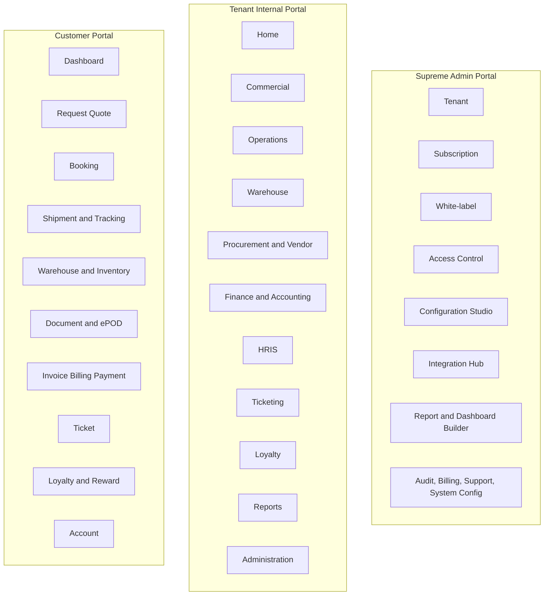

### 6.1 Global Navigation

| Portal | Navigation Group | Purpose | Primary Users |
|---|---|---|---|
| Supreme Admin Portal | Tenant | Tenant list, tenant detail, provisioning, status, environment, limits | Supreme Admin |
| Supreme Admin Portal | Subscription | Plan, module entitlement, feature flag, usage limit, trial, renewal, suspension | Supreme Admin |
| Supreme Admin Portal | Module & Feature | Module activation, feature availability, entitlement dependency | Supreme Admin |
| Supreme Admin Portal | White-label | Branding, domain, theme, login page, terminology, templates | Supreme Admin |
| Supreme Admin Portal | Access Control | User, role, permission, field access, impersonation policy | Supreme Admin |
| Supreme Admin Portal | Configuration Studio | Workflow, approval, form, field, status, numbering, notification, SLA, service builder | Supreme Admin |
| Supreme Admin Portal | Integration Hub | API client, webhook, event log, integration credentials, retry queue | Supreme Admin/Support |
| Supreme Admin Portal | Builder Studio | Report builder, dashboard builder, document template builder | Supreme Admin |
| Supreme Admin Portal | Audit & Security | Audit log, access log, support access, RLS test, security event | Supreme Admin/Security |
| Supreme Admin Portal | Billing & Support | Platform billing, support ticket, tenant health, incident | Supreme Admin/Support |
| Tenant Internal Portal | Home | Role-based dashboard, quick actions, pending approvals, exceptions | All internal users |
| Tenant Internal Portal | Commercial | Lead, CRM, account, contact, activity, opportunity, costing request, quotation, contract, pricing | Sales/Commercial |
| Tenant Internal Portal | Operations | Job order, shipment, TMS, dispatch, milestone, ePOD, document, claim, incident | Ops |
| Tenant Internal Portal | Warehouse | Warehouse, inbound, putaway, inventory, picking, packing, outbound, adjustment | Warehouse |
| Tenant Internal Portal | Procurement & Vendor | Vendor onboarding, assessment, rate, sourcing, PO, performance, invoice matching | Procurement |
| Tenant Internal Portal | Finance & Accounting | Billing readiness, invoice, AR/AP, payment, journal, GL, reconciliation, closing | Finance |
| Tenant Internal Portal | HRIS | Employee, recruitment, attendance, leave, payroll, KPI, training, ESS | HR/Employee |
| Tenant Internal Portal | Ticketing | Internal ticket, customer complaint, SLA, escalation, knowledge base | All internal users |
| Tenant Internal Portal | Loyalty | Program, tier, points, rewards, redemption, campaign, analytics | Commercial/CX |
| Tenant Internal Portal | Reports | Dashboard, operational report, finance report, export, scheduled report | Management |
| Tenant Internal Portal | Administration | Master data, user, role, permission, workflow, approval, form, service, integration | User Admin |
| Customer Portal | Dashboard | Shipment snapshot, booking, invoice, tickets, loyalty, alerts | Customer users |
| Customer Portal | Request Quote | Quote request, cargo detail, route/service, attachment, status | Customer Ops |
| Customer Portal | Booking | Booking creation, pickup/delivery, document, schedule | Customer Ops |
| Customer Portal | Shipment & Tracking | Shipment list, timeline, map link, milestone, exception | Customer Ops |
| Customer Portal | Warehouse & Inventory | Warehouse order, inventory, stock movement, fulfillment status | Customer Ops |
| Customer Portal | Document & ePOD | Shipment document, ePOD, invoice support document, signed URL | Customer Ops/Finance |
| Customer Portal | Invoice, Billing & Payment | Invoice, aging, payment status, receipt, dispute | Customer Finance |
| Customer Portal | Ticket | Complaint, claim, service request, feedback | Customer users |
| Customer Portal | Loyalty & Reward | Point balance, earning, redemption, reward catalogue | Customer Admin/Ops |
| Customer Portal | Account | Profile, site, contact, portal user management | Customer Admin |

### 6.2 Navigation Behavior

| Component | Desktop Behavior | Tablet Behavior | Mobile Behavior | Permission Behavior |
|---|---|---|---|---|
| Left sidebar | Expanded/collapsible module navigation with pinned favorites. | Collapsible icon + label. | Bottom nav or hamburger for portal-critical modules. | Only entitled modules and permitted menus appear. |
| Top bar | Global search, quick create, notification, approval queue, user menu, tenant/company selector. | Compact top bar. | Search, notification, account menu. | Company/branch/customer selector constrained by access scope. |
| Breadcrumb | Portal > module > page > record. | Visible if space allows. | Compact back link. | Never exposes inaccessible parent labels. |
| Global search | Search permitted records across modules. | Search modal. | Search page/modal. | Search result uses RLS and field masking. |
| Quick create | Lead, opportunity, quote, job, ticket, booking based on role. | Action menu. | Floating action button for allowed actions. | Hidden if user lacks create permission. |
| Notification center | Grouped by approval, exception, SLA, finance, system. | Same with filters. | Priority-first list. | Notification payload respects field-level security. |
| Tenant/company switcher | For Supreme/Admin/shared service users. | Compact selector. | Avoid switching unless necessary. | Only authorized tenant/company/branch displayed. |

### 6.3 Module Navigation

| Module | Primary Menu | Secondary Pages | Default View | Primary Action |
|---|---|---|---|---|
| Platform Foundation | Tenant, Subscription, Access, Configuration, Integration, Audit | White-label, API, Webhook, Builder, Billing, Support | Tenant health / configuration dashboard | Create tenant / publish config |
| Commercial | Lead, CRM, Account, Contact, Activity, Opportunity, Quotation, Contract | Sales plan, forecast, customer pricing, analytics | Pipeline and task queue | Create lead / request costing / create quote |
| Operations | Job Order, Shipment, Dispatch, Milestone, Tracking, ePOD, Document, Claim, Incident, Closing | Route/load planning, fleet/driver, multi-leg | Operations control tower | Plan shipment / update milestone |
| WMS | Warehouse, Inbound, Putaway, Inventory, Picking, Packing, Outbound, Adjustment, Cycle Count | Zone, rack, bin, SKU, cross-docking | Warehouse task dashboard | Receive / pick / adjust |
| Procurement & Vendor | Vendor, Onboarding, Assessment, Rate, RFQ, Sourcing, Capacity, Performance | PO, contract, vendor invoice matching | Vendor risk and rate validity | Request rate / approve vendor |
| Finance & Accounting | Billing Readiness, Invoice, AR, AP, Payment, Journal, GL, Reconciliation, Closing | Credit/debit note, budget, tax, profitability | Finance work queue | Generate invoice / post journal |
| HRIS | Employee, Recruitment, Attendance, Shift, Leave, Overtime, Payroll, Performance, Training, ESS | Position, grade, onboarding, offboarding | HR dashboard | Create employee / approve request |
| Ticketing | Ticket Queue, Internal, Customer, Helpdesk, SLA, Escalation, Knowledge Base | Categories, priority, linked transaction | SLA queue | Create/assign/escalate ticket |
| Customer Portal | Dashboard, Request Quote, Booking, Tracking, Warehouse, Document/ePOD, Invoice, Ticket, Loyalty, Account | User management, profile, reward | Customer dashboard | Book shipment / open ticket |
| Loyalty | Program, Tier, Point, Cashback, Reward, Redemption, Referral, Campaign, Analytics | Fraud prevention, expiration, liability | Program performance | Create campaign / approve redemption |

### 6.4 Page Hierarchy

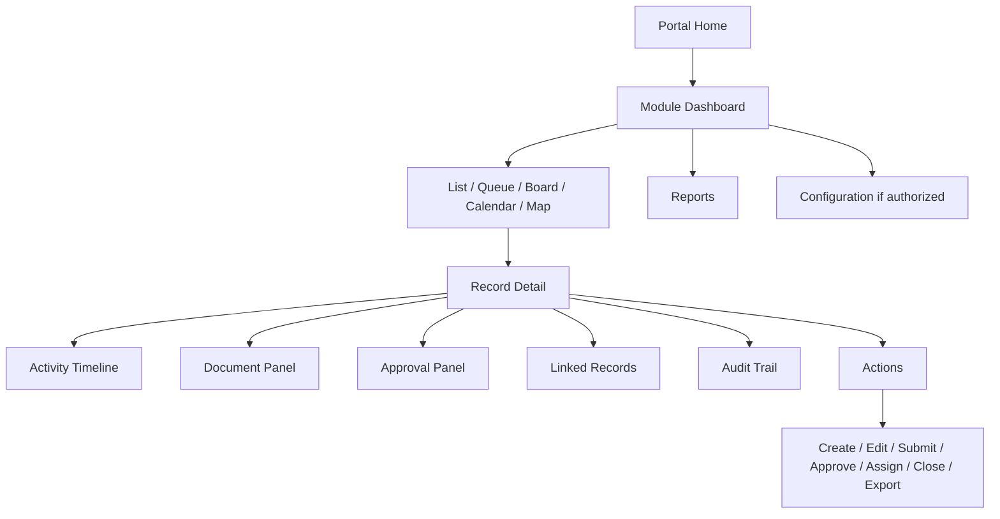

---

## 7. User Flows

### 7.1 Platform Setup Flow: Tenant Onboarding, Module Activation, Role, Permission, Workflow, Approval

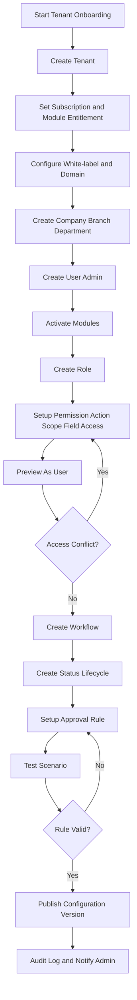

### 7.2 Commercial Flow: Lead Creation, Qualification, Opportunity, Costing, Vendor Comparison, Quotation, Approval, Customer Acceptance

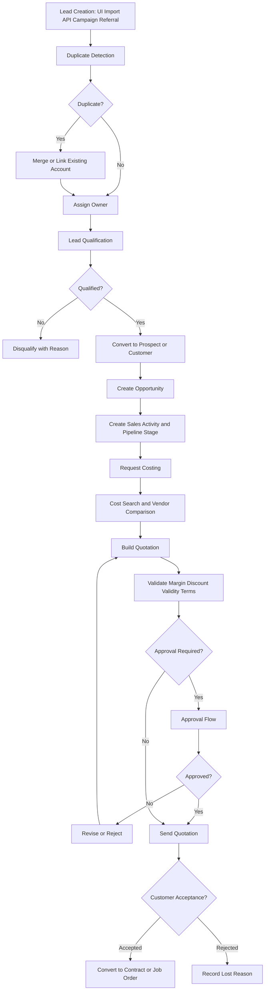

### 7.3 Operations Flow: Job Order, Shipment Planning, Dispatch, Milestone, Tracking, ePOD, Closing, Invoice, Payment

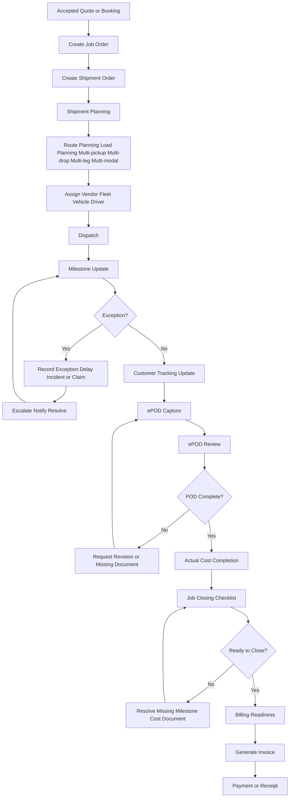

### 7.4 Vendor Flow: Registration, Qualification, Rate, Sourcing, Vendor Invoice

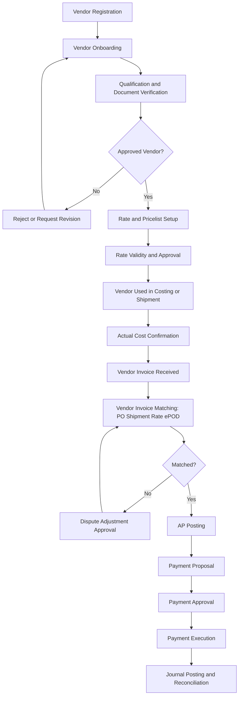

### 7.5 Warehouse Flow: Inbound, Putaway, Inventory, Picking, Packing, Outbound

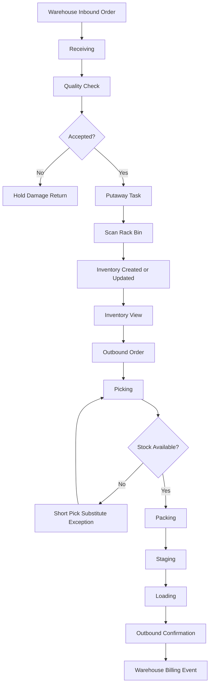

### 7.6 HRIS Flow: Recruitment, Attendance, Leave, Payroll

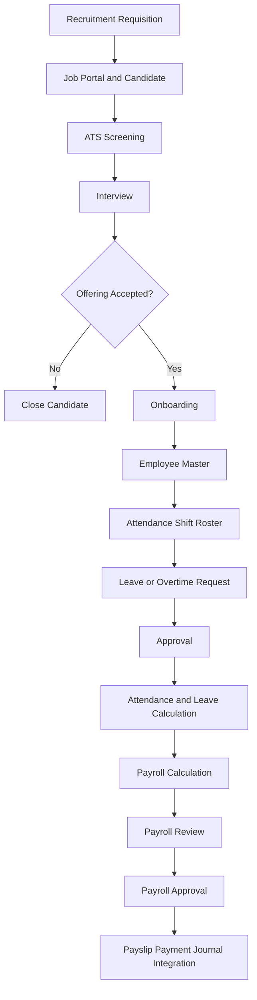

### 7.7 Ticket and Loyalty Flow: Ticket, Escalation, Loyalty Earning, Reward Redemption

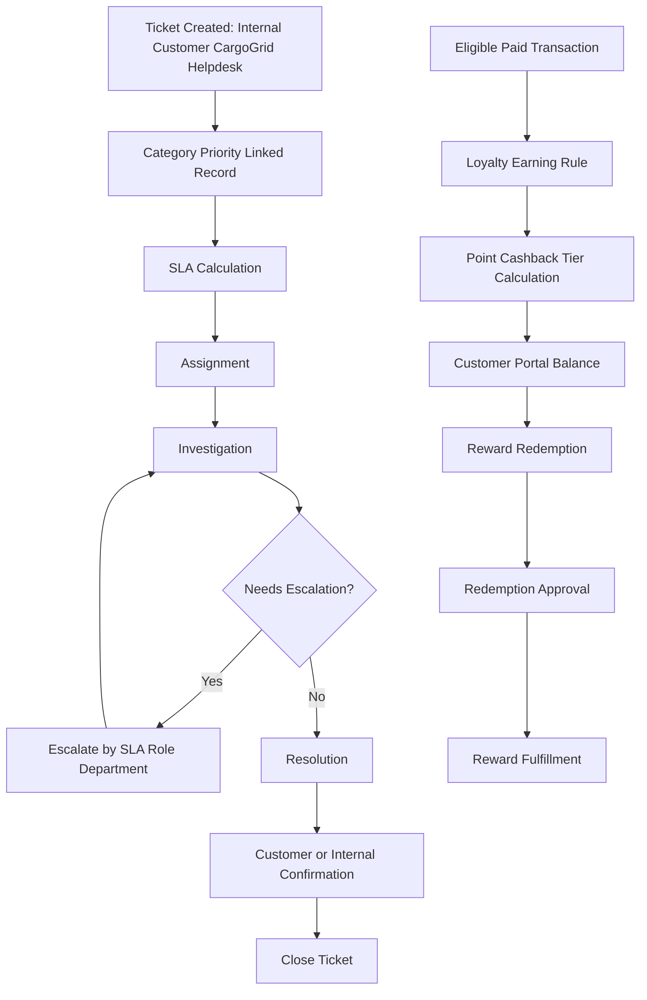

---

## 8. Screen Inventory

Screen inventory ini baseline untuk product/design/frontend/QA. Screen boleh bertambah, tapi behaviour dasar tidak boleh dilanggar: permission-aware, server-side table, audit-ready, responsive, dan state-aware.

| Page ID | Page name | Module | User | Objective | Primary action | Secondary action | Data shown | Filters | Permissions | Empty state | Error state | Loading state | Desktop behavior | Mobile behavior |
|---|---|---|---|---|---|---|---|---|---|---|---|---|---|---|
| SUP-TNT-001 | Tenant List | Supreme Admin | Supreme Admin | Find/manage tenants | Create tenant | Suspend/export | Tenant name, status, plan, usage, health | Status, plan, region, created date | View/manage tenant | No tenant found | Provisioning error | Skeleton table | Full server table with side detail | Card list with search |
| SUP-TNT-002 | Tenant Detail | Supreme Admin | Supreme Admin/Support | Inspect tenant health and config | Edit config | Impersonate/support access | Profile, modules, users, audit, usage | Module, date range | View tenant; elevated for edit | Tenant data missing | Access denied/config conflict | Section skeleton | Tabbed detail | Accordion sections |
| SUP-SUB-001 | Subscription Setup | Supreme Admin | Supreme Admin | Configure entitlement | Activate module | Set limits/trial | Plan, module, feature, quota, effective date | Module, package, status | Configure subscription | No module selected | Limit conflict | Step loading | Matrix editor | Stacked cards |
| SUP-WLB-001 | White-label Studio | Supreme Admin | Supreme Admin/User Admin delegated | Configure branding | Publish theme | Preview/rollback | Logo, color, domain, terminology, template | Component, status | Configure white-label | No branding set | Domain verification failed | Preview shimmer | Split editor-preview | Preview-first mobile |
| SUP-CFG-001 | Workflow Builder | Configuration | Supreme Admin/User Admin | Create process flow | Publish workflow | Version/rollback | Steps, transition, condition, assignee | Entity, status, version | Configure workflow | No workflow | Invalid transition | Canvas loading | Canvas + property panel | Read-only preview |
| SUP-CFG-002 | Approval Builder | Configuration | Supreme Admin/User Admin | Create approval logic | Publish approval | Test scenario | Approval steps, threshold, actor, SLA | Entity, rule, amount | Configure approval | No approval rule | Circular rule | Rule skeleton | Matrix + flow preview | Stacked rule cards |
| SUP-CFG-003 | Role & Permission Builder | Access Control | Supreme Admin/User Admin | Set action/scope/field permission | Save role | Preview as user | Actions, scope, fields, modules | Module, action, scope | Configure role | No role | Conflict/excessive privilege | Matrix skeleton | Wide permission matrix | Grouped accordion |
| TNT-HOM-001 | Internal Home Dashboard | Tenant Internal | All internal users | Show role-based work queue | Open pending task | Customize view | KPIs, approvals, exceptions, tasks | Date, branch, module | View own scope | No tasks | Widget load failed | Widget skeleton | Grid widgets | Single-column cards |
| COM-LEAD-001 | Lead List | Commercial | Sales/Manager | Manage leads | Create lead | Import/export/assign | Lead, source, score, owner, aging | Source, owner, status, score | View/create/edit lead | No leads | Import error | Server table skeleton | Server paginated table | Card list |
| COM-LEAD-002 | Lead Detail | Commercial | Sales | Qualify lead | Convert lead | Disqualify/merge | Lead profile, activities, duplicate signal | Activity type/date | Own/team lead access | Lead not found | Duplicate merge conflict | Detail skeleton | 2-column detail + activity | Tabs |
| COM-OPP-001 | Opportunity Board | Commercial | Sales/Manager | Manage pipeline | Move stage | Create quote request | Opportunity, value, probability, next action | Stage, owner, service | View pipeline by scope | No opportunity | Invalid stage | Kanban skeleton | Kanban/table toggle | Compact stage list |
| COM-CST-001 | Request Costing | Commercial/Procurement | Sales/Procurement | Request rate/cost | Submit request | Clone/cancel | Route, cargo, service, SLA, vendor options | Service, route, status | Create costing request | No request | Missing cargo dimension | Form skeleton | Progressive form | Step form |
| COM-QTN-001 | Quotation Builder | Quotation | Sales/Pricing/Manager | Build customer quotation | Submit approval | Preview/send/version | Cost, selling, margin, terms, validity | Customer, service, status | Create/edit quote; view margin based permission | No quote line | Margin rule failed | Line skeleton | Spreadsheet-like server lines | Section cards |
| OPS-JOB-001 | Job Order List | Operations | Ops/Sales Support | Manage accepted jobs | Create job from quote | Bulk assign/export | Job, customer, service, status, SLA | Status, branch, service | View job scope | No jobs | Conversion failed | Server table skeleton | Table with quick status | Card list |
| OPS-SHP-001 | Shipment Detail | Operations | Ops/Dispatcher | Execute shipment | Update milestone | Assign vendor/fleet | Shipment, leg, cargo, route, cost, document | Leg, status | View/edit shipment scope | No shipment | Unauthorized update | Timeline skeleton | Timeline + side panel | Timeline first |
| OPS-DSP-001 | Dispatch Board | TMS | Dispatcher/Ops Manager | Assign fleet/driver/vendor | Dispatch | Reassign/hold | Trips, vehicle, driver, route, capacity | Date, branch, fleet | Assign shipment | No shipments to dispatch | Capacity conflict | Board skeleton | Board + map/list | List cards |
| OPS-POD-001 | ePOD Capture/Review | ePOD | Driver/Ops/Customer | Capture/review POD | Submit ePOD | Reject/request revision | Photo, signature, receiver, geo, timestamp | Shipment, status | Submit/review ePOD | No POD | File upload failed | Upload progress | Form + preview | Camera-first form |
| OPS-CLS-001 | Job Closing | Operations/Finance | Ops Manager/Finance | Close job after validation | Close job | Reopen with approval | Milestone, POD, actual cost, invoice readiness | Status, exception | Close/reopen | No closing checklist | Missing mandatory doc | Checklist skeleton | Checklist + exceptions | Accordion checklist |
| WMS-INB-001 | Warehouse Inbound | WMS | Warehouse Manager/Staff | Receive goods | Confirm receiving | QC/putaway | ASN, SKU, qty, lot, expiry | Warehouse, customer, status | Receive inbound | No inbound | Qty mismatch | Task skeleton | Task table | Scan-first tasks |
| WMS-INV-001 | Inventory View | WMS | Warehouse/Customer Portal | View stock | Adjust/cycle count | Export | SKU, qty, location, owner, aging | Warehouse, SKU, owner | View inventory scope | No stock | Sync error | Server table skeleton | Table + location map | Card list |
| WMS-OUT-001 | Picking & Outbound | WMS | Warehouse Staff/Manager | Pick, pack, ship | Confirm pick/pack | Substitute/short pick | Order, pick list, bin, qty, package | Status, wave, picker | Task access | No pick task | Stock shortage | Task skeleton | Pick list + scan | Scan-first |
| PRC-VND-001 | Vendor Profile | Vendor | Procurement | Manage vendor lifecycle | Approve vendor | Suspend/blacklist | Legal, service, coverage, compliance, contacts | Status, service, validity | View/edit vendor | No vendor | Compliance expired | Profile skeleton | Tabs + scorecard | Stacked detail |
| PRC-RTE-001 | Vendor Rate Card | Procurement | Procurement/Sales Pricing | Manage vendor rates | Add rate | Import/compare | Route, service, fleet, price, validity, surcharge | Route, service, validity | View cost permission | No rate | Expired/duplicate rate | Server table skeleton | Wide rate grid | Grouped cards |
| FIN-BIL-001 | Billing Readiness Queue | Finance | Finance/Ops | Identify billable jobs | Generate invoice | Request missing doc | Job, POD, doc, cost, customer, amount | Customer, status, branch | View finance scope | No ready jobs | Locked period | Queue skeleton | Queue table + checklist | Card queue |
| FIN-INV-001 | Invoice Detail | Finance | Finance/Customer Finance | Create/manage invoice | Post/send invoice | Credit note/dispute | Invoice lines, tax, AR, documents | Customer, status | View/create/post invoice | No invoice lines | Tax mismatch | Detail skeleton | Invoice editor + source links | Section cards |
| FIN-PAY-001 | Payment Allocation | Finance | Accounting Staff | Allocate receipts/payments | Allocate | Reconcile | Bank, receipt, invoice, allocation | Bank, date, customer | Finance permission | No open item | Allocation imbalance | Allocation skeleton | Split screen | Step view |
| FIN-GL-001 | Journal Entry | Accounting | Accounting/Finance Manager | Create/post journal | Post journal | Reverse | COA, debit, credit, source, period | Period, source | Create/post GL | No journal | Debit/credit imbalance | Line skeleton | Journal grid | Read-only mobile |
| HRS-EMP-001 | Employee Profile | HRIS | HR/Employee/Manager | Manage employee data | Update profile | Request change | Personal, employment, org, document | Department, status | HR scope or own data | No employee | Sensitive access denied | Profile skeleton | Tabs with masking | Stacked read-only |
| HRS-ATT-001 | Attendance | HRIS | Employee/HR | Record attendance | Clock in/out | Correct attendance | Time, location, shift, status | Date, shift, employee | Own/HR access | No attendance | Invalid geo/time | Status loading | Calendar/table | Mobile action |
| HRS-LVE-001 | Leave Request | HRIS | Employee/Manager/HR | Request and approve leave | Submit request | Approve/reject | Leave type, balance, date, approver | Status, date | Own/team/HR | No leave request | Insufficient balance | Form loading | Request table + calendar | Step form |
| TKT-LST-001 | Ticket List | Ticketing | Internal/Customer/Support | Manage tickets | Create ticket | Assign/escalate | Priority, SLA, owner, linked record | Priority, category, SLA | Ticket scope | No ticket | SLA config missing | Table skeleton | Queue table | Card queue |
| TKT-DET-001 | Ticket Detail | Ticketing | Internal/Customer/Support | Resolve issue | Reply/resolve | Escalate/link record | Conversation, SLA, attachment, linked object | Status, assignee | View ticket scope | No conversation | Attachment failed | Thread skeleton | Thread + side metadata | Thread first |
| CPT-TRK-001 | Customer Tracking | Customer Portal | Customer Ops | Track shipment | Open shipment | Download ePOD | Shipment, status, timeline, ETA, document | Status, date, consignee | Customer scope | No shipment | No access | Timeline skeleton | Timeline + filters | Timeline cards |
| CPT-INV-001 | Customer Invoice | Customer Portal | Customer Finance | View billing/payment | Download invoice | Raise dispute | Invoice, shipment link, payment, aging | Status, date | Customer finance scope | No invoice | File unavailable | Table skeleton | Table + download package | Card list |
| LYL-ACC-001 | Loyalty Account | Loyalty | Customer/Admin | View/manage loyalty | Redeem reward | View earning | Point, tier, expiry, reward | Tier, period | Eligible customer scope | No point | Rule conflict | Widget loading | Point ledger + catalogue | Point summary |

---

## 9. Form Behavior

| Behavior | Design Requirement | Data/Access Rule | QA Acceptance |
|---|---|---|---|
| Progressive disclosure | Form kompleks dibagi section, step, atau conditional block. | Field visibility mengikuti form config, service config, role, and status. | User tidak melihat field yang tidak entitled; mandatory field muncul sesuai condition. |
| Autosave draft | Record draft bisa autosave untuk long form seperti quotation, shipment, invoice, onboarding. | Autosave hanya untuk allowed draft state; audit mencatat draft update jika material. | Refresh page tidak menghilangkan draft; conflict handled. |
| Duplicate detection | Customer, vendor, lead, contact, rate, shipment reference harus dicek duplicate. | Duplicate rule configurable per entity dan tenant. | System memberi candidate duplicate sebelum save/convert. |
| Inline validation | Data type, mandatory, uniqueness, date consistency, currency, status, attachment checked early. | Validation server-side tetap authoritative. | Invalid data tidak tersimpan walaupun client validation bypassed. |
| Field help and examples | Complex fields diberi helper text dan tooltip. | Terminology mengikuti tenant label tetapi canonical field tetap sama. | User memahami chargeable weight, payment term, SLA, service rule. |
| Conditional required | Required field bisa berubah karena service, mode, status, role, or localization. | Rule version disimpan saat transaksi. | Shipment air freight meminta airport; sea freight meminta POL/POD jika configured. |
| Reference picker | Customer/vendor/location/service picker memakai server search, recent item, and filtered scope. | Picker selalu RLS-aware. | Customer A tidak bisa memilih data Customer B. |
| Bulk edit | Bulk action hanya untuk safe fields/status dan harus preview affected records. | Permission and lifecycle checked per record. | Partial failure menghasilkan result report. |
| Attachment upload | Upload async dengan progress, file type/size validation, virus scan future-ready, signed URL. | Storage path tenant/record-scoped. | File bisa diakses hanya oleh permitted user. |
| Reason required | Override, delete, reopen, reject, support access, sensitive edit wajib reason. | Reason masuk audit trail. | Action tanpa reason ditolak. |

---

## 10. Table Behavior

| Behavior | Design Requirement | Performance Requirement | Security Requirement |
|---|---|---|---|
| Server-side pagination | Default page size 25/50/100; no full dataset load. | Use limit/cursor/offset sesuai volume; high-volume pakai cursor. | Query selalu tenant-aware dan scope-aware. |
| Server-side filter/sort | Filter, sort, search dikirim ke server dengan whitelist field. | Index untuk common filters; query plan review. | Tidak expose hidden/sensitive field as filter jika user tidak punya access. |
| Saved filter | User dapat simpan private view; manager/admin dapat share role/team view. | Stored as metadata per tenant/user/role. | Shared view tidak memberi permission tambahan. |
| Configurable column | Kolom bisa show/hide/reorder; default per role. | Selective column query berdasarkan visible columns. | Kolom sensitive disembunyikan/masked tanpa permission. |
| Bulk action | Select all current page atau matching filter with confirmation. | Bulk job async untuk large dataset. | Action permission checked per record. |
| Export | Export mengikuti filter dan permission; large export async. | Background job, file expiry, rate limit. | Export audit wajib; sensitive fields omitted/masked. |
| Inline update | Hanya untuk low-risk field/status dan permitted lifecycle. | Optimistic update hanya jika safe; otherwise pessimistic. | Audit trail tetap tercatat. |
| Pinned exception | Rows with exception/SLA breach can be pinned/highlighted. | Use indexed status/exception fields. | User hanya melihat exception in scope. |
| Row detail drawer | Open detail without leaving list. | Fetch detail selective by ID. | Drawer content RLS and field-level filtered. |
| Keyboard navigation | Table support tab, arrow, enter, quick command. | No heavy virtual table unless needed and tested. | Focus does not bypass permission. |

---

## 11. Dashboard Behavior

| Dashboard Type | Default Users | Widgets | Data Strategy | Interaction |
|---|---|---|---|---|
| Supreme Admin SaaS Dashboard | Supreme Admin/Support | Tenant health, active users, modules, usage, error rate, support, billing, security events | Pre-aggregated SaaS metrics; refresh interval configured | Drill to tenant/support/audit with elevated guard. |
| Executive Dashboard | Director/GM | Revenue, margin, shipment SLA, AR aging, pipeline, exceptions, vendor risk | Materialized/precomputed summary for heavy KPIs | Drill-down by company, branch, service, customer. |
| Commercial Dashboard | Sales Manager/Sales | Lead aging, activity, pipeline, quote SLA, win-loss, forecast | Aggregated by owner/team/stage | Open lead/opportunity/quote. |
| Operations Control Tower | Ops Manager/Dispatcher | Shipment status, milestone delay, exception, dispatch, ePOD pending | Near-real-time only for active shipment; no global realtime | Open shipment/dispatch/exception. |
| Warehouse Dashboard | Warehouse Manager | Inbound/outbound, inventory accuracy, pending tasks, aging, stock exception | Pre-aggregated plus task queue | Open warehouse order/task. |
| Procurement Dashboard | Procurement Manager | Rate validity, vendor compliance, response time, acceptance, cost competitiveness | Summary by vendor/service/lane | Open vendor/rate/RFQ. |
| Finance Dashboard | Finance Manager | Billing readiness, invoice, AR/AP aging, cash, period close, profitability | Finance aggregation with period lock awareness | Open invoice/payment/journal. |
| HR Dashboard | HR Manager | Headcount, attendance, leave, payroll run, KPI, recruitment | HR scoped summary; sensitive access controlled | Open employee/request/payroll. |
| Ticket Dashboard | Service Manager/Support | SLA, priority, queue, escalation, reopen, customer complaint | Pre-aggregated SLA and queue | Open ticket/escalation. |
| Customer Dashboard | Customer Users | Shipment, booking, document/ePOD, invoice, ticket, loyalty | Customer-scoped summary | Open tracking/invoice/ticket/reward. |

---

## 12. Responsive Behavior

| Context | Desktop | Tablet | Mobile |
|---|---|---|---|
| Internal ERP list | Wide table, split drawer, keyboard shortcuts. | Compact table, hidden columns, drawer. | Card list with key fields and primary action. |
| Complex form | Two-column layout, sticky summary/action bar. | Single/two-column adaptive. | Step-based form; only critical fields per step. |
| Configuration builder | Canvas/matrix + property panel. | Read/preview; limited edit if usable. | Mostly read/preview; editing restricted unless simple. |
| Dispatch | Board/table/map toggle. | Board + compact map. | Task list; quick assign/update. |
| Warehouse task | Table/task queue with scan support. | Touch task cards. | Scan-first, large buttons, minimal fields. |
| ePOD | Review panel on desktop. | Camera/upload + preview. | Camera-first capture, offline-capable future enhancement. |
| Dashboard | Multi-widget grid. | Two-column widgets. | Single-column priority widgets. |
| Customer portal | Dashboard + table/detail. | Responsive cards/table. | Mobile-first tracking and document actions. |

---

## 13. Accessibility

| Area | Requirement | Acceptance Criteria |
|---|---|---|
| Keyboard navigation | All core actions reachable by keyboard. | User can move through form, table, modal, approval action without mouse. |
| Focus state | Visible focus indicator on actionable elements. | Focus not lost after validation error or modal close. |
| Labels | All inputs have programmatic labels. | Screen reader can identify field label and error. |
| Error message | Errors specific, close to field, and summarized at top for long form. | User can jump to first error. |
| Contrast | Text, buttons, status badges meet readable contrast. | White-label theme validated before publish. |
| Status not color-only | Status uses label + icon/text, not only color. | Color-blind user can distinguish status/exception. |
| Responsive zoom | Layout remains usable at common browser zoom. | No hidden primary action at 125–150 percent zoom. |
| Motion | Avoid unnecessary motion; loading state clear. | No critical information depends on animation. |
| Language | UX copy clear in Bahasa Indonesia/English technical terms based on localization. | No ambiguous error without next step. |

---

## 14. UX Writing

| UX Text Type | Rule | Example |
|---|---|---|
| Action label | Use verb + object, not vague CTA. | `Submit Quotation`, `Approve Vendor`, `Close Job`, `Generate Invoice`. |
| Error | Explain what failed and what user can do. | `Quotation cannot be submitted because margin is below approved threshold. Request approval or revise selling price.` |
| Empty state | Explain why empty and next action if permitted. | `No shipment matches this filter. Change filter or create shipment from accepted job order.` |
| Approval comment | Ask for decision reason on reject/override. | `Add rejection reason so the requester knows what to revise.` |
| Permission denial | Do not expose hidden data. | `You do not have access to view cost information for this shipment.` |
| Config warning | Show impact before publish. | `This workflow is used by 128 active shipments. Publishing changes will apply to new records only unless effective date is changed.` |
| Financial lock | Use firm language. | `This journal is posted and cannot be edited. Create reversal journal if correction is required.` |
| Customer portal | Use customer-friendly operational terms. | `Your shipment is in transit. ePOD will be available after delivery confirmation.` |

---

## 15. Notification States, Empty States, Error States, Loading States

| State | Expected UX | Trigger | Access/Security Note |
|---|---|---|---|
| Empty state | Show explanation, recommended next action, import/create shortcut if permitted. | No data in scope; filter too narrow; module not configured. | Do not show create action if user lacks permission. |
| Error state | Show human-readable message, correlation ID, retry if safe, support link. | Validation, access denied, integration failed, server error. | Never leak tenant data or SQL details. |
| Loading state | Use skeleton for known layout, progress for upload/import/export, optimistic only for safe low-risk actions. | Data fetch, background job, export, document generation. | Avoid blocking entire page if only widget loads. |
| Notification state | Separate in-app, email, webhook, customer-facing and admin alerts. | Approval, exception, SLA breach, status update, billing readiness. | Respect permission and notification template scope. |
| Approval pending state | Show pending approver, SLA, escalation, current step, comment trail. | Submitted record waiting approval. | Do not allow mutation except revision/cancel if permitted. |
| Locked state | Show reason: posted journal, closed job, period lock, archived record. | Financial posting, job closing, period close. | Allow governed reversal/reopen only. |

---

## 16. Approval UX

Approval UX harus membuat authority dan bottleneck terlihat. Approval bukan sekadar tombol approve/reject.

| Component | Requirement | Notes |
|---|---|---|
| Approval timeline | Show all steps, current step, completed step, pending approver, SLA, escalation path. | Sensitive value like margin hidden if user lacks permission. |
| Decision panel | Approve, reject, request revision, delegate, escalate sesuai permission. | Reject/revision requires comment. |
| Threshold explanation | Show rule that triggered approval. | Example: margin below threshold, discount above limit, cost overrun. |
| Scenario preview | Approval Builder must allow testing sample transaction. | Admin sees which approver will be selected. |
| Delegation | Approver can delegate if rule allows and delegatee eligible. | Delegation logged. |
| Escalation | SLA breach triggers notification/escalation. | Escalation rule version logged. |
| Resubmission | Rejected/revision record can be revised and resubmitted. | Old decision remains in audit trail. |
| Parallel approval | Show pending branches and completion requirement. | All/any/quorum configurable if supported. |

---

## 17. Configuration UX

Configuration UX adalah salah satu selling point CargoGrid. Ini harus dibuat seperti control center, bukan halaman admin seadanya.

| Builder | UX Requirement | State/Versioning | Key Edge Case |
|---|---|---|---|
| Role Builder | Create role, clone role, hierarchy mapping, inherited permission, role conflict warning, preview as user | Role draft, publish, deprecate, effective date | Role name duplicate, circular hierarchy, excessive privilege |
| Permission Builder | Action matrix, scope selector, field-level policy, module entitlement guard, bulk permission template | Permission draft/publish, role assignment | Contradictory scope, unauthorized grant, field leak |
| Form Builder | Section, layout, field order, mandatory rule, conditional visibility, validation rule, help text | Draft form, preview, publish, rollback | Breaking required field on active workflow |
| Field Builder | Field type, label, data source, default, validation, sensitivity, index recommendation | Draft field, active, deprecated | Changing type with existing data |
| Workflow Builder | State, transition, guard condition, actor, SLA, linked notification, downstream action | Draft, test, publish, version | Dead-end state, missing transition, invalid condition |
| Approval Builder | Sequential/parallel/conditional, amount/margin threshold, delegation, escalation, resubmission | Draft, test scenario, publish | Circular approval, approver unavailable, threshold overlap |
| Status Builder | Canonical state mapping, tenant label, color, allowed transition, visibility by role | Draft, active, archived | Tenant label hides canonical reporting state |
| Notification Builder | Trigger, recipient, channel, template, frequency, escalation, quiet hour | Draft, active, paused | Notification loop, sensitive data in email |
| Numbering Builder | Prefix, sequence, reset period, company/branch/service variable, collision check | Draft, active, locked sequence | Duplicate number under concurrency |
| Dashboard Builder | Widget catalogue, data source, filter, permission, refresh interval, pre-aggregation | Draft, published per role | Heavy query widget not pre-aggregated |
| Report Builder | Dataset, fields, filters, grouping, scheduled export, permission, audit | Draft, published | Export of sensitive data without permission |
| Service Builder | Mode, category, lane, SLA, milestone, weight rule, cost/revenue components, doc requirements | Draft, active, retired | Service used by active quotation/shipment |
| Custom Terminology | Menu label, entity label, status label, glossary, language pack | Draft, active | Terminology changes canonical meaning |
| Document Template | Quotation, invoice, ePOD, shipment doc, vendor doc, email template | Draft, preview, publish | Unsafe template variable or missing mandatory legal field |
| SLA Builder | Calendar, business hours, priority, response/resolution target, escalation | Draft, active | No calendar for timezone |
| Subscription Module Setup | Module activation, feature flag, limit, trial, grace, suspension | Scheduled activation | Tenant loses active transaction access |

### 17.1 Configuration Publish Pattern

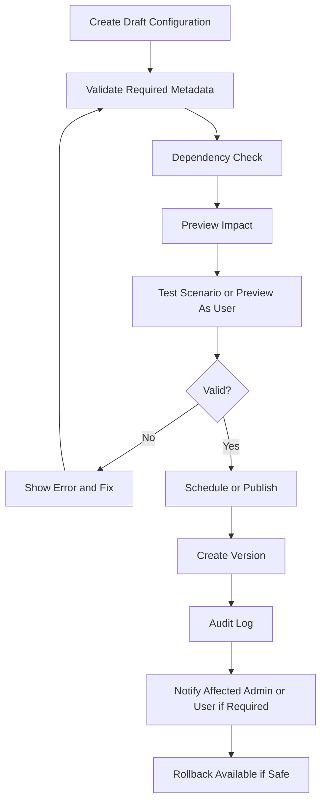

---

## 18. White-label UX

| Area | Requirement | Guardrail |
|---|---|---|
| Branding | Logo, favicon, primary color, secondary color, typography token, login visual. | Theme contrast validation wajib sebelum publish. |
| Domain | Custom domain setup, verification status, SSL/certificate state. | Domain ownership verification and audit required. |
| Terminology | Entity/menu/status labels configurable per tenant/company/branch/role where allowed. | Canonical entity/status remains unchanged for reporting and integration. |
| Template | Email, quotation, invoice, ePOD, document templates with variable picker. | Template variables must be whitelisted; no arbitrary code. |
| Customer portal | Customer-facing portal uses tenant branding and terminology. | Customer access scope cannot be weakened by branding override. |
| Preview | Preview as role/user and preview as customer before publish. | Preview must never expose real data outside scope. |
| Fallback | If branding asset invalid, fallback to safe default theme. | Never break login due to missing logo/theme. |

---

## 19. Master Data Catalogue

| Master Data | Domain | Purpose | Owner | Used By | Access / Scope Note |
|---|---|---|---|---|---|
| Tenant | Platform | Tenant profile, environment, status, limits, subscription root | Supreme Admin | All modules | Tenant scope; immutable tenant_id |
| Company | Organization | Legal company within tenant | User Admin | Finance, operations, reporting | Company-level access and consolidation |
| Branch | Organization | Operational branch/site/office | User Admin | Ops, sales, warehouse, finance | Branch-level scope |
| Department | Organization | Functional unit | User Admin/HR | Approval, assignment, reporting | Department scope |
| Business unit | Organization | Commercial/operational business unit | User Admin | P&L, service, permission | Business-unit scope |
| User | Identity | Login identity internal/customer/support | User Admin/Supreme Admin | All access | Auth/RBAC/RLS |
| Role | Identity | Permission grouping | User Admin/Supreme Admin | All modules | Role hierarchy and scope |
| Permission | Identity | Action/scope/field policy | Supreme Admin/User Admin | All modules | Action-level and field-level |
| Customer | Commercial master | Legal, tax, billing, service, credit, portal | Sales/Finance | Quote, job, invoice, portal | Customer scope |
| Customer contact | Commercial master | PIC, email, phone, role, notification preference | Sales/Customer Admin | CRM, shipment, portal | Customer scope |
| Customer site | Commercial master | Pickup/delivery/billing/warehouse site | Sales/Ops/Portal | Booking, shipment, warehouse | Site-level scope |
| Vendor | Procurement master | Vendor legal, service, coverage, compliance | Procurement | Costing, shipment, AP | Vendor scope |
| Vendor contact | Procurement master | PIC vendor by service/area | Procurement | RFQ, dispatch, escalation | Vendor scope |
| Lead | Commercial transaction | Potential customer/source/campaign | Sales/Marketing | CRM conversion | Owner/team scope |
| Opportunity | Commercial transaction | Potential revenue, stage, probability | Sales | Costing/quotation | Owner/team/company scope |
| Service | Product/service config | Shipment mode, SLA, milestones, cost/revenue component | Supreme/User Admin | Quote, shipment, billing | Tenant/company override |
| Shipment mode | Operations config | Land/air/sea/rail/courier/project/customs | Supreme/User Admin | Service, shipment | Config scope |
| Route | Operations master | Origin-destination, zone, lane, transit time | Ops/Procurement | Rate, shipment planning | Tenant scope |
| Location | Geo master | Country, province, city, district, address type | Admin/Ops | Route, pickup, delivery | Tenant/global default |
| Port | Geo master | Seaport code/name | Admin | Sea freight | Global default with tenant override |
| Airport | Geo master | Airport code/name | Admin | Air freight | Global default with tenant override |
| Warehouse | Warehouse master | Facility, zone, area, rack, bin | Warehouse Admin | WMS, inventory, billing | Warehouse scope |
| Zone | Warehouse master | Area grouping | Warehouse Manager | Putaway/picking | Warehouse scope |
| Rack | Warehouse master | Rack location | Warehouse Manager | Inventory | Warehouse scope |
| Bin | Warehouse master | Final bin/location | Warehouse Staff/Manager | Scan, inventory | Warehouse scope |
| Fleet | Fleet master | Fleet category/type/capacity | Ops Admin | Dispatch/load planning | Branch/service scope |
| Vehicle | Fleet master | Owned/leased vehicle | Ops Admin | Dispatch/trip | Branch/fleet scope |
| Driver | Fleet/employee/vendor master | Driver internal/vendor | Ops/HR/Procurement | Dispatch/milestone | Branch/vendor scope |
| Commodity | Operations master | Commodity class, risk, handling | Ops/Admin | Shipment/customs/cost | Tenant scope |
| Package | Operations master | Package type/dimension default | Ops/Admin | Shipment/WMS | Tenant scope |
| UOM | Common master | Unit of measurement | Admin | Shipment/WMS/finance | Global/tenant |
| Currency | Finance master | Currency and exchange rule | Finance Admin | Quote, invoice, journal | Tenant/company |
| Tax | Finance master | VAT/WHT/local tax rule | Finance Admin | Invoice/journal | Tenant/company/localization |
| Cost component | Finance/ops config | Cost categories | Finance/Ops | Costing, actual cost, AP | Tenant/company |
| Revenue component | Finance/ops config | Revenue categories | Finance | Quotation, invoice, revenue recognition | Tenant/company |
| Payment term | Finance master | TOP, due date formula | Finance Admin | Customer/vendor invoice | Tenant/company |
| Chart of account | Accounting master | COA hierarchy and posting rule | Accounting | Journal/report | Tenant/company |
| Employee | HR master | Employment and personal record | HR | Approval, attendance, payroll | Company/department/private |
| Ticket | Service transaction | Issue/request/complaint | Service owner | Customer service/support | Linked record scope |
| Loyalty program | Loyalty config | Tier/point/reward/campaign rules | CX/Admin | Portal/transaction | Tenant/customer |

---

## 20. Data Dictionary

### 20.1 Dictionary Standard

| Attribute | Meaning |
|---|---|
| Entity | Business object/table group. |
| Field name | Canonical technical field name. |
| Display label | Default UI label; tenant may override label where safe. |
| Definition | Business definition. |
| Data type / Length | Recommended logical type and length. |
| Required / Default / Validation | Input and persistence rules. |
| Unique | Whether unique globally or per tenant/company. |
| Sensitive | Whether field needs masking, restricted view/export, or special audit. |
| Editable | Who/when can edit; often lifecycle-based. |
| Source | System/user/import/API/config origin. |
| Tenant scope | Tenant/company/branch/customer/user scope. |
| Audit requirement | What changes/access must be logged. |
| Index recommendation | Initial index guidance; final index validated with query plan. |

### 20.2 Detailed Data Dictionary — Customer

| Field name | Display label | Definition | Data type | Required | Validation | Sensitive | Editable | Source | Tenant scope | Audit requirement | Index recommendation |
|---|---|---|---|---|---|---|---|---|---|---|---|
| customer_id | Customer ID | Primary key customer internal | UUID | Yes | Valid UUID | No | No | System | Tenant | Create/update/status audit | PK; tenant_id+customer_code |
| tenant_id | Tenant | Tenant owner data | UUID | Yes | Must match auth tenant | No | No | System/Auth | Tenant | Access log | tenant_id composite |
| customer_code | Customer Code | Kode customer tenant | Text(50) | Yes | Unique per tenant | No | Conditional | Numbering builder | Tenant | Change before/after | tenant_id+customer_code unique |
| legal_name | Legal Name | Nama legal entity customer | Text(255) | Yes | Not empty; duplicate fuzzy check | No | Yes | User/API/import | Tenant/company | Before/after + approver if approved | trgm/tenant_id |
| tax_id | Tax ID / NPWP | Identitas pajak | Text(40) | Conditional | Format per localization | Yes | Permission-based | User/import | Tenant/company | Sensitive field access audit | hashed optional |
| billing_name | Billing Name | Nama invoice | Text(255) | Conditional | Required if invoice enabled | Financial | Yes | User | Tenant/company | Before/after | tenant_id+billing_name |
| billing_address_id | Billing Address | Alamat penagihan default | UUID | Conditional | Must reference customer address | No | Yes | User | Tenant/company | Before/after | FK indexed |
| parent_customer_id | Parent Company | Induk customer | UUID | No | Cannot be self/circular | No | Yes | User | Tenant/company | Before/after | tenant_id+parent_customer_id |
| credit_limit | Credit Limit | Limit kredit customer | Numeric(18,2) | No | >=0; currency required | Financial | Approval required | Finance/User | Tenant/company | Approval + before/after | tenant_id+credit_status |
| payment_term_id | Payment Term | Termin pembayaran | UUID | Conditional | Must be active | Financial | Approval required | User/config | Tenant/company | Before/after | FK indexed |
| customer_status | Customer Status | Lifecycle customer | Enum | Yes | Lifecycle rule | No | Authorized role | Workflow | Tenant/company | Status transition audit | tenant_id+status |
| portal_enabled | Portal Enabled | Akses customer portal aktif | Boolean | Yes | Requires at least one portal admin | No | With permission | User Admin | Tenant/customer | Before/after | tenant_id+portal_enabled |

### 20.3 Detailed Data Dictionary — Shipment

| Field name | Display label | Definition | Data type | Required | Validation | Sensitive | Editable | Source | Tenant scope | Audit requirement | Index recommendation |
|---|---|---|---|---|---|---|---|---|---|---|---|
| shipment_id | Shipment ID | Primary key shipment | UUID | Yes | Valid UUID | No | No | System | Tenant | Create audit | PK; tenant_id+shipment_no |
| shipment_no | Shipment Number | Nomor shipment | Text(80) | Yes | Unique per tenant/service | No | No | Numbering builder | Tenant/company/branch | Generation audit | tenant_id+shipment_no unique |
| job_order_id | Job Order | Job source | UUID | Conditional | Must reference active job | No | No | System/User | Tenant/company | Link audit | tenant_id+job_order_id |
| customer_id | Customer | Customer shipment | UUID | Yes | Must active/approved customer | No | Conditional | CRM/Portal | Tenant/customer | Before/after | tenant_id+customer_id |
| shipper_id | Shipper | Pengirim | UUID | Yes | Must be customer/contact/site | No | Yes | User/Portal | Tenant/customer | Before/after | tenant_id+shipper_id |
| consignee_id | Consignee | Penerima | UUID | Yes | Must have address/contact | No | Yes | User/Portal | Tenant/customer | Before/after | tenant_id+consignee_id |
| service_id | Service | Service logistics | UUID | Yes | Must active and entitled | No | Conditional | Service config | Tenant/company | Before/after | tenant_id+service_id |
| shipment_mode | Shipment Mode | Land/Air/Sea/Rail/Courier/etc. | Enum | Yes | Allowed per service | No | Conditional | Service config | Tenant | Before/after | tenant_id+mode |
| shipment_type | Shipment Type | FTL/LTL/FCL/LCL/etc. | Enum | Yes | Allowed per mode | No | Yes | Service/User | Tenant | Before/after | tenant_id+type |
| origin_location_id | Origin | Origin shipment | UUID | Yes | Active location | No | Yes | User/Portal | Tenant | Before/after | tenant_id+origin |
| destination_location_id | Destination | Destination shipment | UUID | Yes | Active location | No | Yes | User/Portal | Tenant | Before/after | tenant_id+destination |
| pickup_address_id | Pickup Address | Alamat pickup | UUID | Conditional | Required if first-mile | No | Yes | User/Portal | Tenant/customer | Before/after | FK indexed |
| delivery_address_id | Delivery Address | Alamat delivery | UUID | Conditional | Required if last-mile | No | Yes | User/Portal | Tenant/customer | Before/after | FK indexed |
| pol_id | Port of Loading | POL sea freight | UUID | Conditional | Required for sea freight if configured | No | Yes | User/config | Tenant | Before/after | tenant_id+pol_id |
| pod_id | Port of Discharge | POD sea freight | UUID | Conditional | Required for sea freight if configured | No | Yes | User/config | Tenant | Before/after | tenant_id+pod_id |
| departure_airport_id | Departure Airport | Airport asal | UUID | Conditional | Required for air freight if configured | No | Yes | User/config | Tenant | Before/after | tenant_id+airport |
| arrival_airport_id | Arrival Airport | Airport tujuan | UUID | Conditional | Required for air freight if configured | No | Yes | User/config | Tenant | Before/after | tenant_id+arrival_airport |
| commodity_id | Commodity | Komoditas | UUID | Conditional | Required if service needs commodity | No | Yes | User | Tenant | Before/after | tenant_id+commodity |
| hs_code | HS Code | Kode HS customs | Text(20) | Conditional | Format per customs config | No | Yes | User | Tenant | Before/after | tenant_id+hs_code |
| quantity | Quantity | Jumlah package | Numeric(18,3) | Yes | >0 | No | Yes | User/import | Tenant | Before/after | tenant_id+quantity |
| gross_weight | Gross Weight | Berat aktual | Numeric(18,3) | Yes | >=0; UOM required | No | Yes | User/import | Tenant | Before/after | tenant_id+gross_weight |
| volume | Volume | CBM/volume | Numeric(18,6) | Conditional | Calculated from dimensions | No | System/User | System | Tenant | Calculation audit if overridden | tenant_id+volume |
| chargeable_weight | Chargeable Weight | Berat tagih | Numeric(18,3) | Conditional | Formula service-specific | Financial | Override with permission | System | Tenant | Formula version + override reason | tenant_id+chargeable_weight |
| container_no | Container Number | Nomor container | Text(20) | Conditional | ISO format optional | No | Yes | User/API | Tenant | Before/after | tenant_id+container_no |
| vehicle_id | Vehicle | Kendaraan | UUID | Conditional | Must available if owned fleet | No | Yes | Dispatcher | Tenant/branch | Assignment audit | tenant_id+vehicle_id |
| driver_id | Driver | Driver assigned | UUID | Conditional | Must active/available | Personal | Yes | Dispatcher | Tenant/branch | Assignment audit | tenant_id+driver_id |
| vendor_id | Vendor | Vendor assigned | UUID | Conditional | Must approved and service-capable | Financial | Yes | Dispatcher/Procurement | Tenant | Assignment audit | tenant_id+vendor_id |
| planned_pickup_at | Planned Pickup | Jadwal pickup | Timestamp | Conditional | Date order consistency | No | Yes | User | Tenant | Before/after | tenant_id+planned_pickup |
| eta | ETA | Estimated time arrival | Timestamp | No | Must >= ETD | No | Yes | System/User/API | Tenant/customer | Before/after | tenant_id+eta |
| current_status | Current Status | Status shipment | Enum | Yes | Allowed lifecycle transition | No | Workflow | Workflow | Tenant/customer | Status transition audit | tenant_id+status+updated_at |
| exception_status | Exception Status | Status exception | Enum | No | Allowed configured reason | No | System/User | Workflow | Tenant | Exception audit | tenant_id+exception_status |
| estimated_cost | Estimated Cost | Estimasi biaya | Numeric(18,2) | No | >=0; currency required | Financial | View cost permission | Costing | Tenant | Cost audit | tenant_id+job_order_id |
| actual_cost | Actual Cost | Biaya aktual | Numeric(18,2) | No | >=0 | Financial | System/Finance/Ops | Actual cost source | Tenant | Cost change audit | tenant_id+actual_cost |
| selling_amount | Selling Amount | Revenue shipment | Numeric(18,2) | No | Must follow quote unless override approved | Financial | With permission | Quotation | Tenant/customer | Revenue audit | tenant_id+selling_amount |
| margin_amount | Margin Amount | Gross margin nominal | Numeric(18,2) | No | Selling minus cost | Financial | No direct edit | System | Tenant | Calculation trace | tenant_id+margin |
| billing_readiness_status | Billing Readiness | Siap invoice | Enum | Yes | Depends on ePOD/doc/cost rule | Financial | System | System | Tenant | Rule evaluation audit | tenant_id+billing_readiness |

### 20.4 Detailed Data Dictionary — Vendor

| Field name | Display label | Definition | Data type | Required | Validation | Sensitive | Editable | Source | Tenant scope | Audit requirement | Index recommendation |
|---|---|---|---|---|---|---|---|---|---|---|---|
| vendor_id | Vendor ID | Primary key vendor | UUID | Yes | Valid UUID | No | No | System | Tenant | Create audit | PK |
| vendor_code | Vendor Code | Kode vendor | Text(50) | Yes | Unique per tenant | No | Conditional | Numbering | Tenant | Before/after | tenant_id+vendor_code unique |
| legal_name | Legal Name | Nama legal vendor | Text(255) | Yes | Duplicate fuzzy check | No | Yes | User/import/self-registration | Tenant | Before/after | trgm |
| vendor_category | Vendor Category | Transport/warehouse/customs/etc. | Enum | Yes | Configured list | No | Yes | User/config | Tenant | Before/after | tenant_id+category |
| tax_id | Tax ID | Identitas pajak vendor | Text(40) | Conditional | Localization format | Sensitive | Permission-based | User | Tenant | Sensitive access audit | tenant_id+tax_id hash |
| payment_term_id | Payment Term | TOP vendor | UUID | Conditional | Must active | Financial | Permission-based | User/Finance | Tenant | Before/after | FK |
| bank_account_id | Bank Account | Rekening vendor | UUID | Conditional | Required for AP payment | Sensitive | Permission-based | User | Tenant | Sensitive before/after masked | FK |
| compliance_status | Compliance Status | Status compliance | Enum | Yes | Based on document validity | No | System/Procurement | System | Tenant | Status audit | tenant_id+compliance |
| approval_status | Approval Status | Status approval vendor | Enum | Yes | Lifecycle rule | No | Workflow | Workflow | Tenant | Approval audit | tenant_id+approval_status |
| blacklist_status | Blacklist Status | Blacklist/suspended | Boolean | Yes | Requires reason/approval if true | No | With approval | Procurement Manager | Tenant | Reason + approver | tenant_id+blacklist_status |
| service_coverage | Service Coverage | Coverage service/route | JSONB | No | Valid service/location refs | No | Yes | User/import | Tenant | Before/after | GIN tenant-aware |
| performance_score | Performance Score | Skor vendor | Numeric(5,2) | No | 0-100 | No | System | System | Tenant | Formula version | tenant_id+score |

### 20.5 Detailed Data Dictionary — Warehouse and Inventory

| Field name | Display label | Definition | Data type | Required | Validation | Sensitive | Editable | Source | Tenant scope | Audit requirement | Index recommendation |
|---|---|---|---|---|---|---|---|---|---|---|---|
| warehouse_id | Warehouse ID | Primary key warehouse | UUID | Yes | Valid UUID | No | No | System | Tenant | Create audit | PK |
| warehouse_code | Warehouse Code | Kode gudang | Text(50) | Yes | Unique per tenant/company | No | Conditional | User/numbering | Tenant/company | Before/after | tenant_id+warehouse_code |
| warehouse_name | Warehouse Name | Nama gudang | Text(255) | Yes | Not empty | No | Yes | User | Tenant/company | Before/after | trgm |
| zone_id | Zone | Area zone | UUID | Conditional | Must belong to warehouse | No | Yes | User | Tenant/warehouse | Before/after | tenant_id+zone_id |
| rack_id | Rack | Rack | UUID | Conditional | Must belong to zone | No | Yes | User | Tenant/warehouse | Before/after | tenant_id+rack_id |
| bin_id | Bin | Bin/location | UUID | Conditional | Must belong to rack/location structure | No | Yes | User | Tenant/warehouse | Before/after | tenant_id+bin_id |
| inventory_owner_id | Inventory Owner | Customer pemilik stok | UUID | Conditional | Required for customer inventory | No | Yes | Inbound/Customer | Tenant/customer | Before/after | tenant_id+owner |
| sku_id | SKU | Stock keeping unit | UUID | Conditional | Active SKU | No | Yes | User/import | Tenant/customer | Before/after | tenant_id+sku_id |
| batch_no | Batch/Lot | Nomor batch/lot | Text(100) | Conditional | Required if batch-controlled | No | Yes | Receiving | Tenant/customer | Before/after | tenant_id+batch_no |
| expiry_date | Expiry Date | Tanggal expired | Date | Conditional | Required if FEFO/expiry-controlled | No | Yes | Receiving | Tenant/customer | Before/after | tenant_id+expiry_date |
| on_hand_qty | On Hand Qty | Qty fisik sistem | Numeric(18,3) | Yes | >=0 | No | System | System | Tenant/customer/warehouse | Inventory ledger audit | tenant_id+warehouse+sku |
| available_qty | Available Qty | Qty tersedia | Numeric(18,3) | Yes | >=0 and <= on_hand | No | System | System | Tenant/customer/warehouse | Calculation trace | tenant_id+available |
| reserved_qty | Reserved Qty | Qty reserved | Numeric(18,3) | Yes | >=0 | No | System | System | Tenant/customer/warehouse | Reservation audit | tenant_id+reserved |
| inventory_status | Inventory Status | Good/hold/damaged/expired | Enum | Yes | Allowed values | No | System/User | Workflow | Tenant/customer | Status audit | tenant_id+inventory_status |

### 20.6 Detailed Data Dictionary — Invoice and Journal

| Entity | Field name | Display label | Definition | Data type | Required | Validation | Sensitive | Editable | Source | Tenant scope | Audit requirement | Index recommendation |
|---|---|---|---|---|---|---|---|---|---|---|---|---|
| Invoice | invoice_id | Invoice ID | Primary key invoice | UUID | Yes | Valid UUID | No | No | System | Tenant | Create audit | PK |
| Invoice | invoice_no | Invoice Number | Nomor invoice | Text(80) | Yes | Unique per tenant/company/period | Financial | No | Numbering | Tenant/company | Generation audit | tenant_id+invoice_no |
| Invoice | customer_id | Customer | Customer billed | UUID | Yes | Approved customer | Financial | Conditional | Billing readiness | Tenant/customer | Before/after | tenant_id+customer_id |
| Invoice | invoice_date | Invoice Date | Tanggal invoice | Date | Yes | Must not be locked period | Financial | Before post | User | Tenant/company | Before/after | tenant_id+invoice_date |
| Invoice | due_date | Due Date | Jatuh tempo | Date | Yes | >= invoice date | Financial | System/override | Payment term | Tenant/company | Calculation audit | tenant_id+due_date |
| Invoice | subtotal | Subtotal | Subtotal before tax | Numeric(18,2) | Yes | >=0 | Financial | System | System | Tenant/customer | Line calculation audit | tenant_id+subtotal |
| Invoice | tax_amount | Tax Amount | Nilai pajak | Numeric(18,2) | Yes | >=0 | Financial | Override approval | Tax config | Tenant/company | Tax formula trace | tenant_id+tax_amount |
| Invoice | total_amount | Total Amount | Total invoice | Numeric(18,2) | Yes | subtotal+tax-discount | Financial | System | System | Tenant/customer | Calculation trace | tenant_id+total_amount |
| Invoice | paid_amount | Paid Amount | Sudah dibayar | Numeric(18,2) | Yes | >=0 | Financial | System | Payment allocation | Tenant/customer | Allocation audit | tenant_id+paid_amount |
| Invoice | invoice_status | Invoice Status | Draft/Posted/Sent/Paid/etc. | Enum | Yes | Lifecycle transition | Financial | Workflow | Workflow | Tenant/customer | Status audit | tenant_id+status |
| Journal | journal_id | Journal ID | Primary key journal | UUID | Yes | Valid UUID | Financial | No | System | Tenant | Create audit | PK |
| Journal | journal_no | Journal Number | Nomor jurnal | Text(80) | Yes | Unique per tenant/company/period | Financial | No | Numbering | Tenant/company | Generation audit | tenant_id+journal_no |
| Journal | journal_date | Journal Date | Tanggal jurnal | Date | Yes | Not locked period | Financial | Before post | User/System | Tenant/company | Before/after | tenant_id+journal_date |
| Journal | coa_id | Chart Account | Akun COA | UUID | Yes | Active COA | Financial | Before post | User/System | Tenant/company | Before/after | tenant_id+coa_id |
| Journal | debit_amount | Debit | Debit amount | Numeric(18,2) | Yes | >=0 | Financial | Before post | User/System | Tenant/company | Line audit | tenant_id+debit |
| Journal | credit_amount | Credit | Credit amount | Numeric(18,2) | Yes | >=0 | Financial | Before post | User/System | Tenant/company | Line audit | tenant_id+credit |
| Journal | posting_status | Posting Status | Draft/Posted/Reversed | Enum | Yes | Must balance before posted | Financial | Workflow | Workflow | Tenant/company | Status audit | tenant_id+posting_status |
| Journal | period_id | Accounting Period | Periode akuntansi | UUID | Yes | Must be open | Financial | No after post | System | Tenant/company | Period lock audit | tenant_id+period_id |

### 20.7 Detailed Data Dictionary — Employee, Ticket, Loyalty

| Entity | Field name | Display label | Definition | Data type | Required | Validation | Sensitive | Editable | Source | Tenant scope | Audit requirement | Index recommendation |
|---|---|---|---|---|---|---|---|---|---|---|---|---|
| Employee | employee_id | Employee ID | Primary key employee | UUID | Yes | Valid UUID | Personal | No | System | Tenant | Create audit | PK |
| Employee | employee_no | Employee Number | NIK internal | Text(50) | Yes | Unique per tenant/company | Personal | Conditional | Numbering/User | Tenant/company | Before/after | tenant_id+employee_no |
| Employee | full_name | Full Name | Nama karyawan | Text(255) | Yes | Not empty | Personal | Permission-based | User/HR | Tenant/company | Before/after | trgm |
| Employee | user_id | Linked User | User login terkait | UUID | No | Must active if linked | Personal | HR/Admin | User Admin/HR | Tenant | Link audit | tenant_id+user_id |
| Employee | department_id | Department | Department karyawan | UUID | Yes | Active department | No | HR | HR | Tenant/company | Before/after | tenant_id+department_id |
| Employee | position_id | Position | Jabatan | UUID | Yes | Active position | No | HR | HR | Tenant/company | Before/after | tenant_id+position_id |
| Employee | manager_employee_id | Manager | Atasan langsung | UUID | No | Cannot be self/circular | Personal | HR | HR | Tenant/company | Before/after | tenant_id+manager |
| Employee | salary_base | Base Salary | Gaji pokok | Numeric(18,2) | Conditional | >=0 | Payroll sensitive | Payroll permission only | HR/Payroll | Tenant/company | Sensitive before/after masked | restricted index |
| Ticket | ticket_id | Ticket ID | Primary key ticket | UUID | Yes | Valid UUID | No | No | System | Tenant/customer/support | Create audit | PK |
| Ticket | ticket_no | Ticket Number | Nomor ticket | Text(80) | Yes | Unique per tenant | No | No | Numbering | Tenant/customer | Generation audit | tenant_id+ticket_no |
| Ticket | ticket_type | Ticket Type | Internal/customer/helpdesk | Enum | Yes | Allowed values | No | Conditional | User/Portal | Tenant/customer/support | Before/after | tenant_id+type |
| Ticket | priority | Priority | Low/medium/high/critical | Enum | Yes | Calculates SLA | No | Yes | User/System | Tenant | Before/after | tenant_id+priority |
| Ticket | sla_due_at | SLA Due | Deadline SLA | Timestamp | Conditional | Based on SLA calendar | No | System | SLA engine | Tenant | Formula version | tenant_id+sla_due_at |
| Ticket | linked_entity_id | Linked Entity ID | ID objek terkait | UUID | No | Must exist and be in scope | No | Yes | User/System | Tenant/customer | Link audit | tenant_id+linked_entity |
| Ticket | assignee_user_id | Assignee | User penanggung jawab | UUID | No | Must active and eligible | No | Yes | Workflow/User | Tenant | Assignment audit | tenant_id+assignee |
| Ticket | ticket_status | Ticket Status | Open/in progress/resolved/etc. | Enum | Yes | Lifecycle transition | No | Workflow | Workflow | Tenant/customer | Status audit | tenant_id+status |
| Loyalty | loyalty_account_id | Loyalty Account ID | Primary key loyalty account | UUID | Yes | Valid UUID | Financial-ish | No | System | Tenant/customer | Create audit | PK |
| Loyalty | customer_id | Customer | Customer pemilik loyalty | UUID | Yes | Eligible customer | No | No | System/User | Tenant/customer | Link audit | tenant_id+customer_id |
| Loyalty | program_id | Program | Program loyalty | UUID | Yes | Active program | No | No | Config | Tenant/customer | Config version trace | tenant_id+program_id |
| Loyalty | tier_id | Tier | Membership tier | UUID | Yes | Active tier | No | System/approval | Loyalty engine | Tenant/customer | Tier change audit | tenant_id+tier_id |
| Loyalty | point_balance | Point Balance | Saldo poin tersedia | Numeric(18,2) | Yes | >=0 unless approved | Financial-ish | System | System | Tenant/customer | Ledger audit | tenant_id+point_balance |
| Loyalty | expiration_date | Point Expiration | Tanggal expired poin | Date | Conditional | >= earning date | No | System | Loyalty engine | Tenant/customer | Rule trace | tenant_id+expiration_date |
| Loyalty | fraud_hold_status | Fraud Hold | Hold karena fraud risk | Boolean | Yes | Requires reason | Sensitive | With permission | System/Admin | Tenant/customer | Reason + approval | tenant_id+fraud_hold |

---

## 21. Conceptual ERD

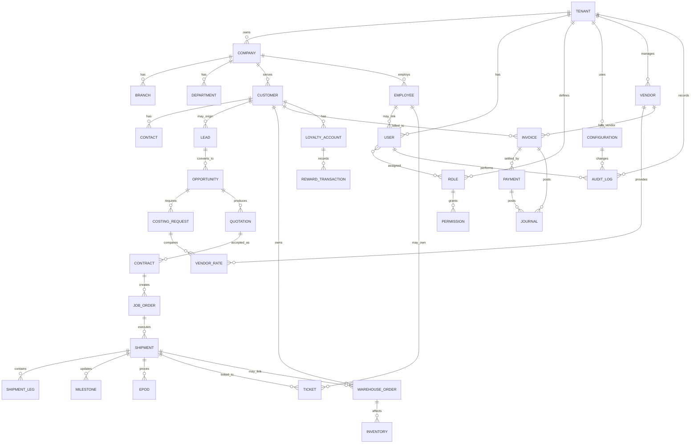

---

## 22. Entity Relationships and Data Flow

| Relationship | Rule | UX Implication | Data Integrity Control |
|---|---|---|---|
| Lead → Prospect/Customer | Qualified lead can convert to prospect/customer without re-entry. | Conversion screen shows mapped fields and duplicate candidates. | Conversion audit and source lead link. |
| Customer → Opportunity | Opportunity must reference customer/prospect/account where required. | Opportunity form reuses customer/service/site/contact. | FK + status validation. |
| Opportunity → Costing Request | Costing request inherits service, route, cargo, customer requirement. | Sales does not retype route/cargo if available. | Snapshot quote/costing version. |
| Costing Request → Vendor Rate | Rate comparison references valid vendor rates and manual ad-hoc quotes. | Rate table shows validity, terms, margin impact. | Rate validity and approval rule. |
| Quotation → Contract/Job Order | Accepted quotation can convert to contract/job order. | Conversion button available only in accepted status. | Quote version locked and linked. |
| Job Order → Shipment | Job can generate one or multiple shipments/legs. | Wizard splits multi-leg/multi-drop. | Job-shipment linkage and lifecycle rule. |
| Shipment → ePOD/Document | POD and documents attach to shipment/leg/drop point. | Document panel shows required docs by service/status. | Signed URL, required document checklist. |
| ePOD → Billing Readiness | Completed POD can trigger billing readiness if rule satisfied. | Finance sees ready/not-ready reasons. | Rule evaluation log. |
| Shipment/Cost → Vendor Invoice | Actual cost and vendor invoice matched to shipment/rate/PO. | AP matching screen shows variance. | Variance threshold approval. |
| Invoice → Payment → Journal | Invoice and payment post journal entries. | Source-linked finance UI. | Double-entry balance and period lock. |
| Customer Transaction → Loyalty | Eligible paid transaction earns points/reward. | Customer portal shows ledger and expiry. | Rule version and fraud hold audit. |
| Ticket → Linked Record | Ticket can link to customer, shipment, invoice, warehouse order, vendor, user. | Ticket detail shows linked record summary. | Linked record RLS check. |
| Employee → Approval/Assignment | Employee/user hierarchy feeds approval and assignment. | Approver picker uses eligibility. | Org hierarchy and delegation rules. |

---

## 23. Data Ownership

| Data Object | Business Owner | System Owner | Editable By | Read Scope | Special Rule |
|---|---|---|---|---|---|
| Tenant | CargoGrid Platform Office | Supreme Admin | Supreme Admin | Supreme Admin/Support controlled | Tenant deletion/suspension requires impact check. |
| Subscription/Entitlement | CargoGrid Commercial/Platform | Supreme Admin | Supreme Admin | Supreme/Admin/tenant admin limited | Module deactivation cannot break active transaction without policy. |
| Role/Permission | Tenant Admin / Supreme Admin | IAM Service | User Admin/Supreme Admin | Users with configure permission | Excessive privilege warning and audit. |
| Customer | Tenant Commercial/Finance | CRM Service | Sales/Finance/Admin by scope | Internal scoped; customer portal scoped | Approved customer changes may need approval. |
| Shipment | Tenant Operations | Shipment Service | Ops/Dispatcher/Sales support by lifecycle | Internal scoped; customer portal scoped | Closed shipment reopen requires approval. |
| Vendor | Tenant Procurement | Vendor Service | Procurement/Finance by scope | Internal scoped | Blacklisting requires reason and approval. |
| Warehouse Inventory | Tenant Warehouse/Customer owner | WMS Service | Warehouse by task/scope | Warehouse/customer scoped | Inventory adjustment requires audit/approval. |
| Invoice | Tenant Finance | Finance Service | Finance before posting | Finance/customer scoped | Posted invoice immutable except credit/reversal process. |
| Journal | Tenant Accounting | Accounting Service | Accounting before posting | Finance/accounting scoped | Posted journal immutable; reversal only. |
| Employee | Tenant HR | HRIS Service | HR/Employee self-service limited | HR/manager/own scoped | Payroll and personal data masked by default. |
| Ticket | Service Owner / Customer Service | Ticket Service | Assignee/requester/manager by scope | Linked record scope | SLA and escalation rule enforced. |
| Loyalty | Tenant CX/Commercial | Loyalty Service | Authorized loyalty admin/system | Customer scoped | Point adjustment requires ledger and reason. |
| Audit Log | Security/Compliance | Audit Service | System only | Authorized audit/security roles | Append-only; no normal delete. |

---

## 24. Data Access Model

Data access memakai kombinasi:

1. **Tenant isolation** via `tenant_id` and RLS.
2. **Module entitlement** via subscription and feature flag.
3. **RBAC action permission** by role/user.
4. **Scope permission** by company, branch, department, team, role, user, record owner, customer, service, region, business unit, transaction value, and transaction status.
5. **Field-level security** for sensitive fields.
6. **Lifecycle permission** based on status.
7. **Document/file access** via record scope and signed URL.

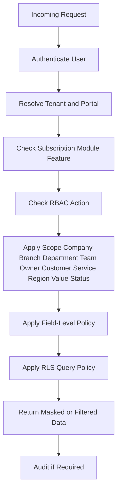

---

## 25. Role and Permission Matrix

| Role / Persona | Scope | View | Create | Edit | Delete | Approve | Reject | Assign | Export | Import | Print | Download | View cost | View selling price | View margin | View payroll | View personal data | Configure | Override | Reopen | Close |
|---|---|---|---|---|---|---|---|---|---|---|---|---|---|---|---|---|---|---|---|---|---|
| Supreme Admin | All tenant/platform data | Y | Y | Y | Y | Y | Y | Y | Y | Y | Y | Y | Y | Y | Y | Conditional support only | Conditional | Y | Y | Y | Y |
| CargoGrid Support | Assigned tenant/time-bound | Y | N default | N default | N | N | N | N | N | N | N | Conditional | N | N | N | N | Masked | N | N | N | N |
| User Admin | Own tenant subscribed modules | Y | Y | Y | Conditional | Conditional | Conditional | Y | Y | Y | Y | Y | Conditional | Conditional | Conditional | No payroll unless granted | Conditional | Y tenant config | Conditional | Conditional | Conditional |
| Director/GM | Company/all branch scope | Y | Conditional | Conditional | N | Y | Y | Y | Y | N | Y | Y | Conditional | Y | Y | No unless granted | No | N | Y | Y |
| Manager | Department/team/branch scope | Y | Y | Y | N | Y threshold | Y threshold | Y | Y team | Y if permitted | Y | Y | Conditional | Conditional | Conditional | No unless HR/finance | No | N | Conditional | Y |
| Staff | Own/assigned data | Y | Y own | Y own draft | N | N | N | N | N | Conditional import | N | Y own docs | N default | Conditional | N | N | Own personal only | N | N | N | N |
| Customer Admin | Customer company/account | Y | Y portal users | Y own profile/users | N | N | N | Assign portal scope | Export own data | N | Print/download allowed docs | Y own docs | N | View invoice amount | N | N | N | Configure customer portal users | N | N | N |
| Customer Ops User | Assigned customer operations scope | Y | Create quote/booking/ticket | Edit own draft | N | N | N | N | N | N | Print/download docs | Download allowed docs | N | No finance unless granted | N | N | N | N | N | N | Close own ticket |
| Customer Finance User | Assigned customer finance scope | Y invoice/payment | Create dispute/ticket | Edit own ticket | N | N | N | N | Export own finance | N | Print/download invoice | Download allowed docs | N | Y own invoice | N | N | N | N | N | N | Close own ticket |
| HR Manager | Employee/HR scope | Y | Y | Y | Conditional | Y HR approvals | Y | Assign HR tasks | Export HR with permission | Import employees | Print/download HR docs | Y docs | N | N | N | N | Y payroll/personal | Configure HR policy if granted | Override with approval | Reopen HR process | Close HR process |
| Finance Manager | Finance scope | Y | Y | Y | Conditional before post | Y finance | Y | Assign finance task | Export finance | Import finance | Print/download finance docs | Y docs | View cost | View selling | View margin | No payroll default | No personal default | Configure finance master if granted | Override with approval | Reopen with approval | Close period |

### 25.1 Permission Actions

| Action | Meaning | Typical Guardrail |
|---|---|---|
| View | Melihat list/detail/widget/report. | RLS and field masking always applied. |
| Create | Membuat record baru. | Module entitlement and mandatory validation required. |
| Edit | Mengubah draft/active record sesuai lifecycle. | Locked/posted/closed record protected. |
| Delete | Menghapus record. | Prefer soft delete/archive; requires reason and audit. |
| Approve | Menyetujui record/action. | Must be selected by approval engine or delegated authority. |
| Reject | Menolak approval/submission. | Reason required. |
| Assign | Menetapkan owner/assignee/vendor/driver/task. | Eligibility and scope checked. |
| Export | Export data. | Sensitive fields restricted; async for large data; audit required. |
| Import | Bulk import. | Validation report and async job required. |
| Print | Print document/view. | Template and data access checked. |
| Download | Download file/document. | Signed URL, expiry, audit. |
| View cost | Melihat internal/vendor/actual cost. | Restricted; never visible to customer. |
| View selling price | Melihat selling/quotation/invoice amount. | Customer finance sees own invoice; internal based on role. |
| View margin | Melihat margin/profitability. | Management/finance/pricing only. |
| View payroll | Melihat payroll/salary. | HR/payroll/own payslip only. |
| View personal data | Melihat employee/customer sensitive data. | Need role and purpose; masking default. |
| Configure | Mengubah configuration. | Admin-only; versioned. |
| Override | Override rule/threshold/status. | Approval/reason/audit required. |
| Reopen | Reopen closed record. | Approval and reason required. |
| Close | Close job/ticket/period/process. | Checklist and lifecycle rule required. |

### 25.2 Scope Dimensions

| Scope Dimension | Usage Example | Data Design Implication |
|---|---|---|
| Tenant | Tenant A cannot access Tenant B. | Every tenant-owned table has tenant_id and RLS. |
| Company | Multi-company tenant controls data per legal entity. | company_id indexed and part of access policy. |
| Branch | Branch users see own branch transactions. | branch_id on operational and finance records. |
| Department | Approval/task/report by function. | department_id on user/employee and workflow. |
| Team | Sales/ops team visibility. | team assignment table. |
| Role | Permission by job function. | role_user mapping and hierarchy. |
| User | Own data or assigned task. | owner_user_id/assignee_user_id indexed. |
| Record owner | Sales owns lead/opportunity; dispatcher owns shipment tasks. | Ownership fields and transfer audit. |
| Customer | Customer portal sees only related company/account/site. | customer_id/customer_account_id in portal-accessed tables. |
| Service | Users may only handle selected service/mode. | service_id in transaction and scope rule. |
| Region | Regional operations and sales boundaries. | region/location hierarchy. |
| Business unit | P&L and process boundary. | business_unit_id. |
| Transaction value | Approval and view threshold. | amount fields with approval evaluator. |
| Transaction status | Action allowed only in certain lifecycle state. | canonical_status plus tenant label. |

---

## 26. Field-Level Security

| Field Classification | Examples | Default Policy |
|---|---|---|
| Public business data | Customer name, shipment number, status, service. | Visible by role and scope; export requires explicit permission. |
| Commercial sensitive | Selling price, discount, contract rate, forecast. | Visible only to commercial/management roles with `view selling price`. |
| Cost sensitive | Vendor cost, internal cost, actual cost, margin. | Visible only to pricing/procurement/finance/management roles with `view cost` or `view margin`. |
| Financial sensitive | Invoice, payment, bank, tax, journal. | Visible only to finance/accounting/authorized management; customer only sees own invoice. |
| Personal data | Employee profile, contact, ID, attendance. | Visible by HR, manager scope, or own employee data. |
| Payroll sensitive | Salary, allowance, deduction, payslip. | Visible only to payroll-authorized roles and own payslip if enabled. |
| Security sensitive | API key, webhook secret, support access. | Masked by default; rotate/reveal flow requires confirmation and audit. |
| Document sensitive | ePOD, invoice, HR document, vendor compliance document. | Signed URL, expiry, record scope, download audit. |

### 26.1 Field-Level Policy Attributes

| Policy Attribute | Description |
|---|---|
| visible | User can see field. |
| editable | User can change field in current status. |
| masked | User sees masked value. |
| exportable | Field included in export. |
| printable | Field included in generated document. |
| filterable | Field can be used in filter/search. |
| audited_on_view | View/download is audited. |
| audited_on_change | Changes are audited before/after. |
| approval_required | Change requires approval. |
| reason_required | Change requires business reason. |

---

## 27. RLS Principles

RLS adalah hard boundary. UI hiding is not security.

| Principle | Policy Requirement | Acceptance Criteria |
|---|---|---|
| Tenant isolation | Every tenant-owned row contains tenant_id; RLS denies cross-tenant access. | Tenant A user cannot query, search, export, download, or infer Tenant B records. |
| Customer portal isolation | Customer user sees only company/account/site/shipment/warehouse/invoice/ticket/loyalty in assigned scope. | Customer portal user cannot change URL/id to access other customer data. |
| Internal scoped access | Internal user sees own/team/department/branch/company/service/region/status/value scope. | Sales staff sees own leads; manager sees team; director sees broader authorized scope. |
| Shared service user | Shared service user can see multiple company/branch only if permission grants it. | Company switcher lists only allowed companies. |
| Supreme Admin elevated access | Platform admin access must be explicit, logged, and safe. | Elevated access banner, reason, and audit record exist. |
| Impersonation | Impersonation requires permission, purpose, duration, and audit. | Impersonated action records actor and impersonated user. |
| Support access | Support access is case-based, time-bound, least privilege. | Expired support session cannot access tenant. |
| Bypass control | Any service role or bypass path must be server-only, logged, and justified. | No service-role key in browser; bypass audit exists. |
| Storage access | File path and signed URL follow tenant and record scope. | User cannot download file without record permission. |
| Reporting isolation | Dashboard/report query applies same tenant/scope/field policy. | Export/report does not leak hidden cost/payroll/personal fields. |
| Search isolation | Global search and picker search are RLS-aware. | Unauthorized records never appear in search result. |
| Background job isolation | Async import/export/report job runs with tenant context and actor permission snapshot. | Job cannot process data outside requested tenant/scope. |

### 27.1 RLS Query Design Notes

- Every tenant-owned table must include `tenant_id`.
- Common high-volume tables should use composite indexes such as `(tenant_id, status, created_at)`, `(tenant_id, customer_id, created_at)`, `(tenant_id, branch_id, status)`, dan module-specific indexes.
- Customer portal-accessed tables must include explicit customer/account/site scoping or join tables that are RLS-safe.
- Avoid policies that require expensive unindexed joins on every high-volume query. Use membership/scope tables and cached permission claims carefully.
- Use security definer functions only when necessary, reviewed, tested, and audited.
- RLS tests must cover direct table query, API query, export, search, storage URL, and background job.

---

## 28. Audit Requirements

| Audit Area | Events | Minimum Fields |
|---|---|---|
| Data mutation | Create/update/delete/merge/import. | who, when, tenant, entity, record, before, after, reason, source, IP/device, correlation ID. |
| Workflow transition | Status change, assignment, submission, revision. | from_status, to_status, actor, rule_version, comment, timestamp. |
| Approval | Approve/reject/delegate/escalate/resubmit. | approver, decision, threshold, rule_version, comment, SLA. |
| Access event | View sensitive data, export, download, support access. | actor, scope, purpose, file/object, timestamp. |
| Configuration | Publish/rollback role, permission, workflow, form, service. | config version, diff, effective date, dependency validation. |
| Impersonation/support | Start/end support session. | requester, approver, target tenant/user, purpose, expiry, actions taken. |
| Integration | API/webhook/background job. | client, endpoint/event, payload hash, status, retry, error, correlation ID. |
| Financial posting | Invoice post, journal post, reversal, period close. | source record, period, journal, amount, approver, immutable status. |

### 28.1 Audit Log Data Model

| Field | Definition | Required | Index |
|---|---|---|---|
| audit_log_id | Primary key audit event. | Yes | PK |
| tenant_id | Tenant context. | Yes | tenant_id + created_at |
| actor_user_id | Actual authenticated user. | Yes | tenant_id + actor_user_id |
| impersonated_user_id | Target user if impersonating. | No | tenant_id + impersonated_user_id |
| entity_name | Canonical entity. | Yes | tenant_id + entity_name |
| record_id | Affected record. | Conditional | tenant_id + entity + record |
| action | create/update/delete/view/export/download/approve/reject/etc. | Yes | tenant_id + action + created_at |
| before_value | Before snapshot or diff. | Conditional | JSONB GIN optional |
| after_value | After snapshot or diff. | Conditional | JSONB GIN optional |
| reason | Business reason for sensitive/high-impact action. | Conditional | text search optional |
| source | UI/API/webhook/import/background/support. | Yes | tenant_id + source |
| ip_address | Request IP. | No | security index optional |
| device_info | User agent/device. | No | - |
| correlation_id | Trace ID across services. | Yes | correlation_id |
| created_at | Event timestamp. | Yes | tenant_id + created_at |

---

## 29. Performance-Aware UX and Data Requirements

| Requirement | Design Decision | Acceptance Criteria |
|---|---|---|
| Avoid N+1 query | List/detail uses joined/selective API shape, batched lookup, or server-composed view. | Page does not trigger one query per row for common related data. |
| Avoid SELECT * | Frontend requests only visible columns and required metadata. | API response excludes hidden fields and unused columns. |
| Server-side pagination | All high-volume list pages use server pagination. | Large shipment/inventory/invoice list loads without full dataset. |
| Cursor pagination | Audit, shipment event, inventory ledger, message/ticket thread, export history use cursor where needed. | Stable pagination under new inserts. |
| Selective column query | Configurable columns inform query projection. | Hidden cost/payroll fields not fetched unless needed and permitted. |
| Tenant-aware indexing | Indexes start with tenant_id or include tenant_id in composite pattern where applicable. | Query plan uses tenant-aware index. |
| Composite indexes | Common filters by tenant/status/date/customer/branch/service. | p95 list query stays within performance budget after load test. |
| Query plan review | Critical queries require EXPLAIN/ANALYZE review before GA. | Slow queries logged and optimized. |
| Caching strategy | Static config/reference data can be cached with version invalidation. | No stale permission/security data. |
| Background jobs | Import/export/report/document generation/notification/integration heavy jobs async. | UI shows job progress and result file. |
| Queue | Notification, webhook, report, automation, and integration retry use queue. | Failed delivery retried with backoff. |
| Batch processing | Bulk update/import/export processed in chunks. | Partial failure report available. |
| Materialized views | Heavy analytics precomputed/materialized where relevant. | Dashboard does not block OLTP workload. |
| Separate transactional/reporting workloads | Reporting can use replica/warehouse later if needed. | Heavy report does not slow core transaction. |
| Limited realtime | Realtime only for active shipment, ticket, notification, dispatch where justified. | No global realtime subscription. |
| API rate limiting | Tenant/API/client rate limits applied. | Abusive client cannot degrade platform. |
| Slow-query logging | Queries above threshold logged with tenant/context safely. | No sensitive payload in logs. |
| Performance budget | Common pages have defined p95 response and UI load targets. | Budget tracked in CI/load test. |
| Dashboard pre-aggregation | Widgets use summary tables/cache where heavy. | Dashboard loads predictably. |
| Bulk import strategy | Validate, stage, process async, provide error report. | Bad rows do not corrupt good rows. |
| Export strategy | Permission-aware async export with expiry and audit. | Large export does not timeout and is downloadable only by requester/permitted users. |

---

## 30. QA Acceptance Framework

| Test Area | Minimum Test |
|---|---|
| Portal access | Each persona sees only correct portal/menu/module/action. |
| RLS isolation | Cross-tenant/customer/company/branch access attempts fail at API/database level. |
| Field-level security | Cost, margin, payroll, personal, bank, tax, secret, and document fields are masked/hidden/export-blocked based on role. |
| Configuration publish | Draft, validate, preview, publish, rollback, effective date, and dependency validation work. |
| Workflow/status | Invalid lifecycle transition is blocked; valid transition creates audit. |
| Approval | Sequential, parallel, conditional, threshold, delegation, escalation, rejection, revision, resubmission work. |
| Form behaviour | Conditional required, duplicate detection, autosave, attachment, reason-required action work. |
| Table behaviour | Server-side filter/sort/pagination, saved view, configurable column, export, bulk action work. |
| Dashboard | Widget respects permission and does not query excessive live dataset. |
| Responsive | Key screen usable on desktop, tablet, mobile according to design posture. |
| Accessibility | Keyboard, focus, label, contrast, error, and status not color-only pass baseline. |
| Audit | Sensitive access, export/download, approval, config, financial post, support access logged. |
| Performance | High-volume page and dashboard meet performance budget under representative load. |

---

## 31. Open Decisions

| ID | Decision | Current Position | Owner |
|---|---|---|---|
| OD-UX-001 | Exact visual design system tokens beyond white-label variables. | Proposed Default: neutral enterprise design with tenant branding override. | UX Lead |
| OD-UX-002 | Native mobile app timing. | Out of baseline; responsive/PWA first. | Product Council |
| OD-DATA-001 | Dedicated analytics warehouse timing. | Use materialized/precomputed summaries first; separate workload when threshold reached. | Data/CTO |
| OD-SEC-001 | Enterprise SSO first supported protocol. | Proposed Default: SAML/OIDC based on enterprise demand. | Security/CTO |
| OD-LOC-001 | Country-specific finance/payroll localization sequence. | Indonesia first, regional later. | Finance/HR SME |
| OD-OPS-001 | Offline mode for warehouse/ePOD. | Future enhancement; design should not block it. | Product/Engineering |

---

## 32. Final Design Guardrails

1. Jangan membuat UX yang mengandalkan client-side filtering untuk data besar.
2. Jangan mengambil hidden sensitive field ke browser hanya untuk disembunyikan di UI.
3. Jangan menyatukan Supreme Admin operational support dengan tenant transaction UX tanpa elevated access banner dan audit.
4. Jangan membuat tenant-specific source-code fork untuk terminology, form, workflow, role, approval, status, atau document template.
5. Jangan membuat report/dashboard yang melewati RLS atau field-level security.
6. Jangan membuat configuration publish tanpa versioning, dependency validation, preview, dan rollback plan.
7. Jangan membuat financial posted record editable langsung.
8. Jangan membuat customer portal trust hanya dari route parameter; customer scope harus enforced di backend/database.
9. Jangan membuat export sebagai blind full-table dump.
10. Jangan menghilangkan canonical state/entity walaupun tenant mengubah label.

---

## 33. Approval and Sign-Off

| Role | Name | Decision | Date | Notes |
|---|---|---|---|---|
| Product Owner | TBD | Approve / Revise | TBD | Validate UX and product scope |
| UX Lead | TBD | Approve / Revise | TBD | Validate IA, flows, screen behavior |
| Frontend Lead | TBD | Approve / Revise | TBD | Validate component and performance feasibility |
| Backend Lead | TBD | Approve / Revise | TBD | Validate API/data access design |
| Data Architect | TBD | Approve / Revise | TBD | Validate ERD, data dictionary, index principles |
| Security Lead | TBD | Approve / Revise | TBD | Validate RLS, permission, audit, storage access |
| QA Lead | TBD | Approve / Revise | TBD | Validate testability and acceptance framework |
| Implementation Lead | TBD | Approve / Revise | TBD | Validate tenant configuration and rollout usability |

---

**End of Document**
