# CargoGrid Technical Architecture, Security & Integration Specification

**Document ID:** CG-TECH-004  
**Version:** 1.0 Draft  
**Status:** Draft for Architecture, Engineering, Security, DevOps, Product, QA, and Implementation Review  
**Product:** CargoGrid  
**Target Output File:** `04_CargoGrid_Technical_Architecture_Security_Integration.md`  
**Primary Source of Truth:** `CargoGrid_Product_Concept_Brief.md`  
**Secondary Context:** `01_CargoGrid_Project_Product_Charter.md`, `02_CargoGrid_Business_Process_Product_Requirements_Blueprint.md`, dan `03_CargoGrid_UX_Data_Access_Design.md`  
**Language:** Bahasa Indonesia profesional dengan istilah English untuk SaaS, logistics, finance, software, security, integration, dan architecture.  
**Prepared Date:** 2026-07-13  

---

## 0. Document Control

Dokumen ini menjadi acuan teknis untuk membangun CargoGrid sebagai **SaaS ERP logistics-native** yang multi-tenant, white-label, modular, configurable, cepat, aman, scalable, dan enterprise-ready.

Dokumen ini tidak mengganti Product Concept Brief. Semua keputusan yang sudah dikonfirmasi di Product Concept Brief tetap dipertahankan sebagai **Confirmed Product Decision**, terutama:

- CargoGrid adalah SaaS ERP untuk 3PL, freight forwarder, cargo company, trucking company, warehouse operator, distribution company, project logistics provider, dan in-house logistics operation.
- Platform wajib **multi-tenant**, **white-label**, **modular subscription**, **RLS**, **RBAC**, **configurable workflow**, **configurable module**, **configurable role and permission**, **configurable service**, **configurable approval**, **configurable business process**, dan **configurable operational process**.
- Seluruh konfigurasi tenant harus dapat dilakukan melalui UI tanpa perubahan source code backend.
- CargoGrid memakai **Next.js**, **TypeScript**, **React**, **Supabase**, **PostgreSQL**, **Supabase Auth**, **Supabase Row-Level Security**, **Supabase Storage**, dan komponen Supabase lain secara selektif.
- Data harus bersifat **single source of truth**, tidak redundant, dan terhubung direksional-transaksional antar-module.
- Backend, API, query, dashboard, dan file access harus efisien, ringan, dan scalable.

### Decision Labels

| Label | Meaning |
|---|---|
| **Confirmed Product Decision** | Keputusan dari Product Concept Brief. Tidak boleh diubah tanpa formal change control. |
| **Proposed Default** | Default teknis awal agar engineering bisa bergerak. Bisa diubah melalui Architecture Review Board. |
| **Architecture Guardrail** | Batasan teknis yang wajib dipatuhi kecuali ada approved architecture exception. |
| **Open Decision** | Area yang belum cukup matang dan harus masuk ADR backlog. |

---

## 1. Executive Technical Summary

CargoGrid harus dibangun sebagai **modular monolith SaaS platform first**, bukan langsung microservices. Ini pilihan paling waras untuk tahap awal. Domain CargoGrid sangat luas: commercial, CRM, quotation, TMS, WMS, shipment management, ePOD, procurement, vendor management, finance, HRIS, ticketing, customer portal, loyalty, reporting, integration, dan configuration engine. Kalau dipaksa microservices dari awal, complexity akan meledak sebelum product-market fit dan process fit terbukti.

**Rekomendasi final:** CargoGrid menggunakan **Next.js App Router + TypeScript + React** untuk frontend dan server boundary, **Supabase Auth** untuk identity, **PostgreSQL + RLS** sebagai data control layer utama, **Supabase Storage** untuk document/file, **Route Handlers** untuk public/internal API boundary, **Server Actions** untuk mutation internal yang tepat, **Edge Functions** hanya untuk integration, webhook, scheduled job, atau compute yang memang lebih cocok di Supabase boundary.

Architecture baseline:

- **MVP Architecture:** modular monolith, shared database shared schema, tenant isolation via `tenant_id`, RLS, RBAC, field-level policy, server-side rendering/fetching, background job sederhana, async import/export.
- **Scale-up Architecture:** read optimization, materialized views, reporting tables, queue, dedicated worker, partitioning untuk high-volume tables, analytics replica jika dibutuhkan, stricter service boundaries.
- **Enterprise Architecture:** optional dedicated enterprise instance, SSO/SAML, IP restriction, advanced audit, data residency, customer-managed integration, extended retention, more granular encryption/key policy, enterprise monitoring.

Prinsip paling penting: **configuration boleh fleksibel, tapi data model dan security boundary tidak boleh liar**. Tenant boleh mengubah workflow, approval, terminology, form, field, status, numbering, service, dashboard, report, dan document template melalui UI. Namun canonical entity, canonical status, audit event, tenant boundary, financial posting rule, RLS policy, API contract, dan data lineage harus tetap stabil.

---

## 2. Architecture Goals

| Goal | Description | Success Indicator |
|---|---|---|
| Secure multi-tenancy | Tenant A tidak bisa membaca, mengubah, mengekspor, atau mengakses file Tenant B. | RLS test suite lulus untuk semua tenant-aware tables dan storage objects. |
| Configurable without backend change | Tenant variation diselesaikan melalui metadata, rule engine, template, feature flag, dan UI configuration. | ≥90% tenant-specific change dapat dilakukan tanpa backend code change. |
| Performance-first ERP | Screen high-volume tidak load seluruh dataset ke browser dan tidak melakukan excessive client-side fetching. | p95 API internal common read ≤500 ms untuk query normal, p95 page interaction sesuai performance budget. |
| Transactional data lineage | Data lead → customer → quote → job → shipment → ePOD → invoice → payment → loyalty dapat ditelusuri. | Setiap record utama punya lineage, audit, dan upstream/downstream reference. |
| Financial integrity | Posted journal immutable, posting idempotent, period lock enforceable. | Tidak ada silent mutation pada posted journal; koreksi via reversal/adjustment. |
| Enterprise readiness | Mendukung SSO, audit, support access control, API/webhook, white-label, custom domain, backup/restore, monitoring. | Enterprise security checklist dan architecture readiness gate terpenuhi. |
| Maintainability | Modular monolith dengan domain boundary jelas dan ownership jelas. | Module bisa dikembangkan tanpa merusak domain lain melalui contract/test boundary. |
| API-first where useful | API dan webhook tersedia untuk customer, vendor, system integration, dan partner. | Public/integration endpoint versioned, documented, idempotent, monitored. |

---

## 3. Architecture Principles

1. **Product Concept Brief wins.** Kalau ada konflik antara praktik umum ERP dan CargoGrid Brief, Brief yang menang.
2. **Modular monolith first.** Microservices hanya masuk ketika ada bukti kebutuhan scale, team autonomy, deployment isolation, atau compliance.
3. **RLS is mandatory, not optional.** Semua tenant-owned table yang bisa diakses dari application/user context wajib punya RLS atau compensating control yang disetujui.
4. **RBAC + scope + optional ABAC.** Menu access saja tidak cukup. Permission harus menggabungkan action, field, record, organization scope, transaction value, transaction status, service, customer, dan region.
5. **Server-side by default for ERP data.** Data-heavy dan sensitive flow wajib server-side. Client Components dipakai untuk interaksi UI, bukan tempat utama data authority.
6. **No `SELECT *` in transactional APIs.** Query harus selective columns, paginated, filtered, sorted di server.
7. **No global realtime.** Realtime hanya untuk use case bernilai tinggi: dispatch board tertentu, ticket assignment, approval notification, dan shipment milestone tertentu.
8. **Immutable financial posting.** Draft boleh diedit; posted transaction tidak boleh diubah diam-diam.
9. **Configuration is versioned.** Config punya draft, publish, rollback, effective date, dependency validation, dan audit.
10. **File access follows data access.** Document/ePOD/invoice file tidak boleh dapat diakses hanya karena punya URL. Signed URL harus time-bound dan scope-bound.
11. **Background everything heavy.** Import besar, export besar, report besar, document generation massal, webhook retry, notification batch, dashboard refresh harus async.
12. **Audit everything meaningful.** Create/update/delete/status/approval/config/support access/import/export/API/webhook/file access harus tercatat sesuai risk level.
13. **Avoid overengineering.** Tambah queue, partition, dedicated instance, analytics replica, atau service split ketika metric menunjukkan kebutuhan.

---

## 4. System Context

```mermaid
flowchart TB
    subgraph Users[User Layers]
        SA[Supreme Admin]
        SUP[CargoGrid Support]
        UA[User Admin]
        IU[Internal Organizational User]
        CU[Customer User]
        APIU[Customer/Vendor/Partner API Client]
    end

    subgraph Web[Next.js Application]
        APP[App Router]
        RSC[Server Components]
        CC[Client Components]
        ACT[Server Actions]
        RH[Route Handlers / API]
        MW[Middleware]
    end

    subgraph Supa[Supabase Platform]
        AUTH[Supabase Auth]
        DB[(PostgreSQL + RLS)]
        STG[Supabase Storage]
        RT[Realtime selective]
        EF[Edge Functions selective]
        CRON[Scheduled Jobs / Cron]
    end

    subgraph External[External Systems]
        EMAIL[Email]
        WA[WhatsApp/SMS]
        MAP[Google Maps]
        GPS[GPS/Telematics]
        CARRIER[Shipping Line/Airline/Port/Airport]
        CUSTOMS[Customs]
        BANK[Bank/Payment Gateway]
        TAX[Tax/e-Invoice]
        EXTACC[External Accounting/HR]
        N8N[n8n Orchestrations]
    end

    SA --> APP
    SUP --> APP
    UA --> APP
    IU --> APP
    CU --> APP
    APIU --> RH

    APP --> AUTH
    RSC --> DB
    ACT --> DB
    RH --> DB
    APP --> STG
    RH --> EF
    EF --> DB
    DB --> RT
    CRON --> EF

    EF --> External
    RH --> External
    N8N --> RH
```

### Context Boundary

| Boundary | Responsibility | Main Risk | Control |
|---|---|---|---|
| Browser | UI rendering, interaction, light state, file upload initiation | Data exposure, excessive hydration | Client/server boundary, no service key, minimal payload |
| Next.js server | Session-aware rendering, server-side data fetching, API route handlers, mutation boundary | Over-fetching, auth bypass | Auth helper, RLS, centralized authorization checks |
| Supabase Auth | Identity, session, MFA, SSO option | Misconfigured redirect/session | Secure session policy, MFA/SSO controls |
| PostgreSQL | Transactional source of truth, RLS, functions, views, materialized views | Cross-tenant leakage, slow queries | RLS tests, indexes, query plans, audit |
| Storage | Documents, ePOD photos, invoices, templates | File leakage | Signed URL, tenant path policy, object metadata |
| External systems | Integration | Retry storm, inconsistent payload, third-party downtime | Queue, idempotency, timeout, monitoring, DLQ |

---

## 5. Logical Architecture

```mermaid
flowchart TB
    subgraph Platform[Platform Foundation]
        TEN[Tenant & Subscription]
        IAM[Identity, RBAC, RLS Claims]
        CFG[Configuration Engine]
        WF[Workflow Engine]
        APPR[Approval Engine]
        NOTIF[Notification Engine]
        DOC[Document Engine]
        AUD[Audit Engine]
        INT[Integration Engine]
        REP[Reporting Engine]
    end

    subgraph Business[Business Domains]
        COM[Commercial CRM Quotation]
        OPS[Operations Shipment TMS]
        WMS[Warehouse Management]
        PRC[Procurement Vendor]
        FIN[Finance Accounting]
        HRS[HRIS]
        TKT[Ticketing]
        LOY[Loyalty Rewards]
        CPT[Customer Portal]
    end

    subgraph Data[Data Layer]
        DB[(PostgreSQL OLTP)]
        MAT[Materialized Views]
        RPT[Reporting Tables]
        STG[Storage]
        EVT[Event/Audit Logs]
    end

    Platform --> Business
    Business --> Data
    CFG --> COM
    CFG --> OPS
    CFG --> FIN
    WF --> APPR
    APPR --> NOTIF
    DOC --> STG
    Business --> AUD
    Business --> INT
    REP --> MAT
    REP --> RPT
```

### Logical Component Rules

| Component | Rule |
|---|---|
| Platform Foundation | Semua domain bergantung pada tenant, identity, entitlement, configuration, audit, dan notification. |
| Business Domains | Domain boleh memanggil shared platform services, tetapi tidak boleh bypass permission/data ownership. |
| Data Layer | PostgreSQL menjadi transactional source of truth. Reporting optimization tidak mengganti canonical data. |
| Integration Engine | External integration tidak boleh menulis langsung ke table sensitif tanpa validation/idempotency/audit. |
| Configuration Engine | Config version ID harus tercatat pada transaksi yang dipengaruhi konfigurasi. |

---

## 6. Physical Architecture

### MVP Physical Architecture

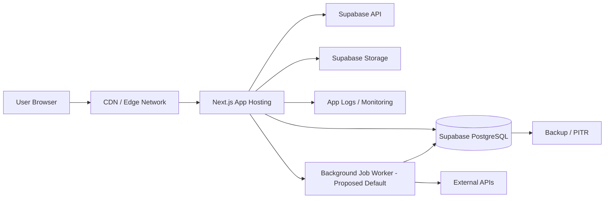

### Scale-up Physical Architecture

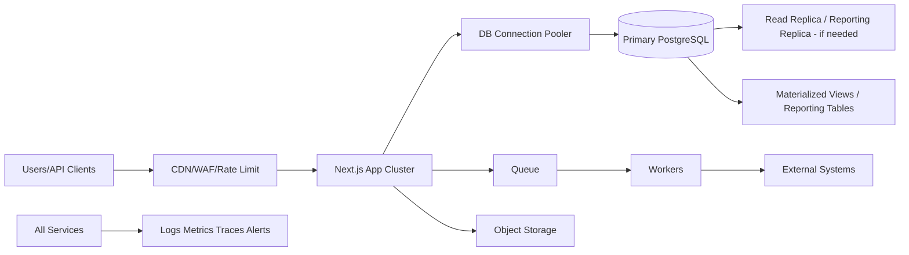

### Enterprise Architecture Option

| Capability | MVP | Scale-up | Enterprise |
|---|---|---|---|
| Tenancy | Shared DB shared schema | Shared + partitioning/high-volume optimization | Dedicated instance available |
| Auth | Supabase Auth | MFA, stricter session | SSO/SAML, IP allowlist, device policy |
| Data | OLTP DB | Read replica/reporting schema | Regional residency / dedicated DB |
| Integration | Route Handlers/Edge Functions | Queue + DLQ | Dedicated integration worker/tenant key |
| Observability | Basic logs/metrics | Full dashboard/alert | Tenant-specific audit export/SIEM |
| Release | Feature flags | Canary | Tenant-specific rollout windows |

---

## 7. Frontend Architecture

CargoGrid frontend menggunakan **Next.js App Router**, **TypeScript**, dan **React**. App Router digunakan untuk routing berbasis folder, nested layout, loading/error boundary, dan server-first rendering pattern.

### 7.1 App Router Structure

**Proposed Default folder structure:**

```text
app/
  (public)/
    login/
    forgot-password/
  (supreme)/
    supreme/
      tenants/
      subscriptions/
      system/
  (tenant)/
    [tenantSlug]/
      dashboard/
      commercial/
      operations/
      finance/
      admin/
  (customer)/
    portal/
      [tenantSlug]/
        dashboard/
        shipments/
        invoices/
  api/
    v1/
      ...
components/
  ui/
  domain/
  tables/
  forms/
lib/
  auth/
  data/
  permissions/
  tenant/
  config/
  validators/
server/
  actions/
  queries/
  mutations/
  integrations/
```

**Architecture Guardrail:** route group tidak menggantikan authorization. Route group hanya UX/routing boundary. Authorization tetap dicek di server dan RLS.

### 7.2 Server Components

Server Components dipakai untuk:

- Page shell yang membutuhkan server-side data.
- Dashboard summary yang permission-aware.
- Read-heavy detail page.
- Table initial fetch dengan server-side filter/sort/pagination.
- Permission-aware navigation.
- White-label config resolution.
- Tenant config resolution.

Server Components tidak boleh dipakai untuk menyimpan interactive state berat di server. Interaksi seperti table selection, modal, drag/drop, builder canvas, dan upload progress tetap Client Components.

### 7.3 Client Components Boundaries

Client Components dipakai untuk:

- Interactive table controls.
- Form input, validation feedback, wizard navigation.
- Workflow builder canvas.
- Approval builder.
- Drag/drop dashboard/report builder.
- Upload progress.
- Map interaction.
- ePOD capture.
- Realtime status widgets yang scope-nya sempit.

**Guardrail:** Client Components tidak boleh memegang service role key, tidak boleh mem-fetch full dataset, dan tidak boleh menjadi source of authorization truth.

### 7.4 Server Actions

Server Actions digunakan untuk mutation internal yang:

- Dipanggil dari trusted form UI.
- Butuh session-aware operation.
- Tidak perlu public API contract.
- Perlu revalidation langsung pada internal route.

Contoh:

- Submit approval.
- Save draft form.
- Create lead.
- Update milestone.
- Upload metadata setelah file tersimpan.
- Publish configuration draft.

Server Actions tidak cocok untuk public/customer/vendor integration API. Untuk itu gunakan Route Handlers.

### 7.5 Route Handlers

Route Handlers digunakan untuk:

- Public API `/api/v1/...`.
- Webhook receiver.
- Long-running job trigger.
- Export/import job endpoints.
- External integration callback.
- Signed download preparation.
- Health check.

Route Handler wajib menerapkan:

- Auth check.
- Tenant resolution.
- Authorization check.
- Idempotency handling jika mutation.
- Request size limit.
- Rate limiting.
- Structured error schema.
- Audit/API log.

### 7.6 Data Fetching Strategy

| Use Case | Strategy |
|---|---|
| Dashboard summary | Server Component fetch + cached/pre-aggregated data where safe |
| Operational table | Server-side query via query module, paginated |
| High-volume event log | Cursor/keyset pagination |
| Form initial values | Server fetch with selective fields |
| Mutation | Server Action for internal, Route Handler for API/integration |
| Customer portal | Server-side filtered by customer scope |
| Public landing/static content | Static generation where relevant |
| Realtime widget | Supabase Realtime only for scoped channels |

### 7.7 Cache Strategy and Revalidation

| Data Type | Cache Policy | Revalidation |
|---|---|---|
| Tenant branding/static config | Cache with short TTL and config version key | On publish config |
| Navigation/permission matrix | Session-bound cache, no cross-user sharing | On role/permission publish |
| Dashboard pre-aggregate | Cache/precompute | Scheduled refresh + invalidation on critical event |
| Transaction detail | Prefer fresh server fetch | Revalidate after mutation |
| Audit log | No stale cache for compliance view | Cursor paginated fresh read |
| Public marketing page | Static/cache | On content publish |

**Guardrail:** jangan cache sensitive user-specific data secara global.

### 7.8 Streaming and Suspense

Streaming/Suspense dipakai untuk:

- Dashboard dengan beberapa widget.
- Detail page dengan heavy related data.
- Report preview.
- Customer portal shipment timeline.

Setiap Suspense fallback harus meaningful: skeleton table, loading cards, atau progress state. Jangan blank screen.

### 7.9 Dynamic Import and Code Splitting

Dynamic import wajib untuk:

- Chart library.
- Map component.
- PDF/document preview.
- Workflow builder.
- Report/dashboard builder.
- Spreadsheet import preview.
- Rich text/template editor.

Tujuannya simpel: jangan bikin bundle awal membengkak karena library berat yang jarang dipakai.

### 7.10 Middleware Usage

Middleware dipakai selektif untuk:

- Tenant domain/subdomain resolution.
- Locale/white-label routing hints.
- Basic session presence redirect.
- Security headers.

Middleware tidak boleh melakukan heavy database query. Permission detail tetap di server-side handler/page layer.

### 7.11 Auth Session Handling

- Session dibaca server-side untuk page/API.
- JWT claims dapat memuat `user_id`, `tenant_membership`, default tenant, dan high-level role reference.
- Permission detail tetap di database/cache server-side agar perubahan permission bisa berlaku tanpa menunggu token refresh terlalu lama.
- Session timeout, refresh, device revocation, MFA step-up, dan SSO mapping harus didesain sejak awal.

### 7.12 Tenant-aware Routing

| Pattern | Example | Use |
|---|---|---|
| Path-based tenant | `/acme/operations/shipments` | MVP default, mudah debug |
| Custom domain | `portal.acme.com` | White-label enterprise |
| Subdomain | `acme.cargogrid.app` | Scalable SaaS tenant routing |
| Supreme admin | `/supreme/tenants` | Internal CargoGrid only |

**Proposed Default:** MVP memakai path-based tenant + optional custom domain pada customer portal. Custom domain penuh untuk internal tenant portal masuk scale-up/enterprise.

### 7.13 White-label Domain Resolution

Domain resolution flow:

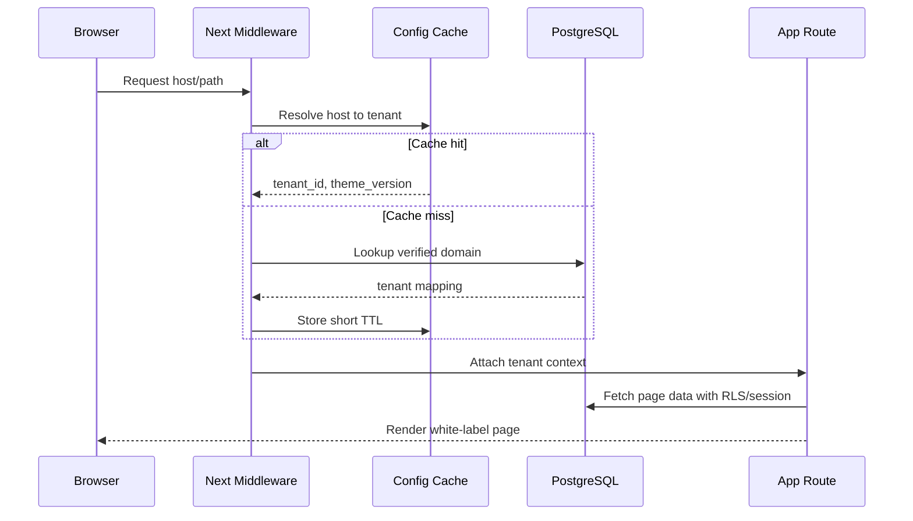

### 7.14 Avoiding Excessive Hydration

- Gunakan Server Components untuk layout dan static/read-only data.
- Hindari global client providers yang membungkus seluruh aplikasi jika tidak perlu.
- Client Component dibuat kecil dan task-specific.
- Jangan kirim dataset besar ke browser hanya untuk difilter lokal.
- Jangan serialize permission matrix besar ke client; kirim capability yang relevan untuk screen/action.

### 7.15 Form Handling

- Form kompleks memakai wizard/progressive disclosure.
- Draft autosave dapat diterapkan untuk transaksi panjang seperti shipment, quotation, warehouse order.
- Server-side validation menjadi authority.
- Client-side validation hanya untuk UX cepat.
- Field visibility/editability dikontrol metadata dan field-level security.
- High-impact change meminta reason.
- Concurrent update memakai version column atau `updated_at`/ETag-style check.

### 7.16 Large Table Strategy

| Requirement | Rule |
|---|---|
| Filtering | Server-side only |
| Sorting | Server-side only |
| Pagination | Offset untuk small stable list; cursor/keyset untuk large/high-write list |
| Column config | User/role saved view |
| Bulk action | Server-side selection token/query criteria, bukan mengirim ribuan ID dari browser |
| Export | Async export job |
| Search | Indexed search; trigram/full-text where needed |
| Row expansion | Lazy load related detail |
| Realtime | Row/table subset only |

### 7.17 Bulk Upload Strategy

Bulk upload harus asynchronous:

1. User upload file.
2. File disimpan ke staging storage.
3. System create import job.
4. Worker parse dan validate.
5. User melihat preview/error report.
6. User confirm import.
7. Worker write batch dengan transaction chunk.
8. Audit log dan import summary dibuat.
9. Error file bisa di-download.

---

## 8. Backend Architecture

Backend CargoGrid bukan backend framework terpisah yang mengganti Supabase/Next.js. Backend dibagi ke beberapa boundary:

| Backend Boundary | Technology | Responsibility |
|---|---|---|
| Server Components/Queries | Next.js server | Read model, screen-level data composition |
| Server Actions | Next.js server | Internal UI mutation |
| Route Handlers | Next.js server | API, webhook, export/import trigger |
| PostgreSQL Functions | PostgreSQL | Atomic DB-side logic yang butuh transaction integrity |
| Triggers | PostgreSQL | Audit/event hooks terbatas, financial safeguards |
| Edge Functions | Supabase | External webhooks, scheduled jobs, integration adapters, privileged tasks |
| Workers | Proposed Default | Async jobs, import/export, report, notification, integration retry |

### Backend Module Layout

```text
server/
  queries/
    shipments.ts
    customers.ts
    finance.ts
  mutations/
    quotation.ts
    approval.ts
    shipment.ts
  actions/
    quotation-actions.ts
    shipment-actions.ts
  policies/
    permission-check.ts
  integrations/
    payment-gateway.ts
    gps.ts
    whatsapp.ts
  jobs/
    export-job.ts
    import-job.ts
    webhook-retry.ts
```

### Backend Rules

- Semua mutation harus punya actor, tenant context, permission check, validation, idempotency where needed, and audit.
- DB transaction dipakai untuk operasi yang harus atomic.
- Business rule engine membaca config version yang published/effective.
- Backend tidak boleh membuat tenant-specific branch logic hardcoded. Gunakan config/rule/template.
- Service role hanya dipakai di server trusted boundary, Edge Function, worker, atau admin-only operations. Tidak pernah di browser.

---

## 9. Database Architecture

PostgreSQL adalah source of truth untuk CargoGrid. Struktur data harus logistics-native dan tenant-aware sejak tabel pertama.

### 9.1 Schema Strategy

**Proposed Default: shared database shared schema** untuk MVP dan scale-up awal, dengan `tenant_id` di semua tenant-owned tables.

| Option | Pros | Cons | Fit for CargoGrid |
|---|---|---|---|
| Shared DB shared schema | Efisien, mudah release, cocok SaaS modular, query/report cross-tenant internal lebih mudah | RLS harus sangat disiplin; indeks harus tenant-aware | **Recommended default** |
| Separate schema per tenant | Isolasi lebih kuat, custom schema lebih mudah | Migration rumit, schema drift tinggi, costly untuk banyak tenant | Tidak cocok untuk configuration-first standard SaaS awal |
| Database per tenant | Isolasi kuat, data residency lebih mudah | Mahal, operational overhead besar, cross-tenant ops sulit | Enterprise option, bukan default |
| Hybrid | Balance default shared + dedicated enterprise | Complexity meningkat | Recommended untuk scale/enterprise |

### 9.2 Core Tenant Columns

| Column | Purpose | Required In |
|---|---|---|
| `tenant_id` | Primary tenant isolation | Semua tenant-owned tables |
| `company_id` | Multi-company scope | Customer, shipment, finance, HR, warehouse, vendor usage |
| `branch_id` | Branch-level operation | Shipment, warehouse, employee, finance dimension |
| `department_id` | Department-level access/workflow | Approval, task, ticket, HR |
| `business_unit_id` | BU scope | Commercial, finance, reporting |
| `customer_account_id` | Customer portal boundary | Shipment, invoice, warehouse order, ticket |
| `owner_user_id` | Ownership rule | Lead, opportunity, quote, task |
| `created_by`, `updated_by` | Audit base | Semua mutable transactional tables |
| `record_version` | Optimistic concurrency | High-impact mutable records |
| `deleted_at` | Soft delete | Most master/transaction tables except immutable ledger |
| `status_code`, `canonical_status` | Tenant label + reporting consistency | All lifecycle entities |

### 9.3 Domain Boundaries

| Domain | Core Entities | Critical Rule |
|---|---|---|
| Tenant/Identity | tenant, company, branch, user, role, permission, membership | Never access without tenant context |
| Configuration | module, feature, form, field, workflow, approval, status, numbering, terminology | Versioned, published, rollbackable |
| Commercial | lead, account, contact, opportunity, costing request, quotation, contract | Quote acceptance can create job without re-entry |
| Operations | job order, shipment, leg, route, dispatch, milestone, ePOD, claim, incident | Shipment status and milestone must be auditable |
| WMS | warehouse, zone, rack, bin, SKU, inventory, warehouse order, inventory ledger | Inventory movement via ledger, not direct silent qty mutation |
| Procurement/Vendor | vendor, vendor rate, RFQ, assessment, contract, performance | Rate validity and approval matter |
| Finance | invoice, payment, journal, subledger, AR/AP, tax, period lock | Posted journal immutable |
| HRIS | employee, attendance, leave, payroll, KPI | Payroll/personal fields sensitive |
| Ticketing | ticket, comment, SLA, escalation, linked entity | Ticket can link to shipment/invoice/warehouse/user/vendor/customer |
| Loyalty | program, tier, point ledger, reward, redemption | Points via ledger, not direct mutation |
| Audit | audit_log, event_log, api_log, file_access_log | Append-only |

### 9.4 Foreign Keys

- FK dipakai untuk canonical relationships yang stabil: tenant→company→branch, customer→shipment, shipment→milestone, invoice→payment, journal→journal_line.
- Untuk polymorphic linked entity seperti ticket linked to shipment/invoice/vendor/user, gunakan typed reference table dengan validation logic.
- Jangan mengorbankan data integrity hanya demi fleksibilitas palsu.

### 9.5 Soft Delete and Immutable Records

| Record Type | Delete Strategy |
|---|---|
| Master data | Soft delete with `deleted_at`, prevent delete if referenced |
| Transaction draft | Soft delete/cancel with reason |
| Posted journal | No delete, reversal only |
| Point ledger | No delete, adjustment transaction only |
| Inventory ledger | No delete, adjustment movement only |
| Audit log | Append-only; retention policy |
| File/document | Soft delete metadata + storage lifecycle policy |

### 9.6 Temporal Data

Temporal fields:

- `effective_from`
- `effective_to`
- `published_at`
- `activated_at`
- `deactivated_at`
- `valid_from`
- `valid_until`
- `posted_at`
- `period_id`
- `locked_at`

Digunakan untuk rate, contract, service config, workflow config, approval matrix, pricing, tax, exchange rate, employee contract, membership tier.

### 9.7 Event Log and Audit Versioning

Bedakan:

| Log | Purpose | Example |
|---|---|---|
| Audit Log | Compliance: who changed what | User changed credit limit |
| Event Log | Business event stream | Shipment delivered, invoice posted |
| API Log | Integration observability | Customer API booking request |
| File Access Log | Document security | User downloaded invoice |
| Support Access Log | Privileged access | Support inspected tenant config |

---

## 10. Multi-tenancy

### 10.1 Final Recommendation

**Recommended default:** shared database shared schema + `tenant_id` + strict RLS + tenant-aware indexes + field/record-level permission in application and policy layer.

**Enterprise option:** dedicated instance/database untuk tenant enterprise yang membutuhkan procurement/security/regulatory isolation, regional residency, atau volume ekstrem.

Ini trade-off paling masuk akal. CargoGrid butuh modular SaaS, release cepat, configuration-heavy product, dan repeatable implementation. Separate schema/database per tenant dari awal akan membuat migration dan configuration versioning terlalu mahal.

### 10.2 Tenant Isolation Model

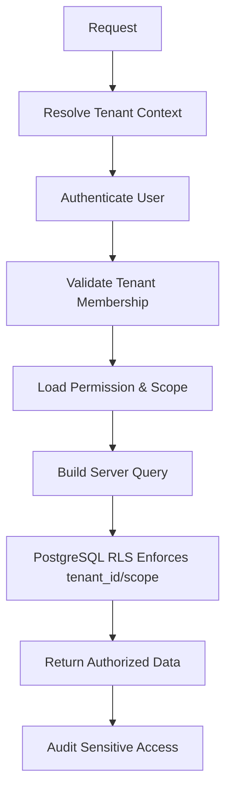

### 10.3 Tenant Onboarding

1. Create tenant profile.
2. Create default company/branch.
3. Activate subscription/module entitlement.
4. Apply global default config template.
5. Apply white-label settings.
6. Create User Admin.
7. Publish baseline role/permission/workflow.
8. Load master data.
9. Configure service/rate/status/numbering.
10. Run tenant readiness test: RLS, role, navigation, config, sample transaction.

### 10.4 Tenant Offboarding

- Freeze subscription or set read-only mode.
- Export tenant data with permission/audit.
- Revoke active sessions.
- Disable API keys/webhooks.
- Archive storage objects according to retention.
- Execute contractual deletion/anonymization if required.
- Maintain audit/legal records as required.

### 10.5 Tenant Migration

Migration scenarios:

| Scenario | Approach |
|---|---|
| Shared → dedicated enterprise | Logical tenant export, schema migration, storage copy, integration endpoint update, cutover |
| Region migration | Freeze writes, replicate, verify, DNS/domain cutover |
| Tenant merge | Open Decision; high risk due to customer/vendor/finance lineage |
| Tenant split | Open Decision; requires data ownership mapping |

### 10.6 Cross-tenant Reporting

Only Supreme Admin/SaaS analytics can do cross-tenant reporting. Data must be aggregated/anonymized unless privileged operational need is approved.

### 10.7 Supreme Admin and Support Access

- Supreme Admin has platform-level authority, but operational access to tenant data must still be logged.
- Support access is time-bound, case-bound, purpose-bound.
- Impersonation requires reason, visible banner, and complete audit.

---

## 11. RLS

RLS adalah lapisan database untuk defense-in-depth. Di Supabase/PostgreSQL, RLS harus menjadi default untuk tenant-owned tables.

### 11.1 RLS Policy Principles

| Principle | Requirement |
|---|---|
| Default deny | No policy, no access |
| Tenant first | `tenant_id` is checked in every tenant-owned query |
| Membership check | User must belong to tenant |
| Scope check | Company/branch/customer/team/owner/status/value scope enforced as needed |
| Customer portal boundary | Customer user only sees assigned accounts/sites/transactions |
| Support access | Support policies require active support grant |
| Service role restriction | Service role bypass cannot be used in browser; only trusted server/worker |
| File metadata alignment | Storage object metadata/path maps to tenant and record scope |

### 11.2 RLS Helper Functions

**Proposed helper functions:**

```sql
create or replace function auth.current_user_id()
returns uuid
language sql stable
as $$
  select auth.uid()
$$;

create or replace function app.current_tenant_id()
returns uuid
language sql stable
as $$
  select nullif(current_setting('request.jwt.claims', true)::jsonb ->> 'tenant_id', '')::uuid
$$;

create or replace function app.is_tenant_member(p_tenant_id uuid)
returns boolean
language sql stable security definer
as $$
  select exists (
    select 1
    from app.user_tenant_memberships m
    where m.user_id = auth.uid()
      and m.tenant_id = p_tenant_id
      and m.status = 'active'
  )
$$;
```

### 11.3 Example RLS Policy

```sql
alter table app.shipments enable row level security;

create policy shipment_tenant_select
on app.shipments
for select
using (
  tenant_id = app.current_tenant_id()
  and app.is_tenant_member(tenant_id)
  and app.can_access_record(
    auth.uid(),
    tenant_id,
    'shipment',
    id,
    company_id,
    branch_id,
    customer_account_id,
    owner_user_id,
    canonical_status
  )
);
```

### 11.4 RLS Testing

Minimal test:

- User Tenant A cannot select Tenant B rows.
- Customer user cannot access shipment outside assigned account.
- Internal user branch-limited cannot access other branch.
- User without `view_cost` cannot access cost fields via API/view.
- Support access expired cannot read tenant data.
- Service role function cannot be called by normal user.
- Export respects same scope as list/detail.

---

## 12. RBAC

RBAC mengatur action permission, module access, feature access, field-level security, and workflow authority. RBAC tidak menggantikan RLS; RBAC dan RLS saling mengunci.

### 12.1 Permission Actions

| Action | Description |
|---|---|
| View | View list/detail |
| Create | Create record |
| Edit | Edit draft/allowed status |
| Delete | Soft delete/cancel |
| Approve | Approve approval task |
| Reject | Reject approval task |
| Assign | Assign owner/driver/vendor/task |
| Export | Export data |
| Import | Import data |
| Print | Print document |
| Download | Download attachment/document |
| View cost | See vendor/internal cost |
| View selling price | See selling price/revenue |
| View margin | See margin/profitability |
| View payroll | See payroll fields |
| View personal data | See PII/sensitive HR data |
| Configure | Manage configuration |
| Override | Override validation/rule with reason |
| Reopen | Reopen closed record |
| Close | Close job/ticket/period |

### 12.2 Scope Dimensions

- Tenant
- Company
- Branch
- Department
- Team
- Role
- User
- Record owner
- Customer
- Service
- Region
- Business unit
- Transaction value
- Transaction status

### 12.3 Permission Evaluation Order

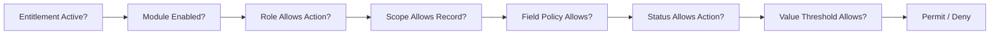

### 12.4 Field-Level Security

Field-level security must define:

- visibility
- editability
- maskability
- exportability
- printability
- filterability
- API exposure
- audit requirement

Sensitive fields:

| Field Group | Examples | Default |
|---|---|---|
| Cost/margin | vendor cost, internal cost, job margin | Hidden unless permission |
| Finance | bank account, payment reference, tax ID | Restricted |
| Payroll | salary, allowance, deduction, tax | HR/payroll only |
| PII | identity number, phone, address | Need purpose/role |
| Security | API key, webhook secret | Masked always; never exported plain |
| Support | impersonation token/grant | Platform security only |

---

## 13. Configuration Engine

Configuration Engine adalah jantung CargoGrid. Ini yang membedakan CargoGrid dari custom software biasa.

### 13.1 Configurable Objects

- Module
- Feature
- Subscription
- Role
- Permission
- Form
- Field
- Workflow
- Approval
- Status
- Numbering
- Notification
- Service
- Document
- Dashboard
- Report
- SLA
- Terminology
- Branding

### 13.2 Metadata Schema Concept

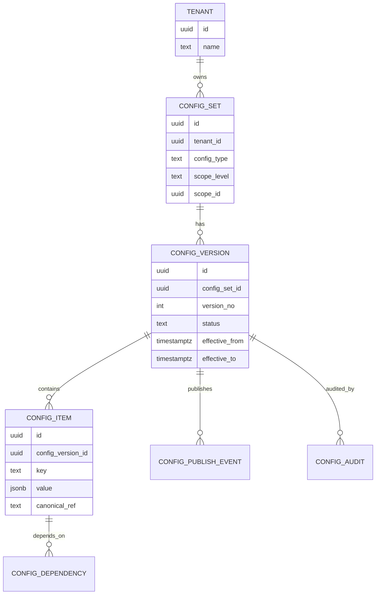

### 13.3 Config Lifecycle

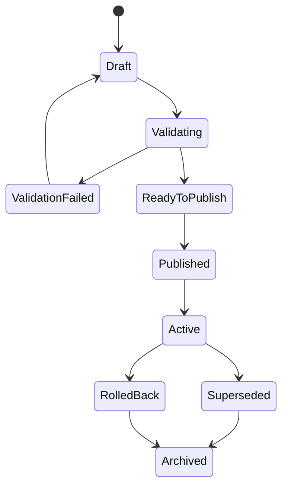

### 13.4 Global Default and Overrides

Override priority:

1. Global default configuration
2. Tenant-level override
3. Company-level override
4. Branch-level override
5. Role-level override
6. User-level override

**Guardrail:** override resolution must be deterministic and auditable. Transaction record should store applied config version for critical workflows.

### 13.5 Dependency Validation

Before publish, system checks:

- Required field exists.
- Status transition has valid start/end.
- Approval approver role exists.
- Numbering pattern unique per scope.
- Notification recipient rule valid.
- Report fields permitted.
- Service references valid cost/revenue component.
- Document template tokens match available data.
- No circular workflow dependency.
- No removal of field used by published workflow/report without migration strategy.

### 13.6 Configuration Caching

- Published configuration can be cached by `tenant_id + config_type + scope + version`.
- Draft config should not be globally cached.
- Cache invalidated on publish/rollback.
- Long-running transaction uses the config version active when transaction started or when business rule says refresh.

### 13.7 Migration of Configuration Version

When config changes:

| Change Type | Migration Rule |
|---|---|
| Add optional field | No migration needed |
| Add required field | Requires default/backfill or only effective for new records |
| Change status label | Safe if canonical status unchanged |
| Remove status | Requires transition mapping |
| Change approval threshold | Effective date required |
| Change numbering | New sequence scope, preserve old numbers |
| Change service rule | Effective only for new quote/job unless manual reprice |
| Change document template | Regenerate only if allowed |

---

## 14. Workflow Engine

Workflow Engine mengatur step, transition, condition, SLA, task, assignment, and automation.

### 14.1 Workflow Definition

Workflow metadata:

| Field | Description |
|---|---|
| `workflow_id` | Unique workflow |
| `entity_type` | lead, quotation, shipment, invoice, ticket, etc. |
| `service_id` | Optional service-specific workflow |
| `scope` | tenant/company/branch |
| `version` | Published version |
| `steps` | Ordered or graph steps |
| `transitions` | Allowed movements |
| `conditions` | Rules |
| `sla` | Due times |
| `actions` | Notifications, assignment, downstream creation |
| `rollback_policy` | Reopen/revision behavior |

### 14.2 Workflow Execution Rules

- Workflow is evaluated server-side.
- Transition must check status permission, actor permission, and data validation.
- Every transition creates event log.
- Workflow step can trigger approval.
- Workflow cannot bypass financial period lock.
- Workflow automation must be idempotent.

---

## 15. Approval Engine

Approval Engine supports:

- Sequential
- Parallel
- Conditional
- Amount threshold
- Margin threshold
- Department
- Role
- User
- Delegation
- Escalation
- SLA
- Rejection
- Revision
- Resubmission

### 15.1 Approval Flow

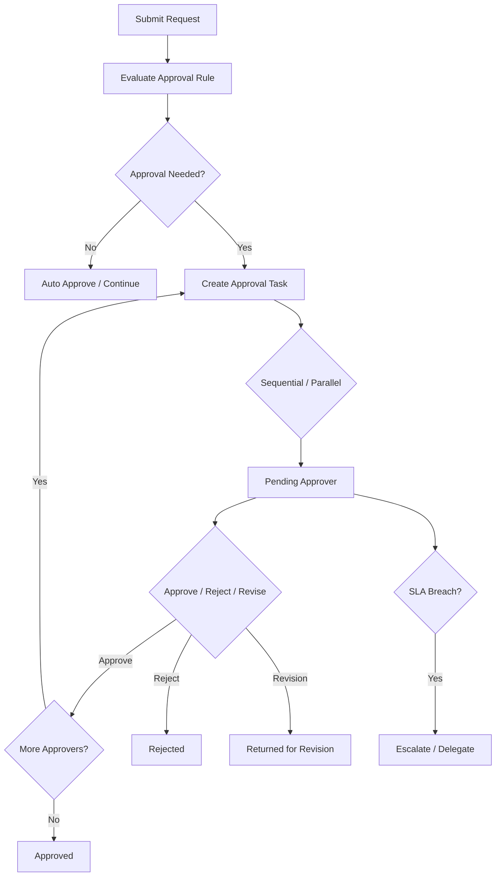

### 15.2 Approval Data

- approval instance
- approval task
- step number
- approver role/user
- delegation source
- threshold rule
- decision
- comment
- decision timestamp
- SLA due
- escalation event
- resubmission counter
- related entity
- before/after snapshot for sensitive request

### 15.3 Approval Guardrails

- Approver cannot approve own request unless rule explicitly allows and is audited.
- Approval threshold cannot be changed retroactively for pending request without config migration policy.
- Rejection requires reason.
- Override requires permission and reason.
- Approval task inherits tenant and record scope.

---

## 16. Notification Engine

Notification Engine handles in-app, email, webhook, and optional WhatsApp/SMS via integration.

### 16.1 Notification Types

| Type | Example | Delivery |
|---|---|---|
| Transaction | Quotation approved, shipment delayed | In-app/email/webhook |
| Approval | Approval pending, SLA breach | In-app/email |
| Operational | Dispatch assigned, milestone updated | In-app/push-like/webhook |
| Customer | Shipment delivered, invoice available | Portal/email |
| System | Password reset, MFA, support access | Email/in-app |
| Integration | Webhook failed, API key expiring | In-app/email/admin |

### 16.2 Notification Architecture

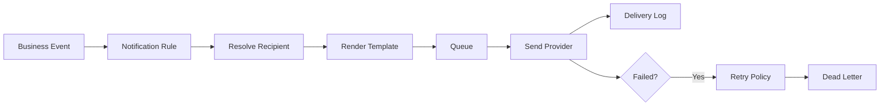

### 16.3 Notification Rules

- Template versioned.
- Recipient rule configurable.
- Delivery channel configurable.
- Customer notification respects customer portal scope.
- Sensitive data not included in insecure channel unless policy allows.
- Retry and failure log required.

---

## 17. Document Engine

Document Engine handles templates, generation, storage, signing/download access, versioning, and document lifecycle.

### 17.1 Document Categories

- Quotation
- Contract
- Shipment document
- ePOD
- Vendor document
- Customer document
- Invoice
- Financial document
- HR document
- Audit document

### 17.2 Document Flow

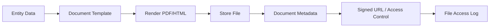

### 17.3 File Security

- File path includes tenant scope but path alone is not security.
- Storage metadata includes tenant_id, record_type, record_id, classification.
- Signed URL expiry short by default.
- Download permission checked before signed URL generation.
- Sensitive document access logged.
- Public bucket forbidden for tenant documents.

---

## 18. Reporting Engine

Reporting Engine serves dashboards, operational reports, financial reports, analytics, and export.

### 18.1 Reporting Layers

| Layer | Use |
|---|---|
| Direct OLTP query | Small/simple operational view |
| Optimized view | Reusable read model |
| Materialized view | Heavy analytics, dashboard aggregates |
| Reporting table | Precomputed KPI and historical snapshots |
| Export job | Large file generation |

### 18.2 Reporting Guardrails

- Reports are tenant-aware and permission-aware.
- Dashboard summary uses pre-aggregation for heavy widgets.
- Financial reports must respect period lock and posted state.
- Export uses async job for large datasets.
- Report builder must prevent exposing restricted fields.
- Cross-tenant SaaS reporting only for Supreme Admin and should aggregate/anonymize when possible.

### 18.3 Reporting Data Flow

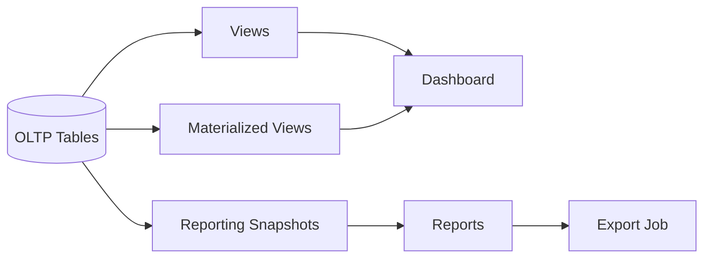

---

## 19. Integration Engine

Integration Engine manages inbound API, outbound API, webhooks, scheduled sync, external event handling, retries, and monitoring.

### 19.1 Integration Pattern

| Pattern | Use |
|---|---|
| Inbound REST API | Customer booking, vendor update, external order |
| Outbound REST API | Send invoice/payment/shipment update to external system |
| Webhook receiver | Payment callback, GPS event, marketplace order |
| Webhook sender | Notify customer system of shipment milestone |
| Batch sync | Master data, rate table, accounting sync |
| File-based import/export | Legacy customer/vendor/finance system |
| n8n orchestration | Low-risk workflow automation and external connector glue |

### 19.2 Integration Data Flow

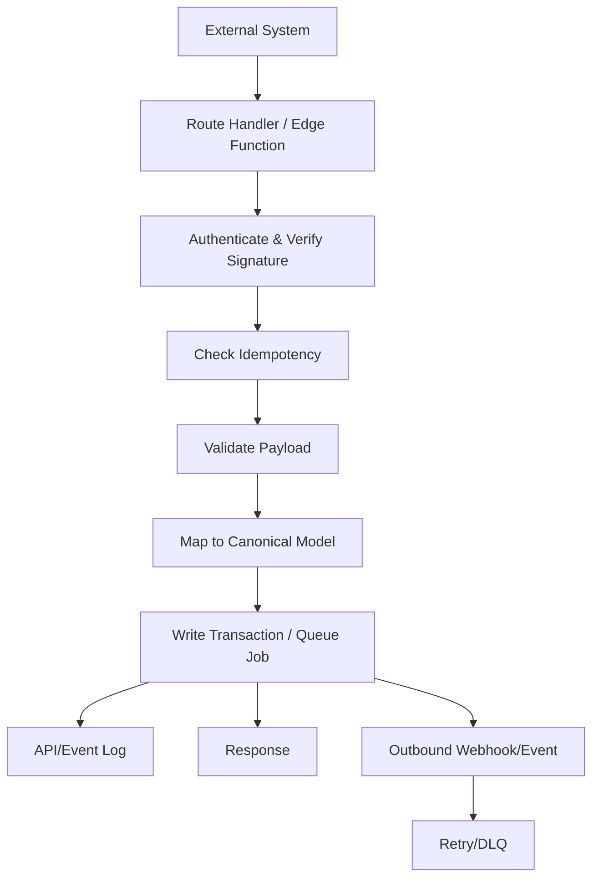

### 19.3 Integration Ownership

Every integration must have:

- business owner
- technical owner
- credential owner
- data owner
- support owner
- SLA/timeout/retry policy
- monitoring dashboard
- runbook

---

## 20. Billing Engine

Billing Engine here means **CargoGrid SaaS subscription billing** and **tenant operational billing capability boundary**.

### 20.1 SaaS Billing

SaaS billing controls:

- subscription plan
- module entitlement
- feature entitlement
- usage metrics
- billing period
- trial/grace/suspension
- invoice generation to tenant
- plan change audit
- limit enforcement

### 20.2 Tenant Operational Billing

Tenant operational billing controls:

- shipment billing readiness
- invoice draft
- invoice approval
- tax calculation
- AR posting
- customer billing document
- customer portal invoice visibility
- payment allocation

**Guardrail:** SaaS subscription billing and tenant operational billing should be separated by domain and permissions.

---

## 21. Loyalty Engine

Loyalty Engine must be ledger-based. Jangan simpan point sebagai angka yang bisa diedit langsung tanpa ledger.

### 21.1 Loyalty Components

- loyalty program
- membership tier
- earning rule
- multiplier
- point ledger
- cashback ledger
- reward catalogue
- redemption request
- approval
- expiration
- fraud control

### 21.2 Loyalty Earning Flow

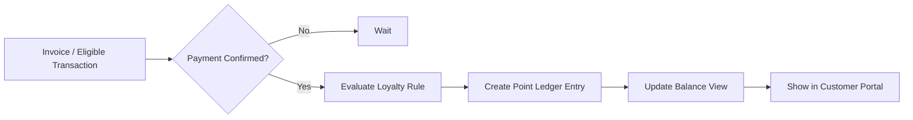

### 21.3 Loyalty Guardrails

- Earning must be idempotent per eligible transaction.
- Point correction via adjustment entry.
- Redemption requires balance check and approval if configured.
- Expiration job creates ledger event.
- Fraud rule can hold earning/redemption.

---

## 22. Audit Architecture

Audit is not a log file afterthought. It is a product feature.

### 22.1 Audit Events

| Event Type | Must Capture |
|---|---|
| Data change | who, when, table/entity, record, before, after, reason |
| Status transition | from, to, actor, workflow version |
| Approval | approver, decision, comment, timestamp, delegation |
| Configuration | config type, version, diff, publish/rollback |
| Auth/security | login, MFA, session revoke, password change |
| Support access | case ID, reason, scope, start/end, action |
| Impersonation | impersonator, target user, reason, session duration |
| API | endpoint, client, request ID, response status |
| File access | file, action, signed URL generation, download |
| Export/import | criteria, row count, file, actor |

### 22.2 Audit Storage

- Append-only table.
- Partition by time for volume.
- Indexed by tenant, entity, actor, timestamp.
- Sensitive before/after values masked or encrypted based on classification.
- Exportable only by privileged users.

### 22.3 Audit Correlation

Use `correlation_id` across:

- request log
- API log
- audit log
- job log
- webhook log
- error trace

---

## 23. Security Architecture

### 23.1 Security Boundary Diagram

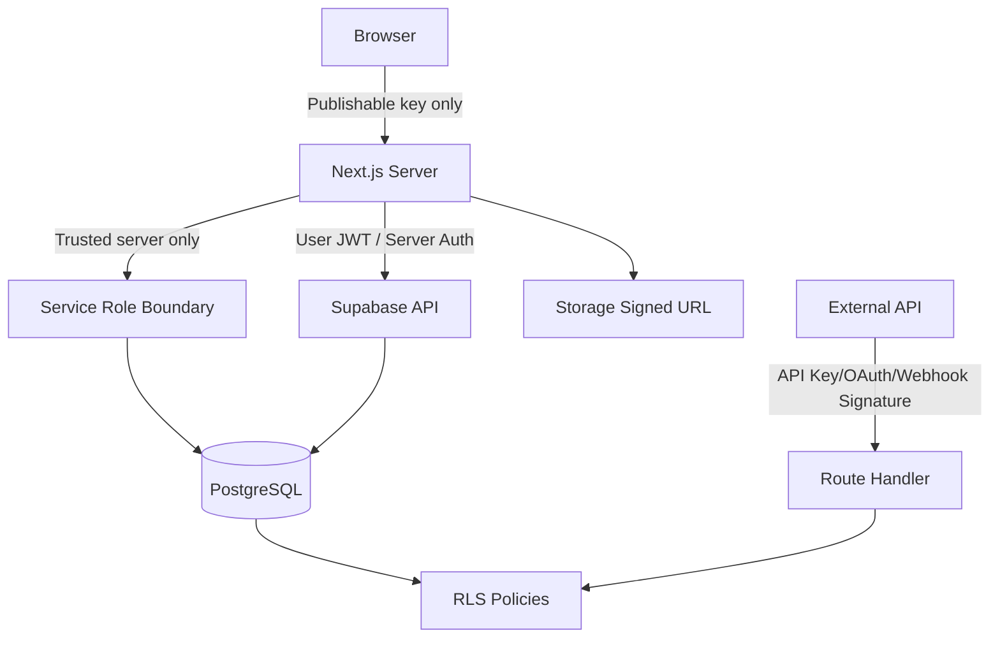

### 23.2 Authentication

- Supabase Auth baseline.
- Email/password and magic link optional based on tenant policy.
- MFA for admin/high-risk roles.
- SSO/SAML enterprise option.
- Password policy configurable within security baseline.
- Session timeout by role/tenant.
- Device/session list and revoke capability.

### 23.3 Authorization

Authorization layers:

1. Entitlement: module/feature subscribed.
2. Tenant membership.
3. RBAC action.
4. Scope check.
5. Field-level policy.
6. Status/value rule.
7. RLS enforcement.
8. Audit for sensitive access.

### 23.4 Optional ABAC

ABAC can be introduced for:

- transaction value
- margin threshold
- shipment service
- customer category
- region
- period lock
- document classification
- support access grant

Use ABAC selectively. Jangan bikin policy engine terlalu kompleks kalau RBAC+scope sudah cukup.

### 23.5 MFA, SSO, OAuth, SAML

| Capability | MVP | Enterprise |
|---|---|---|
| MFA | Admin and privileged roles | Enforced per tenant policy |
| OAuth | Social/enterprise login where needed | Enterprise IdP |
| SAML | Not required for MVP | Enterprise option |
| SCIM | Open Decision | Enterprise provisioning option |
| Session policy | Basic timeout | Conditional/session risk policy |

### 23.6 Token and Session Security

- Never store service role key in browser.
- Use secure HTTP-only cookies where applicable.
- Rotate secrets.
- Revoke sessions on user deactivation.
- Step-up auth for security-sensitive action.
- Session logs available to admin/security.

### 23.7 Encryption and Secret Management

- TLS in transit.
- Encryption at rest via platform capability.
- Secrets stored in environment/secret manager, not source code.
- Webhook secrets hashed/masked.
- API keys shown only once.
- Key rotation with overlap window.

### 23.8 PII, Financial, Payroll Data

Sensitive data categories:

| Category | Example | Control |
|---|---|---|
| PII | ID number, phone, address, personal email | Field-level permission, masking, audit |
| Financial | bank, invoice, payment, journal | Role restriction, immutable posting, audit |
| Payroll | salary, tax, deductions | HR/payroll-only access, extra audit |
| Commercial confidential | cost, margin, pricing | View cost/margin permission |
| Security secret | API key, webhook secret | Secret storage, masked, no export |

### 23.9 Privileged Access

- Supreme Admin elevated access requires reason.
- Support access requires ticket/case.
- Time-bound grants.
- Visible banner during impersonation.
- All actions logged.
- No silent cross-tenant data browsing.

### 23.10 Incident Response

Incident response stages:

1. Detect.
2. Triage.
3. Contain.
4. Eradicate.
5. Recover.
6. Notify if required.
7. Post-incident review.
8. Control improvement.

---

## 24. Financial Integrity

Finance is where sloppy architecture becomes expensive. CargoGrid must treat financial data differently from operational drafts.

### 24.1 Double-entry Accounting

Every posted accounting transaction must balance:

```text
sum(debit) = sum(credit)
```

Journal posting requires:

- valid chart of accounts
- period open
- currency rule valid
- exchange rate available if foreign currency
- tax rule valid
- subledger reference where applicable
- idempotency key
- audit event

### 24.2 Draft and Posted Transactions

| State | Editable? | Rule |
|---|---|---|
| Draft | Yes | Normal edit with audit |
| Submitted | Limited | Depends approval |
| Approved | Limited | Only allowed fields |
| Posted | No direct edit | Reversal/adjustment only |
| Reversed | No | Linked to reversal journal |
| Locked period | No | No posting unless reopen period with approval |

### 24.3 Subledger and General Ledger

- AR invoice posts to AR subledger and GL.
- Vendor invoice posts to AP subledger and GL.
- Payment/receipt allocates subledger and cash/bank.
- Job profitability reads revenue/cost from operational and financial references.
- Reconciliation links bank movement to payments.

### 24.4 Multi-currency

Rules:

- Store transaction currency, functional currency, exchange rate, exchange rate source, and rate date.
- Rounding rule configurable.
- FX gain/loss handling required for settlement.
- Exchange rate changes do not mutate historical posted journal.

### 24.5 Idempotent Posting

Every posting operation must have idempotency key:

```text
tenant_id + source_entity_type + source_entity_id + posting_type + posting_version
```

Duplicate posting attempt returns existing result, not duplicate journal.

---

## 25. API Standard

### 25.1 REST Recommendation

REST is recommended for public/integration API first. GraphQL is not baseline. Reason: operational ERP integration with customers/vendors is easier to secure, document, version, rate-limit, and audit with REST.

### 25.2 Endpoint Naming

```text
/api/v1/tenants/{tenant_id}/shipments
/api/v1/tenants/{tenant_id}/shipments/{shipment_id}
/api/v1/tenants/{tenant_id}/bookings
/api/v1/tenants/{tenant_id}/webhooks/events
/api/v1/tenants/{tenant_id}/exports
```

For custom domain/customer API, tenant can be inferred from token/domain, but server still validates.

### 25.3 API Request Standard

Headers:

```text
Authorization: Bearer <token>
Idempotency-Key: <uuid>
X-CargoGrid-Request-Id: <uuid>
X-CargoGrid-Signature: <signature>  # webhook
```

### 25.4 Pagination

| Pagination | Use |
|---|---|
| Offset | Small stable master list |
| Cursor | Large changing list |
| Keyset | Shipment events, audit logs, inventory ledger, tickets |
| Async export | Large full data extraction |

### 25.5 Filter and Sort

Use explicit allowlist:

```text
GET /api/v1/shipments?status=in_transit&branch_id=...&sort=-created_at&limit=50&cursor=...
```

Do not allow arbitrary SQL-like filter from client.

### 25.6 Error Schema

```json
{
  "error": {
    "code": "SHIPMENT_NOT_FOUND",
    "message": "Shipment not found or not accessible.",
    "details": [],
    "request_id": "req_123",
    "timestamp": "2026-07-13T10:00:00+07:00"
  }
}
```

### 25.7 Rate Limiting

Rate limit by:

- tenant
- API client
- user
- endpoint category
- IP/device where needed

### 25.8 Webhook Signature

Outbound webhook must include:

- event ID
- event type
- timestamp
- signature
- delivery attempt
- idempotency key

Receiver validates timestamp tolerance and signature.

### 25.9 Long-running Job Pattern

1. Client creates job.
2. API returns `job_id`.
3. Worker processes job.
4. Client polls job or receives webhook.
5. Result stored with signed download URL if file.

---

## 26. Integration Standard

### 26.1 Integration Category Matrix

| Category | Direction | Trigger | Protocol | Auth | Payload | Retry | Timeout | Error Handling | Idempotency | Monitoring | Security | Ownership |
|---|---|---|---|---|---|---|---|---|---|---|---|---|
| Email | Outbound | Notification/document | SMTP/API | Provider key | Template + recipient | Yes | 10–30s | Retry/DLQ | Message ID | Delivery log | No sensitive fields by default | Platform/tenant |
| WhatsApp | Outbound | Shipment/customer alert | Provider API | Token | Template approved | Yes | 10–30s | Retry/fallback | Message key | Provider status | Mask sensitive data | Tenant/Integration |
| SMS | Outbound | OTP/alert fallback | Provider API | Token | Short message | Yes | 10–30s | Retry/fallback | Message key | Delivery status | Minimal data | Platform |
| Google Maps | Outbound | Route/location | API | API key | Coordinates/address | Limited | 5–10s | Graceful fallback | Request hash | API quota | Restrict key | Ops/Product |
| GPS/Telematics | Inbound/Outbound | Location event | API/webhook | API key/OAuth | Vehicle location | Yes | 5–30s | Queue stale events | Event ID | Device health | Tenant mapping | Ops/Integration |
| Shipping line | Inbound/Outbound | Vessel/container status | API/file | API/OAuth | Container/vessel event | Yes | 30s | Retry/manual review | Carrier event ID | Sync status | Contracted API | Ops |
| Airline | Inbound/Outbound | AWB tracking | API/file | API/OAuth | AWB event | Yes | 30s | Retry/manual | AWB event key | Sync dashboard | Contracted API | Ops |
| Port/Airport | Inbound | Milestone/status | API/file | Token | Gate/arrival event | Yes | 30s | Manual exception | Event key | Sync dashboard | Validate source | Ops |
| Customs | Inbound/Outbound | Clearance status | API/file | Government auth | Declaration/status | Controlled | 30–60s | Manual compliance path | Declaration key | Compliance log | Strict audit | Compliance/Ops |
| Banking | Inbound/Outbound | Payment/reconciliation | API/file | OAuth/cert | Statement/payment | Yes | 30s | Reconciliation exception | Bank ref | Finance monitor | Strong secret control | Finance |
| Payment gateway | Inbound/Outbound | Payment callback | API/webhook | Signature | Payment status | Yes | 30s | Signature fail reject | Payment ref | Payment monitor | Webhook signing | Finance |
| E-invoice/Tax | Outbound/In | Tax invoice | API/file | Cert/API | Tax doc/status | Yes | 30–60s | Compliance exception | Tax doc ID | Tax log | Strict access | Finance/Tax |
| External accounting | Outbound/In | Journal/invoice sync | API/file | OAuth/API key | Journal/invoice | Yes | 60s | Reconciliation queue | Source posting key | Sync status | Finance data control | Finance |
| HR/Attendance | Inbound/Outbound | Attendance/payroll | API/file | API key | Employee/attendance | Yes | 30s | HR exception | Attendance ID | Sync status | PII protection | HR |
| Marketplace/e-commerce | Inbound | Order/booking | API/webhook | OAuth/signature | Order/shipment | Yes | 30s | Reject/queue invalid | Order ID | Order sync | Token security | Commercial/Ops |
| Customer API | Inbound/Outbound | Booking/tracking/invoice | REST/webhook | OAuth/API key | Canonical payload | Yes | 30s | Structured error | Idempotency key | API log | Tenant scope | Customer/Integration |
| Vendor API | Inbound/Outbound | Rate/status/invoice | REST/webhook | API key/OAuth | Vendor payload | Yes | 30s | Vendor exception | Vendor event ID | Vendor sync | Vendor scope | Procurement |
| n8n | Both | Orchestration | Webhook/API | Secret/OAuth | Workflow payload | Yes | Configured | Workflow error queue | Workflow run ID | n8n logs + CargoGrid log | Least privilege | Integration |

### 26.2 Integration Guardrails

- Every inbound write has idempotency.
- Every outbound webhook has retry and DLQ.
- Failed integration must create operational exception if business-critical.
- Third-party downtime should not block core transaction unless the external status is mandatory.
- Integration credentials are tenant-scoped where possible.
- Payload must map to canonical entity, not arbitrary custom table.

---

## 27. DevOps

### 27.1 Environment Strategy

| Environment | Purpose | Data |
|---|---|---|
| Local | Developer work | Seed/sample only |
| Development | Shared dev integration | Synthetic/sample |
| Testing | Automated QA | Synthetic controlled |
| Staging | Production-like release test | Masked/anonymized where needed |
| UAT | Customer validation | Migrated test data with approval |
| Production | Live tenant | Real data |

### 27.2 Branching

**Proposed Default: trunk-based with short-lived branches**.

- `main`: production-ready.
- feature branches short-lived.
- PR mandatory for code changes.
- Migration reviewed.
- Security-sensitive changes require architecture/security review.

### 27.3 Test Pyramid

| Test Type | Coverage |
|---|---|
| Unit | Business rules, validators, utility functions |
| Integration | Server actions, route handlers, DB functions |
| RLS tests | Tenant isolation and scope |
| E2E | Critical flows: lead→quote→job→shipment→invoice |
| Performance | Large table, dashboard, import/export |
| Security | Auth, permission, file access, API |
| Migration | DB migration up/down/safe deploy |
| Financial | Posting, reversal, period lock, reconciliation |

### 27.4 Feature Flags

Feature flag supports:

- tenant
- module
- feature
- environment
- role/user cohort
- rollout percentage
- effective date
- rollback

Feature flag must not bypass security checks.

---

## 28. CI/CD

### 28.1 Pipeline

```mermaid
flowchart LR
    COMMIT[Commit/PR] --> LINT[Lint/Typecheck]
    LINT --> TEST[Unit/Integration Tests]
    TEST --> RLS[RLS/Security Tests]
    RLS --> BUILD[Build]
    BUILD --> MIG[Migration Check]
    MIG --> DEPLOY[Deploy Preview/Staging]
    DEPLOY --> E2E[E2E/Smoke Test]
    E2E --> APPROVE[Manual Gate if Prod]
    APPROVE --> PROD[Production Deploy]
    PROD --> MON[Post-deploy Monitoring]
```

### 28.2 Database Migration

Migration rules:

- Versioned migrations.
- Backward-compatible where possible.
- No destructive migration without backup and approval.
- Large backfill as background job.
- RLS policy migration tested.
- Financial table migration requires extra review.

### 28.3 Rollback

| Layer | Rollback Strategy |
|---|---|
| Frontend | Re-deploy previous build |
| API | Versioned endpoint / previous deploy |
| DB schema | Forward-fix preferred; down migration only if safe |
| Config | Config rollback via version |
| Feature | Feature flag disable |
| Data | Restore only for disaster; business correction for transactions |

---

## 29. Environments

### Environment Configuration

| Item | Local | Dev | Testing | Staging | UAT | Production |
|---|---|---|---|---|---|---|
| Auth | Local/test | Dev | Test | Staging | UAT | Production |
| DB | Local Supabase | Shared dev | Test DB | Prod-like | UAT DB | Production DB |
| Storage | Local/test | Dev bucket | Test bucket | Staging bucket | UAT bucket | Prod bucket |
| External integration | Mock | Sandbox | Mock/sandbox | Sandbox | Customer sandbox | Production |
| Secrets | Local env | Dev secrets | Test secrets | Staging secrets | UAT secrets | Prod secrets |
| Observability | Optional | Basic | Test logs | Full | Full | Full + alert |

### Seed Data

Seed data must include:

- tenant
- company/branch
- roles/permissions
- user admin/internal/customer
- sample customer/vendor
- service
- quotation
- shipment
- invoice
- ticket
- test config

Seed must not contain real customer PII.

---

## 30. Observability

### 30.1 Signals

| Signal | Examples |
|---|---|
| Logs | app log, API log, job log, webhook log, auth/security log |
| Metrics | latency, error rate, throughput, DB query duration, queue depth |
| Traces | request → server action/API → DB → external call |
| Audit | business/security change |
| Alerts | Sev1 errors, auth anomaly, RLS failure, job backlog, webhook failure |

### 30.2 Key Dashboards

- Application health.
- API health.
- Database performance.
- Slow query.
- Queue/job health.
- Integration health.
- Tenant usage and errors.
- Security events.
- Financial posting exceptions.
- Storage usage.
- Import/export jobs.

### 30.3 Alert Examples

| Alert | Threshold |
|---|---|
| API p95 latency | > performance budget for 10 minutes |
| Error rate | >1% critical endpoints |
| DB CPU/connection saturation | sustained high usage |
| Slow query | query >2 seconds repeated |
| Queue backlog | oldest job age > SLA |
| Webhook failure | repeated failed attempts |
| Cross-tenant policy test failure | immediate Sev1 |
| Storage signed URL anomaly | unusual volume |

---

## 31. Backup and Recovery

### 31.1 Backup Requirements

| Data | Backup |
|---|---|
| PostgreSQL OLTP | Automated backup + PITR where plan supports |
| Storage objects | Version/lifecycle policy and backup strategy |
| Configuration | Versioned and exportable |
| Audit logs | Retained according policy |
| Secrets | Managed separately; not in DB dump |
| Integration config | Exportable/migratable with masking |

### 31.2 RPO/RTO Proposed Defaults

| Tier | RPO | RTO |
|---|---|---|
| MVP baseline | 15 minutes | 4 hours |
| Scale-up | 5–15 minutes | 2–4 hours |
| Enterprise | Contract-defined | Contract-defined |

### 31.3 Recovery Testing

- Quarterly restore rehearsal.
- Tenant-level logical export test.
- Storage restore test.
- Config rollback test.
- Financial reconciliation after restore.
- Incident runbook test.

---

## 32. Performance

Bagian ini sengaja detail. CargoGrid tidak boleh terasa berat. ERP logistics yang lambat akan kalah dari spreadsheet dan WhatsApp.

### 32.1 Performance Budget

| Area | Proposed Budget |
|---|---|
| Common list API p95 | ≤500 ms excluding external dependency |
| Detail API p95 | ≤700 ms normal entity |
| Dashboard initial shell | ≤2.5 sec LCP target on decent connection |
| Large table first page | ≤1 sec server response for indexed query |
| Search typeahead | ≤300 ms debounced response |
| Export job start | ≤2 sec acknowledgement |
| Import validation start | ≤2 sec acknowledgement |
| Background job delay | ≤60 sec for normal priority |
| Webhook response | ≤5 sec for acknowledgement; heavy work async |
| Realtime update | ≤3 sec for scoped operational events |

Targets harus divalidasi lewat load test; angka di atas adalah **Proposed Default**.

### 32.2 Server-side Data Fetching

- Data-heavy page fetch server-side.
- Use query modules with allowlisted columns.
- Apply RLS and permission.
- Avoid client-side waterfall.
- Compose screen data in one server boundary when reasonable.

### 32.3 Selective Columns and Avoid `SELECT *`

Bad:

```sql
select * from shipments where tenant_id = $1;
```

Better:

```sql
select id, shipment_no, customer_id, service_id, origin_name, destination_name,
       canonical_status, eta_at, updated_at
from shipments
where tenant_id = $1
order by updated_at desc
limit 50;
```

### 32.4 Avoid N+1

Use:

- joins where safe
- precomputed read model
- lateral joins for specific summary
- batch query by IDs
- view/materialized view for dashboards
- avoid per-row API call from client

### 32.5 Pagination

| Type | Use | Notes |
|---|---|---|
| Offset | Small master data | Easy but slow for deep pages |
| Cursor | High-volume list | Use stable cursor column |
| Keyset | Event/audit/inventory ledger | Best for append-heavy data |
| Async export | Full dataset | User downloads when ready |

### 32.6 Index Strategy

Core index patterns:

```sql
create index idx_shipments_tenant_status_updated
on app.shipments (tenant_id, canonical_status, updated_at desc);

create index idx_shipments_tenant_customer_updated
on app.shipments (tenant_id, customer_account_id, updated_at desc);

create index idx_milestones_shipment_time
on app.shipment_milestones (tenant_id, shipment_id, occurred_at desc);

create index idx_invoices_tenant_status_due
on app.invoices (tenant_id, canonical_status, due_date);

create index idx_audit_tenant_entity_time
on app.audit_logs (tenant_id, entity_type, entity_id, occurred_at desc);
```

Use partial indexes for common active filters:

```sql
create index idx_active_vendor_rates
on app.vendor_rates (tenant_id, service_id, origin_id, destination_id, valid_until)
where status = 'active' and deleted_at is null;
```

Use GIN/GiST selectively:

- GIN for JSONB config search and full-text search.
- GiST/SP-GiST for geospatial if PostGIS is introduced.
- Trigram for fuzzy customer/vendor/location search if enabled.

### 32.7 Query Plan Review

- Every high-volume query must pass `EXPLAIN ANALYZE` review.
- Slow query threshold Proposed Default: 500ms for common API, 2s for complex report query.
- Review queries after data volume grows, not only at development seed size.

### 32.8 Connection Pooling

- Use pooling for serverless/Next.js deployment.
- Avoid opening too many direct DB connections.
- Long-running jobs use controlled concurrency.
- Reporting workload must not starve OLTP.

### 32.9 Read Optimization

- Use views/read models for complex list screen.
- Use materialized views for analytics.
- Use pre-aggregated dashboard tables.
- Use cache for published configuration.
- Use selective payload.

### 32.10 Write Optimization

- Batch inserts for import.
- Use transactions for atomic operations.
- Use idempotency key.
- Use optimistic concurrency on record edit.
- Avoid triggers that perform heavy external call.
- Create events and let worker process async side effects.

### 32.11 Background Jobs and Queue

Use jobs for:

- bulk import
- export
- report generation
- notification batch
- webhook retry
- document/PDF generation
- dashboard refresh
- loyalty expiration
- recurring billing
- integration sync

Job table fields:

- job_id
- tenant_id
- job_type
- status
- priority
- payload
- attempts
- max_attempts
- locked_by
- locked_until
- error
- result_url
- created_by
- created_at
- completed_at

### 32.12 Materialized Views and Reporting Tables

Use materialized views for:

- shipment performance dashboard
- AR aging
- job profitability summary
- vendor performance
- sales pipeline summary
- warehouse inventory aging
- ticket SLA summary

Refresh strategy:

- scheduled refresh
- event-triggered refresh for small scope
- incremental reporting table for high volume
- never refresh huge materialized view synchronously on user request

### 32.13 Realtime Scope Limitation

Realtime allowed for:

- current dispatch board
- active shipment timeline
- approval notification counter
- ticket assignment
- warehouse task queue

Realtime not allowed for:

- all shipment rows globally
- all audit logs
- finance posting stream
- full dashboard data

### 32.14 API Rate Limiting and Payload Minimization

- Enforce per tenant/API client.
- Return only requested/allowed fields.
- Support sparse fieldsets for public API where useful.
- Compress responses.
- Reject overly broad queries.

### 32.15 File Upload Strategy

- Direct-to-storage signed upload where safe.
- Store metadata after upload.
- Virus/malware scan Proposed Default for enterprise/high-risk document.
- Chunk upload for large files if needed.
- File type/size validation by document category.
- Background thumbnail/PDF generation.

### 32.16 Export and Large Report

- Export always async for large dataset.
- Export respects permission and field security.
- Export criteria stored in audit log.
- Generated file has expiry.
- Sensitive export may require approval.

### 32.17 Webhook Retry and Dead-letter

Retry pattern:

- immediate retry for transient error
- exponential backoff
- max attempts
- DLQ after failure
- manual replay by authorized admin
- idempotency to avoid duplicate effects

---

## 33. Scalability

### 33.1 Scale Dimensions

| Dimension | Scaling Strategy |
|---|---|
| Tenants | Shared schema + tenant-aware indexes |
| Users | Session/cache strategy, permission cache |
| Shipments | Partitioning, keyset pagination, read model |
| Milestones/events | Append-only table, partitioning |
| Documents | Object storage lifecycle |
| Dashboard | Pre-aggregation |
| API | Rate limit, async jobs |
| Integration | Queue/worker/DLQ |
| Finance | Period-based partitioning/reporting views |
| Audit | Time partitioning/archive |

### 33.2 Partitioning Candidates

- audit_logs by month/quarter
- shipment_events/milestones by time or tenant/time
- inventory_ledger by tenant/warehouse/time
- api_logs by time
- webhook_delivery_logs by time
- notification_logs by time
- point_ledger by tenant/time

Partition only after volume justifies it. Premature partitioning makes migration harder.

### 33.3 When to Split Services

Split only if one or more is true:

- independent scaling requirement
- strict security isolation
- independent deployment needed
- heavy compute workload harming core app
- separate team ownership mature enough
- third-party integration workload unstable

Candidate future splits:

- reporting/analytics
- integration worker
- document generation
- notification service
- AI/OCR service
- data warehouse pipeline

---

## 34. Architecture Risks

| Risk ID | Risk | Impact | Likelihood | Mitigation |
|---|---|---:|---:|---|
| ARCH-R01 | RLS policy salah dan cross-tenant data exposure | Critical | Medium | RLS test suite, default deny, security review |
| ARCH-R02 | Configuration engine terlalu fleksibel sampai sulit dites | High | High | Canonical model, config versioning, dependency validation, template limits |
| ARCH-R03 | ERP terasa lambat karena over-fetching | High | High | Server-side table, selective query, indexes, performance budget |
| ARCH-R04 | Financial posting tidak immutable | Critical | Low-Med | Posted journal guardrail, reversal only, finance tests |
| ARCH-R05 | Workflow/approval logic hardcoded per tenant | High | Medium | Metadata-driven rule engine, no tenant-specific backend forks |
| ARCH-R06 | Supabase service role bocor ke browser | Critical | Low | Secret scanning, lint rule, architecture guardrail |
| ARCH-R07 | Realtime disalahgunakan untuk semua data | High | Medium | Realtime approval process, scoped channels |
| ARCH-R08 | Integration retry membuat duplicate transaction | High | Medium | Idempotency keys, event ID tracking |
| ARCH-R09 | Export membocorkan restricted fields | Critical | Medium | Field-level export policy, export audit, approval for sensitive export |
| ARCH-R10 | Dashboard menghantam OLTP database | High | Medium | Materialized views, reporting tables, pre-aggregation |
| ARCH-R11 | Tenant-specific customization berubah jadi source-code fork | High | High | Product governance, config-first design, paid extension policy |
| ARCH-R12 | Backup restore belum pernah dites | Critical | Medium | Scheduled DR tests |
| ARCH-R13 | White-label custom domain salah mapping tenant | Critical | Low-Med | Verified domain, cache invalidation, domain ownership proof |
| ARCH-R14 | Large import merusak data quality | High | Medium | Staging validation, preview, rollback batch, audit |
| ARCH-R15 | Payroll/PII access terlalu luas | Critical | Medium | Field security, masking, audit, HR role isolation |

---

## 35. ADR

| ADR ID | Decision | Status | Rationale | Consequence |
|---|---|---|---|---|
| ADR-001 | Use Next.js App Router as frontend/server boundary | Accepted | Fixed stack and supports server-first architecture | Need discipline on Client Component boundary |
| ADR-002 | Use Supabase Auth + PostgreSQL RLS | Accepted | Fixed stack and strong tenant isolation primitive | RLS policy design/testing becomes mandatory |
| ADR-003 | Start with modular monolith | Proposed Default | Faster delivery, lower distributed-system overhead | Need clear domain boundaries to avoid big-ball-of-mud |
| ADR-004 | Use shared DB shared schema as default tenancy | Proposed Default | Efficient SaaS operation and easier release | Requires strict RLS and tenant-aware indexing |
| ADR-005 | Offer dedicated enterprise instance later | Proposed Default | Supports enterprise isolation/residency | Operational complexity and pricing needed |
| ADR-006 | Use REST for public/integration API first | Proposed Default | Easier enterprise integration, versioning, security | Less flexible than GraphQL but more controllable |
| ADR-007 | Use materialized views/reporting tables for heavy analytics | Accepted | Protect OLTP performance | Need refresh strategy and staleness labeling |
| ADR-008 | Use ledger pattern for finance, inventory, loyalty | Accepted | Auditability and correction discipline | More complex than direct balance mutation |
| ADR-009 | Use Server Actions for internal mutations where appropriate | Proposed Default | Simple form mutation with server authority | Not for public API/integration |
| ADR-010 | Use Edge Functions selectively, not for all backend logic | Proposed Default | Avoid fragmentation | Some integration code may sit outside Next.js |
| ADR-011 | Use async job pattern for import/export/report/webhook retry | Accepted | Prevent timeout and improve reliability | Requires job monitoring and worker strategy |
| ADR-012 | Configuration is versioned and effective-dated | Accepted | Tenant customization without chaos | More metadata complexity |

---

## 36. Architecture Reference Diagrams

### 36.1 Data Flow Diagram

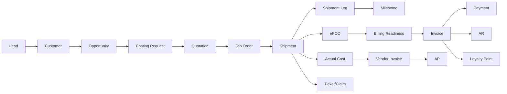

### 36.2 Integration Diagram

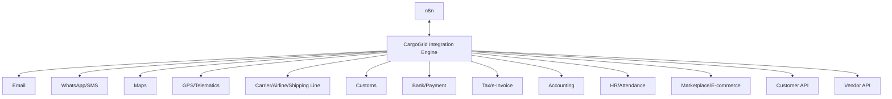

### 36.3 Security Boundary Diagram

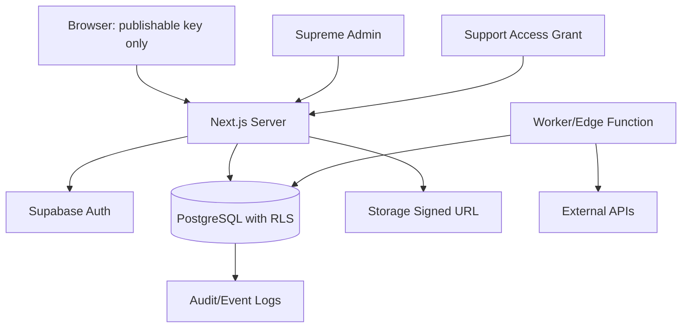

---

## 37. Implementation Sequencing

| Phase | Technical Focus | Must Not Skip |
|---|---|---|
| MVP Foundation | Tenant, Auth, RLS, RBAC, config skeleton, audit, master data | RLS tests, service role guardrail |
| Commercial MVP | Lead, CRM, quote, costing request, approval | No duplicate customer, margin permission |
| Operations MVP | Job, shipment, milestone, ePOD, document | Shipment status audit, signed file access |
| Finance MVP | Billing readiness, invoice, AR/AP, journal basics | Immutable posted journal, idempotent posting |
| Scale-up TMS/WMS | Advanced route/load/WMS/inventory ledger | Keyset pagination, inventory ledger |
| Procurement/Vendor | Vendor rate, assessment, performance, invoice matching | Rate validity and vendor compliance |
| Enterprise | SSO, dedicated instance, advanced audit, residency | Security review and DR test |

---

## 38. Architecture Acceptance Criteria

CargoGrid technical architecture is acceptable when:

- Every tenant-owned table has RLS or approved exception.
- Every high-volume list has server-side filter/sort/pagination.
- Every sensitive field has field-level security policy.
- Every financial posted record is immutable.
- Every integration mutation has idempotency.
- Every export respects permission and audit.
- Every configuration object supports draft/publish/version/rollback.
- Every support/impersonation action is logged.
- Every file download uses permission check and signed URL.
- Every critical workflow has end-to-end test.
- Every release passes RLS regression test.
- Every dashboard heavy query uses optimized read model/pre-aggregation.
- Every migration has rollback/forward-fix plan.
- Every Sev1 incident has runbook.

---

## 39. Open Decisions

| ID | Open Decision | Owner | Needed Before |
|---|---|---|---|
| OD-001 | Final hosting provider for Next.js production | CTO/DevOps | Production deployment |
| OD-002 | Queue technology: Supabase-native pattern, external queue, or managed worker queue | CTO | Heavy import/export |
| OD-003 | Dedicated enterprise instance commercial policy | CPO/CTO/Commercial | Enterprise sales |
| OD-004 | Data residency countries/regions | Legal/CTO | Regional expansion |
| OD-005 | SSO/SAML provider support matrix | CTO/Security | Enterprise package |
| OD-006 | Whether to introduce PostGIS for geospatial route/location | Operations/Data | Advanced TMS |
| OD-007 | Analytics architecture: reporting schema vs external warehouse | Data/CTO | Scale-up analytics |
| OD-008 | OCR/AI service boundary | CTO/Product | Intelligence phase |
| OD-009 | Native mobile timeline | Product/Engineering | Field operations scale |
| OD-010 | SCIM provisioning | Security/Enterprise Product | Enterprise IAM |

---

## 40. Source References for Architecture Team

This specification aligns with the following source documents and official technical references:

- `CargoGrid_Product_Concept_Brief.md`
- `01_CargoGrid_Project_Product_Charter.md`
- `02_CargoGrid_Business_Process_Product_Requirements_Blueprint.md`
- `03_CargoGrid_UX_Data_Access_Design.md`
- Next.js official documentation for App Router, Server Components, Server Actions, Route Handlers, fetching, caching, and revalidation.
- Supabase official documentation for Auth, Row-Level Security, securing data/API, Edge Functions, Storage, Realtime, API keys, database webhooks, and secrets.
- PostgreSQL official documentation for indexes, partial indexes, views, materialized views, refresh materialized views, and query planning.
- OWASP ASVS and OWASP Cheat Sheets for application security verification, authentication, session management, and API security.

---

# Appendix A — MVP Architecture Checklist

| Area | Checklist |
|---|---|
| Tenant | tenant_id on all tenant-owned tables |
| Auth | Supabase Auth integrated server-side |
| RLS | Policies enabled and tested |
| RBAC | Action/scope/field permissions |
| Config | Draft/publish/version/rollback |
| API | Versioned route handlers |
| Performance | No full dataset browser load |
| Storage | Signed URL and file access log |
| Audit | Append-only audit log |
| Jobs | Async import/export/report |
| Finance | Immutable posting basics |
| Observability | Logs, metrics, alerts |
| Backup | Backup and restore rehearsal |

# Appendix B — Scale-up Architecture Checklist

| Area | Checklist |
|---|---|
| Query | EXPLAIN ANALYZE for high-volume screens |
| Index | Composite/partial indexes for common filters |
| Pagination | Cursor/keyset for high-volume event tables |
| Reporting | Materialized views/reporting tables |
| Queue | Worker + retry + DLQ |
| Integration | Monitoring dashboard and runbooks |
| Storage | Lifecycle policy |
| Audit | Partitioning/archive |
| Release | Canary/feature flags |
| Security | Pen test and threat model |

# Appendix C — Enterprise Architecture Checklist

| Area | Checklist |
|---|---|
| IAM | SSO/SAML, MFA policy, IP restriction |
| Tenancy | Dedicated instance option |
| Audit | SIEM export, extended retention |
| Data | Residency and retention controls |
| Security | Advanced key/secret rotation |
| Compliance | DPA, privacy review, incident SLA |
| Support | Time-bound access grants |
| DR | Contractual RPO/RTO |
| Integration | Dedicated API limits and sandbox |
| Change | Tenant release window |
