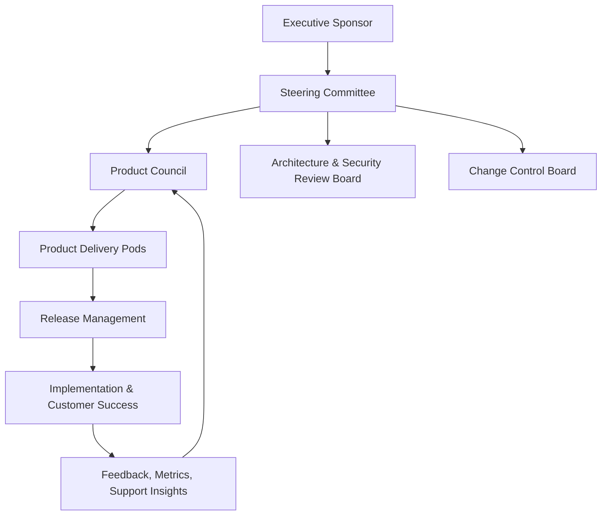
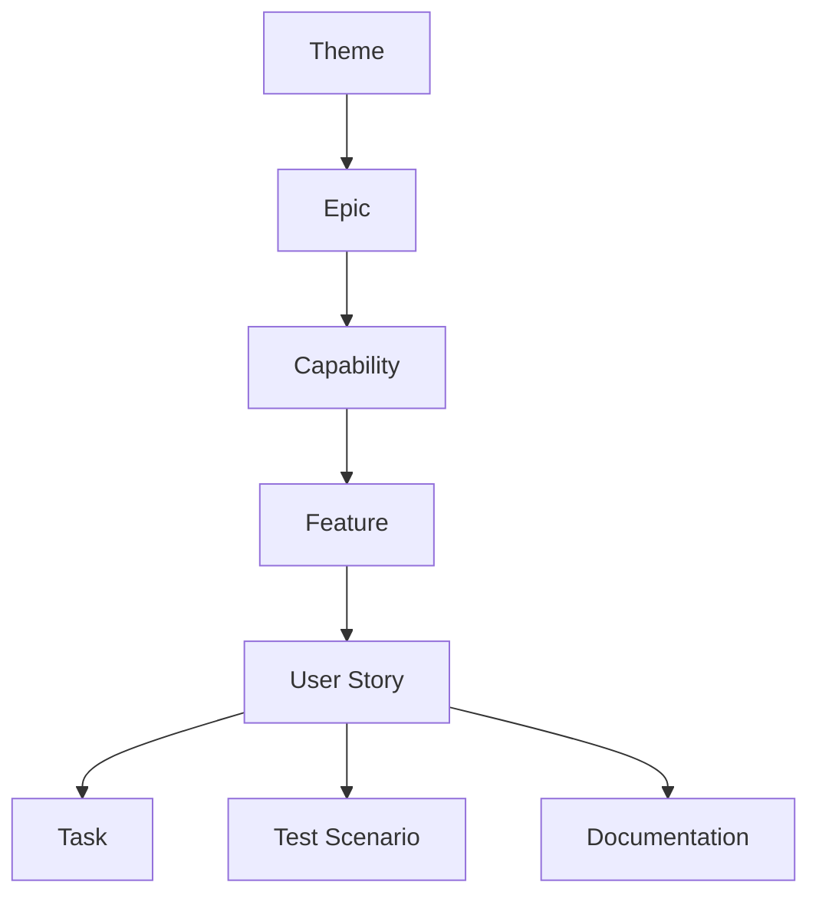
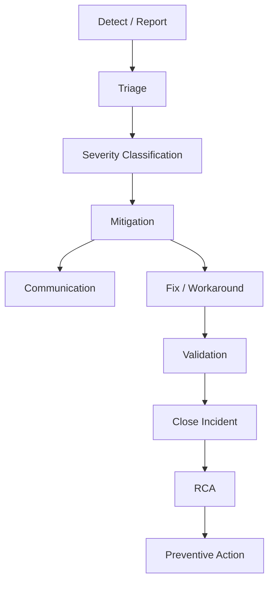
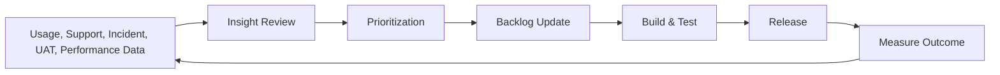

# CargoGrid Delivery, Testing & Go-Live Plan

**Document ID:** CG-DTGL-005  
**Version:** 1.0 Draft  
**Status:** Draft for Product, Engineering, QA, DevOps, Implementation, Support, Customer Success, and Management Review  
**Product:** CargoGrid  
**Target Output File:** `05_CargoGrid_Delivery_Testing_GoLive_Plan.md`  
**Primary Source of Truth:** `CargoGrid_Product_Concept_Brief.md`  
**Secondary Context:** `01_CargoGrid_Project_Product_Charter.md`, `02_CargoGrid_Business_Process_Product_Requirements_Blueprint.md`, `03_CargoGrid_UX_Data_Access_Design.md`, dan `04_CargoGrid_Technical_Architecture_Security_Integration.md`  
**Language:** Bahasa Indonesia profesional dengan istilah English untuk SaaS, logistics, finance, software, architecture, security, QA, DevOps, dan implementation.  
**Prepared Date:** 2026-07-13  

---

## 0. Document Control

Dokumen ini menjadi acuan delivery, development, testing, deployment, tenant onboarding, training, support, hypercare, dan continuous improvement untuk CargoGrid.

Dokumen ini tidak mengganti `CargoGrid_Product_Concept_Brief.md`. Semua keputusan yang sudah menjadi **Confirmed Product Decision** tetap dipertahankan:

- CargoGrid adalah SaaS ERP untuk perusahaan 3PL, cargo company, freight forwarder, trucking company, warehouse operator, distribution company, project logistics provider, dan in-house logistics operation.
- CargoGrid menggunakan **multi-tenant SaaS**, **white-label platform**, **modular subscription**, **Row-Level Security/RLS**, **Role-Based Access Control/RBAC**, **configurable workflow**, **configurable module**, **configurable role and permission**, **configurable service**, **configurable approval**, **configurable business process**, dan **configurable operational process**.
- Seluruh konfigurasi tenant harus dilakukan melalui UI tanpa perubahan source code backend.
- Stack tetap: **Next.js**, **TypeScript**, **React**, **Supabase**, **PostgreSQL**, **Supabase Auth**, **Supabase Row-Level Security**, **Supabase Storage**, dan komponen Supabase lain secara selektif.
- Data harus single source of truth, tidak redundant, dan terhubung secara direksional-transaksional antar-module.
- Sistem harus cepat, efisien, scalable, aman, audit-ready, dan enterprise-ready.

### Decision Labels

| Label | Meaning |
|---|---|
| **Confirmed Product Decision** | Keputusan dari Product Concept Brief. Tidak boleh diubah tanpa formal change control. |
| **Proposed Default** | Default awal untuk delivery dan implementation. Bisa diubah melalui governance. |
| **Delivery Gate** | Syarat formal sebelum work item, release, tenant onboarding, atau go-live boleh lanjut. |
| **Test Gate** | Syarat quality/testing yang wajib lulus sebelum promosi environment atau production. |
| **Open Decision** | Area yang belum matang dan harus masuk decision backlog. |

---

## 1. Source of Truth Alignment

| Area | Confirmed Product Decision yang Dipertahankan | Implikasi Delivery, Testing, dan Go-Live |
|---|---|---|
| Product model | SaaS ERP multi-tenant, white-label, modular subscription. | Release, test data, tenant onboarding, feature flag, training, dan support harus tenant-aware dan entitlement-aware. |
| Access model | Supreme Admin, User Admin, Internal Organizational User, Customer User. | Semua test plan harus memvalidasi 4 layer access, RLS, RBAC, field-level security, customer scope, support access, dan impersonation. |
| Configurability | Workflow, approval, form, field, status, numbering, service, report, dashboard, API, webhook melalui UI. | Configuration Engine harus dibangun dan dites sebelum delivery terlalu jauh ke tenant-specific customization. |
| No backend code change | Tenant configuration tidak boleh membutuhkan backend code change. | Change request tenant harus diklasifikasi menjadi configuration, product enhancement, integration extension, atau rejected customization. |
| End-to-end data flow | Lead → CRM → opportunity → costing → quotation → job → shipment → ePOD → invoice → payment → loyalty. | UAT utama harus end-to-end, bukan hanya module-by-module. |
| Single source of truth | Data hanya input sekali dan dipakai ulang antar-module. | Test scenario wajib memverifikasi conversion dan data lineage tanpa re-keying. |
| Security | Strict tenant isolation, RLS, RBAC, audit trail, signed URL, support access control. | Tenant isolation test dan security test menjadi release blocker. |
| Performance | Sistem tidak boleh lemot, berat, atau melakukan excessive client-side fetching. | Performance gate wajib sebelum release high-volume module, dashboard, import/export, dan reporting. |
| Finance | Double-entry accounting dan immutable posted journal. | Financial integrity test menjadi blocker untuk Finance MVP dan production finance go-live. |

---

## 2. Assumption Register

| ID | Assumption / Proposed Default | Rationale | Owner | Validation Point |
|---|---|---|---|---|
| DTG-A01 | Delivery menggunakan Agile dengan phase-gated release. | CargoGrid butuh iterasi cepat, tapi ERP perlu gate ketat untuk security, finance, dan go-live. | Delivery Lead | Sprint 0 |
| DTG-A02 | Modular monolith first menjadi delivery baseline. | Mengurangi delivery overhead sebelum domain maturity terbukti. | CTO / Delivery Lead | Architecture review |
| DTG-A03 | MVP tidak memuat semua module. | Product breadth sangat besar; memaksa semua masuk MVP akan kacau. | CPO | Roadmap gate |
| DTG-A04 | Platform Core, tenant isolation, identity, configuration, audit, dan entitlement selesai sebelum pilot tenant serius. | Foundation lebih penting dari fitur cantik. | CTO / QA Lead | Phase 1 exit |
| DTG-A05 | UAT utama memakai skenario end-to-end lead-to-cash dan shipment-to-billing. | CargoGrid harus membuktikan transactional linkage, bukan sekadar screen CRUD. | Product / Implementation | UAT planning |
| DTG-A06 | Tenant onboarding dibagi Standard, Fast-track, dan Enterprise. | Kompleksitas tenant berbeda; satu metode onboarding tidak akan efektif. | Implementation Lead | Commercial packaging |
| DTG-A07 | Semua tenant production memakai feature flag untuk module activation dan controlled rollout. | Mengurangi risiko release dan support blast radius. | DevOps / Product | Release gate |
| DTG-A08 | Automated test suite mencakup RLS, RBAC, tenant isolation, workflow, approval, dan financial posting. | Manual testing saja tidak cukup untuk SaaS multi-tenant. | QA Lead | CI/CD gate |
| DTG-A09 | Penetration test wajib sebelum General Availability dan sebelum enterprise deployment besar. | CargoGrid mengelola data operasional, financial, payroll, dan customer. | Security Lead | Pre-GA gate |
| DTG-A10 | Performance test dijalankan per phase dengan scenario yang relevan, bukan hanya sekali menjelang go-live. | Bottleneck ERP biasanya muncul bertahap saat volume data naik. | DevOps / QA | Release gate |
| DTG-A11 | Data migration dilakukan minimal dua kali rehearsal untuk tenant Enterprise. | Data quality adalah sumber go-live failure terbesar. | Data Migration Lead | Cutover readiness |
| DTG-A12 | Hypercare minimum 2 minggu untuk Standard, 4 minggu untuk Enterprise. | ERP go-live butuh stabilisasi user dan data. | Customer Success | Contract/SOW |
| DTG-A13 | Support SLA berbeda antara production incident, implementation issue, data issue, dan feature request. | Tidak semua ticket harus diperlakukan seperti incident. | Support Lead | Support readiness |
| DTG-A14 | Financial module tidak go-live tanpa opening balance, AR/AP reconciliation, tax setup, period lock rule, dan posting test. | Salah financial posting dampaknya berat. | Finance SME / QA | Finance UAT |
| DTG-A15 | Release tidak boleh naik production jika ada open Sev-1/critical security/tenant isolation/financial defect. | Risk appetite harus jelas. | Steering Committee | Go/no-go |
| DTG-A16 | Documentation update menjadi bagian Definition of Done. | ERP SaaS tanpa dokumentasi akan membunuh support dan onboarding. | Product / CS | Sprint review |
| DTG-A17 | Import/export besar wajib asynchronous. | Mencegah timeout dan degraded UX. | Engineering | Performance gate |
| DTG-A18 | Tenant-specific customization harus ditolak jika memerlukan source-code fork. | Bertentangan dengan confirmed product decision. | CPO / CTO | Change control |
| DTG-A19 | DR test dilakukan minimal sebelum GA dan setelah perubahan besar pada backup/recovery architecture. | Backup yang tidak pernah diuji itu ilusi. | DevOps / Security | DR gate |
| DTG-A20 | Implementation partner hanya boleh mengubah configuration dalam delegated scope. | Menjaga platform integrity. | Partner Lead / Security | Partner onboarding |

---

## 3. Delivery Strategy

Strategi delivery CargoGrid harus disiplin. Product scope terlalu luas untuk dibangun dengan pendekatan “semua module jalan bersamaan”. Cara yang benar adalah **foundation-first, transaction-first, security-first, performance-gated, and tenant-controlled release**.

### 3.1 Delivery Principles

| Principle | Delivery Rule | Gate |
|---|---|---|
| Foundation before feature | Tenant, identity, RLS/RBAC, entitlement, audit, configuration base, master data, document, notification, dan integration primitive harus tersedia sebelum module kompleks. | Phase 1 exit gate |
| Tenant security before onboarding | Tidak ada tenant pilot production sebelum tenant isolation, role/permission, storage policy, API token policy, dan support access test lulus. | Tenant onboarding gate |
| Configuration engine before customization | Tenant variation diselesaikan lewat metadata/configuration, bukan hardcoded branch. | Change control gate |
| Core transactions before advanced analytics | Lead, quote, job, shipment, ePOD, invoice, payment, dan basic dashboard lebih penting daripada analytics berat. | Roadmap gate |
| Operational integrity before visual polish | Status lifecycle, assignment, milestone, exception, ePOD, dan audit harus valid sebelum UI dipoles terlalu jauh. | UAT gate |
| Financial integrity before automation | Double-entry, immutable journal, period lock, reversal, AR/AP, reconciliation harus aman sebelum auto posting besar. | Finance go-live gate |
| Progressive release | Internal alpha → design partner beta → controlled pilot → limited availability → GA. | Release governance |
| Controlled pilot | Pilot dibatasi tenant, module, user, data volume, integration, dan support window. | Pilot approval |
| Feature flags | Module dan high-risk feature wajib bisa diaktif/nonaktifkan per tenant/cohort. | Release gate |
| Automated tests | Unit, integration, API, RLS, RBAC, tenant isolation, regression, dan smoke test masuk CI/CD. | CI gate |
| Continuous documentation | User guide, admin guide, release notes, known issue, API docs, dan support playbook diperbarui tiap release. | Definition of Done |
| Auditability | Change penting harus tercatat: config, approval, financial, import/export, impersonation, support access, API/webhook. | QA/security gate |
| Backward compatibility | Public API, webhook, export schema, and customer-facing workflow harus punya deprecation path. | Architecture review |
| Performance gates | High-volume screens dan jobs harus lolos performance budget. | Performance gate |
| Measurable acceptance | Setiap phase punya exit criteria, test gate, security gate, performance gate, business acceptance. | Phase gate |

### 3.2 Delivery Model

```mermaid
flowchart LR
    DISC[Discovery & Product Blueprint] --> ARCH[Architecture & UX/Data Design]
    ARCH --> BACKLOG[Backlog Shaping]
    BACKLOG --> BUILD[Agile Build]
    BUILD --> QA[Continuous QA]
    QA --> REL[Release Candidate]
    REL --> UAT[UAT & Business Acceptance]
    UAT --> PILOT[Controlled Pilot]
    PILOT --> GO[Go-Live]
    GO --> HYP[Hypercare]
    HYP --> PIR[Post-Implementation Review]
    PIR --> IMP[Continuous Improvement]
    IMP --> BACKLOG
```

### 3.3 MVP Delivery Boundary

**Proposed Default:** MVP CargoGrid adalah **Phase 1 + Phase 2 + minimum vertical slice Phase 3**.

MVP harus membuktikan:

- Tenant provisioning.
- Four-layer access.
- RLS/RBAC.
- Configurable organization, role, permission, workflow, approval, status, numbering.
- Lead and CRM.
- Opportunity and costing request.
- Quotation, margin, approval, versioning, customer acceptance.
- Job order and basic shipment lifecycle.
- Milestone update and exception.
- ePOD and document.
- Basic actual cost and job profitability.
- Basic customer tracking.
- Basic invoice readiness.

MVP tidak boleh dipaksa memuat full WMS, full Finance, full HRIS, full Loyalty, advanced AI, native mobile, atau enterprise multi-region.

---

## 4. Development Methodology

CargoGrid menggunakan **Agile product delivery with ERP-grade governance**. Agile dipakai untuk mengurangi risiko salah bangun. Governance dipakai untuk mencegah security leakage, financial defect, dan tenant go-live yang prematur.

### 4.1 Operating Cadence

| Cadence | Activity | Owner | Output |
|---|---|---|---|
| Daily | Engineering/QA stand-up | Scrum Master / Tech Lead | Blocker, progress, risk |
| 2-weekly | Sprint planning, sprint review, retrospective | Product + Delivery | Sprint backlog, demo, improvement |
| Weekly | Product triage | Product Manager | Backlog refinement, decision log |
| Weekly | Architecture/security review for high-risk items | CTO / Security Lead | ADR, exception decision |
| Weekly | QA defect triage | QA Lead | Defect priority and release risk |
| Biweekly | Implementation readiness review | Implementation Lead | Tenant onboarding readiness |
| Monthly | Steering committee | Sponsor / CPO / CTO | Phase gate, budget, risk |
| Per release | Go/no-go | Release Manager | Release decision |
| Per tenant | Onboarding and UAT review | Implementation + Customer | Tenant acceptance |

### 4.2 Delivery Artifacts

| Artifact | Purpose | Owner | Update Frequency |
|---|---|---|---|
| Product backlog | Source of work | Product Manager | Continuous |
| Sprint backlog | Committed sprint scope | Scrum Master / Team | Sprint planning |
| Requirement spec | Functional and data clarity | Business Analyst | Before development |
| UX/design spec | Screen, state, flow, behavior | UX/UI Designer | Before development |
| Architecture Decision Record | Technical decision traceability | Architect | As needed |
| Test plan | Test coverage and scenarios | QA Lead | Per release |
| Test evidence | Proof of quality | QA | Per test execution |
| Release note | User/admin/technical changes | Product + Release Manager | Per release |
| Migration plan | Data readiness and reconciliation | Data Migration Lead | Per tenant |
| Cutover plan | Go-live execution | Implementation Lead | Per go-live |
| Support playbook | Incident and support handling | Support Lead | Per release/tenant |
| PIR report | Lessons learned and outcome | Customer Success | Post hypercare |

---

## 5. Product Organization

CargoGrid delivery harus dikelola sebagai product organization, bukan project custom per customer. Ini penting. Kalau delivery berubah menjadi “customer A minta begini, customer B minta begitu, semua di-code”, CargoGrid akan mati sebagai SaaS.

### 5.1 Product Governance

### 5.2 Governance Responsibilities

| Body | Responsibility | Decision Authority |
|---|---|---|
| Steering Committee | Funding, major scope, phase gate, enterprise risk, commercial commitment | Strategic |
| Product Council | Roadmap, MVP boundary, product standard, backlog priority | Product |
| Architecture & Security Review Board | Architecture, security, data, RLS, performance, integration, DevOps | Technical/Security |
| Change Control Board | Change request, tenant-specific requirement, timeline/budget impact | Delivery/Commercial |
| Release Board | Release go/no-go, deployment readiness, rollback decision | Operational |
| Customer Acceptance Board | UAT sign-off, data migration acceptance, go-live acceptance | Tenant-specific |

---

## 6. Team Structure

### 6.1 Minimum Team

Minimum team cukup untuk Phase 0–3 controlled MVP. Jangan pura-pura bisa membangun full ERP dengan 2 developer dan 1 desainer.

| Role | Minimum FTE | Responsibility |
|---|---:|---|
| Product Owner | 1 | Outcome, backlog priority, acceptance, roadmap alignment |
| Product Manager | 1 | Discovery, requirement, roadmap, release scope |
| Business Analyst | 1 | Process, BRD/FRD, business rules, UAT scenario |
| Logistics SME | 0.5–1 | TMS, shipment, forwarding, warehouse, vendor process validation |
| Finance SME | 0.25–0.5 | Billing, AR/AP, journal, financial integrity |
| UX Designer | 1 | User flow, IA, wireframe, interaction/state |
| UI Designer | 0.5 | Design system and UI polish |
| Frontend Developer | 2 | Next.js, React, UI, server/client boundary |
| Backend Developer | 2 | App logic, API, workflow, integration |
| Supabase/PostgreSQL Engineer | 1 | Schema, RLS, query performance, migrations |
| QA Engineer | 1–2 | Functional, integration, regression, UAT evidence |
| Automation QA | 0.5–1 | Automated tests, CI test suites |
| DevOps / Release Manager | 0.5–1 | Environments, CI/CD, deployment, monitoring |
| Security Engineer | 0.25–0.5 | Security review, RLS testing, vulnerability management |
| Implementation Consultant | 1 | Tenant configuration, training, UAT, go-live |
| Customer Success | 0.5 | Adoption, hypercare, outcome tracking |
| Technical Support | 0.5 | Support workflow and incident response |
| Data Analyst | 0.5 | Product metrics, reporting, test data, migration validation |

### 6.2 Scale-up Team

Scale-up team diperlukan mulai Phase 4–9, terutama saat Finance, WMS, Procurement, HRIS, Customer Portal, Loyalty, and Enterprise Expansion masuk.

| Role | Scale-up FTE | Trigger |
|---|---:|---|
| Product Owner | 2–4 | Multi-domain ownership: Platform, Commercial/Ops, Finance/WMS, CX/HRIS |
| Product Manager | 2–4 | Parallel discovery and release planning |
| Business Analyst | 3–6 | Module-level requirements and tenant implementation |
| Logistics SME | 2–3 | TMS/WMS/forwarding/project logistics depth |
| Finance SME | 1–2 | Accounting, tax, AR/AP, reconciliation, multi-currency |
| HRIS SME | 1 | Attendance, payroll, recruitment, performance |
| UX Designer | 2–3 | Admin, internal ERP, customer portal, mobile task flows |
| UI Designer | 1–2 | Design system maturity |
| Frontend Developer | 5–8 | Multiple product pods |
| Backend Developer | 5–8 | Domain logic, integration, engines |
| Supabase/PostgreSQL Engineer | 2–3 | Performance, RLS, partitioning, reporting schema |
| QA Engineer | 4–8 | Module and regression coverage |
| Automation QA | 2–4 | CI/CD gates and E2E automation |
| DevOps | 2 | Environments, release, observability, DR |
| Security Engineer | 1–2 | AppSec, IAM, penetration, compliance readiness |
| Implementation Consultant | 3–8 | Tenant onboarding and rollout |
| Customer Success | 2–5 | Adoption and renewal |
| Technical Support | 2–6 | L1/L2 support |
| Data Analyst | 1–3 | Product analytics, migration, dashboard validation |

### 6.3 Product Pods

| Pod | Scope | Core Roles |
|---|---|---|
| Platform Pod | Tenant, auth, RLS/RBAC, config, audit, notification, document, integration foundation | PO, architect, backend, DB, frontend, QA, security |
| Commercial Pod | Lead, CRM, opportunity, costing request, quotation, contract, customer pricing | PM, BA, frontend, backend, QA, logistics SME |
| Operations Pod | Job, shipment, TMS, milestone, ePOD, actual cost, tracking | PM, logistics SME, frontend, backend, QA |
| Finance Pod | Billing, AR/AP, payment, GL, journal, period lock, profitability | PM, finance SME, backend, DB, QA |
| WMS/Procurement Pod | WMS, inventory, vendor, procurement, rate, performance | PM, logistics SME, backend, frontend, QA |
| CX/People Pod | Customer portal, loyalty, ticketing, HRIS | PM, UX, frontend, backend, QA |
| Platform Reliability Pod | CI/CD, performance, observability, security, DR | DevOps, DB engineer, security, QA automation |

---

## 7. RACI

Legend: **R** Responsible, **A** Accountable, **C** Consulted, **I** Informed.

| Workstream | Sponsor | CPO/PO | CTO/Architect | Delivery Lead | Engineering | QA | Security | DevOps | Implementation | CS/Support | Customer |
|---|---:|---:|---:|---:|---:|---:|---:|---:|---:|---:|---:|
| Roadmap and phase scope | A | R | C | C | I | I | I | I | C | I | I |
| Backlog refinement | I | A/R | C | R | C | C | C | I | C | I | I |
| UX and requirement readiness | I | A | C | R | C | C | C | I | C | I | C |
| Architecture decision | I | C | A/R | C | C | C | C | C | I | I | I |
| Development | I | C | C | R | A/R | C | C | C | I | I | I |
| Automated testing | I | C | C | C | R | A/R | C | C | I | I | I |
| Security testing | I | C | C | C | C | R | A/R | C | I | I | I |
| Tenant isolation testing | I | C | A | C | R | R | A/R | C | I | I | I |
| Performance testing | I | C | A | C | R | R | C | A/R | I | I | I |
| Data migration | I | C | C | C | C | R | C | C | A/R | C | C |
| UAT | I | C | I | C | I | C | I | I | A/R | C | A/R |
| Deployment | I | I | C | C | R | C | C | A/R | I | I | I |
| Go/no-go | A | A | A | R | C | C | C | C | C | C | C |
| Hypercare | I | C | C | C | C | C | C | C | A/R | A/R | C |
| Incident management | I | C | C | R | R | C | C | A/R | C | A/R | I |
| Post-implementation review | I | A | C | R | C | C | C | C | R | R | C |

---

## 8. Release Plan

Roadmap release mengikuti phase dari Product Charter dan tidak memasukkan semua module ke MVP. Setiap phase harus melewati exit criteria, test gate, performance gate, security gate, dan business acceptance.

| Phase | Objective | Scope | Deliverables | Dependencies | Team | Exit criteria | Test gate | Performance gate | Security gate | Business acceptance | Risks |
|---|---|---|---|---|---|---|---|---|---|---|---|

| Phase 0: Discovery and Foundation | Memastikan problem, target, domain model, roadmap, architecture baseline, delivery model, dan pilot readiness jelas. | Product discovery, process map, source-of-truth alignment, initial backlog, delivery governance, architecture runway, QA strategy baseline. | Product Concept Brief, SMEs, sponsor alignment. | CPO, PM, BA, Architect, UX, QA Lead, Delivery Lead, Logistics SME, Finance SME. | Charter/blueprint aligned, initial backlog ready, risks logged, pilot candidate identified, architecture direction approved. | Requirement review, acceptance of discovery artifacts, test strategy peer review. | Baseline performance budget drafted; no load test yet. | Initial threat model, access model, and RLS strategy drafted. | Sponsor accepts phase scope and MVP boundary. | False consensus, over-broad scope, domain misunderstanding. |

| Phase 1: Platform Core | Membangun foundation SaaS yang secure, configurable, tenant-aware, dan testable. | Tenant, subscription, feature flag, auth, RLS/RBAC, organization, user, role, permission, audit, notification, document, master data, configuration base, CI/CD. | Phase 0, architecture decision, environment readiness. | Platform Pod, DB Engineer, Security, DevOps, QA Automation, UX. | Tenant provisioning works, RLS/RBAC baseline passes, audit works, config draft/publish/rollback works, CI/CD test gates active. | Unit, API, RLS, RBAC, tenant isolation, audit, smoke, regression baseline. | p95 common internal read <= 500 ms for normal query; no full dataset browser load; server-side pagination works. | No tenant table without RLS; service role restricted; storage signed URL policy tested. | Internal acceptance by Product, CTO, Security, QA. | RLS gaps, overcomplicated config engine, weak automation. |

| Phase 2: Commercial MVP | Membuktikan lead-to-approved quotation tanpa duplicate entry. | Lead, CRM, account, contact, opportunity, costing request, vendor/rate comparison basic, quotation, approval, document generation, customer acceptance. | Phase 1, customer/service/vendor master, approval engine. | Commercial Pod, Platform Pod, Logistics SME, QA, UX. | Lead converted to opportunity/customer, quote approved, versioned, accepted, and ready for job conversion. | Functional, workflow, approval, document, role/permission, regression, UAT commercial. | Quotation list/search under budget; approval action <= target; document generation async if heavy. | Cost/margin visibility controlled; customer data scope enforced. | Sales/process owner signs off commercial UAT. | Margin leakage, duplicate customer, quote version conflict. |

| Phase 3: Operations MVP | Membuktikan accepted quote-to-shipment execution-to-ePOD-to-basic billing readiness. | Job order, shipment, shipment planning, assignment, milestone, exception, ePOD, document, actual cost, customer tracking basic. | Phase 1–2, service/milestone config, document engine. | Operations Pod, Logistics SME, Platform, QA, Implementation. | Real shipment flow completed; milestone visible; ePOD captured; actual cost logged; billing readiness flagged. | End-to-end UAT, TMS basic, ePOD, customer tracking, tenant isolation, storage access. | High-volume milestone scenario passes; table pagination works; file upload within target. | Customer cannot access other customer shipment/ePOD; field access validated. | Ops/customer user signs off pilot scenario. | Mode complexity, mobile usability, status inconsistency. |

| Phase 4: Finance MVP | Menghubungkan operational completion ke billing, AR/AP, payment, and profitability dengan financial integrity. | Invoice, billing readiness, AR, AP, payment/receipt, job profitability, basic GL/journal, period lock, reversal. | Phase 3, finance data model, chart of accounts, tax/payment term. | Finance Pod, Finance SME, DB Engineer, QA, Security. | Posted journal immutable; invoice/payment/journal reconciled; AR/AP aging works; profitability traceable. | Financial integrity test, accounting UAT, idempotent posting, reconciliation test. | Invoice generation and journal posting within budget; batch posting async where needed. | Financial data field-level security; posted transaction mutation blocked. | Finance Manager signs off with reconciliation evidence. | Accounting defect, period lock gap, rounding/currency issue. |

| Phase 5: Advanced TMS and WMS | Memperluas scale dan operational depth. | Multi-leg, multimodal, dispatch board, route/load planning, GPS integration, WMS inbound, putaway, inventory, picking, packing, outbound, warehouse billing. | Phase 3–4, WMS master data, integration primitives. | Ops Pod, WMS/Procurement Pod, Logistics SME, QA, DevOps. | Advanced operational scenarios pass; inventory reconciles; dispatch performance acceptable. | WMS/TMS test, scan/task flow, inventory ledger, load/performance, integration. | High-volume warehouse transaction and dispatch board pass; cursor pagination for ledgers/events. | Warehouse/customer inventory access isolated; realtime scope limited. | Warehouse/operations signs off. | Inventory mismatch, realtime overload, integration instability. |

| Phase 6: Procurement and Vendor Management | Mengendalikan vendor lifecycle, sourcing, rate, capacity, performance, and invoice matching. | Vendor registration, onboarding, assessment, compliance, rate/pricelist, sourcing, RFQ, comparison, PO, contract, performance, vendor invoice matching. | Phase 1, Phase 3/4 data flows. | Procurement Pod, Finance Pod, Logistics SME, QA. | Vendor rate flows into costing; vendor invoice matched to shipment/PO/cost; performance tracked. | Vendor lifecycle, rate validity, AP matching, approval, data import. | Rate search/comparison within budget; vendor import async. | Vendor banking/tax data protected; vendor portal scope if enabled. | Procurement/Finance signs off. | Bad vendor data, rate validity conflict, AP mismatch. |

| Phase 7: HRIS and Ticketing | Membangun workforce management dan service control. | Employee, position, recruitment, attendance, shift, leave, overtime, payroll foundation, KPI, training, internal/customer/CargoGrid ticketing, SLA, escalation. | Phase 1, organization/role config, ticket linkage design. | CX/People Pod, HRIS SME, QA, Security. | Attendance/leave/ticket SLA flows pass; payroll foundation protected; ticket linkage works. | HRIS, ticket SLA, access, payroll data, workflow, notification. | Ticket dashboard and thread performance acceptable; attachment handling async/signed. | Payroll/personal data masked; ticket scope enforced. | HR/Support signs off. | Payroll localization, sensitive data leakage, ticket noise. |

| Phase 8: Customer Portal and Loyalty | Memperluas self-service customer dan engagement. | Quote request, booking, tracking, warehouse/inventory portal, document/ePOD, invoice/billing/payment visibility, ticket, loyalty, reward, account management. | Phase 2–7, portal access model, loyalty rules. | CX/People Pod, Commercial/Ops/Finance pods, QA, Security. | Customer portal end-to-end works; loyalty earning/redemption rule works; customer access isolated. | Customer UAT, portal scope, loyalty calculation, reward approval, payment visibility. | Customer dashboard pre-aggregated; tracking loads fast; file access signed. | Customer cannot access other company/account/site data; reward fraud controls tested. | Customer admin and tenant sponsor sign off. | Portal data leakage, loyalty liability calculation, customer adoption. |

| Phase 9: Intelligence, Automation, and Enterprise Expansion | Menambahkan automation, AI-assisted capabilities, enterprise hardening, and expansion controls. | AI-assisted quotation, predictive ETA, OCR, optimization, fraud detection, advanced analytics, SSO/SAML, dedicated instance, multi-region/data residency option. | Mature data, security, observability, enterprise demand. | Platform Reliability, Data/AI, Security, Product, DevOps. | Automation has governance; enterprise controls tested; AI outputs auditable and not autonomous for critical actions. | Model governance, enterprise security, regression, performance, integration. | Analytics/AI jobs isolated from OLTP; queue and reporting workload stable. | SSO/MFA/IP/audit/dedicated instance controls pass. | Enterprise customer and security review sign off. | AI accuracy, compliance, cost, operational complexity. |

### 8.1 Release Types

| Release Type | Purpose | Approval Required | Example |
|---|---|---|---|
| Internal alpha | Validasi internal flow, architecture, and UX | Product + Engineering | Platform core preview |
| Design partner beta | Validasi dengan tenant terbatas dan data terbatas | Product + Implementation + Security | Commercial MVP |
| Controlled pilot | Production-like execution for selected tenant | Release Board + Tenant Sponsor | Lead-to-shipment pilot |
| Limited availability | Module tersedia untuk tenant yang lolos readiness | Steering + Product | Operations MVP |
| General availability | Module siap dijual dan di-onboard lebih luas | Steering Committee | Platform/Core package |
| Hotfix | Perbaikan production bug | Release Manager + QA + Product | Critical bug fix |
| Security patch | Vulnerability remediation | Security + CTO | Auth/session/storage fix |

### 8.2 Release Matrix

| Module | MVP | Phase | Release Approach | Key Gate |
|---|---:|---|---|---|
| Platform Foundation | Yes | 1 | Internal alpha → controlled pilot | RLS/RBAC/tenant isolation |
| Commercial | Yes | 2 | Design partner beta → pilot | Lead-to-quote UAT |
| CRM | Yes | 2 | Beta → pilot | Activity/pipeline quality |
| Quotation | Yes | 2 | Beta → pilot | Approval, margin, versioning |
| Shipment | Yes | 3 | Controlled pilot | Shipment lifecycle/ePOD |
| TMS Basic | Yes | 3 | Controlled pilot | Milestone/dispatch basics |
| WMS | No | 5 | Limited availability | Inventory reconciliation |
| Procurement | No | 6 | Limited availability | Vendor rate/AP matching |
| Vendor Management | No | 6 | Limited availability | Compliance/performance |
| Finance MVP | Partial | 4 | Controlled pilot | Financial integrity |
| Accounting Full | No | 4+ | Limited availability | GL/statement reconciliation |
| HRIS | No | 7 | Limited availability | Payroll/personal data |
| Ticketing | No | 7 | Limited availability | SLA/escalation |
| Customer Portal Basic | Partial | 3/8 | Controlled pilot | Customer scope isolation |
| Loyalty | No | 8 | Limited availability | Point/reward calculation |
| Reporting | Partial | 1+ | Progressive | Performance and permission |
| Integration | Partial | 1+ | Progressive | Retry/idempotency/security |
| Configuration Engine | Yes | 1 | Internal alpha → pilot | Draft/publish/rollback |

---

## 9. Product Backlog

Backlog CargoGrid harus dikelola secara productized. Setiap item wajib menunjukkan business value, risk, complexity, dependency, release, data impact, security, dan performance consideration.

### 9.1 Backlog Hierarchy

| Level | Definition | Example |
|---|---|---|
| Theme | Outcome besar lintas module | Secure Multi-Tenant Platform |
| Epic | Major product area | Tenant & Subscription Management |
| Capability | Business capability | Module Entitlement |
| Feature | Implementable feature | Activate/deactivate module per tenant |
| User Story | User-centered requirement | As Supreme Admin, I can activate module for tenant |
| Task | Engineering/QA/UX work | Create entitlement table, RLS policy, test suite |

### 9.2 Backlog Item Template

| Field | Required | Description |
|---|---|---|
| ID | Yes | Unique ID, e.g., `PLT-TNT-US-001` |
| Description | Yes | What is being delivered |
| Business value | Yes | Why it matters |
| User | Yes | Actor/persona/layer |
| Priority | Yes | P0/P1/P2/P3 |
| Dependency | Yes | Upstream requirement, data, config, integration |
| Risk | Yes | Security, performance, domain, finance, UX, migration |
| Complexity | Yes | S/M/L/XL |
| Release | Yes | Phase 0–9 |
| Acceptance criteria | Yes | Testable outcome |
| Performance consideration | Yes | Query, page, import/export, realtime, file, job impact |
| Security consideration | Yes | RLS/RBAC/field-level/access/audit impact |
| Data impact | Yes | Entity, migration, audit, retention, index, config version |

### 9.3 Sample Backlog Matrix

| ID | Description | Business Value | User | Priority | Dependency | Risk | Complexity | Release | Acceptance Criteria | Performance Consideration | Security Consideration | Data Impact |
|---|---|---|---|---|---|---|---|---|---|---|---|---|
| PLT-TNT-US-001 | Supreme Admin dapat membuat tenant baru dengan subscription dan module entitlement. | Foundation untuk semua onboarding tenant. | Supreme Admin | P0 | Tenant schema, auth, config base | Cross-tenant leakage | L | Phase 1 | Tenant created, entitlement active, audit logged, no access from other tenant. | Query by tenant_id indexed; provisioning async if heavy. | RLS enforced, service role restricted, audit reason. | Tenant, subscription, module entitlement, audit log. |
| PLT-IAM-US-001 | User Admin dapat membuat role dan permission matrix. | Tenant bisa mengelola akses tanpa backend code. | User Admin | P0 | Tenant, org, permission engine | Excessive privilege | L | Phase 1 | Role can be created, assigned, previewed, audited. | Permission cache controlled; no expensive lookup per row without index. | RBAC, field-level policy, audit. | Role, permission, user-role assignment. |
| PLT-CFG-US-001 | Admin dapat membuat workflow draft, publish, rollback. | Configurable process tanpa source-code change. | Supreme/User Admin | P0 | Config engine | Broken workflow | XL | Phase 1 | Draft/publish/rollback works; dependency validation blocks invalid config. | Config cached by version; invalidation on publish. | Only configure permission can publish. | Config version, workflow nodes, audit. |
| COM-LEAD-US-001 | Sales dapat membuat lead dari manual input/import/API dan duplicate check berjalan. | Pipeline masuk ke single source of truth. | Sales Staff | P0 | Customer/contact master | Duplicate customer | M | Phase 2 | Lead saved, duplicate warning shown, ownership set. | Server-side search; import async. | User sees only scoped leads. | Lead, contact, activity. |
| COM-QTN-US-001 | Sales dapat membuat quotation dari opportunity dan costing result. | Quote-to-job tanpa re-keying. | Sales Staff | P0 | Opportunity, cost request, approval | Margin leakage | L | Phase 2 | Quote uses customer/service/cost; versioned; approval triggered. | Selective query; doc generation async. | Cost/margin field restricted. | Quote, quote line, version, approval. |
| OPS-SHP-US-001 | Operations dapat mengonversi accepted quote menjadi job order and shipment. | End-to-end transaction linkage. | Ops Manager | P0 | Quotation accepted | Status mismatch | L | Phase 3 | Job/shipment created with upstream data; audit linkage visible. | Server-side transaction; idempotency key. | Scope based on branch/service/customer. | Job, shipment, shipment leg. |
| OPS-POD-US-001 | Field user dapat upload ePOD dengan photo, signature, timestamp, geolocation. | Billing readiness dan proof of delivery. | Dispatcher/Field | P0 | Shipment, storage | File leakage | M | Phase 3 | ePOD saved, signed URL, billing readiness updated if complete. | File upload direct to storage; thumbnails async. | Storage policy, signed URL, customer scope. | ePOD, document, audit, billing flag. |
| FIN-INV-US-001 | Finance dapat membuat invoice dari billing-ready jobs. | Faster billing and AR control. | Finance Staff | P0 | Shipment/ePOD, customer billing profile | Wrong billing | L | Phase 4 | Invoice generated, posted if approved, AR created, audit logged. | Batch generation async for many jobs. | Finance permission; customer portal invoice scope. | Invoice, AR, journal draft/post. |
| FIN-JRN-US-001 | System melakukan journal posting idempotent. | Financial integrity. | Accounting Staff | P0 | COA, invoice/payment | Duplicate posting | XL | Phase 4 | Same idempotency key cannot create duplicate journal; posted journal immutable. | Transactional DB boundary. | Posted journal protected. | Journal, ledger, posting log. |
| OPS-WMS-US-001 | Warehouse staff menjalankan inbound receiving and putaway. | Inventory control. | Warehouse Staff | P1 | Warehouse master, SKU, location | Inventory mismatch | L | Phase 5 | Receiving increases stock; putaway moves stock; ledger updated. | Cursor pagination for ledger; mobile task flow. | Warehouse/customer inventory scope. | Warehouse order, inventory, ledger. |
| PRC-VND-US-001 | Procurement dapat register vendor, verify document, approve onboarding. | Vendor governance. | Procurement Staff | P1 | Document engine, approval | Compliance gap | M | Phase 6 | Vendor approved only after mandatory docs complete. | Document validation async. | Vendor banking/tax data masked. | Vendor, document, assessment. |
| HRS-ATT-US-001 | Employee dapat clock-in/out sesuai shift and location policy. | Attendance control. | Employee | P2 | Employee, shift, policy | Payroll error | M | Phase 7 | Attendance captured, exception flagged, audit logged. | Mobile response target; offline open decision. | Personal data access restricted. | Attendance, shift, exception. |
| CPT-TRK-US-001 | Customer dapat tracking shipment dan download ePOD sesuai scope. | Self-service and lower support cost. | Customer Ops User | P1 | Shipment, ePOD, portal access | Customer data leak | L | Phase 8 | Customer sees only assigned account shipment/docs. | Portal dashboard pre-aggregated. | Customer scope and signed URL enforced. | Portal access, shipment view, file access log. |
| LYL-PNT-US-001 | Loyalty point dihitung dari eligible paid transaction. | Retention and engagement. | Customer Admin | P2 | Invoice/payment, loyalty rule | Liability error | L | Phase 8 | Points earned only after eligible payment; reversal handles cancellation. | Batch point calculation async. | Fraud prevention and approval for redemption. | Loyalty account, point ledger. |

---

## 10. Epic and Feature Structure

| Theme | Epic | Capability | Feature Examples | Suggested Phase |
|---|---|---|---|---|
| Secure Platform | Tenant and Entitlement | Tenant lifecycle | Tenant create, suspend, module activation, feature flag | 1 |
| Identity and Access | RBAC/RLS | Role, permission, scope | Role builder, permission matrix, field-level security | 1 |
| Configuration | No-code tenant process | Workflow/approval/form/status/numbering | Workflow builder, approval rule, form builder | 1 |
| Commercial Control | Lead-to-Quote | CRM and quotation | Lead, opportunity, costing request, quotation, approval | 2 |
| Shipment Execution | Quote-to-Delivery | Job/shipment/TMS/ePOD | Job order, shipment, dispatch, milestone, ePOD | 3 |
| Finance Control | Billing-to-Cash | Invoice, AR/AP, GL | Invoice, payment, journal, reconciliation | 4 |
| Warehouse Control | Inventory-to-Outbound | WMS | Receiving, putaway, picking, packing, outbound | 5 |
| Vendor Governance | Vendor-to-Payment | Procurement/vendor/AP matching | Vendor registration, rate, RFQ, performance | 6 |
| Workforce and Service | Employee and Ticket | HRIS/ticketing | Attendance, leave, ticket SLA, escalation | 7 |
| Customer Experience | Portal and Loyalty | Self-service and reward | Tracking, document, invoice visibility, point, reward | 8 |
| Enterprise Expansion | Intelligence and Automation | AI/analytics/enterprise controls | Predictive ETA, OCR, SSO, dedicated instance | 9 |

---

## 11. Prioritization

Prioritization harus pakai weighted scoring. Jangan semua disebut “urgent”. Itu bukan prioritization.

### 11.1 Prioritization Criteria

| Criteria | Weight | Description |
|---|---:|---|
| Strategic fit | 20% | Sejalan dengan Product Concept Brief dan roadmap phase. |
| Customer value | 20% | Dampak langsung ke pain tenant/pilot/customer. |
| Dependency unlock | 15% | Membuka capability lain. |
| Risk reduction | 15% | Mengurangi security, financial, delivery, migration, or adoption risk. |
| Revenue impact | 10% | Mendukung sales, upsell, retention, or paid implementation. |
| Implementation effort | 10% | Lower complexity mendapat score lebih baik jika value setara. |
| Operational readiness | 10% | Team, data, SME, UX, and support readiness. |

### 11.2 Priority Classes

| Priority | Meaning | Examples |
|---|---|---|
| P0 | Must-have; release blocker if absent | RLS, tenant isolation, auth, audit, quote approval, ePOD, invoice posting |
| P1 | High-value; needed in planned phase | Saved filters, import/export, customer tracking, vendor comparison |
| P2 | Useful; can follow after core stable | Advanced analytics, loyalty campaign, WMS optimization |
| P3 | Future/optional | Advanced AI, multi-region, blockchain document verification |

---

## 12. Dependencies

| Dependency | Type | Impact | Mitigation |
|---|---|---|---|
| Product Concept Brief clarity | Product | Wrong scope or decision conflict | Formal decision log |
| Configuration Engine | Platform | Tenant-specific process cannot scale | Build in Phase 1 |
| RLS/RBAC | Security | Tenant leak risk | Automated RLS/RBAC test |
| Audit Architecture | Compliance | Change/action cannot be traced | Audit in DoD |
| Master Data | Data | Downstream flow broken | Master data readiness checklist |
| Document Engine | Operations/Finance | ePOD/billing readiness blocked | Build baseline before Operations MVP |
| Approval Engine | Business control | Margin/finance/vendor approvals inconsistent | Generic approval engine before modules |
| Finance SME | Domain | Incorrect accounting rules | Finance design authority |
| Test Data Factory | QA | Regression slow and inconsistent | Seed dataset and fixtures |
| CI/CD | Delivery | Manual deployment risk | Build early in Phase 1 |
| Observability | Support | Hard to troubleshoot production | Logging/monitoring before pilot |
| Data migration source | Implementation | Go-live delay | Data readiness assessment |
| Tenant sponsor/process owner | Business | UAT and adoption fail | Named owner before onboarding |

---

## 13. Sprint Planning

### 13.1 Sprint Cadence

**Proposed Default:** 2-week sprint dengan release train bulanan untuk non-critical changes dan hotfix path terpisah.

| Sprint Ceremony | Purpose | Output |
|---|---|---|
| Sprint planning | Commit sprint goal and scope | Sprint backlog |
| Backlog refinement | Prepare ready stories | Refined backlog and DoR gaps |
| Daily stand-up | Identify blocker | Blocker log |
| Design/requirement review | Resolve ambiguity before build | Approved story package |
| QA planning | Define test scenarios and evidence | Test cases |
| Sprint demo | Validate increment | PO feedback |
| Retrospective | Improve delivery system | Action items |

### 13.2 Sprint Planning Checklist

| Item | Required? |
|---|---:|
| Sprint goal tied to release/phase | Yes |
| Stories meet Definition of Ready | Yes |
| Dependencies identified | Yes |
| Test data available | Yes |
| UX/design available | Yes |
| RLS/RBAC/security expectation defined | Yes |
| Performance expectation defined | Yes |
| Database migration impact reviewed | Yes |
| Feature flag plan defined for risky feature | Yes |
| Documentation task included | Yes |
| No unresolved critical open decision | Yes |

---

## 14. Definition of Ready

User story hanya boleh masuk development kalau sudah jelas. Kalau belum, story itu belum “siap”, walaupun pressure deadline tinggi.

| DoR Item | Requirement |
|---|---|
| Clear objective | Business outcome tertulis jelas. |
| Actor | User layer/persona jelas. |
| Business rules | Rules, threshold, lifecycle, validation, calculation tertulis. |
| Process flow | Main, alternative, and exception flow jelas. |
| Data requirement | Entity, required field, source, audit, index consideration jelas. |
| Permission | Role, action, scope, field-level access, customer scope, support access impact jelas. |
| Acceptance criteria | Testable, measurable, tidak ambigu. |
| Dependency | Upstream/downstream dependency jelas. |
| UX | Wireframe/flow/state/desktop-mobile behavior cukup untuk build. |
| Test scenario | Functional, integration, negative, security/RLS scenario minimal tersedia. |
| Performance expectation | Query/page/API/job target atau constraint ada. |
| Security expectation | RLS/RBAC, audit, sensitive data, file access, token, or integration risk dijelaskan. |
| No unresolved critical issue | Critical decision gap sudah resolved atau story ditahan. |

### 14.1 DoR Rejection Examples

| Bad Story | Why Rejected |
|---|---|
| “Bikin quotation module.” | Terlalu besar, actor/rule/data/approval tidak jelas. |
| “User bisa lihat shipment.” | Scope, customer access, status, field visibility, pagination, and audit belum jelas. |
| “Generate invoice otomatis.” | Financial rule, tax, journal, idempotency, approval, period lock belum jelas. |
| “Integrasi WhatsApp.” | Provider, trigger, payload, retry, consent, cost, and error handling belum jelas. |

---

## 15. Definition of Done

Fitur selesai bukan saat developer bilang “udah jalan di laptop gue”. Selesai berarti accepted, tested, secured, documented, and deployable.

| DoD Item | Requirement |
|---|---|
| Code complete | Implementation sesuai story and design. |
| Code review complete | Peer review passed; no unresolved blocking comment. |
| Unit test passed | Business logic and utility function tested. |
| Integration test passed | Upstream/downstream flow verified. |
| Functional test passed | QA verifies main, alternative, exception flow. |
| RLS test passed | User cannot access out-of-scope tenant/record. |
| RBAC test passed | Unauthorized action blocked; authorized action works. |
| Tenant isolation test passed | Cross-tenant access, export, file, realtime blocked. |
| Audit log verified | Create/update/delete/status/approval/config/action logged if required. |
| Performance budget passed | Query/API/page/job within agreed target. |
| Documentation updated | User/admin/release/API/support docs updated. |
| Acceptance criteria passed | PO acceptance. |
| No critical bug | No Sev-1/Sev-2/blocking security/financial/tenant isolation bug. |
| Deployed to target environment | Feature available in agreed environment with feature flag if needed. |
| Product owner accepted | Formal acceptance recorded. |

### 15.1 DoD Evidence

| Evidence | Stored In |
|---|---|
| Pull request link and review | Source control |
| Test result | CI/CD and test management |
| RLS/RBAC evidence | Security test record |
| Screenshot/video for UI | Test evidence repository |
| API contract | API docs |
| Migration script and rollback note | Migration repository |
| Performance result | Observability/load test artifact |
| Release note | Release documentation |
| PO acceptance | Product tracking tool |

---

## 16. Development Standards

| Area | Standard |
|---|---|
| TypeScript | Strict typing for domain objects, API payload, form schema, and validation result. |
| Next.js | App Router by default; Server Components for data-heavy views; Client Components only for interactive UI boundary. |
| Data fetching | Server-side fetching for sensitive/high-volume data; no excessive client-side fetching. |
| Forms | Schema validation server-side and client-side where useful; validation error user-friendly. |
| Tables | Server-side filter, sort, pagination; configurable columns; cursor/keyset for high-volume event/log/ledger. |
| API | Versioned where external; consistent error schema; idempotency for mutations that can be retried. |
| Database | No `SELECT *` on transactional APIs; selective columns; composite indexes; RLS; migration review. |
| RLS | Every tenant-owned table must have policy or approved exception. |
| Audit | Meaningful state/config/financial/support changes must be logged. |
| Security | No service-role key in browser; secrets in environment/secret manager; least privilege. |
| File | Signed URL; tenant/record-scoped path; upload validation; malware scanning as future/enterprise option. |
| Integration | Retry, timeout, idempotency, signature validation, dead-letter handling for critical webhooks. |
| Documentation | Feature, admin, API, release, and support docs updated before Done. |
| Accessibility | Keyboard navigation, focus state, semantic labels, error state, readable contrast baseline. |
| Performance | Performance budget must be written before build and tested before release. |

---

## 17. QA Strategy

QA CargoGrid harus menguji **product behavior**, bukan cuma screen. Yang paling berbahaya di SaaS ERP seperti ini bukan tombol tidak rapi. Yang fatal adalah tenant leak, salah posting journal, approval bypass, ePOD bocor, atau invoice dobel.

### 17.1 QA Principles

| Principle | Implementation |
|---|---|
| Shift-left QA | QA ikut dari refinement, bukan hanya setelah build. |
| Risk-based testing | Tenant isolation, finance, access, workflow, import/export, integration, and data migration punya prioritas tinggi. |
| Automated where repeatable | Unit, API, RLS, RBAC, regression, smoke, and key E2E automated. |
| Manual where judgment-heavy | UAT, usability, complex exception, financial reconciliation, tenant onboarding. |
| Evidence-based acceptance | Every critical test has evidence. |
| Data-aware testing | Test data harus mewakili tenant, company, branch, user role, customer, vendor, shipment, finance, warehouse. |
| Negative testing mandatory | Unauthorized access, invalid data, expired rate, locked period, duplicate submission, retry, timeout. |
| Performance as quality | Slow screen is a bug, bukan “nanti optimize”. |
| Regression discipline | Every release must prove core flows still work. |

---

## 18. Test Plan

### 18.1 Test Matrix

| Test Type | Scope | Owner | Automation Level | Entry Criteria | Exit Criteria |
|---|---|---|---|---|---|
| Unit | Utility, calculation, validation, permission helper, financial formula | Developer | High | Code ready | Passed in CI |
| Component | UI component, form behavior, table behavior | Frontend/QA | Medium | Component ready | Passed and documented |
| API | Route handlers, integration endpoints, mutation contracts | Backend/QA | High | API ready | Positive/negative/idempotent cases pass |
| Integration | Cross-module flows: lead→quote→job→invoice | QA | Medium | Modules available | Data lineage verified |
| Database | Schema, constraints, indexes, functions, triggers | DB Engineer/QA | Medium | Migration ready | Migration applied and tested |
| RLS | Tenant, company, branch, customer, record scope | QA/Security | High | Policies written | Cross-scope access blocked |
| RBAC | Action permission, field permission, scope | QA/Security | High | Permission matrix ready | Authorized/unauthorized cases pass |
| Tenant Isolation | Cross-tenant data/file/API/report/realtime | QA/Security | High | Multi-tenant test data | No cross-tenant leakage |
| Workflow | Status transition and branching | QA | Medium | Workflow config ready | Invalid transition blocked |
| Approval | Sequential, parallel, threshold, delegation, rejection | QA/BA | Medium | Approval config ready | Approval path follows rule |
| Financial Integrity | Double-entry, journal, AR/AP, payment, period lock | QA/Finance SME | Medium | Finance build ready | Reconciled and immutable |
| TMS | Shipment, dispatch, milestone, ePOD, closing | QA/Logistics SME | Medium | Ops module ready | End-to-end shipment works |
| WMS | Inbound, putaway, inventory, picking, outbound | QA/Logistics SME | Medium | WMS module ready | Inventory reconciles |
| UI | Desktop, table, form, dashboard, state | QA/UX | Medium | UI ready | UX acceptance passed |
| Responsive | Tablet/mobile for critical flows | QA/UX | Medium | Responsive layout ready | Mobile critical tasks pass |
| Browser | Chrome, Edge, Safari baseline | QA | Medium | Build stable | Supported browser pass |
| Accessibility | Keyboard, labels, focus, error, contrast | QA/UX | Medium | UI ready | Baseline accessibility pass |
| Security | Auth, session, token, rate limit, file, secrets | Security/QA | Medium | Feature complete | No critical/high issue |
| Penetration | App security verification | External/Internal Security | Manual | Pre-GA/enterprise | Critical/high remediated |
| Performance | Page, API, query, import/export, dashboard | QA/DevOps | Medium | Release candidate | Meets performance gate |
| Load | Concurrent users and high-volume transaction | QA/DevOps | Medium | Staging data ready | Meets load target |
| Stress | Beyond target capacity | QA/DevOps | Manual/Tool | Load test ready | Bottleneck known |
| Regression | Core flows after change | QA | High for core | Release candidate | No regression blocker |
| Disaster Recovery | Backup/restore/PITR/cutover rehearsal | DevOps/Security | Manual | DR plan ready | Recovery targets met |
| UAT | Business process acceptance | Implementation/Customer | Manual | UAT environment ready | Sign-off |

### 18.2 Test Data Strategy

| Data Set | Purpose | Minimum Content |
|---|---|---|
| Seed tenant | Automated test tenant | Tenant, company, branch, roles, users, customers, vendors, services |
| Multi-tenant isolation set | Cross-tenant security | Tenant A and Tenant B with identical-looking records |
| Commercial set | Lead-to-quote | Lead, customer, opportunity, rates, approval thresholds |
| Operations set | Quote-to-delivery | Shipment, legs, vendor/fleet, milestone, ePOD |
| Finance set | Billing/payment/journal | COA, invoice, tax, AR/AP, payment, exchange rate |
| WMS set | Warehouse flow | Warehouse, zone, rack, bin, SKU, inventory |
| HRIS set | People flow | Employee, shift, leave, attendance, payroll data |
| Customer portal set | Customer scope | Customer accounts, portal users, shipment/doc/invoice scope |
| Performance set | Load testing | Large volume shipments, milestones, invoices, inventory ledger |
| Migration set | Import/reconciliation | Messy source files with duplicates, missing data, invalid rows |

---

## 19. UAT

UAT CargoGrid harus end-to-end. Testing per module tetap perlu, tapi tenant akan menilai CargoGrid dari apakah transaksi beneran jalan dari lead sampai cash dan customer visibility.

### 19.1 UAT Governance

| Item | Requirement |
|---|---|
| UAT owner | Implementation Lead dan Tenant Process Owner |
| UAT environment | Staging/UAT tenant isolated from production |
| UAT data | Representative tenant data, not random dummy only |
| UAT evidence | Screenshot, exported report, document, log, or transaction ID |
| Issue logging | Severity, owner, module, expected/actual, evidence |
| Retest | Required after fix |
| Sign-off | Tenant sponsor and CargoGrid owner |
| Blocker | Critical security/tenant isolation/financial/data loss issue blocks go-live |

### 19.2 End-to-End UAT Catalogue

| Scenario ID | Scenario | Preconditions | Actor | Test Data | Steps | Expected Result | Evidence | Status | Issue | Sign-off |
|---|---|---|---|---|---|---|---|---|---|---|
| UAT-E2E-001 | Lead masuk | Tenant, role, lead source configured | Sales Staff | New lead from manual/import/API | Create/capture lead | Lead created, duplicate check runs, owner assigned, audit logged | Lead ID, audit log | TBD | TBD | TBD |
| UAT-E2E-002 | Qualification | Lead exists | Sales Staff/Sales Manager | Lead with service need | Update qualification status and score | Lead becomes qualified/prospect; conversion allowed | Status log | TBD | TBD | TBD |
| UAT-E2E-003 | Opportunity | Qualified lead/prospect exists | Sales Staff | Customer/service requirement | Convert to opportunity | Opportunity created using lead/customer data without re-keying | Opportunity ID | TBD | TBD | TBD |
| UAT-E2E-004 | Request costing | Opportunity exists | Sales Staff | Lane/service/commodity | Submit costing request | Request routed to pricing/procurement; SLA starts | Costing request ID | TBD | TBD | TBD |
| UAT-E2E-005 | Vendor comparison | Costing request exists | Procurement/Pricing | Vendor rates | Compare vendor/internal rates | Comparison table shows valid rates and margin/cost visibility follows permission | Comparison evidence | TBD | TBD | TBD |
| UAT-E2E-006 | Quotation | Cost selected | Sales Staff | Customer quote data | Create quotation | Quote generated with version, validity, terms, cost source, margin | Quote PDF/record | TBD | TBD | TBD |
| UAT-E2E-007 | Approval | Quote requires approval | Sales Manager/GM | Margin/discount threshold | Submit/approve/reject/revise | Approval follows sequential/conditional rule; audit comments captured | Approval timeline | TBD | TBD | TBD |
| UAT-E2E-008 | Customer acceptance | Approved quote | Customer Ops/Admin | Customer portal user | Customer accepts quote | Quote status accepted; job conversion enabled | Portal acceptance log | TBD | TBD | TBD |
| UAT-E2E-009 | Job order | Accepted quote | Ops Manager | Accepted quote | Convert to job order | Job created with upstream customer/service/rate without duplicate entry | Job ID | TBD | TBD | TBD |
| UAT-E2E-010 | Shipment planning | Job order exists | Ops Planner | Shipment details | Create shipment/legs/route | Shipment planned with schedule, origin/destination, milestones | Shipment ID | TBD | TBD | TBD |
| UAT-E2E-011 | Vendor/fleet assignment | Shipment exists | Dispatcher/Ops Manager | Vendor/fleet/driver | Assign vendor/fleet/driver | Assignment saved; notification sent; unauthorized assignment blocked | Assignment log | TBD | TBD | TBD |
| UAT-E2E-012 | Milestone updates | Shipment assigned | Dispatcher/Field | Pickup/delivery milestone | Update milestones | Timeline updated; customer tracking reflects allowed status | Timeline evidence | TBD | TBD | TBD |
| UAT-E2E-013 | Customer tracking | Shipment in progress | Customer Ops User | Portal account | Open tracking | Customer sees own shipment only; no other customer shipment visible | Portal screenshot | TBD | TBD | TBD |
| UAT-E2E-014 | ePOD | Delivered shipment | Field/Ops | Photo/signature/receiver | Upload ePOD | ePOD saved, signed URL generated, billing readiness rule evaluated | ePOD file/log | TBD | TBD | TBD |
| UAT-E2E-015 | Actual cost | Shipment/ePOD exists | Ops/Finance | Actual cost components | Input/approve actual cost | Cost variance calculated; profitability updated; audit logged | Cost record | TBD | TBD | TBD |
| UAT-E2E-016 | Invoice | Billing-ready job | Finance Staff | Customer billing profile | Generate invoice | Invoice created; tax/payment term applied; AR created if posted | Invoice ID/PDF | TBD | TBD | TBD |
| UAT-E2E-017 | Payment | Invoice posted | Finance Staff | Payment data | Record receipt/payment allocation | Payment allocated; AR reduced; journal posted idempotently | Receipt/journal | TBD | TBD | TBD |
| UAT-E2E-018 | Profitability | Cost and revenue exist | Manager/Finance | Job financial data | View profitability | Job margin, revenue, cost, variance visible according permission | Profitability report | TBD | TBD | TBD |
| UAT-E2E-019 | Loyalty point | Paid eligible invoice | System/Customer Admin | Loyalty rule | Run earning calculation | Points credited once; reversal handles cancellation; ledger auditable | Point ledger | TBD | TBD | TBD |
| UAT-E2E-020 | Dashboard update | E2E flow complete | Director/GM | Full transaction | Open dashboards | Pipeline, shipment, billing, AR, profitability, loyalty metrics updated | Dashboard screenshot | TBD | TBD | TBD |

### 19.3 UAT Sign-off Criteria

| Category | Criteria |
|---|---|
| Business process | End-to-end scenario completed without spreadsheet workaround. |
| Data integrity | Upstream/downstream data lineage correct. |
| Access | Users see and act only within authorized scope. |
| Document | Quotation/ePOD/invoice/document accessible and protected. |
| Finance | Invoice, payment, journal, AR/AP, and profitability reconcile. |
| Performance | No critical flow violates agreed performance gate. |
| Support readiness | Known issues, workaround, contact, and escalation path documented. |
| Training | Key users trained and able to execute critical process. |

---

## 20. Security Testing

Security testing mengikuti prinsip security-by-design. CargoGrid mengelola operational, customer, financial, document, payroll, and potentially sensitive data. Jadi security bukan “nanti kalau sudah mau enterprise”.

### 20.1 Security Test Scope

| Area | Test Focus |
|---|---|
| Authentication | Login, MFA, SSO option, session expiry, password policy, OAuth/SAML if enabled |
| Authorization | RBAC, action permission, field-level access, record-level access |
| RLS | Tenant isolation, company/branch/customer/user scope |
| API | Auth token, rate limiting, idempotency, versioning, signature validation |
| File security | Signed URL, object path, tenant metadata, document classification |
| Session/token | Secure cookie, token refresh, logout, device/session control |
| Privileged access | Supreme Admin, support access, impersonation, service-role restriction |
| Input validation | Injection, malformed payload, file type/size, script injection |
| Export/import | Data leakage, CSV injection, bulk validation, error file access |
| Financial data | Posted journal immutability, permission, audit, reversal |
| Payroll/personal data | Masking, field restriction, export restriction |
| Webhook | Signature verification, replay prevention, retry behavior |
| Logging | No secrets or sensitive data in logs |
| Dependency | SCA/vulnerability scan |

### 20.2 Security Exit Criteria

| Severity | Release Policy |
|---|---|
| Critical | Blocks release/go-live. Must be fixed and retested. |
| High | Blocks production unless formally risk-accepted by Security Lead + CTO + Sponsor. |
| Medium | Must have remediation plan and target release. |
| Low | Logged and prioritized. |

### 20.3 Penetration Test

Penetration test wajib sebelum General Availability, enterprise production, atau major public API launch. Baseline verification menggunakan OWASP ASVS sebagai security control reference. Test harus mencakup tenant isolation, auth/session, access control, file access, injection, API abuse, webhook, and privileged access.

---

## 21. Performance Testing

CargoGrid tidak boleh terasa berat. ERP logistics high-volume biasanya mati bukan karena kurang fitur, tapi karena table lambat, dashboard berat, query asal, import timeout, dan report mengunci database.

### 21.1 Performance Targets

Target berikut adalah **Proposed Default**. Angka final harus dikalibrasi berdasarkan infra, tenant size, and benchmark.

| Scenario | p50 | p95 | p99 | Throughput/Concurrency | Error Rate | Timeout | Rollback Criteria |
|---|---:|---:|---:|---|---:|---:|---|
| Page load common internal screen | ≤1.5s | ≤3.0s | ≤5.0s | 100 concurrent users MVP | <0.5% | 10s | p95 >5s sustained or errors >2% |
| Server response common read | ≤150ms | ≤500ms | ≤1s | 100 RPS MVP | <0.5% | 5s | p95 >1.5s sustained |
| API mutation common | ≤250ms | ≤800ms | ≤1.5s | 50 RPS MVP | <0.5% | 10s | duplicate/partial write detected |
| Database query common | ≤50ms | ≤200ms | ≤500ms | Based on query class | N/A | 2s | slow query without index plan |
| Search/customer/vendor | ≤300ms | ≤1s | ≤2s | 50 RPS | <0.5% | 5s | full table scan on high-volume |
| Table pagination shipment | ≤300ms | ≤1s | ≤2s | 100 users | <0.5% | 5s | browser loads full dataset |
| Dashboard pre-aggregated | ≤500ms | ≤2s | ≤4s | 100 users | <0.5% | 10s | live aggregation overloads OLTP |
| Bulk import 10k rows | N/A | Background | N/A | 1 job/tenant initially | Job failure <1% | Job-specific | UI blocking or timeout |
| Export 50k rows | N/A | Background | N/A | Queued | Job failure <1% | Job-specific | synchronous export times out |
| Report generation large | N/A | Background | N/A | Queued | Job failure <1% | Job-specific | report degrades OLTP |
| File upload 10MB | ≤2s start | ≤10s complete | ≤20s | Concurrent uploads controlled | <1% | 60s | corrupted upload/no retry |
| Realtime update scoped board | ≤300ms | ≤1s | ≤2s | Scoped subscription only | <1% | 10s | global realtime subscription |
| High-volume milestone update | ≤200ms | ≤800ms | ≤1.5s | 100 updates/min MVP | <0.5% | 5s | queue lag > threshold |
| Invoice generation batch | N/A | Background | N/A | Batch job | <1% | Job-specific | duplicate invoice/journal |
| Journal posting | ≤250ms | ≤1s | ≤2s | Controlled | 0 duplicate posting | 10s | non-idempotent posting |
| Warehouse transaction | ≤200ms | ≤700ms | ≤1.5s | 100 tx/min MVP | <0.5% | 5s | inventory ledger mismatch |
| Tenant-heavy configuration publish | ≤500ms | ≤2s | ≤5s | Admin only | <0.5% | 10s | invalid config published |

### 21.2 Performance Test Scenarios

| Scenario ID | Scenario | Dataset | Measurement | Bottleneck to Watch |
|---|---|---|---|---|
| PERF-001 | Load shipment list with filters/sort/pagination | 1M shipment rows synthetic across tenants | p50/p95/p99 query and page response | Missing tenant/status/date index |
| PERF-002 | Load customer list with duplicate search | 100k customers | Search latency | Fuzzy search/index |
| PERF-003 | Milestone update burst | 50k shipments, 500k milestones | Mutation latency and lock contention | Event log write, notification fanout |
| PERF-004 | ePOD file upload | 10k docs | Upload success and signed URL access | Storage latency, file metadata |
| PERF-005 | Dashboard executive | 1M shipments + finance data | Dashboard load | Live aggregation |
| PERF-006 | Bulk import customer/vendor/rate | 10k–100k rows | Job runtime, validation report | Row-by-row insert, duplicate checks |
| PERF-007 | Export invoices/shipments | 50k–500k rows | Job runtime and memory | Large sync response |
| PERF-008 | Invoice batch generation | 10k billing-ready jobs | Runtime and duplicate prevention | Posting transaction, idempotency |
| PERF-009 | Journal posting | 100k journal lines | Balance and posting latency | DB locks, transaction size |
| PERF-010 | WMS inventory ledger | 1M ledger rows | Pagination/search | Cursor strategy, indexes |
| PERF-011 | Realtime dispatch board | 100 scoped users | Latency and CPU | Subscription scope |
| PERF-012 | Tenant configuration publish | 500 roles, 200 workflows | Publish and cache invalidation | Config dependency validation |

### 21.3 Performance Engineering Rules

| Rule | Requirement |
|---|---|
| Avoid N+1 | Use joins/RPC/view/query batching; test query counts. |
| Avoid SELECT * | Select explicit columns for screens and APIs. |
| Server-side filter/sort | No large dataset filtering in browser. |
| Pagination | Offset for small stable lists; cursor/keyset for high-volume event/log/ledger. |
| Composite indexes | Tenant + status/date/owner/customer/service where used. |
| Partial indexes | Active records, pending approval, open tickets, active shipment. |
| Materialized views | Heavy dashboards and analytics only; refresh controlled. |
| Reporting tables | Pre-aggregated metrics for dashboards. |
| Background jobs | Import/export/report/document/notification/webhook retry. |
| Payload minimization | Send fields needed by screen/action only. |
| Cache/revalidation | Cache safe reference/config data; invalidate on publish/update. |
| Realtime limitation | Only scoped channel; no global realtime across tenant. |

---

## 22. Tenant Isolation Testing

Tenant isolation testing adalah blocker. Satu bug tenant leak bisa menghancurkan trust produk. Test ini wajib otomatis untuk core APIs dan manual exploratory untuk high-risk flows.

### 22.1 Tenant Isolation Test Catalogue

| Scenario ID | Scenario | Steps | Expected Result | Severity if Failed |
|---|---|---|---|---|
| TI-001 | Tenant A membuka record Tenant B | Login user Tenant A, request record ID Tenant B via UI/API | 403/404; no data returned; audit security event if suspicious | Critical |
| TI-002 | Customer membuka shipment customer lain | Customer portal user changes shipment ID/account ID | Access denied; no shipment/doc visible | Critical |
| TI-003 | User memanipulasi `tenant_id` in payload | Submit create/update payload with other tenant_id | Server ignores/blocks; tenant_id derived from auth/session | Critical |
| TI-004 | Export lintas tenant | User exports shipment/report with manipulated filter | Export contains own scope only | Critical |
| TI-005 | File lintas tenant | User accesses storage path/signed URL from other tenant | Access denied or URL invalid | Critical |
| TI-006 | API token lintas tenant | API token Tenant A queries Tenant B | Access denied | Critical |
| TI-007 | Report lintas tenant | Report builder/dashboard tries cross-tenant query | Blocked unless Supreme Admin authorized report | Critical |
| TI-008 | Realtime subscription lintas tenant | Subscribe to channel/filter from other tenant | No events received | Critical |
| TI-009 | Supreme Admin impersonation | Supreme Admin impersonates tenant user | Access requires reason, time-bound session, visible banner, full audit | High |
| TI-010 | Support elevated access | Support opens tenant data outside assigned ticket/time | Blocked | Critical |
| TI-011 | Service role misuse | Client/browser attempts service-role action | Impossible; key not exposed; backend control logs action | Critical |
| TI-012 | RLS bypass attempt | Direct query via client SDK with manipulated filters | RLS blocks out-of-scope rows | Critical |
| TI-013 | Branch/company scope bypass | Internal user changes branch/company filter | Only authorized branch/company visible | High |
| TI-014 | Field-level bypass | User without cost/margin permission requests hidden field | Field absent/masked; export also restricted | High |
| TI-015 | Customer portal invoice access | Customer finance user tries unrelated invoice | Blocked | Critical |
| TI-016 | Shared service user | Multi-company user accesses allowed and disallowed companies | Allowed companies visible; disallowed blocked | High |
| TI-017 | Tenant offboarding | Suspended tenant user attempts login/API/file | Blocked according suspension policy | High |
| TI-018 | Deleted/archived record access | User accesses soft-deleted or archived cross-scope record | Blocked or visible only to authorized role | Medium/High |

### 22.2 Tenant Isolation Evidence

Evidence wajib mencakup:

- Test user identity and role.
- Tenant/company/branch/customer scope.
- Target record/file/API.
- Request method or screen.
- Expected authorization decision.
- Actual response.
- Audit/security log.
- Screenshot or automated test log.

---

## 23. Financial Test

Finance testing harus diperlakukan lebih keras daripada module biasa. Salah di finance bukan bug kosmetik; itu bisa jadi salah laporan, salah pajak, salah invoice, salah AR/AP, atau salah profitability.

### 23.1 Financial Test Matrix

| Scenario ID | Test Area | Scenario | Expected Result | Blocker? |
|---|---|---|---|---|
| FINTEST-001 | Double-entry | Posted journal debit and credit must balance | Total debit = total credit per journal/currency | Yes |
| FINTEST-002 | Invoice posting | Approved invoice creates AR and journal | AR open, journal posted, immutable | Yes |
| FINTEST-003 | Payment allocation | Payment allocated to one/multiple invoices | AR reduced correctly; receipt recorded | Yes |
| FINTEST-004 | Credit note | Credit note reduces receivable/revenue per rule | Journal balanced; invoice balance updated | Yes |
| FINTEST-005 | Debit note | Debit note increases receivable/revenue per rule | Journal balanced; invoice balance updated | Yes |
| FINTEST-006 | Currency | Foreign currency invoice/payment with exchange rate | Functional and base currency correct | Yes |
| FINTEST-007 | Tax | VAT/withholding tax applied per config | Tax lines and journal correct | Yes |
| FINTEST-008 | Period lock | Attempt posting in locked period | Blocked unless authorized reversal/adjustment flow | Yes |
| FINTEST-009 | Reversal | Reverse posted journal/invoice correction | Original unchanged; reversal linked | Yes |
| FINTEST-010 | Accrual | Accrual generated for earned/unbilled or cost incurred | Accrual journal balanced and reversible | Yes |
| FINTEST-011 | Revenue recognition | Revenue recognized according rule/status | Recognition event auditable | Yes |
| FINTEST-012 | AR aging | Aging report by due date/customer | Correct bucket and balance | Yes |
| FINTEST-013 | AP aging | Vendor invoice aging | Correct bucket and balance | Yes |
| FINTEST-014 | Job profitability | Revenue/cost/margin per job | Traceable to shipment, cost, invoice | Yes |
| FINTEST-015 | Cost overrun | Actual cost exceeds threshold | Approval/alert triggered | Yes |
| FINTEST-016 | Vendor invoice matching | Vendor invoice matched to shipment/PO/cost | Variance flagged; duplicate blocked | Yes |
| FINTEST-017 | Trial balance | Trial balance after postings | Balanced by account/period | Yes |
| FINTEST-018 | Balance sheet | Balance sheet generated | Correct based on ledger | Yes |
| FINTEST-019 | Profit and loss | P&L generated | Correct revenue/cost allocation | Yes |
| FINTEST-020 | Reconciliation | Bank/payment reconciliation | Matched/unmatched items correct | Yes |
| FINTEST-021 | Idempotent posting | Same posting request retried | No duplicate journal/invoice/payment | Yes |
| FINTEST-022 | Posted mutation attempt | Edit posted journal line directly | Blocked; only reversal/adjustment allowed | Yes |
| FINTEST-023 | Rounding | Decimal/currency rounding | Rounding rule consistent and auditable | Medium/High |
| FINTEST-024 | Multi-branch/cost center | Cost/revenue allocated to branch/cost center | Reports reflect allocation | Yes |

### 23.2 Finance Go-Live Gate

Finance module tidak boleh go-live sebelum:

- COA approved.
- Tax setup approved.
- Payment term and bank setup approved.
- Opening balance migrated and reconciled.
- AR/AP imported and reconciled.
- Invoice posting tested.
- Payment allocation tested.
- Journal posting idempotency tested.
- Period lock tested.
- Reversal tested.
- Trial balance, P&L, balance sheet validated.
- Finance user trained.
- Finance Manager signs off.

---

## 24. Data Migration

Data migration itu bukan “upload Excel”. Itu program tersendiri. Kalau migration asal, user akan menyalahkan sistem walaupun sumber datanya memang berantakan.

### 24.1 Data Migration Flow

```mermaid
flowchart LR
    INV[Source Inventory] --> MAP[Data Mapping]
    MAP --> CLEAN[Cleansing]
    CLEAN --> DEDUP[Deduplication]
    DEDUP --> VAL[Validation Rules]
    VAL --> TRIAL[Trial Migration]
    TRIAL --> REC[Reconciliation]
    REC --> FIX[Issue Fixing]
    FIX --> TRIAL2[Trial Migration 2]
    TRIAL2 --> CUT[Cut-off]
    CUT --> FINAL[Final Migration]
    FINAL --> SMOKE[Smoke Test]
    SMOKE --> SIGN[Migration Sign-off]
```

### 24.2 Migration Scope

| Data | Migration Requirement | Key Validation |
|---|---|---|
| Customer | Legal, tax, billing, contact, site, hierarchy, portal scope | Duplicate customer, tax ID, billing profile, payment term |
| Vendor | Legal, tax, bank, contact, service, coverage, compliance doc | Duplicate vendor, bank data, document completeness |
| Pricelist | Customer pricing, service, lane, validity, tiering | Effective date, currency, duplicate/overlap |
| Rate | Vendor/internal rates, route, mode, minimum, surcharge | Validity, lane, currency, vendor link |
| Lead | Active lead and historical pipeline if needed | Owner, source, status, duplicate contact |
| Opportunity | Open opportunity and important historical opportunities | Customer, stage, value, close date |
| Quotation | Active/valid quotation and selected history | Version, validity, customer, margin status |
| Active shipment | Open shipment/job | Status, milestone, customer, vendor, documents |
| Inventory | SKU, location, stock, batch/lot/serial, ownership | Quantity, location, ownership, negative stock |
| Invoice | Open invoice and selected history | Invoice number, customer, due date, balance |
| AR | Outstanding receivables | Aging, invoice balance, customer link |
| AP | Outstanding payables | Vendor invoice, due date, balance |
| Employee | Employee, position, branch, manager, contract | Unique employee ID, manager hierarchy |
| Loyalty balance | Customer points, tier, expiry | Point ledger balance and expiry |
| Documents | Customer/vendor/shipment/invoice/ePOD docs | Tenant path, classification, access scope |

### 24.3 Migration Stages

| Stage | Activity | Owner | Output |
|---|---|---|---|
| Source inventory | Identify files/systems/source owner | Data Migration Lead | Source register |
| Mapping | Map source fields to CargoGrid entities | BA + Data Lead | Mapping sheet |
| Cleansing | Normalize names, codes, dates, currency, status | Customer + Data Lead | Clean file |
| Deduplication | Customer/vendor/contact/rate duplicate logic | BA + Customer Owner | Dedup report |
| Validation | Required field, type, relationship, business rule | Data Lead | Validation report |
| Trial migration | Load to UAT tenant | Engineering/Data | Trial result |
| Reconciliation | Compare count, balance, totals, sample records | Customer + Finance/Ops | Reconciliation report |
| Issue fixing | Resolve mapping/data errors | Joint team | Fix log |
| Cut-off | Freeze source changes | Customer Sponsor | Cut-off approval |
| Final migration | Load production data | Data Lead | Migration log |
| Smoke test | Validate critical data and access | QA + Customer | Smoke evidence |
| Sign-off | Formal migration acceptance | Customer Sponsor | Sign-off record |

### 24.4 Migration Acceptance Criteria

| Data Type | Acceptance |
|---|---|
| Customer/vendor | 100% mandatory fields valid; duplicate policy signed off. |
| Financial | AR/AP/open balance reconcile to agreed source. |
| Inventory | Stock balance reconcile by SKU/location/owner/batch where applicable. |
| Active shipment | Open shipment status and document availability validated. |
| Documents | File count, metadata, signed URL access, and scope verified. |
| User/role | User can login and only access own scope. |
| Loyalty | Balance and expiry reconcile to approved source. |

### 24.5 Migration Rollback

Rollback dilakukan jika:

- Migration corrupts critical records.
- AR/AP/inventory totals materially mismatch and cannot be fixed within cutover window.
- Tenant access policy fails.
- Application smoke test fails on critical transaction.
- Customer sponsor rejects migrated data.

Rollback procedure:

1. Freeze user access.
2. Disable affected feature flag/module.
3. Restore database from pre-migration backup or reverse migration if safe.
4. Verify tenant access and data counts.
5. Communicate status to stakeholders.
6. Re-plan final migration.

---

## 25. Deployment

### 25.1 Environment Strategy

| Environment | Purpose | Data | Access |
|---|---|---|---|
| Local | Developer build/test | Synthetic/local seed | Developer |
| Development | Shared dev integration | Synthetic | Engineering/QA |
| Testing | QA functional/regression | Controlled test data | QA/Product |
| Staging | Production-like release candidate | Masked/synthetic/rehearsal data | Product/QA/DevOps/Security |
| UAT | Tenant UAT and training | Tenant-approved test/migrated data | Implementation/Customer |
| Production | Live tenant operations | Production | Controlled role access |
| Sandbox | Customer/API experimentation | Synthetic or tenant sandbox | Tenant/admin/API clients |

### 25.2 Deployment Flow

```mermaid
flowchart LR
    DEV[Development] --> PR[Pull Request]
    PR --> CI[CI: Lint Unit Test Build]
    CI --> QAENV[Deploy to Testing]
    QAENV --> TEST[QA Regression Security RLS]
    TEST --> STG[Deploy to Staging]
    STG --> PERF[Performance Smoke]
    PERF --> UAT[UAT if needed]
    UAT --> RC[Release Candidate]
    RC --> GO[Go/No-Go]
    GO --> PROD[Production Deploy]
    PROD --> SMOKE[Production Smoke Test]
    SMOKE --> MON[Monitoring & Hypercare]
```

### 25.3 Deployment Checklist

| Checklist Item | Required |
|---|---:|
| Release scope approved | Yes |
| Migration script reviewed | Yes |
| Rollback script/procedure ready | Yes |
| Feature flags configured | Yes |
| Environment variables/secrets verified | Yes |
| CI/CD passed | Yes |
| QA regression passed | Yes |
| RLS/RBAC/tenant isolation passed | Yes |
| Performance smoke passed | Yes |
| Security scan passed or risk accepted | Yes |
| Release notes ready | Yes |
| Support playbook updated | Yes |
| Production backup taken | Yes |
| Go/no-go approved | Yes |
| Production smoke test planned | Yes |
| Monitoring and alerting active | Yes |

---

## 26. Cutover

Cutover harus diperlakukan seperti operasi lapangan. Ada sequence, owner, timing, rollback, dan komunikasi.

### 26.1 Cutover Sequence

| Step | Activity | Owner | Evidence |
|---|---|---|---|
| 1 | Confirm go/no-go readiness | Release Manager | Go/no-go record |
| 2 | Communicate cutover window | Implementation Lead | Email/announcement |
| 3 | Freeze source system/data where needed | Customer Sponsor | Freeze confirmation |
| 4 | Take backup/snapshot | DevOps | Backup log |
| 5 | Apply database migration | DevOps/DB Engineer | Migration log |
| 6 | Deploy application release | DevOps | Deployment log |
| 7 | Configure feature flags | Product/DevOps | Flag state |
| 8 | Final data migration | Data Migration Lead | Migration log |
| 9 | Reconciliation | Data Lead + Customer | Reconciliation report |
| 10 | Smoke test | QA + Key Users | Smoke evidence |
| 11 | Enable users | Implementation Lead | User access confirmation |
| 12 | Monitor critical flows | DevOps/Support | Monitoring dashboard |
| 13 | Go-live announcement | Customer Sponsor/CS | Announcement |
| 14 | Hypercare start | Support/Implementation | Hypercare log |

### 26.2 Rollback Criteria

Rollback dipertimbangkan jika:

- Tenant isolation failure.
- Authentication/login outage affecting critical users.
- Data corruption in critical entities.
- Financial posting defect.
- Migration reconciliation fails materially.
- Critical workflow cannot execute.
- Performance prevents critical business operation.
- Security incident during cutover.
- Production deployment breaks core pages/API.

### 26.3 Rollback Procedure

1. Stop user access or disable affected module via feature flag.
2. Communicate incident and freeze transaction.
3. Restore previous application version.
4. Restore database snapshot or run verified rollback migration.
5. Re-validate RLS/RBAC and critical data.
6. Run smoke test.
7. Communicate status and next step.
8. Conduct RCA before retry.

---

## 27. Go-Live Readiness

### 27.1 Go-Live Checklist

| Category | Checklist Item | Status |
|---|---|---|
| Product | Scope signed off | TBD |
| Product | Critical workflows accepted | TBD |
| QA | Functional test passed | TBD |
| QA | Regression test passed | TBD |
| QA | UAT passed | TBD |
| Security | RLS/RBAC test passed | TBD |
| Security | Tenant isolation test passed | TBD |
| Security | Support access control tested | TBD |
| Performance | Performance test passed | TBD |
| Data | Migration trial completed | TBD |
| Data | Final migration plan approved | TBD |
| Data | Reconciliation threshold agreed | TBD |
| Finance | Financial setup and posting test passed if finance enabled | TBD |
| Training | Key user training completed | TBD |
| Support | Support SLA and escalation ready | TBD |
| DevOps | Backup and rollback ready | TBD |
| DevOps | Monitoring and alerting active | TBD |
| Communication | Go-live announcement ready | TBD |
| Customer | Sponsor sign-off obtained | TBD |

### 27.2 Go/No-Go Decision

| Decision | Condition |
|---|---|
| Go | All critical gates passed; no Sev-1/critical security/tenant isolation/financial issue; customer sponsor signs off. |
| Conditional Go | Minor known issues with workaround and approved risk acceptance. |
| No-Go | Critical defect, failed tenant isolation, failed financial integrity, failed migration, or key user not ready. |

---

## 28. Tenant Onboarding

### 28.1 Onboarding Flow

```mermaid
flowchart LR
    CONTRACT[Contract] --> SUB[Subscription]
    SUB --> TEN[Tenant Creation]
    TEN --> WLB[White-label]
    WLB --> ORG[Organization]
    ORG --> ROLE[Role]
    ROLE --> PERM[Permission]
    PERM --> USER[User]
    USER --> MDM[Master Data]
    MDM --> WF[Workflow]
    WF --> APP[Approval]
    APP --> INT[Integration]
    INT --> MIG[Data Migration]
    MIG --> TRAIN[Training]
    TRAIN --> UAT[UAT]
    UAT --> LIVE[Go-Live]
    LIVE --> HYP[Hypercare]
```

### 28.2 Onboarding Models

| Model | Best For | Duration Range | Scope | Risk |
|---|---|---|---|---|
| Fast-track onboarding | Small tenant, standard workflow, minimal migration | 1–3 weeks | Platform, users, basic master data, standard module config | Low-medium |
| Standard onboarding | Core ICP tenant, moderate workflow, selected migration | 4–8 weeks | Foundation, Commercial/Ops/Finance selected, training, UAT | Medium |
| Enterprise implementation | Multi-company/branch, heavy integration, migration, security review | 8–24+ weeks | Phased rollout, integration, migration rehearsal, SSO, custom domain, governance | High |

### 28.3 Tenant Onboarding Checklist

| Step | Required Output |
|---|---|
| Contract | Signed agreement, scope, package, SLA, support model |
| Subscription | Module entitlement, user/usage limits, billing terms |
| Tenant creation | Tenant record, tenant ID, environment, initial admin |
| White-label | Logo, color, domain, template, terminology |
| Organization | Company, branch, department, business unit |
| Role | Role hierarchy and title mapping |
| Permission | Permission matrix and field-level access |
| User | User import/invite, MFA/SSO if enabled |
| Master data | Customer, vendor, service, route, warehouse, finance, employee where applicable |
| Workflow | Workflow per module/service |
| Approval | Approval rules, threshold, delegation, escalation |
| Integration | API/webhook/third-party setup |
| Data migration | Mapping, trial, reconciliation, final migration |
| Training | Admin, key user, end user, support |
| UAT | Scenario execution and sign-off |
| Go-live | Cutover, smoke test, communication |
| Hypercare | Daily support, issue triage, adoption tracking |

### 28.4 Tenant Readiness Score

| Area | Weight | Pass Criteria |
|---|---:|---|
| Business owner readiness | 15% | Process owner and sponsor assigned |
| Scope clarity | 10% | Module/scope signed |
| Data readiness | 20% | Source inventory, mapping, cleansing underway |
| Access readiness | 15% | Role/permission matrix approved |
| Workflow readiness | 10% | Workflow and approval approved |
| Training readiness | 10% | Key users scheduled and materials ready |
| Integration readiness | 10% | Integration owners and credentials available |
| Support readiness | 10% | SLA, contact, escalation agreed |

Minimum readiness score before UAT: **80%**. Before go-live: **95%** with no critical unresolved issue.

---

## 29. Training

### 29.1 Training Tracks

| Track | Audience | Content |
|---|---|---|
| Supreme Admin | CargoGrid internal platform admin | Tenant, subscription, module, feature, white-label, support access, audit |
| User Admin | Tenant admins | User, role, permission, org, workflow, approval, master data, configuration |
| Commercial User | Sales/marketing/sales manager | Lead, CRM, opportunity, costing request, quotation, approval |
| Operations User | Ops manager, dispatcher | Job, shipment, assignment, milestone, exception, ePOD |
| Warehouse User | Warehouse manager/staff | Inbound, putaway, inventory, picking, packing, outbound |
| Procurement/Vendor | Procurement team | Vendor registration, rate, sourcing, vendor performance, invoice matching |
| Finance/Accounting | Finance/accounting | Billing, AR/AP, payment, journal, period lock, reconciliation |
| HRIS User | HR/employee/manager | Employee, attendance, leave, payroll foundation, KPI |
| Ticketing User | Internal/customer support | Ticket, SLA, escalation, resolution |
| Customer Portal | Customer admin/ops/finance | Quote request, booking, tracking, document, invoice, ticket, loyalty |
| Support Team | L1/L2/L3 | Incident, troubleshooting, logs, access, escalation, known issues |

### 29.2 Training Format

| Format | Use |
|---|---|
| Admin workshop | Configuration-heavy topics |
| Role-based hands-on | Daily process execution |
| Video tutorial | Repeatable user education |
| Quick reference guide | Daily operations |
| Sandbox exercise | UAT and training |
| Office hour | Post-training support |
| Certification | Implementation partner/internal support readiness |

### 29.3 Training Acceptance

Training dianggap selesai jika:

- Users can login.
- Users can execute critical role-based workflow.
- Users understand approval/exception.
- Users understand how to get support.
- Admin can manage user/role/basic config.
- Key users pass scenario-based practice.
- Attendance and evidence recorded.

---

## 30. Support

Support model harus scalable. Jangan semua issue langsung dilempar ke developer. Itu tanda operating model belum matang.

### 30.1 Support Levels

| Level | Name | Scope | Owner |
|---|---|---|---|
| L0 | Self-service | Help center, FAQ, release notes, known issue, tutorial, status page | Customer Success / Product |
| L1 | Functional support | How-to, user issue, configuration guidance, triage, basic data check | Support Team |
| L2 | Product support | Suspected bug, advanced configuration, integration issue, data anomaly | Product Support / Implementation |
| L3 | Engineering | Code defect, database issue, performance issue, complex integration bug | Engineering |
| Security escalation | Security incident | Tenant leak, auth issue, privilege abuse, vulnerability, suspicious activity | Security Lead |
| Infrastructure escalation | Infra/platform | Downtime, database/storage, CI/CD, deployment, backup/restore | DevOps/SRE |

### 30.2 Priority and SLA

| Priority | Definition | Response SLA | Resolution Target | Communication |
|---|---|---:|---:|---|
| P1 Critical | Production down, tenant leak, financial corruption, severe security issue | 15 min | Work continuously until mitigation; RCA required | Status update every 30–60 min |
| P2 High | Major workflow blocked, many users affected, no workaround | 1 hour | 1 business day target or hotfix plan | Update every 4 hours |
| P3 Medium | Module issue with workaround, limited users affected | 4 business hours | 3–5 business days | Daily/next update |
| P4 Low | How-to, cosmetic, minor issue, feature request | 1 business day | Planned backlog or knowledge response | As agreed |

### 30.3 Incident Management Flow

### 30.4 Incident Fields

| Field | Description |
|---|---|
| Incident ID | Unique incident reference |
| Tenant | Tenant affected |
| Module | Affected module |
| Severity | P1/P2/P3/P4 |
| Impact | User/data/process impact |
| Start time | Detection time |
| Owner | Incident commander |
| Status | Open/mitigating/resolved/closed |
| Root cause | Technical/business/process cause |
| Workaround | Temporary mitigation |
| Resolution | Permanent fix |
| RCA | Root cause analysis |
| Preventive action | Test/monitoring/process improvement |

### 30.5 RCA Requirement

RCA wajib untuk:

- P1 incident.
- Security incident.
- Tenant isolation failure.
- Financial posting/data corruption.
- Production rollback.
- Repeated P2 issue.
- Major data migration failure.

RCA minimal memuat timeline, impact, root cause, detection gap, mitigation, permanent fix, preventive action, owner, and deadline.

---

## 31. Change Management

CargoGrid akan gagal kalau change management dianggap urusan training saja. ERP SaaS mengubah cara kerja, approval, data ownership, dan accountability.

### 31.1 Change Control Categories

| Category | Examples | Approval |
|---|---|---|
| Configuration change | Workflow, approval, field, status, dashboard, role | User Admin / Product depending scope |
| Product enhancement | New feature reusable across tenants | Product Council |
| Tenant-specific extension | Integration/template/field/rule beyond standard | Change Control Board |
| Technical change | Architecture, schema, API, RLS, performance | Architecture Board |
| Security exception | Temporary bypass/risk acceptance | Security Lead + CTO |
| Financial rule change | Posting, tax, period lock, revenue recognition | Finance SME + Product |
| Breaking change | API/webhook/data schema | Steering/Release Board |

### 31.2 Change Request Template

| Field | Description |
|---|---|
| Request ID | Unique ID |
| Requestor | Person/tenant/team |
| Business reason | Why change is needed |
| Current behavior | Existing system behavior |
| Requested behavior | Desired change |
| Impacted module | Module/process/data |
| User impact | Who is affected |
| Data impact | Entity/schema/migration/report impact |
| Security impact | Access/RLS/RBAC/sensitive data impact |
| Performance impact | Query/job/API impact |
| Commercial impact | Contract/scope/cost impact |
| Priority | P0–P3 |
| Decision | Approve/reject/defer |
| Implementation path | Config/product/backlog/integration/custom |
| Rollback plan | Required for high-risk change |

### 31.3 Communication Plan

| Audience | Communication |
|---|---|
| Internal product/engineering | Release note, sprint demo, change log |
| Implementation/support | Support playbook, known issue, training note |
| Tenant admin | Admin release note, configuration impact |
| End user | User-facing release note and training clip if needed |
| Customer portal user | Simple announcement for portal changes |
| Enterprise sponsor | Executive summary for major release/change |

---

## 32. Post-Implementation Review

PIR dilakukan setelah hypercare selesai. Tujuannya bukan cari kambing hitam, tapi memperbaiki product, delivery, onboarding, migration, support, and commercial packaging.

### 32.1 PIR Agenda

| Area | Questions |
|---|---|
| Scope | Apakah delivered scope sesuai signed scope? |
| Timeline | Apa yang meleset dan kenapa? |
| Quality | Defect apa yang muncul saat/after go-live? |
| Adoption | Role mana yang aktif dan mana yang masih workaround? |
| Data | Apakah migration dan reconciliation akurat? |
| Performance | Apakah system memenuhi performance budget? |
| Security | Apakah ada access/security incident? |
| Training | Apakah user benar-benar siap? |
| Support | Ticket apa yang paling banyak? |
| Business outcome | Apakah target cycle time/visibility/billing/adoption tercapai? |
| Product improvement | Fitur/rule mana yang perlu masuk backlog? |
| Implementation improvement | Template/checklist/training apa yang harus diperbaiki? |

### 32.2 PIR Report Template

| Section | Content |
|---|---|
| Executive summary | Outcome and key lesson |
| Scope delivered | Planned vs actual |
| Go-live summary | Date, users, modules, transaction volume |
| Issue summary | Sev distribution and top issues |
| Metric summary | Product, delivery, performance, support |
| Customer feedback | What worked and what did not |
| Root cause themes | Process, product, data, training, technical |
| Improvement actions | Owner, due date, priority |
| Expansion opportunity | Next module or adoption plan |
| Sign-off | Internal and customer acknowledgement |

---

## 33. Product Metrics

Product metrics harus membuktikan CargoGrid dipakai dan memberi dampak. Vanity metric tidak cukup.

| Metric Category | Metric | Meaning |
|---|---|---|
| Adoption | Active users by role | Role adoption and license value |
| Adoption | Module activation and active use | Purchased vs actually used |
| Workflow | Lead-to-quote cycle time | Commercial speed |
| Workflow | Quote-to-job conversion | Data lineage and commercial outcome |
| Operations | Shipment milestone timeliness | Operational discipline |
| Operations | ePOD completion time | Billing readiness |
| Finance | Billing readiness-to-invoice time | Revenue cycle |
| Finance | AR aging/DSO | Cash performance |
| Procurement | Vendor response/acceptance rate | Vendor reliability |
| WMS | Inventory accuracy | Warehouse control |
| Ticketing | First response and resolution SLA | Support/service quality |
| Loyalty | Eligible transaction-to-point posting | Loyalty engine reliability |
| Data quality | Required field completeness | Master/transaction data health |
| Security | Unauthorized access blocked | Access control effectiveness |
| Performance | p95 page/API/query | UX and technical health |
| Configurability | Configuration changes without code | SaaS scalability |

---

## 34. Delivery Metrics

| Metric | Definition | Target / Interpretation |
|---|---|---|
| Sprint predictability | Completed story points / committed | Stable trend, not forced 100% |
| Cycle time | Started to done | Lower is better with quality maintained |
| Lead time | Backlog ready to production | Measures delivery flow |
| Defect escape rate | Production defects / release | Lower trend |
| Automated test coverage | Critical flow automated coverage | Increasing by phase |
| Build success rate | Successful CI builds / total | High stability |
| Deployment frequency | Production deploy count | Healthy if quality gates pass |
| Change failure rate | Deployments causing incident/rollback | Low |
| MTTR | Time to restore service | Lower |
| UAT pass rate | UAT scenarios passed first/second run | Indicates readiness |
| Rework rate | Stories reopened after Done | Lower |
| Documentation completion | Required docs updated / features delivered | 100% for release |
| Migration accuracy | Reconciled rows/balances / expected | High; critical data near 100% |
| Onboarding duration | Kickoff to go-live | By onboarding model |
| Hypercare ticket rate | Tickets per active user/module | Should decline after stabilization |

---

## 35. Risk Register

| ID | Risk | Impact | Probability | Severity | Mitigation | Owner |
|---|---|---:|---:|---:|---|---|
| R-001 | Scope terlalu luas untuk MVP | High | High | Critical | Phase discipline, MVP boundary, roadmap gate | CPO |
| R-002 | RLS policy gap menyebabkan tenant leak | Critical | Medium | Critical | Automated RLS test, security review, no table without policy | Security/DB |
| R-003 | Configuration engine terlalu kompleks di awal | High | Medium | High | Build minimal but extensible config, avoid overengineering | Architect |
| R-004 | Tenant-specific customization menjadi code fork | High | Medium | High | Change control, configuration-first, reject fork | CPO/CTO |
| R-005 | Financial posting defect | Critical | Medium | Critical | Finance SME, financial test, immutable journal | Finance PO/QA |
| R-006 | Data migration buruk | High | High | High | Trial migration, cleansing, reconciliation, sign-off | Data Lead |
| R-007 | Performance bottleneck high-volume tables | High | Medium | High | Server-side pagination, indexes, load test, query plan review | DB/DevOps |
| R-008 | Integration third-party unstable | Medium | High | Medium | Retry, timeout, DLQ, monitoring, ownership | Integration Lead |
| R-009 | Weak adoption after go-live | High | Medium | High | Training, key user, hypercare, adoption metrics | CS/Implementation |
| R-010 | Insufficient QA automation | High | Medium | High | Automation roadmap, CI gates, regression suite | QA Lead |
| R-011 | Support overwhelmed after rollout | Medium | Medium | Medium | L0 docs, L1/L2 split, known issue, hypercare plan | Support Lead |
| R-012 | Security findings late before GA | High | Medium | High | Early threat modeling, SAST/DAST, security review per release | Security |
| R-013 | Reporting overloads OLTP | High | Medium | High | Materialized views/reporting tables/pre-aggregation | Data Architect |
| R-014 | User role/permission matrix confusing | Medium | High | Medium | Guided setup, preview as user, template roles | UX/Product |
| R-015 | Enterprise asks for data residency/dedicated instance early | Medium | Medium | Medium | Enterprise architecture path, commercial qualification | CTO/Commercial |

---

## 36. Continuous Improvement

Continuous improvement harus datang dari data, bukan asumsi. Input utama:

- Product analytics.
- Support tickets.
- UAT issues.
- Production incidents.
- Customer feedback.
- Implementation retrospectives.
- Performance telemetry.
- Security findings.
- Sales loss reasons.
- Expansion opportunities.

### 36.1 Improvement Loop

### 36.2 Improvement Cadence

| Cadence | Review |
|---|---|
| Weekly | Support trend, defects, delivery blockers |
| Biweekly | Sprint retro and product demo feedback |
| Monthly | Product metrics and performance review |
| Quarterly | Roadmap, architecture, security, customer outcome |
| Per incident | RCA and preventive action |
| Per tenant go-live | PIR and onboarding improvement |

---

## 37. References

Dokumen ini disusun dengan mempertahankan CargoGrid Product Concept Brief sebagai source of truth. Untuk implementation practice, testing, security, and platform operation, tim engineering dapat menggunakan referensi resmi berikut sebagai guidance teknis:

- Next.js Documentation — App Router, testing, rendering, data fetching, and deployment guidance.
- Supabase Documentation — Auth, RLS, database, storage, backups, shared responsibility, and deployment guidance.
- PostgreSQL Documentation — indexing, query planning, table partitioning, materialized views, and transactional integrity.
- OWASP ASVS — application security verification baseline untuk secure development and testing.
- CargoGrid Project & Product Charter.
- CargoGrid Business Process & Product Requirements Blueprint.
- CargoGrid UX, Data & Access Design Document.
- CargoGrid Technical Architecture, Security & Integration Specification.

---
