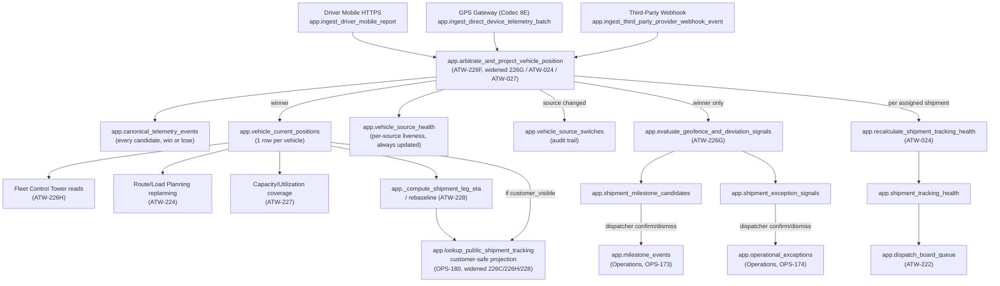

# Phase 5 Architecture Index and Canonical Telemetry Data Flow

**Produced by:** `CG-S10-ATW-028` (Prompt 247, Advanced TMS/WMS Documentation and Handoff), the PRODUCT/ARCHITECTURE/HANDOFF half of this checkpoint.
**Audience:** developers, support engineers, and downstream-phase agents who need to know what exists in Phase 5, how the three subsystems compose, and exactly how a GPS coordinate becomes a trusted vehicle position and a customer-visible tracking status.
**Source of truth:** the migrations and build logs cited inline. Where this document and a migration disagree, the migration is authoritative — this document explains and indexes it, it does not redefine it.
**Companion documents:** `docs/build-log/phase-05/ADVANCED_TMS_WMS_HANDOFF_PACKAGE.md` (the phase-closing index — start there), `docs/build-log/phase-05/guides/source-arbitration-and-fallback-explanation.md` (the deep dive on arbitration internals, not repeated here).

## 1. The three interacting subsystems

Phase 5 ships three subsystems that share one tenant/RLS/RBAC/audit foundation (Platform Core) and one Job Order → Shipment Order lifecycle (Phase 3, Operations) and Finance posting substrate (Phase 4), but are otherwise independently readable:

| Subsystem | Owns | Does not own |
|---|---|---|
| **Transport** (Advanced TMS) | Multi-leg/multimodal shipment structure, the dispatch board, fleet/vehicle/driver/device master data, route and load planning, first/middle/last-mile orchestration, capacity reservation | Warehouse operations; the raw telemetry ingestion/arbitration mechanism itself (consumes it) |
| **Tracking/Telemetry** (GPS and Telematics Integration) | All raw and canonical position data, source arbitration, geofence/route-deviation detection, the Fleet Control Tower UI, the customer-safe tracking projection | Any domain object's lifecycle (shipment status, milestone, exception) — it only supplies evidence and provenance into Operations' own already-`VERIFIED` canonical objects |
| **Warehouse Management** (WMS) | Item/UOM master, warehouse/zone/bin topology, inbound/receiving/putaway, the inventory ledger, lot/batch/serial/expiry, outbound demand/picking/packing/ship-execution, cycle count, label/barcode, warehouse billing events, customer inventory access, claim/incident | Transport execution; telemetry ingestion |

They compose, not fork: Transport's dispatch board and route/load planner *read* Tracking/Telemetry's canonical position; Tracking/Telemetry's geofence detector *writes into* Operations' pre-existing `app.milestone_events`/`app.operational_exceptions` rather than inventing a second event stream; WMS's claim/incident capability (`ATW-025`) extends that same `app.operational_exceptions` root for cargo-damage/loss cases, whether the loss happened in transit (Transport-sourced) or in a warehouse (WMS-sourced) — one canonical case table, never a duplicate root per domain.

## 2. Full capability list

All build logs live under `docs/build-log/phase-05/`. "Prompt" is the source document under `docs/ai-agent-build-prompt-package/10-phase-05-advanced-tms-wms/`; "Task ID" is the `CG-S10-ATW-0NN` identifier the execution index (`ADVANCED_TMS_WMS_EXECUTION_INDEX.md`) tracks it under. All 40 rows below are `VERIFIED` except this checkpoint (`247`) and the closure checkpoint that follows it (`248`).

### 2.1 Kickoff

| Task ID | Prompt | Capability | Build log |
|---|---|---|---|
| `CG-S10-ATW-001` | 220 | WBS and Runtime Kickoff (planning only, zero schema) | `ADVANCED_TMS_WMS_EXECUTION_INDEX.md` §1.1, `00_ADVANCED_TMS_WMS_WBS.md` |

### 2.2 Transport (Advanced TMS)

| Task ID | Prompt | Capability | Build log | What it real is |
|---|---|---|---|---|
| `CG-S10-ATW-002` | 221 | Multi-Leg and Multimodal Shipment | `ATW-221.md` | Ordered pickup/transfer/linehaul/delivery legs across land/air/sea over the existing `app.shipment_orders` root — never a second shipment root |
| `CG-S10-ATW-003` | 222 | Advanced Dispatch Board with Tracking Health | `ATW-222.md` | `app.dispatch_board_queue`, and the `app.shipment_tracking_health` table (deliberately empty/write-path-less until `ATW-024` wires its real writer — see §4) |
| `CG-S10-ATW-004` | 223 | Fleet, Vehicle, Driver, Device and SIM Operational Baseline | `ATW-223.md` | `app.vehicle_operational_profiles`, `app.driver_operational_profiles` (incl. `mobile_tracking_consent`), `app.gps_devices`, `app.sim_cards`, `app.device_vehicle_assignments`, `app.provider_vehicle_mappings`, `app.vehicle_tracking_source_priorities` — the master data every telemetry-source class resolves against |
| `CG-S10-ATW-005` | 224 | Route and Load Planning Using Canonical Position | `ATW-224.md` | Constraint-aware planning that re-plans against live vehicle position once it exists (`app.route_planning_position_staleness_tolerance_seconds`) |
| `CG-S10-ATW-006` | 225 | First-, Middle-, and Last-Mile Orchestration with Tracking Policy | `ATW-225.md` | `app.shipment_leg_tracking_policies`/`app.shipment_leg_tracking_sessions` — decides *whether* and *by which source* a leg should be tracked; entitlement is snapshotted but never a gate (`subscription-package-and-entitlement-guide.md` §5) |
| `CG-S10-ATW-008` | 227 | Capacity, Utilization and Tracking Coverage | `ATW-227.md` | `app.vehicle_capacity_reservations` (row-lock-then-sum overbooking prevention) plus `app.get_tenant_tracking_coverage`/`app.get_tenant_tracking_utilization_summary` — cross-cutting with Tracking/Telemetry |

### 2.3 Tracking/Telemetry (Multi-Source GPS and Telematics Integration, Prompt 226's nine-child decomposition, plus its own later high-volume and hardening work)

| Task ID | Capability | Build log | What it real is |
|---|---|---|---|
| `ATW-226A` | Tracking entitlement and source policy | `ATW-226A.md` | `app.is_shipment_tracking_entitled`, `app.resolve_tenant_tracking_package`, `app.tenant_tracking_source_policies` — see `subscription-package-and-entitlement-guide.md` |
| `ATW-226B` | Device, SIM, provider, installation, and mapping management | `ATW-226B.md` | `app.gps_device_installations` (evidence-mandatory install/verify on top of `ATW-223`'s own device status machine) |
| `ATW-226C` | Driver Mobile GPS session and HTTPS ingestion | `ATW-226C.md` | `app.driver_mobile_tracking_sessions`/`app.driver_mobile_position_reports`, `app.ingest_driver_mobile_report` — see `driver-mobile-tracking-guide.md` |
| `ATW-226D` | Always-on GPS Gateway and Teltonika Codec 8E adapter | `ATW-226D.md` | `app.direct_device_telemetry_reports`, `app.ingest_direct_device_telemetry_batch`, `app.resolve_gps_device_for_handshake`, and `services/gps-gateway/` (the raw TCP protocol server — see `docs/build-log/phase-05/guides/teltonika-codec8e-gateway-deployment-guide.md`) |
| `ATW-226E` | Third-party GPS platform adapter contract | `ATW-226E.md` | `app.third_party_provider_connections`, `app.third_party_telemetry_reports`, `app.ingest_third_party_provider_webhook_event`, HMAC-SHA256 signature verification |
| `ATW-226F` | Canonical telemetry storage, normalization, ordering, and source arbitration | `ATW-226F.md` | `app.canonical_telemetry_events`, `app.vehicle_current_positions`, `app.vehicle_source_health`, `app.vehicle_source_switches`, `app.arbitrate_and_project_vehicle_position` — the single entry point every raw ingestion path calls; see §4 below and `source-arbitration-and-fallback-explanation.md` |
| `ATW-226G` | Geofence, milestone, exception, and route-deviation signals | `ATW-226G.md` | `app.evaluate_geofence_and_deviation_signals`, `app.shipment_milestone_candidates`/`app.shipment_exception_signals` (staged review), confirm/dismiss into Operations' own `app.milestone_events`/`app.operational_exceptions` |
| `ATW-226H` | Fleet Control Tower, device administration, and sanitized projections | `ATW-226H.md` | `app.get_tenant_vehicle_tracking_overview` and the live Leaflet map UI; widens `app.lookup_public_shipment_tracking` — see `fleet-control-tower-and-customer-projection-guide.md` |
| `ATW-226I` | Deployment, observability, load, security, outage, and recovery verification (closing child) | `ATW-226I.md` | Re-derived integrated-verification evidence for the whole `226` family; sets `DEFERRED_EXTERNAL_HARDWARE_EVIDENCE` (device) / `CONDITIONALLY_SKIPPED_PROVIDER_UNAVAILABLE` (provider) formally |
| `CG-S10-ATW-024` | 243 — High-Volume TMS/WMS and Multi-Source Telemetry Controls | `ATW-024.md` | The real `app.shipment_tracking_health` writer (`app.recalculate_shipment_tracking_health`/`app.reconcile_shipment_tracking_health`), the per-vehicle/per-shipment `pg_advisory_xact_lock` concurrency fix, `scripts/load-tests/` |
| `CG-S10-ATW-027` | 246 — Advanced TMS/WMS Integrity and Security Hardening | `ATW-027.md` | 12 live-reproduced vulnerabilities across all 4 source classes, 10 fixed (1 Critical, 4 High, 4 Medium, 1 Low), 2 disclosed residuals (`ISS-2026-025`/`026`) — see §5 and the Handoff Package's own residual-risk section |

Prompt 228 (Advanced Milestone and Exception with Multi-Source Telemetry) sits at the Transport/Telemetry seam — listed here since its own subject matter is telemetry-derived provenance:

| Task ID | Prompt | Capability | Build log | What it real is |
|---|---|---|---|---|
| `CG-S10-ATW-009` | 228 | Advanced Milestone and Exception with Multi-Source Telemetry | `ATW-228.md` | `app.evaluate_telemetry_confidence_and_freshness`, `app.detect_shipment_leg_tracking_health_signals`, `app._compute_shipment_leg_eta`, `app.rebaseline_shipment_leg_schedule`; widens `app.lookup_public_shipment_tracking` with `live_eta_status`/`live_eta_at` |

### 2.4 Warehouse Management (WMS)

| Task ID | Prompt | Capability | Build log |
|---|---|---|---|
| `CG-S10-ATW-011A` (inserted) | — | Item/SKU and UOM Master | `ATW-011A.md`, `docs/adr/ADR-0019-canonical-item-sku-and-uom-master-identity.md` |
| `CG-S10-ATW-010` | 229 | Warehouse and Zone | `ATW-229.md` |
| `CG-S10-ATW-011` | 230 | Bin and Racking | `ATW-230.md` |
| `CG-S10-ATW-011B` (inserted) | — | Gap-Audit Remediation (warehouse/zone dependency hardening + `KNOWN_ISSUES.md` backfill) | `ATW-011B.md` |
| `CG-S10-ATW-012` | 231 | WMS Inbound | `ATW-012.md` |
| `CG-S10-ATW-015` | 234 | Inventory Ledger | `ATW-015.md` |
| `CG-S10-ATW-013` | 232 | WMS Receiving | `ATW-013.md` |
| `CG-S10-ATW-014` | 233 | WMS Putaway | `ATW-014.md` |
| `CG-S10-ATW-016` | 235 | Lot, Batch, Serial and Expiry | `ATW-016.md` |
| `CG-S10-ATW-016A` (inserted) | — | WMS Outbound Order (demand/confirmation slice extracted from Prompt 238) | `ATW-016A.md` |
| `CG-S10-ATW-017` | 236 | WMS Picking | `ATW-017.md` |
| `CG-S10-ATW-018` | 237 | WMS Packing | `ATW-018.md` |
| `CG-S10-ATW-019` | 238 | WMS Outbound (ship execution) | `ATW-019.md` |
| `CG-S10-ATW-020` | 239 | Cycle Count and Inventory Adjustment | `ATW-020.md` |
| `CG-S10-ATW-021` | 240 | Label and Barcode Operations | `ATW-021.md` |
| `CG-S10-ATW-022` | 241 | Warehouse Billing Events | `ATW-022.md` |
| `CG-S10-ATW-023` | 242 | Customer Inventory Access Contract | `ATW-023.md` |

### 2.5 Cross-cutting quality and closure

| Task ID | Prompt | Capability | Build log |
|---|---|---|---|
| `CG-S10-ATW-025` | 244 | Advanced Claim and Incident Operations | `ATW-025.md` |
| `CG-S10-ATW-026` | 245 | Advanced TMS/WMS Integrated Verification | `ATW-026.md` |
| `CG-S10-ATW-027` | 246 | Advanced TMS/WMS Integrity and Security Hardening | `ATW-027.md` |
| `CG-S10-ATW-028` | 247 | Advanced TMS/WMS Documentation and Handoff (this checkpoint) | `ADVANCED_TMS_WMS_HANDOFF_PACKAGE.md` (the index — start there) links out to this guide's 6 siblings, `STEPS_11_14_HANDOFF_CONTRACT.md`, and the concurrently-produced technical/runbook set |
| `CG-S10-ATW-029` | 248 | Advanced TMS/WMS Closure Verification (not yet run) | Only this row may set `PHASE_5_VERIFIED` |

## 3. Real application code locations (repository-wide conventions Phase 5 reuses, not reinvents)

- `supabase/migrations/202607292*` through `202607307*` — all 42 Phase 5 migrations (95 pre-Phase-5 + 42 = 137 total repository-wide as of `ATW-027`).
- `server/contracts/<capability>/`, `server/queries/<capability>.ts`, `server/mutations/<capability>.ts` — the same Zod-schema / two-client (`authenticated` RLS-scoped vs. `service_role`) pattern every prior phase established. No REST/GraphQL live route exists for any Phase 5 capability (`PLT-130` remains contract/logging infrastructure only, unchanged since Platform Core).
- `app/(tenant)/[tenantSlug]/operations/{dispatch-board,fleet,fleet-control-tower,route-load-planning,...}/`, `app/(tenant)/[tenantSlug]/admin/tracking/`, `app/(tenant)/[tenantSlug]/warehouse/...` (WMS) — Server Component pages behind `resolveOperationsAccessForRequest`/`resolveTenantAdminAccessForRequest`, Server Actions in a sibling `actions.ts`.
- `app/(public)/tracking/[token]/page.tsx` — the one deliberately-anonymous, pre-authentication customer tracking route (Operations' `OPS-180`, widened by `ATW-226C`/`226H`/`228`).
- `app/api/tracking/driver-mobile/route.ts` — the first real HTTP API route this repository built (`ATW-226C`); a `service_role`-backed `POST` handler, never a resource REST/GraphQL surface.
- `services/gps-gateway/` — the standalone always-on Node process speaking raw TCP Teltonika Codec 8 Extended (`src/codec8e.ts`, `src/buffer.ts`, `src/server.ts`, `src/ingestClient.ts`, `src/logger.ts`); `docs/build-log/phase-05/guides/teltonika-codec8e-gateway-deployment-guide.md` and `docs/build-log/phase-05/guides/gps-gateway-endpoints-firewall-health-metrics-scaling-guide.md` cover its deployment/operation in depth — not duplicated here.
- `scripts/db-tests/advanced-tms-*.sql`, `advanced-tms-wms-*.sql` — 36 Phase 5 db-test files (of 133 total repository-wide) plus `wms-picking-concurrency-helper.sh`; see the Handoff Package §3.3 for the full evidence accounting.
- `scripts/load-tests/` — the real concurrency/recovery harness `ATW-024` added (`ISS-2026-014`'s own core claim), covering `app.post_inventory_movement`, WMS pick/putaway claiming, `app.claim_next_job` under backlog, GPS telemetry ingestion, and a genuine client `SIGKILL` + Postgres cluster restart.

## 4. Canonical telemetry data flow, end to end

This is the one mechanism every Transport and customer-facing tracking surface in Phase 5 ultimately depends on. Read the real migrations for the authoritative text — `supabase/migrations/20260729390000_create_advanced_tms_canonical_telemetry_arbitration.sql` (`ATW-226F`, the base), `20260730320000_create_advanced_tms_shipment_tracking_health_writer.sql` (`ATW-024`, adds the tracking-health writer plus concurrency locks), `20260730350000_harden_advanced_tms_third_party_hybrid_tracking.sql` and `20260730360000_harden_advanced_tms_device_driver_mobile_tracking.sql` (both `ATW-027`, the current, latest bodies of the ingestion/arbitration functions).

### 4.1 Ingestion — three source classes, each raw-storing before anything else happens

| Source class | Entry point | Caller identity | Raw table |
|---|---|---|---|
| `driver_mobile` | `app.ingest_driver_mobile_report` | `anon` (bearer token, no Supabase Auth identity — drivers hold no CargoGrid login) | `app.driver_mobile_position_reports` |
| `direct_device` | `app.ingest_direct_device_telemetry_batch` | `service_role`, called only from `services/gps-gateway/` (API-key-authenticated) | `app.direct_device_telemetry_reports` |
| `third_party_platform` | `app.ingest_third_party_provider_webhook_event` | `anon` (HMAC-SHA256-signed webhook) | `app.third_party_telemetry_reports` |

Every one of these three functions **always completes its own raw insert first**, regardless of whether canonicalization later succeeds. This is a deliberate, disclosed design invariant (`20260729390000`'s own design note 2): "canonicalization never breaks raw ingestion." Vehicle resolution (`app.resolve_vehicle_for_driver_mobile_session`/`app.resolve_vehicle_for_gps_device`, or the third-party path's `app.provider_vehicle_mappings` lookup) returns `null` — never raises — when no current resource assignment/device mapping exists, and the canonicalization call is simply skipped in that case.

### 4.2 Canonicalization — the single entry point

After its own raw insert commits, each of the three functions above calls exactly one function: `app.arbitrate_and_project_vehicle_position(tenant_id, vehicle_master_id, source_type, source_report_id, event_at, received_at, location, speed_kmh, heading_degrees, accuracy_meters)`. This is the one canonical normalization/arbitration service `226_GPS_TELEMATICS_INTEGRATION_PROMPT.md` §14 requires ("all modes call one canonical normalization and source-arbitration service") — there is no second arbitration path anywhere in the schema.

The full, current (post-`ATW-027`) decision order inside that function, evaluated top to bottom, first match wins:

1. `source_disabled` — the source is disabled for this vehicle (`app.resolve_vehicle_source_priority_rank` returns `null`: either explicitly disabled per-vehicle, `ATW-223`, or absent from the tenant's own default priority array, `ATW-226A`).
2. `heartbeat_no_location` — a heartbeat report carries no location; it still updates `vehicle_source_health` (liveness) but cannot win arbitration.
3. `event_time_implausible_future` — **added at `ATW-027`**: `p_event_at` is more than 24 hours ahead of `clock_timestamp()`. Evaluated unconditionally, including on the very first report ever received for a vehicle (the "bootstrap" path) — see `source-arbitration-and-fallback-explanation.md` §3 for why this exists.
4. `accuracy_below_threshold` — reported accuracy exceeds the tenant's `accuracy_threshold_meters` (`app.tenant_tracking_source_policies`, default 100m).
5. `stale_event_time` — the candidate's `event_at` is not strictly newer than the current position's own `event_at` (current position must never move backward).
6. `impossible_movement` — implied speed between this source's own last-known position (`app.vehicle_source_health.last_location`) and the candidate exceeds 200 km/h.
7. If none of the above rejected the candidate and a current position already exists from a **different** source: cross-source switch logic — the incoming source wins only if it has a strictly higher priority rank, or the current source has gone stale past `freshness_threshold_seconds` (default 300s) — **and** no switch has happened for this vehicle within the last `switch_hysteresis_seconds` (default 120s), else `switch_suppressed`.
8. Otherwise (no current position, or same source continuing): applies.

Every candidate is stored in `app.canonical_telemetry_events` regardless of outcome — a rejected row carries its own `rejection_reason`, never silently dropped (`226_*.md` §23: "never silently drop accepted data"). A winning candidate additionally:

- Upserts `app.vehicle_current_positions` (one row per vehicle — the sole "where is this vehicle right now" answer).
- Inserts an `app.vehicle_source_switches` row when the winning source differs from the prior one (`reason` ∈ `bootstrap`/`higher_priority_source_available`/`current_source_stale_fallback`, with the exact ranks/thresholds recorded as `evidence` jsonb — "reproducible from stored policy and evidence").

`app.vehicle_source_health` (per vehicle+source liveness) is updated **unconditionally on every candidate, win or lose** — "even a rejected/disabled-source report is real evidence the source is alive" (`20260729390000`'s own table comment). This is also the origin of the disclosed residual risk `ISS-2026-025` — see the Handoff Package's residual-risk section and `source-arbitration-and-fallback-explanation.md`.

Concurrency: since `ATW-024`, the whole function is wrapped in a per-vehicle `pg_advisory_xact_lock` (closing a live-reproduced TOCTOU race proven against 59,534 concurrent transactions), and the transitive tracking-health recompute below is wrapped in its own per-shipment lock.

### 4.3 Consumers — what reads the canonical position

| Consumer | Reads | Detail |
|---|---|---|
| `app.shipment_tracking_health` / dispatch board | `app.recalculate_shipment_tracking_health` (`ATW-024`) resolves the shipment's assigned vehicle via `app.resource_assignments` (role=`vehicle`), reuses `app.get_vehicle_source_health`'s freshness classification, and derives `tracking_status` (`not_tracked`/`tracked`/`stale`/`degraded`/`conflict`) | `app.dispatch_board_queue` (`ATW-222`) already projects every one of these columns; no duplicate read RPC exists |
| Geofence/milestone/exception signals | `app.evaluate_geofence_and_deviation_signals` (`ATW-226G`), called only for a winning candidate | Writes staged `app.shipment_milestone_candidates`/`app.shipment_exception_signals`; a dispatcher's `confirm_*`/`dismiss_*` call is what actually creates a real `app.milestone_events`/`app.operational_exceptions` row — telemetry never mutates the shipment lifecycle directly |
| Live ETA | `app._compute_shipment_leg_eta`/`app.get_shipment_leg_eta_projection`/`app.rebaseline_shipment_leg_schedule` (`ATW-228`) | Feeds both the dispatcher-facing projection and the customer-safe `live_eta_status`/`live_eta_at` fields |
| Fleet Control Tower | `app.get_tenant_vehicle_tracking_overview`, `app.get_tenant_pending_milestone_candidates`, `app.get_tenant_pending_exception_signals` (`ATW-226H`) | Tenant-wide aggregating reads for the live map + review-queue UI; see `fleet-control-tower-and-customer-projection-guide.md` |
| Customer-safe projection | `app.lookup_public_shipment_tracking` (`OPS-180`, widened at `ATW-226C`/`226H`/`228`) | Gated on the currently-executing leg's own `customer_visible` tracking-policy flag; see `fleet-control-tower-and-customer-projection-guide.md` |
| Route/load planning | `app.get_vehicle_current_position` via `ATW-224`'s own replanning path | `app.route_planning_position_staleness_tolerance_seconds` governs when a stale position is ignored for replanning purposes |
| Capacity/utilization | `app.get_tenant_tracking_coverage`/`app.get_tenant_tracking_utilization_summary` (`ATW-227`) | Reporting-oriented reads, not a gate on any write path |

## 5. Known boundaries on this flow (see the Handoff Package for the full residual-risk list)

- **`ISS-2026-018`** (Low, `OPEN`): `app.recalculate_shipment_tracking_health` resolves the authoritative vehicle at the shipment-order level (`app.resource_assignments`) only, never via `app.shipment_leg_tracking_sessions`'s own per-leg precedence chain — for a multi-leg shipment serviced by genuinely different vehicles over time, tracking health reflects "the" shipment-level assignment, not the currently-active leg's own handoff state.
- **`ISS-2026-025`** (Medium, `OPEN`): the "salami-slicing" residual on `app.vehicle_source_health.last_location` — see `source-arbitration-and-fallback-explanation.md` §4.
- **`ISS-2026-009`**'s original wording (leg-tracking-session precedence) is `RESOLVED` for its own core claim (a real writer exists); the residual above is what remains.
- No REST/GraphQL surface exists for any Phase 5 read/write path — every consumer above is a direct RPC call from the TypeScript service layer, matching the repository-wide convention unchanged since Platform Core.
